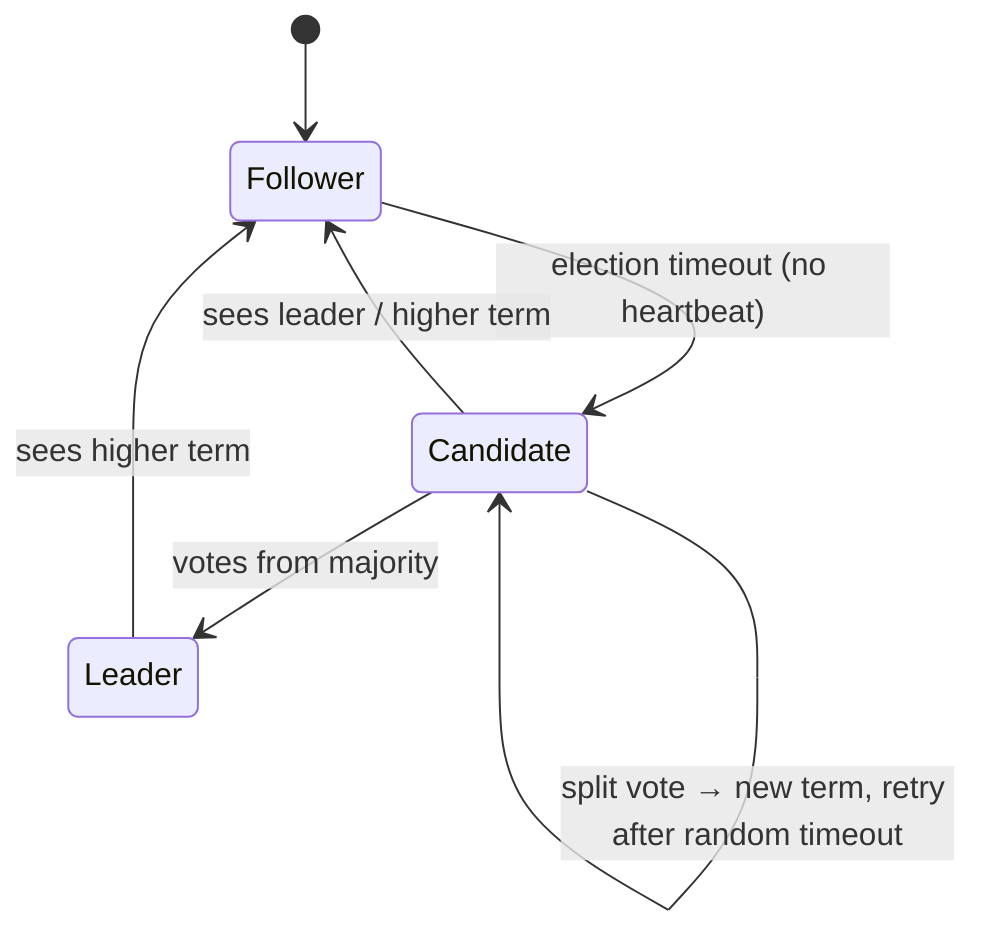
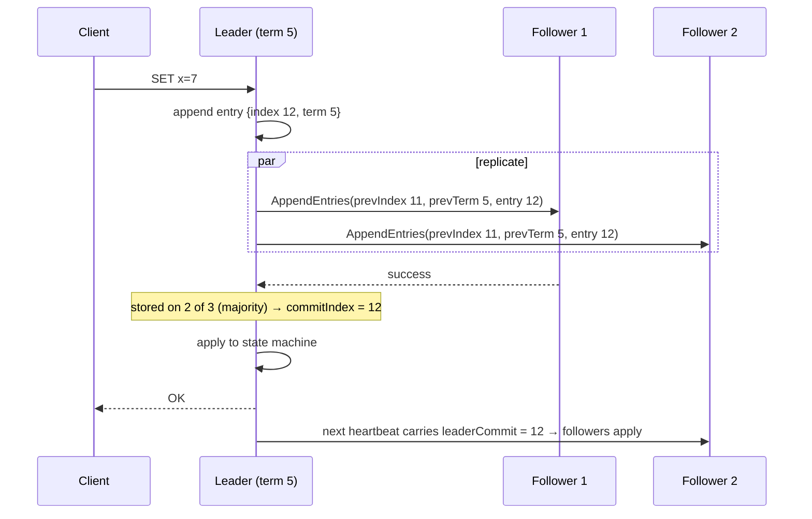
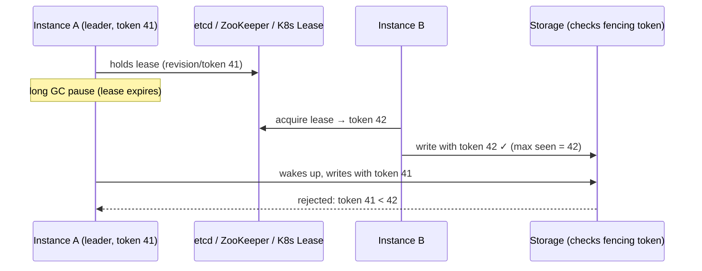

# Consensus Basics (Raft, Leader Election)

!!! abstract "Key takeaways"
    - **Consensus** gets a group of nodes to **agree on a value**, or on a sequence of values (a **replicated log**), despite crashes and message loss. It's the foundation for **leader election, distributed locks, configuration, membership and linearisable storage**.
    - **It tolerates f failures with 2f + 1 nodes** (a majority quorum): 3 nodes tolerate 1 failure, 5 tolerate 2. The minority side of a partition **stops making progress** (CP). Safety is never violated, and liveness needs a working majority and timeouts (FLP).
    - **Raft:**
        - Nodes are **followers, candidates or a leader**, in numbered **terms**. Followers time out (randomised 150–300 ms by default in the paper) and start an election. A candidate needs **votes from a majority**, and a vote is granted only if the candidate's log is **at least as up-to-date**.
        - The leader **replicates log entries** with AppendEntries. An entry is **committed** once stored on a majority, then applied to the state machine. The **log matching** and **leader completeness** properties guarantee every committed entry survives leader changes.
    - **Linearisable reads** need the leader to confirm it's still leader (**ReadIndex** with a heartbeat round) or to use **leader leases** (which depend on bounded clock drift).
    - **Applications rarely implement consensus.** They use **etcd / ZooKeeper / Consul / Kubernetes Lease** for leader election and locks, and they **must use fencing tokens** (term, revision or zxid) because a paused ex-leader can still act.

## Why it matters

Kafka (KRaft), Kubernetes (etcd), MongoDB replica sets, CockroachDB, Consul and ZooKeeper all run on consensus. Interviewers ask "how does leader election work?", "why an odd number of nodes?", "what happens in a partition?" and "how do you make sure only one instance runs the job?". Knowing Raft at a whiteboard level, plus the **fencing** caveat, separates solid answers from hand-waving.

## Core concepts

### What consensus guarantees

- **Agreement:** no two nodes decide different values (or committed log entries).
- **Validity:** the decided value was proposed by someone.
- **Integrity:** decide at most once.
- **Termination:** non-faulty nodes eventually decide (requires partial synchrony, by FLP).

**Equivalent problems:** atomic broadcast (total order broadcast), linearisable compare-and-set registers, leader election with a single valid leader, and atomic commit, which is related but different (2PC needs every participant to vote yes).

### Raft roles and terms


*Notice that **terms** act as a logical clock. Any node that sees a higher term immediately steps down to follower. **Randomised timeouts** make split votes rare: usually one follower times out first and wins.*

**Voting rules** (each node votes at most once per term):

- The candidate's term must be ≥ the voter's current term.
- The voter hasn't voted for someone else in this term.
- The candidate's log is **at least as up-to-date**: a higher last log term, or the same last term with a log index ≥ the voter's. This rule ensures the new leader already has every committed entry (**leader completeness**).

### Log replication and commit


*Notice the consistency check: each AppendEntries carries the **previous entry's index and term**. A follower rejects it if they don't match, and the leader backs up until the logs agree, then overwrites the follower's conflicting suffix. That's how logs converge (the log matching property).*

**Key properties:**

- **Log matching:** if two logs have an entry with the same index and term, the logs are identical up to that index.
- **Leader completeness:** a committed entry is present in the logs of all future leaders.
- **A leader only commits entries from its own term by counting replicas.** Earlier-term entries become committed indirectly. This subtle rule (Figure 8 in the Raft paper) prevents a committed-looking entry from being overwritten.

### Reads, membership and snapshots

- **Linearisable reads:**
    - **ReadIndex:** the leader records its commit index, confirms leadership with a heartbeat round to a majority, waits until applied, then serves the read.
    - **Lease reads:** skip the round trip, but rely on bounded clock drift.
    - Followers can serve reads after asking the leader for the ReadIndex.
- **Membership changes:** add or remove one server at a time, or use **joint consensus**, so two disjoint majorities can never exist during reconfiguration.
- **Log compaction:** periodic **snapshots** plus truncating the log. New or slow followers get an InstallSnapshot.

### Raft vs Paxos vs ZAB

| | Raft | (Multi-)Paxos | ZAB (ZooKeeper) |
|---|---|---|---|
| Design goal | Understandability | Minimal, proven core | Primary-backup atomic broadcast |
| Leader | Strong leader, log flows leader → followers | Optional (Multi-Paxos uses a distinguished proposer) | Leader with epochs |
| Used by | etcd, Consul, CockroachDB, TiKV, KRaft (Kafka), MongoDB (Raft-like) | Chubby, Spanner (Paxos groups) | ZooKeeper (old Kafka metadata) |

### How applications should use consensus


*Notice that leader election alone **can't stop** a paused ex-leader from acting. Only a **fencing token** (a monotonic term, revision or zxid) checked by the resource makes the old leader's writes harmless.*

**Options:**

- **Kubernetes Lease** objects (client-go leader election, Spring Cloud Kubernetes leader).
- **etcd** election API or leases.
- **ZooKeeper** ephemeral sequential nodes (Curator `LeaderLatch`/`LeaderSelector`).
- **Consul** sessions.
- For "run this job once", a **DB lock** (ShedLock) is often enough. It isn't consensus, but the DB is already the single source of truth.

## In practice: code & configuration

=== "❌ Common mistake"
    ```java
    // "Leader election" via a Redis key with TTL and no fencing: a paused leader keeps writing.
    if (redis.setIfAbsent("leader", instanceId, Duration.ofSeconds(10))) {
        while (true) {
            processBatch();                 // GC pause > 10s → another instance becomes leader
            redis.expire("leader", Duration.ofSeconds(10));   // renews even if someone else took over
        }
    }
    ```

=== "✅ Correct approach"
    ```java
    // Use a consensus-backed coordinator (here: Curator over ZooKeeper) and pass a fencing token.
    LeaderSelector selector = new LeaderSelector(curator, "/jobs/rx-reconciler", new LeaderSelectorListenerAdapter() {
        @Override
        public void takeLeadership(CuratorFramework client) throws Exception {
            // Bump an epoch node on every new leadership: its version is a monotonic fencing token.
            long token = client.setData().forPath("/jobs/rx-reconciler-epoch", new byte[0]).getVersion();
            while (!Thread.currentThread().isInterrupted()) {
                reconciler.runOnce(token);  // storage rejects writes whose token < highest seen
            }
        }   // returning or losing the session relinquishes leadership
    });
    selector.autoRequeue();
    selector.start();
    ```

    ```sql
    -- Storage-side fencing: only accept writes from the newest leader epoch.
    UPDATE job_state
       SET last_run = now(), fencing_token = :token
     WHERE job = 'rx-reconciler' AND fencing_token <= :token;   -- 0 rows → stale leader, abort
    ```

A minimal Raft vote handler (the core rule, compiled on Java 21):

```java
record VoteRequest(long term, String candidateId, long lastLogIndex, long lastLogTerm) {}
record VoteResponse(long term, boolean granted) {}

final class RaftNode {
    private long currentTerm;
    private String votedFor;                 // persisted with currentTerm before replying
    private long lastLogIndex, lastLogTerm;

    synchronized VoteResponse onRequestVote(VoteRequest r) {
        if (r.term() < currentTerm) return new VoteResponse(currentTerm, false);  // stale candidate
        if (r.term() > currentTerm) { currentTerm = r.term(); votedFor = null; }   // step down to follower
        boolean logOk = r.lastLogTerm() > lastLogTerm
                || (r.lastLogTerm() == lastLogTerm && r.lastLogIndex() >= lastLogIndex); // up-to-date check
        boolean canVote = votedFor == null || votedFor.equals(r.candidateId());
        if (logOk && canVote) { votedFor = r.candidateId(); return new VoteResponse(currentTerm, true); }
        return new VoteResponse(currentTerm, false);
    }
    void setLog(long index, long term) { lastLogIndex = index; lastLogTerm = term; }
}
```

## Real-world usage

- **Kubernetes:** all cluster state lives in **etcd** (Raft). Controllers use **Lease** objects for leader election (kube-scheduler, controller-manager). Run 3 or 5 etcd members.
- **Kafka KRaft:** ZooKeeper was removed in Kafka 4.0. A Raft quorum of controllers manages metadata.
- **MongoDB:** replica-set elections use a Raft-like protocol (terms, majority votes, priority).
- **Spanner / CockroachDB / TiDB:** many Raft or Paxos groups (one per data range), plus transactions across groups.
- **Failure lessons:**
    - Even-sized clusters waste a node (4 tolerates 1 failure, like 3).
    - Cross-Region consensus adds latency to every write.
    - Disk fsync latency directly limits throughput, so etcd needs fast disks.
    - Leader-only work without fencing has caused duplicate processing in many systems.

## Trade-offs & production gotchas

| Choice | Pros | Cons | Use when |
|---|---|---|---|
| 3-node quorum | Tolerates 1 failure, low latency | 1 failure from losing quorum | Most clusters |
| 5-node quorum | Tolerates 2 failures | More replication traffic, higher write latency | Critical control planes |
| Cross-Region quorum | Survives a Region loss | Every commit pays inter-Region RTT | Global strongly consistent data |
| ReadIndex reads | Linearisable without clock assumptions | Extra round trip | Correctness-critical reads |
| Lease reads | Fast | Unsafe with clock jumps | Latency-sensitive reads, good clocks |
| DB lock (ShedLock) | Simple, uses existing DB | Not general consensus, still needs care | "Run once" schedulers |

!!! warning "Gotchas"
    - **Even numbers of nodes** add cost without fault tolerance.
    - **Don't spread 3 nodes across 2 AZs** (2 + 1): losing the 2-node AZ loses the quorum. Use 3 AZs.
    - **Consensus systems are for small, critical metadata,** not bulk data. Keep etcd and ZooKeeper payloads small.
    - **Leader election ≠ mutual exclusion on resources.** Use fencing tokens.

## How this connects to my experience

- **Where I used it:**
    - Kubernetes (EKS/AKS): etcd underneath, Lease-based leader election for controllers.
    - Kafka at OptumRx (controller quorum or ZooKeeper, partition leaders/ISR).
    - MongoDB replica sets (elections).
    - Scheduled and background jobs in horizontally scaled Spring services.
- **Talking points:**
    - "Our services ran several replicas, so scheduled jobs needed single execution: ShedLock on the DB, or Kubernetes Lease-based leader election." *[confirm: mechanism used]*
    - "I think about Kafka partitions as per-partition leadership with ISR replication. Broker failure triggers a leader change, and consumers and producers handle it with retries and idempotence."
    - "For anything that must not run twice, the target system needs to enforce it (unique keys, fencing tokens, idempotency), not just the lock."
- **Likely follow-up chain:** "How did you make sure one instance runs the job?" → "What if that instance pauses?" → "Why does etcd need 3 or 5 nodes?" → "What happens in a partition?" Answer: ShedLock or Lease → fencing tokens or idempotent job steps → majority quorum 2f+1 → the minority stops, and the majority continues.

## Interview questions

### Fundamentals

??? question "Q1. What problem does consensus solve?"
    **Answer:** Getting multiple nodes to agree on a value or an ordered log despite crashes and message loss. It's used for leader election, replicated state machines (linearisable storage), configuration and locks.

    **Interviewer listens for:** a replicated log and its use cases.

    **Common wrong answer:** "voting on the best server".

??? question "Q2. Why do consensus clusters have an odd number of nodes?"
    **Answer:** A majority quorum is needed: 2f+1 nodes tolerate f failures. 3 tolerates 1, and 4 still tolerates only 1 (the majority is 3), so the extra node adds cost and replication latency without adding fault tolerance.

    **Interviewer listens for:** the majority maths.

    **Common wrong answer:** "to avoid ties" (partly, but the main reason is quorum maths).

??? question "Q3. How does Raft elect a leader?"
    **Answer:**
    1. A follower that hears no heartbeat within its randomised election timeout increments its term, becomes a candidate, votes for itself and requests votes.
    2. Nodes grant one vote per term, only to candidates whose log is at least as up-to-date.
    3. A majority makes it leader, and it sends heartbeats.
    4. A split vote causes a new term after another random timeout.

    **Interviewer listens for:** terms, randomisation, the up-to-date check.

    **Common wrong answer:** "the node with the highest ID".

??? question "Q4. When is a Raft log entry committed?"
    **Answer:** When the leader has replicated it to a majority (and it's from the leader's current term; earlier entries are committed indirectly). Committed entries are then applied to the state machine, and followers learn the commit index through AppendEntries.

    **Interviewer listens for:** a majority plus the current-term subtlety.

    **Common wrong answer:** "when all nodes have it".

### Intermediate

??? question "Q5. What happens during a network partition in a 5-node Raft cluster split 3/2?"
    **Answer:** The 3-node side has a majority: it keeps or elects a leader and continues committing. The 2-node side can't elect a leader or commit, so writes there fail (CP). If the old leader was on the minority side, it can't commit, and it steps down when it sees the higher term after the partition heals. Its uncommitted entries are overwritten.

    **Interviewer listens for:** majority progress, minority unavailability.

    **Common wrong answer:** "both sides keep working".

??? question "Q6. How do you serve linearisable reads in Raft?"
    **Answer:** Not by reading a follower's local state. Use **ReadIndex** (the leader confirms leadership through a heartbeat round, waits until the applied index ≥ the commit index, then serves), or **lease reads** (the leader assumes leadership within a lease and needs bounded clock drift), or put reads through the log.

    **Interviewer listens for:** why plain leader reads can be stale (a deposed leader).

    **Common wrong answer:** "read from any node".

??? question "Q7. Raft vs Paxos?"
    **Answer:** Both solve consensus with majority quorums. Raft was designed for understandability: a strong leader, clear election and log replication phases, and membership changes. Multi-Paxos is more general and minimal, but harder to implement correctly. ZooKeeper's ZAB is a similar leader-based atomic broadcast.

    **Interviewer listens for:** the practical difference.

    **Common wrong answer:** "Raft is faster".

??? question "Q8. Why use etcd or ZooKeeper instead of implementing consensus yourself, and what primitives do they give you?"
    **Answer:** Consensus is easy to get subtly wrong (membership changes, log compaction, read safety), so you reuse a proven implementation. They provide: a **linearisable key-value store**; **compare-and-set / transactions** (etcd `Txn` on revision, ZooKeeper versioned `setData`); **leases / ephemeral nodes** that disappear when a client's session dies; **watches** to react to changes; and monotonically increasing **revisions / zxids** you can use as fencing tokens. Leader election, service locks and configuration distribution are built from these primitives (Curator recipes, etcd `concurrency` package).

    **Interviewer listens for:** not rolling your own Raft, CAS, leases/ephemerals, watches, revisions as fencing tokens.

    **Common wrong answer:** "Use etcd as a general database." It is designed for small, critical coordination data, not high-volume application data.

### Senior

??? question "Q9. Why isn't leader election enough to protect a shared resource?"
    **Answer:** A leader can be paused (GC, VM stall) past its lease. Meanwhile a new leader is elected, then the old one resumes and acts. The resource must verify **fencing tokens** (a monotonic term, lease revision or zxid) and reject stale ones. Or the operations must be idempotent or conditional on state.

    **Interviewer listens for:** fencing tokens.

    **Common wrong answer:** "use a shorter lease".

??? question "Q10. How are Raft membership changes made safely?"
    **Answer:** Change one server at a time (any two majorities of consecutive configurations overlap), or use **joint consensus**: a transitional configuration requiring majorities of both old and new sets, so two disjoint majorities can't exist. New servers catch up as non-voting learners first.

    **Interviewer listens for:** avoiding disjoint majorities.

    **Common wrong answer:** "update the config file and restart".

### Scenario-based

??? question "Q11. A nightly reconciliation job ran twice and double-posted adjustments. You use a Redis lock. What's wrong and how do you fix it?"
    **Answer:**
    - **What's wrong:** the lease expired during a long pause or a slow run, a second instance acquired it, and the first continued. There was no fencing, and the job steps weren't idempotent.
    - **Fix:**
        - fencing tokens checked at the DB (conditional updates)
        - idempotent posting (a unique `(jobRunId, accountId)` constraint)
        - lock renewal with ownership checks
        - or a consensus-based coordinator (etcd/ZooKeeper/K8s Lease) or a DB-based lock (ShedLock) on the same DB as the data
    - Alert when runs overlap.

    **Interviewer listens for:** fencing + idempotency.

    **Common wrong answer:** "increase the TTL".

??? question "Q12. Where should you place 3 etcd nodes for a production Kubernetes cluster?"
    **Answer:** One per AZ across 3 AZs (losing any one AZ keeps the quorum), on low-latency fast disks (fsync latency matters), not co-located with noisy workloads. Back them up regularly. Managed control planes (EKS) do this for you.

    **Interviewer listens for:** AZ spread and disk performance.

    **Common wrong answer:** "all in one AZ for latency".

## Cheat sheet

| Concept | Remember |
|---|---|
| Quorum | 2f+1 nodes tolerate f failures. Odd sizes. 3 AZs for 3 nodes |
| Raft roles | Follower → candidate → leader. Terms are the logical clock. A higher term means step down |
| Election | Randomised timeouts, 1 vote/term, the candidate's log must be at least as up-to-date |
| Replication | AppendEntries with prevIndex/prevTerm check. Committed on a majority (current term) |
| Safety | Log matching, leader completeness |
| Reads | ReadIndex or lease reads for linearisability |
| Membership | One at a time or joint consensus |
| Partition | Majority continues, minority stalls (CP) |
| Apps | Use etcd/ZooKeeper/Consul/K8s Lease + **fencing tokens** |
| Users | Kubernetes, KRaft, MongoDB, CockroachDB, Consul |

## Sources
1. [Ongaro & Ousterhout: In Search of an Understandable Consensus Algorithm (Raft, USENIX ATC 2014)](https://raft.github.io/raft.pdf) and [raft.github.io](https://raft.github.io/).
2. Martin Kleppmann, *Designing Data-Intensive Applications*, ch. 9 "Consistency and Consensus".
3. [Leslie Lamport: Paxos Made Simple](https://lamport.azurewebsites.net/pubs/paxos-simple.pdf).
4. [etcd documentation: how etcd works / hardware recommendations](https://etcd.io/docs/latest/op-guide/hardware/).
5. [Kubernetes: Leases and leader election](https://kubernetes.io/docs/concepts/architecture/leases/).
6. [Apache Kafka: KRaft mode](https://kafka.apache.org/documentation/#kraft).
7. [Apache Curator recipes: Leader election](https://curator.apache.org/docs/recipes-leader-election/).
8. [Martin Kleppmann: How to do distributed locking](https://martin.kleppmann.com/2016/02/08/how-to-do-distributed-locking.html): fencing tokens.
