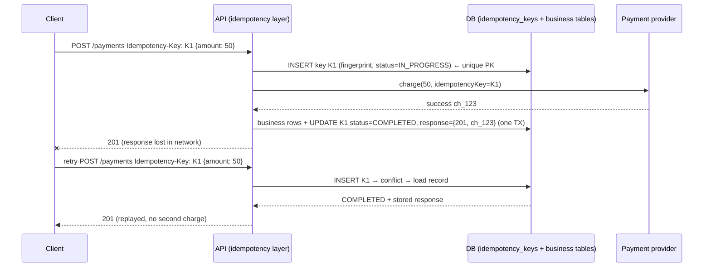
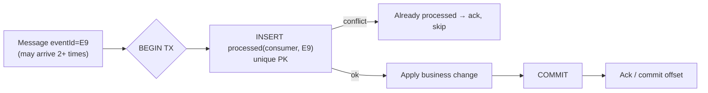

# Idempotency & Idempotency Keys

!!! abstract "Key takeaways"
    - **Idempotent** means doing an operation **once or many times has the same effect** (the *response* may differ, the *state change* must not). It's what makes **retries** and **at-least-once delivery** safe, and those are unavoidable in distributed systems (timeouts mean unknown outcomes).
    - **HTTP semantics:** `GET`, `HEAD`, `PUT`, `DELETE` and `OPTIONS` are defined as idempotent. **`POST` isn't.** `PATCH` isn't guaranteed. Your implementation must still honour the semantics (a `PUT` that appends breaks it).
    - **Engineered idempotency** for creates and side effects: the client sends a unique **`Idempotency-Key`** (UUID per logical operation). The server stores **key → request fingerprint + status + response**, with a **unique constraint**:
        - Repeats return the **stored response**.
        - The same key with a **different body** gets **422**.
        - A concurrent in-flight duplicate gets **409** (or waits).
        - Keys **expire** (e.g. 24 h+).
    - **Consumers** (Kafka, SQS) are idempotent through a **processed-message table in the same transaction** as the business change, **conditional upserts**, or **version checks**. Producers use Kafka's **idempotent producer** (`enable.idempotence=true`) for broker-side dedup per partition.
    - **Propagate keys to third parties** (payment providers, SMS, partner APIs) so the whole chain is idempotent. Derive keys **deterministically** from business identity (`order-42-charge`) when the caller can't remember a random one.

## Why it matters

Every retry policy, every message queue and every "unknown outcome after a timeout" depends on idempotency. Without it, retries cause double charges, duplicate prescriptions, repeated SMS and over-counted inventory. Interviewers expect the **full design**: key generation, storage schema, concurrency between duplicates, response replay, expiry, and what happens when the side effect is in another system. This is a resume topic (Kafka retry and DLQ workflows).

## Core concepts

### Kinds of idempotency

| Kind | Example | Idempotent? |
|---|---|---|
| Natural (set state) | `SET status = 'SHIPPED'`, `PUT /users/42 {…full…}` | Yes |
| Natural (delete) | `DELETE /holds/7` (second call → 404 or 204, same state) | Yes (state-wise) |
| Increment / append | `balance += 10`, `INSERT INTO ledger …`, `POST /orders` | **No**, needs engineering |
| Conditional | `UPDATE … SET v=v+1 WHERE version = 3` | Yes (a second attempt fails the condition) |
| Upsert by business key | `INSERT … ON CONFLICT (order_id) DO NOTHING` | Yes |

### The idempotency-key flow


*Notice the three protections: a **unique key** blocks the second insert, the **stored response** is replayed instead of re-executing, and the **key is passed to the provider**, so even a crash between charging and recording can't create a second charge.*

**Design decisions:**

| Decision | Recommendation |
|---|---|
| Who generates the key | The client, per **logical operation** (a UUID kept across retries), or deterministic from business IDs |
| Scope | Per tenant/user + endpoint (`(tenant_id, key)` unique), so keys can't collide across customers |
| Fingerprint | Hash of a canonical request body (+ method/path). Mismatch → **422** |
| Concurrency | Insert the key **first** with `IN_PROGRESS`. A concurrent duplicate → **409 Conflict** (client retries later), or block briefly |
| What to store | Status, response code, body (or a resource ID to re-render), timestamps |
| Failures | Retryable failure (5xx before any side effect) → delete or mark the key retryable. Non-retryable (4xx validation) → store and replay the error |
| Expiry | TTL (e.g. 24 h–7 d) longer than any client retry window |
| Standard | IETF draft `Idempotency-Key` HTTP header field (Stripe-style semantics) |

### Idempotent message consumers


*Notice that the dedup record and the business change commit **atomically**. If the consumer crashes before the ack, the redelivered message hits the unique key and is skipped. If it crashes before the commit, both roll back and the retry processes it properly.*

**Techniques:**

- **Processed-message table** (as above) in the same DB as the business data. Use TTL or partitioned cleanup.
- **Upserts / conditional writes** keyed by a business ID (`ON CONFLICT DO NOTHING`, DynamoDB `attribute_not_exists`, MongoDB `updateOne` with upsert + a filter on version).
- **Version / sequence checks:** apply an event only if `event.version == current.version + 1` (or ≥ for last-writer semantics). Drop stale events.
- When the side effect is **external** (email, SMS, partner API), pass a key or use a dedup store checked **before** sending, and accept a tiny window or use provider idempotency.

**Kafka producer idempotence:** `enable.idempotence=true` (the default since Kafka 3.0) attaches a producer ID + sequence number per partition, so the broker drops duplicate retries. That's **producer → broker only**, not end to end. Transactions extend it to atomic read-process-write within Kafka.

### Where idempotency breaks

- **Keys generated per attempt** instead of per operation: every retry gets a new key, so nothing is deduped.
- **Check-then-insert** without a unique constraint: two concurrent duplicates both pass the check.
- **Recording the key after the side effect** in a separate transaction: a crash in between leads to a duplicate on retry.
- **Non-deterministic handlers** (`now()`, random IDs) producing different results on replay. Store and return the first result.
- **Partial side effects across systems** (DB updated, email sent, then a crash): use an outbox or saga, plus downstream idempotency.
- **Expired keys** while clients are still retrying (mobile offline queues).

## In practice: code & configuration

=== "❌ Common mistake"
    ```java
    @PostMapping("/refills")
    public Refill create(@RequestBody RefillRequest req) {
        // check-then-act: two concurrent retries both see "none" and both create a refill
        if (refills.findByRxIdAndDate(req.rxId(), LocalDate.now()).isEmpty()) {
            Refill r = refills.save(new Refill(UUID.randomUUID(), req.rxId()));  // random id per attempt
            pharmacy.submit(r);                                                  // external side effect, no key
            return r;
        }
        return null;
    }
    ```

=== "✅ Correct approach"
    ```java
    @PostMapping("/refills")
    public ResponseEntity<RefillView> create(@RequestHeader("Idempotency-Key") String key,
                                             @AuthenticationPrincipal Jwt user,
                                             @RequestBody RefillRequest req) {
        String tenant = user.getClaimAsString("tenant");
        String fingerprint = Hashing.sha256(canonicalJson(req));

        IdemOutcome outcome = idempotency.begin(tenant, key, fingerprint);   // INSERT ... status=IN_PROGRESS
        return switch (outcome) {
            case IdemOutcome.Replay r      -> r.storedResponse();            // completed earlier: replay
            case IdemOutcome.Mismatch m    -> ResponseEntity.unprocessableEntity().build();  // 422
            case IdemOutcome.InProgress p  -> ResponseEntity.status(409).header("Retry-After", "1").build();
            case IdemOutcome.Started s     -> {
                RefillView view = refillService.create(req, key);            // business TX + outbox,
                                                                              // pharmacy call carries `key`
                idempotency.complete(tenant, key, 201, view);                // same TX as business write
                yield ResponseEntity.status(201).body(view);
            }
        };
    }
    ```

```sql
CREATE TABLE idempotency_key (
  tenant_id     TEXT        NOT NULL,
  idem_key      TEXT        NOT NULL,
  fingerprint   CHAR(64)    NOT NULL,
  status        TEXT        NOT NULL CHECK (status IN ('IN_PROGRESS','COMPLETED')),
  response_code INT,
  response_body JSONB,
  created_at    TIMESTAMPTZ NOT NULL DEFAULT now(),
  PRIMARY KEY (tenant_id, idem_key)              -- concurrent duplicates conflict here
);
-- begin(): INSERT ... ON CONFLICT DO NOTHING; if 0 rows, SELECT and decide Replay/Mismatch/InProgress
-- cleanup job: DELETE WHERE created_at < now() - interval '7 days'
-- stale IN_PROGRESS (crashed request) older than N minutes → allow takeover after checking side effects
```

```java
// Idempotent Kafka consumer: dedup row + business change in one DB transaction.
@KafkaListener(topics = "rx-events", groupId = "refill-service")
@Transactional
public void on(RxEvent e) {
    int inserted = jdbc.update(
        "INSERT INTO processed_event(consumer, event_id) VALUES ('refill-service', ?) ON CONFLICT DO NOTHING",
        e.eventId());
    if (inserted == 0) return;                       // duplicate delivery: already applied
    refillService.apply(e);                          // business change, same transaction
}   // offset committed after the TX commits (listener container ack after success)
```

## Real-world usage

- **Stripe:** every mutating API request accepts an `Idempotency-Key`. The first result (success or error) is stored for 24 hours and replayed. A mismatched body with the same key is rejected. This design is widely copied and now an IETF draft.
- **AWS APIs** use `ClientToken` parameters (EC2 `RunInstances`, many others) for idempotent creates. SQS FIFO uses a `MessageDeduplicationId` (5-minute window).
- **Kafka:** idempotent producers by default (3.0+). Exactly-once stream processing uses transactions.
- **Healthcare and pharmacy:** refill submissions, prior-auth requests and notifications to patients must not duplicate. The keys are often deterministic (`rxId + fillNumber`).
- **Incidents:** double charges and duplicate orders after mobile retries, and duplicate notifications after consumer rebalances, are common post-mortem themes. The fix is almost always a missing or misplaced idempotency key.

## Trade-offs & production gotchas

| Approach | Pros | Cons | Use when |
|---|---|---|---|
| Natural idempotency (PUT/set state) | No storage | Not always possible | State-setting operations |
| Idempotency-key table | General, response replay | Extra write, cleanup, storage | Creates, payments, partner-facing APIs |
| Unique business constraint | Simple, strong | Needs a natural key | One-per-entity operations (one refill per fill number) |
| Processed-event table | Exactly-once effect for consumers | Same-DB requirement, cleanup | Event consumers |
| Version checks | Handles reordering too | Needs versioned events | State replication, CDC consumers |
| Provider-side keys | Covers external side effects | Provider must support them | Payments, messaging providers |

!!! warning "Gotchas"
    - **The dedup store must be in the same transaction as the effect,** or you've only moved the race.
    - **Key TTL must exceed the longest retry window** (offline mobile apps, DLQ redrives after days).
    - **Don't make keys global across tenants.** Scope them to avoid collisions and information leaks.
    - **Replaying stored responses that contain PII:** encrypt them or store resource IDs instead, and respect retention rules.

## How this connects to my experience

- **Where I used it:**
    - OptumRx Meteor: "Kafka-based event-driven workflows with **retry and DLQ** handling", GraphQL mutations through the Consumer Service to upstream systems.
    - Deloitte: SQS/SNS consumers (at-least-once).
- **Talking points:**
    - "Retries and DLQ redrive only work if consumers are idempotent. We keyed processing on the event ID (or business ID) and skipped duplicates." *[confirm: dedup mechanism and store (MongoDB unique index? Redis SETNX?)]*
    - "For mutations that called upstream systems, we passed a stable request ID so retries after timeouts didn't create duplicates downstream." *[confirm: whether upstreams supported it]*
    - "On DLQ redrive, idempotency is what makes replaying a batch safe even if some messages had partially succeeded."
- **Likely follow-up chain:** "How did you avoid duplicate processing?" → "Where was the dedup record stored, and in the same transaction?" → "What about side effects like emails?" → "How long do you keep keys?" Answer: event-ID dedup with a unique index → same-TX or upsert on the business key → provider keys or a pre-send check + outbox → longer than the redelivery and redrive window. *[confirm details]*

## Interview questions

### Fundamentals

??? question "Q1. What does idempotent mean?"
    **Answer:** Applying the operation multiple times has the same effect on state as applying it once. Responses can differ (201 then 200, or 204 then 404), but the state must not change further.

    **Interviewer listens for:** effect vs response.

    **Common wrong answer:** "it returns the same response every time".

??? question "Q2. Which HTTP methods are idempotent?"
    **Answer:** GET, HEAD, OPTIONS, PUT, DELETE (and TRACE) by definition (RFC 9110). POST isn't, and PATCH isn't guaranteed. Implementations must honour the semantics. Safe methods (GET, HEAD) also mustn't change state.

    **Interviewer listens for:** POST and PATCH, and "safe vs idempotent".

    **Common wrong answer:** "PUT isn't idempotent because it updates".

??? question "Q3. Why are idempotency keys needed if the network is reliable most of the time?"
    **Answer:** After a timeout, the client can't know whether the operation happened, so retrying is the only way to complete it. Queues also deliver at least once (rebalances, visibility timeouts). Without idempotency, these normal events cause duplicates.

    **Interviewer listens for:** unknown outcomes and at-least-once delivery.

    **Common wrong answer:** "only for bad networks".

??? question "Q4. Who should generate the idempotency key?"
    **Answer:** The client, once per logical operation (kept across retries), as a UUID or derived deterministically from business identity (`order-42-charge`). The server scopes it per tenant and endpoint. A key generated per attempt is useless.

    **Interviewer listens for:** per operation, not per attempt.

    **Common wrong answer:** "the server generates it".

### Intermediate

??? question "Q5. Describe the server-side storage and flow."
    **Answer:**
    1. Insert `(tenant, key, fingerprint, IN_PROGRESS)` with a unique constraint.
    2. On conflict, load it: COMPLETED with the same fingerprint means replay the stored response. A different fingerprint means 422. IN_PROGRESS means 409 / retry later.
    3. On a new key, execute the business change and store the response in the same transaction.
    4. Expire keys after a TTL.

    **Interviewer listens for:** unique constraint, fingerprint, in-progress handling, replay.

    **Common wrong answer:** "check whether the key exists, then process".

??? question "Q6. How do you make a Kafka consumer idempotent?"
    **Answer:** Use a processed-event table with a unique `(consumer, eventId)`, inserted in the **same DB transaction** as the business change. Or upsert by business key, or apply version checks. Commit the offset after the transaction. For external side effects, use provider idempotency keys or pre-send dedup plus an outbox.

    **Interviewer listens for:** same-transaction dedup.

    **Common wrong answer:** "Kafka exactly-once handles it" (it doesn't cover external DBs or APIs).

??? question "Q7. What does Kafka's idempotent producer guarantee?"
    **Answer:** Retries of a send don't create duplicates **in a partition**: the broker dedups by producer ID + sequence number. It also preserves ordering per partition with retries. It doesn't dedupe across producer restarts without transactions (a new PID), and it says nothing about consumer-side effects.

    **Interviewer listens for:** its scope limits.

    **Common wrong answer:** "end-to-end exactly-once".

??? question "Q8. A client reuses an idempotency key with a different request body. What should the server do?"
    **Answer:** Reject it. Store a **hash of the request** (method, path, canonical body) with the key. On a repeat with the same key, compare hashes: same hash → replay the stored response; different hash → return an error instead of processing. Stripe returns an error for this case, and the IETF Idempotency-Key draft suggests **422** for key reuse with a different payload and **409** while the original request is still in progress. Silently returning the first response would tell the client its second, different request succeeded.

    **Interviewer listens for:** request fingerprint stored with the key, replay vs reject, 409 for in-flight, 422 for mismatch.

    **Common wrong answer:** "Just return the stored response." The client thinks a different payment or order went through.

### Senior

??? question "Q9. Two identical requests with the same key arrive at the same time on different instances. What happens?"
    **Answer:** Both try to insert the key. The unique constraint lets exactly one win (IN_PROGRESS). The other gets a conflict, reads IN_PROGRESS, and returns 409 with Retry-After (or polls until COMPLETED, then replays). Without the constraint (check-then-insert), both would execute.

    **Interviewer listens for:** DB-enforced uniqueness.

    **Common wrong answer:** "use a `synchronized` block".

??? question "Q10. The request crashed after charging the provider but before storing COMPLETED. The client retries. What now?"
    **Answer:** The key exists as IN_PROGRESS (stale). On retry after a timeout, **resume**: call the provider with the **same idempotency key**. It returns the original charge instead of creating a new one. Then record COMPLETED. That's why provider keys matter. Without provider support, query the provider's status or reconcile before re-executing.

    **Interviewer listens for:** recovery through the propagated key.

    **Common wrong answer:** "delete the key and start over" (double charge).

### Scenario-based

??? question "Q11. Patients receive duplicate refill-ready SMS after consumer rebalances. Fix it."
    **Answer:**
    - Dedup by a deterministic key `(rxId, fillNumber, channel)` stored before sending with a unique constraint (or Redis SETNX with a TTL longer than the redelivery window).
    - Make the send step idempotent with the provider's dedup if available.
    - Process in the transaction order: dedup record, then send, with retry logic aware of the record.
    - Tune `max.poll.interval.ms` and processing time to reduce rebalances.

    **Interviewer listens for:** a deterministic key, plus reducing redeliveries.

    **Common wrong answer:** "disable retries".

??? question "Q12. Design idempotency for a mobile app that queues actions offline for days."
    **Answer:**
    - The client creates a UUID per action when the user acts, persists it with the queued action, and sends it on every retry.
    - The server keeps keys for longer than the max offline window (or uses business constraints, e.g. one refill per rx per fill cycle).
    - Responses are replayable.
    - Conflicts are resolved by version checks (the state changed while offline) with clear user messaging.

    **Interviewer listens for:** a long TTL and business-key constraints.

    **Common wrong answer:** "24-hour keys are always enough".

## Cheat sheet

| Concept | Remember |
|---|---|
| Definition | Same **effect** once or N times (responses may differ) |
| HTTP | GET/HEAD/PUT/DELETE/OPTIONS idempotent. POST no. PATCH not guaranteed |
| Key | Client-generated **per operation**, scoped per tenant/endpoint, deterministic when possible |
| Server flow | Insert IN_PROGRESS (unique) → execute → store response (same TX) → replay. 422 mismatch, 409 in-flight |
| Consumers | Processed table / upsert / version check **in the same TX** as the effect |
| Producers | Kafka `enable.idempotence=true` (default 3.0+): partition-level dedup only |
| External effects | Pass keys to providers. Outbox. Reconcile |
| Breakers | Per-attempt keys, check-then-insert, key recorded after the side effect, TTL too short |

## Sources
1. [RFC 9110 §9.2.2: Idempotent methods](https://www.rfc-editor.org/rfc/rfc9110#section-9.2.2).
2. [IETF draft: The Idempotency-Key HTTP Header Field](https://datatracker.ietf.org/doc/draft-ietf-httpapi-idempotency-key-header/).
3. [Stripe API: Idempotent requests](https://docs.stripe.com/api/idempotent_requests) and [Designing robust APIs with idempotency](https://stripe.com/blog/idempotency).
4. [Brandur Leach: Implementing Stripe-like idempotency keys in Postgres](https://brandur.org/idempotency-keys).
5. [Apache Kafka: idempotent producer (enable.idempotence)](https://kafka.apache.org/documentation/#producerconfigs_enable.idempotence).
6. [AWS: Ensuring idempotency in Amazon EC2 API requests](https://docs.aws.amazon.com/ec2/latest/devguide/ec2-api-idempotency.html).
7. Gregor Hohpe & Bobby Woolf, *Enterprise Integration Patterns*: Idempotent Receiver.
8. [microservices.io: Idempotent consumer](https://microservices.io/patterns/communication-style/idempotent-consumer.html).
