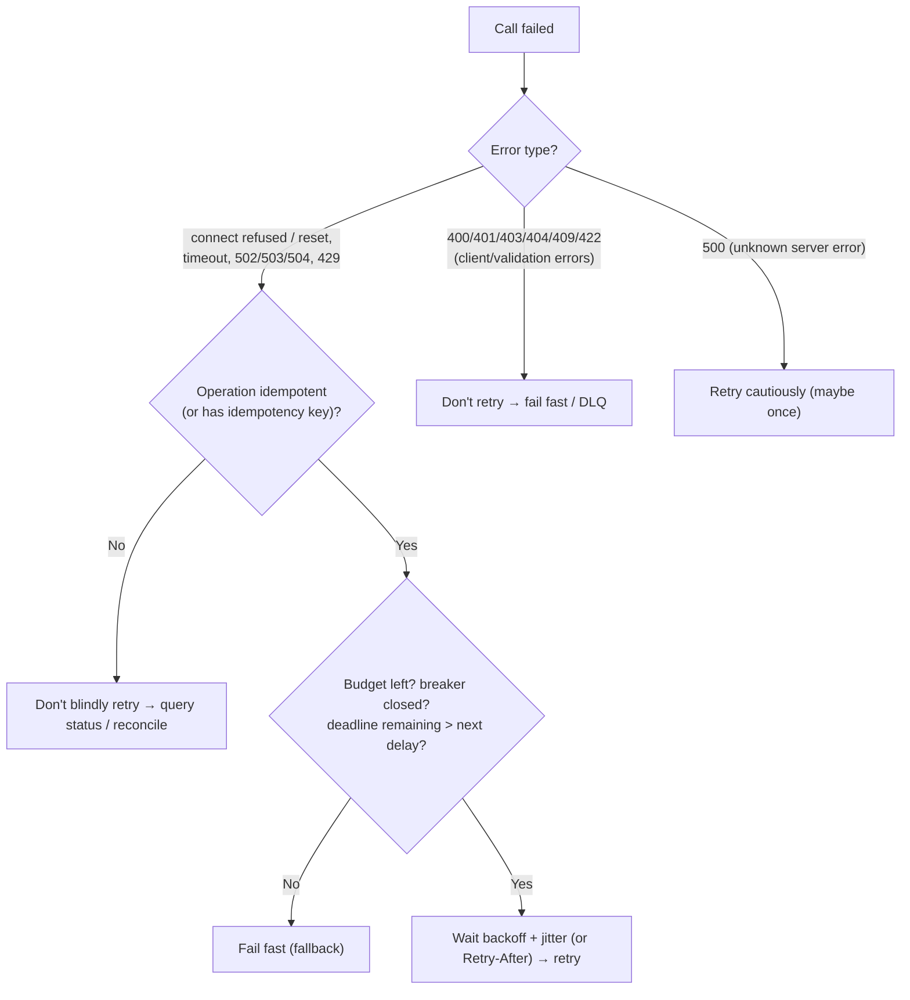
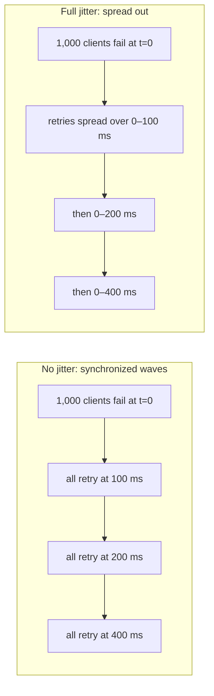

# Retries, Backoff, Jitter, Timeouts

!!! abstract "Key takeaways"
    - **Retry only when it can help and is safe:** a **transient** failure (connection reset, 503, 429, timeout) on an **idempotent** operation (or one with an idempotency key). Never retry validation errors (4xx except 408/429), and be careful with non-idempotent POSTs.
    - **Backoff** spreads retries over time: `delay = min(cap, base × 2^attempt)`. **Jitter** de-synchronises clients:
        - **Full jitter:** `random(0, delay)`. The usual default.
        - **Equal jitter:** `delay/2 + random(0, delay/2)`.
        - **Decorrelated jitter:** `min(cap, random(base, prev × 3))`.

        Without jitter, clients retry in lockstep waves.
    - **Bound the damage:**
        - **Max attempts** (often 2–3 total).
        - **A retry budget** (for example, retries ≤ 10% of requests).
        - **Retry at one layer only.** Nested retries multiply: 3 × 3 × 3 = 27 calls.
        - **Honour `Retry-After`.**
        - **Circuit breakers** to stop retrying a dead dependency.
    - **Timeouts everywhere:**
        - **connect** (~100 ms–1 s)
        - **read/response** (from the dependency's p99/p99.9 plus margin)
        - **pool acquire** (fail fast when saturated)
        - an **overall deadline** that's **propagated** downstream, so inner calls never outlive the caller
    - **Hedged requests** (send a second copy after the p95 latency to another replica) cut tail latency for **idempotent reads**. Budget them (~5% extra load).

## Why it matters

Retries are the most common resilience mechanism and the most common cause of self-inflicted outages (retry storms, metastable failures). Timeouts that are missing or wrong cause thread exhaustion and cascading failure. Interviewers expect specific numbers, jitter, budgets, the single-layer rule and the link to idempotency. This is a resume topic (Kafka retry and DLQ, upstream calls from the GraphQL layer).

## Core concepts

### Decide: retry or not?


*Notice the three gates before any retry: **is it transient**, **is it safe**, and **can we afford it** (budget, breaker, deadline). Most retry bugs come from skipping one of them.*

### Backoff and jitter


*Notice that exponential backoff alone still makes **every client retry at the same instants**, hitting the recovering service with synchronised spikes. Jitter turns the spikes into a smooth trickle. AWS's analysis found full jitter does the least total work while finishing quickly.*

| Strategy | Formula (attempt n, base b, cap c) | Notes |
|---|---|---|
| Constant | `b` | Simple. Synchronises clients |
| Exponential | `min(c, b·2ⁿ)` | Backs off, still synchronised |
| **Full jitter** | `random(0, min(c, b·2ⁿ))` | Best default |
| Equal jitter | `d/2 + random(0, d/2)` with d as above | Guarantees some wait |
| Decorrelated jitter | `min(c, random(b, prev·3))` | Good spread, uses the previous delay |

### Retry budgets and amplification

- **Amplification:** with 3 attempts at each of 3 layers (client → gateway → service → DB), one user request can become **27 DB calls** during an outage, exactly when the DB is weakest.
- **Rules:**
    1. **Retry at one layer**, usually the one closest to the failure that knows about idempotency. Outer layers don't retry, or only on specific signals.
    2. **Retry budget:** allow retries only while `retries / requests ≤ 10%` over a window (gRPC and Envoy support this; Finagle popularised it). During an outage, retries stop automatically.
    3. **Circuit breaker:** after sustained failures, stop calling for a while.
    4. **Honour `Retry-After`** on 429/503, which the server sets to shed load.

### Timeouts: kinds and sizing

| Timeout | Purpose | Typical starting point |
|---|---|---|
| Connect | Fail fast when the host is unreachable | 100 ms (same DC) – 1 s |
| Read / response | Bound the wait for a response | Dependency p99.9 + margin, below your own SLO |
| Pool acquire | Don't queue forever for a connection | 10–100 ms. Then fail or shed |
| Overall deadline | Total budget for the operation, including retries | From the caller's SLO (e.g. API p99 800 ms) |
| Idle / keep-alive | Recycle connections | Backend idle > LB idle (avoid 502s) |

**Deadline propagation:** the incoming request has a budget (say 800 ms). Each downstream call gets `min(own timeout, remaining budget − safety margin)`. gRPC propagates deadlines natively. For HTTP, pass a header (e.g. `x-request-deadline`) or compute it per hop. Work whose caller has already given up is wasted load.

### Hedged requests

For **idempotent reads**, if no response arrives by the p95 latency, send a duplicate to another replica and use whichever answers first. Cancel the other. This cuts the tail from slow replicas at small extra cost (budget hedges to a few percent). It's described in Google's "The Tail at Scale". **Never hedge non-idempotent writes.**

### Retries in messaging

- **Consumers:**
    - **Blocking retries** (in place, with backoff) preserve order but stall the partition.
    - **Non-blocking retry topics** (`orders-retry-1m`, `-10m`, then DLT) keep throughput but reorder.
    - Classify exceptions: non-retryable go straight to the DLT.
- **Visibility timeout / max poll interval** must exceed processing time + backoff, or the broker redelivers mid-retry.
- **Poison messages** must not be retried forever. Use max attempts → DLQ → alert → redrive.

## In practice: code & configuration

=== "❌ Common mistake"
    ```java
    // Retries everything (incl. 400s and non-idempotent POST), no backoff or jitter,
    // no timeout, and the gateway + client + service all retry 3× as well.
    for (int i = 0; i < 5; i++) {
        try { return restTemplate.postForObject(url, order, Receipt.class); }
        catch (Exception e) { /* try again immediately */ }
    }
    ```

=== "✅ Correct approach"
    ```java
    // Full-jitter exponential backoff helper (compiled + tested on Java 21).
    public final class Backoff {
        private final Duration base, cap;
        private final RandomGenerator random;
        public Backoff(Duration base, Duration cap, RandomGenerator random) {
            this.base = base; this.cap = cap; this.random = random;
        }
        /** attempt = 0 for the first retry. */
        public Duration fullJitter(int attempt) {
            long exp = base.toMillis() * (1L << Math.min(attempt, 20));     // guard overflow
            long ceiling = Math.min(cap.toMillis(), exp);
            return Duration.ofMillis(random.nextLong(ceiling + 1));         // uniform in [0, ceiling]
        }
    }
    ```

    ```java
    // Resilience4j: exponential backoff WITH jitter via an IntervalFunction (programmatic),
    // retry only transient errors, and only for idempotent operations.
    RetryConfig config = RetryConfig.custom()
        .maxAttempts(3)                                            // total attempts, including the first
        .intervalFunction(IntervalFunction.ofExponentialRandomBackoff(
                Duration.ofMillis(100), 2.0, 0.5))                 // initial, multiplier, randomisation
        .retryOnException(e -> e instanceof ConnectException
                || e instanceof HttpTimeoutException
                || (e instanceof HttpStatusException h && Set.of(429, 502, 503, 504).contains(h.status())))
        .failAfterMaxAttempts(true)
        .build();
    Retry retry = Retry.of("pricing", config);
    Supplier<Price> call = Retry.decorateSupplier(retry, () -> pricingClient.get(ndc, deadline.remaining()));
    ```

```yaml
# Spring Boot RestClient timeouts (Boot 3.4+ HTTP client properties)
spring:
  http:
    client:
      connect-timeout: 300ms
      read-timeout: 700ms          # below the caller's 800 ms SLO; retries must fit the deadline
  # Kafka consumer: processing + backoff must stay under the poll interval
  kafka:
    consumer:
      properties:
        max.poll.interval.ms: 300000
```

!!! tip "Resilience4j config gotcha"
    In YAML you can't enable both `enable-exponential-backoff` and `enable-randomized-wait` on the same instance (it fails at startup). For exponential backoff **with** jitter, use `IntervalFunction.ofExponentialRandomBackoff(...)` programmatically (or a custom interval bean). Spring Framework 7 also ships a built-in `@Retryable` with backoff and jitter for simple cases.

## Real-world usage

- **AWS SDKs** retry throttling and transient errors with exponential backoff + jitter and **client-side retry quotas** (a token bucket that limits retries during outages: the "standard" and "adaptive" retry modes).
- **gRPC** has retry policies (max attempts, backoff, retryable status codes), **retry throttling** (a budget) and **hedging** in its service config. Deadlines propagate by default.
- **Envoy / Istio** offer per-route retries, retry budgets (`retry_budget`), and outlier detection to pair with them.
- **Google SRE** recommends retries at a single layer, with budgets, plus client-side throttling to avoid cascading failures.
- **Incidents:** many big outages (including AWS 2021 us-east-1) involved retry storms from clients hammering an impaired service. Jitter, budgets and breakers are the documented remedies.

## Trade-offs & production gotchas

| Setting | Too low | Too high |
|---|---|---|
| Timeout | False failures, duplicate work, wasted retries | Thread/connection exhaustion, cascading latency |
| Max attempts | Transient blips surface as errors | Load amplification, long user waits |
| Backoff base/cap | Hammering a recovering service | Slow recovery, deadline exceeded |
| Retry budget | Few retries help availability | Storms during outages |
| Hedging threshold | Doubling load | No tail improvement |

!!! warning "Gotchas"
    - **Retries must fit inside the deadline:** 3 attempts × 700 ms timeouts plus backoff can't fit an 800 ms SLO. Size timeouts as `deadline / attempts` or use fewer attempts.
    - **Retrying `POST` without an idempotency key** creates duplicates whenever the first attempt actually succeeded.
    - **Connection pools + retries:** retrying on the same broken pooled connection fails again. Evict on I/O errors.
    - **Don't retry inside a DB transaction** across remote calls. Locks are held for the whole backoff.

## How this connects to my experience

- **Where I used it:**
    - OptumRx Meteor: GraphQL Consumer Service calling **5 upstream systems**, and "Kafka-based event-driven workflows with **retry and DLQ** handling".
    - Deloitte: SQS/Lambda consumers (visibility timeout + redrive).
- **Talking points:**
    - "Upstream calls had connect and read timeouts sized from each upstream's latency profile, and only idempotent reads were retried, once or twice with jittered backoff, inside the request deadline." *[confirm: actual timeout values, library (Resilience4j? WebClient retry?)]*
    - "Kafka processing used bounded retries with backoff. Non-retryable exceptions (validation, deserialisation) went straight to the DLT, and the rest went to the DLT after max attempts, with alerting and redrive." *[confirm: blocking vs non-blocking retry topics]*
    - "We avoided nested retries: the gateway didn't retry, and the service did, close to the dependency." *[confirm]*
- **Likely follow-up chain:** "What were your retry settings?" → "Why jitter?" → "How do you prevent retry storms?" → "How do timeouts relate to your SLO?" Answer: attempts, backoff and classification → de-synchronising clients → single layer + budget + breaker + Retry-After → deadline budget split across calls and attempts.

## Interview questions

### Fundamentals

??? question "Q1. When should you retry?"
    **Answer:** On transient failures (connection errors, timeouts, 502/503/504, 429) for idempotent operations or ones protected by idempotency keys, within a budget and a deadline. Never on client or validation errors (400, 401, 403, 404, 422), and not blindly on non-idempotent writes.

    **Interviewer listens for:** transient + idempotent + bounded.

    **Common wrong answer:** "on any exception".

??? question "Q2. Why exponential backoff?"
    **Answer:** It gives a struggling dependency time to recover and lowers retry pressure as failures continue: delays grow `base × 2ⁿ` up to a cap. Constant retries keep hammering at full rate.

    **Interviewer listens for:** recovery time and reduced pressure.

    **Common wrong answer:** "to make the user wait".

??? question "Q3. Why add jitter?"
    **Answer:** Without it, all clients that failed together retry together (synchronised waves), which overloads the dependency again. Randomising each delay (full jitter: `random(0, backoff)`) spreads retries out and reduces total work and contention.

    **Interviewer listens for:** synchronised retries.

    **Common wrong answer:** "for security".

??? question "Q4. What timeouts should an HTTP client have?"
    **Answer:** A connect timeout, a read/response timeout, a connection-pool acquire timeout, and an overall per-request deadline (including retries). Defaults are often infinite or very long, so always set them explicitly.

    **Interviewer listens for:** several timeout types.

    **Common wrong answer:** "just one timeout".

### Intermediate

??? question "Q5. How do you choose a read timeout?"
    **Answer:** From the dependency's measured latency distribution (p99 or p99.9 plus margin), constrained by your own SLO and deadline (fit all attempts in). Revisit as latency changes. Too low causes false failures, and too high ties up resources during slowdowns.

    **Interviewer listens for:** data-driven and deadline-aware.

    **Common wrong answer:** "30 seconds".

??? question "Q6. What is a retry budget?"
    **Answer:** A cap on retries relative to normal traffic (for example ≤ 10% of requests over a sliding window). During widespread failure, retries stop automatically instead of multiplying load. It's implemented in gRPC retry throttling, Envoy retry budgets, and the AWS SDK retry quota.

    **Interviewer listens for:** self-limiting behaviour.

    **Common wrong answer:** "the max attempts setting".

??? question "Q7. Why retry at only one layer?"
    **Answer:** Retries multiply across layers (3 attempts at 3 layers = 27× load at the bottom), during exactly the conditions where the bottom is struggling. Pick the layer with the best knowledge (idempotency, error type), usually the client closest to the dependency, and disable or limit retries elsewhere.

    **Interviewer listens for:** the amplification maths.

    **Common wrong answer:** "more layers of retries means more reliability".

### Senior

??? question "Q8. What is deadline propagation and why does it matter?"
    **Answer:** The caller's remaining time budget is passed downstream (gRPC deadlines, or a header). Each hop sets its timeouts to the remaining budget. That prevents doing work nobody is waiting for, avoids retries that can't finish in time, and bounds the total latency of call chains.

    **Interviewer listens for:** avoiding wasted work.

    **Common wrong answer:** "every service uses its own 30-second timeout".

??? question "Q9. What are hedged requests and when would you use them?"
    **Answer:** For idempotent reads, if no reply arrives by a threshold (e.g. the p95), send a duplicate to another replica and take the first response, cancelling the other. This sharply reduces tail latency caused by slow replicas, at a small budgeted extra load. Never use it for non-idempotent operations.

    **Interviewer listens for:** idempotent-only, plus a budget.

    **Common wrong answer:** "send every request twice".

??? question "Q10. How do retries and circuit breakers work together?"
    **Answer:** Retries handle brief, isolated failures. Breakers handle sustained failure by stopping calls entirely for a period. Order: the breaker usually wraps retries (each retried call counts toward the failure rate), or retries sit outside the breaker so an open breaker fails fast without retrying. Avoid retrying on a "breaker open" exception.

    **Interviewer listens for:** complementary roles, and not retrying breaker-open errors.

    **Common wrong answer:** "they're the same".

### Scenario-based

??? question "Q11. A dependency had a 2-minute blip, but your system stayed down for 30 minutes. Why, and what do you change?"
    **Answer:** Likely a metastable retry storm. Clients retried without jitter or budgets at several layers, so the recovering dependency was overloaded by queued retries, and timeouts produced more retries. Changes:
    - jitter
    - a retry budget
    - single-layer retries
    - circuit breakers
    - load shedding at the dependency
    - honouring Retry-After
    - bounded queues
    - capacity headroom
    - a kill switch to disable retries during incidents

    **Interviewer listens for:** naming the feedback loop.

    **Common wrong answer:** "the dependency was slow to restart".

??? question "Q12. Your API's SLO is p99 < 1 s. It calls two upstreams sequentially. Design the timeouts and retries."
    **Answer:**
    - Budget about 900 ms total (keeping margin).
    - If the upstreams are independent, call them **in parallel**.
    - Per upstream: connect 100 ms, read around 350 ms (from their p99.9), one retry with full jitter only if the remaining deadline allows it, a breaker per upstream, and a fallback or partial response if one fails.
    - Propagate the deadline.
    - Monitor timeout and retry rates.

    **Interviewer listens for:** a concrete budget split, parallelisation and fallbacks.

    **Common wrong answer:** "30-second timeout and 3 retries each".

## Cheat sheet

| Concept | Remember |
|---|---|
| Retry when | Transient (timeouts, resets, 502/503/504, 429) AND idempotent AND budget + deadline allow |
| Don't retry | 400/401/403/404/409/422, breaker open, non-idempotent without a key |
| Backoff | `min(cap, base·2ⁿ)` |
| Jitter | Full `random(0, d)` (default), equal, decorrelated |
| Limits | 2–3 total attempts, retry budget ~10%, **one layer**, honour `Retry-After` |
| Timeouts | Connect, read (p99.9 + margin), pool acquire, overall deadline |
| Deadlines | Propagate remaining budget downstream (gRPC native) |
| Hedging | Idempotent reads only, at ~p95, budget a few % |
| Messaging | Blocking vs non-blocking retries, classify → DLQ, visibility > processing + backoff |
| Resilience4j | Exponential + jitter via `IntervalFunction.ofExponentialRandomBackoff` |

## Sources
1. [AWS Architecture Blog: Exponential Backoff and Jitter](https://aws.amazon.com/blogs/architecture/exponential-backoff-and-jitter/).
2. [Amazon Builders' Library: Timeouts, retries, and backoff with jitter](https://aws.amazon.com/builders-library/timeouts-retries-and-backoff-with-jitter/).
3. [Google SRE Book: Handling Overload / Addressing Cascading Failures](https://sre.google/sre-book/handling-overload/).
4. [Dean & Barroso: The Tail at Scale (CACM 2013)](https://research.google/pubs/the-tail-at-scale/): hedged requests.
5. [gRPC: Retry, hedging and retry throttling](https://grpc.io/docs/guides/retry/) and [Deadlines](https://grpc.io/docs/guides/deadlines/).
6. [Envoy: retry budgets](https://www.envoyproxy.io/docs/envoy/latest/api-v3/config/cluster/v3/circuit_breaker.proto#config-cluster-v3-circuitbreakers-thresholds-retrybudget).
7. [Resilience4j Retry documentation](https://resilience4j.readme.io/docs/retry): IntervalFunction and configuration.
8. [AWS SDKs: retry behavior (standard/adaptive modes, retry quotas)](https://docs.aws.amazon.com/sdkref/latest/guide/feature-retry-behavior.html).
9. [Spring Framework 7: resilience features (`@Retryable`, `@ConcurrencyLimit`)](https://docs.spring.io/spring-framework/reference/core/resilience.html).
