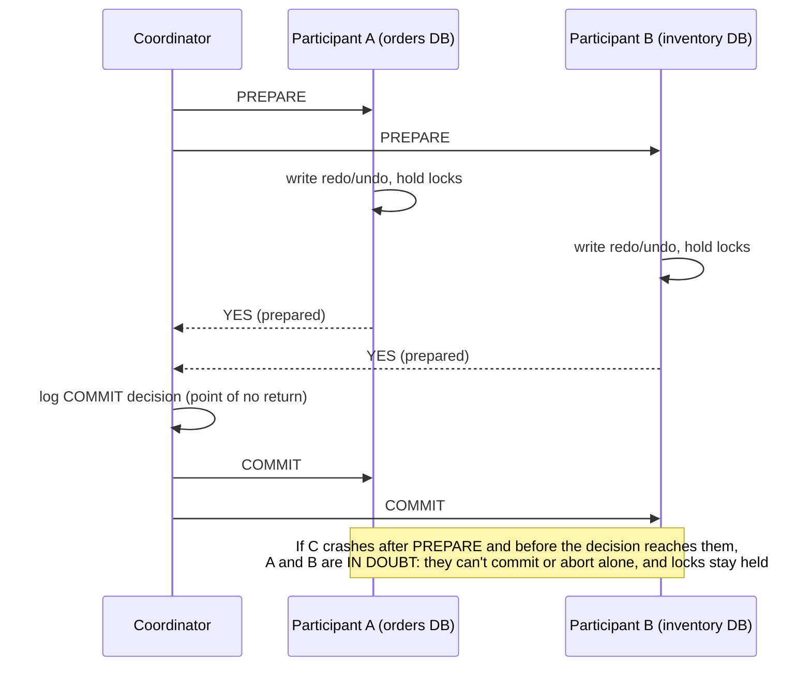
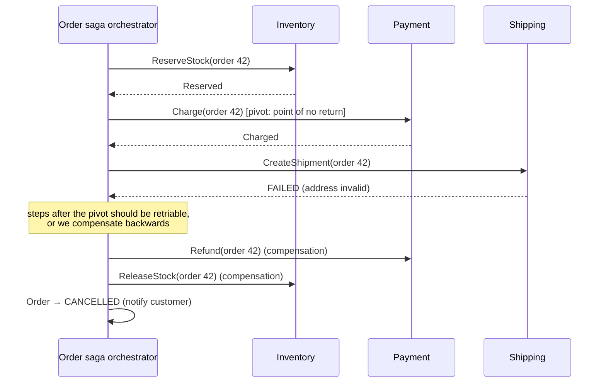

# Distributed Transactions: 2PC vs Saga

!!! abstract "Key takeaways"
    - When one business operation changes data in **several databases or services**, you can't use one local ACID transaction. The options are **2PC** (atomic, blocking, tightly coupled) or **sagas** (a sequence of local transactions with **compensations**: available and loosely coupled, but **not isolated**).
    - **2PC:**
        - A **coordinator** asks every participant to **prepare** (durably promise it can commit, holding locks). If all vote yes, it sends **commit**. Otherwise **abort**.
        - **Blocking problem:** if the coordinator dies after the prepare phase, participants are **in doubt**, holding locks until it recovers.
        - It's used inside databases and XA, rarely across microservices.
    - **Saga:** T1 → T2 → … → Tn. Each step commits locally. If step k fails, run **compensations** C(k−1) … C1 (semantic undo: refund, release, cancel). Two styles:
        - **Choreography:** services react to each other's events.
        - **Orchestration:** a central coordinator or workflow engine sends commands.
    - **Sagas lack isolation** (ACD, not ACID). Other transactions can see intermediate states, giving dirty reads and lost updates. Countermeasures: **semantic locks** (PENDING states), **commutative updates**, **reread/version checks**, ordering steps with a **pivot transaction**, and **retriable steps after the pivot**.
    - **Make every step reliable:** local TX + **outbox** for the next command or event, **idempotent** participants, **retries**, and timeouts. Use a **workflow engine** (Temporal, Step Functions, Camunda) when there are many steps, timers or human tasks.

## Why it matters

"How do you keep order, payment and inventory consistent across microservices?" is a core microservices interview question. The weak answer is "a distributed transaction" (2PC across services is usually unavailable or unwise). The strong answer is a **saga** with explicit compensations, idempotent steps, an outbox and a plan for isolation anomalies, plus knowing **when 2PC is fine** (inside one database cluster, or XA between a DB and a broker in legacy stacks).

## Core concepts

### Two-phase commit


*Notice the **blocking window**: once a participant votes YES, it has given up the right to decide alone. Coordinator failure leaves it holding locks until recovery. That's why 2PC hurts **availability** and **latency** (2 round trips plus fsyncs, and locks held across the network).*

{ loading=lazy }
*Watch the lock bars: they keep running through the whole in-doubt window, because a participant that voted YES can't commit or abort on its own.*

| Property | 2PC |
|---|---|
| Atomicity | Yes (all or nothing) |
| Isolation | Yes (locks held until commit) |
| Availability | Lower: blocks on coordinator failure. All participants must be up |
| Latency | ≥ 2 round trips + forced log writes, with locks held |
| Coupling | Participants must support XA/2PC (most HTTP services, Kafka-to-DB and many NoSQL stores don't) |
| Where it's used | Inside distributed databases (Spanner, CockroachDB: 2PC over consensus groups, which removes the blocking), XA in JTA app servers, Kafka transactions internally |

**3PC** adds a pre-commit phase to reduce blocking, but assumes bounded delays and isn't used in practice. Modern systems run 2PC **on top of consensus-replicated participants**, so a "crashed" coordinator is replaced without blocking.

### Sagas


*Notice that compensations are **semantic undo** (refund, release), not rollbacks. Some effects can't be undone (an email was sent), so you order steps to put **compensatable steps first**, then the **pivot**, then **retriable steps** that are expected to eventually succeed.*

{ loading=lazy }
*Watch the direction change: once shipping fails, the saga walks back through the completed steps, newest first.*

**Step types** (Richardson):

- **Compensatable:** can be undone (reserve stock → release).
- **Pivot:** the go/no-go point. After it, the saga must complete (charge the card).
- **Retriable:** after the pivot, guaranteed to succeed eventually with retries (create shipment, send confirmation).

### Choreography vs orchestration

| | Choreography (events) | Orchestration (commands) |
|---|---|---|
| Control | Distributed: each service reacts to events | Central orchestrator / workflow engine |
| Coupling | Services know event types, not each other | Orchestrator knows all participants |
| Visibility | The flow is implicit, hard to trace | Explicit state machine, easy to monitor |
| Change | Adding a step touches several services | Change the orchestrator |
| Cycles / complexity | Risk of cyclic event dependencies | Contained |
| Best for | 2–4 simple steps | Many steps, timeouts, human tasks, compliance audit |

### The isolation problem and countermeasures

Sagas commit each step immediately, so other requests can observe **intermediate state**:

- **Lost updates:** a saga overwrites changes made by another saga.
- **Dirty reads:** reading data a saga will compensate (stock looks reserved, then is released).
- **Non-repeatable/fuzzy reads** across steps.

**Countermeasures:**

| Countermeasure | Idea | Example |
|---|---|---|
| **Semantic lock** | Mark records as in-progress (`PENDING`, `APPROVAL_PENDING`), and other operations respect it | Order `PENDING` can't be modified until the saga completes |
| Commutative updates | Make operations order-independent | Debit/credit as ledger entries rather than overwriting the balance |
| Pessimistic view | Reorder steps to reduce dirty-read risk | Do the risky step last |
| Reread value | Re-check before updating (optimistic) | Version check before confirming |
| Version file | Record operations to reorder or ignore stale ones | Late cancel arrives before create |
| By value | Choose the mechanism by business risk | High-value orders use stricter flows |

### TCC (Try-Confirm/Cancel)

A reservation-style variant:

- **Try** reserves resources tentatively (holds with expiry).
- **Confirm** makes them permanent.
- **Cancel** releases them.

It's common in payments (authorise/capture/void) and booking (hold/confirm/release). It gives better isolation than a plain saga because reservations are visible as holds.

### Making steps reliable

- Each step: **local transaction + outbox** row for the next command or event (no dual writes).
- **Participants are idempotent** (commands can arrive more than once).
- **Timeouts and retries** per step. A step stuck too long goes to compensation or manual review.
- **Saga state is persisted** (orchestrator DB or workflow engine) so it survives crashes.
- **Observability:** saga ID as a correlation ID through every step.

## In practice: code & configuration

=== "❌ Common mistake"
    ```java
    // "Distributed transaction" via @Transactional across remote calls: the local TX can roll back,
    // but the remote charge and reservation can't. Dual writes, no compensation, locks held during HTTP.
    @Transactional
    public void placeOrder(Order o) {
        orderRepo.save(o);
        inventoryClient.reserve(o.items());     // remote, already committed on their side
        paymentClient.charge(o.total());        // remote, already committed
        shippingClient.create(o);               // throws → only orderRepo.save rolls back
    }
    ```

=== "✅ Correct approach"
    ```java
    // Minimal orchestrated saga with compensations (compiled + tested on Java 21).
    // In production, persist saga state + use an outbox, or use Temporal / Step Functions.
    public final class Saga {
        public record Step(String name, Runnable action, Runnable compensation) {}

        private final List<Step> steps = new ArrayList<>();
        public Saga step(String name, Runnable action, Runnable compensation) {
            steps.add(new Step(name, action, compensation)); return this;
        }

        /** Runs steps in order; on failure, compensates completed steps in reverse order. */
        public Result run() {
            Deque<Step> done = new ArrayDeque<>();
            for (Step s : steps) {
                try {
                    s.action().run();
                    done.push(s);
                } catch (RuntimeException e) {
                    List<String> compensated = new ArrayList<>();
                    while (!done.isEmpty()) {
                        Step c = done.pop();
                        try { c.compensation().run(); compensated.add(c.name()); }
                        catch (RuntimeException ce) { return new Result(false, s.name(), compensated, true); } // manual review
                    }
                    return new Result(false, s.name(), compensated, false);
                }
            }
            return new Result(true, null, List.of(), false);
        }
        public record Result(boolean success, String failedStep, List<String> compensated, boolean needsManualReview) {}
    }

    // Usage: compensatable steps first, pivot (charge) next, retriable steps last.
    Saga.Result r = new Saga()
        .step("reserve", () -> inventory.reserve(orderId, items), () -> inventory.release(orderId))
        .step("charge",  () -> payments.charge(orderId, total, "order-" + orderId),   // idempotency key
                         () -> payments.refund(orderId, "refund-" + orderId))
        .step("ship",    () -> shipping.create(orderId), () -> shipping.cancel(orderId))
        .run();
    ```

## Real-world usage

- **E-commerce and travel** (Uber, Booking, airlines): order/booking sagas with holds (TCC-like), payment authorise/capture, and compensations on failure.
- **Uber Cadence → Temporal**, **AWS Step Functions**, **Camunda/Zeebe**, **Netflix Conductor**: workflow engines that persist saga state, retry steps, run timers and support compensation, widely used to replace hand-built sagas.
- **Distributed SQL** (Spanner, CockroachDB, YugabyteDB) does 2PC internally across Raft or Paxos groups, giving ACID across shards without classic blocking. That's a good option when the data can live in one database system.
- **Banking:** ledgers avoid cross-service 2PC with **double-entry, append-only postings** and reconciliation. Transfers between banks are sagas with settlement and reversal.
- **Healthcare:** prescription fulfilment (verify → adjudicate claim → fill → ship) is naturally a long-running saga with human steps (pharmacist verification) and timers (prior authorisation).

## Trade-offs & production gotchas

| Approach | Consistency | Availability / latency | Complexity | Use when |
|---|---|---|---|---|
| Single DB transaction | ACID | Best | Lowest | Data can live together (design for this first!) |
| 2PC / XA | Atomic + isolated | Blocking, slow, all participants up | Infrastructure | Few XA-capable resources, legacy JTA, inside distributed DBs |
| Saga (choreography) | Eventual, compensating | High | Medium, implicit flow | Few steps, few teams |
| Saga (orchestration) | Eventual, compensating | High | Medium, explicit | Many steps, timers, audit |
| TCC | Reservation-based | High | Participants need hold APIs | Bookings, payments |

!!! warning "Gotchas"
    - **Compensations can fail too.** Make them idempotent and retriable, and have a manual-review queue.
    - **Some actions can't be compensated** (sent emails, shipped goods). Put them after the pivot, or delay them until the saga commits.
    - **Saga timeouts:** a participant that never responds needs a deadline, and a decision to compensate or escalate.
    - **Don't hold DB transactions or locks across remote calls.** That's 2PC's problem without its guarantees.

## How this connects to my experience

- **Where I used it:**
    - OptumRx Meteor: microservices with Kafka event-driven workflows (retry/DLQ), MongoDB per service, the GraphQL layer orchestrating calls to 5 upstreams.
    - Deloitte: event-driven workflows with SQS/SNS/Lambda.
    - Johnson Controls: the monolith-to-microservices migration, where cross-service consistency first appears.
- **Talking points:**
    - "Workflows spanning services were event-driven: each service committed locally and published events, with retries and DLQs. Consumers were idempotent, and failure paths emitted compensating events." *[confirm: any explicit compensations, e.g. cancel or revert flows]*
    - "In the monolith migration, operations that used to be one DB transaction became multi-service, so we had to decide where to keep data together and where to accept eventual consistency." *[confirm]*
    - "For new designs with many steps and timers, I'd use an orchestrator (Temporal or Step Functions) rather than hand-rolled choreography."
- **Likely follow-up chain:** "How did you keep data consistent across services?" → "What if step 3 fails?" → "What about isolation?" → "Why not 2PC?" Answer: local TX + outbox + events → compensations in reverse, idempotent → semantic locks (PENDING states), versions → blocking, availability, XA support, coupling.

## Interview questions

### Fundamentals

??? question "Q1. What is two-phase commit?"
    **Answer:** A coordinator asks all participants to prepare (persist and lock, then vote yes or no). If all vote yes, it logs commit and tells everyone to commit. If any votes no, everyone aborts. It's atomic across participants.

    **Interviewer listens for:** the prepare and commit phases, and the decision log.

    **Common wrong answer:** "commit twice for safety".

??? question "Q2. Why is 2PC called blocking?"
    **Answer:** After voting yes, a participant can't decide unilaterally. If the coordinator crashes before sending the decision, participants stay in doubt, holding locks until the coordinator recovers (or manual intervention).

    **Interviewer listens for:** the in-doubt state plus locks held.

    **Common wrong answer:** "because it's slow".

??? question "Q3. What is a saga?"
    **Answer:** A sequence of local transactions, each in one service. If a step fails, compensating transactions undo the previous steps semantically. It gives eventual consistency without distributed locks, at the cost of isolation.

    **Interviewer listens for:** compensations and the lack of isolation.

    **Common wrong answer:** "a long-running database transaction".

??? question "Q4. Choreography vs orchestration?"
    **Answer:** Choreography: services listen to events and decide their next steps, which is decentralised but makes the flow implicit. Orchestration: a coordinator or workflow engine sends commands and tracks state, which is explicit, observable and easier to change for complex flows.

    **Interviewer listens for:** a criteria-based choice.

    **Common wrong answer:** "choreography is always better for microservices".

### Intermediate

??? question "Q5. What isolation anomalies do sagas have, and how do you mitigate them?"
    **Answer:** Dirty reads of state that will be compensated, lost updates between concurrent sagas, and fuzzy reads. Mitigate with semantic locks (PENDING states that block conflicting operations), commutative updates, version checks (reread), ordering steps (pivot), and by-value strategies for high-risk data.

    **Interviewer listens for:** naming the countermeasures.

    **Common wrong answer:** "sagas are isolated".

??? question "Q6. What are compensatable, pivot and retriable steps?"
    **Answer:** Compensatable steps can be undone. The pivot is the point of no return (if it succeeds, the saga must complete). Retriable steps come after the pivot and must eventually succeed through retries. Order steps compensatable → pivot → retriable to minimise impossible compensations.

    **Interviewer listens for:** ordering logic.

    **Common wrong answer:** "all steps are the same".

??? question "Q7. How do you make saga steps reliable?"
    **Answer:** Each step updates local state and writes an outbox record (command or event) in one transaction. A relay publishes it. Participants are idempotent. Saga state is persisted. Timeouts and retries per step. Compensations are idempotent too. Correlate everything with a saga ID.

    **Interviewer listens for:** outbox plus idempotency.

    **Common wrong answer:** "call the next service via HTTP after commit".

### Senior

??? question "Q8. When is 2PC acceptable or even preferable?"
    **Answer:**
    - Within one database system (distributed SQL runs 2PC over consensus groups, so there's no classic blocking).
    - Between a few XA-capable resources in one deployment (legacy JTA with DB + JMS).
    - When strict atomicity and isolation are mandatory and participants are highly available and close together.

    Across independently owned microservices over HTTP, avoid it.

    **Interviewer listens for:** nuance, not dogma.

    **Common wrong answer:** "never".

??? question "Q9. TCC vs saga?"
    **Answer:** TCC's Try reserves resources tentatively (holds visible as such), and Confirm/Cancel finalise. That gives better isolation (others see the holds, not the final state) and natural timeouts. A saga commits the real effects and compensates afterwards. TCC needs participants with reservation APIs (seat holds, payment authorisations).

    **Interviewer listens for:** reservation semantics.

    **Common wrong answer:** "the same thing".

??? question "Q10. How do you observe and support sagas in production?"
    **Answer:** Give every saga a **saga id** carried in every command, event and log line, and propagate trace context across messages. Persist saga state (`STARTED`, `PAYMENT_AUTHORISED`, `COMPENSATING`, `FAILED`) in the orchestrator's table, or rely on Temporal/Step Functions history. Alert on **stuck sagas** (no progress for longer than the step timeout), on compensation failures and on DLQ growth. Give support staff a screen or runbook to see where an order is and to retry or complete a step manually. Track business metrics too: completion rate and time to complete.

    **Interviewer listens for:** saga id + trace propagation, persisted state, stuck-saga alerts, manual retry tooling, business metrics.

    **Common wrong answer:** "Read the logs of each service when someone complains." Without a saga id and state you cannot answer "where is this order?" quickly.

### Scenario-based

??? question "Q11. Design checkout across inventory, payment and shipping."
    **Answer:**
    - An orchestrated saga: create the order PENDING (semantic lock) → reserve stock (compensatable, hold with TTL) → authorise payment (compensatable: void) → capture payment (pivot) → create shipment and send confirmation (retriable).
    - Each step via outbox + idempotent participants.
    - Timeouts compensate. A failed compensation goes to manual review.
    - The order state machine records progress, and the saga ID is used for tracing.

    **Interviewer listens for:** step ordering, holds, the pivot, reliability.

    **Common wrong answer:** "one `@Transactional` method calling all services".

??? question "Q12. A refund compensation keeps failing because the payment provider is down. What happens?"
    **Answer:** Compensations must be retriable with backoff and idempotency keys (refund key = order ID). The saga stays in COMPENSATING with alerts. After N attempts or a deadline, escalate to a manual queue with full context. Notify the customer appropriately. Reconciliation catches anything missed. Never silently drop it.

    **Interviewer listens for:** retriable compensations plus escalation.

    **Common wrong answer:** "log the error".

## Cheat sheet

| Concept | Remember |
|---|---|
| First choice | Keep data that must be atomic in **one** DB |
| 2PC | Prepare → (all yes) commit / abort. Atomic + isolated. **Blocks** on coordinator failure. XA |
| Modern 2PC | Over consensus groups (Spanner/CockroachDB): no classic blocking |
| Saga | Local TXs + compensations. ACD without isolation |
| Styles | Choreography (events, implicit) vs orchestration (commands, explicit, workflow engines) |
| Step types | Compensatable → pivot → retriable |
| Isolation fixes | Semantic locks (PENDING), commutative updates, reread/version, ordering |
| TCC | Try (hold) → Confirm / Cancel. Bookings and payments |
| Reliability | Outbox + idempotent participants + persisted saga state + timeouts |
| Failure | Compensations idempotent + retried → manual review |

## Sources
1. Martin Kleppmann, *Designing Data-Intensive Applications*, ch. 9 (atomic commit, 2PC, XA, in-doubt transactions).
2. [Garcia-Molina & Salem: Sagas (SIGMOD 1987)](https://www.cs.cornell.edu/andru/cs711/2002fa/reading/sagas.pdf).
3. Chris Richardson, *Microservices Patterns* (ch. 4 "Managing transactions with sagas"): countermeasures, pivot/retriable steps.
4. [microservices.io: Saga pattern](https://microservices.io/patterns/data/saga.html) and [Transactional outbox](https://microservices.io/patterns/data/transactional-outbox.html).
5. [Temporal documentation: durable workflows (used to implement sagas with compensations)](https://docs.temporal.io/) and [AWS Step Functions: saga pattern](https://docs.aws.amazon.com/prescriptive-guidance/latest/cloud-design-patterns/saga.html).
6. [Google Spanner (OSDI 2012)](https://research.google/pubs/spanner-googles-globally-distributed-database-2/): 2PC over Paxos groups.
7. [Pat Helland: Life beyond Distributed Transactions](https://queue.acm.org/detail.cfm?id=3025012).
