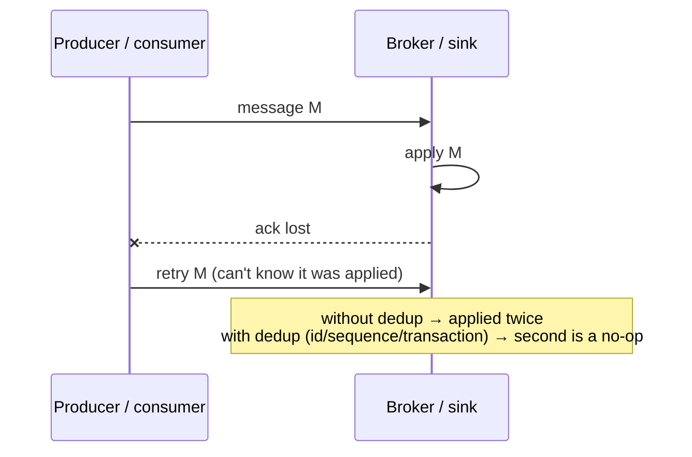
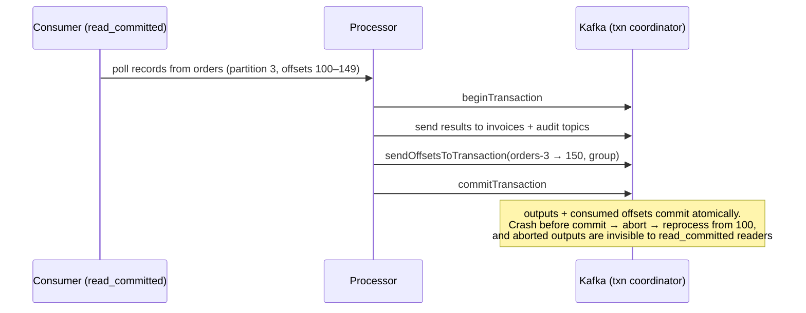
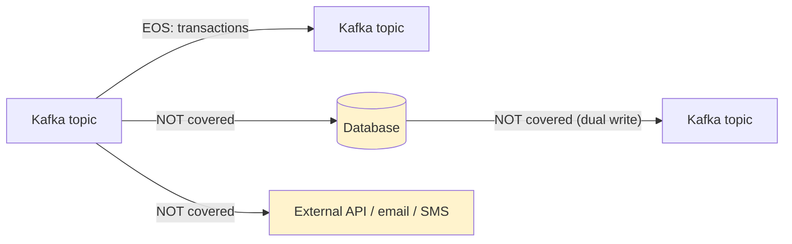

# Exactly-Once Processing in Practice

!!! abstract "TL;DR"
    - **Exactly-once *delivery* over an unreliable network is impossible** (Two Generals: an ack can always be lost). What systems provide is **exactly-once *effect*** (also called *effectively-once*): **at-least-once delivery + deduplication or atomicity**, so duplicates have no extra effect.
    - **Inside Kafka, exactly-once semantics (EOS) works:**
        - **Idempotent producer:** PID + sequence numbers dedupe retries per partition.
        - **Transactions:** atomic writes to many partitions **plus the consumer offsets**, via `sendOffsetsToTransaction`.
        - Consumers read with **`isolation.level=read_committed`**.
        - **Zombie fencing** through `transactional.id` epochs.
        - Kafka Streams wraps all of this as `processing.guarantee=exactly_once_v2`.
    - **EOS stops at Kafka's boundary.** Writing to a database, calling an API or sending an email needs its own mechanism:
        - an **idempotent sink** (upsert by key, dedup table)
        - **storing consumer offsets in the same DB transaction** as the results
        - **two-phase-commit sinks** (Flink)
        - an **outbox** for DB → Kafka
    - **Choose by boundary:**

        | Flow | Mechanism |
        |---|---|
        | Kafka → Kafka | Transactions / Streams EOS |
        | Kafka → DB | Idempotent upsert, or offsets in the DB TX |
        | DB → Kafka | Outbox / CDC + idempotent consumers |
        | Kafka → external API | Idempotency keys + dedup + reconciliation |

    - **The costs are real:** extra latency (transaction commit interval), throughput overhead, `read_committed` consumers waiting for open transactions, and operational complexity. Use EOS where duplicates are expensive (money, inventory, counts). Elsewhere use at-least-once + idempotency.

## Why it matters

"Does Kafka guarantee exactly-once?" is a favourite trick question. The strong answer is: **yes, within Kafka, using transactions**, and **no, once you touch a database or external API**, where you need idempotency or atomic offset storage. This is a resume topic (Kafka workflows with retry and DLQ), so expect "how did you avoid duplicates end to end?"

## Core concepts

### Why exactly-once delivery is impossible, and what we do instead


*Notice that the sender must retry to guarantee delivery (at-least-once), so **the receiver** must make the duplicate harmless. Every "exactly-once" system is at-least-once plus a dedup or atomicity mechanism at the receiving end.*

### Kafka EOS building blocks

| Mechanism | What it does | Config |
|---|---|---|
| **Idempotent producer** | Broker dedupes producer retries per partition (PID + sequence), keeps order | `enable.idempotence=true` (default since 3.0), `acks=all` |
| **Transactions** | Atomically write to multiple partitions **and** commit consumer offsets. All visible or none | `transactional.id`, `initTransactions`, `beginTransaction`, `sendOffsetsToTransaction`, `commitTransaction` |
| **read_committed** | Consumers skip aborted records and don't read past the last stable offset | `isolation.level=read_committed` |
| **Zombie fencing** | A restarted instance with the same `transactional.id` bumps the epoch, and the old instance's writes are rejected | Stable `transactional.id` per input partition/instance |
| **Kafka Streams EOS** | All of the above, managed (state stores, changelogs) | `processing.guarantee=exactly_once_v2` |


*Notice that **the consumed offset is part of the same transaction as the output**. That's what makes consume-transform-produce exactly-once: you can't have output written without the offset advancing, or the reverse.*

### Where EOS ends: external systems


*Notice the boundaries: Kafka's transaction coordinator can't enlist your Postgres or your SMS provider. Each crossing needs its own mechanism.*

| Boundary | Problem | Practical solution |
|---|---|---|
| Kafka → DB | Crash after the DB write and before the offset commit → reprocess → duplicate row | **Idempotent upsert** by business key / event ID, **or store offsets in the DB in the same TX** and `seek()` on partition assignment |
| DB → Kafka | Commit DB, then crash before publishing → lost event (dual write) | **Transactional outbox** + CDC (Debezium) or poller. Consumers dedupe |
| Kafka → external API | Call succeeds, ack is lost → retry → duplicate side effect | **Idempotency keys** to the API, dedup store before the call, **reconciliation** |
| Stream processor → sink | Partial output on failure | **2PC sinks** (Flink `TwoPhaseCommitSinkFunction` with checkpoints), Kafka Connect EOS (source connectors since 3.3), idempotent sink writes |

### Practical patterns

1. **Idempotent consumer (most common):** the dedup or processed table, or a unique business key, in the same transaction as the effect. Commit offsets after. Duplicates become no-ops.
2. **Offsets stored with results:** keep `(topic, partition, offset)` in the DB inside the business transaction. On startup or rebalance, `seek` to the stored offset + 1. This is exactly-once for that DB.
3. **Kafka transactions** for pure Kafka pipelines (enrichment, routing, aggregation), or Kafka Streams with `exactly_once_v2`.
4. **Outbox** for DB-originated events. CDC publishes with at-least-once, and consumers dedupe.
5. **Broker dedup windows:** SQS FIFO `MessageDeduplicationId` (5 minutes), Kafka idempotent producer. Useful but bounded.
6. **Reconciliation** as the safety net for external systems (payments, partner APIs).

### Costs and gotchas of Kafka EOS

- **Latency:** consumers in `read_committed` only see data after the transaction commits, so the commit interval (e.g. 100 ms in Streams EOS v2) adds to end-to-end latency. A long-open transaction blocks the last stable offset for the whole partition.
- **Throughput:** transaction markers and coordinator round trips. Batch more per transaction.
- **`transactional.id` management:** it must be stable per producer instance. Spring Kafka uses a prefix plus an automatic suffix. A wrong setup breaks fencing.
- **Doesn't fix logic bugs:** non-deterministic processing or external calls inside the transaction are still duplicated on retry.
- **Transaction timeouts** (`transaction.timeout.ms`) must exceed the processing time.

## In practice: code & configuration

=== "❌ Common mistake"
    ```java
    // Believes "exactly-once" because the producer is idempotent, but:
    // DB write + offset commit are separate (crash between → reprocess → duplicate invoice),
    // and the email has no dedup.
    @KafkaListener(topics = "orders")
    public void on(OrderPlaced e) {
        invoiceRepo.save(new Invoice(UUID.randomUUID(), e.orderId(), e.total()));  // new id each time
        email.sendInvoice(e.customerEmail());                                     // repeated on retry
    }   // auto-commit after return; a crash before it means duplicates
    ```

=== "✅ Correct approach (Kafka → DB)"
    ```java
    // Effectively-once into Postgres: deterministic key + upsert in one TX; side effects via outbox.
    @KafkaListener(topics = "orders", groupId = "billing")
    @Transactional                                                    // DB transaction (JPA/JDBC)
    public void on(OrderPlaced e) {
        int created = jdbc.update("""
            INSERT INTO invoice(order_id, total, created_at) VALUES (?, ?, now())
            ON CONFLICT (order_id) DO NOTHING
            """, e.orderId(), e.total());                             // business key = natural dedup
        if (created == 1) {
            outbox.save(OutboxEvent.of("Invoice", e.orderId(), "InvoiceCreated", e));   // email etc. downstream
        }
    }   // listener container commits the offset after the TX commits; redelivery is a no-op
    ```

=== "✅ Correct approach (Kafka → Kafka)"
    ```yaml
    # Spring Kafka: consume-transform-produce with Kafka transactions
    spring:
      kafka:
        producer:
          transaction-id-prefix: billing-tx-      # enables transactions; stable ids → zombie fencing
          acks: all
        consumer:
          isolation-level: read_committed
          enable-auto-commit: false
    ```

    ```java
    @KafkaListener(topics = "orders", groupId = "enricher")   // container runs each record in a Kafka TX
    public void enrich(OrderPlaced e) {
        kafkaTemplate.send("orders-enriched", e.orderId(), enrich(e));   // output + offset commit atomically
    }
    ```

Offsets stored with results (exactly-once into one DB, no dedup table needed):

```java
// On assignment, resume from the DB, not from Kafka's committed offsets.
consumer.subscribe(List.of("readings"), new ConsumerRebalanceListener() {
    public void onPartitionsRevoked(Collection<TopicPartition> parts) {}
    public void onPartitionsAssigned(Collection<TopicPartition> parts) {
        parts.forEach(tp -> consumer.seek(tp, offsetRepo.lastProcessed(tp).map(o -> o + 1).orElse(0L)));
    }
});
// In each batch: one DB transaction writes the results AND upserts (topic, partition, last_offset).
```

## Real-world usage

- **Kafka Streams / ksqlDB** apps use `exactly_once_v2` for aggregations, joins and counts (billing totals, fraud features), where duplicates would corrupt state.
- **Flink** gives exactly-once state via checkpoints, and end-to-end via two-phase-commit sinks (Kafka transactional sink, idempotent JDBC upserts).
- **Kafka Connect:** exactly-once for **source** connectors since Kafka 3.3 (KIP-618). Sink connectors rely on idempotent writes (upserts by key) or connector-specific mechanisms.
- **Payments and banking:** no infrastructure-level exactly-once to external rails, so idempotency keys + ledgers + daily reconciliation are the standard.
- **Healthcare:** prescription events into pharmacy systems use business-key idempotency (rx + fill number) because the external system isn't in any transaction.

## Trade-offs & production gotchas

| Approach | Guarantees | Cost | Use when |
|---|---|---|---|
| At-least-once + idempotent consumer | Effectively-once per sink | Dedup storage/keys | Default for most services |
| Kafka transactions / Streams EOS | Exactly-once within Kafka (incl. state) | Latency, throughput, config care | Kafka-to-Kafka pipelines, aggregations |
| Offsets stored in the sink | Exactly-once into that sink | Custom consumer logic | High-value single-sink pipelines |
| Outbox | No lost DB events | Relay infrastructure | DB → events |
| 2PC sinks (Flink) | End-to-end EOS | Checkpoint latency, sink support | Stream processing to transactional sinks |
| Reconciliation | Detect and repair anything | Batch jobs, ops | Money, external partners |

!!! warning "Gotchas"
    - **"Exactly-once" in vendor docs is always scoped.** Ask "between which two points?"
    - **Random IDs on reprocessing** defeat dedup. Derive IDs from the input (event ID, business key).
    - **External calls inside a Kafka transaction** aren't rolled back on abort.
    - **`read_committed` + long transactions = consumer lag spikes.** Keep transactions short.
    - **Rebalances during processing** cause redelivery. Size `max.poll.interval.ms` and batches accordingly.

## How this connects to my experience

- **Where I used it:**
    - OptumRx Meteor: "Designed **Kafka-based event-driven workflows** with retry and DLQ handling", MongoDB + Redis.
    - Deloitte: SQS/SNS pipelines (at-least-once).
- **Talking points:**
    - "We designed for at-least-once delivery plus idempotent consumers. Exactly-once in Kafka doesn't extend to MongoDB or upstream APIs, so the guarantee lived in our consumers (unique keys or upserts by business ID)." *[confirm: dedup approach, e.g. MongoDB unique index or upsert]*
    - "Retries and DLQ redrives are safe because processing is idempotent. Replaying a DLQ batch can't double-apply."
    - "If we'd needed Kafka-to-Kafka enrichment with strict counts, I'd use transactions or Kafka Streams `exactly_once_v2`." *[confirm: whether transactions were used]*
- **Likely follow-up chain:** "Was your Kafka setup exactly-once?" → "What happens if the consumer crashes after writing to Mongo but before committing the offset?" → "How do you replay the DLQ safely?" → "When would you enable Kafka transactions?" Answer honestly: at-least-once + idempotent writes → redelivery is a no-op because of the unique key or upsert → idempotency again → Kafka-to-Kafka stateful processing.

## Interview questions

### Fundamentals

??? question "Q1. Is exactly-once delivery possible?"
    **Answer:** Not over an unreliable network in general (Two Generals: acks can be lost, so senders must retry). What's achievable is exactly-once **effect**: at-least-once delivery plus deduplication or atomic commit at the receiver.

    **Interviewer listens for:** delivery vs effect.

    **Common wrong answer:** "yes, Kafka does it".

??? question "Q2. What does Kafka's idempotent producer guarantee?"
    **Answer:** Retries from one producer session don't create duplicates or reordering **within a partition** (the broker dedupes by producer ID + sequence). It doesn't cover producer restarts without transactions, other partitions atomically, or consumers and external sinks.

    **Interviewer listens for:** the scope limits.

    **Common wrong answer:** "end-to-end exactly-once".

??? question "Q3. How do Kafka transactions give exactly-once consume-transform-produce?"
    **Answer:** The processor writes its outputs **and** the consumed offsets (via `sendOffsetsToTransaction`) in one transaction. On commit, both become visible atomically. On abort or crash, neither does, and `read_committed` consumers skip aborted data. Zombie instances are fenced by `transactional.id` epochs.

    **Interviewer listens for:** offsets inside the transaction, plus fencing.

    **Common wrong answer:** "transactions lock the topic".

??? question "Q4. What does `isolation.level=read_committed` do?"
    **Answer:** The consumer returns only committed transactional messages (it skips aborted ones) and doesn't read beyond the last stable offset (the first open transaction). The default `read_uncommitted` returns everything, including aborted records.

    **Interviewer listens for:** LSO and skipping aborted records.

    **Common wrong answer:** "reads only acked messages".

### Intermediate

??? question "Q5. Kafka → Postgres: how do you get exactly-once effect?"
    **Answer:** Either:
    - an idempotent write (upsert or unique constraint on a business key or event ID) in a DB transaction, committing the offset afterwards (duplicates are no-ops), or
    - store the offsets in the same DB transaction as the results, and seek to them on assignment.

    Kafka transactions alone don't cover the DB.

    **Interviewer listens for:** both options.

    **Common wrong answer:** "enable Kafka EOS".

??? question "Q6. How do you publish events from a DB change exactly once?"
    **Answer:** You can't avoid the dual-write problem with "write then publish". Use a **transactional outbox**: the event row is written in the same DB transaction, and CDC (Debezium) or a poller publishes it (at-least-once). Consumers dedupe by event ID. Optionally use Kafka transactions on the relay to avoid duplicates from relay retries.

    **Interviewer listens for:** outbox + consumer idempotency.

    **Common wrong answer:** "use `@TransactionalEventListener`" (still lossy on crash).

??? question "Q7. What is zombie fencing?"
    **Answer:** If an instance pauses and a replacement starts with the same `transactional.id`, the replacement's `initTransactions` bumps the producer epoch. The coordinator then rejects writes and commits from the old epoch, so the zombie can't commit duplicate output.

    **Interviewer listens for:** epochs per transactional.id.

    **Common wrong answer:** "Kafka kills the old process".

### Senior

??? question "Q8. What are the costs of turning on Kafka EOS everywhere?"
    **Answer:**
    - Higher end-to-end latency (read_committed waits for commit intervals).
    - Lower throughput (markers, coordinator calls).
    - Long transactions stall partitions for every read_committed consumer.
    - Careful `transactional.id` and timeout configuration.
    - It still doesn't cover external sinks.

    Use it for stateful Kafka-to-Kafka processing where duplicates corrupt results. Elsewhere, idempotent consumers are simpler.

    **Interviewer listens for:** trade-offs, and choosing selectively.

    **Common wrong answer:** "no downside".

??? question "Q9. How does Flink achieve end-to-end exactly-once?"
    **Answer:** Distributed snapshots (checkpoints) of operator state aligned with source offsets give exactly-once state. For sinks, two-phase commit: pre-commit on each checkpoint, then commit when the checkpoint completes (the Kafka transactional sink). Or idempotent sinks. Recovery restores state + offsets from the last checkpoint.

    **Interviewer listens for:** checkpoints + 2PC sinks.

    **Common wrong answer:** "Flink never fails".

### Scenario-based

??? question "Q10. A billing consumer sometimes creates duplicate invoices after deployments. Diagnose and fix."
    **Answer:**
    - **Diagnosis:** deploys trigger rebalances. In-flight records whose DB writes completed but whose offsets weren't committed get redelivered. Invoices use random IDs and there's no unique constraint, so duplicates appear.
    - **Fix:** a unique constraint on `order_id` (or event ID) with upsert/ON CONFLICT, offset commit after the DB transaction, graceful shutdown (finish the batch, commit offsets), and cooperative rebalancing to reduce churn.
    - Backfill: dedupe existing data and add a reconciliation check.

    **Interviewer listens for:** rebalance redelivery plus business-key idempotency.

    **Common wrong answer:** "turn off retries".

??? question "Q11. A product manager asks for 'guaranteed exactly-once SMS to patients'. What do you promise and build?"
    **Answer:** Explain that exactly-once delivery to a phone can't be guaranteed (carriers, provider retries), but the platform can guarantee **we request each notification at most once per logical event**, and retry safely. Build it with:
    - a deterministic notification key (patient + rx + event type + date) with a unique dedup record before sending
    - provider idempotency where supported
    - delivery receipts tracked
    - retries only on failure without a provider message ID
    - monitoring of duplicate rates

    **Interviewer listens for:** honest scoping plus a concrete mechanism.

    **Common wrong answer:** "Kafka EOS solves it".

## Cheat sheet

| Concept | Remember |
|---|---|
| Truth | Exactly-once **effect** = at-least-once + dedup/atomicity |
| Kafka EOS | Idempotent producer + transactions + `sendOffsetsToTransaction` + `read_committed` + fencing |
| Streams | `processing.guarantee=exactly_once_v2` |
| Kafka → DB | Upsert/unique business key **or** offsets stored in the same DB TX |
| DB → Kafka | Outbox + CDC, idempotent consumers |
| Kafka → API | Idempotency keys, dedup store, reconciliation |
| Costs | Latency (commit interval), throughput, stalled LSO, config |
| Spring Kafka | `transaction-id-prefix`, `isolation-level: read_committed`, commit after DB TX |
| Deterministic IDs | Derive from input, never random per attempt |

## Sources
1. [Confluent: Exactly-once semantics are possible: here's how Kafka does it](https://www.confluent.io/blog/exactly-once-semantics-are-possible-heres-how-apache-kafka-does-it/).
2. [KIP-98: Exactly Once Delivery and Transactional Messaging](https://cwiki.apache.org/confluence/display/KAFKA/KIP-98+-+Exactly+Once+Delivery+and+Transactional+Messaging) and [KIP-447: Producer scalability for exactly once semantics (EOS v2)](https://cwiki.apache.org/confluence/display/KAFKA/KIP-447%3A+Producer+scalability+for+exactly+once+semantics).
3. [Apache Kafka documentation: transactions and `isolation.level`](https://kafka.apache.org/documentation/#semantics).
4. [Spring for Apache Kafka: transactions](https://docs.spring.io/spring-kafka/reference/kafka/transactions.html).
5. [KIP-618: Exactly-once support for source connectors](https://cwiki.apache.org/confluence/display/KAFKA/KIP-618%3A+Exactly-Once+Support+for+Source+Connectors).
6. [Apache Flink: end-to-end exactly-once with two-phase commit](https://flink.apache.org/2018/02/28/an-overview-of-end-to-end-exactly-once-processing-in-apache-flink-with-apache-kafka-too/).
7. Martin Kleppmann, *Designing Data-Intensive Applications*, ch. 11 "Stream Processing" (exactly-once, idempotence, atomic commit revisited).
8. [microservices.io: Transactional outbox](https://microservices.io/patterns/data/transactional-outbox.html).
