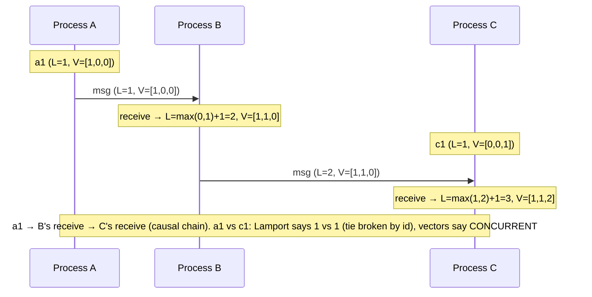
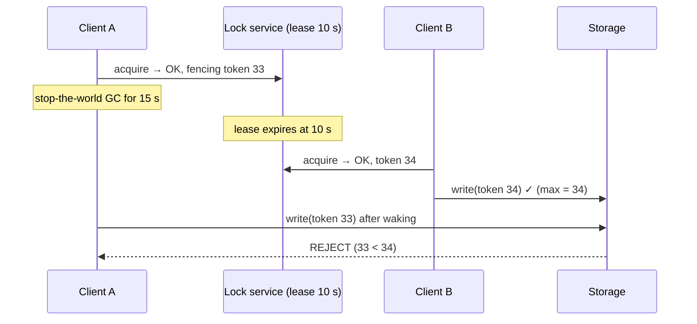

# Clocks, Ordering, Distributed Locks

!!! abstract "TL;DR"
    - **Physical clocks drift** (quartz runs at ~tens of ppm) and get **corrected by NTP** (sometimes jumping backwards). VMs pause. So wall-clock timestamps from different machines **can't reliably order events**. Within one process, measure durations with a **monotonic clock** (`System.nanoTime`), never wall time.
    - **Logical clocks order events without synchronised time:**
        - **Lamport timestamps** give a total order consistent with causality (if a → b then L(a) < L(b), but not the reverse).
        - **Vector clocks** detect **causality vs concurrency** exactly.
        - **Hybrid logical clocks (HLC)** combine physical time with a logical counter (CockroachDB, MongoDB cluster time).
        - **TrueTime** (Spanner) exposes clock **uncertainty intervals** and waits them out.
    - **Ordering in practice:** you rarely need a global order. Use **per-key ordering**: Kafka partition by key, FIFO groups, per-aggregate version numbers. Total order costs a single leader or consensus (**total order broadcast ≡ consensus**).
    - **Distributed locks** are **leases** (they expire). A lock holder can pause past expiry and keep acting, so **locks alone don't give mutual exclusion**.
        - Use **fencing tokens** (monotonic numbers checked by the protected resource).
        - Release only your own lock (**compare-and-delete**).
        - Prefer **consensus-backed** stores (etcd, ZooKeeper) or the **database itself** (row locks, advisory locks, conditional updates) for correctness.
        - Redis locks are fine for **efficiency** (avoiding duplicate work), not for **correctness**.
    - The best lock is often **no lock**: make operations **idempotent** or **conditional** (compare-and-set, unique constraints).

## Why it matters

"Use timestamps to order events" and "use a Redis lock" are two of the most common wrong answers in senior interviews. Real incidents come from last-writer-wins with skewed clocks dropping newer data, and from locks that two processes both believed they held. Interviewers expect you to know logical clocks, the lease/fencing problem and the Redlock debate.

## Core concepts

### Physical clocks and their failure modes

| Issue | Effect | Mitigation |
|---|---|---|
| Drift (~10–200 ppm) | Clocks diverge by ms to s per day | NTP / chrony, PTP (AWS Time Sync, sub-ms) |
| NTP step corrections | Wall clock **jumps**, even backwards | Slewing. Monotonic clocks for durations |
| Leap seconds | 23:59:60 handling, smearing differs by provider | Use smeared time consistently |
| VM / GC pauses | Process "loses" seconds without noticing | Don't rely on local time for lease safety. Fencing |
| Different time zones / formats | Ordering bugs | Store UTC instants (`Instant`), not local times |

**Wall clock vs monotonic clock:**

- `System.currentTimeMillis()` / `Instant.now()`: wall time, can jump. Use it for timestamps shown to humans or stored.
- `System.nanoTime()`: monotonic, only meaningful as a **difference** within one JVM. Use it for timeouts, latency and rate limiters.

### Logical clocks


*Notice what each clock can tell you. **Lamport** gives every event a number that respects causality (good for a total order with a tiebreak), but L(x) < L(y) doesn't prove x caused y. **Vector clocks** can say "concurrent" for a1 and c1, which you need for conflict detection.*

| Clock | Size | Guarantees | Used in |
|---|---|---|---|
| Lamport timestamp | 1 counter | a → b ⇒ L(a) < L(b). Total order with an ID tiebreak | Total ordering, distributed mutual exclusion algorithms |
| Vector clock / version vector | 1 counter per node/replica | a → b ⇔ V(a) < V(b). Detects concurrency | Dynamo-style conflict detection, Riak |
| Hybrid logical clock (HLC) | physical time + logical counter | Causality + close to physical time | CockroachDB, YugabyteDB, MongoDB cluster time |
| TrueTime | [earliest, latest] interval | Externally consistent commit order (with commit-wait) | Google Spanner |

### Ordering guarantees you actually need

- **Per-key order** (most common): all events for order 42 in sequence. Use a Kafka partition key, an SQS FIFO message group, or per-aggregate version numbers (`version = previous + 1`).
- **Causal order:** a reply after its question. Track dependencies or keep causally related data on one partition.
- **Total order:** every node sees all events in the same order (replicated logs, sequencers). **Total order broadcast is equivalent to consensus**, so it needs a leader or consensus and limits throughput.
- **Don't use wall-clock timestamps to order cross-machine events.** Use sequence numbers from the owner of the data (DB sequence, partition offset, aggregate version).

### Distributed locks: leases and fencing


*Notice that the lock service did nothing wrong, and A **genuinely believed** it held the lock. Only the storage-side check of a **monotonic fencing token** prevents corruption. Any lock without fencing is a best-effort optimisation.*

**Lock options:**

| Option | Correct for mutual exclusion? | Notes |
|---|---|---|
| Redis `SET key val NX PX ttl` (single node) | **Efficiency only** | Fast. Lost on failover with async replication. Release with compare-and-delete |
| Redlock (N independent Redis) | Debated | Depends on timing assumptions (bounded pauses and drift). Kleppmann vs antirez debate. No fencing tokens |
| ZooKeeper (ephemeral sequential znodes, Curator) | Yes, with fencing (zxid/version) | Consensus-backed, session-based |
| etcd (lease + revision) | Yes, with fencing (revision) | Consensus-backed. Kubernetes uses it |
| DB row lock (`SELECT … FOR UPDATE`) / advisory lock (`pg_try_advisory_lock`) | Yes, for data in that DB | Simple when the protected data lives in the same DB |
| Conditional writes / unique constraints | Best: no lock needed | Compare-and-set, version columns, idempotency |

**Efficiency vs correctness** (Kleppmann): if a lock failure only causes duplicate *work* (sending the same report twice), a Redis lock is fine. If it causes *incorrect data* (double spend, corrupted file), you need consensus + fencing, or a design that doesn't need a lock.

## In practice: code & configuration

=== "❌ Common mistake"
    ```java
    // Lock with no owner check (deletes someone else's lock), no fencing,
    // and wall-clock math for expiry.
    if (redis.setIfAbsent("lock:payout", "1", Duration.ofSeconds(30))) {
        long start = System.currentTimeMillis();     // wall clock can jump
        runPayouts();                                 // may run > 30 s → another instance enters
        redis.delete("lock:payout");                  // may delete the OTHER instance's lock
    }
    ```

=== "✅ Correct approach"
    ```lua
    -- acquire.lua: KEYS[1]=lock key, ARGV[1]=owner token, ARGV[2]=ttl ms
    -- Returns a fencing token (monotonic counter) if acquired, else nil.
    -- Redis Cluster: use a hash-tagged key (e.g. "{lock:payout}") so both keys share a slot.
    if redis.call('SET', KEYS[1], ARGV[1], 'NX', 'PX', ARGV[2]) then
      return redis.call('INCR', KEYS[1] .. ':fence')
    end
    return nil
    ```

    ```lua
    -- release.lua: delete only if we still own it (compare-and-delete)
    if redis.call('GET', KEYS[1]) == ARGV[1] then
      return redis.call('DEL', KEYS[1])
    end
    return 0
    ```

    ```java
    String owner = UUID.randomUUID().toString();
    Long fence = redis.execute(acquireScript, List.of("lock:payout"), owner, "30000");
    if (fence != null) {
        try {
            payouts.run(fence);   // every write: UPDATE ... SET fence = :fence WHERE ... AND fence < :fence
        } finally {
            redis.execute(releaseScript, List.of("lock:payout"), owner);
        }
    }
    // Still "efficiency-grade" because Redis failover can lose the lock;
    // correctness comes from the fence check (and idempotent payouts).
    ```

Logical clocks (compiled + tested on Java 21):

```java
final class LamportClock {
    private long time;
    synchronized long tick() { return ++time; }                          // local event / send
    synchronized long onReceive(long remote) { time = Math.max(time, remote) + 1; return time; }
}

final class VectorClock {
    enum Order { BEFORE, AFTER, EQUAL, CONCURRENT }
    private final Map<String, Long> v = new HashMap<>();

    void tick(String node) { v.merge(node, 1L, Long::sum); }
    void merge(VectorClock other) { other.v.forEach((n, c) -> v.merge(n, c, Math::max)); }

    Order compare(VectorClock o) {
        boolean less = false, greater = false;
        Set<String> nodes = new HashSet<>(v.keySet()); nodes.addAll(o.v.keySet());
        for (String n : nodes) {
            long a = v.getOrDefault(n, 0L), b = o.v.getOrDefault(n, 0L);
            if (a < b) less = true; else if (a > b) greater = true;
        }
        if (less && greater) return Order.CONCURRENT;   // conflict: neither happened before the other
        if (less) return Order.BEFORE;
        if (greater) return Order.AFTER;
        return Order.EQUAL;
    }
}
```

Database-native alternatives (often the best choice):

```sql
-- PostgreSQL advisory lock for a singleton job (released at transaction end)
SELECT pg_try_advisory_xact_lock(hashtext('nightly-payouts'));   -- true → proceed, false → skip

-- Optimistic concurrency: no lock, conflict detection via version
UPDATE prescription SET state = 'FILLED', version = version + 1
 WHERE id = :id AND version = :expectedVersion;                    -- 0 rows → someone else changed it
```

## Real-world usage

- **Google Spanner** waits out TrueTime uncertainty (commit-wait, a few ms) to give externally consistent transactions. Its clocks use GPS and atomic references.
- **CockroachDB / YugabyteDB** use HLCs with a max-offset setting. Nodes with clock skew beyond the limit **shut themselves down** to protect consistency.
- **AWS Time Sync Service** (and PTP on newer instances) provides microsecond-level accuracy, which reduces but doesn't remove the need for logical ordering.
- **Kafka** gives per-partition total order through offsets. That's how most microservice systems get "ordering", by key.
- **Incidents and debates:** Cloudflare's 2017 leap-second bug (a negative duration from wall-clock subtraction crashed DNS) and Kleppmann's 2016 Redlock critique (fencing tokens) are standard references.

## Trade-offs & production gotchas

| Need | Choose | Cost |
|---|---|---|
| Order events per entity | Partition by key / aggregate version | Hot keys limit throughput |
| Detect concurrent updates | Vector/version clocks or version columns | Metadata size, merge logic |
| Approximate global time order | HLC | Bounded-skew assumption |
| Strict global order | Single sequencer / consensus | Throughput and latency |
| Avoid duplicate background work | Redis lock or ShedLock (efficiency) | Rare duplicates possible, so make work idempotent |
| Protect data correctness | DB constraints / conditional writes, or etcd/ZooKeeper + fencing | Complexity, latency |

!!! warning "Gotchas"
    - **Never compute durations from wall clocks** (`currentTimeMillis` deltas can be negative). Use `nanoTime`.
    - **Last-writer-wins with client timestamps** lets a skewed client overwrite newer data. Use server-assigned versions.
    - **Lock TTL renewal ("watchdog")** narrows the window but doesn't remove it. You still need fencing.
    - **Releasing a lock you no longer own** (no owner check) breaks the next holder's exclusion.

## How this connects to my experience

- **Where I used it:**
    - Kafka per-key ordering at OptumRx.
    - Redis (OptumRx), scheduled jobs in scaled Spring services.
    - MongoDB/DynamoDB versioned updates.
    - CCKM: key rotation workflows (operations that must not run concurrently on the same key).
- **Talking points:**
    - "Ordering came from Kafka keys (one entity, one partition), not timestamps. Consumers used version checks to ignore stale events." *[confirm: version checks in consumers]*
    - "For singleton jobs I'd use ShedLock (DB-backed) or a Kubernetes Lease, and make the job idempotent, because a lease can expire while the holder is still running." *[confirm: mechanism you used]*
    - "In key rotation, concurrent rotations of the same key must be prevented. That's done with a state check at the key store (conditional transition) rather than relying only on an in-memory or Redis lock." *[confirm: CCKM approach]*
- **Likely follow-up chain:** "How did you guarantee ordering?" → "What about events with timestamps from different services?" → "How do you prevent two instances processing the same job?" → "Is a Redis lock safe?" Answer: partition key + versions → don't trust cross-machine timestamps, use sequence numbers → lease lock + idempotent job + fencing → efficiency-grade only.

## Interview questions

### Fundamentals

??? question "Q1. Why can't you order events across machines by timestamp?"
    **Answer:** Clocks drift and are corrected by NTP (they can jump backwards), VMs pause, and skew between machines can be milliseconds to seconds. Event A can get a later timestamp than event B even though A happened first or caused B. Use logical clocks, sequence numbers or a single sequencer.

    **Interviewer listens for:** drift, jumps, pauses.

    **Common wrong answer:** "NTP keeps clocks in sync, so it's fine".

??? question "Q2. Wall clock vs monotonic clock?"
    **Answer:** A wall clock (`Instant.now`) represents real date and time and can jump. A monotonic clock (`System.nanoTime`) only moves forward and is meaningful only for measuring elapsed time within one process. Use monotonic for timeouts and latency, and wall for timestamps.

    **Interviewer listens for:** the right usage of each.

    **Common wrong answer:** "`nanoTime` is just more precise wall time".

??? question "Q3. What is a Lamport timestamp?"
    **Answer:** A counter per process, incremented on each event, sent with messages. The receiver sets `max(local, received) + 1`. If a happened before b, then L(a) < L(b). With node IDs as a tiebreak it gives a total order consistent with causality, but it can't detect concurrency.

    **Interviewer listens for:** the one-directional implication.

    **Common wrong answer:** "it gives the real time of events".

??? question "Q4. What do vector clocks add?"
    **Answer:** One counter per node. Comparing two vectors tells you if one happened before the other (all components ≤) or if they're **concurrent** (each has some larger component). They're used to detect conflicting concurrent updates in replicated stores.

    **Interviewer listens for:** concurrency detection.

    **Common wrong answer:** "the same as Lamport, but bigger".

### Intermediate

??? question "Q5. How do you get ordering of events per order in a microservice system?"
    **Answer:** Route all events for an order to the same partition (Kafka key = orderId) or the same FIFO message group. Producers emit in order (idempotent producer to avoid reordering on retry). Consumers process per partition sequentially and keep aggregate versions to drop stale or duplicate events.

    **Interviewer listens for:** a key-based partition plus versions.

    **Common wrong answer:** "sort by timestamp in the consumer".

??? question "Q6. How do you implement a Redis lock safely?"
    **Answer:**
    - `SET key <unique-owner> NX PX <ttl>` to acquire.
    - Release with a Lua compare-and-delete (only if the value equals your owner token).
    - Renew carefully if needed.
    - Treat it as efficiency-grade: make the protected work idempotent, or add fencing tokens checked by the resource.

    **Interviewer listens for:** owner check, TTL, its limits.

    **Common wrong answer:** "SETNX then DEL".

??? question "Q7. What is a fencing token?"
    **Answer:** A monotonically increasing number issued with each lock or lease acquisition (ZooKeeper zxid, etcd revision, a counter). The protected resource remembers the highest token seen and rejects operations with lower tokens, so a paused ex-holder can't corrupt data.

    **Interviewer listens for:** the resource-side check.

    **Common wrong answer:** "a password for the lock".

??? question "Q8. What is a lease, and how is it different from a lock?"
    **Answer:** A lease is a lock **with an expiry**. The holder must renew it before it runs out. If the holder crashes, the lease expires and someone else can take over, so there is no deadlock. The catch is **time**: a holder that pauses (GC, VM freeze) past the expiry still believes it holds the lease while another node has taken it. Leases therefore need a safety margin, holders that check remaining time before acting, and **fencing tokens** at the resource so a stale holder's writes are rejected.

    **Interviewer listens for:** expiry and renewal, no deadlock on crash, clock and pause hazards, fencing tokens.

    **Common wrong answer:** "A lease with a short TTL is safe." A stop-the-world pause longer than the TTL still produces two holders.

### Senior

??? question "Q9. Summarise the Redlock debate."
    **Answer:**
    - **Redlock** acquires locks on a majority of N independent Redis nodes within a validity time.
    - **Kleppmann's critique:** it relies on bounded clock drift and process pauses, which real systems violate (GC, NTP jumps), and it doesn't provide fencing tokens, so it isn't safe for correctness.
    - **Antirez's response:** it's acceptable under its stated assumptions, and fencing could be added elsewhere.
    - **Practical takeaway:** Redis locks for efficiency, consensus + fencing or DB constraints for correctness.

    **Interviewer listens for:** a balanced summary plus the takeaway.

    **Common wrong answer:** "Redlock is perfectly safe".

??? question "Q10. HLC vs TrueTime?"
    **Answer:** **HLC** combines physical time and a logical counter. It preserves causality while staying close to wall time, but needs a bounded max clock offset (CockroachDB nodes exit if they exceed it). **TrueTime** provides explicit uncertainty bounds (GPS + atomic clocks). Spanner waits out the uncertainty at commit for external consistency. TrueTime gives stronger guarantees with special hardware. HLC runs on commodity clocks.

    **Interviewer listens for:** the uncertainty handling difference.

    **Common wrong answer:** "both are just NTP".

### Scenario-based

??? question "Q11. A nightly payout job ran twice in parallel and paid some vendors twice. Design the fix."
    **Answer:**
    - **Prevention:** a consensus- or DB-based lock (ShedLock on the payouts DB, or a Postgres advisory lock), plus idempotency: a unique `(payout_run_date, vendor_id)` constraint so double payment is impossible even if two runs overlap.
    - Fencing tokens on writes to external payout rails (or idempotency keys with the bank/provider).
    - Alert on overlapping runs.
    - Reconciliation to recover duplicates.

    **Interviewer listens for:** idempotency as the real fix.

    **Common wrong answer:** "use a longer Redis TTL".

??? question "Q12. Two services sync profile updates using 'last updated timestamp wins'. Users lose edits. Why, and what's the fix?"
    **Answer:** Clock skew between services or devices: an older edit with a later (skewed) timestamp overwrites a newer one. Concurrent edits also silently overwrite each other. Fixes:
    - server-assigned monotonic versions per profile (optimistic concurrency: reject or merge on version mismatch)
    - field-level merges or CRDTs for concurrent edits
    - a single writer (home service) per profile
    - HLC if timestamps are unavoidable

    **Interviewer listens for:** skew plus concurrency, and versions.

    **Common wrong answer:** "sync clocks better".

## Cheat sheet

| Concept | Remember |
|---|---|
| Physical clocks | Drift, NTP jumps, leap seconds, VM/GC pauses. UTC `Instant` for storage |
| Durations | `System.nanoTime()` (monotonic), never wall-clock deltas |
| Lamport | a→b ⇒ L(a)<L(b). Total order with a tiebreak. No concurrency detection |
| Vector | Detects concurrency. Conflict resolution in replicas |
| HLC / TrueTime | Physical + logical / uncertainty interval + commit-wait |
| Ordering | Per key (partition, FIFO group, versions). Total order = consensus |
| Locks | Leases expire → **fencing tokens** at the resource |
| Redis lock | `SET NX PX` + owner token + Lua compare-and-delete. Efficiency-grade |
| Correctness | DB constraints / conditional updates, etcd/ZooKeeper + fencing |
| Best lock | No lock: idempotency, compare-and-set |

## Sources
1. [Leslie Lamport: Time, Clocks, and the Ordering of Events in a Distributed System (1978)](https://lamport.azurewebsites.net/pubs/time-clocks.pdf).
2. Martin Kleppmann, *Designing Data-Intensive Applications*, ch. 8 (unreliable clocks, process pauses, fencing) and ch. 9 (ordering, total order broadcast).
3. [Martin Kleppmann: How to do distributed locking](https://martin.kleppmann.com/2016/02/08/how-to-do-distributed-locking.html) and [antirez: Is Redlock safe?](http://antirez.com/news/101).
4. [Redis: Distributed locks with Redis](https://redis.io/docs/latest/develop/use/patterns/distributed-locks/).
5. [Kulkarni et al.: Logical Physical Clocks (HLC, 2014)](https://cse.buffalo.edu/tech-reports/2014-04.pdf).
6. [Google Spanner (OSDI 2012)](https://research.google/pubs/spanner-googles-globally-distributed-database-2/): TrueTime and commit-wait.
7. [CockroachDB: Living without atomic clocks](https://www.cockroachlabs.com/blog/living-without-atomic-clocks/).
8. [Cloudflare: How and why the leap second affected Cloudflare DNS (2017)](https://blog.cloudflare.com/how-and-why-the-leap-second-affected-cloudflare-dns/).
9. [PostgreSQL: advisory locks](https://www.postgresql.org/docs/current/explicit-locking.html#ADVISORY-LOCKS).
