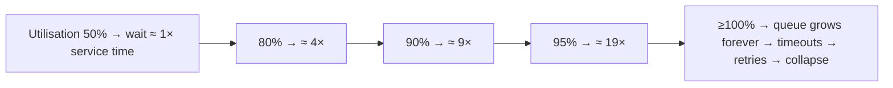
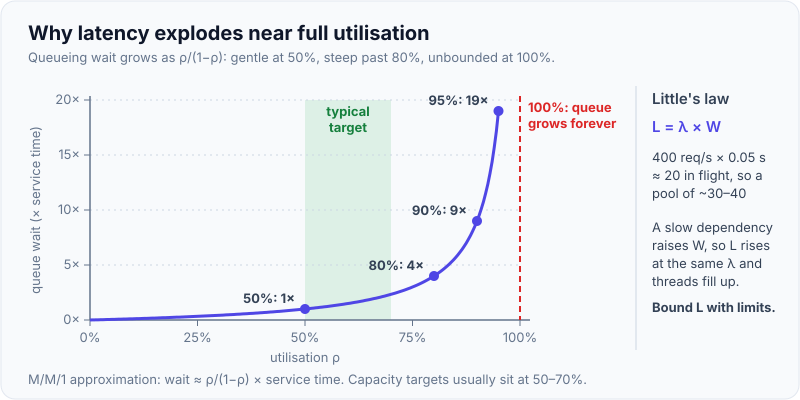
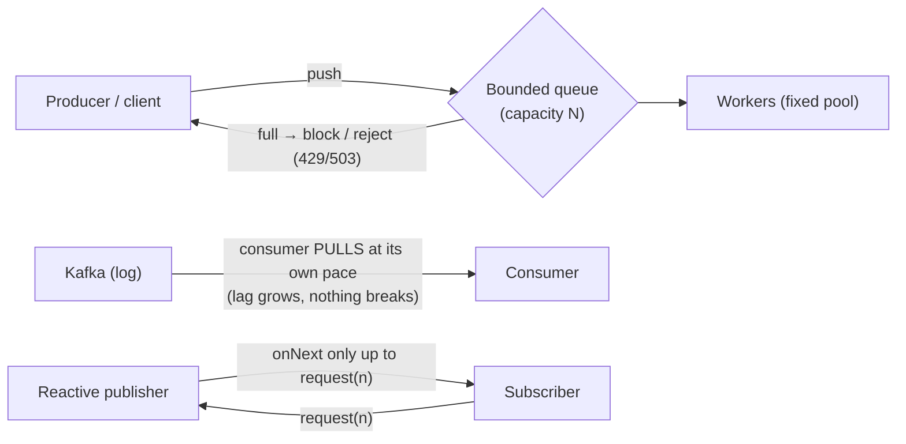

# Backpressure & Load Shedding

!!! abstract "Key takeaways"
    - **Overload is inevitable** (spikes, retries, slow dependencies). The goal is to **degrade gracefully instead of collapsing**. As utilisation ρ → 1, queueing delay grows without bound (≈ ρ/(1−ρ)), and unbounded queues turn overload into **latency for everyone, then timeouts, then retry storms**.
    - **Little's law:** items in system = arrival rate × time in system (**L = λW**). It sizes pools and concurrency: 200 req/s × 0.25 s = 50 concurrent requests.
    - **Backpressure** pushes "slow down" signals **upstream** so producers don't outrun consumers:
        - bounded queues that block or reject
        - pull-based consumption (Kafka consumers, reactive `request(n)`)
        - TCP flow control
        - 429/503 with `Retry-After`
    - **Load shedding** deliberately **rejects some work early and cheaply** so the rest meets its SLO:
        - admission control on concurrency or queue time
        - **priorities** (critical before best-effort)
        - drop requests whose **deadline has passed**
        - **adaptive concurrency limits** (Netflix concurrency-limits, inspired by TCP Vegas)
        - **client-side adaptive throttling** (Google SRE)
    - **Combine** bounded resources (pools, queues), timeouts, circuit breakers, rate limits and shedding. **Never have an unbounded queue in a request path.**

## Why it matters

The hardest outages aren't "server down". They're **overload**: everything is up but slow, threads are exhausted, queues are growing, and clients are retrying. Interviewers ask "what happens when traffic doubles?" or "your consumer can't keep up. What do you do?" They want to hear queue bounds, backpressure, shedding by priority, and Little's law, not just "autoscale". Autoscaling takes minutes, and overload happens in seconds.

## Core concepts

### Why latency explodes near full utilisation


*Notice the non-linearity (M/M/1 approximation: wait ≈ ρ/(1−ρ) × service time). Running "hot" at 90% leaves no headroom for spikes. That's why capacity targets usually sit around 50–70%, and why bounded queues plus shedding are needed for the rest.*

{ loading=lazy }
*Notice how flat the curve is in the target band and how steep it gets past 80%: the last few percent of utilisation cost the most latency.*

**Little's law (L = λW):**

- Size thread pools and concurrency: 400 RPS at 50 ms → about 20 in-flight. Add headroom and size the pool to around 30–40, not 500.
- If W grows (a slow dependency) at constant λ, L grows, so threads and connections fill up. **Bound L** (concurrency limits) to protect the service.

### Backpressure mechanisms


*Notice the different forms: **block or reject** at a bounded queue (synchronous), **pull** (Kafka, SQS: the backlog becomes lag, not failure), and **demand signalling** (Reactive Streams `request(n)`, HTTP/2 and TCP flow-control windows).*

| Mechanism | Where | Behaviour under overload |
|---|---|---|
| Bounded queue + blocking | In-process pipelines | Producer slows down (can cascade upstream) |
| Bounded queue + rejection | Thread pools, servers | Fast failure (429/503), the caller backs off |
| Pull-based consumption | Kafka, SQS, Kinesis | Backlog/lag grows, consumers keep a safe rate |
| Reactive Streams `request(n)` | WebFlux, Reactor, RxJava | Demand-driven flow, buffer limits |
| TCP / HTTP/2 flow control | Network | Sender window shrinks |
| `Retry-After` / 429 | APIs | Clients pause (if they honour it) |

{ loading=lazy }
*Watch the latency bars: the unbounded queue makes everyone wait, the bounded one says no quickly to some so the rest stay fast.*

### Load shedding strategies

| Strategy | How | Notes |
|---|---|---|
| **Concurrency limit (admission control)** | Reject when in-flight > limit | Protects latency. Limit from Little's law or adaptive |
| **Adaptive concurrency** | Adjust the limit from latency changes (gradient, Vegas-like) | Netflix concurrency-limits, Envoy adaptive concurrency |
| **Priority shedding** | Drop low-priority traffic first (analytics, prefetch, batch) | Needs request classification (headers, endpoints, tenants) |
| **Deadline-aware dropping** | Drop queued requests whose client deadline has passed | Avoids wasted work (gRPC deadlines) |
| **Queue-time limit (CoDel / adaptive LIFO)** | Shed when time-in-queue > target. Under overload serve newest first | Facebook used adaptive LIFO + CoDel for RPC queues |
| **Client-side adaptive throttling** | Clients reject locally when the backend's accept ratio drops | Google SRE: `p_reject = max(0, (requests − K·accepts)/(requests + 1))`, K ≈ 2 |
| **Rate limiting / quotas** | Per client/tenant caps | Fairness, abuse (see the rate-limiting page) |
| **Graceful degradation** | Serve cached, partial or simplified results | Feature flags, fallbacks |

**Shed early and cheaply:** reject at the edge or before expensive work (auth, DB calls). A rejected request should cost microseconds, not milliseconds.

### Overload in message consumers

- A pull model means overload shows up as **lag**, which is healthy if it stays bounded and within the latency SLO.
- **Don't** fetch more than you can process before `max.poll.interval.ms` or the visibility timeout. Tune `max.poll.records`, batch size and concurrency.
- **Autoscale on lag** (KEDA), but **cap concurrency** at what downstream DBs and APIs can take. Otherwise you move the overload downstream.
- **Pause** consumption (`consumer.pause()`) when a downstream breaker is open, and resume later.

## In practice: code & configuration

=== "❌ Common mistake"
    ```java
    // Unbounded queue: under overload, work piles up, latency → minutes, memory → OOM.
    ExecutorService pool = Executors.newFixedThreadPool(50);   // LinkedBlockingQueue with no bound!
    // Tomcat with huge thread counts and accept queue: every request waits, then times out.
    // server.tomcat.threads.max=2000, accept-count=10000
    ```

=== "✅ Correct approach"
    ```java
    // Bounded pool + bounded queue + explicit rejection policy → fast 503 instead of collapse.
    ThreadPoolExecutor pool = new ThreadPoolExecutor(
            32, 32, 0L, TimeUnit.MILLISECONDS,
            new ArrayBlockingQueue<>(64),                      // small, bounded
            new ThreadPoolExecutor.AbortPolicy());             // RejectedExecutionException → 503

    // Admission control with priorities (critical traffic keeps a reserved share).
    final class AdmissionController {
        private final Semaphore total;
        private final int reservedForCritical;
        AdmissionController(int limit, int reservedForCritical) {
            this.total = new Semaphore(limit);
            this.reservedForCritical = reservedForCritical;
        }
        boolean tryAdmit(boolean critical) {
            if (critical) return total.tryAcquire();                       // may use the full limit
            // best-effort traffic can't consume the reserved slots
            if (total.availablePermits() <= reservedForCritical) return false;
            return total.tryAcquire();
        }
        void release() { total.release(); }
    }
    ```

Client-side adaptive throttling (Google SRE formula, compiled + tested on Java 21):

```java
final class AdaptiveThrottle {
    private final double k;                      // 2.0 = allow up to 2× accepted traffic
    private final RandomGenerator random;
    private long requests, accepts;              // sliding window in production (e.g. last 2 min)

    AdaptiveThrottle(double k, RandomGenerator random) { this.k = k; this.random = random; }

    synchronized boolean allowLocally() {
        double pReject = Math.max(0, (requests - k * accepts) / (requests + 1.0));
        requests++;
        return random.nextDouble() >= pReject;   // reject locally without calling the backend
    }
    synchronized void onBackendAccepted() { accepts++; }
}
```

```yaml
# Spring Boot (Tomcat): bound concurrency and the accept queue; fail fast instead of piling up
server:
  tomcat:
    threads:
      max: 200            # ≈ Little's law: peak RPS × p99 latency, plus headroom
    accept-count: 100     # bounded OS accept backlog
    connection-timeout: 5s
  shutdown: graceful
# Kafka consumer: process what you fetch within the poll interval
spring:
  kafka:
    consumer:
      max-poll-records: 100
    listener:
      concurrency: 4      # cap by downstream capacity, not by partition count alone
```

```java
// Reactive backpressure (WebFlux/Reactor): limit in-flight downstream calls and buffer size.
Flux.fromIterable(prescriptionIds)
    .flatMap(id -> pricingClient.price(id), 16)       // at most 16 concurrent calls
    .onBackpressureBuffer(1_000, dropped -> metrics.increment("pricing.dropped"))
    .subscribe(this::store);
```

## Real-world usage

- **Google SRE** ("Handling Overload"): per-customer limits, criticality-based shedding, and **client-side adaptive throttling** that keeps rejected traffic from even reaching backends.
- **Netflix concurrency-limits** (and Envoy's adaptive concurrency filter) adjust limits from latency, like TCP congestion control, protecting services without hand-tuned numbers.
- **Facebook / Meta:** adaptive LIFO + CoDel in RPC servers. Under overload, serve the newest requests (whose clients are still waiting) and drop stale ones.
- **AWS Builders' Library:** "Using load shedding to avoid overload" (shed cheaply, prioritise, keep goodput) and "Avoiding insurmountable queue backlogs" (bounded queues, LIFO, TTLs on queued work).
- **Stripe:** load shedders that drop low-priority traffic (e.g. test-mode or analytics requests) so critical API calls survive.
- **Healthcare and banking:** during peaks (open enrolment, month-end), critical flows (dispensing, payments) get priority, and reports and exports are queued or shed.

## Trade-offs & production gotchas

| Mechanism | Pros | Cons |
|---|---|---|
| Blocking backpressure | No data loss, natural flow control | Can propagate stalls upstream, deadlocks |
| Rejection (429/503) | Fast, protects the server | Clients must back off correctly |
| Pull/lag | Durable buffering, no loss | Latency grows. Needs lag SLOs |
| Static concurrency limits | Simple, predictable | Need tuning, can be wrong after changes |
| Adaptive limits | Self-tuning | More complex, can oscillate |
| Priority shedding | Protects critical flows | Requires classification and fairness policy |
| LIFO under overload | Serves fresh requests | Unfair to old requests (they've likely timed out anyway) |

!!! warning "Gotchas"
    - **Unbounded queues are latent outages:** `Executors.newFixedThreadPool`, unbounded `LinkedBlockingQueue`, in-memory buffers in consumers.
    - **Huge thread pools don't add capacity.** They add contention and memory use, and move the queue into the dependency.
    - **Autoscaling is too slow for spikes.** Shed first, scale second, and make sure new capacity doesn't overload the DB.
    - **Measure goodput** (successful requests within the SLO), not just throughput.

## How this connects to my experience

- **Where I used it:**
    - OptumRx Meteor: the GraphQL Consumer Service fanning out to **5 upstream systems** (protecting the upstreams is a backpressure problem), Kafka consumers with retry and DLQ, 750K+ users.
    - Deloitte: SQS + Lambda consumers (concurrency caps).
- **Talking points:**
    - "The GraphQL layer must not amplify load onto upstreams: bounded concurrency per upstream (bulkheads), timeouts, caching, and graceful partial responses when an upstream is saturated." *[confirm: bulkheads/limits used]*
    - "Kafka gives natural backpressure (pull). We sized concurrency to downstream capacity and watched consumer lag as the signal, rather than scaling consumers blindly." *[confirm: lag alerting, KEDA or HPA]*
    - "On SQS + Lambda, reserved/maximum concurrency on the event source protected RDS." *[confirm]*
- **Likely follow-up chain:** "Traffic doubles. What breaks first?" → "How do you protect upstreams?" → "What do you shed?" → "How do you size pools?" Answer: the slowest dependency / thread pools → bulkheads + concurrency limits + caching → low-priority queries and prefetches, with critical patient flows kept → Little's law with headroom, then validate with load tests.

## Interview questions

### Fundamentals

??? question "Q1. What is backpressure?"
    **Answer:** A mechanism for a slower consumer to signal producers to slow down, so work doesn't pile up unbounded: bounded queues that block or reject, pull-based consumption, demand signalling (`request(n)`), TCP windows, 429 with Retry-After.

    **Interviewer listens for:** signals propagating upstream.

    **Common wrong answer:** "a big buffer".

??? question "Q2. What is load shedding and why do it?"
    **Answer:** Deliberately rejecting some requests early (cheaply) when overloaded, so the accepted ones still meet their latency SLOs. Without it, every request slows down until all time out (zero goodput), and retries make it worse.

    **Interviewer listens for:** goodput, plus "fail some fast instead of all slowly".

    **Common wrong answer:** "dropping data randomly is always bad".

??? question "Q3. State Little's law and use it."
    **Answer:** L = λW: average in-flight items = arrival rate × average time in system. At 300 RPS and 100 ms latency, there are about 30 in-flight requests, so size pools around 30–50 with headroom. If latency rises to 1 s, in-flight jumps to 300, which is why you bound concurrency.

    **Interviewer listens for:** applying it to pool sizing.

    **Common wrong answer:** "it's about network bandwidth".

??? question "Q4. Why are unbounded queues dangerous?"
    **Answer:** Under sustained overload they grow without limit: latency becomes huge (requests whose clients gave up are still processed), memory blows up (OOM), and recovery takes ages (the backlog must drain). Bounded queues force a decision: reject, shed or block.

    **Interviewer listens for:** latency, memory and wasted work.

    **Common wrong answer:** "they prevent data loss, so they're good".

### Intermediate

??? question "Q5. Why does latency rise sharply near full utilisation?"
    **Answer:** Queueing theory: waiting time grows roughly as ρ/(1−ρ). At 90% utilisation, waiting is about 9× service time. Random arrivals cluster and queues form. That's why we keep headroom (50–70% target) and shed beyond limits.

    **Interviewer listens for:** the non-linear curve.

    **Common wrong answer:** "it grows linearly".

??? question "Q6. How does Kafka provide backpressure?"
    **Answer:** Consumers pull at their own pace. If they're slower than producers, lag accumulates in the retained log instead of overloading the consumer. Tune `max.poll.records` and processing so polls happen within `max.poll.interval.ms`. Monitor lag, and scale consumers (up to the partition count) within downstream capacity. Use `pause()`/`resume()` when downstream is unhealthy.

    **Interviewer listens for:** pull + lag + poll-interval constraints.

    **Common wrong answer:** "Kafka slows producers automatically" (it doesn't, apart from quotas).

??? question "Q7. How do you decide what to shed?"
    **Answer:** Classify traffic by business criticality (dispense/checkout > browse > analytics/prefetch), by tenant fairness, and by deadline (drop requests already past their deadline). Reserve capacity for critical classes. Shed before expensive work. Expose metrics for shed counts per class.

    **Interviewer listens for:** priorities and cheap rejection.

    **Common wrong answer:** "random".

??? question "Q8. Rate limiting vs backpressure vs load shedding: how are they different?"
    **Answer:** **Rate limiting** enforces a fixed policy per client (100 req/s per API key) regardless of current health. It is about fairness and contracts. **Backpressure** is a signal from a busy consumer to slow the producer down (bounded queues, Reactive Streams `request(n)`, Kafka consumers pulling at their own pace). It works when the producer can wait. **Load shedding** is the server rejecting work it cannot finish in time (fast 503 or 429) based on current capacity, to protect itself when the caller cannot or will not slow down. Production systems usually use all three.

    **Interviewer listens for:** policy vs signal vs self-protection, when each applies, combined use.

    **Common wrong answer:** "They are the same thing: returning 429." Backpressure often never returns an error; it just stops pulling.

### Senior

??? question "Q9. Explain adaptive concurrency limits."
    **Answer:** Instead of a fixed limit, the server (or client) continuously estimates the right concurrency from latency: when latency rises above the no-load baseline, reduce the limit, and when it's healthy, increase it (gradient or Vegas-like algorithms, AIMD). It tracks capacity changes (deploys, noisy neighbours) automatically. Examples: Netflix concurrency-limits, Envoy adaptive concurrency.

    **Interviewer listens for:** a latency-driven feedback loop.

    **Common wrong answer:** "autoscaling".

??? question "Q10. What is client-side adaptive throttling?"
    **Answer:** Each client tracks requests sent vs requests accepted by the backend over a window. When the backend rejects a lot, the client probabilistically rejects locally: `p = max(0, (requests − K·accepts)/(requests+1))` with K ≈ 2. That stops overloaded backends from spending resources even on rejecting requests. It's from Google SRE.

    **Interviewer listens for:** local rejection, and K.

    **Common wrong answer:** "retry more".

### Scenario-based

??? question "Q11. A downstream DB slows down 5×. Your service's threads are exhausted and it times out on everything, including health checks. Redesign."
    **Answer:**
    - Bulkhead the DB calls (a separate bounded pool or semaphore).
    - DB statement and pool-acquire timeouts.
    - A circuit breaker on slow-call rate.
    - Admission control at the edge (concurrency limit, 503 fast).
    - Priority for critical endpoints.
    - Health and readiness endpoints on a separate lightweight path.
    - Cache reads.
    - Shed batch work.
    - Alert on saturation.

    **Interviewer listens for:** isolation + bounded resources + shedding.

    **Common wrong answer:** "increase the thread pool to 2,000".

??? question "Q12. During open enrolment, traffic is 8× normal for 2 hours. Plan for it."
    **Answer:**
    - **Before:** pre-scale (scheduled) and load-test at 10×, warm caches, defer batch jobs, set rate limits per partner, enable shedding policies, feature-flag non-essential features off.
    - **During:** prioritise enrolment and critical flows, shed analytics and prefetch, queue async work, and watch SLOs, saturation and lag.
    - **After:** drain queues at a controlled rate, then post-mortem the capacity model.

    **Interviewer listens for:** proactive plus layered protections.

    **Common wrong answer:** "autoscaling will handle it".

## Cheat sheet

| Concept | Remember |
|---|---|
| Little's law | L = λW. Size pools from RPS × latency + headroom |
| Utilisation | Wait ≈ ρ/(1−ρ). Target 50–70%. Never run at 100% |
| Backpressure | Bounded queues (block/reject), pull (Kafka/SQS lag), `request(n)`, TCP/HTTP2 windows, 429 + Retry-After |
| Shedding | Concurrency limits, priorities, deadline drops, CoDel/adaptive LIFO, adaptive limits, client throttling |
| Google formula | `p_reject = max(0, (req − K·acc)/(req+1))`, K≈2 |
| Consumers | Cap concurrency by downstream capacity, lag SLO, `pause()` on breaker open |
| Never | Unbounded queues in request paths, giant thread pools, autoscale-only plans |
| Measure | Goodput, saturation, queue time, shed counts per class |

## Sources
1. [Google SRE Book: Handling Overload](https://sre.google/sre-book/handling-overload/) and [Addressing Cascading Failures](https://sre.google/sre-book/addressing-cascading-failures/): client-side throttling, criticality.
2. [Amazon Builders' Library: Using load shedding to avoid overload](https://aws.amazon.com/builders-library/using-load-shedding-to-avoid-overload/) and [Avoiding insurmountable queue backlogs](https://aws.amazon.com/builders-library/avoiding-insurmountable-queue-backlogs/).
3. [Netflix: Performance under load (adaptive concurrency limits)](https://netflixtechblog.medium.com/performance-under-load-3e6fa9a60581) and [concurrency-limits library](https://github.com/Netflix/concurrency-limits).
4. [Envoy: adaptive concurrency filter](https://www.envoyproxy.io/docs/envoy/latest/configuration/http/http_filters/adaptive_concurrency_filter).
5. [Facebook: Fail at Scale (ACM Queue): CoDel and adaptive LIFO](https://queue.acm.org/detail.cfm?id=2839461).
6. [Reactive Streams specification](https://www.reactive-streams.org/) and [Project Reactor: backpressure](https://projectreactor.io/docs/core/release/reference/).
7. John D.C. Little, *A Proof for the Queuing Formula L = λW* (1961). Mor Harchol-Balter, *Performance Modeling and Design of Computer Systems*.
8. [Spring Boot: embedded server (Tomcat) properties](https://docs.spring.io/spring-boot/appendix/application-properties/index.html#appendix.application-properties.server).
