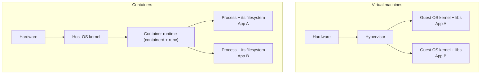
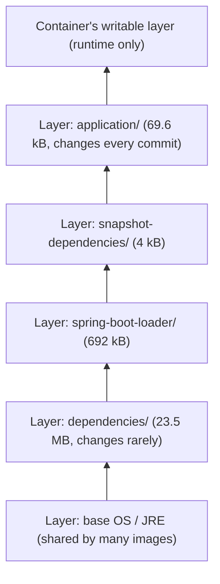
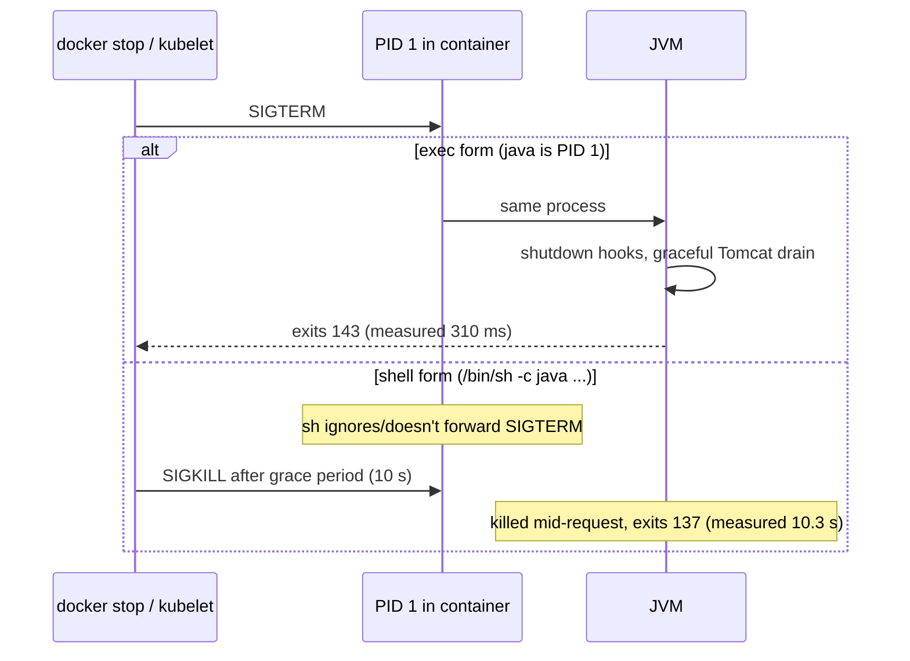

# Containers vs VMs; Docker Images, Layers & Multi-Stage Builds

!!! abstract "TL;DR"
    - A **container** is an ordinary Linux process isolated with **namespaces** (what it can see) and limited with **cgroups** (what it can use), sharing the host kernel. A **VM** runs its own kernel on a hypervisor. Containers start in milliseconds and pack densely. VMs isolate more strongly.
    - An **image** is a stack of read-only, content-addressed **layers** plus config. Each Dockerfile instruction that changes files adds a layer, and unchanged layers are reused from cache and never re-pushed.
    - **Multi-stage builds** keep build tools out of the runtime image, and **layered jars** put rarely changing dependencies in their own layer. Measured for a Spring Boot app: image **248 MB** (JDK + fat jar) → **95 MB** (JRE Alpine, layered) → **84 MB** (distroless). After a one-line code change, the new layer was **23.6 MB** (fat jar) vs **69.6 kB** (layered).
    - Run as **non-root**, use the **exec form** `ENTRYPOINT ["java", …]` so the JVM is PID 1 and receives SIGTERM: measured **310 ms** graceful stop (exit 143) vs **10.3 s** and a SIGKILL (exit 137) with the shell form.
    - The JVM is **container-aware**: with a 512 MB limit the default max heap was **123 MB** (25%). `-XX:MaxRAMPercentage=75` gave **371 MB**. Size heap, metaspace and threads to fit under the limit, or the kernel OOM-kills the container.

## Why it matters

Containers are how almost every Java service ships today, to ECS, EKS, AKS or anything else. Interviewers ask "container vs VM?" as a warm-up, but the senior follow-ups are practical: why is your image 700 MB, why does every deploy push the whole jar, why does the pod take 30 seconds to stop, why was it OOM-killed with a heap smaller than the limit. Good Dockerfiles make deploys faster, cheaper and safer.

The numbers on this page were measured with Docker 29.6 (BuildKit) on Linux, building a minimal Spring Boot 3.5 web app (`spring-boot-starter-web` + actuator, a 23.6 MB fat jar).

## Core concepts

### Containers vs virtual machines


*Notice that containers share one kernel. That's why they start in milliseconds and use little memory, and also why a kernel exploit can cross container boundaries in a way it can't cross VMs.*

| | Containers | Virtual machines |
|---|---|---|
| Isolation unit | Process (namespaces + cgroups) | Whole OS on virtual hardware |
| Kernel | Shared with host | Own kernel per VM |
| Startup | Milliseconds (plus your app's start) | Seconds to minutes |
| Size | MBs (app + libs) | GBs (full OS) |
| Density | Hundreds per host | Tens per host |
| Isolation strength | Weaker (kernel attack surface) | Stronger (hypervisor boundary) |
| Typical use | Microservices, CI jobs, batch | Mixed OS, strong multi-tenancy, legacy apps |

Middle ground: **sandboxed runtimes** (gVisor, Kata Containers, AWS Firecracker microVMs used by Lambda and Fargate) give container ergonomics with VM-like isolation.

### What makes a container

- **Namespaces** give a private view: `pid` (own PID 1), `net` (own interfaces and ports), `mnt` (own filesystem), `uts` (hostname), `ipc`, `user` (UID mapping), `cgroup`.
- **cgroups** enforce limits and accounting: CPU (quota, shares), memory (hard limit, and the OOM killer when exceeded), PIDs, I/O.
- **Union filesystem** (overlayfs): image layers stacked read-only, plus a thin writable layer per container that disappears with the container.
- **Capabilities, seccomp, AppArmor/SELinux** reduce what a root process inside the container can do.

### Images and layers


*Notice the ordering: layers that change least go first. A rebuild after a code change reuses everything below the application layer, so only about 70 kB is rebuilt, pushed and pulled.*

- An image is an **OCI manifest** listing layer digests plus a config (entrypoint, env, user, exposed ports). Layers are tarballs identified by SHA-256, so identical layers are stored and transferred once.
- `RUN`, `COPY` and `ADD` create layers. `ENV`, `USER`, `EXPOSE` and `ENTRYPOINT` change only metadata.
- **Build cache:** BuildKit reuses a layer if the instruction and its inputs (file checksums for `COPY`) are unchanged **and all previous layers were reused**. One early change invalidates everything after it.
- **Deleting files in a later layer doesn't shrink the image**: the bytes are still in the earlier layer. Clean up in the same `RUN` (or in a separate stage).

### Measured: base image and packaging choices

| Image | Base | Packaging | Size | Runs as |
|---|---|---|---|---|
| `hello:fat` | `eclipse-temurin:21-jdk` | Fat jar, shell-form entrypoint | **248 MB** | root (uid 0) |
| `hello:layered` | `eclipse-temurin:21-jre-alpine` (multi-stage) | Spring Boot layered extraction | **95 MB** | `app` (uid 100) |
| `hello:distroless` | `gcr.io/distroless/java21-debian12:nonroot` (multi-stage) | Layered extraction | **84 MB** | nonroot (uid 65532) |

After changing one line of code and rebuilding:

| Image | New layers | Size of the changed layer |
|---|---|---|
| Fat jar | 1 | **23.6 MB** (the whole jar) |
| Layered | 1 | **69.6 kB** (`application/` only) |
| Distroless layered | 1 | ~70 kB |

Each deploy of the fat-jar image pushes and pulls 23.6 MB per node. The layered image moves about 70 kB, because dependency layers are already cached in the registry and on nodes.

## In practice: code & configuration

### A production Dockerfile for Spring Boot

=== "❌ Common mistake"

    ```dockerfile
    FROM eclipse-temurin:21-jdk            # full JDK: compilers and tools you don't need at runtime
    COPY . /src                            # any file change busts the cache for everything after
    WORKDIR /src
    RUN ./mvnw package                     # build tools, sources and ~/.m2 end up in the image
    ENTRYPOINT java -jar target/app.jar    # shell form: /bin/sh is PID 1 and won't forward SIGTERM
    # runs as root, fat jar = one big layer per change
    ```

=== "✅ Better"

    ```dockerfile
    # syntax=docker/dockerfile:1
    # ---- build stage: compile with cached dependencies ----
    FROM eclipse-temurin:21-jdk AS build
    WORKDIR /src
    COPY mvnw pom.xml ./
    COPY .mvn .mvn
    RUN --mount=type=cache,target=/root/.m2 ./mvnw -q dependency:go-offline   # cached unless pom changes
    COPY src src
    RUN --mount=type=cache,target=/root/.m2 ./mvnw -q package -DskipTests
    RUN java -Djarmode=tools -jar target/app.jar extract --layers --launcher --destination /extracted

    # ---- runtime stage: JRE only, layered, non-root ----
    FROM eclipse-temurin:21-jre-alpine
    RUN addgroup -S app && adduser -S app -G app
    WORKDIR /app
    COPY --from=build /extracted/dependencies/ ./
    COPY --from=build /extracted/spring-boot-loader/ ./
    COPY --from=build /extracted/snapshot-dependencies/ ./
    COPY --from=build /extracted/application/ ./
    USER app
    ENV JAVA_TOOL_OPTIONS="-XX:MaxRAMPercentage=75 -XX:+ExitOnOutOfMemoryError"
    EXPOSE 8080
    ENTRYPOINT ["java", "org.springframework.boot.loader.launch.JarLauncher"]   # exec form: java is PID 1
    ```

Notes:

- `java -Djarmode=tools … extract --layers --launcher` is the Spring Boot 3.3+ syntax (older versions used `-Djarmode=layertools … extract`). The `JarLauncher` package moved to `org.springframework.boot.loader.launch` in Boot 3.2.
- `--mount=type=cache` keeps the Maven repository between builds without putting it in a layer.
- Alternatives with no Dockerfile: **Cloud Native Buildpacks** (`./mvnw spring-boot:build-image`) and **Jib** produce layered, non-root images automatically. Both are good defaults for teams.
- Add a `.dockerignore` (`target/`, `.git/`, `node_modules/`, IDE files) so the build context stays small and cache keys stay stable.

### Signals and graceful shutdown


*Notice that with the shell form the app never sees the signal. Every deploy then waits out the full grace period and kills in-flight requests.*

Measured: the exec-form image stopped in **310 ms** with exit code 143 and the log lines "Commencing graceful shutdown … Graceful shutdown complete". The shell-form image took **10,261 ms** and exited **137** (SIGKILL). If you need a shell wrapper script, end it with `exec java …`, or use `tini` (`docker run --init`) as PID 1 to forward signals and reap zombies. Enable `server.shutdown=graceful` in Spring Boot.

### Container-aware JVM memory

Measured with `--memory=512m --cpus=1`:

| Setting | Max heap | CPUs seen |
|---|---|---|
| JVM default (`MaxRAMPercentage` = 25%) | **123 MB** | 1 |
| `-XX:MaxRAMPercentage=75` | **371 MB** | 1 |
| No limit (host, 16 GB) | 4,024 MB | 4 |

Since JDK 10 (and 8u191) the JVM reads cgroup limits for both heap sizing and `availableProcessors()`, which also sizes GC and ForkJoin threads. The container's memory also has to hold metaspace, thread stacks, code cache, direct buffers and GC overhead, so `MaxRAMPercentage` of 70–80% is typical for a heap-heavy service, lower if you use lots of off-heap memory (Netty, Kafka clients). A fixed `-Xmx` larger than the limit isn't rejected at startup: the process runs until its real usage crosses the limit, and then the kernel OOM-kills it (exit 137, `OOMKilled: true`). That's the classic "the heap is fine but the pod keeps restarting" incident.

### Security hygiene

```dockerfile
FROM gcr.io/distroless/java21-debian12:nonroot   # no shell, no package manager, uid 65532
# or pin by digest for reproducibility:
# FROM eclipse-temurin:21-jre-alpine@sha256:<digest>
```

- **Non-root user:** verified `uid=100(app)` in the layered image vs `uid=0(root)` in the naive one. Kubernetes can enforce it with `runAsNonRoot: true`.
- **Minimal base:** distroless or Alpine reduce CVEs and attack surface. Distroless has no shell, so debug with ephemeral debug containers (`kubectl debug`).
- **Scan and sign:** Trivy/Grype in CI, image signing (cosign/Notation), SBOMs (`docker buildx build --sbom=true`), and pinned digests.
- **No secrets in images:** build args and `ENV` values are visible in `docker history` and the image config. Use BuildKit secret mounts (`RUN --mount=type=secret,id=npmrc …`) at build time and orchestrator secrets at runtime.

## Real-world usage

- **Amazon ECS/EKS, AKS, GKE:** all run OCI images from a registry (ECR, ACR, GHCR). Layer caching on nodes is why small application layers deploy fast.
- **Buildpacks at scale:** Heroku, Google Cloud Run and many platform teams build images with Cloud Native Buildpacks for consistent, patched base layers (rebasing the OS layer without rebuilding the app).
- **Distroless at Google** and many security-conscious teams reduces CVE counts dramatically compared with full OS images.
- **CI pipelines** (GitLab CI, Jenkins, GitHub Actions) build with BuildKit remote caches (`--cache-to/--cache-from type=registry`) so each pipeline doesn't rebuild dependency layers.
- **Firecracker microVMs** behind AWS Lambda and Fargate show the industry's answer to "container speed with VM isolation".

## Trade-offs & production gotchas

!!! warning "Container mistakes that bite in production"
    - **Shell-form entrypoint:** SIGTERM never reaches the JVM. You get 10 s stops and killed requests (measured).
    - **Running as root:** a container escape or RCE gets root on the host's kernel namespace. Set `USER` and enforce `runAsNonRoot`.
    - **`-Xmx` ≥ the container limit or no headroom for off-heap:** OOMKilled restarts. Use `MaxRAMPercentage` and leave room.
    - **Fat images:** JDK, build tools and caches in production images mean slow pulls, more CVEs and slow scale-out.
    - **Cache-busting order:** `COPY . .` before dependency resolution reinstalls dependencies on every code change.
    - **`latest` tags:** non-reproducible deploys and silent base changes. Use immutable tags (git SHA) or digests.
    - **Writing to the container filesystem:** data disappears on restart and the writable layer bloats. Use volumes or external storage.
    - **Alpine/musl surprises:** some native libraries assume glibc. Test, or use a Debian or Ubuntu JRE or distroless base.

- **Alpine vs distroless vs Ubuntu JRE:** smallest isn't always best. Pick for compatibility, patch cadence and debuggability, then minimise.
- **Isolation needs:** for untrusted multi-tenant code, plain containers aren't enough. Use gVisor, Kata or separate VMs or nodes.

## How this connects to my experience

- **Where I used it:** not ★. Skills list "Kubernetes (EKS/AKS), Docker, Terraform, GitLab CI/CD, Jenkins". At Deloitte (ConvergeHealth) I "built cloud-native microservices on AWS using Lambda, EC2, ECS, EKS…" and automated deployment with Terraform. At Coriolis I "automated deployments through GitLab CI/CD pipelines". At Publicis Sapient I "established engineering standards around testing, CI/CD, code quality, and deployment practices." *[confirm: Dockerfile vs Jib/buildpacks, base images used, whether images ran non-root, image scanning in CI]*
- **Talking points:**
    - "I build multi-stage, layered images on a JRE or distroless base, running as non-root with an exec-form entrypoint, so deploys move kilobytes and pods stop gracefully."
    - "I size JVM memory from the container limit with `MaxRAMPercentage`, leaving headroom for metaspace, threads and direct buffers."
    - "Images are tagged by git SHA, scanned in CI, and contain no secrets."
- **Likely follow-up chain:** "Container vs VM?" → "What is a layer?" → "How do you make the image small and builds fast?" (multi-stage, layer order, cache mounts) → "Why does your pod take 30 s to stop?" (PID 1 and signals) → "Why was it OOMKilled?" (JVM memory vs limit) → "How do you secure images?"

## Interview questions

### Fundamentals

??? question "Q1. What's the difference between a container and a virtual machine?"
    **Answer:** A VM virtualises hardware: a hypervisor runs complete guest operating systems, each with its own kernel. A container is an isolated process on the host kernel: namespaces limit what it can see (PIDs, network, mounts, users) and cgroups limit what it can use (CPU, memory). So containers start in milliseconds, are MBs rather than GBs, and pack densely, but share the kernel, so isolation is weaker. VMs suit strong multi-tenancy or different OSes. Sandboxed runtimes such as gVisor, Kata and Firecracker sit in between.

    **Interviewer listens for:** kernel sharing, namespaces and cgroups, and the speed/density vs isolation trade-off.

    **Common wrong answer:** "Containers are lightweight VMs."

??? question "Q2. What is a Docker image layer, and why does instruction order matter?"
    **Answer:** Each filesystem-changing instruction (`RUN`, `COPY`, `ADD`) produces a read-only, content-addressed layer, and the image is the ordered stack plus config. The build cache reuses a layer only if its instruction and inputs are unchanged and all earlier layers were reused, so a change invalidates everything after it. Put rarely changing things first (base, OS packages, dependencies) and frequently changing code last. Measured: with dependencies in their own layer, a code change produced a 69.6 kB layer instead of a 23.6 MB fat-jar layer.

    **Interviewer listens for:** content addressing, cache invalidation rules, and layer ordering.

    **Common wrong answer:** "Layers are just for organising the Dockerfile."

??? question "Q3. What is a multi-stage build?"
    **Answer:** A Dockerfile with several `FROM` stages, where later stages copy only selected artifacts from earlier ones (`COPY --from=build …`). The build stage has the JDK, Maven and sources, and the runtime stage has only a JRE (or distroless) and the extracted application. Build tools, caches and sources never reach the final image. Measured: 248 MB (JDK + fat jar) down to 95 MB (JRE Alpine, layered) or 84 MB (distroless), with a smaller attack surface.

    **Interviewer listens for:** separate build and runtime stages, copying artifacts, and size and security benefits.

    **Common wrong answer:** "It builds several images in parallel."

??? question "Q4. Why should a container run as a non-root user?"
    **Answer:** Root in a container is root on the shared kernel (unless user namespaces remap it). If an attacker gets code execution in your app, or a container escape vulnerability exists, root makes the damage far worse: writing to mounted host paths, exploiting kernel bugs, reading other secrets. Create a user (`adduser`, or use a `nonroot` distroless image) and set `USER`. Verified: `uid=100(app)` in the hardened image vs `uid=0(root)` in the naive one. Enforce it in Kubernetes with `runAsNonRoot: true`, drop capabilities, and use a read-only root filesystem.

    **Interviewer listens for:** the shared-kernel risk, the USER instruction, and platform enforcement.

    **Common wrong answer:** "Containers are isolated, so root inside is harmless."

### Intermediate

??? question "Q5. Why does my container take 10 seconds to stop and lose in-flight requests?"
    **Answer:** On stop, Docker or the kubelet sends SIGTERM to PID 1 and waits for the grace period (10 s in Docker, 30 s default in Kubernetes) before SIGKILL. With a shell-form `ENTRYPOINT java -jar app.jar`, PID 1 is `/bin/sh`, which doesn't forward SIGTERM to the JVM, so the JVM is killed abruptly. Measured: 10,261 ms and exit 137 with the shell form, versus 310 ms, a graceful Tomcat drain and exit 143 with the exec form `ENTRYPOINT ["java", …]`. Fix with the exec form, `exec` in wrapper scripts, or `tini`/`--init`, plus `server.shutdown=graceful`.

    **Interviewer listens for:** PID 1 signal handling, exec vs shell form, exit codes, and the grace period.

    **Common wrong answer:** "Increase the stop timeout."

??? question "Q6. How does the JVM size its heap inside a container?"
    **Answer:** Modern JVMs (10+, 8u191+) read cgroup limits. By default the max heap is 25% of the container's memory limit and `availableProcessors()` reflects the CPU limit. Measured: 123 MB default with a 512 MB limit, 371 MB with `-XX:MaxRAMPercentage=75`, 1 CPU visible with `--cpus=1`. Set `MaxRAMPercentage` (often 70–80%) rather than a fixed `-Xmx`, and leave room for metaspace, thread stacks, code cache, direct buffers and GC structures. Too little headroom, or a fixed `-Xmx` above the limit, leads to OOMKilled containers.

    **Interviewer listens for:** cgroup awareness, the 25% default, MaxRAMPercentage, and non-heap memory.

    **Common wrong answer:** "The JVM uses the host's memory, so always set -Xmx to the limit."

??? question "Q7. How do you keep secrets out of images?"
    **Answer:** Never `COPY` credential files or pass secrets via `ARG`/`ENV`, because they persist in layers and image metadata (`docker history`, `docker inspect`). Even deleting them in a later layer leaves them in the earlier one. For build-time secrets (a private registry token), use BuildKit secret mounts (`RUN --mount=type=secret,id=token …`), which never write to a layer. For runtime secrets, inject them from the orchestrator (Kubernetes Secrets or CSI drivers, AWS Secrets Manager, Azure Key Vault). Scan images for secrets in CI.

    **Interviewer listens for:** layer persistence, BuildKit secrets, runtime injection, and scanning.

    **Common wrong answer:** "Delete the file in the next RUN step."

??? question "Q8. Alpine, distroless or a full Ubuntu base: how do you choose?"
    **Answer:** Full Ubuntu or Debian JRE images: largest and most CVEs, but glibc compatibility and debugging tools. Alpine: small, with a package manager and shell, but musl libc can break native libraries (some Netty native transports, older tooling) and DNS behaviour differs. Distroless: no shell or package manager, the smallest attack surface (84 MB here, running as nonroot), glibc-based, but harder to debug (use `kubectl debug` ephemeral containers). Measured: 95 MB for Alpine JRE layered vs 84 MB for distroless. I default to distroless or a slim JRE, and fall back to Debian slim when native libraries need it.

    **Interviewer listens for:** trade-offs (compatibility, CVEs, debuggability), not just size.

    **Common wrong answer:** "Always Alpine because it's smallest."

??? question "Q9. What do the Spring Boot layered jar and buildpacks give you?"
    **Answer:** Spring Boot can split the fat jar into layers: `dependencies`, `spring-boot-loader`, `snapshot-dependencies` and `application`. Extract them (`java -Djarmode=tools -jar app.jar extract --layers --launcher`) and `COPY` each into its own image layer, so a code change only rebuilds and ships the small application layer (69.6 kB vs 23.6 MB measured). Cloud Native Buildpacks (`spring-boot:build-image`) and Jib do this automatically, with non-root users, reproducible builds, and for buildpacks the ability to rebase OS layers for security patches without rebuilding.

    **Interviewer listens for:** the layer split, the effect on deploy size, and the tooling alternatives.

    **Common wrong answer:** "A layered jar is a smaller jar."

### Senior

??? question "Q10. How would you speed up container builds in CI for 50 microservices?"
    **Answer:** Order Dockerfiles for caching (dependency resolution before source copy), use BuildKit cache mounts for Maven/Gradle/npm, share a remote layer cache (`--cache-to/--cache-from type=registry` or the CI's cache), use common base images that are pre-pulled on runners, build with Jib or buildpacks where possible (no Docker daemon, layered output), keep build contexts small with `.dockerignore`, build multi-arch only where needed, and run builds in parallel. Measure build and push times per stage. Also use layered images so deploys push and pull kilobytes, not whole jars.

    **Interviewer listens for:** caching layers and mounts, remote caches, tooling, contexts, and measurement.

    **Common wrong answer:** "Bigger CI machines."

??? question "Q11. A pod is OOMKilled although heap usage looks fine in your metrics. Explain."
    **Answer:** The container limit applies to the process's total resident memory, not just the heap: metaspace, thread stacks (about 1 MB per thread by default, so hundreds of threads add up), code cache, direct byte buffers (Netty, NIO, Kafka clients), mapped files, GC overhead and native libraries. If `-Xmx` or `MaxRAMPercentage` leaves too little headroom, total RSS crosses the cgroup limit and the kernel kills the process (exit 137, `OOMKilled: true`), with no Java `OutOfMemoryError` at all. Diagnose with Native Memory Tracking (`-XX:NativeMemoryTracking=summary`, `jcmd VM.native_memory`) and container RSS metrics. Fix by lowering the heap percentage, capping direct memory (`-XX:MaxDirectMemorySize`) and threads, or raising the limit.

    **Interviewer listens for:** RSS vs heap, the non-heap consumers, kernel OOM vs Java OOM, NMT, and fixes.

    **Common wrong answer:** "There's a memory leak in the heap."

??? question "Q12. How do you harden and govern container images across an organisation?"
    **Answer:** Approved minimal base images (distroless or slim JRE), maintained centrally and rebuilt on CVE fixes. Pin by digest or immutable tags. Scan in CI (Trivy/Grype) with policies blocking critical vulnerabilities. Generate SBOMs and sign images (cosign/Notation). Verify signatures at admission (Kyverno, Gatekeeper, AKS/EKS image integrity policies). Enforce non-root, a read-only root filesystem, dropped capabilities and no privileged containers via Pod Security Admission. Allow only approved registries. Run images through a promotion pipeline (dev → staging → prod by digest). Regularly rebuild to pick up base patches.

    **Interviewer listens for:** supply-chain controls, admission enforcement, runtime hardening, and patch cadence.

    **Common wrong answer:** "Scan images once before release."

### Scenario-based

??? question "Q13. Every deploy of your Spring Boot service takes several minutes to roll out across 40 nodes. How do you investigate?"
    **Answer:** Check image size and what changes per release: a fat-jar or JDK-based image means each node pulls a large new layer (23.6 MB per change even for this tiny app, often 100+ MB for real ones). Look at pull times in events (`Pulling image … Successfully pulled in`). Fix with layered images on a JRE or distroless base so only the small application layer changes. Then check startup time (JVM warm-up, Spring context, readiness probe delays) and rollout settings (`maxSurge`/`maxUnavailable`), and consider CDS/AOT cache or more surge capacity. Measure each phase: pull, start, ready.

    **Interviewer listens for:** a breakdown into pull, start and readiness, the layering fix, and rollout parameters.

    **Common wrong answer:** "Kubernetes is just slow."

??? question "Q14. A security audit flags your production image: runs as root, 600 CVEs, includes Maven and a .npmrc token. Plan the remediation."
    **Answer:** Rotate the leaked token immediately (it's recoverable from the image layers) and purge old image tags. Rebuild with a multi-stage Dockerfile: dependencies and the build in a builder stage using BuildKit secret mounts for registry credentials, and a runtime stage on distroless or a slim JRE with only the extracted application. Add `USER` nonroot and an exec-form entrypoint. Add CI scanning with a fail threshold, SBOM generation and signing. Enforce `runAsNonRoot`, `readOnlyRootFilesystem` and dropped capabilities via admission policies. Track the CVE count over time and schedule base image refreshes.

    **Interviewer listens for:** incident response first (rotate), a structural fix, and preventive controls.

    **Common wrong answer:** "Delete the .npmrc in a new layer and update packages."

## Cheat sheet

| Topic | Remember |
|---|---|
| Container | Process + namespaces (see) + cgroups (use) + shared kernel |
| VM | Own kernel on hypervisor; stronger isolation, heavier |
| Image | Content-addressed layers + config (OCI) |
| Cache | Same instruction + inputs + all previous layers cached |
| Multi-stage | Build stage → copy artifacts → minimal runtime |
| Sizes (measured) | JDK fat 248 MB → JRE Alpine layered 95 MB → distroless 84 MB |
| Change delta | Fat jar 23.6 MB vs layered 69.6 kB |
| Layered jar | `java -Djarmode=tools -jar app.jar extract --layers --launcher` (Boot 3.3+) |
| Entrypoint | Exec form: graceful 310 ms / exit 143; shell form: 10.3 s / exit 137 |
| JVM memory | Default heap 25% of limit (123 MB of 512 MB); `MaxRAMPercentage=75` → 371 MB |
| OOMKilled | RSS > limit (non-heap counts); exit 137 |
| Security | Non-root, minimal base, scan, sign, no secrets in layers, pinned digests |
| Tools | BuildKit cache/secret mounts, Jib, buildpacks, `.dockerignore` |

## Sources
1. [Docker docs: Dockerfile best practices](https://docs.docker.com/build/building/best-practices/), [multi-stage builds](https://docs.docker.com/build/building/multi-stage/) and [build cache](https://docs.docker.com/build/cache/).
2. [Docker docs: Build secrets and cache mounts](https://docs.docker.com/build/building/secrets/).
3. [Spring Boot reference: Efficient container images (layering, jarmode tools)](https://docs.spring.io/spring-boot/reference/packaging/container-images/efficient-images.html) and [Dockerfiles](https://docs.spring.io/spring-boot/reference/packaging/container-images/dockerfiles.html).
4. [Open Container Initiative: Image specification](https://github.com/opencontainers/image-spec).
5. [Linux man pages: namespaces(7)](https://man7.org/linux/man-pages/man7/namespaces.7.html) and [cgroups(7)](https://man7.org/linux/man-pages/man7/cgroups.7.html).
6. [JDK-8146115: Improve docker container detection and resource configuration usage](https://bugs.openjdk.org/browse/JDK-8146115) and [Java SE 21 java command (MaxRAMPercentage)](https://docs.oracle.com/en/java/javase/21/docs/specs/man/java.html).
7. [GoogleContainerTools distroless](https://github.com/GoogleContainerTools/distroless), [Jib](https://github.com/GoogleContainerTools/jib) and [Cloud Native Buildpacks](https://buildpacks.io/).
8. Demonstrations on this page: Docker 29.6 with BuildKit and a Spring Boot 3.5 app, run while writing this page (image sizes, layer deltas, user ids, stop times and exit codes, container-aware heap sizes).
