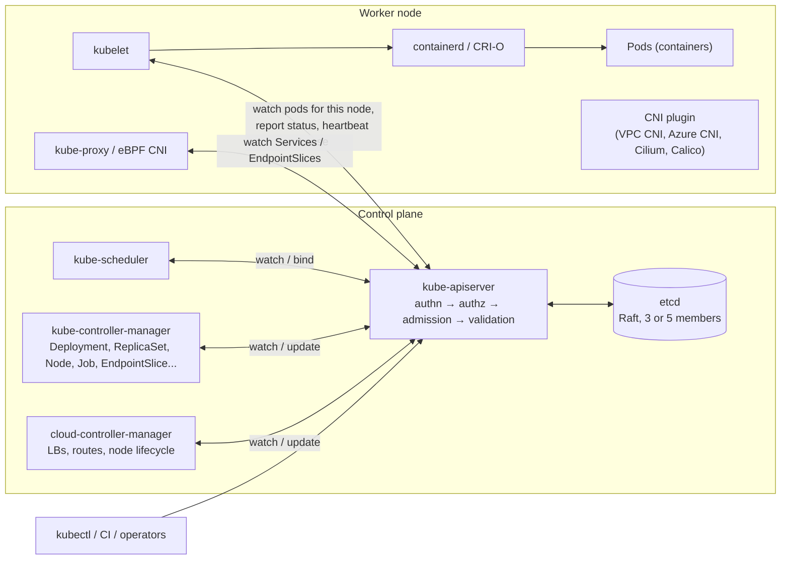
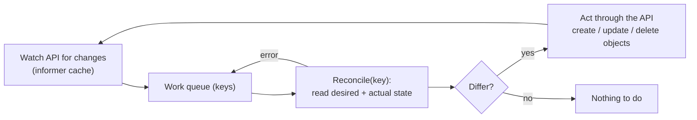
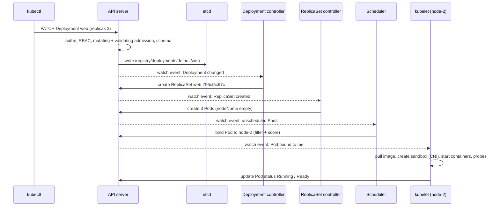

# Kubernetes Architecture: Control Plane, Nodes & etcd

!!! abstract "Key takeaways"
    - Kubernetes is a **declarative, level-triggered control system**. You store *desired state* through the **API server** in **etcd**, and **controllers** keep moving *actual state* toward it. Measured: a deleted pod was replaced and running again **184 ms** later.
    - **Control plane:** `kube-apiserver` (the only component that talks to etcd; authentication, authorisation, admission, validation), **etcd** (a Raft-replicated key-value store, keys like `/registry/deployments/default/web`, values in protobuf), `kube-scheduler` (assigns pods to nodes), `kube-controller-manager` (Deployment, ReplicaSet, Node, Job… controllers) and the `cloud-controller-manager`.
    - **Nodes:** `kubelet` (makes the node's pods match their specs via the CRI runtime), a **container runtime** (containerd/CRI-O), **kube-proxy** (or an eBPF CNI) for Services, and the **CNI** plugin for pod networking.
    - Components coordinate only through the API: **watches** stream changes, and every object has a **resourceVersion** for optimistic concurrency (a stale update returned **409 Conflict**). Single-active components use **Lease** objects for leader election.
    - Failure behaviour follows from this design. With the controller-manager paused, scaling to 5 changed the Deployment spec but the ReplicaSet stayed at 3. With the scheduler paused, new pods sat `Pending` with no node. Both caught up as soon as they resumed. **Running pods keep running** when the control plane is down.

## Why it matters

"Explain Kubernetes architecture" is one of the most common platform interview questions, and the follow-ups go deep: what happens when you run `kubectl apply`, what happens if etcd or the scheduler dies, why Kubernetes is "eventually consistent", how controllers avoid conflicts. Understanding the architecture is also what lets you debug: a pod stuck in `Pending` is a scheduler question, `ContainerCreating` is a kubelet/CNI/volume question, and objects not updating is a controller question.

The demonstrations on this page ran against a real Kubernetes **v1.33.0** control plane (etcd, kube-apiserver, kube-controller-manager, kube-scheduler) started as binaries by **kwok**, which simulates kubelets on three fake nodes. This sandbox can't run nested containers, so pods didn't execute real processes. Everything shown is control-plane behaviour, which is identical to a real cluster.

## Core concepts

### The big picture


*Notice that every arrow goes through the API server. No component talks to another directly, and only the API server touches etcd. That's what makes the system loosely coupled and recoverable.*

### Control plane components

| Component | Responsibility | If it's down |
|---|---|---|
| **kube-apiserver** | REST API, authentication, RBAC authorisation, admission (mutating then validating), schema validation, persistence to etcd, watch fan-out | No changes or reads via the API. Running pods continue, kubelets keep containers alive |
| **etcd** | Consistent store of all cluster state (Raft consensus). Needs a quorum: 2 of 3, 3 of 5 | API can't read or write. With quorum lost, the cluster is frozen. Back it up |
| **kube-scheduler** | Picks a node for each unscheduled pod (filter → score → bind) | New pods stay `Pending` with no node (measured) |
| **kube-controller-manager** | Runs controllers: Deployment, ReplicaSet, StatefulSet, DaemonSet, Job, Node lifecycle, EndpointSlice, ServiceAccount, GC... | Specs change but nothing reconciles (measured: RS stayed at 3 while the Deployment said 5) |
| **cloud-controller-manager** | Cloud integration: LoadBalancer Services, node addresses and deletion, routes | No new cloud LBs, slower node clean-up |

On EKS and AKS the control plane is **managed**: you never see these processes, the provider runs etcd and the API servers across zones, and you pay per cluster (EKS) or optionally for an uptime SLA (AKS).

### Node components

- **kubelet:** watches the API for pods bound to its node, asks the container runtime (via **CRI**) to create sandboxes and containers, mounts volumes (via CSI), runs probes, reports pod status, and renews its node **Lease** every ~10 s as a heartbeat.
- **Container runtime:** containerd or CRI-O, using runc (or gVisor/Kata) to create containers. Docker Engine itself was removed as a runtime (dockershim) in 1.24. Images built with Docker still work, because they're OCI images.
- **kube-proxy:** programs iptables/IPVS (or nftables) rules so Service virtual IPs reach pod IPs. Many clusters replace it with eBPF (Cilium).
- **CNI plugin:** gives each pod an IP and connects pods across nodes (AWS VPC CNI uses real VPC IPs, Azure CNI similar, overlays such as Flannel/Calico VXLAN otherwise).

### The reconciliation loop


*Notice that controllers are level-triggered: they compare the whole desired state with the actual state each time, rather than replaying events. A missed event or a restart doesn't matter, because the next reconcile fixes everything.*

Measured on the v1.33 cluster:

| Experiment | Result |
|---|---|
| Delete one of 3 pods of a Deployment | ReplicaSet controller created a replacement, scheduled and running in **184 ms** |
| Pause `kube-controller-manager`, scale Deployment 3 → 5 | Deployment `spec.replicas` = 5, ReplicaSet desired still **3**, pods **3** |
| Resume it | ReplicaSet desired **5**, pods **5** within seconds |
| Pause `kube-scheduler`, scale to 7 | 2 new pods `Pending`, `nodeName` = `<none>` |
| Resume it | 0 pending. Pods spread 2/3/2 over the three nodes |

{ loading=lazy }
*Watch step 3: the controller doesn't replay "scaled to 5", it simply sees desired 5 and actual 3. That's what level-triggered means.*

### Life of a `kubectl apply`


*Notice that `kubectl` returns as soon as the API server has stored the Deployment. Everything after that is asynchronous, which is why you check `kubectl rollout status` rather than trusting the apply.*

{ loading=lazy }
*Notice where kubectl returns: right after step 1. Every later state change is a separate actor reacting to a watch event.*

Measured with a watch while scaling: the new pod appeared as `Pending <none>`, then `Pending node-000002` (bound by the scheduler), then `Running node-000002` (reported by the simulated kubelet).

### etcd and the API's consistency model

- Every object is stored at a key such as `/registry/deployments/default/web`, `/registry/pods/default/web-796cf5c97c-8qxlj` or `/registry/leases/kube-system/kube-scheduler` (listed directly from etcd in the demo). Values are **protobuf**-encoded (the raw value showed the `Deployment` type tag), and Secrets can be encrypted at rest with a KMS provider.
- Each write gets a new **resourceVersion** (from etcd's revision). Clients `LIST` then `WATCH` from that version, and **informers** keep local caches.
- **Optimistic concurrency:** an update must carry the resourceVersion it read. Measured: replacing the Deployment with a stale copy after someone else annotated it returned **`409 Conflict` … "the object has been modified; please apply your changes to the latest version"**. Controllers retry on conflict.
- **Server-side apply** tracks field ownership (`managedFields`), so different actors (kubectl, the HPA, an operator) can manage different fields without clobbering each other.
- **Validation and admission** happen before persistence: `replicas: -1` was rejected with "spec.replicas: Invalid value: -1: must be greater than or equal to 0".

### Leader election and HA

The scheduler and controller-manager run several replicas in HA control planes, but only one is active. They compete for a **Lease** object (`kube-system/kube-controller-manager`, `kube-system/kube-scheduler`, both visible in the demo with their holder identities), renewing it every few seconds. If the leader stops renewing, another replica takes over after the lease duration (15 s by default). API servers are all active behind a load balancer. etcd runs 3 or 5 members spread across zones so it keeps quorum after losing one or two.

## In practice: code & configuration

### Inspecting the architecture

```bash
kubectl get --raw='/readyz?verbose'                 # API server health checks (incl. etcd)
kubectl -n kube-system get leases                   # who leads scheduler / controller-manager
kubectl get nodes -o wide                           # kubelet versions, runtime, IPs
kubectl get lease -n kube-node-lease                # node heartbeats
kubectl get events -A --sort-by=.lastTimestamp      # what controllers and the scheduler did
kubectl get --raw /metrics | grep apiserver_request_total | head
kubectl api-resources                               # every resource type the API serves
```

### Writing a controller (the same loop, your resource)

```java
// Java Operator SDK: reconcile is called with the latest state, level-triggered
@ControllerConfiguration
public class ClaimProcessorReconciler implements Reconciler<ClaimProcessor> {
    @Override
    public UpdateControl<ClaimProcessor> reconcile(ClaimProcessor cr, Context<ClaimProcessor> ctx) {
        Deployment desired = buildDeployment(cr);                 // desired state from the custom resource
        ctx.getClient().apps().deployments()
           .inNamespace(cr.getMetadata().getNamespace())
           .resource(desired).serverSideApply();                  // idempotent, field-owned
        cr.setStatus(new ClaimProcessorStatus("Reconciled"));
        return UpdateControl.patchStatus(cr);                     // conflicts → automatic retry
    }
}
```

=== "❌ Common mistake"

    ```bash
    # Treating apply as synchronous: the pipeline goes green before anything is running
    kubectl apply -f deployment.yaml && echo "deployed"

    # Editing live objects by hand: drift from Git, overwritten by the next apply
    kubectl edit deployment web
    ```

=== "✅ Better"

    ```bash
    kubectl apply --server-side -f deployment.yaml
    kubectl rollout status deployment/web --timeout=5m   # wait for controllers + kubelets to converge
    # Desired state lives in Git; GitOps (Argo CD / Flux) reconciles the cluster to it continuously
    ```

## Real-world usage

- **Managed control planes:** EKS runs the API servers and etcd across three AZs. AKS offers free and standard tiers (the standard tier adds an uptime SLA). You manage node groups and add-ons. See [EKS/AKS specifics](08-eks-aks-specifics-and-troubleshooting-pods.md).
- **GitOps** (Argo CD, Flux) applies the controller pattern to deployment itself: Git is the desired state, and a controller reconciles the cluster to it.
- **Operators** (Strimzi for Kafka, CloudNativePG, cert-manager) extend Kubernetes with CRDs and controllers that encode operational knowledge.
- **Large clusters** hit API server and etcd limits first (list calls, watch fan-out, object counts). That's why informers and caches exist, and why etcd size (default 2 GB quota, up to 8 GB) and compaction matter.
- **Self-managed clusters** (kubeadm) must back up etcd (`etcdctl snapshot save`) and rotate certificates. Managed services do this for you.

## Trade-offs & production gotchas

!!! warning "Architecture-level gotchas"
    - **Assuming apply = done:** everything after storage is asynchronous. Gate pipelines on `rollout status` or readiness.
    - **etcd is the crown jewels:** losing it without a backup loses the cluster's state. Secrets are base64, not encrypted, unless encryption at rest is configured.
    - **Even number of etcd members:** no extra fault tolerance (4 tolerates 1 failure, like 3).
    - **Heavy LIST calls from custom tools:** a script that lists all pods every second can overload the API server. Use informers and watches, and set API Priority and Fairness.
    - **Admission webhooks that fail closed:** an unavailable webhook blocks all matching writes, including during incidents. Set `failurePolicy`, timeouts and exclusions for system namespaces.
    - **Version skew:** kubelets may be up to three minor versions older than the API server (1.28+), never newer. Upgrade the control plane first.

- **Declarative and eventually consistent:** robust to failures and restarts, but harder to reason about timing. Use status conditions and events, not assumptions.
- **Managed vs self-managed:** managed control planes remove etcd and API server operations but limit control-plane flags and access (no SSH to masters).

## How this connects to my experience

- **Where I used it:** not ★. Kubernetes on EKS (Deloitte ConvergeHealth: "cloud-native microservices on AWS using Lambda, EC2, ECS, EKS…") and EKS/AKS in my skills, with Terraform for provisioning and GitLab CI/CD and Jenkins for deployments. *[confirm: cluster ownership (platform team vs your team), how deployments were applied (kubectl, Helm, Argo CD), and any control-plane incidents you handled]*
- **Talking points:**
    - "Kubernetes is a set of controllers reconciling desired state stored in etcd. The API server is the only path to that state, so I debug by asking which controller should have acted and what its events say."
    - "On EKS the control plane is managed, so my concerns are node groups, add-ons (VPC CNI, CoreDNS), API access and upgrade order."
    - "I never treat apply as synchronous. Pipelines wait on rollout status."
- **Likely follow-up chain:** "Walk me through kubectl apply" → "What does the scheduler do?" → "What happens if the control plane goes down?" → "What's in etcd, and how is it protected?" → "How do controllers avoid overwriting each other?" (resourceVersion, server-side apply) → "How does EKS differ from self-managed?"

## Interview questions

### Fundamentals

??? question "Q1. Describe the main components of a Kubernetes cluster."
    **Answer:** Control plane: kube-apiserver (the front door and the only component that talks to etcd: authn, authz, admission, validation), etcd (a consistent key-value store for all state), kube-scheduler (assigns pods to nodes), kube-controller-manager (built-in controllers reconciling Deployments, ReplicaSets, nodes, jobs, endpoints…), and cloud-controller-manager (cloud LBs and nodes). Each worker node runs a kubelet (makes pods run via the CRI runtime and reports status), a container runtime (containerd/CRI-O), kube-proxy or an eBPF replacement (Service routing), and a CNI plugin (pod networking). All communication goes through the API server.

    **Interviewer listens for:** each component's role and the hub-and-spoke API design.

    **Common wrong answer:** "The master node runs Docker and pushes containers to workers."

??? question "Q2. What happens when you run kubectl apply -f deployment.yaml?"
    **Answer:** kubectl sends the object to the API server, which authenticates the user, authorises via RBAC, runs mutating then validating admission, validates the schema, and stores it in etcd. Then it returns. The Deployment controller sees the change through its watch and creates or updates a ReplicaSet. The ReplicaSet controller creates Pods with no node. The scheduler watches for unscheduled Pods, picks nodes and binds them. The kubelet on each chosen node sees its Pod, pulls the image, sets up networking (CNI) and volumes (CSI), starts containers and reports status. Measured with a watch: `Pending <none>` → `Pending node-000002` → `Running`.

    **Interviewer listens for:** the API server pipeline, the chain of controllers via watches, scheduling, kubelet work, and asynchrony.

    **Common wrong answer:** "kubectl connects to the nodes and starts the containers."

??? question "Q3. What is etcd, and why is it critical?"
    **Answer:** A distributed, strongly consistent key-value store using Raft consensus, holding all cluster state: every object at keys like `/registry/pods/<ns>/<name>` (protobuf values, seen directly in the demo). Only the API server talks to it. It needs a majority quorum (3 members tolerate 1 failure, 5 tolerate 2). Without quorum the API can't serve or change anything. Losing etcd without a backup loses the cluster's desired state. So run an odd number of members across zones, back it up (`etcdctl snapshot save`), encrypt Secrets at rest, and watch its latency and database size. On EKS/AKS this is managed.

    **Interviewer listens for:** consistency, quorum, what's stored, backup and encryption.

    **Common wrong answer:** "etcd stores container images" or "it's a cache."

??? question "Q4. What does the scheduler do?"
    **Answer:** It watches for pods without `spec.nodeName`, and for each one filters nodes that can run it (resource requests fit, node selector and affinity, taints and tolerations, topology spread, volume zones, ports), scores the feasible nodes (spreading, resource balance, affinity preferences, image locality), and writes a Binding to the API server. It doesn't start containers: the kubelet does. If no node fits, the pod stays Pending with a `FailedScheduling` event explaining why. Measured: with the scheduler paused, new pods stayed Pending with no node, and they were bound and spread 2/3/2 within seconds of resuming.

    **Interviewer listens for:** filter and score, binding, the kubelet's separate role, and Pending diagnostics.

    **Common wrong answer:** "The scheduler runs the containers on the nodes."

### Intermediate

??? question "Q5. What is the reconciliation loop, and why is it level-triggered?"
    **Answer:** Each controller watches its resources (through an informer cache), queues the keys of changed objects, and reconciles: it reads desired state (spec) and actual state, and acts through the API to close the gap. It's level-triggered because it compares current state each time rather than relying on individual events, so missed events, restarts or concurrent changes don't break it, and the next reconcile converges. Measured: deleting a pod led to a replacement in 184 ms, and scaling while the controller-manager was paused converged as soon as it resumed.

    **Interviewer listens for:** desired vs actual, watches and queues, idempotency, and resilience to missed events.

    **Common wrong answer:** "Controllers execute commands in the order events arrive."

??? question "Q6. What happens to running applications if the control plane goes down?"
    **Answer:** Running pods keep running: kubelets keep containers alive and restart crashed containers locally, and existing Service routing rules on nodes keep working. What stops: any API operation (deploys, scaling, kubectl), scheduling of new pods, controller actions (replacing pods on failed nodes, HPA scaling, endpoint updates), and new LoadBalancers. So a control-plane outage is mostly a "frozen cluster" rather than a data-plane outage, until something needs reconciling, such as a node failure. Managed control planes run multi-AZ to reduce this risk.

    **Interviewer listens for:** data plane vs control plane separation and what degrades.

    **Common wrong answer:** "All pods stop."

??? question "Q7. How does Kubernetes prevent two clients from overwriting each other's changes?"
    **Answer:** Optimistic concurrency with `metadata.resourceVersion`: an update must include the version it read, and if the object changed since then the API server rejects it with 409 Conflict (measured: "the object has been modified; please apply your changes to the latest version"). Clients re-read and retry. Server-side apply adds field ownership (`managedFields`), so different managers (kubectl, the HPA, an operator) own different fields, and conflicting changes to the same field are reported rather than silently overwritten.

    **Interviewer listens for:** resourceVersion, 409 and retry, and server-side apply field ownership.

    **Common wrong answer:** "The API server locks objects during edits."

??? question "Q8. How does leader election work for the controller-manager and scheduler?"
    **Answer:** In an HA control plane several replicas run, but only one is active. They compete to acquire and renew a Lease object (`kube-system/kube-controller-manager`, `kube-system/kube-scheduler`, whose holders were visible in the demo). The holder renews it periodically. If it stops (crash or partition), others wait until the lease duration expires (15 s by default) and one acquires it. API servers are active-active behind a load balancer, and etcd uses Raft for its own leader. The same Lease mechanism is used by operators and node heartbeats (`kube-node-lease`).

    **Interviewer listens for:** active/passive with Leases, the expiry-based takeover, and other uses of Leases.

    **Common wrong answer:** "All replicas act at once and coordinate through etcd locks."

??? question "Q9. What do the kubelet and the container runtime each do?"
    **Answer:** The kubelet is the node agent: it watches the API for pods bound to its node, manages their lifecycle (via CRI calls to create pod sandboxes and containers, CSI for volumes, CNI through the runtime for networking), runs liveness, readiness and startup probes, enforces resource limits through cgroups, evicts pods under node pressure, reports pod and node status, and heartbeats via a node Lease. The container runtime (containerd or CRI-O) pulls images and creates containers via an OCI runtime (runc). Docker Engine is no longer used as the runtime since 1.24, but Docker-built images are OCI images, so they run unchanged.

    **Interviewer listens for:** the division of labour, CRI/CNI/CSI, probes and eviction, and the dockershim removal.

    **Common wrong answer:** "Kubernetes requires Docker on every node."

### Senior

??? question "Q10. How would you design a highly available self-managed control plane?"
    **Answer:** Three (or five) control-plane nodes across failure domains, each running an API server, with the scheduler and controller-manager using leader election. A stacked or external etcd cluster with an odd member count on fast disks (SSD, low fsync latency), with regular snapshots shipped off-cluster and tested restores. A load balancer in front of the API servers with health checks on `/readyz`. Encryption at rest for Secrets via KMS. Certificate rotation. API Priority and Fairness to protect against noisy clients. Monitoring of etcd latency, DB size and leader changes, plus API server latency and error rates. Upgrade the control plane before nodes, respecting version skew. Often the real answer is a managed service (EKS, AKS) unless there are specific constraints.

    **Interviewer listens for:** quorum design, backups, LB, encryption, protection and monitoring, and the managed alternative.

    **Common wrong answer:** "Two masters for redundancy."

??? question "Q11. A cluster's API server is slow and kubectl commands time out. What could be wrong?"
    **Answer:** Check API server metrics (request latency by verb and resource, inflight requests, Priority and Fairness rejections) and etcd (fsync and commit latency, DB size near the quota, compaction, leader changes). Common causes: a client hammering LIST calls (a monitoring tool or a badly written controller without informers), huge objects (big ConfigMaps or CRDs), too many objects (old ReplicaSets, completed Jobs, events), slow admission webhooks in the request path, etcd on slow disks or a near-full etcd database, or an under-provisioned control plane. Fixes: identify noisy clients (audit logs, user-agent metrics), tune APF, clean up objects (`revisionHistoryLimit`, TTL for finished Jobs), fix webhooks, and scale or defragment etcd.

    **Interviewer listens for:** metrics-driven diagnosis across API server, etcd, clients and webhooks.

    **Common wrong answer:** "Restart the API server."

??? question "Q12. How do operators extend Kubernetes, and what makes a good one?"
    **Answer:** An operator is a custom controller plus CRDs: users declare a custom resource (for example `KafkaCluster` or `PostgresCluster`), and the controller reconciles it into Deployments, StatefulSets, Services and Secrets, encoding operational knowledge such as scaling, upgrades, backups and failover. A good operator is level-triggered and idempotent (server-side apply), handles conflicts with retries, reports status conditions and events, uses owner references for garbage collection and finalizers for external clean-up, watches only what it needs through informers, has leader election for HA, and has minimal RBAC. Examples include Strimzi, CloudNativePG and cert-manager. In Java: Java Operator SDK and the Fabric8 client.

    **Interviewer listens for:** CRD + controller, idempotent reconciliation, status, ownership and finalizers, and least privilege.

    **Common wrong answer:** "An operator is a Helm chart with scripts."

### Scenario-based

??? question "Q13. You scaled a Deployment to 10 but still see 3 pods. kubectl shows spec.replicas = 10. Where do you look?"
    **Answer:** Follow the controller chain. Does the ReplicaSet's desired count say 10? If not, the Deployment controller (controller-manager) isn't acting: check controller-manager health and leader Lease, and events on the Deployment (measured: with the controller-manager paused, the Deployment said 5 while the RS stayed at 3). If the RS says 10 but pods aren't created, check RS events: ResourceQuota exceeded, LimitRange or admission webhook denials, or a PodSecurity violation. If pods exist but are Pending, check `FailedScheduling` events (insufficient CPU or memory, taints, affinity). If they're `ContainerCreating` or `CrashLoopBackOff`, it's the kubelet, image, volume or app.

    **Interviewer listens for:** a systematic walk down Deployment → ReplicaSet → Pod → scheduler → kubelet using events.

    **Common wrong answer:** "Delete and recreate the Deployment."

??? question "Q14. A node becomes unreachable. What does Kubernetes do, step by step?"
    **Answer:** The kubelet stops renewing its node Lease. After `node-monitor-grace-period` (tens of seconds, version-dependent), the node lifecycle controller marks the node `Ready=Unknown` and adds the `node.kubernetes.io/unreachable` taint with effect NoExecute. Pods have a default toleration for that taint of 300 seconds, after which they're marked for deletion. For Deployments, the ReplicaSet controller creates replacements, and the scheduler places them on healthy nodes. Service EndpointSlices drop the unreachable pods once they're not Ready. StatefulSet pods aren't force-replaced while the old pod may still be running, to avoid two identical identities, so they need manual intervention or node deletion. On cloud clusters, the cloud controller removes the node if the VM is gone. Tune the tolerations for faster failover where it's safe.

    **Interviewer listens for:** heartbeat Leases, taints with the default 300 s toleration, replacement flow, endpoints, and the StatefulSet caveat.

    **Common wrong answer:** "Pods instantly move to another node."

## Cheat sheet

| Topic | Remember |
|---|---|
| Model | Declarative desired state in etcd; controllers reconcile (level-triggered) |
| API server | Only door to etcd: authn → authz → admission → validation → persist; watches |
| etcd | Raft, odd members (3/5), `/registry/...` keys, protobuf, back up, encrypt Secrets |
| Scheduler | Filter → score → bind; Pending + FailedScheduling events |
| Controller-manager | Deployment, ReplicaSet, Node, Job, EndpointSlice...; paused → no reconcile (measured) |
| kubelet | Pods on its node via CRI/CNI/CSI; probes; status; node Lease heartbeat |
| Runtime | containerd / CRI-O (dockershim removed in 1.24) |
| Concurrency | resourceVersion → 409 Conflict on stale writes; server-side apply field ownership |
| Leader election | Lease objects (scheduler, controller-manager), 15 s lease |
| Control plane down | Running pods continue; no changes, scheduling or healing |
| Reconcile speed | Deleted pod replaced and running in 184 ms (measured) |

## Sources
1. [Kubernetes docs: Cluster architecture](https://kubernetes.io/docs/concepts/architecture/) and [Components](https://kubernetes.io/docs/concepts/overview/components/).
2. [Kubernetes docs: Controllers](https://kubernetes.io/docs/concepts/architecture/controller/) and [Leases](https://kubernetes.io/docs/concepts/architecture/leases/).
3. [Kubernetes docs: Kubernetes API concepts (resourceVersion, watch)](https://kubernetes.io/docs/reference/using-api/api-concepts/) and [Server-side apply](https://kubernetes.io/docs/reference/using-api/server-side-apply/).
4. [Kubernetes docs: Operating etcd clusters](https://kubernetes.io/docs/tasks/administer-cluster/configure-upgrade-etcd/) and [Encrypting data at rest](https://kubernetes.io/docs/tasks/administer-cluster/encrypt-data/).
5. [Kubernetes docs: Scheduler framework](https://kubernetes.io/docs/concepts/scheduling-eviction/kube-scheduler/) and [Node status and heartbeats](https://kubernetes.io/docs/concepts/architecture/nodes/).
6. [Kubernetes docs: Version skew policy](https://kubernetes.io/releases/version-skew-policy/).
7. [kwok: Kubernetes WithOut Kubelet](https://kwok.sigs.k8s.io/) and [Java Operator SDK](https://javaoperatorsdk.io/).
8. Demonstrations on this page: a Kubernetes v1.33.0 control plane run as binaries via kwokctl with three simulated nodes, run while writing this page (etcd keys, leases, reconciliation timing, paused controller-manager and scheduler, 409 conflict, validation, watch).
