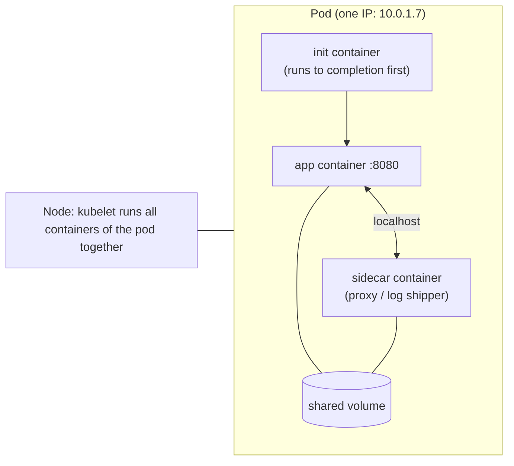
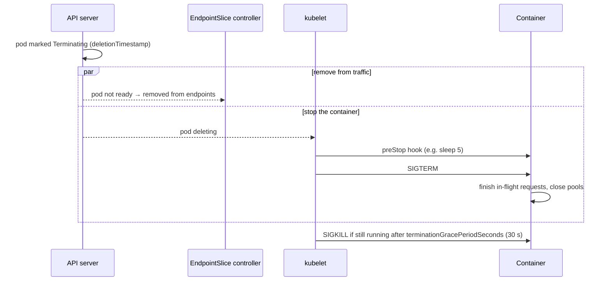
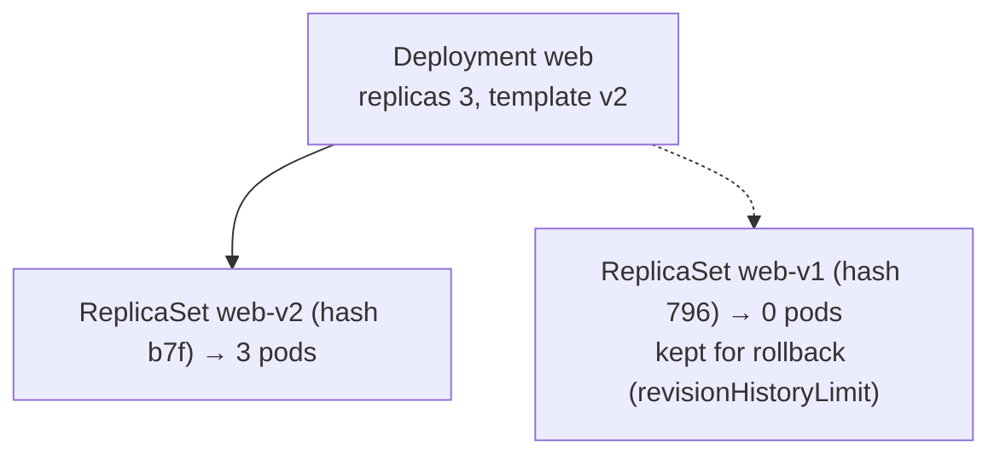

# Pods, Deployments, ReplicaSets, StatefulSets & DaemonSets

!!! abstract "TL;DR"
    - A **Pod** is the smallest deployable unit: one or more containers sharing a network namespace (one IP, localhost), volumes and a lifecycle, scheduled together onto one node. Pods are **disposable**: you never manage them directly, controllers do.
    - A **ReplicaSet** keeps N pods matching a **label selector**. It even deleted a hand-made pod that matched its labels ("Deleted pod: stray"). A **Deployment** manages ReplicaSets to give rolling updates and rollbacks for **stateless** apps. Use Deployments, never bare ReplicaSets.
    - A **StatefulSet** gives each pod a **stable name** (`db-0`, `db-1`…), a **stable PVC** (`data-db-1` reattached after the pod was deleted), stable DNS through a headless Service, and **ordered** create and scale-down (measured: created 0→1→2, deleted 2 then 1, with PVCs kept).
    - A **DaemonSet** runs one pod per (matching) node. A new node got its pod automatically, and DaemonSet pods tolerate node-condition taints but not arbitrary `NoSchedule` taints unless you add tolerations.
    - **Jobs** run pods to completion (measured: `completions: 5`, `parallelism: 2` → 5 Completed). **CronJobs** create Jobs on a schedule. Pick the controller by the workload's identity, storage and lifecycle needs.

## Why it matters

Choosing the wrong workload type causes real incidents: a database in a Deployment loses its data mapping on reschedule, a log agent in a Deployment misses half the nodes, a batch job in a Deployment restarts forever. Interviewers ask "Deployment vs StatefulSet?", "what's a DaemonSet for?" and "how does a ReplicaSet know its pods?", and for senior roles, pod lifecycle and graceful termination, which decide whether deploys drop requests.

The behaviour below was demonstrated on a real Kubernetes v1.33.0 control plane (API server, controllers, scheduler) with kwok-simulated nodes, so controller logic is real while containers aren't actually executed.

## Core concepts

### Pods


*Notice that containers in a pod share the network namespace and volumes, so they talk over localhost and share files. That's why tightly coupled helpers (proxies, log shippers) go in the same pod, and independent services don't.*

- **Multi-container patterns:** init containers (migrations, waiting for dependencies, fetching config), sidecars (service-mesh proxy, log shipper, secrets agent). Native sidecars arrived in 1.29 (init containers with `restartPolicy: Always`) and are stable in 1.33. They start before and stop after the main container, which fixes the old "sidecar keeps the Job running" problem.
- **Phases:** `Pending` (accepted, not yet running: scheduling, image pull, volumes) → `Running` → `Succeeded`/`Failed`, plus `Unknown` (node lost). Container states: `Waiting` (e.g. `ImagePullBackOff`, `CrashLoopBackOff`), `Running`, `Terminated`.
- **restartPolicy:** `Always` (Deployments, StatefulSets, DaemonSets), `OnFailure` or `Never` (Jobs). The kubelet restarts crashed containers in place with exponential back-off, up to 5 minutes: that's `CrashLoopBackOff`.
- **QoS classes** follow from requests and limits: Guaranteed, Burstable, BestEffort. They affect eviction order (see [probes and resources](06-probes-resource-requests-limits-autoscaling.md)).

### Graceful termination


*Notice that endpoint removal and SIGTERM happen in parallel. A short preStop sleep gives load balancers and kube-proxy time to stop sending traffic before the app begins shutting down.*

For Spring Boot: `server.shutdown=graceful`, `spring.lifecycle.timeout-per-shutdown-phase=20s`, an exec-form entrypoint so the JVM receives SIGTERM ([containers page](01-containers-vs-vms-docker-images-layers-multi-stage-builds.md)), and a `preStop` sleep of a few seconds, all under `terminationGracePeriodSeconds`.

### ReplicaSets and label ownership

A ReplicaSet's job is "keep `replicas` pods matching `selector` alive". It finds pods by **labels**, then records ownership with an **ownerReference**. Measured:

| Experiment | Result |
|---|---|
| A Deployment's pods | `ownerReferences: ReplicaSet/api-6bfdff4c75` |
| Create a standalone pod with the same `app` and `pod-template-hash` labels | The ReplicaSet adopted it, saw 3 > 2, and deleted it: event **"Deleted pod: stray"** |
| Change a Deployment's selector | Rejected: `spec.selector … field is immutable` |
| `kubectl delete deploy api --cascade=orphan` | ReplicaSet (1) and pods (2) kept, ownership removed |
| Delete that ReplicaSet (default background cascade) | Its pods deleted too |

So labels are an API contract. Overlapping selectors between controllers make them fight over pods.

### Deployments


*Notice that a Deployment never edits pods. Each template change creates a new ReplicaSet, and the Deployment shifts replicas from old to new. Old ReplicaSets stay at 0 so a rollback is just scaling one back up.*

Use for stateless services: interchangeable pods, any pod can serve any request, and storage is external (databases, S3) or ephemeral. Rolling updates, `maxSurge`/`maxUnavailable` and rollbacks are covered in [rolling updates and Helm](07-rolling-updates-rollbacks-and-helm.md).

### StatefulSets

Measured with `replicas: 3`, a headless Service `db` and a `volumeClaimTemplates` entry `data`:

| Property | Observed |
|---|---|
| Names | `db-0`, `db-1`, `db-2` (ordinal, stable) |
| Creation order | Events: claim `data-db-0` → pod `db-0` → claim `data-db-1` → pod `db-1` → `db-2` (each waits for the previous to be Ready under `OrderedReady`) |
| Storage | PVCs `data-db-0/1/2` bound to `pv-0/1/2` |
| Delete pod `db-1` | Recreated with the **same name** and the **same PVC** `data-db-1` (new UID) |
| Scale 3 → 1 | Deleted `db-2` then `db-1` (reverse order). **All 3 PVCs kept** (default retention) |
| DNS (with a headless Service) | `db-0.db.<ns>.svc.cluster.local`: stable per-pod hostnames for peers and clients |

Use for workloads whose instances aren't interchangeable: databases (PostgreSQL, MongoDB replica sets), Kafka and ZooKeeper, Elasticsearch, anything with leader election by identity or per-instance storage. `podManagementPolicy: Parallel` drops the ordering when the app doesn't need it. `persistentVolumeClaimRetentionPolicy` (stable in 1.32) can delete PVCs on scale-down or StatefulSet deletion. In practice, prefer **operators** (CloudNativePG, Strimzi, the MongoDB operator) or managed databases over hand-written StatefulSets for stateful systems.

### DaemonSets

Measured:

| Experiment | Result |
|---|---|
| DaemonSet on 3 nodes | One pod on each: `node-000000 node-000001 node-000002` |
| Default tolerations added | `not-ready`, `unreachable`, `disk-pressure`, `memory-pressure`, `pid-pressure`, `unschedulable` |
| Add a 4th node | A 4th pod scheduled automatically (4 pods on 4 nodes) |
| Taint node 4 `dedicated=gpu:NoSchedule`, delete its pod | Not recreated there (0). It needs an explicit toleration |
| A Deployment on the same cluster | 0 pods on the tainted node either |

Use for per-node agents: log shippers (Fluent Bit), metrics (node-exporter, Datadog agent), CNI and storage drivers (aws-node, kube-proxy and CSI node plugins are DaemonSets on EKS), security agents. Restrict to a subset with `nodeSelector`/affinity, and update with `RollingUpdate` (`maxUnavailable`).

### Jobs and CronJobs

Measured: a Job with `completions: 5`, `parallelism: 2`, `backoffLimit: 3` → `succeeded: 5`, conditions `SuccessCriteriaMet, Complete`, 5 pods `Completed`. `ttlSecondsAfterFinished` cleans finished Jobs up automatically. CronJobs add `schedule`, `concurrencyPolicy` (`Forbid` to avoid overlapping runs), `startingDeadlineSeconds` and history limits. Batch work must be idempotent, because pods can be retried.

### Choosing a controller

| Need | Use |
|---|---|
| Stateless, interchangeable replicas | **Deployment** |
| Stable identity, per-instance storage, ordered start | **StatefulSet** (or an operator) |
| One pod per node | **DaemonSet** |
| Run to completion | **Job** |
| Scheduled runs | **CronJob** |
| Never | Bare Pods or bare ReplicaSets in production |

## In practice: code & configuration

### A production-shaped Deployment for a Spring Boot service

```yaml
apiVersion: apps/v1
kind: Deployment
metadata:
  name: claims-api
  labels: { app.kubernetes.io/name: claims-api }
spec:
  replicas: 3
  revisionHistoryLimit: 5
  selector:
    matchLabels: { app.kubernetes.io/name: claims-api }      # immutable: choose carefully
  template:
    metadata:
      labels: { app.kubernetes.io/name: claims-api, app.kubernetes.io/version: "1.8.2" }
    spec:
      serviceAccountName: claims-api
      terminationGracePeriodSeconds: 45
      securityContext: { runAsNonRoot: true, seccompProfile: { type: RuntimeDefault } }
      topologySpreadConstraints:                              # spread across zones
        - maxSkew: 1
          topologyKey: topology.kubernetes.io/zone
          whenUnsatisfiable: ScheduleAnyway
          labelSelector: { matchLabels: { app.kubernetes.io/name: claims-api } }
      containers:
        - name: app
          image: 123456789012.dkr.ecr.eu-west-1.amazonaws.com/claims-api:1.8.2   # immutable tag
          ports: [{ containerPort: 8080, name: http }]
          env:
            - { name: SERVER_SHUTDOWN, value: graceful }
            - { name: JAVA_TOOL_OPTIONS, value: "-XX:MaxRAMPercentage=75" }
          resources:
            requests: { cpu: 500m, memory: 768Mi }
            limits:   { memory: 768Mi }
          readinessProbe: { httpGet: { path: /actuator/health/readiness, port: http }, periodSeconds: 5 }
          livenessProbe:  { httpGet: { path: /actuator/health/liveness,  port: http }, periodSeconds: 10 }
          startupProbe:   { httpGet: { path: /actuator/health/liveness,  port: http }, failureThreshold: 30, periodSeconds: 2 }
          lifecycle:
            preStop: { sleep: { seconds: 5 } }                # native sleep action (1.30+); else exec sleep
          securityContext: { allowPrivilegeEscalation: false, readOnlyRootFilesystem: true, capabilities: { drop: [ALL] } }
          volumeMounts: [{ name: tmp, mountPath: /tmp }]
      volumes: [{ name: tmp, emptyDir: {} }]
```

=== "❌ Common mistake"

    ```yaml
    # Database as a Deployment with a shared PVC
    kind: Deployment
    spec:
      replicas: 2                      # two Postgres pods writing the same volume (or stuck on RWO)
      template:
        spec:
          containers: [{ name: pg, image: postgres:latest }]   # floating tag
          volumes: [{ name: data, persistentVolumeClaim: { claimName: pg-data } }]
    ```

=== "✅ Better"

    ```yaml
    # Stable identity + per-replica storage (better still: an operator or a managed DB)
    kind: StatefulSet
    spec:
      serviceName: pg
      replicas: 3
      podManagementPolicy: OrderedReady
      template:
        spec:
          containers: [{ name: pg, image: postgres:16.4 }]
      volumeClaimTemplates:
        - metadata: { name: data }
          spec: { accessModes: [ReadWriteOnce], storageClassName: gp3, resources: { requests: { storage: 50Gi } } }
    ```

## Real-world usage

- **Stateless microservices** (APIs, GraphQL gateways, Kafka consumers) run as Deployments with HPA, spread across zones.
- **Kafka and databases on Kubernetes** run as StatefulSets managed by operators (Strimzi, CloudNativePG, the Percona and MongoDB operators). Many teams prefer managed services (MSK, RDS, Atlas) and keep only stateless workloads in the cluster.
- **Node agents on EKS/AKS** (aws-node VPC CNI, kube-proxy, CSI node drivers, the Azure Monitor agent, Datadog, Fluent Bit) are DaemonSets.
- **Batch and data jobs** (report generation, migrations, ML training) use Jobs and CronJobs, or workflow engines (Argo Workflows) on top.
- **Database migrations** (Flyway/Liquibase) often run as a Job before a rollout, or as an init container with care for concurrency.

## Trade-offs & production gotchas

!!! warning "Workload pitfalls"
    - **Bare pods:** not rescheduled after node failure. Always use a controller.
    - **Overlapping selectors:** controllers adopt and delete each other's pods (a matching stray pod was deleted here).
    - **Selector changes:** immutable. Plan labels up front (`app.kubernetes.io/name`).
    - **Stateful apps in Deployments:** shared or lost storage, no stable identity.
    - **StatefulSet scale-down keeps PVCs:** storage costs linger, and a scale-up reattaches old data, which may or may not be wanted.
    - **StatefulSet pods on a failed node aren't replaced automatically** while the old pod might still run. That needs node deletion or a force delete, which is risky.
    - **DaemonSets and taints:** agents silently missing from tainted nodes (GPU, system pools) unless tolerations are added.
    - **Non-idempotent Jobs:** retries (`backoffLimit`) repeat side effects. Overlapping CronJobs without `concurrencyPolicy: Forbid`.
    - **No graceful shutdown:** a missing preStop or SIGTERM handling drops requests during every rollout.

- **Sidecars:** convenient (mesh, logging) but they add resources and startup ordering issues. Prefer native sidecars (1.29+).
- **Init containers for dependency waiting** can hide real readiness problems. Prefer apps that retry connections.

## How this connects to my experience

- **Where I used it:** not ★. Microservices on EKS at Deloitte and Kubernetes (EKS/AKS) in my skills: Spring Boot services as Deployments, Kafka consumers scaled as Deployments, with managed data stores (RDS, DynamoDB, MongoDB). *[confirm: which workloads ran in Kubernetes vs ECS/Lambda, whether any StatefulSets or DaemonSets were owned by your team, and how DB migrations ran]*
- **Talking points:**
    - "Stateless services are Deployments with graceful shutdown, probes and zone spreading. Stateful systems go to managed services or operator-run StatefulSets."
    - "Labels are a contract: selectors are immutable and controllers adopt anything that matches."
    - "Batch jobs are idempotent Jobs with TTL clean-up, and CronJobs use Forbid to avoid overlaps."
- **Likely follow-up chain:** "Deployment vs StatefulSet?" → "What does a StatefulSet guarantee?" → "What happens to its PVCs on scale-down?" → "What's a DaemonSet for?" → "How do pods shut down gracefully?" → "How would you run Kafka on Kubernetes?"

## Interview questions

### Fundamentals

??? question "Q1. What is a Pod, and why isn't the container the unit of scheduling?"
    **Answer:** A Pod is a group of one or more containers that share a network namespace (one IP, they talk via localhost), can share volumes, and are scheduled together onto one node with a common lifecycle. Kubernetes schedules pods rather than containers so tightly coupled helpers (a service-mesh proxy, a log shipper, an init step) can be co-located and share resources. Pods are ephemeral and replaceable, so you manage them through controllers. Pod IPs change on recreation, which is why Services exist.

    **Interviewer listens for:** shared network and volumes, co-scheduling, ephemerality, and controller management.

    **Common wrong answer:** "A pod is a container."

??? question "Q2. What's the relationship between a Deployment, a ReplicaSet and Pods?"
    **Answer:** A Deployment manages ReplicaSets, and a ReplicaSet manages Pods. Each change to the Deployment's pod template creates a new ReplicaSet (identified by the `pod-template-hash` label), and the Deployment scales the new one up and the old one down according to its strategy, keeping old ReplicaSets at 0 replicas for rollback. A ReplicaSet keeps the desired number of pods matching its label selector, recording ownership via ownerReferences (measured: `ReplicaSet/api-6bfdff4c75`). You work with Deployments, not ReplicaSets directly.

    **Interviewer listens for:** the hierarchy, a new ReplicaSet per template change, rollback via old ReplicaSets, and ownerReferences.

    **Common wrong answer:** "A Deployment updates the pods in place."

??? question "Q3. When would you use a StatefulSet instead of a Deployment?"
    **Answer:** When replicas aren't interchangeable: each needs a stable identity (name and DNS, `db-0.db.ns.svc`), its own persistent storage that follows it across reschedules (measured: `db-1` came back with PVC `data-db-1`), or ordered startup and shutdown (measured: created 0→1→2, scaled down 2 then 1). Typical cases: databases, Kafka, ZooKeeper, Elasticsearch, clustered apps with peer discovery. Stateless services belong in Deployments. For production databases, prefer an operator or a managed service.

    **Interviewer listens for:** identity, storage and ordering guarantees, with examples.

    **Common wrong answer:** "StatefulSets are for any app that has state in a database."

??? question "Q4. What is a DaemonSet used for?"
    **Answer:** Running one pod per node (or per matching node): log collectors, metrics agents, CNI and CSI node plugins, kube-proxy, security agents. When a node joins, the DaemonSet controller schedules a pod onto it automatically (measured: a 4th node got the 4th pod). DaemonSet pods tolerate node-condition taints by default (not-ready, unreachable, pressure), but not custom `NoSchedule` taints (measured: no pod on a node tainted `dedicated=gpu`), so add tolerations if agents must run everywhere.

    **Interviewer listens for:** per-node scope, auto-placement on new nodes, and the taint caveat.

    **Common wrong answer:** "A Deployment with replicas equal to the node count."

### Intermediate

??? question "Q5. How does a ReplicaSet know which pods belong to it?"
    **Answer:** By its label selector, plus ownerReferences. It lists pods whose labels match the selector. If an unowned pod matches, it adopts it (sets an ownerReference) and then reconciles the count. Measured: a stray pod with matching labels was adopted and immediately deleted because the count exceeded `replicas` ("Deleted pod: stray"). Pods owned by another controller are ignored. That's why selectors must be unique per workload, and why they're immutable on Deployments (measured: "field is immutable").

    **Interviewer listens for:** selector matching, adoption, ownerReferences, and the overlap danger.

    **Common wrong answer:** "It tracks the pods it created by name."

??? question "Q6. What happens when a pod is deleted? How do you avoid dropping requests?"
    **Answer:** The pod gets a deletion timestamp and becomes Terminating. In parallel, it's removed from Service endpoints (kube-proxy and load balancers update asynchronously), and the kubelet runs the preStop hook, then sends SIGTERM to the containers, then SIGKILL after `terminationGracePeriodSeconds` (30 s default). To avoid dropped requests: a preStop sleep of a few seconds so endpoint removal propagates before shutdown, the app handling SIGTERM by draining (Spring `server.shutdown=graceful`, an exec-form entrypoint), and a grace period longer than preStop plus drain time.

    **Interviewer listens for:** parallel endpoint removal and SIGTERM, preStop, the grace period, and app-side draining.

    **Common wrong answer:** "Kubernetes stops sending traffic first, then kills the pod, so nothing is lost."

??? question "Q7. What happens to a StatefulSet's PVCs when you scale it down or delete it?"
    **Answer:** By default they're retained (measured: after scaling 3 → 1, all 3 PVCs remained). Scaling back up reattaches the same PVC to the same ordinal, which preserves data. Deleting the StatefulSet also keeps the PVCs. This protects data, but it leaves orphaned storage that costs money and may hold stale data. `persistentVolumeClaimRetentionPolicy` (`whenScaled`/`whenDeleted`: `Retain` or `Delete`, stable in 1.32) lets you choose. What happens to the underlying volume then depends on the StorageClass `reclaimPolicy`.

    **Interviewer listens for:** retain by default, reattachment, the retention policy, and the reclaim policy.

    **Common wrong answer:** "PVCs are deleted with the pods."

??? question "Q8. What are init containers and native sidecars?"
    **Answer:** Init containers run sequentially to completion before app containers start: for migrations, waiting for dependencies, or rendering config into a shared volume. A failing init container blocks the pod (`Init:CrashLoopBackOff`). Native sidecars (1.29+, stable in 1.33) are init containers with `restartPolicy: Always`: they start before the main containers, keep running alongside them, and are terminated after the main containers. That fixes classic problems such as a mesh proxy not ready at app start, or a sidecar keeping a Job pod alive after the main container finished.

    **Interviewer listens for:** sequential completion vs long-running sidecars, and the ordering fixes.

    **Common wrong answer:** "Init containers run in parallel with the app."

??? question "Q9. How do you run a batch job safely in Kubernetes?"
    **Answer:** As a Job (or CronJob) with `restartPolicy: Never/OnFailure`, an appropriate `backoffLimit`, `activeDeadlineSeconds` as a timeout, `completions`/`parallelism` for fan-out (measured: 5 completions with parallelism 2), and `ttlSecondsAfterFinished` for clean-up. Make the work idempotent, because retries and node failures can rerun pods. For CronJobs, set `concurrencyPolicy: Forbid` (or Replace), `startingDeadlineSeconds` and history limits, and remember schedules use the controller's time zone unless `timeZone` is set. Use indexed Jobs for partitioned work.

    **Interviewer listens for:** the Job fields, idempotency, CronJob concurrency and time zones, and clean-up.

    **Common wrong answer:** "Run it as a Deployment that exits."

### Senior

??? question "Q10. Would you run Kafka or PostgreSQL on Kubernetes? How?"
    **Answer:** It depends on team capability and requirements. Managed services (MSK, RDS, Aurora, Atlas) offload backups, failover, patching and storage, and are usually the right default. If you run them in Kubernetes, use a mature operator (Strimzi for Kafka, CloudNativePG or Crunchy for PostgreSQL) that manages StatefulSets or pods, PVCs on fast storage classes, rack and zone awareness, rolling upgrades, certificates and backups. Configure PodDisruptionBudgets, anti-affinity across zones, dedicated node pools, resource guarantees, monitoring, and tested restore procedures. Hand-rolled StatefulSets for databases are rarely a good idea.

    **Interviewer listens for:** a managed-first stance, operators, storage and topology, PDBs, and backup and restore.

    **Common wrong answer:** "Yes, just use a StatefulSet with a PVC."

??? question "Q11. A StatefulSet pod's node died, and the pod is stuck Terminating and not replaced. Why, and what do you do?"
    **Answer:** StatefulSets guarantee at most one pod per identity. With the node unreachable, Kubernetes can't confirm the old `db-1` stopped, so it won't create a new `db-1` that might mount the same RWO volume and run concurrently (split brain). Options: if the node is truly gone, delete the Node object (the cloud controller does this when the VM is terminated), which lets the pod be cleaned up. Or force-delete the pod (`--grace-period=0 --force`) only when you're sure it's not running. Kubernetes 1.28+ also supports the `node.kubernetes.io/out-of-service` taint for non-graceful node shutdown, which detaches volumes and allows replacement.

    **Interviewer listens for:** the at-most-one guarantee, the volume and split-brain risk, and safe remediation options.

    **Common wrong answer:** "Restart the StatefulSet."

??? question "Q12. How do you make a Deployment resilient to node and zone failures?"
    **Answer:** Run at least 2–3 replicas, spread across zones and nodes with `topologySpreadConstraints` (or pod anti-affinity), set a PodDisruptionBudget so voluntary disruptions (node drains, upgrades) keep enough replicas, use readiness probes so only healthy pods get traffic, give requests so the scheduler places pods on nodes with capacity, use graceful shutdown, use cluster autoscaler or Karpenter with capacity in every zone, and make the app stateless with external storage. Test by draining nodes and simulating a zone loss.

    **Interviewer listens for:** spreading, PDBs, probes, requests, autoscaling capacity, and testing.

    **Common wrong answer:** "Set replicas to 10."

### Scenario-based

??? question "Q13. Your log agent DaemonSet isn't running on the new GPU node pool. Why?"
    **Answer:** GPU pools are usually tainted (for example `nvidia.com/gpu=present:NoSchedule` or `dedicated=gpu:NoSchedule`) so general workloads stay off. DaemonSet pods only tolerate node-condition taints by default, so they can't schedule there (measured: no DaemonSet pod on the tainted node). Also check nodeSelector or affinity in the DaemonSet that excludes those nodes, and architecture mismatches (an arm64 pool with an amd64-only image). Fix: add a matching toleration (or `operator: Exists` for agents that must run everywhere) and multi-arch images.

    **Interviewer listens for:** taints and tolerations, selectors, and architecture.

    **Common wrong answer:** "DaemonSets automatically run on every node."

??? question "Q14. During every deployment, clients see a burst of 502 errors for a few seconds. Diagnose."
    **Answer:** Classic termination race: when old pods are deleted, endpoint removal and SIGTERM happen in parallel. The app stops (or the JVM is killed because of a shell-form entrypoint) while the ingress, load balancer or kube-proxy still routes to it. Or new pods receive traffic before they're ready (no or weak readiness probe, or readiness returning UP before warm-up). Fixes: a preStop sleep of 5–10 s, graceful shutdown in Spring Boot, an exec-form entrypoint, a grace period above preStop plus drain, readiness probes that reflect real readiness, `maxUnavailable: 0` with surge, and for AWS ALB target groups, a deregistration delay aligned with the drain time.

    **Interviewer listens for:** the termination race, readiness, preStop, graceful shutdown, and LB deregistration.

    **Common wrong answer:** "Add more replicas."

## Cheat sheet

| Object | Use | Key facts |
|---|---|---|
| Pod | Unit of scheduling | Shared IP/volumes; phases; restartPolicy; ephemeral |
| ReplicaSet | Keep N pods | Selector + ownerReferences; adopts matching pods (stray deleted) |
| Deployment | Stateless apps | New RS per template change; rollback; selector immutable |
| StatefulSet | Identity + storage | `name-0..n`, PVC per ordinal (kept on scale-down), ordered, headless Service DNS |
| DaemonSet | Per-node agents | Auto on new nodes; tolerates node-condition taints only |
| Job / CronJob | Batch | completions/parallelism, backoffLimit, TTL; Forbid overlaps |
| Termination | No dropped requests | preStop sleep + SIGTERM drain + grace period (30 s default) |
| Sidecars | Helpers | Native sidecars (1.29+, stable 1.33) |
| Cascade | Deletion | Background (default), foreground, orphan |

## Sources
1. [Kubernetes docs: Pods](https://kubernetes.io/docs/concepts/workloads/pods/), [Pod lifecycle and termination](https://kubernetes.io/docs/concepts/workloads/pods/pod-lifecycle/) and [Sidecar containers](https://kubernetes.io/docs/concepts/workloads/pods/sidecar-containers/).
2. [Kubernetes docs: ReplicaSet](https://kubernetes.io/docs/concepts/workloads/controllers/replicaset/) and [Deployments](https://kubernetes.io/docs/concepts/workloads/controllers/deployment/).
3. [Kubernetes docs: StatefulSets](https://kubernetes.io/docs/concepts/workloads/controllers/statefulset/) (ordering, PVC retention policy).
4. [Kubernetes docs: DaemonSet](https://kubernetes.io/docs/concepts/workloads/controllers/daemonset/) and [Taints and tolerations](https://kubernetes.io/docs/concepts/scheduling-eviction/taint-and-toleration/).
5. [Kubernetes docs: Jobs](https://kubernetes.io/docs/concepts/workloads/controllers/job/) and [CronJob](https://kubernetes.io/docs/concepts/workloads/controllers/cron-jobs/).
6. [Kubernetes docs: Garbage collection and owner references](https://kubernetes.io/docs/concepts/architecture/garbage-collection/) and [Non-graceful node shutdown](https://kubernetes.io/docs/concepts/cluster-administration/node-shutdown/).
7. [Spring Boot reference: Graceful shutdown](https://docs.spring.io/spring-boot/reference/web/graceful-shutdown.html) and [Kubernetes probes](https://docs.spring.io/spring-boot/reference/actuator/endpoints.html#actuator.endpoints.kubernetes-probes).
8. Demonstrations on this page: Kubernetes v1.33.0 control plane via kwokctl with simulated nodes, run while writing this page (RS adoption, immutable selector, cascade modes, StatefulSet order/identity/PVCs, DaemonSet placement and taints, Job completions).
