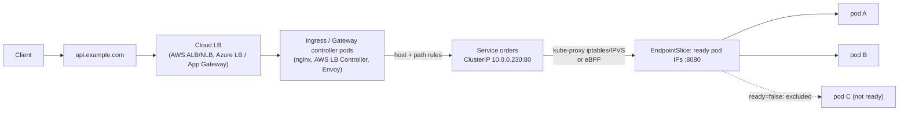
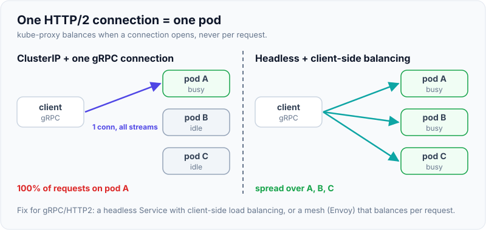

# Services, Ingress & Networking

!!! abstract "Key takeaways"
    - **Every pod gets its own IP** on a flat network where any pod can reach any pod without NAT. The **CNI** plugin (AWS VPC CNI, Azure CNI, Cilium, Calico) implements it.
    - Pod IPs change, so a **Service** gives a stable virtual IP and DNS name in front of pods selected by **labels**. **EndpointSlices** list the ready backends: a pod whose `Ready` condition went false was marked `ready=false` and left the rotation, and a selector typo produced **no endpoints at all**.
    - Service types: **ClusterIP** (internal, default), **headless** (`clusterIP: None`, DNS returns pod IPs, for StatefulSets), **NodePort** (30000–32767 on every node; a clash and port 80 were both rejected), **LoadBalancer** (a cloud LB via the cloud controller; stays `<pending>` without one), **ExternalName** (DNS CNAME).
    - **Ingress** routes HTTP(S) by host and path to Services, but an Ingress object **does nothing without an Ingress controller** (no address assigned in the demo). The **Gateway API** is the newer, role-oriented successor and the direction of travel.
    - **NetworkPolicy** is default-allow until a policy selects a pod, and it's **only enforced if the CNI supports it**: the API accepted the policy regardless.

## Why it matters

Networking is where most Kubernetes production issues show up: services with no endpoints, 502s during deploys, DNS timeouts, an Ingress that never gets an address, pods that can talk to everything because NetworkPolicies silently aren't enforced. Interviewers ask "how does a request from the internet reach my pod?" and want each hop explained. On EKS and AKS, you also need to know how cloud load balancers and the VPC/VNet CNI fit in.

The objects on this page were created and validated on a Kubernetes v1.33.0 control plane (kwok with simulated nodes). Controllers such as EndpointSlice ran for real, while the data path (kube-proxy rules, an Ingress controller, a CNI) wasn't present, and the page notes where that matters.

## Core concepts

### The Kubernetes network model

1. Every pod has a unique cluster-wide IP. Containers in a pod share it.
2. Pods can reach all other pods on any node without NAT.
3. Node agents (kubelet) can reach all pods on their node.

How it's implemented is the CNI's choice: **routed VPC IPs** (AWS VPC CNI gives pods real VPC addresses, Azure CNI similarly, including the Overlay mode), or **overlays** (VXLAN/Geneve, as in Flannel or Calico) and **eBPF** (Cilium) on any network.

### From the internet to a pod


*Notice the chain: the external LB only reaches the cluster edge, the Ingress controller makes L7 decisions, and the Service VIP is just a rule on each node that load-balances across ready endpoints. Readiness controls the last hop.*

{ loading=lazy }
*Notice there's no box for kube-proxy in the path: the Service is a rewrite rule in the node's kernel, not a hop through a process.*

With the AWS Load Balancer Controller in **IP target mode**, the ALB sends traffic straight to pod IPs (registered from EndpointSlices), skipping NodePorts and kube-proxy.

### Services and EndpointSlices

```yaml
apiVersion: v1
kind: Service
metadata: { name: orders }
spec:
  selector: { app: orders }         # which pods
  ports: [{ port: 80, targetPort: 8080, protocol: TCP }]
  type: ClusterIP                   # default
```

Measured:

| Experiment | Result |
|---|---|
| `kubectl expose deployment orders --port=80 --target-port=8080` | ClusterIP `10.0.0.230`. EndpointSlice with 3 endpoints, each `ready=true` with its node |
| Service with selector `app=order` (typo) | EndpointSlice endpoints: **null**. Traffic would fail with connection refused or timeouts |
| Set one pod's `Ready` condition to False | Its endpoint became `ready=false serving=false`. The other two stayed `ready=true` |
| Headless (`clusterIP: None`) | No VIP. DNS returns pod IPs (and per-pod names for StatefulSets) |
| NodePort | Allocated `30629`. Requesting the same port again failed: "provided port is already allocated". Port 80 failed: "provided port is not in the valid range" |
| LoadBalancer without a cloud controller | Type LoadBalancer, NodePort `32344` allocated, `EXTERNAL` **`<none>`** (pending forever) |
| ExternalName `payments.prod.example.com` | No ClusterIP. DNS CNAME only, with no proxying, ports or health checks |
| Built-in `kubernetes` Service | `10.0.0.1`: the API server, reachable from pods |

| Type | Reachable from | Use |
|---|---|---|
| ClusterIP | Inside the cluster | Service-to-service |
| Headless | Inside (DNS → pod IPs) | StatefulSets, client-side load balancing (gRPC), peer discovery |
| NodePort | `<nodeIP>:30000-32767` | Behind your own LB, or debugging. Rarely exposed directly |
| LoadBalancer | External (cloud LB) | L4 exposure (NLB / Azure LB). One LB per Service costs money |
| ExternalName | Inside (CNAME) | Alias an external host (managed DB, legacy service) |

Useful fields: `sessionAffinity: ClientIP`, `internalTrafficPolicy: Local` and `externalTrafficPolicy: Local` (keep traffic on the node, preserving the client IP, at the risk of uneven spread), `trafficDistribution: PreferClose` (topology-aware routing, beta), and `publishNotReadyAddresses` for StatefulSet peer discovery.

### kube-proxy and the data path

kube-proxy watches Services and EndpointSlices and programs each node: **iptables** (a random-probability DNAT chain per Service, the long-time default), **IPVS** (in-kernel L4 load balancing, better at thousands of Services) or **nftables** (GA in 1.33). **eBPF** dataplanes (Cilium, Azure CNI powered by Cilium) replace kube-proxy with faster lookups and better observability. There's no proxy process in the request path. The node's kernel rewrites the destination.

Two consequences: Service load balancing is per **connection**, not per request (long-lived HTTP/2 or gRPC connections stick to one pod, so use client-side balancing with a headless Service or a mesh), and a Service VIP isn't pingable (it only exists as rules for its ports).

{ loading=lazy }
*Notice that scaling to three pods did nothing on the left. A Service picks a backend when a connection opens, and a gRPC connection rarely closes.*

### DNS

CoreDNS serves records for Services and pods:

- `orders.default.svc.cluster.local` → ClusterIP (or pod IPs if headless).
- `db-0.db.default.svc.cluster.local` → a StatefulSet pod (through its headless Service).
- `_http._tcp.orders.default.svc.cluster.local` → SRV records for named ports.

Pods get `ndots:5` and search domains, so `orders` resolves within the namespace and `orders.payments` across namespaces. A side effect is that external names like `api.stripe.com` first try several cluster suffixes. Use fully qualified names with a trailing dot, or tune `dnsConfig`, for heavy external lookups, and consider NodeLocal DNSCache at scale.

### Ingress, IngressClass and the Gateway API

```yaml
apiVersion: networking.k8s.io/v1
kind: Ingress
metadata:
  name: api
spec:
  ingressClassName: nginx                    # which controller implements it
  tls: [{ hosts: [api.example.com], secretName: api-tls }]   # cert-manager can fill this Secret
  rules:
    - host: api.example.com
      http:
        paths:
          - { path: /orders,   pathType: Prefix, backend: { service: { name: orders,   port: { number: 80 } } } }
          - { path: /payments, pathType: Prefix, backend: { service: { name: payments, port: { number: 80 } } } }
```

Measured: the Ingress and IngressClass were accepted, and the Ingress showed **no address**, because no controller was installed to implement it. `pathType: Wildcard` was rejected ("supported values: Exact, ImplementationSpecific, Prefix"). Controller-specific behaviour lives in **annotations** (`nginx.ingress.kubernetes.io/*`, `alb.ingress.kubernetes.io/*`), which is Ingress's main weakness: not portable, and no role separation.

**Gateway API** (`GatewayClass` → `Gateway` → `HTTPRoute`/`GRPCRoute`/`TLSRoute`) separates roles: the platform team owns Gateways (listeners, certificates, LBs) and app teams attach Routes. It supports header matching, traffic splitting (canary weights) and cross-namespace references with `ReferenceGrant`, and it's implemented by Envoy Gateway, Istio, Cilium, NGINX Gateway Fabric, the AWS Gateway API controller (VPC Lattice) and Azure Application Gateway for Containers. The Kubernetes project announced the retirement of the community ingress-nginx controller (best-effort maintenance ended in March 2026), which pushed many teams to Gateway API implementations.

### NetworkPolicy

```yaml
apiVersion: networking.k8s.io/v1
kind: NetworkPolicy
metadata: { name: orders-allow-gateway }
spec:
  podSelector: { matchLabels: { app: orders } }       # the policy applies to these pods
  policyTypes: [Ingress, Egress]
  ingress:
    - from: [{ namespaceSelector: { matchLabels: { kubernetes.io/metadata.name: ingress-nginx } } }]
      ports: [{ port: 8080, protocol: TCP }]
  egress:
    - to: [{ namespaceSelector: { matchLabels: { kubernetes.io/metadata.name: kube-system } },
             podSelector: { matchLabels: { k8s-app: kube-dns } } }]
      ports: [{ port: 53, protocol: UDP }, { port: 53, protocol: TCP }]   # don't forget DNS
```

- Pods are **non-isolated** (allow all) until a policy selects them. Once selected for a direction, only explicitly allowed traffic passes, and policies are additive (a union of allows).
- Start with a **default-deny** per namespace (`podSelector: {}`, `policyTypes: [Ingress, Egress]`), then allow DNS and the required flows.
- **Enforcement depends on the CNI.** The API accepted this policy on a cluster with no enforcing CNI (measured). On EKS you enable VPC CNI network policy support (or run Calico or Cilium). On AKS you choose Azure Network Policy Manager, Calico or Cilium at cluster creation.
- NetworkPolicy is L3/L4 (IPs and ports). For L7 rules (paths, methods) or identity-based mTLS, use Cilium policies or a service mesh.

## In practice: code & configuration

=== "❌ Common mistake"

    ```yaml
    # Selector doesn't match the pod labels → Service has zero endpoints
    kind: Service
    spec:
      selector: { app: order }            # pods are labelled app: orders
      ports: [{ port: 80, targetPort: 80 }]   # app listens on 8080
    ---
    # One LoadBalancer Service per microservice → many cloud LBs, many bills, no L7 routing
    kind: Service
    spec: { type: LoadBalancer }
    ```

=== "✅ Better"

    ```yaml
    kind: Service
    metadata: { name: orders }
    spec:
      selector: { app.kubernetes.io/name: orders }     # same labels as the Deployment template
      ports: [{ name: http, port: 80, targetPort: http }]   # named port: survives port changes
    ---
    # One shared L7 entry point (Ingress or Gateway) routes to many ClusterIP Services
    apiVersion: gateway.networking.k8s.io/v1
    kind: HTTPRoute
    metadata: { name: orders }
    spec:
      parentRefs: [{ name: public-gateway, namespace: gateway-system }]
      hostnames: [api.example.com]
      rules:
        - matches: [{ path: { type: PathPrefix, value: /orders } }]
          backendRefs: [{ name: orders, port: 80 }]
    ```

### Debugging connectivity

```bash
kubectl get endpointslices -l kubernetes.io/service-name=orders -o wide   # any ready endpoints?
kubectl get pods -l app.kubernetes.io/name=orders --show-labels          # labels match the selector?
kubectl describe svc orders                                               # ports / targetPort
kubectl run -it --rm netshoot --image=nicolaka/netshoot -- bash           # then: curl, dig, nslookup
#   dig orders.default.svc.cluster.local ; curl -v http://orders/actuator/health
kubectl -n kube-system logs deploy/coredns                                # DNS errors
kubectl describe ingress api                                             # events from the controller
kubectl get networkpolicy -A                                             # is something denying traffic?
```

## Real-world usage

- **EKS:** AWS VPC CNI (pods get VPC IPs, which limits pods per node by ENI/IP capacity unless you use prefix delegation), the **AWS Load Balancer Controller** (Ingress → ALB, `Service type=LoadBalancer` → NLB, IP targets), ExternalDNS for Route 53 records, and cert-manager or ACM for TLS.
- **AKS:** Azure CNI (Overlay is now the common default) or kubenet, Azure Load Balancer for LoadBalancer Services, **Application Gateway for Containers** or the AKS application routing add-on (managed NGINX) for HTTP, and Azure DNS.
- **Service meshes** (Istio, Linkerd, Cilium service mesh) add mTLS, retries, traffic splitting and L7 metrics between services.
- **gRPC services** use headless Services with client-side load balancing, or a mesh, because ClusterIP balances connections, not requests.
- **Multi-tenant clusters** run default-deny NetworkPolicies per namespace, with explicit allows for ingress controllers, DNS and dependencies.

## Trade-offs & production gotchas

!!! warning "Networking gotchas"
    - **No endpoints:** selector/label mismatch or a wrong `targetPort` (measured: typo → null endpoints). Check EndpointSlices first.
    - **Readiness controls traffic:** a pod without a readiness probe gets traffic as soon as it starts. A failing readiness probe removes it (measured `ready=false`).
    - **Ingress without a controller** does nothing (no address). Check `ingressClassName`.
    - **LoadBalancer `<pending>`:** no cloud controller, missing IAM permissions, subnet tags (EKS needs `kubernetes.io/role/elb`), or a quota.
    - **NetworkPolicy not enforced:** the CNI doesn't support it, or support isn't enabled. And a default-deny policy that forgets DNS egress breaks everything.
    - **Long-lived connections:** gRPC or HTTP/2 stick to one pod, causing uneven load. Use client-side or mesh balancing.
    - **`externalTrafficPolicy: Local`** preserves client IPs but drops traffic on nodes without local pods, unless LB health checks handle it.
    - **IP exhaustion on EKS:** VPC CNI uses subnet IPs per pod. Plan CIDRs, use prefix delegation or custom networking.
    - **DNS `ndots:5` amplification** for external names: latency and CoreDNS load.

- **Ingress vs Gateway API:** Ingress is ubiquitous and simple but annotation-driven. Gateway API is expressive and role-oriented, and it's where the ecosystem is moving.
- **ALB per Ingress vs shared:** the AWS LB Controller can group Ingresses onto one ALB (`group.name`) to save cost.

## How this connects to my experience

- **Where I used it:** not ★. EKS at Deloitte (alongside API Gateway, Lambda and ECS) and Kubernetes (EKS/AKS) in my skills. At OptumRx the GraphQL Consumer Service integrated 5 upstream systems, which in Kubernetes means service-to-service calls through Services and DNS. Securing APIs with OAuth2/PingFederate sits at the ingress/gateway layer. *[confirm: Ingress controller used (ALB controller, nginx, App Gateway), whether NetworkPolicies were enforced, how TLS certificates were managed]*
- **Talking points:**
    - "I trace a request hop by hop: DNS, cloud LB, Ingress or Gateway controller, Service, EndpointSlice, pod. Most issues are a missing endpoint, readiness or a wrong port."
    - "One shared L7 entry point with host and path routing, not a LoadBalancer per service."
    - "Default-deny NetworkPolicies with explicit allows, including DNS, and I check that the CNI enforces them."
- **Likely follow-up chain:** "How does traffic reach a pod?" → "What's a Service under the hood?" (kube-proxy rules, EndpointSlices) → "ClusterIP vs NodePort vs LoadBalancer?" → "Ingress vs Gateway API?" → "How do you restrict pod-to-pod traffic?" → "Why does one pod get all the gRPC traffic?"

## Interview questions

### Fundamentals

??? question "Q1. Why do we need Services if every pod has an IP?"
    **Answer:** Pod IPs are ephemeral: pods are replaced on deploys, crashes and rescheduling, and each new pod gets a new IP. A Service provides a stable virtual IP and DNS name, selects pods by labels, and load-balances across the ready ones, tracked in EndpointSlices that update automatically as pods come and go or change readiness (measured: a not-ready pod was marked `ready=false`). Clients use the Service name and never track pod IPs.

    **Interviewer listens for:** ephemerality, label selection, EndpointSlices, readiness, and DNS.

    **Common wrong answer:** "Services are needed to expose pods to the internet." Only some types do that.

??? question "Q2. Explain ClusterIP, NodePort, LoadBalancer, headless and ExternalName Services."
    **Answer:** ClusterIP (default): an internal virtual IP reachable only inside the cluster. NodePort: also opens a port in 30000–32767 on every node that forwards to the Service (measured: allocated 30629, duplicate and out-of-range ports rejected). LoadBalancer: also provisions an external cloud load balancer via the cloud controller (measured: without one it stays pending). Headless (`clusterIP: None`): no VIP, DNS returns pod IPs, used for StatefulSets and client-side balancing. ExternalName: a DNS CNAME to an external host, with no proxying.

    **Interviewer listens for:** reachability and use cases for each, and that they build on each other.

    **Common wrong answer:** "NodePort is the production way to expose services."

??? question "Q3. What is an Ingress, and what's an Ingress controller?"
    **Answer:** An Ingress is an API object with L7 routing rules (host and path to a Service and port, plus TLS settings). By itself it does nothing. An Ingress controller (ingress-nginx, AWS Load Balancer Controller, Traefik, Application Gateway) watches Ingress objects and configures a proxy or cloud load balancer to implement them. Measured: an Ingress applied without a controller got no address. `ingressClassName` selects which controller handles it. It lets many services share one external entry point with TLS termination.

    **Interviewer listens for:** object vs controller, the class, the shared L7 entry point, and TLS.

    **Common wrong answer:** "Ingress is a built-in Kubernetes load balancer."

??? question "Q4. How does service discovery work inside the cluster?"
    **Answer:** CoreDNS watches Services and EndpointSlices and serves records: `<svc>.<ns>.svc.cluster.local` resolves to the ClusterIP (or to pod IPs for headless Services), StatefulSet pods get `<pod>.<svc>.<ns>.svc.cluster.local`, and SRV records exist for named ports. Pods' `/etc/resolv.conf` has search domains, so `orders` works in the same namespace and `orders.payments` across namespaces. Environment variables for Services also exist, but they're legacy and order-dependent.

    **Interviewer listens for:** the DNS name formats, search domains, and the headless/StatefulSet records.

    **Common wrong answer:** "Pods discover each other via a config file of IPs."

### Intermediate

??? question "Q5. How does a ClusterIP actually route traffic to a pod?"
    **Answer:** There's no proxy process in the path. kube-proxy on each node watches Services and EndpointSlices and programs kernel rules: iptables DNAT chains choosing a backend randomly, IPVS virtual servers, or nftables. Or an eBPF dataplane (Cilium) does the same lookup in eBPF maps. When a pod connects to the ClusterIP and port, the kernel rewrites the destination to a ready pod IP. Balancing is per connection, so long-lived HTTP/2 or gRPC connections stay on one pod. The VIP isn't bound to an interface, so it isn't pingable.

    **Interviewer listens for:** kernel rules or eBPF, per-connection balancing, and the absence of a userspace proxy.

    **Common wrong answer:** "kube-proxy receives every request and forwards it."

??? question "Q6. A Service has no endpoints. What do you check?"
    **Answer:** First, does the selector match the pod labels exactly (measured: a typo `app=order` gave null endpoints)? Are the pods running and **Ready** (not-ready pods are excluded)? Is the namespace right? Does `targetPort` match the container port or the named port? Are readiness probes failing because the app isn't up, or because of the wrong probe path? Check with `kubectl get endpointslices -l kubernetes.io/service-name=<svc>`, `kubectl get pods --show-labels`, and `kubectl describe pod` for probe failures.

    **Interviewer listens for:** a selector/label/readiness/port checklist and the EndpointSlice check.

    **Common wrong answer:** "Restart kube-proxy."

??? question "Q7. How does NetworkPolicy work, and what's the most common mistake?"
    **Answer:** Pods accept all traffic until a NetworkPolicy selects them. Then, for the selected direction (Ingress and/or Egress), only traffic allowed by some policy passes, and policies are additive. Rules match pods, namespaces or IP blocks, plus ports. The two big mistakes: assuming it's enforced when the CNI doesn't support it, or support isn't enabled (the API accepted the policy regardless, measured), and writing a default-deny egress policy that forgets DNS (port 53 to kube-dns), which breaks every lookup. Start with namespace default-deny, then allow DNS, ingress-controller traffic and known dependencies.

    **Interviewer listens for:** isolation semantics, additivity, CNI enforcement, and DNS egress.

    **Common wrong answer:** "NetworkPolicies block traffic by default."

??? question "Q8. Ingress vs Gateway API: what's the difference?"
    **Answer:** Ingress is a single resource with host and path rules and TLS. Advanced behaviour (rewrites, timeouts, canaries, auth) lives in controller-specific annotations, so it isn't portable, and one object mixes platform and app concerns. Gateway API splits roles: GatewayClass (infrastructure provider), Gateway (listeners, ports, certificates, owned by the platform team), and Routes (HTTPRoute, GRPCRoute, TLSRoute, owned by app teams, attaching across namespaces with ReferenceGrant). It has first-class header matching, weighted traffic splitting, and request and response modification. Most controllers now implement it, and it's the recommended direction, especially with the community ingress-nginx retirement.

    **Interviewer listens for:** annotation sprawl, role separation, features, and adoption.

    **Common wrong answer:** "Gateway API is the same as an API gateway product."

??? question "Q9. Why might one pod receive almost all the traffic for a gRPC service?"
    **Answer:** gRPC uses long-lived HTTP/2 connections that multiplex many requests. A ClusterIP Service balances at connection setup, so each client opens one connection to one pod and sends all its requests there. With few clients, load is very uneven, and new pods from scaling get nothing. Fixes: client-side load balancing over a headless Service (the gRPC `round_robin` policy with DNS re-resolution), a service mesh or L7 proxy that balances per request (Envoy, Linkerd), or periodically recycling connections (`max connection age`).

    **Interviewer listens for:** per-connection balancing vs HTTP/2 multiplexing and the fixes.

    **Common wrong answer:** "The Service load balancer is broken."

### Senior

??? question "Q10. Design north-south and east-west networking for 30 microservices on EKS."
    **Answer:** North-south: the AWS Load Balancer Controller with one internet-facing ALB (grouped Ingresses or a Gateway API implementation) terminating TLS with ACM certificates, routing by host and path to ClusterIP Services with IP targets, AWS WAF on the ALB, ExternalDNS for Route 53, and internal ALBs or NLBs for private consumers. East-west: ClusterIP Services with DNS, default-deny NetworkPolicies enforced by VPC CNI network policy (or Cilium), allowing only declared dependencies, mTLS and retries via a mesh if required, and headless Services for gRPC. Capacity: plan VPC CIDRs for pod IPs (prefix delegation), spread across AZs, and use topology-aware routing to cut cross-AZ cost. Observe with flow logs, mesh metrics, and ALB and CoreDNS metrics.

    **Interviewer listens for:** a coherent edge design, east-west security, IP planning, and observability.

    **Common wrong answer:** "A LoadBalancer Service for each microservice."

??? question "Q11. How do you preserve the client IP for requests coming through a cloud load balancer?"
    **Answer:** By default, NodePort/LoadBalancer traffic may be SNATed by kube-proxy when it's forwarded to a pod on another node, hiding the client IP. Options: `externalTrafficPolicy: Local` (only nodes with local pods receive traffic, the source IP is preserved, LB health checks use `healthCheckNodePort`, and the spread can be uneven), IP-target load balancers that send directly to pod IPs (AWS LB Controller IP mode), proxy protocol on NLBs, or for HTTP, the `X-Forwarded-For` header from an ALB or Ingress controller, trusted only from known proxies (Spring's `server.forward-headers-strategy`).

    **Interviewer listens for:** where SNAT happens, the policy trade-offs, and L7 headers with trust.

    **Common wrong answer:** "The client IP is always visible in the pod."

??? question "Q12. Pods occasionally see 5-second DNS delays. What's going on?"
    **Answer:** Classic causes: a conntrack race with UDP DNS (parallel A and AAAA queries from glibc over the same socket colliding in conntrack, dropping one, and waiting for the 5 s timeout), CoreDNS overloaded or throttled by CPU limits, `ndots:5` making external lookups try several search domains first, upstream resolver issues, or NetworkPolicy dropping some DNS traffic. Fixes: NodeLocal DNSCache (local cache, TCP upstream), the `single-request-reopen` resolver option or musl differences, scaling CoreDNS and removing CPU limits on it, FQDNs with a trailing dot or a lower `ndots` via `dnsConfig`, and checking AWS VPC resolver limits (1,024 packets per second per ENI).

    **Interviewer listens for:** the conntrack race, ndots, CoreDNS capacity, NodeLocal DNSCache, and cloud resolver limits.

    **Common wrong answer:** "DNS is just slow sometimes."

### Scenario-based

??? question "Q13. You created an Ingress for a new service, but it has no ADDRESS and requests to the host return 404. Diagnose."
    **Answer:** No address means no controller has picked it up: check `ingressClassName` (and whether a default IngressClass exists) against the installed controllers, the controller's logs and events on the Ingress, and on EKS the AWS LB Controller's IAM permissions and subnet tags (`kubernetes.io/role/elb`). Measured: an Ingress without a controller stayed without an address. A 404 from an existing controller means the host or path doesn't match its rules: the host header doesn't match, `pathType` or path is wrong, there's a rewrite annotation issue, or the backend Service has no endpoints (some controllers return 503 instead). Then check DNS points at the right load balancer.

    **Interviewer listens for:** class and controller, cloud prerequisites, rule matching, backend endpoints, and DNS.

    **Common wrong answer:** "Recreate the Ingress."

??? question "Q14. After applying a default-deny NetworkPolicy to a namespace, every service there fails with UnknownHostException. Why, and how do you fix it?"
    **Answer:** The default-deny policy blocked egress, including DNS to CoreDNS in kube-system, so name resolution fails before any connection is attempted. Add an egress rule allowing UDP and TCP 53 to kube-dns pods (namespaceSelector `kubernetes.io/metadata.name: kube-system` + podSelector `k8s-app: kube-dns`). Then explicitly allow each required flow: ingress from the ingress controller's namespace, egress to dependencies (databases, Kafka, external APIs via ipBlock or FQDN policies in Cilium), and the metrics scraper. Roll out such policies in a staging namespace first, and use policy auditing or visualisation tools.

    **Interviewer listens for:** DNS egress, the incremental allow-list, and a safe rollout.

    **Common wrong answer:** "NetworkPolicies broke CoreDNS. Delete them."

## Cheat sheet

| Topic | Remember |
|---|---|
| Network model | Pod IP per pod, flat, no NAT; CNI implements |
| Service | Stable VIP + DNS → label-selected ready pods (EndpointSlices) |
| Readiness | Not ready → endpoint `ready=false` (excluded) |
| No endpoints | Selector/label typo (measured null), targetPort, readiness |
| Types | ClusterIP / headless (None) / NodePort 30000–32767 / LoadBalancer (needs cloud controller) / ExternalName (CNAME) |
| Data path | kube-proxy iptables / IPVS / nftables (GA 1.33) or eBPF; per-connection LB |
| DNS | `svc.ns.svc.cluster.local`; `pod.svc.ns...` for StatefulSets; ndots:5 |
| Ingress | Rules + class; needs a controller (no address without one) |
| Gateway API | GatewayClass / Gateway / HTTPRoute; roles; traffic splitting |
| NetworkPolicy | Default allow until selected; additive; CNI must enforce; allow DNS |
| EKS | VPC CNI pod IPs, AWS LB Controller (ALB/NLB, IP targets), ExternalDNS |
| AKS | Azure CNI (Overlay), Azure LB, App Gateway for Containers / app routing |

## Sources
1. [Kubernetes docs: Services, Load Balancing, and Networking](https://kubernetes.io/docs/concepts/services-networking/) and [Service](https://kubernetes.io/docs/concepts/services-networking/service/).
2. [Kubernetes docs: EndpointSlices](https://kubernetes.io/docs/concepts/services-networking/endpoint-slices/) and [Virtual IPs and service proxies](https://kubernetes.io/docs/reference/networking/virtual-ips/).
3. [Kubernetes docs: DNS for Services and Pods](https://kubernetes.io/docs/concepts/services-networking/dns-pod-service/) and [NodeLocal DNSCache](https://kubernetes.io/docs/tasks/administer-cluster/nodelocaldns/).
4. [Kubernetes docs: Ingress](https://kubernetes.io/docs/concepts/services-networking/ingress/), [Ingress controllers](https://kubernetes.io/docs/concepts/services-networking/ingress-controllers/) and [Gateway API](https://gateway-api.sigs.k8s.io/).
5. [Kubernetes docs: Network policies](https://kubernetes.io/docs/concepts/services-networking/network-policies/).
6. [AWS Load Balancer Controller](https://kubernetes-sigs.github.io/aws-load-balancer-controller/) and [Amazon EKS networking (VPC CNI)](https://docs.aws.amazon.com/eks/latest/best-practices/networking.html).
7. [AKS networking concepts](https://learn.microsoft.com/en-us/azure/aks/concepts-network) and [Kubernetes blog: Ingress NGINX retirement](https://kubernetes.io/blog/2025/11/11/ingress-nginx-retirement/).
8. Demonstrations on this page: Kubernetes v1.33.0 control plane via kwokctl, run while writing this page (ClusterIP, EndpointSlices and readiness, selector typo, headless, NodePort allocation and validation, LoadBalancer pending, ExternalName, Ingress without controller and pathType validation, NetworkPolicy acceptance).
