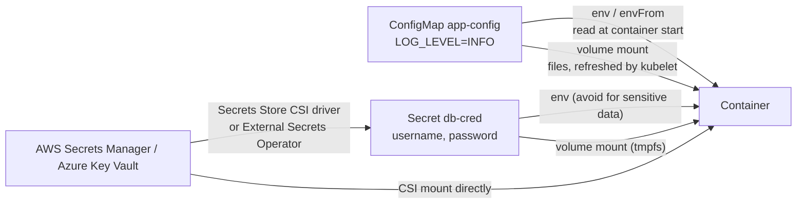
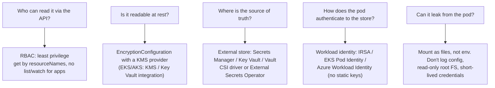
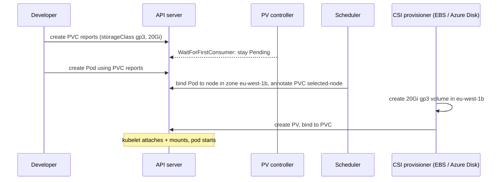

# ConfigMaps, Secrets & Volumes

!!! abstract "TL;DR"
    - **ConfigMaps** hold non-secret configuration and **Secrets** hold credentials. Both are consumed as **environment variables** (read once at container start) or **mounted files** (updated in place, eventually, except with `subPath`). Both are limited to **1 MiB** (a 1.1 MB ConfigMap was rejected), and `immutable: true` blocks changes ("field is immutable").
    - **Secrets are base64, not encrypted.** The password `S3cr3t!` was readable **in clear text directly in etcd** on a cluster without encryption at rest. Protect Secrets with **RBAC** (a service account could `get` one named Secret but couldn't `list` secrets), **KMS encryption at rest**, and preferably an **external store** (AWS Secrets Manager, Azure Key Vault) synced via the CSI driver or External Secrets, with **workload identity** (IRSA/EKS Pod Identity, Azure Workload Identity) instead of static keys.
    - **Volumes:** `emptyDir` (pod-lifetime scratch), `configMap`/`secret`/`projected`, `hostPath` (avoid), and **PersistentVolumeClaims** for durable storage.
    - **Dynamic provisioning:** a PVC names a **StorageClass**, and a CSI driver creates the disk. With `WaitForFirstConsumer` the PVC stayed `Pending` until a pod was scheduled, then got a selected node and waited for the provisioner, so zonal disks are created in the pod's zone.
    - **Reclaim policy:** `Delete` (the default for dynamic classes) removes the disk with the PVC. `Retain` keeps it: after deleting the PVC the PV went `Released`, and a new claim stayed `Pending` until an admin cleaned it up.

## Why it matters

Twelve-factor apps keep configuration and credentials out of images, and Kubernetes gives you the primitives to do it. But the defaults surprise people: Secrets aren't encrypted, environment variables don't update, mounted files update but some apps never reread them, and a misconfigured StorageClass puts a disk in the wrong availability zone. Interviewers probe exactly these points, and for a security-minded role (healthcare, key management) Secret handling is a must.

The demonstrations used a real Kubernetes v1.33.0 control plane (API server, etcd, controllers, scheduler) run by kwok with simulated nodes. No CSI driver was installed, so dynamic provisioning stops at the "waiting for the provisioner" step, which is exactly what you'd see in a real cluster with a missing or broken driver.

## Core concepts

### Getting configuration into pods


*Notice the two consumption modes behave differently on change: environment variables are fixed for the container's life, while mounted files are eventually refreshed (except with `subPath`). That decides whether a config change needs a rollout.*

| Aspect | Environment variables | Mounted volume |
|---|---|---|
| Updates when the ConfigMap/Secret changes | **No**: needs a pod restart | **Yes**, eventually (kubelet sync period plus cache TTL, typically up to about a minute) |
| `subPath` mounts | n/a | **Not** updated |
| Visibility | `/proc/<pid>/environ`, crash dumps, child processes, sometimes logs | Files (Secrets on tmpfs, never written to node disk) |
| App support | Spring Boot reads env natively | Spring reads files via `spring.config.import=configtree:/etc/secrets/` |

Rolling out config changes reliably: put a hash of the ConfigMap in a pod template annotation (Helm `checksum/config`) so a change triggers a rolling update, or use immutable, versioned ConfigMaps (`app-config-v7`) referenced by the Deployment.

### ConfigMap and Secret facts (measured)

| Experiment | Result |
|---|---|
| `kubectl get secret db-cred -o jsonpath='{.data.password}'` | `UzNjcjN0IQ==`, base64 of `S3cr3t!`. Anyone with `get` can decode it |
| Read the raw key `/registry/secrets/default/db-cred` from etcd | **Contains `S3cr3t!` and `claims` in plain text** (no encryption at rest configured) |
| Create a ConfigMap from a 1.1 MB file | Rejected: "Too long: may not be more than 1048576 bytes" |
| Patch a ConfigMap with `immutable: true` | Rejected: "field is immutable when `immutable` is set" |

Immutable ConfigMaps and Secrets also reduce API server load, because kubelets stop watching them. That matters in big clusters.

### Securing Secrets


*Notice that base64 encoding answers none of these questions. Each layer covers a different way the secret can leak.*

**RBAC, measured:** a `claims-api` service account bound to a Role allowing `get` on ConfigMaps: `can-i get configmaps` → **yes**, `can-i get secrets` → **no**. A second Role with `resourceNames: [db-cred]`: `get secret/db-cred` → **yes**, `list secrets` → **no**. Note that `list` and `watch` on Secrets return their contents, so never grant them to applications. Also, anyone who can create pods in a namespace can mount any Secret in it, so pod-creation rights are effectively Secret-read rights.

**Encryption at rest:** an `EncryptionConfiguration` on the API server with a `kms` v2 provider encrypts Secret values with a data key that's wrapped by a cloud KMS key (envelope encryption). On EKS this uses AWS KMS (and AWS has moved towards encrypting Kubernetes API data at rest by default on newer platform versions, so check your cluster settings). On AKS you enable KMS etcd encryption with Azure Key Vault. Self-managed clusters must configure it themselves. Without it, etcd backups contain cleartext secrets, as demonstrated above.

### Volumes

| Volume | Lifetime | Use |
|---|---|---|
| `emptyDir` (optionally `medium: Memory`) | Pod | Scratch space, caches, `/tmp` with a read-only root filesystem, sharing files between containers |
| `configMap`, `secret`, `projected`, `downwardAPI` | Pod | Config files, credentials, service account tokens, pod metadata |
| `persistentVolumeClaim` | Independent of the pod | Databases, uploaded files, anything durable |
| `hostPath` | Node | Node agents only. Security risk and ties pods to nodes |
| Ephemeral CSI / generic ephemeral volumes | Pod | Per-pod provisioned scratch volumes |
| Secrets Store CSI | Pod | Mount secrets straight from Key Vault or Secrets Manager |

### PersistentVolumes, claims and StorageClasses


*Notice that with `WaitForFirstConsumer`, the scheduler decides the zone first and the disk follows. With `Immediate`, the disk might be created in a zone where the pod can't be scheduled.*

Measured with a `gp3` StorageClass (`provisioner: ebs.csi.aws.com`, `WaitForFirstConsumer`):

| Step | Observed |
|---|---|
| Create PVC only | `Pending`, event **WaitForFirstConsumer**: "waiting for first consumer to be created before binding" |
| Create a pod using it | PVC annotated `volume.kubernetes.io/selected-node: node-000001`. Event **ExternalProvisioning**: "Waiting for a volume to be created either by the external provisioner 'ebs.csi.aws.com'…" (no driver installed, so it waits forever, the same symptom as a broken CSI driver in production) |

**Static PV with `Retain`**, measured: a 2Gi claim bound to a **5Gi** PV (a claim gets the whole PV, which can be bigger than requested). After deleting the PVC, the PV went **`Released`**, and a new claim stayed **`Pending`**: a Released PV isn't reused automatically, because it still holds the previous claim's data. An admin must wipe it and remove the `claimRef`, or delete it.

| Concept | Values |
|---|---|
| Access modes | `ReadWriteOnce` (one node), `ReadWriteOncePod` (one pod, GA 1.29), `ReadOnlyMany`, `ReadWriteMany` (needs a shared FS: EFS, Azure Files, NFS) |
| Reclaim policy | `Delete` (default for dynamic), `Retain` (keep data, manual clean-up) |
| Binding mode | `Immediate`, `WaitForFirstConsumer` (topology-aware; use for zonal disks) |
| Expansion | `allowVolumeExpansion: true`, then edit the PVC size (online for most CSI drivers) |
| Snapshots | `VolumeSnapshot` + `VolumeSnapshotClass` (CSI snapshotter) |

## In practice: code & configuration

### Spring Boot reading config and secrets

```yaml
apiVersion: v1
kind: ConfigMap
metadata: { name: claims-api-config }
data:
  application.yaml: |
    server.shutdown: graceful
    claims.batch-size: 200
    logging.level.root: INFO
---
apiVersion: apps/v1
kind: Deployment
metadata: { name: claims-api }
spec:
  template:
    metadata:
      annotations:
        checksum/config: "3f9c…"                 # Helm: {{ include ... | sha256sum }} → rollout on change
    spec:
      serviceAccountName: claims-api           # bound to a cloud role via IRSA / Pod Identity / Workload Identity
      containers:
        - name: app
          env:
            - name: SPRING_CONFIG_IMPORT
              value: "optional:file:/config/application.yaml,optional:configtree:/etc/secrets/"
          volumeMounts:
            - { name: config,  mountPath: /config,      readOnly: true }
            - { name: secrets, mountPath: /etc/secrets, readOnly: true }   # each key becomes a file
      volumes:
        - name: config
          configMap: { name: claims-api-config }
        - name: secrets
          csi:                                   # Secrets Store CSI driver
            driver: secrets-store.csi.k8s.io
            readOnly: true
            volumeAttributes: { secretProviderClass: claims-api-aws }
```

```yaml
apiVersion: secrets-store.csi.x-k8s.io/v1
kind: SecretProviderClass
metadata: { name: claims-api-aws }
spec:
  provider: aws
  parameters:
    objects: |
      - objectName: "prod/claims-api/db"
        objectType: "secretsmanager"
        jmesPath:
          - { path: username, objectAlias: spring.datasource.username }
          - { path: password, objectAlias: spring.datasource.password }
```

=== "❌ Common mistake"

    ```yaml
    # Secret in Git, as env vars, readable by every app in the namespace
    apiVersion: v1
    kind: Secret
    metadata: { name: db }
    stringData: { password: "S3cr3t!" }        # committed to the repo
    ---
    # ...
    envFrom: [{ secretRef: { name: db } }]      # ends up in env dumps, child processes, error pages
    # Role: verbs [get, list, watch] on secrets for the app's service account
    ```

=== "✅ Better"

    ```yaml
    # Source of truth in a cloud secret store; the pod authenticates with workload identity;
    # values arrive as files; RBAC limited; External Secrets or the CSI driver handles rotation.
    apiVersion: external-secrets.io/v1
    kind: ExternalSecret
    metadata: { name: claims-db }
    spec:
      refreshInterval: 1h
      secretStoreRef: { kind: ClusterSecretStore, name: aws-secrets-manager }
      target: { name: claims-db, creationPolicy: Owner }
      data:
        - secretKey: password
          remoteRef: { key: prod/claims-api/db, property: password }
    ```

For GitOps, encrypt secrets in Git with Sealed Secrets or SOPS if you must store them there. Better still, store only references to the external store.

### Storage for a stateful workload

```yaml
apiVersion: storage.k8s.io/v1
kind: StorageClass
metadata: { name: gp3-encrypted }
provisioner: ebs.csi.aws.com
volumeBindingMode: WaitForFirstConsumer       # disk created in the pod's AZ
reclaimPolicy: Retain                          # production data: don't delete with the PVC
allowVolumeExpansion: true
parameters: { type: gp3, encrypted: "true", kmsKeyId: alias/ebs-prod }
```

## Real-world usage

- **EKS:** the EBS CSI driver (gp3, RWO, zonal) for block storage, the EFS CSI driver for RWX, the Secrets Store CSI driver with the AWS provider (ASCP), or External Secrets Operator, with **IRSA** or **EKS Pod Identity** so pods assume IAM roles without static keys, and KMS encryption for Secrets.
- **AKS:** Azure Disk CSI (zonal or ZRS disks) and Azure Files CSI (RWX), the **Key Vault Secrets Provider** add-on (Secrets Store CSI), **Azure Workload Identity** with federated credentials, and KMS etcd encryption with Key Vault.
- **Spring Cloud Kubernetes** can watch ConfigMaps and Secrets and refresh beans (`@RefreshScope`), but many teams prefer restart-on-change via checksum annotations for predictability.
- **Reloader** (stakater) watches ConfigMaps and Secrets and triggers rolling restarts of Deployments that reference them.
- **Backups:** Velero backs up Kubernetes objects and volume snapshots. Etcd backups need encryption at rest, or they contain secrets in clear text.

## Trade-offs & production gotchas

!!! warning "Config and storage pitfalls"
    - **"Secrets are encrypted":** they're base64, and plain text in etcd without encryption at rest (measured).
    - **`list`/`watch` on Secrets** for apps leaks every secret in the namespace. Pod-create rights imply Secret access too.
    - **Env vars don't update:** a config change has no effect until restart. Mounted files update, except with `subPath`.
    - **Apps that read config once:** a file update without a restart or refresh changes nothing.
    - **1 MiB limit:** large configs or certificate bundles don't fit. Use volumes from images, object storage or init containers.
    - **`Immediate` binding with zonal disks:** a PVC in zone A and a pod that can only run in zone B stays Pending ("volume node affinity conflict").
    - **`Delete` reclaim on production data:** deleting a PVC (or a namespace) deletes the disk.
    - **RWO volumes and rolling updates:** a new pod on a different node can't attach the volume until the old pod detaches. Use `Recreate`, RWX or a StatefulSet.
    - **Released PVs don't rebind:** a new claim stays Pending (measured) until an admin cleans up.

- **CSI driver vs synced Kubernetes Secret:** the CSI driver mounts values directly (no copy in etcd), but needs a pod volume. Syncing to a Kubernetes Secret (ESO, or the CSI `secretObjects`) is convenient for env vars and Ingress TLS, but puts the value back in etcd.
- **Rotation:** external stores rotate credentials, but apps need to pick up new values (refresh, restart, or dual-credential overlap).

## How this connects to my experience

- **Where I used it:** not ★ for this subtopic, but closely related to my security work. At Deloitte (ConvergeHealth) I "implemented security controls using IAM, KMS, and Secrets Manager". At Coriolis (CipherTrust Cloud Key Management) I built key management for AWS, Azure and GCP with "automated key rotation workflows and HSM integrations using Thales Luna and SafeNet". That's the KMS layer behind envelope encryption of Kubernetes Secrets and EBS volumes. *[confirm: how secrets reached pods on EKS (env, CSI driver, ESO), whether IRSA was used, and whether KMS encryption was enabled for Secrets]*
- **Talking points:**
    - "Kubernetes Secrets are just base64. I treat them as a delivery mechanism, with the source of truth in Secrets Manager or Key Vault and KMS encryption at rest."
    - "Pods authenticate to the store with workload identity (IRSA or Azure Workload Identity), so there are no static keys anywhere."
    - "Config changes roll out through checksum annotations, so behaviour is predictable."
    - "From my key-management background: rotation is the hard part, so I design for dual credentials during rotation."
- **Likely follow-up chain:** "Are Kubernetes Secrets secure?" → "How would you secure them?" (RBAC, KMS, external store) → "How does the pod get credentials to Secrets Manager?" (IRSA/Pod Identity) → "How do you rotate a DB password without downtime?" → "How do config changes reach running pods?" → "How is storage provisioned on EKS, and why WaitForFirstConsumer?"

## Interview questions

### Fundamentals

??? question "Q1. What's the difference between a ConfigMap and a Secret?"
    **Answer:** Both are key-value API objects (up to 1 MiB) consumed as environment variables or mounted files. ConfigMaps are for non-sensitive configuration. Secrets are for credentials: they're stored base64-encoded, can have separate RBAC, are mounted on tmpfs, can be encrypted at rest with KMS, and kubectl hides them in `describe`. But base64 isn't encryption: without encryption at rest the value is plain text in etcd (measured: the password was readable directly from the etcd key).

    **Interviewer listens for:** a similar mechanism, different intent and protections, and base64 ≠ encryption.

    **Common wrong answer:** "Secrets are encrypted, ConfigMaps aren't."

??? question "Q2. If I update a ConfigMap, does my running application see the change?"
    **Answer:** It depends how it's consumed. Environment variables are set at container start and never change, so a restart is needed. Mounted volumes are updated by the kubelet eventually (sync period plus cache, typically under a minute), but not when mounted with `subPath`. And the app must reread the file, which many apps don't. Reliable patterns: a config hash annotation in the pod template to trigger a rolling update, versioned immutable ConfigMaps, or a refresh mechanism (Spring Cloud Kubernetes, Reloader).

    **Interviewer listens for:** env vs volume, subPath, app rereading, and rollout patterns.

    **Common wrong answer:** "Yes, Kubernetes pushes the update to the pod immediately."

??? question "Q3. What's the difference between a PersistentVolume and a PersistentVolumeClaim?"
    **Answer:** A PV is a piece of storage in the cluster (an EBS volume, Azure Disk or NFS share), created by an admin (static) or by a CSI provisioner (dynamic). A PVC is a namespaced request for storage (size, access mode, StorageClass) that binds to a matching PV. Pods reference PVCs, not PVs, which decouples apps from storage details. A claim gets the whole PV, which can be larger than requested (measured: a 2Gi claim bound to a 5Gi PV).

    **Interviewer listens for:** supply vs request, static vs dynamic, binding, and pods using PVCs.

    **Common wrong answer:** "They're the same thing at different scopes."

??? question "Q4. What is a StorageClass?"
    **Answer:** A template for dynamic provisioning: which CSI provisioner (`ebs.csi.aws.com`, `disk.csi.azure.com`), parameters (disk type, IOPS, encryption, KMS key), reclaim policy (Delete or Retain), binding mode (Immediate or WaitForFirstConsumer) and whether expansion is allowed. A PVC naming a StorageClass triggers the provisioner to create a matching volume and PV. One class can be the default for PVCs that don't specify one.

    **Interviewer listens for:** the provisioner and parameters, reclaim and binding modes, and the default class.

    **Common wrong answer:** "It's a type of disk."

### Intermediate

??? question "Q5. How would you secure Kubernetes Secrets in production?"
    **Answer:** Layered: (1) RBAC least privilege: apps get `get` on specific `resourceNames` only, never `list`/`watch` (measured: a named get allowed, list denied), and restrict who can create pods. (2) Encryption at rest with a KMS v2 provider (EKS KMS, AKS Key Vault). (3) Source of truth in an external store (Secrets Manager, Key Vault, Vault), delivered by the Secrets Store CSI driver or External Secrets Operator, with rotation. (4) Workload identity (IRSA/EKS Pod Identity, Azure Workload Identity) so pods have no static cloud keys. (5) Mount as files rather than env vars, don't log config, read-only root filesystem. (6) Audit logging of Secret access, and no Secrets in Git unless encrypted (SOPS, Sealed Secrets).

    **Interviewer listens for:** the multiple layers, and that encryption alone isn't enough.

    **Common wrong answer:** "Base64-encode them and restrict kubectl access."

??? question "Q6. What does volumeBindingMode: WaitForFirstConsumer do, and why does it matter?"
    **Answer:** It delays binding and provisioning a PVC until a pod using it is scheduled. Then the provisioner creates the volume in the topology (zone) the scheduler chose. Measured: the PVC stayed Pending with "waiting for first consumer", and after the pod was scheduled it was annotated with the selected node and handed to the provisioner. With `Immediate`, the volume can be created in a zone where the pod can't run (because of node affinity, capacity or taints), leaving the pod Pending with a volume node affinity conflict. Use it for zonal block storage (EBS, Azure Disk).

    **Interviewer listens for:** topology awareness, delayed provisioning, and the zone mismatch problem.

    **Common wrong answer:** "It waits until the disk is formatted."

??? question "Q7. Explain access modes. Why can't my two Deployment replicas share an EBS volume?"
    **Answer:** Access modes: ReadWriteOnce (mounted read-write by one node), ReadWriteOncePod (exactly one pod, 1.29 GA), ReadOnlyMany, ReadWriteMany. EBS and Azure Disk are block devices that attach to one node, so they're RWO. Two replicas on different nodes can't both attach, and the second stays ContainerCreating with a multi-attach error. Options: a StatefulSet with a volume per replica, a shared filesystem (EFS, Azure Files) for RWX, or redesign to use object storage or a database instead of a shared disk.

    **Interviewer listens for:** block vs shared filesystem, RWO semantics, and alternatives.

    **Common wrong answer:** "Set accessModes to ReadWriteMany on the EBS PVC."

??? question "Q8. What happens to a PersistentVolume when its claim is deleted?"
    **Answer:** It depends on the reclaim policy. `Delete` (the default for dynamically provisioned volumes) deletes the PV and the underlying cloud disk, so the data is gone. `Retain` keeps the PV and data: the PV becomes `Released` and won't bind to a new claim automatically (measured: a new claim stayed Pending), because it still references the old claim and contains its data. An admin must back up or wipe it and remove the `claimRef`, or delete it. Use Retain for production data, plus volume snapshots for backups.

    **Interviewer listens for:** both policies, the Released state, manual reuse, and protecting production data.

    **Common wrong answer:** "The PV goes back to Available for the next claim."

??? question "Q9. How does a pod on EKS get credentials to read from AWS Secrets Manager without static keys?"
    **Answer:** Workload identity. With IRSA: the cluster has an OIDC provider, the service account is annotated with an IAM role ARN, and the pod gets a projected service account token that the AWS SDK exchanges via `AssumeRoleWithWebIdentity` for temporary credentials. The role's trust policy restricts it to that namespace and service account. With EKS Pod Identity (newer, simpler): an association maps the service account to a role, and an agent DaemonSet provides credentials. The pod (or the Secrets Store CSI driver acting for it) then calls Secrets Manager with least-privilege IAM, optionally with KMS decrypt on the secret's key. AKS uses Azure Workload Identity with federated credentials in the same way.

    **Interviewer listens for:** an OIDC/STS or Pod Identity flow, scoping to the service account, temporary credentials, and least privilege.

    **Common wrong answer:** "Put AWS access keys in a Kubernetes Secret."

### Senior

??? question "Q10. How do you rotate a database password used by 20 pods without downtime?"
    **Answer:** Use dual credentials. (1) Create a new password (or a second user) while the old one remains valid: Secrets Manager rotation with the alternating-users strategy, or DB-side dual passwords. (2) Update the secret in the external store, and let External Secrets or the CSI driver sync it. (3) Get pods to use it: either the app rereads mounted files and recreates its connection pool (Spring Cloud Kubernetes refresh, or HikariCP's credential provider), or trigger a rolling restart (checksum annotation, Reloader). (4) Verify all pods use the new credential (DB session metrics). (5) Revoke the old credential. Never rotate in a way that invalidates the old credential before all consumers switch. Better still, use short-lived credentials (IAM database authentication, Vault dynamic secrets).

    **Interviewer listens for:** overlap and dual credentials, the propagation mechanism, verification, revocation, and the dynamic-credentials alternative.

    **Common wrong answer:** "Update the Secret. Pods pick it up automatically."

??? question "Q11. Explain encryption at rest for Kubernetes Secrets with KMS."
    **Answer:** The API server's `EncryptionConfiguration` lists providers for resources such as `secrets`. With the KMS v2 provider, the API server encrypts each Secret with a data encryption key (DEK) and stores the DEK wrapped by a key-encryption key in an external KMS (AWS KMS, Azure Key Vault, an HSM-backed Vault), which is envelope encryption. etcd then holds ciphertext, so etcd snapshots and disk access don't reveal secrets (unlike the clear text seen in this demo's unencrypted etcd). KMS v2 caches DEKs and uses a seed for performance. Key rotation means rotating the KMS key and rewriting Secrets (`kubectl get secrets -A -o json | kubectl replace -f -`) to re-encrypt them. It doesn't protect against API access, which is still RBAC's job.

    **Interviewer listens for:** envelope encryption, DEK/KEK roles, what it protects against and what it doesn't, and rotation.

    **Common wrong answer:** "etcd encrypts everything by default."

??? question "Q12. Should configuration live in ConfigMaps, the image, or an external config service?"
    **Answer:** Bake environment-independent defaults into the application (`application.yaml`). Put environment-specific, non-secret settings in ConfigMaps managed with the deployment (Helm values, Kustomize overlays in Git), so changes are reviewed and versioned and trigger rollouts. Keep secrets in an external store. Use feature flags or a dynamic config service (LaunchDarkly, AWS AppConfig, Spring Cloud Config) for values that must change at runtime without deploys, with auditing and gradual rollout. Avoid per-environment images. The same image is promoted through environments with different config.

    **Interviewer listens for:** a layered config strategy, Git-reviewed config, secrets separate, and the same image everywhere.

    **Common wrong answer:** "Build a different image per environment."

### Scenario-based

??? question "Q13. A new StatefulSet's pods are stuck Pending, and their PVCs are Pending too. Diagnose."
    **Answer:** Check the PVC events. "waiting for first consumer" is normal until the pod is scheduled. "Waiting for a volume to be created by the external provisioner" (measured) means the CSI provisioner isn't working: driver not installed, controller pods crashing, missing IAM permissions (EBS CSI needs an IRSA role with the right policy), or a wrong provisioner name in the StorageClass. Also check for a missing default StorageClass (a PVC without a class waits for a static PV), a quota on storage, an unsupported access mode (RWX on EBS), or zone constraints (no capacity in the selected zone). Then check the pod's events for scheduling reasons.

    **Interviewer listens for:** PVC events first, provisioner health and permissions, class/mode/quota/zone issues.

    **Common wrong answer:** "Delete and recreate the StatefulSet."

??? question "Q14. A security review finds database passwords in kubectl get secret output, in Git and in pod environment dumps. Remediation plan?"
    **Answer:** Immediately rotate every exposed credential, since history in Git and logs counts as compromised. Then: move the source of truth to Secrets Manager or Key Vault, deliver it via the Secrets Store CSI driver (as files) or External Secrets, and authenticate pods with IRSA/Pod Identity or Azure Workload Identity. Remove secrets from Git (rewrite history if required, and add scanners such as gitleaks to CI). Switch apps from env vars to mounted files (Spring `configtree`). Restrict RBAC to named `get` (no list/watch), limit pod-creation rights, enable KMS encryption at rest and audit logging of Secret reads. Adopt short-lived credentials where possible.

    **Interviewer listens for:** rotation first, then systemic controls across storage, delivery, identity, RBAC, encryption and detection.

    **Common wrong answer:** "Mark the Secrets as immutable."

## Cheat sheet

| Topic | Remember |
|---|---|
| ConfigMap / Secret | Key-value, 1 MiB max (1.1 MB rejected); env or files |
| Updates | Env: never (restart). Files: eventually, not `subPath`. Use checksum annotation / Reloader |
| Immutable | `immutable: true` → changes rejected; less API load |
| Secret encoding | base64 only; clear text in etcd without encryption (measured) |
| Protect | RBAC named `get` (no list/watch), KMS v2 at rest, external store + CSI/ESO, workload identity, files not env |
| Volumes | emptyDir, configMap/secret/projected, PVC, hostPath (avoid), CSI |
| PV / PVC | Supply vs request; claim gets the whole PV (2Gi → 5Gi) |
| StorageClass | Provisioner, params, reclaim, binding mode, expansion |
| WaitForFirstConsumer | PVC Pending until pod scheduled → disk in the pod's zone |
| Reclaim | Delete (default dynamic) vs Retain (Released, no auto-rebind) |
| Access modes | RWO, RWOP, ROX, RWX (EFS / Azure Files) |
| EKS / AKS | EBS/EFS CSI + ASCP + IRSA/Pod Identity; Azure Disk/Files + Key Vault provider + Workload Identity |

## Sources
1. [Kubernetes docs: ConfigMaps](https://kubernetes.io/docs/concepts/configuration/configmap/) and [Secrets](https://kubernetes.io/docs/concepts/configuration/secret/) (including good practices).
2. [Kubernetes docs: Encrypting confidential data at rest](https://kubernetes.io/docs/tasks/administer-cluster/encrypt-data/) and [KMS provider](https://kubernetes.io/docs/tasks/administer-cluster/kms-provider/).
3. [Kubernetes docs: Volumes](https://kubernetes.io/docs/concepts/storage/volumes/), [Persistent volumes](https://kubernetes.io/docs/concepts/storage/persistent-volumes/) and [Storage classes](https://kubernetes.io/docs/concepts/storage/storage-classes/).
4. [Kubernetes docs: RBAC good practices](https://kubernetes.io/docs/concepts/security/rbac-good-practices/).
5. [Secrets Store CSI Driver](https://secrets-store-csi-driver.sigs.k8s.io/) and [External Secrets Operator](https://external-secrets.io/).
6. [Amazon EKS: IAM roles for service accounts and Pod Identity](https://docs.aws.amazon.com/eks/latest/userguide/pod-identities.html), [EBS CSI driver](https://docs.aws.amazon.com/eks/latest/userguide/ebs-csi.html) and [envelope encryption](https://docs.aws.amazon.com/eks/latest/userguide/envelope-encryption.html).
7. [AKS: Key Vault Secrets Provider](https://learn.microsoft.com/en-us/azure/aks/csi-secrets-store-driver), [Workload Identity](https://learn.microsoft.com/en-us/azure/aks/workload-identity-overview) and [KMS etcd encryption](https://learn.microsoft.com/en-us/azure/aks/use-kms-etcd-encryption).
8. Demonstrations on this page: Kubernetes v1.33.0 control plane via kwokctl plus etcdctl, run while writing this page (Secret in etcd, size limit, immutable ConfigMap, RBAC can-i, WaitForFirstConsumer events, Retain/Released behaviour).
