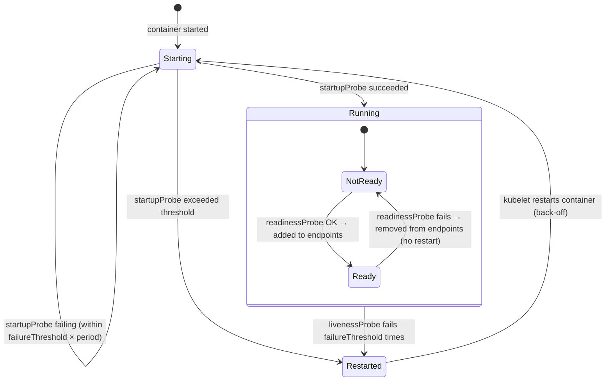
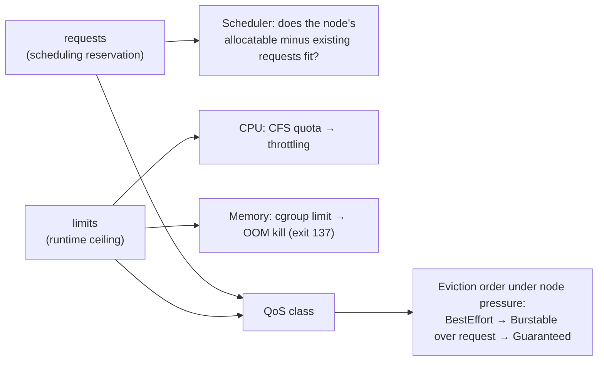
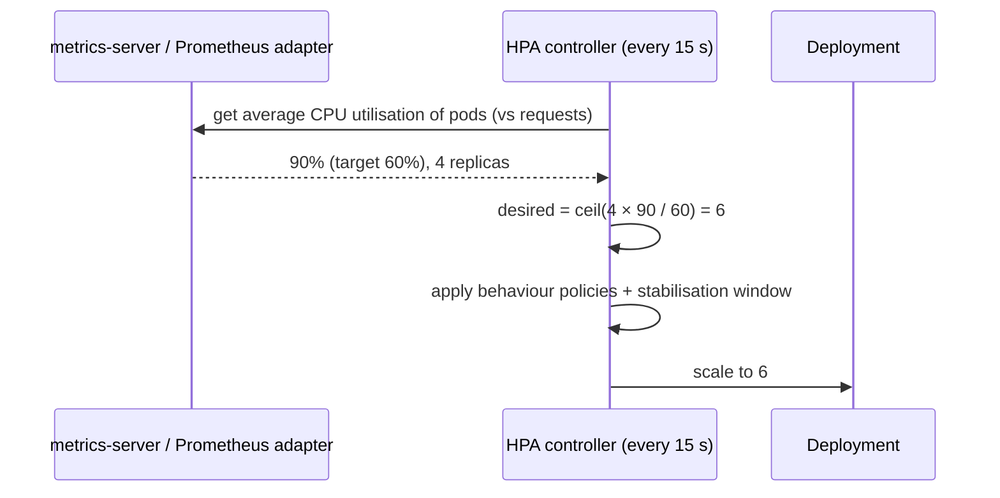

# Probes, Resource Requests/Limits & Autoscaling (HPA)

!!! abstract "Key takeaways"
    - **Probes:** *readiness* decides whether a pod gets traffic, *liveness* decides whether the kubelet restarts the container, and *startup* holds off the other two until a slow app has started. Never make liveness depend on downstream systems (database, Kafka), or one outage restarts every pod.
    - **Requests** are what the scheduler reserves (a 64-CPU request stayed `Pending`: "3 Insufficient cpu"). **Limits** are enforced at runtime: CPU is **throttled** (a workload took **3.1 s** unlimited, **6.2 s** at 0.5 CPU and **12.6 s** at 0.25 CPU, throttled in 129 of 129 periods), and memory over the limit is **OOM-killed** (exit 137, `OOMKilled=true` at about 90 MB of a 100 MB limit).
    - **QoS classes** follow from requests and limits: Guaranteed, Burstable, BestEffort (all three verified). They decide eviction order under node pressure. Common practice: set memory request = limit, set a CPU request, and often no CPU limit for latency-sensitive services.
    - **LimitRange** injects defaults and caps per container (a 3Gi limit was rejected against a 2Gi max). **ResourceQuota** caps a namespace: only 7 of 12 replicas were created before `exceeded quota`.
    - **HPA** scales replicas with `desired = ceil(current × currentMetric / target)` from the metrics API. Without metrics-server it reported `ScalingActive=False FailedGetResourceMetric`. Pair it with Cluster Autoscaler or **Karpenter** for nodes, and **KEDA** for event-driven scaling (Kafka lag, queue depth).

## Why it matters

Most Kubernetes reliability incidents trace back to these settings: liveness probes that restart healthy pods during a database blip, missing readiness probes that send traffic to warming JVMs, CPU limits that throttle a Spring Boot service into timeouts, memory limits that OOM-kill pods, and autoscalers that don't scale because metrics are missing or requests aren't set. Interviewers expect you to explain each probe, requests vs limits, QoS, and how HPA calculates replicas.

Scheduling, QoS, quota and HPA behaviour was demonstrated on a Kubernetes v1.33.0 control plane (kwok, simulated nodes with 32 CPU / 256 Gi each). CPU throttling and OOM kills were measured with Docker 29 on cgroup v1, using the same cgroup mechanisms the kubelet uses.

## Core concepts

### The three probes


*Notice the different consequences: readiness failures only remove the pod from Service endpoints, while liveness failures kill and restart the container. That's why liveness must be cheap and local.*

{ loading=lazy }
*Watch step 3 on the left: the database is already back, but the pods are still recovering from restarts the probe caused.*

| Probe | Question | On failure | Typical check for Spring Boot |
|---|---|---|---|
| **startup** | Has the app finished starting? | Restart after `failureThreshold × periodSeconds` | `/actuator/health/liveness`, generous threshold (e.g. 30 × 2 s) |
| **readiness** | Should it receive traffic now? | Removed from endpoints, no restart | `/actuator/health/readiness` (can include critical dependencies) |
| **liveness** | Is the process stuck beyond recovery? | Container restarted | `/actuator/health/liveness` (internal state only) |

Mechanisms: `httpGet`, `tcpSocket`, `exec`, `grpc`. Parameters: `initialDelaySeconds`, `periodSeconds` (10 s default), `timeoutSeconds` (1 s default, too short for a JVM under GC load), `failureThreshold` (3), `successThreshold`.

Spring Boot exposes liveness and readiness groups automatically when it detects Kubernetes (`management.endpoint.health.probes.enabled=true` elsewhere). The **AvailabilityState** goes `REFUSING_TRAFFIC` during graceful shutdown, so readiness drops before the app stops. Add dependencies to readiness deliberately (`management.endpoint.health.group.readiness.include=readinessState,db`) and **keep liveness free of them**.

### Requests, limits and QoS


*Notice that requests and limits act at different times: requests at scheduling, limits continuously at runtime. CPU is compressible (slowed down), memory isn't (killed).*

Measured:

| Experiment | Result |
|---|---|
| Pod with requests = limits for CPU and memory | `qosClass: Guaranteed` |
| Requests set, memory limit higher, no CPU limit | `Burstable` |
| No requests or limits | `BestEffort` |
| Request 64 CPUs on 32-CPU nodes | `Pending`: "0/4 nodes are available: 1 node(s) had untolerated taint {dedicated: gpu}, 3 Insufficient cpu. preemption: … No preemption victims" |
| CPU-bound loop, unlimited / `--cpus=0.5` / `--cpus=0.25` | **3.11 s / 6.15 s / 12.61 s**. cgroup `nr_throttled` = 129 of 129 periods, 9.5 s throttled |
| Allocate 10 MB chunks under a 100 MB memory limit | Killed after 90 MB: **`OOMKilled=true`, exit 137** |

**CPU limits and Java:** CFS enforces the quota per 100 ms period. A multithreaded JVM (GC threads, Tomcat workers) can burn its whole quota in the first few milliseconds and then be paused for the rest of the period, so p99 latency spikes even at low average CPU. Many teams set a CPU **request** (for scheduling and fair sharing under contention) and **no CPU limit** for latency-sensitive services, while keeping **memory request = limit** for predictability. The JVM sizes its thread pools from the CPU limit (or from requests via `-XX:ActiveProcessorCount`), so set that explicitly if you remove limits.

{ loading=lazy }
*Notice the red blocks: the threads aren't slow, they're paused. That's why throttling shows up as p99 latency rather than high CPU.*

**Memory:** the limit covers the whole container RSS: heap plus metaspace, threads, code cache and direct buffers. Size heap with `MaxRAMPercentage` around 70–75% ([containers page](01-containers-vs-vms-docker-images-layers-multi-stage-builds.md)).

### LimitRange and ResourceQuota

Measured in namespace `team-a` with a LimitRange (default request 100m / 256Mi, default memory limit 512Mi, max memory 2Gi) and a ResourceQuota (requests.cpu 1, requests.memory 2Gi, limits.memory 4Gi, pods 10):

| Action | Result |
|---|---|
| `kubectl run p1` with no resources | Defaulted to `requests: {cpu: 100m, memory: 256Mi}, limits: {memory: 512Mi}` |
| Pod with a 3Gi memory limit | `Forbidden: maximum memory usage per Container is 2Gi, but limit is 3Gi` |
| Deployment with 12 replicas | **7** pods created, then `exceeded quota: … limits.memory=4Gi … limited: limits.memory=4Gi`. Quota showed `limits.memory 4Gi/4Gi`, `requests.memory 2Gi/2Gi` |

The failure appears on the **ReplicaSet** (and in events), not on `kubectl apply`, a common source of "my Deployment only has 7 pods" confusion.

### Horizontal Pod Autoscaler


*Notice that CPU utilisation is measured relative to **requests**. Without CPU requests the HPA can't compute utilisation, and without a metrics source it can't scale at all.*

- Formula: `desiredReplicas = ceil(currentReplicas × currentMetricValue / desiredMetricValue)`, with a 10% tolerance band, clamped to `[minReplicas, maxReplicas]`, and the maximum across multiple metrics.
- **Behaviour:** `scaleUp`/`scaleDown` policies (pods or percent per period) and `stabilizationWindowSeconds` (default 300 s for scale-down) prevent flapping.
- **Metric types:** `Resource` (CPU/memory from metrics-server), `Pods` and `Object` (custom metrics through an adapter, such as requests per second per pod), `External` (queue depth, Kafka lag).
- Measured: an HPA on a cluster without metrics-server reported `AbleToScale=True` but **`ScalingActive=False FailedGetResourceMetric: unable to get metrics for resource cpu`**. That's the first thing to check when an HPA "does nothing".
- **Memory-based HPA** rarely works well for the JVM: heap doesn't shrink after load, so replicas never scale back down. Prefer CPU, request rate or latency.

### The rest of the autoscaling stack

| Tool | Scales | Notes |
|---|---|---|
| **HPA** | Replicas | CPU, memory, custom and external metrics |
| **KEDA** | Replicas (including to zero) | Event sources: Kafka consumer lag, SQS, Service Bus, Prometheus, cron. Creates and drives an HPA |
| **VPA** | Requests and limits | Recommends or applies right-sizing. Don't combine with HPA on the same CPU/memory metric. In-place pod resize (beta in 1.33) reduces restarts |
| **Cluster Autoscaler** | Nodes (node groups/ASGs) | Adds nodes when pods are Pending for lack of resources, removes underused nodes |
| **Karpenter** (EKS, and AKS Node Auto Provisioning) | Nodes, directly via the cloud API | Picks instance types per pending pods, consolidation, spot. Faster and more flexible than CA |

HPA only creates pods. If they don't fit, they stay Pending until the node autoscaler adds capacity, which is why requests must be realistic.

## In practice: code & configuration

```yaml
containers:
  - name: app
    image: claims-api:1.8.2
    resources:
      requests: { cpu: "500m", memory: "1Gi" }   # what the scheduler reserves; HPA % is relative to this
      limits:   { memory: "1Gi" }                # memory request = limit; no CPU limit (avoid throttling)
    env:
      - { name: JAVA_TOOL_OPTIONS, value: "-XX:MaxRAMPercentage=75 -XX:ActiveProcessorCount=2" }
    startupProbe:
      httpGet: { path: /actuator/health/liveness, port: 8080 }
      periodSeconds: 2
      failureThreshold: 60                       # up to 120 s to start, then liveness takes over
    readinessProbe:
      httpGet: { path: /actuator/health/readiness, port: 8080 }
      periodSeconds: 5
      timeoutSeconds: 2
      failureThreshold: 3
    livenessProbe:
      httpGet: { path: /actuator/health/liveness, port: 8080 }
      periodSeconds: 10
      timeoutSeconds: 3
      failureThreshold: 3
---
apiVersion: autoscaling/v2
kind: HorizontalPodAutoscaler
metadata: { name: claims-api }
spec:
  scaleTargetRef: { apiVersion: apps/v1, kind: Deployment, name: claims-api }
  minReplicas: 3
  maxReplicas: 30
  metrics:
    - type: Resource
      resource: { name: cpu, target: { type: Utilization, averageUtilization: 60 } }
  behavior:
    scaleUp:   { stabilizationWindowSeconds: 0,   policies: [{ type: Percent, value: 100, periodSeconds: 30 }] }
    scaleDown: { stabilizationWindowSeconds: 300, policies: [{ type: Percent, value: 20,  periodSeconds: 60 }] }
```

```properties
# application.properties
management.endpoint.health.probes.enabled=true
management.endpoint.health.group.readiness.include=readinessState,db   # db affects traffic, not restarts
management.endpoint.health.group.liveness.include=livenessState        # never external dependencies
server.shutdown=graceful
```

=== "❌ Common mistake"

    ```yaml
    livenessProbe:
      httpGet: { path: /actuator/health, port: 8080 }   # includes DB, Redis, Kafka health
      initialDelaySeconds: 10                           # JVM needs 40 s to start → restart loop
      timeoutSeconds: 1                                 # a GC pause → failure
    resources:
      limits: { cpu: "500m", memory: "512Mi" }          # no requests → request = limit; CPU throttled
    # A DB outage now fails liveness on every pod → all pods restart → outage spreads
    ```

=== "✅ Better"

    ```yaml
    startupProbe:   { httpGet: { path: /actuator/health/liveness,  port: 8080 }, periodSeconds: 2, failureThreshold: 60 }
    livenessProbe:  { httpGet: { path: /actuator/health/liveness,  port: 8080 }, timeoutSeconds: 3 }
    readinessProbe: { httpGet: { path: /actuator/health/readiness, port: 8080 }, timeoutSeconds: 2 }
    resources:
      requests: { cpu: 500m, memory: 1Gi }
      limits:   { memory: 1Gi }
    ```

### Event-driven scaling of a Kafka consumer with KEDA

```yaml
apiVersion: keda.sh/v1alpha1
kind: ScaledObject
metadata: { name: claims-consumer }
spec:
  scaleTargetRef: { name: claims-consumer }
  minReplicaCount: 1
  maxReplicaCount: 12          # never above the topic's partition count
  triggers:
    - type: kafka
      metadata:
        bootstrapServers: kafka:9092
        consumerGroup: claims-processor
        topic: claims
        lagThreshold: "500"    # target lag per replica
```

## Real-world usage

- **Spring Boot on Kubernetes** typically uses Actuator liveness and readiness groups, a startup probe for JVM warm-up, memory request = limit, and HPA on CPU.
- **Kafka consumers** scale on consumer lag with KEDA, capped at the number of partitions, because extra consumers in a group sit idle.
- **EKS** clusters increasingly use **Karpenter** for node provisioning, with consolidation and spot instances. **AKS** offers the Cluster Autoscaler and Node Auto Provisioning (Karpenter-based).
- **Platform teams** enforce LimitRanges and ResourceQuotas per namespace, with policy engines (Kyverno, Gatekeeper) requiring requests, probes and memory limits.
- **VPA in recommendation mode** plus cost tools (Kubecost, OpenCost) are used to right-size requests periodically.

## Trade-offs & production gotchas

!!! warning "Probe and resource pitfalls"
    - **Liveness checking dependencies:** a database outage restarts every pod and amplifies the incident. Liveness should be local.
    - **No startup probe for slow JVMs:** liveness kills the app before it finishes starting (CrashLoopBackOff).
    - **1 s probe timeouts:** GC pauses or a busy event loop cause false failures.
    - **CPU limits on latency-sensitive services:** CFS throttling (measured: 129 of 129 periods throttled at 0.25 CPU) causes p99 spikes. Monitor `container_cpu_cfs_throttled_periods_total`.
    - **Memory limit too close to heap:** OOMKilled (exit 137) with no Java OutOfMemoryError. Leave non-heap headroom.
    - **No requests:** pods are BestEffort, evicted first, overpacked on nodes, and HPA utilisation can't be computed.
    - **Quota surprises:** a Deployment silently stops at N pods (7/12 here). Check ReplicaSet events.
    - **HPA without metrics** (`FailedGetResourceMetric`) or fighting VPA on the same metric.
    - **Scaling beyond downstream capacity:** 30 replicas × 20 DB connections = 600 connections. Cap `maxReplicas` and pool sizes together.

- **Guaranteed QoS everywhere** is predictable but wastes capacity. **Burstable** with sensible requests is the common balance.
- **Scale-up speed vs stability:** aggressive scale-up absorbs spikes, slow scale-down avoids flapping. JVM warm-up means new pods aren't immediately at full capacity.

## How this connects to my experience

- **Where I used it:** not ★. Spring Boot microservices on EKS (Deloitte) and Kubernetes (EKS/AKS) in my skills. At OptumRx the services served **750K+ users** and included Kafka-based workflows, the kind of workloads where probes, requests and limits, and lag-based scaling matter. *[confirm: probe configuration used, whether CPU limits were set, HPA/KEDA usage and metrics, any OOMKilled or throttling incidents you resolved]*
- **Talking points:**
    - "Readiness controls traffic, liveness controls restarts, and startup protects slow JVM starts. I never put downstream dependencies in liveness."
    - "Memory request equals limit, with heap at about 75% of it. CPU gets a request, and for latency-sensitive services no limit, because CFS throttling shows up as p99 spikes."
    - "HPA on CPU for APIs, KEDA on lag for Kafka consumers capped at the partition count, and Karpenter or the Cluster Autoscaler for nodes."
- **Likely follow-up chain:** "Liveness vs readiness?" → "What should liveness check?" → "Requests vs limits?" → "What happens when you exceed each?" (throttling vs OOM) → "How does HPA compute replicas?" → "Why isn't my HPA scaling?" → "How do nodes scale?"

## Interview questions

### Fundamentals

??? question "Q1. What's the difference between liveness, readiness and startup probes?"
    **Answer:** Readiness decides whether the pod receives traffic: failing removes it from Service endpoints without restarting it (temporary overload, warming up, dependency unavailable). Liveness decides whether the container is broken beyond recovery: failing makes the kubelet restart it (deadlock, stuck event loop). The startup probe runs first for slow-starting apps: liveness and readiness are disabled until it succeeds, and if it doesn't succeed within `failureThreshold × periodSeconds` the container is restarted. For Spring Boot, use the Actuator `/health/readiness` and `/health/liveness` groups.

    **Interviewer listens for:** distinct consequences (endpoints vs restart) and the startup probe's role.

    **Common wrong answer:** "They're the same check at different intervals."

??? question "Q2. What's the difference between resource requests and limits?"
    **Answer:** Requests are what the scheduler reserves: a pod is placed only on a node whose allocatable resources minus existing requests fit it (measured: a 64-CPU request stayed Pending with "Insufficient cpu"). They also set the CPU share under contention and the basis for HPA utilisation. Limits are runtime ceilings enforced by cgroups: CPU over the limit is throttled (measured: 2× and 4× slower at 0.5 and 0.25 CPU), and memory over the limit causes an OOM kill (measured: exit 137, OOMKilled). If you set only limits, requests default to the limits.

    **Interviewer listens for:** scheduling vs enforcement, throttling vs OOM, and the defaulting rule.

    **Common wrong answer:** "Requests are the minimum the app uses, limits the maximum, both enforced the same way."

??? question "Q3. What are the QoS classes?"
    **Answer:** Derived from requests and limits. **Guaranteed:** every container has CPU and memory requests equal to limits. **Burstable:** at least one request or limit set, but not Guaranteed. **BestEffort:** none set. All three were verified in the demo. Under node memory pressure the kubelet evicts BestEffort first, then Burstable pods exceeding their requests, and Guaranteed last. QoS also affects OOM score adjustments. Guaranteed pods can get exclusive CPUs with the static CPU manager policy.

    **Interviewer listens for:** the derivation rules and eviction ordering.

    **Common wrong answer:** "QoS is a field you set on the pod."

??? question "Q4. How does the Horizontal Pod Autoscaler decide how many replicas to run?"
    **Answer:** Every 15 s it reads metrics (CPU and memory from metrics-server, or custom and external metrics via adapters) and computes `desired = ceil(current × currentValue / targetValue)` (for example 4 × 90% / 60% = 6), ignoring changes within a 10% tolerance, taking the maximum across metrics, clamping to min/max, and applying behaviour policies and stabilisation windows (scale-down defaults to a 300 s window). CPU utilisation is relative to requests. Measured: without metrics-server the HPA reported `ScalingActive=False FailedGetResourceMetric`.

    **Interviewer listens for:** the formula, metric sources, relativity to requests, and stabilisation.

    **Common wrong answer:** "It adds one pod whenever CPU is over the target."

### Intermediate

??? question "Q5. Why shouldn't a liveness probe check the database?"
    **Answer:** Liveness failure restarts the container. If the database is down or slow, every pod's liveness fails at once, so all pods restart in a loop. Restarting doesn't fix the database, it removes all capacity, adds startup load, and turns a dependency problem into a full outage (and CrashLoopBackOff delays recovery). Dependencies belong in readiness (stop routing traffic when the app can't serve) or in circuit breakers inside the app. Liveness should only detect internal unrecoverable states such as deadlocks.

    **Interviewer listens for:** the cascading restart scenario, and readiness or circuit breakers as the alternatives.

    **Common wrong answer:** "It's good: if the DB is down, restarting helps reconnect."

??? question "Q6. Should you set CPU limits on a Java service?"
    **Answer:** It's debated. CPU limits are enforced via CFS quota per 100 ms period, so multithreaded JVMs can exhaust the quota early in a period and be paused for the rest. That shows up as latency spikes and slow GC even at modest average usage (measured: a CPU-bound task took 2× longer at 0.5 CPU and was throttled in every period). Many teams set CPU requests (scheduling and fair share) without CPU limits for latency-sensitive services, rely on namespace quotas for governance, and set `-XX:ActiveProcessorCount` so the JVM sizes pools sensibly. Limits make sense for noisy or batch workloads, or strict multi-tenant isolation. Always set memory limits (= request).

    **Interviewer listens for:** CFS mechanics, the latency impact, the trade-offs, and the JVM processor count.

    **Common wrong answer:** "Always set CPU limits equal to requests to be safe."

??? question "Q7. A pod keeps restarting with exit code 137. What does it mean?"
    **Answer:** 137 = 128 + 9: the container was killed with SIGKILL. Most commonly the kernel OOM killer, because the container exceeded its memory limit (`kubectl describe pod` shows `Last State: Terminated, Reason: OOMKilled`, as measured: OOMKilled=true, exit 137). Other causes: a liveness probe failure followed by SIGKILL after the grace period, or eviction. For JVMs, check heap vs limit headroom (metaspace, threads, direct memory), use Native Memory Tracking, and adjust `MaxRAMPercentage`, the limit, or leaks.

    **Interviewer listens for:** the SIGKILL meaning, OOMKilled confirmation, other causes, and JVM sizing.

    **Common wrong answer:** "It's an application error code."

??? question "Q8. What do LimitRange and ResourceQuota do?"
    **Answer:** LimitRange works per object in a namespace: it injects default requests and limits into containers that omit them (measured: defaulted 100m/256Mi with a 512Mi limit), and enforces min, max and ratios (measured: a 3Gi limit was rejected against a 2Gi max). ResourceQuota works on namespace totals: summed requests and limits, object counts (pods, services, PVCs), and storage. Pods that would exceed it are rejected at admission (measured: only 7 of 12 replicas created, with "exceeded quota" on the ReplicaSet). With a quota on compute resources, pods must specify requests and limits (or get defaults from a LimitRange).

    **Interviewer listens for:** per-container defaults and caps vs namespace totals, and where errors appear.

    **Common wrong answer:** "They're the same thing."

??? question "Q9. Why might memory-based HPA not work well for Java services?"
    **Answer:** The JVM grows its heap under load and generally doesn't return memory to the OS quickly (depending on the GC and settings), so memory usage stays high after load drops. Utilisation never falls below the target, and the HPA never scales down. Also, memory is a lagging and noisy signal for request load. Prefer CPU, requests per second, latency or queue depth (custom or external metrics, KEDA). If you must use memory, configure the GC for uncommit (G1 periodic GC, `-XX:G1PeriodicGCInterval`) and test scale-down.

    **Interviewer listens for:** heap retention, the scale-down failure, and better metrics.

    **Common wrong answer:** "Memory is the best metric for Java because Java uses lots of memory."

### Senior

??? question "Q10. How do HPA and the cluster autoscaler or Karpenter work together?"
    **Answer:** HPA changes replica counts and new pods are created. If no node has enough unrequested capacity, the pods are Pending with `FailedScheduling` (as measured with "Insufficient cpu"). The Cluster Autoscaler notices unschedulable pods and grows a node group that would fit them, and later removes nodes whose pods can move elsewhere. Karpenter watches Pending pods and launches right-sized instances directly, and consolidates by replacing or removing underused nodes. Correct requests are essential for both. Account for latency: node provisioning takes about 1–2 minutes plus image pull and JVM start, so use HPA headroom (lower targets), overprovisioning with low-priority placeholder pods, or scheduled scaling for known peaks.

    **Interviewer listens for:** the interaction via Pending pods, the role of requests, latency and mitigations.

    **Common wrong answer:** "HPA adds nodes."

??? question "Q11. How would you autoscale a Kafka consumer service?"
    **Answer:** CPU is a poor proxy, since consumers may wait on I/O. Scale on consumer group lag with KEDA's Kafka scaler (or an external metric from a lag exporter): target lag per replica, `maxReplicaCount` ≤ partition count (extra consumers in a group are idle), and `minReplicaCount` of 1 or 0 depending on latency needs. Consider rebalancing cost: every scale event triggers a group rebalance, so use cooperative-sticky assignment or static membership and stabilisation windows to avoid churn. Make sure downstream systems (DB connections) can handle maximum concurrency.

    **Interviewer listens for:** a lag metric, the partition cap, rebalance cost, and downstream limits.

    **Common wrong answer:** "HPA on CPU at 70%."

??? question "Q12. How do you right-size requests and limits across 50 services?"
    **Answer:** Measure actual usage over representative periods (Prometheus, `container_cpu_usage_seconds_total`, working-set memory, throttling metrics, OOM events), use VPA in recommendation mode or tools such as Goldilocks, Kubecost or OpenCost, and set requests near p90–p95 CPU and peak memory with headroom, memory limit = request, and CPU limits only where justified. Review JVM settings with them (heap percentage, `ActiveProcessorCount`). Enforce sane defaults with LimitRanges and policies. Re-evaluate after major releases. Track cluster utilisation (requests vs usage) to find waste, and track cost per service.

    **Interviewer listens for:** data-driven sizing, tooling, policy enforcement, and continuous review.

    **Common wrong answer:** "Give every service 2 CPU and 4 GB."

### Scenario-based

??? question "Q13. During a 2-minute database failover, all 40 pods of a service restarted and the service was down for 10 minutes. What happened?"
    **Answer:** The liveness probe probably used `/actuator/health`, which includes the DB health indicator. When the DB failed over, liveness failed on every pod, and the kubelet restarted them all. JVM restarts took time and CrashLoopBackOff added exponential delays, so recovery took far longer than the DB failover. Fix: liveness on `/actuator/health/liveness` (internal state only), DB only in readiness (or not at all, with resilient connection handling), a startup probe for warm-up, reasonable timeouts and thresholds, and connection pools that recover automatically. Test by simulating dependency outages.

    **Interviewer listens for:** the liveness-dependency root cause, back-off amplification, and the correct probe design.

    **Common wrong answer:** "The database failover took too long."

??? question "Q14. A Spring Boot service has low average CPU, but p99 latency spikes and timeouts occur under moderate load. What do you check?"
    **Answer:** CPU throttling from limits: check `container_cpu_cfs_throttled_periods_total`/`_seconds_total` (measured: throttled in 129 of 129 periods at a tight quota). Many threads burst through the quota, then the whole container is paused until the next period. Also check GC pauses (sized for the wrong CPU count or a too-small heap), thread pool saturation, readiness flapping, and noisy neighbours (no requests, BestEffort). Fixes: raise or remove the CPU limit while keeping requests, set `ActiveProcessorCount`, tune GC, and scale horizontally earlier with a lower HPA target.

    **Interviewer listens for:** CFS throttling metrics, JVM interplay, and the other suspects.

    **Common wrong answer:** "Average CPU is low, so CPU isn't the problem."

## Cheat sheet

| Topic | Remember |
|---|---|
| Readiness | Traffic on/off (endpoints), no restart; may include critical dependencies |
| Liveness | Restart; local only; never downstream |
| Startup | Protects slow starts; disables the others until success |
| Probe defaults | period 10 s, timeout 1 s (raise for JVM), failureThreshold 3 |
| Requests | Scheduling + share + HPA basis; Pending "Insufficient cpu" |
| CPU limit | CFS throttling (3.1 s → 6.2 s → 12.6 s; 129/129 periods throttled) |
| Memory limit | OOMKilled, exit 137 (at ~90 of 100 MB) |
| QoS | Guaranteed (req = lim), Burstable, BestEffort; eviction order |
| Common setting | Memory req = lim; CPU request, often no CPU limit; heap ~75% |
| LimitRange | Defaults + per-container caps (3Gi > 2Gi rejected) |
| ResourceQuota | Namespace totals (7/12 replicas, "exceeded quota" on RS) |
| HPA | `ceil(current × metric / target)`; needs metrics + requests; 300 s scale-down window |
| KEDA | Event-driven (Kafka lag, queues), scale to zero, ≤ partitions |
| Nodes | Cluster Autoscaler / Karpenter react to Pending pods |

## Sources
1. [Kubernetes docs: Liveness, readiness and startup probes](https://kubernetes.io/docs/concepts/configuration/liveness-readiness-startup-probes/) and [configuring them](https://kubernetes.io/docs/tasks/configure-pod-container/configure-liveness-readiness-startup-probes/).
2. [Kubernetes docs: Resource management for pods and containers](https://kubernetes.io/docs/concepts/configuration/manage-resources-containers/) and [Pod QoS classes](https://kubernetes.io/docs/concepts/workloads/pods/pod-qos/).
3. [Kubernetes docs: Limit ranges](https://kubernetes.io/docs/concepts/policy/limit-range/) and [Resource quotas](https://kubernetes.io/docs/concepts/policy/resource-quotas/).
4. [Kubernetes docs: Horizontal Pod Autoscaling (algorithm, behaviour)](https://kubernetes.io/docs/tasks/run-application/horizontal-pod-autoscale/).
5. [Spring Boot reference: Kubernetes probes](https://docs.spring.io/spring-boot/reference/actuator/endpoints.html#actuator.endpoints.kubernetes-probes) and [application availability](https://docs.spring.io/spring-boot/reference/features/spring-application.html#features.spring-application.application-availability).
6. [KEDA: Apache Kafka scaler](https://keda.sh/docs/latest/scalers/apache-kafka/), [Karpenter](https://karpenter.sh/) and [Cluster Autoscaler](https://github.com/kubernetes/autoscaler/tree/master/cluster-autoscaler).
7. [Linux kernel docs: CFS bandwidth control](https://docs.kernel.org/scheduler/sched-bwc.html).
8. Demonstrations on this page: Kubernetes v1.33.0 control plane via kwokctl (QoS classes, FailedScheduling, LimitRange, ResourceQuota, HPA without metrics) and Docker 29 (CPU throttling timings and cpu.stat, OOM kill), run while writing this page.
