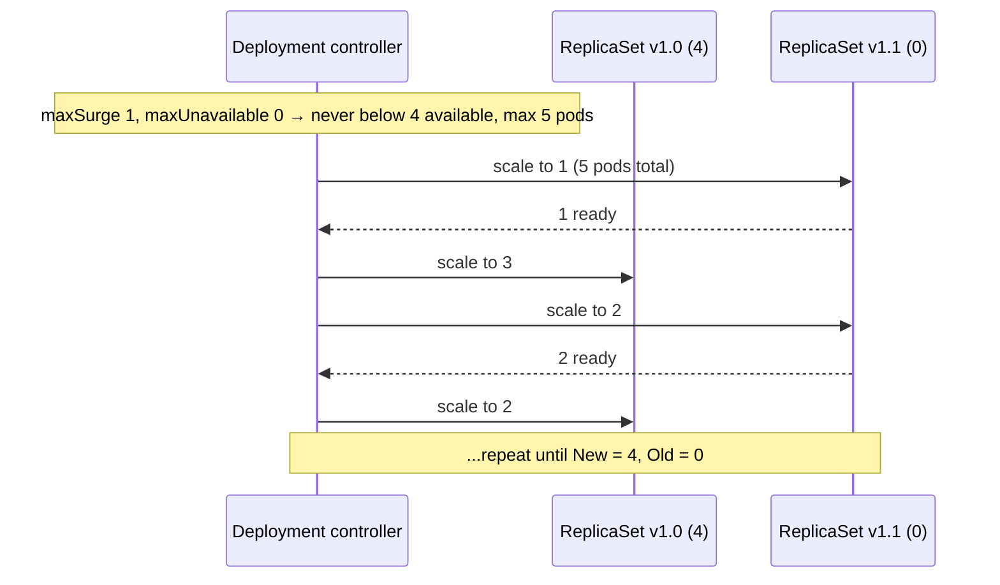
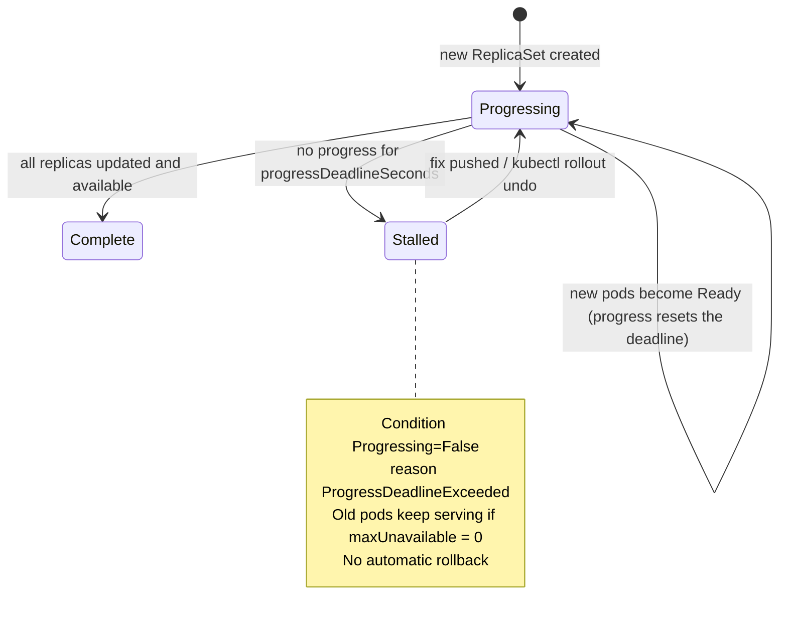
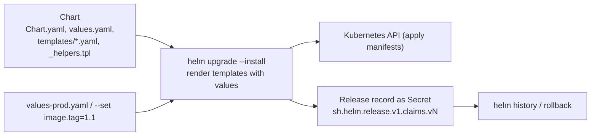

# Rolling Updates, Rollbacks & Helm

!!! abstract "Key takeaways"
    - A Deployment rollout creates a **new ReplicaSet** and shifts replicas from old to new, bounded by **`maxSurge`** (extra pods allowed) and **`maxUnavailable`** (pods allowed to be missing). With `maxSurge: 1, maxUnavailable: 0`, 4 replicas went `1.0=4/4` → `1.1=3/4, 1.0=1/1` → `1.1=4/4`. **Recreate** kills everything first, so there's downtime (`1.1=4/0` before `1.3` started).
    - A rollout that never becomes ready doesn't take the service down when `maxUnavailable: 0`: old pods stayed **4/4 available** while the new ReplicaSet had 0 ready, and after **`progressDeadlineSeconds`** the Deployment reported **`Progressing=False ProgressDeadlineExceeded`** and `rollout status` exited with an error. Kubernetes **doesn't roll back automatically**.
    - **`kubectl rollout undo`** re-applies an older ReplicaSet's template as a new revision (revision 2 became revision **4**) and completed in about **0.6 s** here. Keep `revisionHistoryLimit` > 0 and record change causes.
    - **Helm** packages manifests as a templated chart with values. Each install or upgrade is a **release revision** stored as a Secret (`sh.helm.release.v1.claims.v1…v5`). `helm upgrade --atomic` rolled a failed upgrade back automatically (revision 3 `failed` → revision 4 "Rollback to 2"), and `helm rollback claims 1` created revision 5.
    - For risky changes, use **progressive delivery** (canary with metric analysis via Argo Rollouts or Flagger, or blue-green), and keep deployments **backward compatible** (database migrations, API and message contracts), because old and new versions run side by side during every rollout.

## Why it matters

Deployments are where change meets production, so this is where outages happen: rollouts that drop requests, stuck releases that nobody notices, rollbacks that don't restore what people think, and Helm releases left in a `failed` or `pending-upgrade` state. Interviewers ask how rolling updates work, how to roll back, what Helm adds, and how to deploy safely: canary, blue-green, and backward-compatible database changes.

The behaviour below was observed on a Kubernetes v1.33.0 control plane run by kwok. Pausing kwok's simulated kubelets made new pods never become ready, which is a safe way to reproduce a broken release. Helm 3.19 installed and upgraded a chart against the same cluster.

## Core concepts

### Rolling update mechanics


*Notice that progress is gated on readiness: the controller only removes old pods once new ones are Ready. A readiness probe that lies (ready before warm-up) defeats the whole mechanism.*

| Setting | Meaning | Typical |
|---|---|---|
| `maxSurge` | Pods allowed above `replicas` during the rollout | 25% (default) or 1 |
| `maxUnavailable` | Pods allowed below `replicas` | 25% (default). **0** for zero-downtime with spare capacity |
| `minReadySeconds` | A new pod must stay Ready this long before it counts as available | 10–30 s to catch crash-after-start |
| `progressDeadlineSeconds` | Time without progress before `ProgressDeadlineExceeded` | 600 (default) |
| `revisionHistoryLimit` | Old ReplicaSets kept for rollback | 10 (default) |
| `strategy.type: Recreate` | Delete all old pods, then create new | Apps that can't run two versions at once (schema locks, RWO volumes) |

Measured (4 replicas, `maxSurge: 1`, `maxUnavailable: 0`), sampled every 250 ms:

```text
shop:1.0=4/4
shop:1.1=3/4  shop:1.0=1/1
shop:1.1=4/4  shop:1.0=0
```

With **Recreate**: `1.1=4/4` → `1.1=4/0` (all terminating) → `1.3=0/4` → `1.3=4/4`. There's a window with **no** ready pods.

### When a rollout gets stuck


*Notice that "stalled" is only a status condition. Kubernetes keeps the half-finished state and waits for a human or a pipeline to act.*

Measured with a release whose pods never became ready (`progressDeadlineSeconds: 30`):

| Observation | Value |
|---|---|
| Old ReplicaSet `shop:1.3` | 4 desired, **4 ready**: still serving |
| New ReplicaSet `shop:1.4-never-ready` | 1 desired (the surge), **0 ready** |
| Deployment availability | **4/4** |
| Conditions | `Available=True MinimumReplicasAvailable`, **`Progressing=False ProgressDeadlineExceeded`: ReplicaSet "shop-877878f5b" has timed out progressing** |
| `kubectl rollout status` | `error: deployment "shop" exceeded its progress deadline` (non-zero exit, so CI fails) |
| `kubectl rollout undo` | New ReplicaSet scaled to 0, back to `shop:1.3` with 4 replicas |

That's why `maxUnavailable: 0` plus readiness probes is the safety net, and `rollout status` with a timeout in CI turns a silent stall into a failed pipeline.

### How rollback actually works

`kubectl rollout undo` copies the pod template of an older ReplicaSet into the Deployment, which creates a **new revision** (the old revision number disappears from history). Measured history after deploying 1.0 (rev 1) → 1.1 (rev 2) → 1.2 (rev 3) and undoing:

```text
REVISION  CHANGE-CAUSE
1         initial 1.0
3         1.2 broken
4         bump to 1.1        ← rev 2's template re-applied as rev 4 (undo took ~0.6 s)
```

Rollback only restores the **pod template**. It doesn't revert ConfigMaps and Secrets the pods read, database migrations, other resources, or external state. That's a key reason teams use Helm (which versions the whole release), GitOps (revert the Git commit) or immutable versioned ConfigMaps.

### Progressive delivery

| Strategy | How | Tooling |
|---|---|---|
| **Rolling** | Replace pods gradually | Built-in Deployment |
| **Blue-green** | Run the full new version alongside, switch traffic at once (Service selector or LB), keep the old one for instant rollback | Argo Rollouts, two Deployments + Service switch |
| **Canary** | Send a small % of traffic to the new version, analyse metrics (error rate, latency), increase in steps, abort automatically on regression | Argo Rollouts, Flagger, service mesh or Gateway API weights |
| **Feature flags** | Deploy dark, enable per user or segment | LaunchDarkly, Unleash, Spring config |

Plain Deployments can't do weighted canaries (traffic follows pod counts). Argo Rollouts replaces the Deployment with a `Rollout` resource that integrates traffic routers (ALB, NGINX, Istio, Gateway API) and AnalysisTemplates (Prometheus or Datadog queries).

### Helm


*Notice that Helm keeps a full record of every revision (rendered manifests and values) in the cluster. That's what lets `helm rollback` restore all of a release's resources, not just a pod template.*

- **Chart:** `Chart.yaml` (name, version, appVersion, dependencies), `values.yaml` (defaults), `templates/` (Go templates + Sprig functions), `_helpers.tpl` (named templates for labels and names), optional `values.schema.json` for validation. `helm create` generated a Deployment, Service, ServiceAccount, Ingress, HTTPRoute, HPA and a test pod. `helm lint`: "1 chart(s) linted, 0 chart(s) failed".
- **Release:** an installed instance of a chart with values. Each install, upgrade or rollback is a numbered revision stored as a Secret (measured: `sh.helm.release.v1.claims.v1` … `v5`).
- **Upgrade safety:** `--wait` waits for resources to be ready. `--atomic` rolls back automatically on failure or timeout.

Measured release history:

| Rev | Action | Status |
|---|---|---|
| 1 | `helm install … image.tag=1.0 --wait` | superseded |
| 2 | `helm upgrade --reuse-values image.tag=1.1 --wait` | superseded |
| 3 | `helm upgrade … image.tag=1.2-bad --atomic --timeout 20s` (pods never ready) | **failed**: "UPGRADE FAILED: release claims failed, and has been rolled back due to atomic being set: context deadline exceeded" (returned after 23 s) |
| 4 | Automatic | deployed, "Rollback to 2". Image back to `claims-api:1.1` |
| 5 | `helm rollback claims 1 --wait` | deployed, "Rollback to 1". Image `claims-api:1.0` |

Helm 4 (released late 2025) renames some flags (for example `--atomic` becomes `--rollback-on-failure`) and moves to server-side apply, so check which version your pipelines use.

## In practice: code & configuration

### A safe Deployment rollout

```yaml
apiVersion: apps/v1
kind: Deployment
metadata:
  name: claims-api
  annotations:
    kubernetes.io/change-cause: "release 1.8.2 (git a1b2c3d)"
spec:
  replicas: 6
  revisionHistoryLimit: 5
  progressDeadlineSeconds: 300
  minReadySeconds: 15
  strategy:
    type: RollingUpdate
    rollingUpdate: { maxSurge: 25%, maxUnavailable: 0 }    # never reduce serving capacity
  template:
    spec:
      containers:
        - name: app
          image: registry.example.com/claims-api:1.8.2     # immutable tag or @sha256 digest
          readinessProbe: { httpGet: { path: /actuator/health/readiness, port: 8080 } }
          lifecycle: { preStop: { sleep: { seconds: 5 } } }
---
apiVersion: policy/v1
kind: PodDisruptionBudget                                    # protects against drains, not rollouts
metadata: { name: claims-api }
spec:
  minAvailable: 4
  selector: { matchLabels: { app.kubernetes.io/name: claims-api } }
```

```bash
# CI/CD step
helm upgrade --install claims ./charts/claims-api \
  -f values/prod.yaml --set image.tag="$GIT_SHA" \
  --atomic --timeout 10m --history-max 10
kubectl rollout status deployment/claims-claims-api --timeout=10m   # redundant with --wait, explicit in logs
```

### Helm template essentials

```yaml
# templates/deployment.yaml (excerpt)
apiVersion: apps/v1
kind: Deployment
metadata:
  name: {{ include "claims-api.fullname" . }}
  labels: {{- include "claims-api.labels" . | nindent 4 }}
spec:
  replicas: {{ .Values.replicaCount }}
  template:
    metadata:
      annotations:
        checksum/config: {{ include (print $.Template.BasePath "/configmap.yaml") . | sha256sum }}  # restart on config change
    spec:
      containers:
        - name: app
          image: "{{ .Values.image.repository }}:{{ .Values.image.tag | default .Chart.AppVersion }}"
          {{- with .Values.resources }}
          resources: {{- toYaml . | nindent 12 }}
          {{- end }}
```

=== "❌ Common mistake"

    ```bash
    # Mutable tag: "latest" never changes the pod template → no rollout; nodes may run mixed images
    kubectl set image deploy/claims-api app=claims-api:latest
    # Fire-and-forget upgrade: pipeline green while pods crash-loop
    helm upgrade claims ./chart
    # Breaking DB migration in the same release: old pods (still running mid-rollout) fail
    ```

=== "✅ Better"

    ```bash
    # Immutable tag (git SHA), wait + automatic rollback, bounded history
    helm upgrade --install claims ./chart --set image.tag=a1b2c3d --atomic --timeout 10m --history-max 10
    # Expand/contract migrations: add nullable column (release N), dual-write/read (N+1),
    # remove the old column only after no running version uses it (N+2)
    ```

### Backward-compatible database changes (expand and contract)

During any rolling update, old and new versions run at the same time, and a rollback runs the old version against the new schema. So schema changes must be compatible both ways:

1. **Expand:** add new columns or tables (nullable or defaulted). Don't rename or drop. Both versions work.
2. **Migrate:** deploy code that writes both and reads new-with-fallback. Backfill in batches.
3. **Contract:** once no running or rollback-target version needs the old structure, drop it in a later release.

Run migrations (Flyway/Liquibase) as a pre-upgrade Helm hook Job or a pipeline step, never concurrently from every pod without locking. The same applies to Kafka message schemas (compatible evolution) and API contracts.

## Real-world usage

- **GitOps (Argo CD, Flux):** Git holds Helm values or manifests, the controller syncs, and a rollback is a `git revert`. Argo CD renders Helm charts itself, so `helm history` isn't used there.
- **Argo Rollouts / Flagger:** canary steps (5% → 25% → 50% → 100%) with automated analysis against Prometheus metrics, and an automatic abort on SLO breach.
- **AWS:** EKS teams often combine Helm with the AWS Load Balancer Controller for weighted target groups (canary), or CodeDeploy blue-green for ECS.
- **Helm charts for third-party software** (ingress controllers, cert-manager, Prometheus) are the standard distribution format, pinned by chart version.
- **Helmfile or umbrella charts** coordinate many releases per environment.

## Trade-offs & production gotchas

!!! warning "Deployment pitfalls"
    - **No automatic rollback:** a stalled rollout just sits there (`ProgressDeadlineExceeded`). CI must gate on `rollout status` or `--atomic`.
    - **`maxUnavailable` > 0 without spare capacity** reduces serving pods during every deploy.
    - **Readiness that's true too early:** traffic hits cold or broken pods, and the rollout "succeeds" while errors spike. Use `minReadySeconds` and a real readiness check.
    - **`kubectl rollout undo` restores only the pod template:** ConfigMaps, Secrets, CRDs and DB state aren't reverted.
    - **Mutable tags (`latest`):** no rollout is triggered, mixed versions run, and rollback is impossible. Use immutable tags or digests.
    - **Helm release stuck in `pending-upgrade`** after a killed pipeline: the next upgrade fails. Run `helm rollback` to the last good revision (or `helm history` to inspect it).
    - **Manual `kubectl edit` on Helm-managed resources:** drift that the next upgrade overwrites, or a three-way merge surprise.
    - **Breaking migrations:** old pods mid-rollout and rollback targets break. Use expand and contract.
    - **CRDs in Helm charts:** Helm installs CRDs from `crds/` but doesn't upgrade or delete them. Manage CRDs separately.

- **Rolling vs blue-green vs canary:** rolling is cheap and simple, blue-green needs double capacity but switches and rolls back instantly, canary limits the blast radius but needs traffic control and metrics.
- **Helm vs Kustomize:** Helm templating and packaging with release history, versus Kustomize's template-free overlays built into kubectl. Many teams render Helm and patch with Kustomize, or use either through GitOps.

## How this connects to my experience

- **Where I used it:** not ★. "Automated deployments through GitLab CI/CD pipelines" (Coriolis), "automated infrastructure provisioning and deployment processes using Terraform" (Deloitte), and at Publicis Sapient "established engineering standards around testing, CI/CD, code quality, and deployment practices" and owned "release management". *[confirm: Helm vs raw manifests vs Kustomize/Argo CD, rollout settings, whether canary or blue-green was used, how DB migrations were sequenced with releases]*
- **Talking points:**
    - "Zero-downtime rollouts: `maxUnavailable: 0`, honest readiness, preStop and graceful shutdown, and the pipeline gating on rollout status or Helm `--atomic`."
    - "Rollback isn't only the pod template: config is versioned with the release, and schema changes follow expand and contract so the previous version always still works."
    - "As release manager, I'd push for immutable image tags, change causes in history, and canaries for risky changes."
- **Likely follow-up chain:** "How does a rolling update work?" → "maxSurge vs maxUnavailable?" → "What if the new version never becomes ready?" → "How do you roll back, and what doesn't it revert?" → "What does Helm add?" → "How do you handle DB migrations during rollouts?" → "Canary vs blue-green?"

## Interview questions

### Fundamentals

??? question "Q1. How does a Kubernetes rolling update work?"
    **Answer:** Changing a Deployment's pod template creates a new ReplicaSet. The Deployment controller then scales the new ReplicaSet up and the old one down in steps, bounded by `maxSurge` (how many extra pods may exist) and `maxUnavailable` (how many may be missing), and only counts new pods once they're Ready (and stay Ready for `minReadySeconds`). Measured with 4 replicas, surge 1, unavailable 0: `1.0=4/4` → `1.1=3/4 + 1.0=1/1` → `1.1=4/4`. Old ReplicaSets are kept at 0 for rollback.

    **Interviewer listens for:** a new ReplicaSet, the two bounds, readiness gating, and retained history.

    **Common wrong answer:** "Kubernetes updates each pod's image in place one by one."

??? question "Q2. What's the difference between the RollingUpdate and Recreate strategies?"
    **Answer:** RollingUpdate replaces pods gradually, so old and new versions run side by side and capacity stays within the configured bounds. Recreate deletes all old pods first, then creates new ones, so there's downtime (measured: a window with `1.1=4/0` and nothing ready before `1.3` came up), but two versions never run at the same time. Use Recreate when versions can't coexist: incompatible schema locks, singleton consumers, or RWO volumes that can't be attached by two pods.

    **Interviewer listens for:** coexistence vs downtime, and when Recreate is justified.

    **Common wrong answer:** "Recreate is faster, so use it in production."

??? question "Q3. How do you roll back a Deployment?"
    **Answer:** `kubectl rollout undo deployment/x` (or `--to-revision=N`), which re-applies an older ReplicaSet's pod template as a new revision (measured: revision 2 reappeared as revision 4, done in about 0.6 s). Check with `kubectl rollout history`, ideally with `kubernetes.io/change-cause` annotations. It only reverts the pod template: ConfigMaps and Secrets the pods read, database changes and other resources stay as they are. With Helm, use `helm rollback`, and with GitOps, revert the commit.

    **Interviewer listens for:** the mechanism, new revision numbering, and what isn't reverted.

    **Common wrong answer:** "Kubernetes automatically rolls back failed deployments."

??? question "Q4. What is Helm, and what problems does it solve?"
    **Answer:** A package manager for Kubernetes. A chart bundles templated manifests with default values, versioning and dependencies. `helm upgrade --install` renders the templates with environment-specific values and applies them, recording each revision as a release Secret (measured: `sh.helm.release.v1.claims.v1…v5`). It gives reuse across environments, one-command install and upgrade, release history, rollback of the entire release, hooks (pre-upgrade migration Jobs) and a standard distribution format for third-party software.

    **Interviewer listens for:** templating plus values, releases and revisions, rollback, hooks, and distribution.

    **Common wrong answer:** "Helm is a container registry."

### Intermediate

??? question "Q5. Explain maxSurge and maxUnavailable. What settings give zero downtime?"
    **Answer:** `maxSurge` is how many pods above the desired count may exist during the rollout, and `maxUnavailable` is how many below the desired count may be unavailable. Both accept numbers or percentages (25% defaults). For zero downtime with spare cluster capacity, use `maxUnavailable: 0` and `maxSurge: 1` (or 25%): capacity never drops, and new pods must become Ready before old ones go. If capacity is tight, `maxSurge: 0, maxUnavailable: 1` avoids needing extra nodes, at the cost of temporarily reduced capacity. Readiness probes, graceful shutdown and preStop are also needed for true zero downtime.

    **Interviewer listens for:** the definitions, the zero-downtime combination, the capacity trade-off, and the other ingredients.

    **Common wrong answer:** "Set both to 100% for the fastest rollout."

??? question "Q6. What happens if a new version never becomes ready during a rollout?"
    **Answer:** With `maxUnavailable: 0`, old pods keep serving and the new ReplicaSet stays at the surge count with 0 ready (measured: old 4/4, new 0/1, availability 4/4). After `progressDeadlineSeconds` with no progress, the Deployment gets `Progressing=False, reason ProgressDeadlineExceeded`, and `kubectl rollout status` exits non-zero ("exceeded its progress deadline"). Kubernetes doesn't roll back by itself, so your pipeline (rollout status, Helm `--atomic`) or an operator must undo it, as `rollout undo` did here.

    **Interviewer listens for:** the safe state with unavailable 0, the condition, the lack of auto-rollback, and pipeline gating.

    **Common wrong answer:** "Kubernetes rolls back after the deadline."

??? question "Q7. What does helm upgrade --atomic do?"
    **Answer:** It implies `--wait` (wait until resources are ready) and, if the upgrade fails or times out, automatically rolls back to the previous successful revision. Measured: an upgrade whose pods never became ready failed after the 20 s timeout with "has been rolled back due to atomic being set", revision 3 was marked `failed`, and revision 4 "Rollback to 2" restored image 1.1. It makes CI deploys self-healing, but you still need alerts, and the timeout must exceed realistic rollout time. In Helm 4 the equivalent flag is `--rollback-on-failure`.

    **Interviewer listens for:** wait + rollback semantics, revision bookkeeping, and timeout tuning.

    **Common wrong answer:** "It makes the upgrade a database-style transaction."

??? question "Q8. How do you run database migrations safely with rolling deployments?"
    **Answer:** Treat every release as running alongside the previous version, and be able to roll back to it. Use expand and contract: additive changes first (new nullable columns or tables), code that handles both shapes, a backfill, and destructive changes (drop or rename) only in a later release once no running version depends on the old shape. Execute migrations once per release, as a Helm pre-upgrade hook Job, a pipeline step, or Flyway/Liquibase with a lock, not concurrently in every pod. Test rollback of the code against the new schema.

    **Interviewer listens for:** coexistence awareness, expand/contract, single execution, and rollback testing.

    **Common wrong answer:** "Run the migration in an init container of each pod and drop old columns right away."

??? question "Q9. Canary vs blue-green: when would you use each?"
    **Answer:** Blue-green: deploy the full new version beside the old one, test it, switch all traffic at once (Service selector, LB target group), and keep the old version for instant rollback. It costs double capacity briefly, and all users switch at once. Canary: route a small share of traffic (1–5%) to the new version, analyse error rate and latency, and step up or abort automatically. Smaller blast radius, but it needs weighted routing (mesh, Gateway API, ALB weights) and good metrics, plus Argo Rollouts or Flagger. Plain Deployments only approximate canaries by pod ratio.

    **Interviewer listens for:** the mechanics, cost, blast radius and tooling.

    **Common wrong answer:** "They're the same as rolling updates."

### Senior

??? question "Q10. Design a deployment pipeline for 30 microservices on EKS with safe releases."
    **Answer:** Build once: an immutable image tagged with the git SHA, scanned and signed, promoted by digest across environments. Config as code: Helm charts (a shared base chart, per-service values) or Kustomize, stored in Git, with GitOps (Argo CD) syncing each environment. Release safety: readiness, startup and liveness probes, `maxUnavailable: 0`, PDBs, graceful shutdown, Argo Rollouts canaries with Prometheus analysis for critical services, automated abort and rollback, and `helm --atomic` or sync health checks elsewhere. Data safety: expand and contract migrations as pre-sync Jobs, backward-compatible APIs and Kafka schemas (a schema registry with compatibility rules). Observability: deployment markers on dashboards and SLO-based alerts. Fast rollback means a Git revert or Rollouts abort, practised regularly.

    **Interviewer listens for:** build-once/promote, GitOps, progressive delivery, compatibility discipline, and rollback practice.

    **Common wrong answer:** "kubectl apply from Jenkins with latest tags."

??? question "Q11. A Helm upgrade failed in CI, and now every subsequent upgrade fails with 'another operation is in progress'. Fix it."
    **Answer:** The pipeline was killed mid-upgrade, leaving the release in `pending-upgrade` (or `pending-install`), and Helm refuses concurrent operations. Inspect with `helm history <release>` and `helm status`. Roll back to the last `deployed` revision (`helm rollback <release> <rev>`), which clears the pending state, or for a failed first install, `helm uninstall`. As a last resort, delete or relabel the stuck `sh.helm.release.v1.<name>.vN` Secret, carefully. Prevent it with `--atomic`/`--timeout` sized properly, no parallel pipelines per release (pipeline locks), and `--history-max`.

    **Interviewer listens for:** release state stored in Secrets, the diagnosis commands, the rollback fix, and prevention.

    **Common wrong answer:** "Delete the namespace and reinstall."

??? question "Q12. Why can a rollback make things worse, and how do you design for safe rollbacks?"
    **Answer:** Because rollback only reverts code or manifests, not state. A release that ran a destructive migration, changed message formats or wrote data in a new shape leaves the old version unable to read it. Rolling back a ConfigMap-dependent change with `kubectl rollout undo` keeps the new config. Rolling back clients without the matching server versions breaks contracts. Design: expand and contract migrations, backward- and forward-compatible message and API schemas, versioned immutable config shipped with the release (Helm or GitOps), feature flags to disable features without a rollback, and rehearsing rollbacks in staging.

    **Interviewer listens for:** state vs code, contract compatibility, config versioning, and feature flags.

    **Common wrong answer:** "Rollbacks are always safe because Kubernetes keeps old ReplicaSets."

### Scenario-based

??? question "Q13. After every deploy, errors spike for about 30 seconds although the rollout reports success. What do you check?"
    **Answer:** The rollout is "successful" because readiness passed, so check whether readiness reflects reality: it may return UP before caches, connection pools and the JIT are warm, or before downstream connections are established. Add `minReadySeconds`, a proper readiness group, or warm-up logic. Check old-pod termination: a missing preStop sleep, the JVM not receiving SIGTERM, or a short grace period means in-flight requests are dropped. Check LB deregistration delays (ALB target groups) and `maxUnavailable` reducing capacity under load. Also check compatibility issues while versions coexist (a new API used by old clients or vice versa). Correlate errors with pod start and termination events.

    **Interviewer listens for:** readiness accuracy, termination handling, LB timing, capacity, and version-skew compatibility.

    **Common wrong answer:** "Increase replicas."

??? question "Q14. You pushed a release with a typo in the image tag. What happens, and how do you recover?"
    **Answer:** The new ReplicaSet's pods go to `ErrImagePull`/`ImagePullBackOff` and never become Ready. With `maxUnavailable: 0`, the old pods keep serving, the rollout stalls, and after `progressDeadlineSeconds` it reports `ProgressDeadlineExceeded` (the same pattern measured with never-ready pods), so `rollout status` or Helm `--atomic` fails the pipeline, with `--atomic` rolling back automatically. Recover with `kubectl rollout undo`, `helm rollback` or a Git revert, then fix the tag. If `maxUnavailable` was above 0, capacity was reduced during the stall, so that's another reason for 0. Prevent it by having CI deploy only images it just built and pushed (by digest).

    **Interviewer listens for:** the failure mode, the protection from settings, detection, and prevention by digest.

    **Common wrong answer:** "The service goes down until the tag is fixed."

## Cheat sheet

| Topic | Remember |
|---|---|
| Rolling update | New RS per template change; readiness-gated; `1.0=4/4 → 1.1=3/4+1.0=1/1 → 1.1=4/4` |
| maxSurge / maxUnavailable | Default 25% / 25%; zero downtime: surge ≥ 1, unavailable 0 |
| Recreate | Downtime window (4/0), no version coexistence |
| minReadySeconds | Catch crash-after-start |
| Stalled rollout | `Progressing=False ProgressDeadlineExceeded`; old pods keep serving; **no auto-rollback** |
| Undo | Old template → new revision (2 → 4, ~0.6 s); pod template only |
| History | `revisionHistoryLimit`, `change-cause` annotation |
| Helm | Chart + values → release revisions (Secrets v1..vN) |
| `--atomic` | Wait + auto rollback on failure (rev 3 failed → rev 4 "Rollback to 2"); Helm 4: `--rollback-on-failure` |
| Stuck release | `pending-upgrade` → `helm rollback` |
| Migrations | Expand → migrate → contract; run once (hook Job) |
| Progressive | Canary (Argo Rollouts/Flagger + metrics), blue-green, feature flags |
| Tags | Immutable (git SHA / digest), never `latest` |

## Sources
1. [Kubernetes docs: Deployments (rolling update, rollback, progress deadline)](https://kubernetes.io/docs/concepts/workloads/controllers/deployment/).
2. [Kubernetes docs: kubectl rollout](https://kubernetes.io/docs/reference/kubectl/generated/kubectl_rollout/) and [Pod disruption budgets](https://kubernetes.io/docs/concepts/workloads/pods/disruptions/).
3. [Helm docs: Using Helm](https://helm.sh/docs/intro/using_helm/), [Chart template guide](https://helm.sh/docs/chart_template_guide/) and [Chart hooks](https://helm.sh/docs/topics/charts_hooks/).
4. [Helm docs: helm upgrade (--atomic, --wait)](https://helm.sh/docs/helm/helm_upgrade/) and [Helm 4 overview](https://helm.sh/docs/overview/).
5. [Argo Rollouts](https://argoproj.github.io/argo-rollouts/) and [Flagger](https://docs.flagger.app/).
6. Martin Fowler, [BlueGreenDeployment](https://martinfowler.com/bliki/BlueGreenDeployment.html) and [CanaryRelease](https://martinfowler.com/bliki/CanaryRelease.html); Pramod Sadalage, [Evolutionary Database Design](https://martinfowler.com/articles/evodb.html) (expand/contract).
7. [Argo CD: Helm support](https://argo-cd.readthedocs.io/en/stable/user-guide/helm/).
8. Demonstrations on this page: Kubernetes v1.33.0 control plane via kwokctl and Helm 3.19, run while writing this page (rolling and Recreate sequences, stalled rollout with ProgressDeadlineExceeded, undo revisions, Helm install/upgrade/atomic rollback/history/release Secrets).
