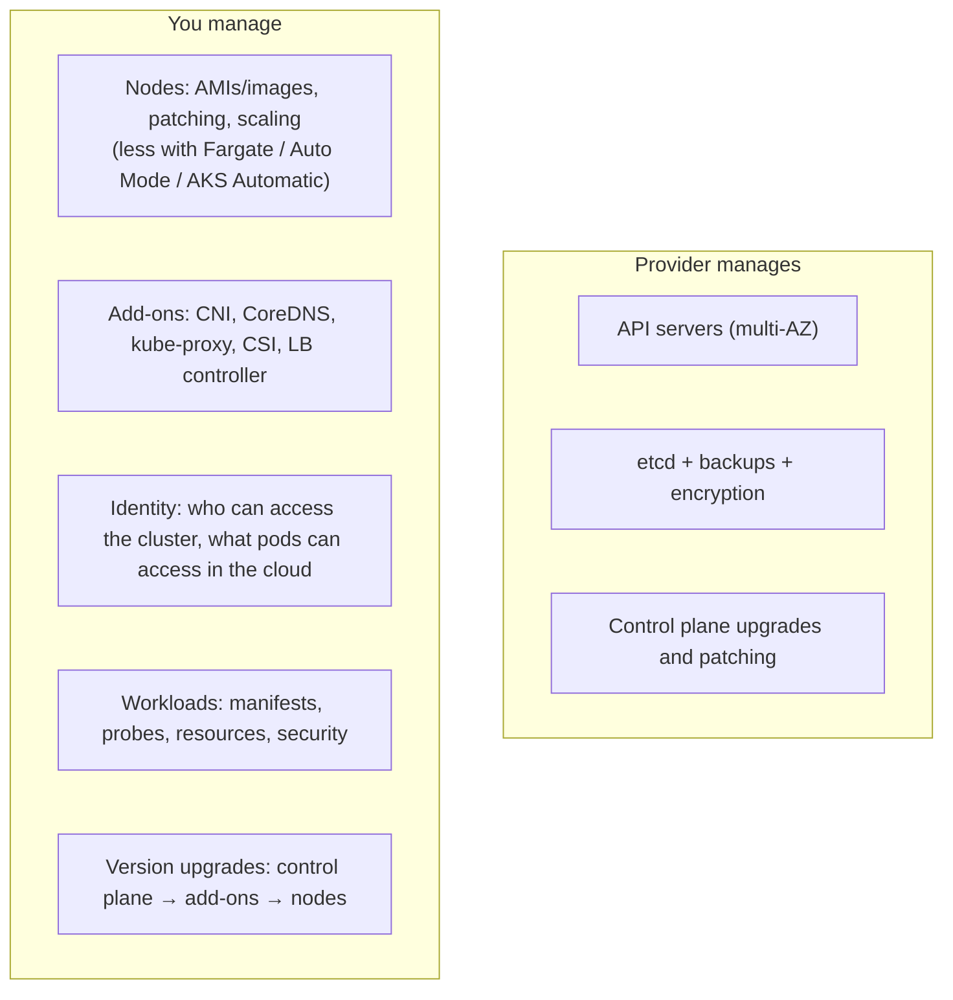
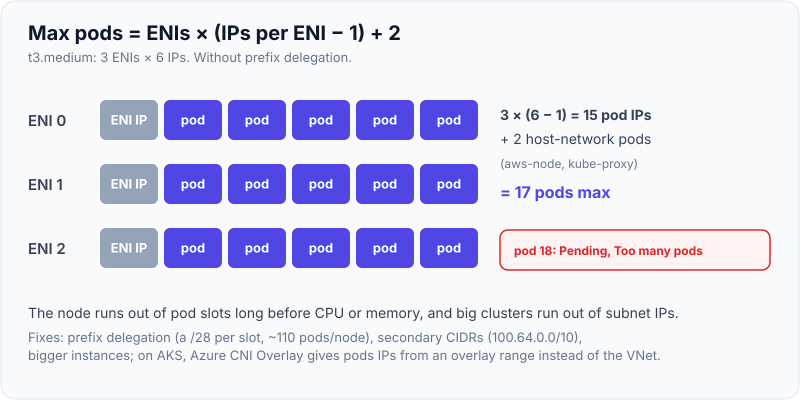
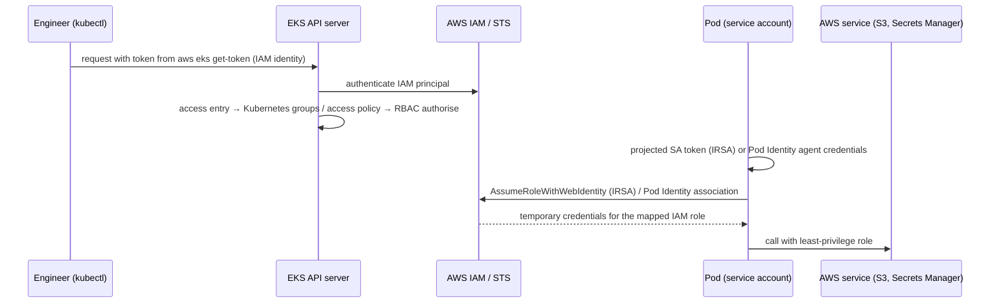
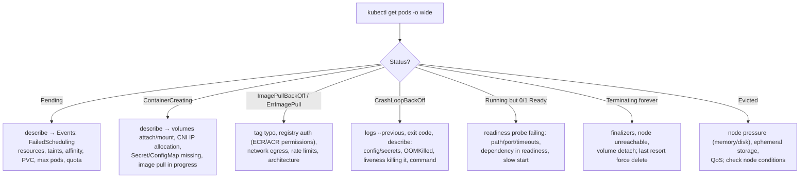

# EKS/AKS Specifics & Troubleshooting Pods

!!! abstract "Key takeaways"
    - **EKS and AKS run the control plane for you** (API servers and etcd across zones). You own **nodes, networking add-ons, identity, upgrades and workloads**. Both follow upstream Kubernetes, so the differences are in integrations: CNI, load balancers, IAM, storage and node provisioning.
    - **EKS:** the VPC CNI gives pods real VPC IPs, so **max pods per node is limited by ENIs × IPs** (m5.large = 29, t3.medium = 17) unless you use prefix delegation. The AWS Load Balancer Controller handles ALB/NLB, **access entries** handle cluster auth (replacing `aws-auth`), **IRSA/EKS Pod Identity** handle pod-to-AWS auth, and you choose **managed node groups, Fargate, Karpenter or EKS Auto Mode**.
    - **AKS:** Azure CNI (Overlay) or kubenet, **Entra ID** with Kubernetes RBAC or Azure RBAC for cluster auth, **Workload Identity** for pods, node pools (system and user) with the cluster autoscaler or Node Auto Provisioning, and Application Gateway for Containers or the app routing add-on for ingress.
    - **Troubleshoot top-down:** `kubectl get` (status) → `describe` (events) → `logs --previous` → exit codes → `debug`. The scheduler explains Pending exactly ("3 node(s) didn't match Pod's node affinity/selector", "persistentvolumeclaim … not found", "3 Insufficient nvidia.com/gpu").
    - **Exit codes tell the story:** 1 = app error (bad config), 127 = command not found, 137 = SIGKILL (OOM, or a PID 1 that ignored SIGTERM, measured), 143 = graceful SIGTERM. **`kubectl debug`** adds an ephemeral container to a running (even distroless) pod, or a privileged pod on a node.

## Why it matters

"I deployed microservices on EKS" invites a deep follow-up chain: how nodes were provisioned, how pods got AWS permissions, why pods were stuck Pending, how you'd debug a CrashLoopBackOff at 3 am, how upgrades worked. Troubleshooting questions are the most practical part of a Kubernetes interview, and being systematic matters more than memorising commands. This page is ★ because EKS/AKS are on my resume.

The scheduler messages, debug containers and objects shown were reproduced on a Kubernetes v1.33.0 control plane (kwok, simulated nodes). Exit codes were reproduced with Docker 29. EKS/AKS-specific facts come from AWS and Microsoft documentation, because no cloud account was used.

## Core concepts

### Shared responsibility on managed Kubernetes


*Notice that "managed" mostly covers the control plane. Node and add-on hygiene, identity and upgrade sequencing are still your job, which is where most real incidents come from.*

### EKS vs AKS at a glance

| Area | Amazon EKS | Azure AKS |
|---|---|---|
| Control plane | Paid per cluster per hour, multi-AZ. Standard support ~14 months per version, then paid extended support | Free tier, or Standard tier with uptime SLA. N-2 supported minors, optional LTS |
| Nodes | Managed node groups (ASG), self-managed, **Fargate** (serverless pods), **Karpenter**, **EKS Auto Mode** (AWS-managed Karpenter-based compute) | **Node pools** (VM Scale Sets), separate **system** and **user** pools, Virtual Nodes (ACI), **Node Auto Provisioning** (Karpenter-based), **AKS Automatic** |
| Pod networking | **VPC CNI**: pods get VPC IPs from ENIs. Prefix delegation, custom networking, security groups for pods | **Azure CNI Overlay** (common default), Azure CNI with VNet IPs, kubenet (legacy), Azure CNI powered by Cilium |
| Ingress / LB | **AWS Load Balancer Controller**: Ingress → ALB, Service → NLB, IP targets | Azure LB for Services. **Application Gateway for Containers**, AGIC, or the app routing add-on (managed NGINX) |
| Cluster auth | IAM principals → **access entries** + access policies (aws-auth ConfigMap is legacy). `aws eks update-kubeconfig` | **Microsoft Entra ID** + Kubernetes RBAC or **Azure RBAC for Kubernetes**. `az aks get-credentials` + kubelogin |
| Pod → cloud auth | **IRSA** (OIDC + STS) or **EKS Pod Identity** | **Microsoft Entra Workload ID** (federated credentials) |
| Storage | EBS CSI (RWO, zonal), EFS CSI (RWX), FSx | Azure Disk CSI (LRS/ZRS), Azure Files CSI (RWX), Azure NetApp Files |
| Secrets | Secrets Store CSI + AWS provider, KMS envelope encryption | Key Vault Secrets Provider add-on, KMS with Key Vault |
| Observability | CloudWatch Container Insights, Amazon Managed Prometheus/Grafana | Azure Monitor Container Insights, Managed Prometheus/Grafana |
| Policy | Pod Security Admission, Kyverno/Gatekeeper | Azure Policy for AKS (Gatekeeper-based), PSA |

### EKS networking: the VPC CNI IP budget

With the VPC CNI each pod consumes a VPC IP, attached to the node through ENIs. Without prefix delegation:

`max pods = ENIs × (IPv4 addresses per ENI − 1) + 2`

| Instance | ENIs | IPs per ENI | Max pods |
|---|---|---|---|
| t3.medium | 3 | 6 | 3 × 5 + 2 = **17** |
| m5.large | 3 | 10 | 3 × 9 + 2 = **29** |
| m5.xlarge | 4 | 15 | 4 × 14 + 2 = **58** |

Consequences: small instances run out of pod slots before CPU or memory (pods Pending with "Too many pods"), and subnets run out of IPs in big clusters. Fixes: **prefix delegation** (a /28 prefix per ENI slot, typically capped at 110 pods per node), larger subnets or secondary CIDRs with custom networking (100.64.0.0/10), and bigger instances. On AKS, traditional Azure CNI also consumes VNet IPs per pod (default max pods 30, configurable), while **Azure CNI Overlay** gives pods IPs from a private overlay CIDR, avoiding VNet exhaustion.

{ loading=lazy }
*Notice the grey cells: one address per ENI is never available to pods, which is where the "minus 1" in the formula comes from.*

### Identity: humans vs pods


*Notice the two separate flows: humans authenticate to the Kubernetes API with IAM (then RBAC applies), while pods authenticate to AWS with their service account mapped to an IAM role. Neither should involve long-lived access keys.*

AKS has the same shape: Entra ID users and groups → Kubernetes RBAC (or Azure RBAC) for humans, and service accounts federated with Entra workload identities for pods calling Key Vault, Storage or SQL.

### Upgrades

Order: **control plane** (one minor version at a time) → **add-ons** (VPC CNI, CoreDNS, kube-proxy, CSI drivers, LB controller, compatible versions) → **nodes** (managed node group rolling update, new Karpenter AMIs/drift, or AKS node image and version upgrades with surge). Before upgrading, check deprecated APIs (`kubectl convert`, Pluto, EKS upgrade insights), PodDisruptionBudgets (too-strict PDBs block drains), and test in staging. Kubelets may lag the control plane by up to three minors, but never lead it.

### A systematic troubleshooting method


*Notice that every branch starts from the pod's status and its events. `kubectl describe` answers most "why" questions before you need logs or a shell.*

{ loading=lazy }
*Watch the gaps double: after a few crashes the pod spends almost all its time waiting, so the evidence lives in `logs --previous`, not in the current container.*

**Reproduced scheduler messages** (pods stuck `Pending`):

| Cause | Message from `kubectl describe` / events |
|---|---|
| nodeSelector for a zone with no nodes | "0/4 nodes are available: 1 node(s) had untolerated taint {dedicated: gpu}, 3 node(s) didn't match Pod's node affinity/selector." |
| PVC doesn't exist | "0/4 nodes are available: persistentvolumeclaim "does-not-exist" not found." |
| GPU requested, none available | "… 3 Insufficient nvidia.com/gpu. preemption: … No preemption victims found" |
| CPU request too large | "… 3 Insufficient cpu." ([resources page](06-probes-resource-requests-limits-autoscaling.md)) |
| Quota exceeded (on the ReplicaSet, pod never created) | "exceeded quota: quota, requested: limits.memory=512Mi …" |

**Reproduced exit codes:**

| Scenario | Exit code | Meaning |
|---|---|---|
| App exits on missing config (`sys.exit(1)`) | **1** | Application error. Read the logs |
| Entrypoint binary not found | **127** | Command not found (wrong `command`/image) |
| Memory limit exceeded | **137** + `OOMKilled` | Kernel OOM kill |
| PID 1 without a SIGTERM handler, after `stop -t 2` | **137** | PID 1 ignores SIGTERM by default, so it was SIGKILLed after the grace period |
| JVM with exec-form entrypoint receiving SIGTERM | **143** | Graceful shutdown ([containers page](01-containers-vs-vms-docker-images-layers-multi-stage-builds.md)) |
| Image tag doesn't exist | Pull error: "not found" → `ErrImagePull` → `ImagePullBackOff` | |

**Debug containers, reproduced:** `kubectl debug pod/dbg-… --image=busybox:1.36 --target=distroless-app -c debugger` added an **ephemeral container** (`debugger`, image `busybox:1.36`, target `distroless-app`) to a running pod, sharing its process namespace, so you get a shell next to a distroless app without restarting it. `kubectl debug node/node-000000 --image=busybox` created a `node-debugger-node-000000-…` pod with **hostPID and hostNetwork** on that node, the managed-cluster replacement for SSH (the node's filesystem is at `/host`).

## In practice: code & configuration

### The troubleshooting toolkit

```bash
# 1. What state is it in, and where?
kubectl get pods -n claims -o wide
kubectl get events -n claims --sort-by=.lastTimestamp | tail -20

# 2. Why? (events, last state, exit code, probe failures, mounts)
kubectl describe pod claims-api-7d9f-abcde -n claims
kubectl get pod claims-api-7d9f-abcde -n claims -o jsonpath='{.status.containerStatuses[0].lastState}'

# 3. What did the app say before it died?
kubectl logs claims-api-7d9f-abcde -n claims --previous
kubectl logs deploy/claims-api -n claims --all-containers --since=10m

# 4. Get inside (works for distroless) / inspect the node
kubectl debug -it pod/claims-api-7d9f-abcde -n claims --image=busybox:1.36 --target=app
kubectl debug node/ip-10-0-12-34.eu-west-1.compute.internal -it --image=busybox:1.36
kubectl exec -it deploy/claims-api -n claims -- sh       # if the image has a shell

# 5. Connectivity
kubectl get endpointslices -n claims -l kubernetes.io/service-name=claims-api
kubectl run -it --rm netshoot --image=nicolaka/netshoot -n claims -- bash

# 6. Resources and nodes
kubectl top pods -n claims ; kubectl top nodes             # needs metrics-server
kubectl describe node <node> | sed -n '/Conditions/,/Events/p'
kubectl auth can-i list secrets --as=system:serviceaccount:claims:claims-api -n claims
```

### EKS-specific checks

```bash
aws eks update-kubeconfig --name prod --region eu-west-1          # kubeconfig with exec auth (aws eks get-token)
aws eks list-access-entries --cluster-name prod                    # who can access the cluster
aws eks describe-addon --cluster-name prod --addon-name vpc-cni    # add-on versions vs cluster version
kubectl -n kube-system logs ds/aws-node -c aws-node | tail          # IP allocation errors ("failed to assign an IP address")
kubectl -n kube-system logs deploy/aws-load-balancer-controller     # ALB/NLB reconciliation errors (IAM, subnet tags)
kubectl get sa claims-api -n claims -o yaml | grep role-arn          # IRSA annotation present?
```

### AKS-specific checks

```bash
az aks get-credentials -g rg-prod -n aks-prod && kubelogin convert-kubeconfig -l azurecli
az aks show -g rg-prod -n aks-prod --query "{version:kubernetesVersion, network:networkProfile.networkPlugin, mode:networkProfile.networkPluginMode}"
az aks nodepool list -g rg-prod --cluster-name aks-prod -o table   # system vs user pools, versions, max pods
kubectl get sa claims-api -n claims -o yaml | grep azure.workload.identity   # client-id annotation + pod label
az aks check-acr -g rg-prod -n aks-prod --acr myacr.azurecr.io      # can nodes pull from ACR?
```

### Pod identity setup, side by side

=== "EKS (IRSA)"

    ```yaml
    apiVersion: v1
    kind: ServiceAccount
    metadata:
      name: claims-api
      namespace: claims
      annotations:
        eks.amazonaws.com/role-arn: arn:aws:iam::123456789012:role/claims-api-prod
    # IAM role trust policy: Federated = cluster OIDC provider,
    # condition sub = system:serviceaccount:claims:claims-api
    ```

=== "AKS (Workload Identity)"

    ```yaml
    apiVersion: v1
    kind: ServiceAccount
    metadata:
      name: claims-api
      namespace: claims
      annotations:
        azure.workload.identity/client-id: 00000000-0000-0000-0000-000000000000
    ---
    # Pod template label: azure.workload.identity/use: "true"
    # Federated credential on the managed identity: issuer = cluster OIDC URL,
    # subject = system:serviceaccount:claims:claims-api
    ```

=== "❌ Common mistake"

    ```yaml
    env:
      - { name: AWS_ACCESS_KEY_ID,     valueFrom: { secretKeyRef: { name: aws, key: id } } }
      - { name: AWS_SECRET_ACCESS_KEY, valueFrom: { secretKeyRef: { name: aws, key: secret } } }
    # Long-lived keys in a Secret: leak risk, no rotation, shared across pods
    ```

## Real-world usage

- **Node strategy on EKS:** a small managed node group for system add-ons, plus **Karpenter** NodePools for workloads (mixed instance types, spot for stateless, consolidation), or **EKS Auto Mode** to hand node management to AWS. Fargate for low-ops or isolation-sensitive workloads (no DaemonSets, one pod per micro-VM).
- **AKS:** a system node pool (critical add-ons, tainted `CriticalAddonsOnly`) plus user pools per workload class (general, memory-optimised, GPU, spot), zone-redundant across three zones.
- **Ingress:** AWS LB Controller with one shared ALB (IngressGroup), ACM certificates and WAF. On AKS, Application Gateway for Containers or the managed NGINX app routing add-on, with Key Vault certificates.
- **GitOps add-on management:** EKS Blueprints, Terraform `aws_eks_addon`, AKS extensions, or Argo CD app-of-apps for platform components.
- **Upgrade cadence:** many organisations upgrade quarterly to stay within standard support, using blue-green clusters for risky jumps.

## Trade-offs & production gotchas

!!! warning "Managed Kubernetes gotchas"
    - **VPC CNI IP exhaustion:** "Too many pods" on small nodes, or no IPs left in subnets. Use prefix delegation and plan CIDRs.
    - **Missing subnet tags or IAM for the LB controller:** Ingress or Service stuck without an address.
    - **IRSA misconfiguration:** a wrong namespace or SA in the trust policy, a missing annotation, or a pod created before the annotation (restart needed). Symptoms: the SDK falls back to the node role or gets AccessDenied.
    - **aws-auth / access entry mistakes** lock teams out of the cluster. Keep a break-glass admin and manage access as code.
    - **Upgrades blocked by PDBs** (`minAvailable` = replicas), deprecated APIs, or add-ons left on old versions.
    - **System pods on spot or tainted pools** (AKS system pool sizing, CoreDNS on spot), so DNS dies with spot reclaims.
    - **Fargate limits:** no DaemonSets, no privileged pods, slower start. Logging needs the Fluent Bit config map.
    - **Image pull failures from private registries:** node role missing ECR read, AKS not attached to ACR (`az aks update --attach-acr`), Docker Hub rate limits.

- **Fargate/Auto Mode/AKS Automatic vs self-managed nodes:** less ops, but less control (no SSH, fewer node customisations, sometimes higher cost).
- **Karpenter vs Cluster Autoscaler:** Karpenter is faster and picks instance types per workload, CA is simpler with fixed node groups.

## How this connects to my experience

- **Resume bullets:** Deloitte (ConvergeHealth Data Asset Explorer): "Built cloud-native microservices on AWS using Lambda, EC2, ECS, **EKS**, API Gateway, RDS, DynamoDB, SQS, SNS, and S3", "Automated infrastructure provisioning and deployment processes using **Terraform**", and "implemented security controls using **IAM, KMS, and Secrets Manager**". Skills: "Kubernetes (**EKS/AKS**), Docker, Terraform, GitLab CI/CD, Jenkins".
- **How to talk about it (STAR outline):**
    - *Situation:* healthcare analytics microservices on EKS alongside serverless components. *[confirm the share of workloads on EKS vs ECS/Lambda]*
    - *Task:* deploy and operate Spring Boot services securely with automated infrastructure. *[confirm your exact responsibilities: cluster setup vs app deployment]*
    - *Action:* Terraform for cluster and IAM resources, IAM roles for pods to reach S3/DynamoDB/SQS without static keys, Secrets Manager for credentials, KMS for encryption, CI/CD deploying manifests or charts. *[confirm: IRSA vs node roles, Helm vs raw YAML, ingress approach, node groups vs Fargate]*
    - *Result:* *[confirm a measurable outcome: deployment frequency, incident reduction, cost — don't invent numbers]*
- **Likely follow-up chain:** "How were nodes provisioned?" → "How did pods get AWS permissions?" (IRSA flow) → "How did traffic reach the services?" (ALB controller) → "A pod is Pending/CrashLoopBackOff: walk me through it" → "How did you upgrade the cluster?" → "What's different on AKS?"
- **AKS:** listed in skills. *[confirm where AKS was used and at what depth; if limited, say "hands-on with EKS, familiar with the AKS equivalents" and map concepts as in the table above]*

## Interview questions

### Fundamentals

??? question "Q1. What does a managed Kubernetes service like EKS or AKS manage for you, and what remains your responsibility?"
    **Answer:** The provider runs and scales the control plane (API servers and etcd across zones), backs up and encrypts etcd, patches control-plane components and provides an endpoint with an SLA. You manage worker nodes (images, patching, scaling, unless you use Fargate, EKS Auto Mode or AKS Automatic), cluster add-ons (CNI, CoreDNS, kube-proxy, CSI drivers, LB controllers) and their versions, identity (cluster access and pod-to-cloud permissions), networking design (subnets, IP capacity), upgrade sequencing, security policies, and all workloads.

    **Interviewer listens for:** a clear split, add-ons and upgrades as customer duties.

    **Common wrong answer:** "Everything is managed. You just deploy apps."

??? question "Q2. A pod is stuck in Pending. How do you troubleshoot it?"
    **Answer:** `kubectl describe pod` and read the `FailedScheduling` event: the scheduler states why every node was rejected. Reproduced examples: "didn't match Pod's node affinity/selector", "untolerated taint", "Insufficient cpu / nvidia.com/gpu", "persistentvolumeclaim … not found". On EKS also "Too many pods" (VPC CNI IP limits). If there's no FailedScheduling event, check whether the pod exists at all (a ResourceQuota or admission rejection shows on the ReplicaSet), and whether the cluster autoscaler or Karpenter is adding nodes (its logs and events). Fix the cause: requests, taints and tolerations, selectors, PVCs and StorageClasses, node capacity.

    **Interviewer listens for:** events first, the specific causes, and the autoscaler and quota angles.

    **Common wrong answer:** "Delete the pod and try again."

??? question "Q3. What does CrashLoopBackOff mean, and how do you debug it?"
    **Answer:** The container keeps exiting, and the kubelet restarts it with exponential back-off (up to 5 minutes). Debug with `kubectl logs --previous` (the crashed container's output), `kubectl describe pod` (last state, exit code, reason, events such as liveness failures), and the exit code: 1 = app error such as missing config (reproduced), 127 = command not found (reproduced), 137 = SIGKILL from OOM or after an ignored SIGTERM (reproduced), 143 = SIGTERM. Then check config and secrets, the image's command and args, memory limits, and probes killing a slow-starting app (add a startup probe). Use `kubectl debug` with a copy of the pod and a changed command to investigate interactively.

    **Interviewer listens for:** logs --previous, exit codes, the common causes, and the debug options.

    **Common wrong answer:** "It's a Kubernetes networking problem."

??? question "Q4. How do pods on EKS get permissions to call AWS services?"
    **Answer:** Not via node roles or static keys, but through workload identity. IRSA: the cluster's OIDC provider is registered in IAM, a service account is annotated with an IAM role ARN, and the role's trust policy allows `sts:AssumeRoleWithWebIdentity` for that exact namespace and service account. The pod gets a projected token, and the AWS SDK exchanges it for temporary credentials. EKS Pod Identity is newer: you create an association between the service account and the role, and the Pod Identity agent supplies credentials with no OIDC setup per cluster. Least-privilege role per service. AKS uses Entra Workload ID with federated credentials.

    **Interviewer listens for:** the OIDC/STS flow or Pod Identity association, scoping, and no static keys.

    **Common wrong answer:** "Store AWS keys in a Kubernetes Secret."

### Intermediate

??? question "Q5. Why might pods on EKS be Pending even though nodes have free CPU and memory?"
    **Answer:** IP limits from the VPC CNI. Each pod needs a VPC IP from the node's ENIs, so max pods = ENIs × (IPs per ENI − 1) + 2: 17 on a t3.medium, 29 on an m5.large. The node can be full of pod slots with spare CPU. Or the subnet itself runs out of IPs. Look for "Too many pods" in scheduling events, or IP allocation errors in the `aws-node` logs. Fixes: prefix delegation (more IPs per ENI slot, typically up to 110 pods), bigger instances, larger or secondary subnets with custom networking, or Karpenter choosing appropriate instance types.

    **Interviewer listens for:** the IP-per-pod model, the formula or concrete numbers, and the remedies.

    **Common wrong answer:** "Kubernetes has a hard limit of 110 pods everywhere."

??? question "Q6. How does cluster authentication work on EKS and AKS?"
    **Answer:** EKS: kubectl uses an exec plugin (`aws eks get-token`) to present a token signed with your IAM identity. EKS maps the IAM principal through **access entries** (with access policies or Kubernetes groups), the replacement for the legacy `aws-auth` ConfigMap, and Kubernetes RBAC then authorises. AKS: users authenticate with Microsoft Entra ID (kubelogin), and authorisation uses Kubernetes RBAC bound to Entra groups, or Azure RBAC for Kubernetes. Local accounts can be disabled. Both: manage access as code, keep a break-glass path, and audit.

    **Interviewer listens for:** authentication via cloud identity, the mapping mechanism, RBAC, and governance.

    **Common wrong answer:** "Everyone shares the admin kubeconfig."

??? question "Q7. How do you debug a distroless container that has no shell?"
    **Answer:** `kubectl debug -it pod/<pod> --image=busybox --target=<container>` adds an ephemeral container to the running pod that shares the target's process namespace, so you can inspect processes, `/proc/<pid>/root` files, environment and network without restarting the pod (reproduced: ephemeral container `debugger` with target `distroless-app`). Alternatives: `kubectl debug --copy-to` with a different image or command, port-forwarding to actuator endpoints, JFR or jcmd via a JDK-equipped debug image, and `kubectl debug node/<node>` for node-level inspection (reproduced: a hostPID, hostNetwork pod on the node).

    **Interviewer listens for:** ephemeral containers with process-namespace targeting, and the other options.

    **Common wrong answer:** "Rebuild the image with bash."

??? question "Q8. A pod is Running but shows 0/1 READY. What do you check?"
    **Answer:** The readiness probe is failing, so the pod is excluded from Service endpoints. `kubectl describe pod` shows probe failure events with HTTP codes or timeouts. Check the path and port (actuator base path, management port), the timeout (1 s default is too short for busy JVMs), dependencies included in the readiness group (a DB or Kafka outage), slow warm-up without a startup probe, and network policies blocking the kubelet probe (rare). Test from inside with `kubectl exec`/`debug` and `curl localhost:8080/actuator/health/readiness`.

    **Interviewer listens for:** readiness semantics, events, the common misconfigurations, and testing from inside.

    **Common wrong answer:** "Restart the pod."

??? question "Q9. How do you upgrade an EKS or AKS cluster safely?"
    **Answer:** Read the release notes and check deprecated or removed APIs (Pluto, `kubent`, EKS upgrade insights, AKS diagnostics). Upgrade non-production first. Upgrade the control plane one minor version at a time. Upgrade add-ons to compatible versions (VPC CNI, CoreDNS, kube-proxy, CSI drivers, LB controller). Then roll nodes: managed node group updates or Karpenter drift on EKS, node pool upgrades with max surge on AKS, respecting PDBs (and fixing PDBs that block drains). Verify workloads, metrics and alerts at each step. For big jumps or risky changes, use blue-green clusters with traffic shifting. Keep within standard support windows.

    **Interviewer listens for:** API deprecation checks, ordering, add-ons, PDBs, and staged rollout.

    **Common wrong answer:** "Click upgrade on everything at once."

### Senior

??? question "Q10. How would you design node provisioning for an EKS cluster running mixed workloads?"
    **Answer:** A small managed node group (or Auto Mode system pool) on on-demand instances for system add-ons (CoreDNS, LB controller, Karpenter itself), tainted or labelled. Karpenter NodePools for workloads: a general pool with diverse instance families and sizes across AZs, spot for stateless and fault-tolerant services with on-demand fallback, separate pools for memory- or GPU-heavy jobs with taints, consolidation enabled, disruption budgets and expiry for regular node refresh. Pods declare accurate requests, topology spread and PDBs. Fargate for isolated or bursty jobs if DaemonSet needs allow. Monitor cost and utilisation. EKS Auto Mode is an option to offload this entirely.

    **Interviewer listens for:** separation of system and workloads, Karpenter features, spot strategy, and pod-side requirements.

    **Common wrong answer:** "One big node group of m5.xlarge for everything."

??? question "Q11. Pods intermittently can't reach an AWS service and the logs show AccessDenied, though the IAM policy looks right. How do you investigate?"
    **Answer:** Check which identity the pod actually uses: run `aws sts get-caller-identity` from a debug container. If it shows the node role, IRSA isn't applied: the service account annotation is missing, the pod was created before the annotation (restart it), the pod uses a different service account, or the SDK is too old to support web identity, or it's picking up other credentials in the provider chain first. If it shows the right role, check the trust policy conditions (namespace, SA name, audience), resource policies (S3 bucket policy, KMS key policy, the Secrets Manager resource policy), SCPs and permission boundaries, region and endpoint, and VPC endpoint policies. CloudTrail shows the denied call with the principal and reason.

    **Interviewer listens for:** verifying the effective identity, IRSA pitfalls, other policy layers, and CloudTrail.

    **Common wrong answer:** "Give the node role admin permissions."

??? question "Q12. Compare networking choices on AKS: kubenet, Azure CNI and Azure CNI Overlay."
    **Answer:** Kubenet (legacy): pods get IPs from a private range with route tables and NAT. It conserves VNet IPs, but has route-table limits and extra hops, and it's being retired. Azure CNI (VNet): pods get real VNet IPs, which gives direct reachability from peered networks and on-prem, but consumes lots of VNet address space (max pods per node pre-allocated, default 30). Azure CNI Overlay: pods use a private overlay CIDR while nodes use VNet IPs, giving high pod density without VNet exhaustion and good performance, though pods aren't directly addressable from outside. It's the common default. Azure CNI powered by Cilium adds an eBPF dataplane and network policy. Choose by IP planning, reachability needs and policy requirements.

    **Interviewer listens for:** trade-offs of each model, IP planning, and the current recommendation.

    **Common wrong answer:** "They're all the same; AKS picks one."

### Scenario-based

??? question "Q13. After a deployment on EKS, new pods are stuck in ImagePullBackOff. Walk through the diagnosis."
    **Answer:** `kubectl describe pod` shows the pull error. "not found" means a wrong tag or repository (reproduced: a nonexistent tag returned "not found"), so check what CI pushed (by digest). "403/unauthorized" from ECR means the node role (or Fargate pod execution role) lacks ECR read permissions, or a cross-account repository policy is missing. Timeouts mean nodes in private subnets have no NAT or ECR VPC endpoints (ecr.api, ecr.dkr, plus S3 gateway). "toomanyrequests" means Docker Hub rate limits, so mirror images to ECR (pull-through cache). "no matching manifest" means an architecture mismatch (arm64 Graviton nodes with an amd64-only image). Fix the cause, and old pods keep serving if the rollout uses `maxUnavailable: 0`.

    **Interviewer listens for:** a message-driven diagnosis across tag, auth, network, rate limits and architecture.

    **Common wrong answer:** "Retry the deployment."

??? question "Q14. At 3 am, half the pods of a critical service are restarting with OOMKilled after a traffic spike. What do you do now and afterwards?"
    **Answer:** Now: confirm with `describe` (OOMKilled, exit 137) and metrics (memory working set vs limit). Stabilise by scaling out (more replicas spread the load per pod), and if needed temporarily raise the memory limit and request via a Helm value or patch, watching node capacity (Karpenter or the autoscaler adds nodes). Check whether a recent deploy changed memory behaviour, and roll back if so. Afterwards: analyse heap vs non-heap (NMT, heap dumps with `-XX:+HeapDumpOnOutOfMemoryError` to a volume), right-size `MaxRAMPercentage` and limits with headroom, cap per-pod concurrency (Tomcat threads, Kafka batch sizes) so load can't exceed memory, add HPA on CPU or RPS to scale before saturation, load-test the spike profile, and add alerts on memory near limit and restart counts.

    **Interviewer listens for:** immediate stabilisation, root-cause analysis of JVM memory, concurrency limits, autoscaling and alerting.

    **Common wrong answer:** "Remove the memory limit."

## Cheat sheet

| Topic | Remember |
|---|---|
| Managed split | Provider: control plane + etcd. You: nodes, add-ons, identity, upgrades, workloads |
| EKS nodes | Managed node groups, Fargate, Karpenter, EKS Auto Mode |
| AKS nodes | System + user node pools, Node Auto Provisioning, virtual nodes, AKS Automatic |
| VPC CNI max pods | ENIs × (IPs − 1) + 2 → t3.medium 17, m5.large 29, m5.xlarge 58; prefix delegation |
| AKS CNI | Overlay (common default), VNet CNI (IP-hungry), kubenet (legacy), Cilium dataplane |
| Cluster auth | EKS access entries (aws-auth legacy); AKS Entra ID + RBAC/Azure RBAC |
| Pod auth | IRSA / EKS Pod Identity; Entra Workload ID |
| Ingress | AWS LB Controller (ALB/NLB); App Gateway for Containers / app routing |
| Upgrade order | Control plane → add-ons → nodes; check deprecated APIs, PDBs |
| Pending | describe → FailedScheduling (affinity, taints, Insufficient X, PVC not found, Too many pods) |
| Exit codes | 1 app, 127 not found, 137 SIGKILL/OOM, 143 SIGTERM |
| CrashLoop | `logs --previous`, exit code, probes, config, memory |
| Debug | `kubectl debug pod --target` (ephemeral), `kubectl debug node/…` (hostPID, hostNetwork) |

## Sources
1. [Amazon EKS user guide](https://docs.aws.amazon.com/eks/latest/userguide/what-is-eks.html) and [EKS best practices guide](https://docs.aws.amazon.com/eks/latest/best-practices/introduction.html).
2. [Amazon EKS: VPC CNI and max pods / prefix delegation](https://docs.aws.amazon.com/eks/latest/userguide/cni-increase-ip-addresses.html) and [AWS Load Balancer Controller](https://docs.aws.amazon.com/eks/latest/userguide/aws-load-balancer-controller.html).
3. [Amazon EKS: Access entries](https://docs.aws.amazon.com/eks/latest/userguide/access-entries.html), [IRSA](https://docs.aws.amazon.com/eks/latest/userguide/iam-roles-for-service-accounts.html) and [Pod Identity](https://docs.aws.amazon.com/eks/latest/userguide/pod-identities.html); [EKS Auto Mode](https://docs.aws.amazon.com/eks/latest/userguide/automode.html).
4. [Azure AKS documentation](https://learn.microsoft.com/en-us/azure/aks/), [AKS networking (CNI Overlay)](https://learn.microsoft.com/en-us/azure/aks/concepts-network-cni-overview) and [Entra integration](https://learn.microsoft.com/en-us/azure/aks/enable-authentication-microsoft-entra-id).
5. [AKS Workload Identity](https://learn.microsoft.com/en-us/azure/aks/workload-identity-overview) and [Node Auto Provisioning](https://learn.microsoft.com/en-us/azure/aks/node-autoprovision).
6. [Kubernetes docs: Debug running pods](https://kubernetes.io/docs/tasks/debug/debug-application/debug-running-pod/), [Debug pods](https://kubernetes.io/docs/tasks/debug/debug-application/debug-pods/) and [Ephemeral containers](https://kubernetes.io/docs/concepts/workloads/pods/ephemeral-containers/).
7. [Kubernetes docs: Version skew policy](https://kubernetes.io/releases/version-skew-policy/) and [Deprecated API migration guide](https://kubernetes.io/docs/reference/using-api/deprecation-guide/).
8. Demonstrations on this page: Kubernetes v1.33.0 control plane via kwokctl (FailedScheduling messages, ephemeral and node debug pods) and Docker 29 (exit codes 1, 127, 137, image-not-found), run while writing this page.
