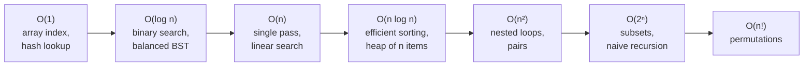
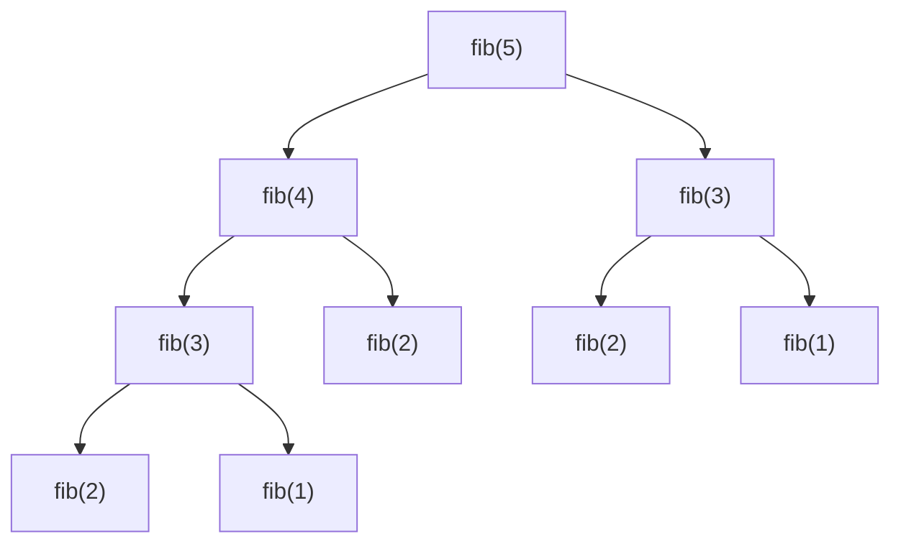
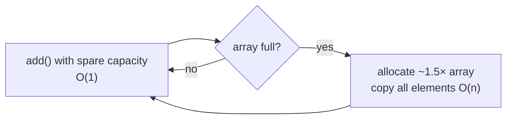

# Complexity Analysis (Big-O)

!!! abstract "TL;DR"
    - **Big-O** describes how running time or memory **grows** with input size `n`, ignoring constants and lower-order terms: `3n² + 10n + 7` is `O(n²)`. Strictly, O is an upper bound, Ω a lower bound and Θ a tight bound. In interviews "Big-O" usually means the tight worst-case bound.
    - **Growth classes to know:** `O(1)` < `O(log n)` < `O(n)` < `O(n log n)` < `O(n²)` < `O(2ⁿ)` < `O(n!)`. Doubling `n` roughly **quadruples** `O(n²)` work: measured nested-loop duplicate check 10 → 40 → 154 ms for n = 10k → 20k → 40k, and `String +=` in a loop 29 → 101 → 448 ms. Sorting-based and hash-based versions took 1–2.5 ms.
    - **Rules:** sequential steps add (`O(n + m)`), nested loops multiply (`O(n·m)`), halving the problem each step gives `O(log n)`, recursion cost = (number of calls) × (work per call). Naive Fibonacci made **2,692,537** calls for `fib(30)`; with memoisation **59** (measured).
    - **Amortised:** `ArrayList.add` is amortised `O(1)`: 1,000,000 adds caused only **30** capacity changes and copied **2.43** elements per add on average (measured). Hash-map operations are expected `O(1)`, worst case `O(n)` (Java 8+ treeifies large buckets to `O(log n)`).
    - **Space** counts extra memory, including the **recursion stack** (`O(depth)`) and output if the question says so.
    - Know Java collection costs: `ArrayList.get` O(1), `LinkedList.get(i)` O(n) (an indexed loop over 50k elements took 999 ms vs 0.36 ms, measured), `ArrayList.contains` O(n) vs `HashSet.contains` O(1) (10k lookups in 100k: 1,341 ms vs 0.66 ms).

## Why it matters

Every coding round ends with "what's the time and space complexity?", and senior interviews expect you to explain *why*, compare alternatives, and spot hidden costs (string concatenation, `contains` on a list, recursion depth, sorting inside a loop). In production the same reasoning explains why an endpoint that was fine with 100 rows times out with 100,000: an `O(n²)` merge, an N+1 query pattern, or a linear scan inside a loop.

Measurements on this page come from Java 21 on a 4-core container, median of 5 runs after warm-up. Absolute numbers vary by machine; the **ratios** are the point.

## Core concepts

### What Big-O measures

Big-O abstracts away hardware and constants to compare **growth rates**. Formally, `f(n) = O(g(n))` if there exist constants `c > 0` and `n₀` such that `f(n) ≤ c·g(n)` for all `n ≥ n₀`.

| Notation | Meaning | Example |
|---|---|---|
| `O(g)` | Upper bound: grows no faster than g | Linear search is O(n) |
| `Ω(g)` | Lower bound: grows at least as fast as g | Comparison sorting is Ω(n log n) |
| `Θ(g)` | Tight bound: both | Merge sort is Θ(n log n) |

Also separate **which case** you're describing: **best**, **average** (expected) and **worst**. Quicksort is Θ(n log n) on average but O(n²) in the worst case. Hash lookups are expected O(1), worst O(n).

### Growth classes


*Notice that each step to the right is a different league. For n = 1,000,000, n log n is about 20 million operations, n² is a trillion.*

| n | log₂ n | n log₂ n | n² | 2ⁿ |
|---|---|---|---|---|
| 10 | 3.3 | 33 | 100 | 1,024 |
| 1,000 | 10 | 10,000 | 1,000,000 | ~10³⁰¹ |
| 1,000,000 | 20 | 20,000,000 | 10¹² | — |

**Rule of thumb for interviews** (roughly 10⁸ simple operations per second): n ≤ 20 allows O(2ⁿ); n ≤ 500 allows O(n³); n ≤ 10⁴ allows O(n²); n ≤ 10⁶ needs O(n log n) or better; n ≥ 10⁸ needs O(log n) or O(1) per query. Use the constraints in the question to guess the intended complexity.

### Analysing code

| Pattern | Complexity | Why |
|---|---|---|
| Sequential blocks | `O(a + b)` | Costs add; keep the dominant term |
| Loop to n with O(1) body | `O(n)` | n iterations |
| Nested loops over n | `O(n²)` | n × n (also for `j = i+1..n`: n(n-1)/2) |
| Loops over different inputs | `O(n·m)` or `O(n + m)` | Don't merge different variables into one n |
| `i *= 2` or halving | `O(log n)` | log₂ n steps to reach n |
| Loop + binary search inside | `O(n log n)` | n × log n |
| Sorting then a pass | `O(n log n)` | The sort dominates |
| Recursion | calls × work per call | Draw the recursion tree |

**Hidden costs** often decide the answer:

- `String s += x` in a loop: each step copies the whole string, so n steps cost O(n²) (measured 29 → 101 → 448 ms when doubling n, vs ~0.2 ms with `StringBuilder`).
- `list.contains(x)`, `list.remove(0)`, `list.indexOf` on an `ArrayList`: O(n) each, so inside a loop O(n²).
- `LinkedList.get(i)` in an indexed loop: O(n) per access, O(n²) total.
- `substring` in Java 7u6+ copies (O(k)), `String.equals`/`hashCode` are O(length).
- Sorting inside a loop: O(n · n log n).
- Streams and library calls aren't free: `stream().sorted()` is O(n log n).

### Recursion and recurrences


*Notice the repeated subtrees (`fib(3)` twice, `fib(2)` three times). The tree roughly doubles at each level, which is why naive Fibonacci is exponential and memoisation, which computes each value once, is linear.*

Measured call counts:

| n | Naive `fib(n)` calls | Memoised calls |
|---|---|---|
| 20 | 21,891 | 39 |
| 25 | 242,785 | 49 |
| 30 | 2,692,537 | 59 |

Naive growth is about ×11 for every +5 in n (φ⁵ ≈ 11.1, where φ ≈ 1.618 is the golden ratio), so it's Θ(φⁿ), commonly quoted as O(2ⁿ) as an upper bound.

**Common recurrences:**

| Recurrence | Example | Result |
|---|---|---|
| T(n) = T(n/2) + O(1) | Binary search | O(log n) |
| T(n) = T(n−1) + O(1) | Linear recursion (sum of a list) | O(n) |
| T(n) = 2T(n/2) + O(n) | Merge sort | O(n log n) |
| T(n) = 2T(n/2) + O(1) | Tree traversal | O(n) |
| T(n) = T(n−1) + O(n) | Selection sort, naive quicksort worst case | O(n²) |
| T(n) = 2T(n−1) + O(1) | Naive subsets, Towers of Hanoi | O(2ⁿ) |

**Master theorem** for T(n) = a·T(n/b) + O(nᵈ): if d > log_b a → O(nᵈ); if d = log_b a → O(nᵈ log n); if d < log_b a → O(n^(log_b a)). Merge sort: a = 2, b = 2, d = 1 = log₂2 → O(n log n).

**Backtracking** costs (number of nodes in the search tree) × (work per node): subsets O(2ⁿ · n) with copying, permutations O(n! · n).

### Amortised analysis

Some operations are occasionally expensive but cheap on average over a sequence.


*Notice that growing by a constant factor makes copies rare: total copying over n adds is a geometric series bounded by a constant times n, so each add is O(1) amortised.*

Measured in Java 21: 1,000,000 `ArrayList.add` calls caused **30** capacity changes (growth ≈ 1.5×), final capacity 1,215,487, and **2,430,972** elements copied in total, i.e. **2.43 copies per add**: a constant, so amortised O(1). Growing by a fixed amount (+10 each time) would instead be O(n²) total.

Other amortised examples: hash-table resizing (Java `HashMap` doubles when size exceeds capacity × 0.75), two-stack queues (each element moves at most once), union-find with path compression and union by rank (nearly O(1), inverse Ackermann).

### Space complexity

Count the **extra** memory the algorithm uses as a function of n:

- Variables and fixed-size arrays: O(1).
- A copy, a hash set or a memo table of n entries: O(n). A 2D DP table: O(n·m).
- **Recursion stack:** O(maximum depth). Recursive DFS on a degenerate tree (a linked list) is O(n) stack, and in Java a depth of tens of thousands can throw `StackOverflowError` (the default thread stack is commonly 512 KB–1 MB depending on platform).
- Whether the input and output count depends on convention: say which you use ("O(1) extra space, not counting the output").

### Java collection costs

| Operation | ArrayList | LinkedList | HashMap / HashSet | TreeMap / TreeSet | ArrayDeque | PriorityQueue |
|---|---|---|---|---|---|---|
| get by index | O(1) | O(n) | — | — | — | — |
| add at end | O(1) amortised | O(1) | O(1) expected | O(log n) | O(1) amortised | O(log n) |
| add/remove at front | O(n) | O(1) | — | — | O(1) | — |
| contains / lookup | O(n) | O(n) | O(1) expected | O(log n) | O(n) | O(n) |
| remove min / first | — | — | — | O(log n) | O(1) | O(log n) |
| iterate in order | yes | yes | no order | sorted | yes | no |

Measured: 10,000 `contains` calls on a 100k-element `ArrayList` took **1,341 ms**, on a `HashSet` **0.66 ms**. An indexed loop over a 50k-element `LinkedList` took **999 ms**, the same loop over an `ArrayList` **0.36 ms**.

`HashMap` is expected O(1) with a good hash function. With many collisions a bucket becomes a list (O(n)), and since Java 8 large buckets (≥ 8 entries, table ≥ 64) become red-black trees, bounding the worst case to O(log n) for comparable keys.

### Constants still matter

Big-O hides constants, and in practice they can dominate at realistic sizes. Measured duplicate detection on ~40k random ints: the O(n²) version took 154 ms, while sorting (O(n log n), primitive array, cache-friendly) and a `HashSet<Integer>` (O(n) expected, but boxing and hashing) both took about 2.5 ms. For small n, a simple O(n²) loop can beat an O(n log n) algorithm (insertion sort is used for small runs inside Java's sorting algorithms for this reason).

## In practice: code & configuration

### Duplicate detection: three complexities

=== "❌ O(n²): compare every pair"

    ```java
    static boolean hasDuplicate(int[] a) {
        for (int i = 0; i < a.length; i++)
            for (int j = i + 1; j < a.length; j++)   // n(n-1)/2 comparisons
                if (a[i] == a[j]) return true;
        return false;
    }
    // Time O(n²), space O(1). Measured: 10 → 40 → 154 ms for n = 10k → 20k → 40k
    ```

=== "✅ O(n log n) sort, or O(n) hash"

    ```java
    static boolean hasDuplicateSorted(int[] a) {
        int[] b = a.clone();               // O(n) space; sort in place if mutation is allowed
        Arrays.sort(b);                    // dual-pivot quicksort for primitives: O(n log n)
        for (int i = 1; i < b.length; i++)
            if (b[i] == b[i - 1]) return true;   // duplicates are now adjacent
        return false;
    }

    static boolean hasDuplicateHash(int[] a) {
        Set<Integer> seen = new HashSet<>(a.length * 2); // presize to avoid resizing
        for (int x : a)
            if (!seen.add(x)) return true; // add returns false if already present
        return false;
    }
    // Time O(n log n) / O(n) expected; space O(n) for the copy or the set
    ```

### String building

=== "❌ Quadratic concatenation"

    ```java
    String csv = "";
    for (Claim c : claims) {
        csv += c.id() + ",";   // copies the whole string each time: O(n²) characters copied
    }
    ```

=== "✅ Linear with StringBuilder or joining"

    ```java
    StringBuilder sb = new StringBuilder(claims.size() * 12); // optional presize
    for (Claim c : claims) sb.append(c.id()).append(',');
    String csv = sb.toString();

    // or: String csv = claims.stream().map(Claim::id).collect(Collectors.joining(","));
    ```

*Since Java 9, `+` in a single expression compiles to an efficient `invokedynamic` concatenation, but a `+=` inside a loop still creates a new string each iteration.*

### Lookups inside a loop (the most common production O(n²))

=== "❌ List lookup per element"

    ```java
    // members: 50k, claims: 200k
    for (Claim c : claims) {
        Member m = members.stream()
            .filter(x -> x.id().equals(c.memberId()))   // O(members) per claim
            .findFirst().orElseThrow();
        enrich(c, m);
    }
    // O(claims × members) = 10^10 comparisons
    ```

=== "✅ Index first, then look up"

    ```java
    Map<String, Member> byId = members.stream()
        .collect(Collectors.toMap(Member::id, Function.identity())); // O(members)
    for (Claim c : claims) {
        enrich(c, byId.get(c.memberId()));                            // O(1) expected each
    }
    // O(claims + members) time, O(members) extra space
    ```

### Recursion with memoisation

```java
static long fib(int n, long[] memo) {
    if (n < 2) return n;
    if (memo[n] != 0) return memo[n];          // each n computed once
    return memo[n] = fib(n - 1, memo) + fib(n - 2, memo);
}
// Time O(n), space O(n) memo + O(n) stack. Iterative with two variables: O(n) time, O(1) space.
```

## Real-world usage

- **API latency regressions** often come from accidental O(n²): matching two lists with nested loops, `contains` on lists, or N+1 database queries (one query per row), which is the same pattern at the I/O level.
- **Database indexes** turn O(n) table scans into O(log n) B-tree lookups. Query plans are complexity analysis with real constants.
- **Pagination** (keyset vs offset): `OFFSET 100000` makes the database walk and discard 100k rows, O(offset), while keyset pagination seeks via the index in O(log n).
- **Caches** (Redis, in-memory maps) trade O(n) memory for O(1) lookups instead of repeated expensive computation, the same trade-off as memoisation.
- **Algorithmic complexity attacks:** hash-flooding (many colliding keys) made web frameworks' parameter parsing O(n²) around 2011, which is one reason Java 8 added tree bins to `HashMap`. Catastrophic regex backtracking (ReDoS) is another exponential-time risk.

## Trade-offs & production gotchas

!!! warning "Complexity pitfalls"
    - **Merging different inputs into one n:** a loop over users and an inner loop over orders is O(u·o), not O(n²). Name the variables.
    - **Ignoring hidden costs** in library calls: `contains`, `remove(0)`, `substring`, `sort`, stream operations.
    - **Forgetting the recursion stack** in space complexity, and stack overflow on deep recursion in Java.
    - **Quoting average case as worst case:** hash maps and quicksort have different worst cases.
    - **Over-optimising tiny inputs:** for n = 20, readability beats asymptotics. Measure before optimising.
    - **Treating O(1) as instant:** a hash lookup with boxing and a cache miss can be slower than scanning a tiny array.
    - **Amortised ≠ every call:** an occasional resize can cause a latency spike. Presize collections when the size is known.

- **Time vs space:** hash maps, memo tables and indexes buy speed with memory. On memory-constrained services, a sort-based O(n log n) approach with O(1) extra space may be the better choice.
- **Asymptotics vs constants:** cache locality, allocation and boxing matter at realistic n. Profile (JFR, async-profiler, JMH for micro-benchmarks) before and after.

## How this connects to my experience

- **Not a resume item:** DSA isn't listed directly. Position it as foundational knowledge applied in backend work.
- **Honest bridges:** in the GraphQL Consumer Service at OptumRx that integrated 5 upstream systems, aggregation and enrichment code is exactly where index-then-lookup (O(n + m)) beats nested matching (O(n·m)), and where batching avoids N+1 calls. Redis caching is the same time-vs-space trade-off as memoisation. *[confirm: any concrete performance fix you made, e.g. replacing nested loops or N+1 calls, with before/after numbers]*
- **Talking points:**
    - "I state time and space, best and worst case where they differ, and the hidden costs of library calls."
    - "Most production slowdowns I look for are accidental O(n²): list lookups in loops and N+1 calls. I index into a map first."
    - "I use constraints to guess the target complexity: n up to 10⁵ means O(n log n) or better."

## Interview questions

### Fundamentals

??? question "Q1. What does Big-O notation mean, and why do we drop constants?"
    **Answer:** Big-O describes how an algorithm's resource use (time or memory) grows as input size grows, as an upper bound on the growth rate: f(n) = O(g(n)) if f(n) ≤ c·g(n) for all n beyond some n₀. We drop constants and lower-order terms because they don't change the growth class and depend on hardware and implementation: `3n² + 10n` and `n²` both quadruple when n doubles (measured: an O(n²) loop went 10 → 40 → 154 ms as n doubled twice). Constants still matter in practice, which is why you measure.

    **Interviewer listens for:** growth rate, upper bound, why constants are dropped, awareness that constants matter in practice.

    **Common wrong answer:** "Big-O is the exact number of operations" or "it's how fast the code runs."

??? question "Q2. What's the difference between O, Ω and Θ, and between worst, average and best case?"
    **Answer:** O is an upper bound, Ω a lower bound, Θ a tight bound (both). Cases are a separate dimension: which input you consider. You can give a Θ bound for each case: quicksort is Θ(n log n) on average and Θ(n²) in the worst case; insertion sort is Θ(n) best case (already sorted) and Θ(n²) worst. Hash lookups are expected O(1), worst O(n) (O(log n) with Java 8 tree bins). In interviews, "Big-O" usually means the tight worst-case bound unless you specify "expected" or "amortised".

    **Interviewer listens for:** bounds vs cases kept separate, concrete examples.

    **Common wrong answer:** "O is worst case, Θ is average case, Ω is best case."

??? question "Q3. What's the complexity of these loops: `for (i = 1; i < n; i *= 2)`, and two nested loops where the inner runs from `i` to `n`?"
    **Answer:** The doubling loop runs log₂ n times: O(log n). The nested loop runs n + (n−1) + … + 1 = n(n+1)/2 iterations: O(n²), because the constant ½ is dropped. A related trap: an outer loop to n with an inner loop doubling to n is O(n log n). An outer loop over n with an inner loop over a different collection m is O(n·m).

    **Interviewer listens for:** log from doubling, arithmetic series, distinct variables.

    **Common wrong answer:** "The nested loop is O(n log n) because the inner loop shrinks."

??? question "Q4. What is space complexity, and does recursion use space?"
    **Answer:** Space complexity is the extra memory used as a function of input size: auxiliary data structures (sets, memo tables, copies) and the call stack. Recursion uses O(depth) stack frames: recursive DFS on a balanced tree is O(log n), on a degenerate tree O(n), and memoised Fibonacci uses O(n) for the memo plus O(n) stack. Whether input and output count depends on convention, so state it. In Java, deep recursion can throw `StackOverflowError`, so convert to iteration with an explicit stack for deep inputs.

    **Interviewer listens for:** auxiliary memory, call stack, convention stated.

    **Common wrong answer:** "Recursion uses O(1) space because there's no array."

### Intermediate

??? question "Q5. Why is `ArrayList.add` O(1) if the array sometimes has to be copied?"
    **Answer:** It's amortised O(1). When the backing array fills, `ArrayList` allocates one about 1.5× larger and copies. Because capacity grows geometrically, copies are rare and the total copying across n adds is bounded by a constant times n (a geometric series). Measured: 1,000,000 adds caused 30 capacity changes and 2,430,972 element copies in total, 2.43 per add. If capacity grew by a fixed amount, total copying would be O(n²). Individual adds that trigger a resize are still O(n), so presize when the size is known to avoid latency spikes.

    **Interviewer listens for:** geometric growth, aggregate argument, per-call worst case.

    **Common wrong answer:** "It's O(n) because copying is O(n)" or "it's always O(1)."

??? question "Q6. What's the complexity of naive recursive Fibonacci, and how do you improve it?"
    **Answer:** Each call makes two more calls and subproblems repeat, so the call tree grows exponentially: Θ(φⁿ) ≈ O(1.618ⁿ), usually quoted as O(2ⁿ) as an upper bound. Measured: `fib(30)` made 2,692,537 calls. Memoisation stores each result so each n is computed once: O(n) time (59 calls for n = 30), O(n) space. Bottom-up iteration with two variables gives O(n) time and O(1) space. Matrix exponentiation or fast doubling gives O(log n) arithmetic operations.

    **Interviewer listens for:** recursion tree, overlapping subproblems, memo vs iterative, space.

    **Common wrong answer:** "O(n), since it counts down to zero."

??? question "Q7. Solve T(n) = 2T(n/2) + O(n) and T(n) = 2T(n−1) + O(1). What algorithms have these shapes?"
    **Answer:** The first is merge sort: the recursion tree has log₂ n levels and each level does O(n) total work, so O(n log n) (master theorem: a = 2, b = 2, d = 1 = log₂ 2). The second doubles the number of calls each level for n levels: 1 + 2 + 4 + … + 2ⁿ = O(2ⁿ), e.g. Towers of Hanoi and naive subset generation. Contrast T(n) = 2T(n/2) + O(1), which is O(n) (visiting every node of a tree).

    **Interviewer listens for:** recursion-tree or master-theorem reasoning, matching to algorithms.

    **Common wrong answer:** "Both are O(n log n) because there are two recursive calls."

??? question "Q8. Why can a HashMap operation be O(n), and what did Java 8 change?"
    **Answer:** Lookups are expected O(1) because a good hash spreads keys evenly and the table resizes (load factor 0.75) to keep buckets short. If many keys collide (a poor `hashCode`, or adversarial input), one bucket becomes a long list and operations degrade to O(n). Java 8 converts a bucket to a red-black tree once it holds 8 or more entries (when the table has at least 64 buckets), bounding the worst case to O(log n) for `Comparable` keys. Hash-flooding denial-of-service attacks motivated this. Also remember hashing a key costs O(key length) for strings.

    **Interviewer listens for:** expected vs worst case, load factor and resizing, tree bins, key hashing cost.

    **Common wrong answer:** "HashMap is always O(1)."

### Senior

??? question "Q9. An endpoint is fast in testing but times out in production with large accounts. How do you use complexity analysis to find the cause?"
    **Answer:** Look for cost that grows faster than linearly with account size. Profile with production-like data (JFR, async-profiler, APM traces) and check for: nested loops matching two collections (O(n·m)), `contains`/`indexOf`/`remove` on lists inside loops, string concatenation in loops, sorting inside loops, recursion over large structures, and N+1 calls to the database or downstream services (O(n) round trips). Confirm by measuring at 2× and 4× sizes: quadrupling time when size doubles means O(n²). Fix by indexing into maps, batching (DataLoader, `IN` queries), pagination, precomputation or caching, then add a performance test with large data.

    **Interviewer listens for:** growth-based diagnosis, common culprits, doubling test, N+1.

    **Common wrong answer:** "Add more instances." (Doesn't change per-request complexity.)

??? question "Q10. When would you choose an O(n log n) algorithm over an O(n) one, or O(n²) over O(n log n)?"
    **Answer:** When constants, memory or simplicity dominate at realistic sizes. Sorting a primitive array in place (O(n log n), O(1) extra space, cache-friendly) can match or beat a `HashSet<Integer>` (O(n) expected, boxing, O(n) memory): both took about 2.5 ms for ~40k ints in my measurement, while the O(n²) version took 154 ms. For tiny n (say under ~20–50 elements), insertion sort or a linear scan beats more complex structures, which is why library sorts switch to insertion sort for small runs. Also choose by worst-case guarantees (merge sort over quicksort for stability and guaranteed O(n log n)) and memory limits.

    **Interviewer listens for:** constants, memory, cache effects, worst-case guarantees, measuring.

    **Common wrong answer:** "Always pick the lowest Big-O."

??? question "Q11. How do you analyse the complexity of a backtracking solution, such as generating all subsets or permutations?"
    **Answer:** Count the nodes in the search tree and multiply by the work per node. Subsets: each element is in or out, giving 2ⁿ leaves; copying each subset into the result costs up to O(n), so O(n · 2ⁿ) time and O(n) recursion space (plus output). Permutations: n! leaves with O(n) copy each, so O(n · n!). Pruning (e.g. stopping when the sum exceeds the target) doesn't change the worst case but can help a lot in practice. State the output size, since any algorithm that outputs 2ⁿ subsets must take Ω(2ⁿ).

    **Interviewer listens for:** tree size × node work, output-size lower bound, pruning caveat.

    **Common wrong answer:** "It's O(n²) because there are two nested loops in the code."

??? question "Q12. What is amortised analysis, and how does it differ from average-case analysis?"
    **Answer:** Amortised analysis bounds the total cost of a **sequence** of operations in the worst case and divides by the number of operations: no probability involved. Dynamic-array appends, hash-table resizing, a queue built from two stacks and union-find are classic examples. Average-case (expected) analysis assumes a distribution over inputs or random choices: quicksort with random pivots, hash lookups with a good hash function. An amortised O(1) operation can still have an O(n) individual call, which matters for latency-sensitive code.

    **Interviewer listens for:** sequence worst case vs probabilistic, examples, latency caveat.

    **Common wrong answer:** "Amortised just means average."

### Scenario-based

??? question "Q13. You must find whether any two numbers in an array of up to 10⁶ integers sum to a target. What complexities are possible, and which do you pick?"
    **Answer:** Brute force over all pairs is O(n²): ~5×10¹¹ pair checks at n = 10⁶, far too slow. Sorting plus two pointers is O(n log n) time and O(1) extra space if sorting in place is allowed (O(n) for a copy). A hash set of complements is O(n) expected time and O(n) space. With n = 10⁶, both of the latter work. I'd choose the hash approach for one pass and simplicity, or sort + two pointers when memory is tight or the array is already sorted. Mention overflow (use `long` for sums) and duplicates (the same element can't be used twice).

    **Interviewer listens for:** using constraints, multiple solutions with trade-offs, edge cases.

    **Common wrong answer:** Jumping straight to nested loops, or claiming hashing is always better without mentioning memory.

??? question "Q14. A code review shows `for (Claim c : claims) { if (processedIds.contains(c.id())) continue; ... processedIds.add(c.id()); }` where `processedIds` is an `ArrayList`. What do you say?"
    **Answer:** `ArrayList.contains` is O(n), so the loop is O(n²) in the number of claims. With 100k claims that's about 5×10⁹ comparisons (measured: 10k `contains` calls on a 100k list took 1.3 s, a `HashSet` 0.66 ms). Change `processedIds` to a `HashSet` (presized), making the loop O(n) expected. If order matters, use `LinkedHashSet`. If IDs are dense integers, a `BitSet` is even cheaper. Also check whether duplicates should be removed upstream (e.g. `SELECT DISTINCT` or a unique constraint) rather than in memory.

    **Interviewer listens for:** spotting the hidden O(n), correct replacement, ordering, upstream fix.

    **Common wrong answer:** "It's fine, `contains` is a library method so it's fast."

## Cheat sheet

| Topic | Remember |
|---|---|
| Order | 1 < log n < n < n log n < n² < 2ⁿ < n! |
| Constraints | n ≤ 20: 2ⁿ · n ≤ 500: n³ · n ≤ 10⁴: n² · n ≤ 10⁶: n log n · bigger: log n / O(1) |
| Rules | Sequential add, nested multiply, halving = log, recursion = calls × work |
| Recurrences | T(n/2)+1 = log n · 2T(n/2)+n = n log n · 2T(n/2)+1 = n · T(n−1)+n = n² · 2T(n−1)+1 = 2ⁿ |
| Master | a·T(n/b)+nᵈ: compare d with log_b a |
| Amortised | ArrayList add (2.43 copies/add measured), HashMap resize, two-stack queue |
| HashMap | Expected O(1), worst O(n), Java 8 tree bins → O(log n) |
| Space | Count auxiliary + recursion stack; state input/output convention |
| Hidden costs | `+=` strings, `list.contains`, `LinkedList.get(i)`, sort in loop, N+1 calls |
| Measured | O(n²) 10 → 40 → 154 ms per doubling; fib(30) 2.69M calls vs 59 memoised |

## Sources
1. Cormen, Leiserson, Rivest, Stein, *Introduction to Algorithms* (4th ed.), chapters on growth of functions, recurrences and amortised analysis.
2. Sedgewick & Wayne, *Algorithms* (4th ed.), analysis of algorithms.
3. [Java SE 21 API: ArrayList](https://docs.oracle.com/en/java/javase/21/docs/api/java.base/java/util/ArrayList.html) (amortised constant-time add) and [HashMap](https://docs.oracle.com/en/java/javase/21/docs/api/java.base/java/util/HashMap.html).
4. [JEP 180: Handle Frequent HashMap Collisions with Balanced Trees](https://openjdk.org/jeps/180).
5. [JEP 280: Indify String Concatenation](https://openjdk.org/jeps/280).
6. Gayle Laakmann McDowell, *Cracking the Coding Interview* (6th ed.), Big O chapter.
7. Demonstrations on this page: Java 21 on a 4-core container, median of 5 runs after warm-up, run while writing this page.
