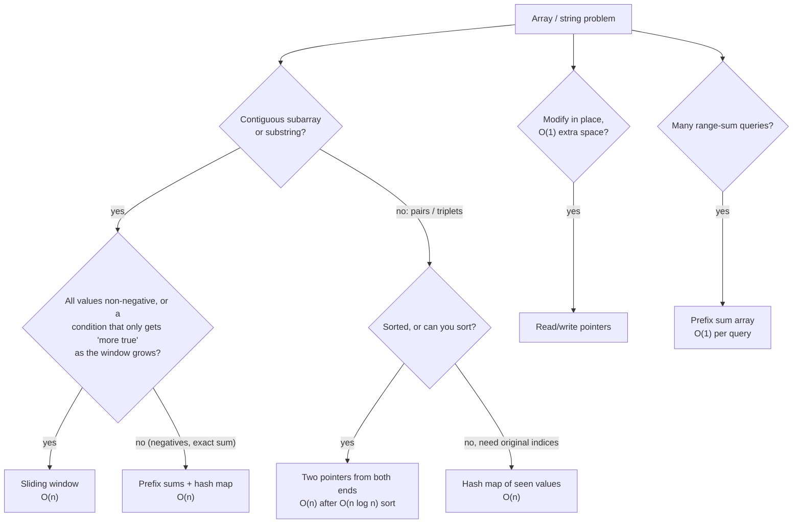
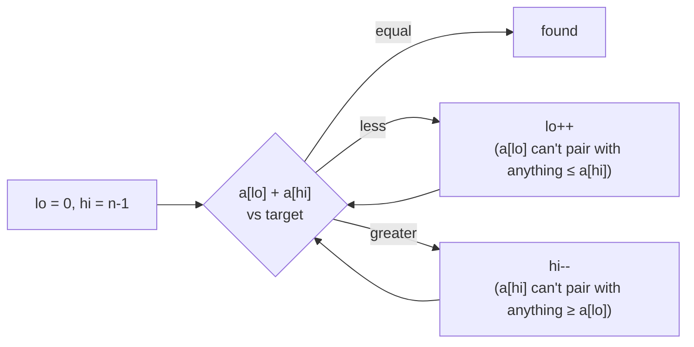
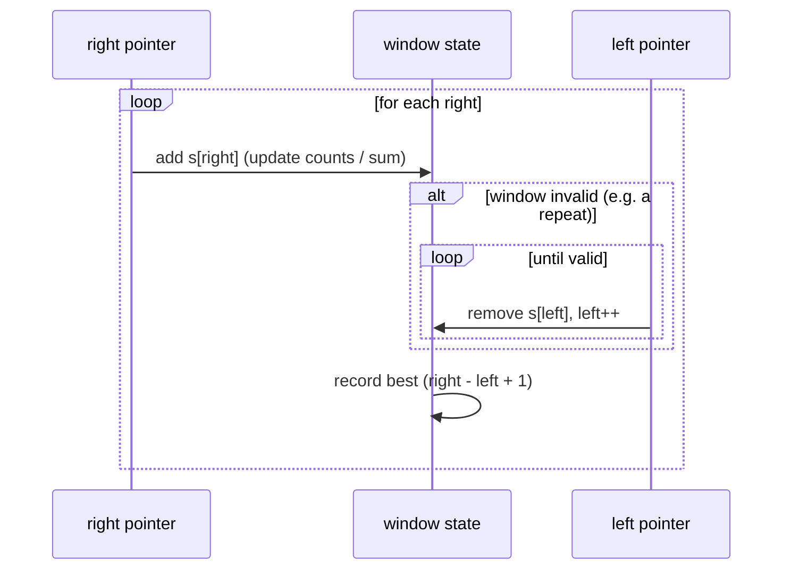
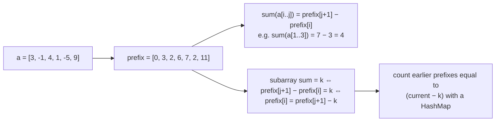

# Arrays & Strings (Two Pointers, Sliding Window, Prefix Sums)

!!! abstract "Key takeaways"
    - Most array and string problems reduce an **O(n²) brute force over all pairs or subarrays** to **O(n)** with one of three patterns:
        - **Two pointers:** opposite ends on sorted data (pair sums, container with most water, 3Sum after sorting), or a read and a write pointer for in-place filtering (remove duplicates).
        - **Sliding window:** a contiguous range that expands on the right and shrinks on the left while maintaining a condition (longest substring without repeats, minimum window substring, minimum-length subarray with sum ≥ target). It works when moving the left edge can only *help* restore the condition (monotonic).
        - **Prefix sums:** `prefix[i] = a[0] + … + a[i-1]` gives any range sum in O(1). With a hash map of prefix counts it solves **subarray sum equals k** in O(n), even with negative numbers, where sliding windows fail.
    - Related staples: **Kadane's algorithm** (max subarray sum, O(n)), **product except self** (prefix × suffix products, no division), in-place reversal, and frequency arrays (`int[26]` / `int[128]`).
    - Measured in Java 21: window-based longest substring on 200k chars **0.70 ms** vs 58 ms brute force; prefix-sum + map for subarray-sum-equals-k on 20k ints **3.05 ms** vs 160 ms brute force (same 26,818 count). All solutions on this page passed **20,000** randomised checks against brute-force versions.
    - Java specifics: `String` is immutable (use `StringBuilder` or `char[]`), `charAt` is O(1), `int` overflow is silent (`MAX_VALUE + MAX_VALUE = -2`, measured), so use `long` for sums.

## Why it matters

Arrays and strings are the most common category in coding rounds, and these three patterns cover a large share of "medium" problems. Interviewers check whether you recognise the pattern from the problem shape, start from a brute force, explain why the optimisation is correct (the invariant), and handle edge cases (empty input, duplicates, negatives, overflow). The same ideas show up in production: windowed rate limiters, running totals, and merging sorted streams.

All code on this page was run on Java 21 and checked against brute-force implementations on 2,000 random inputs per problem.

## Core concepts

### Recognising the pattern


*Notice that the deciding question for windows is monotonicity. With negative numbers, shrinking the window doesn't reliably reduce the sum, so you need prefix sums instead.*

### Two pointers

**Opposite ends (sorted input).** For a pair sum on a sorted array: if `a[lo] + a[hi]` is too small, only moving `lo` right can increase it; if too large, only moving `hi` left can decrease it. Each step discards one element for good, so it's O(n).


*Notice the invariant: every discarded element provably can't be part of a solution with the remaining elements, which is why one pass is enough.*

Variants:

- **Container with most water:** move the shorter side inward, since the area is limited by the shorter line and moving the taller one can't help.
- **3Sum:** sort, fix `i`, two-pointer the rest. Skip duplicates at all three positions. O(n²).
- **Palindrome check:** compare from both ends, skipping non-alphanumerics.
- **Read/write pointers (same direction):** remove duplicates from a sorted array, move zeros, partition (Dutch national flag uses three pointers).
- **Fast/slow pointers:** cycle detection in linked lists, middle of a list (see [Linked lists, stacks & queues](04-linked-lists-stacks-and-queues.md)).

### Sliding window

A window `[left, right]` moves through the input. `right` expands it; `left` shrinks it when a constraint is violated (or, for "minimum" problems, while it still holds). Each index enters and leaves once, so the total work is O(n).


*Notice that `left` never moves backwards. Together the two pointers make at most 2n moves, which is why nested-looking code is still linear.*

| Type | Example | State |
|---|---|---|
| Fixed size k | Max sum of k consecutive elements, moving average | Running sum: add new, subtract the element leaving |
| Variable, longest valid | Longest substring without repeating characters, longest with at most k distinct | Last-seen index or counts |
| Variable, shortest valid | Minimum window substring, shortest subarray with sum ≥ target (positive numbers) | Counts and a "missing" counter |
| Counting windows | Number of subarrays with at most k distinct | `atMost(k) − atMost(k−1)` trick |

**When sliding windows fail:** "subarray sum equals k" with negative numbers. Adding an element might decrease the sum, so there's no rule for when to shrink. Use prefix sums.

### Prefix sums


*Notice the leading 0 in the prefix array: it represents the empty prefix and makes subarrays that start at index 0 work without special cases.*

- **Range sum queries:** build in O(n), answer each query in O(1). For updates too, use a Fenwick tree or segment tree (O(log n) both).
- **Subarray sum equals k:** keep a map from prefix sum to how many times it has occurred, seeded with `{0: 1}`. At each element, add `count[sum − k]` to the answer. O(n) time, O(n) space, works with negatives.
- **Variants:** longest subarray with sum k (store the first index of each prefix), subarray sum divisible by k (store prefix mod k, normalising negative remainders), equal 0s and 1s (map 0 → −1 and look for sum 0).
- **2D prefix sums:** `P[i+1][j+1] = a[i][j] + P[i][j+1] + P[i+1][j] − P[i][j]`, and any rectangle sum is four lookups.
- **Difference arrays** (the inverse): add `v` to a range `[l, r]` with `d[l] += v; d[r+1] -= v`, then prefix-sum once. Useful for many range updates (booking counts, calendar overlaps).

### Kadane's algorithm and prefix/suffix products

- **Maximum subarray sum:** at each index, either extend the best subarray ending at the previous index or start fresh: `cur = max(a[i], cur + a[i])`. O(n), O(1) space. It's the simplest dynamic-programming example. Initialise with `a[0]` (not 0) so all-negative arrays work.
- **Product of array except self (no division):** `out[i] = (product of everything left of i) × (product of everything right of i)`. Fill left products in one pass and multiply by a running suffix product in a second pass. O(n) time, O(1) extra space besides the output. Division fails with zeros.

### Strings in Java

| Fact | Consequence |
|---|---|
| `String` is immutable | `s += x` in a loop is O(n²); use `StringBuilder` |
| `charAt(i)` is O(1) | Index freely; `toCharArray()` copies (O(n)) but is handy for in-place edits and sorting |
| `substring` copies (since 7u6) | O(length) per call; avoid in tight loops, pass indices instead |
| `equals` / `hashCode` are O(length) | Hashing long strings repeatedly is not free (hash is cached after first computation) |
| Characters are UTF-16 code units | Emoji and some scripts use surrogate pairs; use `codePoints()` when that matters |
| Frequency arrays | `int[26]` for lowercase ASCII, `int[128]` for ASCII, `HashMap<Character,Integer>` for general Unicode |
| `String.join`, `Collectors.joining`, `String.repeat` | Clean, linear string building |

## In practice: code & configuration

### Longest substring without repeating characters

=== "❌ Brute force: every start, scan forward"

    ```java
    static int longestBrute(String s) {
        int best = 0;
        for (int i = 0; i < s.length(); i++) {
            Set<Character> seen = new HashSet<>();
            for (int j = i; j < s.length() && seen.add(s.charAt(j)); j++)
                best = Math.max(best, j - i + 1);
        }
        return best;
    }
    // O(n · σ) here (σ = alphabet size bounds each scan), O(n²) for large alphabets.
    // Measured on 200k chars: 58.3 ms
    ```

=== "✅ Sliding window with last-seen index"

    ```java
    static int lengthOfLongestSubstring(String s) {
        int[] last = new int[128];            // last index of each ASCII char
        Arrays.fill(last, -1);
        int best = 0, left = 0;
        for (int right = 0; right < s.length(); right++) {
            char c = s.charAt(right);
            if (last[c] >= left) left = last[c] + 1; // jump past the previous occurrence
            last[c] = right;
            best = Math.max(best, right - left + 1);
        }
        return best;
    }
    // O(n) time, O(σ) space. Measured on 200k chars: 0.70 ms
    ```

### Minimum window substring

```java
static String minWindow(String s, String t) {
    if (t.isEmpty()) return "";
    int[] need = new int[128];
    for (char c : t.toCharArray()) need[c]++;
    int missing = t.length(), left = 0, bestL = 0, bestLen = Integer.MAX_VALUE;
    for (int right = 0; right < s.length(); right++) {
        if (need[s.charAt(right)]-- > 0) missing--;           // a needed char arrived
        while (missing == 0) {                                // window covers t: try to shrink
            if (right - left + 1 < bestLen) { bestLen = right - left + 1; bestL = left; }
            if (++need[s.charAt(left++)] > 0) missing++;      // dropped a needed char
        }
    }
    return bestLen == Integer.MAX_VALUE ? "" : s.substring(bestL, bestL + bestLen);
}
// minWindow("ADOBECODEBANC", "ABC") = "BANC". O(|s| + |t|) time, O(σ) space.
```

*`need[c]` goes negative for surplus characters. Only a positive count before decrementing means the character was actually needed.*

### Subarray sum equals k

=== "❌ Sliding window (wrong with negatives)"

    ```java
    // Shrinking when sum > k assumes adding elements only increases the sum.
    // With a = [1, -1, 1], k = 1 a window approach misses valid subarrays.
    ```

=== "✅ Prefix sums + HashMap"

    ```java
    static int subarraySum(int[] a, int k) {
        Map<Integer, Integer> count = new HashMap<>();
        count.put(0, 1);                       // empty prefix: subarrays starting at index 0
        int sum = 0, res = 0;
        for (int x : a) {
            sum += x;
            res += count.getOrDefault(sum - k, 0);   // earlier prefixes that make a k-sum ending here
            count.merge(sum, 1, Integer::sum);
        }
        return res;
    }
    // O(n) time, O(n) space. Measured on 20k ints: 3.05 ms vs 160.5 ms for the O(n²) brute force
    ```

### Two pointers: 3Sum

```java
static List<List<Integer>> threeSum(int[] nums) {
    int[] a = nums.clone();
    Arrays.sort(a);                                        // O(n log n)
    List<List<Integer>> res = new ArrayList<>();
    for (int i = 0; i < a.length - 2; i++) {
        if (i > 0 && a[i] == a[i - 1]) continue;           // skip duplicate anchors
        int lo = i + 1, hi = a.length - 1;
        while (lo < hi) {
            int s = a[i] + a[lo] + a[hi];
            if (s == 0) {
                res.add(List.of(a[i], a[lo], a[hi]));
                while (lo < hi && a[lo] == a[lo + 1]) lo++; // skip duplicate seconds
                while (lo < hi && a[hi] == a[hi - 1]) hi--; // skip duplicate thirds
                lo++; hi--;
            } else if (s < 0) lo++;
            else hi--;
        }
    }
    return res;
}
// O(n²) time, O(1) extra besides sorting and output
```

### Read/write pointers and fixed windows

```java
// Remove duplicates from a sorted array in place; returns the new length
static int removeDuplicates(int[] a) {
    if (a.length == 0) return 0;
    int w = 1;                                   // a[0..w-1] holds the unique prefix
    for (int r = 1; r < a.length; r++)
        if (a[r] != a[w - 1]) a[w++] = a[r];
    return w;
}

// Maximum sum of any k consecutive elements
static long maxSumWindowK(int[] a, int k) {
    long sum = 0;                                // long: avoid int overflow
    for (int i = 0; i < k; i++) sum += a[i];
    long best = sum;
    for (int i = k; i < a.length; i++) {
        sum += a[i] - a[i - k];                  // slide: add entering, remove leaving
        best = Math.max(best, sum);
    }
    return best;
}
// Measured: k = 1000 over 5,000,000 ints in 11.1 ms (recomputing each window would be ~5×10⁹ additions)
```

### Kadane and product-except-self

```java
static long maxSubarraySum(int[] a) {
    long best = a[0], cur = a[0];                // start from a[0] so all-negative input works
    for (int i = 1; i < a.length; i++) {
        cur = Math.max(a[i], cur + a[i]);        // extend or restart
        best = Math.max(best, cur);
    }
    return best;
}

static int[] productExceptSelf(int[] a) {
    int n = a.length;
    int[] out = new int[n];
    out[0] = 1;
    for (int i = 1; i < n; i++) out[i] = out[i - 1] * a[i - 1];  // product of left side
    int suffix = 1;
    for (int i = n - 1; i >= 0; i--) {
        out[i] *= suffix;                                        // times product of right side
        suffix *= a[i];
    }
    return out;
}
```

## Real-world usage

- **Rate limiting:** sliding-window counters and logs (count requests in the last 60 seconds) are the fixed and variable window patterns applied to timestamps (often in Redis sorted sets).
- **Analytics and monitoring:** moving averages and rolling sums over metrics (p95 over the last 5 minutes) use fixed windows. Cumulative totals per day are prefix sums.
- **Databases:** window functions (`SUM(...) OVER (ORDER BY ... ROWS BETWEEN 6 PRECEDING AND CURRENT ROW)`) are sliding windows. Summed-area tables (2D prefix sums) appear in image processing and OLAP cubes.
- **Merging sorted streams:** two pointers merge sorted lists, the basis of merge sort and of merge joins in databases.
- **Text processing:** substring search, tokenising and deduplication use windows and frequency counts. Rolling hashes (Rabin–Karp) are a sliding window over hashes.

## Trade-offs & production gotchas

!!! warning "Array and string pitfalls"
    - **Integer overflow:** `int` sums wrap silently (`Integer.MAX_VALUE + Integer.MAX_VALUE = -2`, measured). Use `long`, and `lo + (hi - lo) / 2` for midpoints.
    - **Sliding window with negatives:** the shrink rule breaks. Switch to prefix sums.
    - **Forgetting `{0: 1}`** in prefix-sum maps: misses subarrays starting at index 0.
    - **Duplicates in two-pointer problems:** 3Sum returns duplicate triplets unless you skip equal values.
    - **Off-by-one window lengths:** the length is `right - left + 1`. Write the invariant down.
    - **String building with `+=`** in loops and `substring` in hot paths.
    - **Assuming ASCII:** `int[26]` breaks on uppercase or Unicode input. Ask about the character set.
    - **Mutating the input** when the caller doesn't expect it (sorting in place). Clone or ask.

- **Sort + two pointers vs hash map:** sorting gives O(1) extra space but loses original indices and costs O(n log n). Hashing is O(n) expected with O(n) space.
- **Prefix array vs on-the-fly sum:** a prefix array costs O(n) memory but answers many queries in O(1). For a single pass, a running sum is enough.

## How this connects to my experience

- **Not a resume item.** Position as fundamentals that show up in production patterns.
- **Honest bridges:** sliding windows and running totals appear in rate limiting and retry/backoff logic around Kafka consumers and APIs, and in moving-average metrics for monitoring. Merging sorted results from multiple upstream systems (as in a GraphQL aggregation layer) is the two-pointer merge. *[confirm: any concrete case, e.g. a rate limiter, deduplication, or merge of sorted feeds you implemented]*
- **Talking points:**
    - "I start with the brute force, then look for monotonicity: if it holds, two pointers or a sliding window gets O(n); if not, prefix sums with a hash map."
    - "I state the invariant for each pointer move, which is how I convince myself and the interviewer it's correct."

## Interview questions

### Fundamentals

??? question "Q1. When does the two-pointer technique work, and why is it O(n)?"
    **Answer:** It works when the data has an order that lets each step rule out an element for good: typically a sorted array (pair sums, 3Sum after sorting, container with most water) or a same-direction read/write scan (in-place filtering). On a sorted array, if `a[lo] + a[hi] < target`, no pair using `a[lo]` with anything at or below `hi` reaches the target, so `lo++` is safe (symmetrically for `hi--`). Each pointer moves at most n times, so the scan is O(n), plus O(n log n) if you have to sort first.

    **Interviewer listens for:** the elimination argument, monotonic order, sort cost.

    **Common wrong answer:** "Two pointers is just two nested loops written differently."

??? question "Q2. What is a sliding window, and how do you tell fixed-size from variable-size problems?"
    **Answer:** A sliding window maintains a contiguous range `[left, right]` and its aggregate (sum, counts) incrementally as it moves, instead of recomputing each subarray. Fixed-size windows (exactly k elements: max sum, moving average) add the entering element and remove the leaving one each step. Variable-size windows expand `right` and shrink `left` to keep a condition (no repeats, sum ≥ target, contains all of t). Each element enters and leaves once, so it's O(n) even though there's a `while` inside the `for`. The condition must be monotonic: shrinking must move the window towards validity.

    **Interviewer listens for:** incremental state, monotonic condition, amortised O(n).

    **Common wrong answer:** "A while inside a for means O(n²)."

??? question "Q3. What are prefix sums, and what problems do they solve?"
    **Answer:** `prefix[i]` is the sum of the first i elements (with `prefix[0] = 0`), built in O(n). Any range sum is `prefix[j+1] − prefix[i]` in O(1), which answers many range-sum queries quickly. Combined with a hash map of prefix counts, they solve "number of subarrays with sum k" in O(n), including negative numbers. Variants: 2D prefix sums for rectangle sums, prefix XOR, prefix modulo for divisibility, and difference arrays for batched range updates.

    **Interviewer listens for:** O(1) range queries, empty prefix, hash-map combination.

    **Common wrong answer:** Forgetting the leading zero and special-casing subarrays starting at 0 incorrectly.

??? question "Q4. Why should you avoid `String +=` in a loop in Java?"
    **Answer:** Strings are immutable, so each `+=` creates a new string and copies all previous characters. Over n iterations that's 1 + 2 + … + n = O(n²) character copies. `StringBuilder` appends into a growable buffer, amortised O(1) per append, O(n) total. Since Java 9, a single `a + b + c` expression is compiled efficiently via `invokedynamic`, but a loop still creates a new string each iteration. Use `StringBuilder`, `String.join` or `Collectors.joining`.

    **Interviewer listens for:** immutability, quadratic copying, StringBuilder amortised.

    **Common wrong answer:** "The compiler optimises it away."

### Intermediate

??? question "Q5. Find the length of the longest substring without repeating characters."
    **Answer:** Sliding window with a last-seen index per character. Move `right` across the string; if the current character was last seen at or after `left`, jump `left` to one past that index; update the last-seen index; track `right − left + 1`. O(n) time, O(σ) space for the alphabet. Measured on 200k characters: 0.70 ms vs 58 ms for the brute force. Edge cases: empty string (0), all the same character (1), Unicode (use a map instead of `int[128]`).

    **Interviewer listens for:** window jump with last index, `>= left` check, complexity.

    **Common wrong answer:** Resetting the window completely on a repeat (`left = right`), which misses valid substrings.

??? question "Q6. Count subarrays whose sum equals k, where the array can contain negative numbers."
    **Answer:** A sliding window doesn't work because with negatives the sum isn't monotonic as the window grows or shrinks. Use prefix sums with a hash map: running sum `s`, and for each position add `count[s − k]` (the number of earlier prefixes that make a k-sum ending here), then increment `count[s]`. Seed `count[0] = 1` for subarrays starting at index 0. O(n) time and space. Measured on 20k elements: 3.05 ms vs 160 ms for O(n²), both returning 26,818.

    **Interviewer listens for:** why window fails, prefix difference reasoning, seeding with 0.

    **Common wrong answer:** Using a sliding window and shrinking when sum > k.

??? question "Q7. Compute the product of all elements except self without division in O(n)."
    **Answer:** `out[i]` = product of elements to the left × product to the right. First pass: `out[i] = out[i−1] × a[i−1]` with `out[0] = 1` (left products). Second pass from the right with a running `suffix` product: `out[i] *= suffix; suffix *= a[i]`. O(n) time, O(1) extra space besides the output. Division fails with zeros (one zero means only that position is non-zero, two zeros means all zero) and can overflow differently, which is why the question forbids it.

    **Interviewer listens for:** prefix/suffix decomposition, O(1) extra, zero handling.

    **Common wrong answer:** Computing the total product and dividing.

??? question "Q8. Find all unique triplets that sum to zero (3Sum)."
    **Answer:** Sort the array (O(n log n)). For each index i as the smallest element, skip it if equal to the previous anchor, then run two pointers on the rest: move `lo` up if the sum is too small, `hi` down if too large; on a match, record it and skip duplicates at both pointers. O(n²) time, O(1) extra space besides sorting and output. You can stop early when `a[i] > 0`. A hash-set approach is also O(n²) but deduplication is messier.

    **Interviewer listens for:** sort + two pointers, duplicate skipping at all three positions, O(n²).

    **Common wrong answer:** O(n³) triple loop, or a solution that returns duplicate triplets.

### Senior

??? question "Q9. Find the minimum window in s that contains all characters of t (with multiplicity)."
    **Answer:** Variable sliding window with a `need` count per character and a `missing` counter equal to `|t|`. Expand `right`: if `need[c] > 0` before decrementing, a needed character arrived, so `missing--`. When `missing == 0`, the window covers t: record it if smaller, then shrink from the left, incrementing `need` for the removed character and `missing++` when it becomes positive again. O(|s| + |t|) time, O(σ) space. Example: `"ADOBECODEBANC"`, `"ABC"` → `"BANC"`. Negative `need` values track surplus characters.

    **Interviewer listens for:** need/missing bookkeeping, shrink while valid, complexity.

    **Common wrong answer:** Checking coverage by comparing full frequency maps on every step (O(σ) per step, acceptable but less clean) or forgetting multiplicity.

??? question "Q10. How would you answer many rectangle-sum queries on a large 2D grid, and what if cells are updated too?"
    **Answer:** For a static grid, build a 2D prefix-sum (summed-area) table in O(R·C): `P[i+1][j+1] = a[i][j] + P[i][j+1] + P[i+1][j] − P[i][j]`. Each rectangle sum is `P[r2+1][c2+1] − P[r1][c2+1] − P[r2+1][c1] + P[r1][c1]`, O(1). With point updates, the prefix table would need O(R·C) rebuilds, so use a 2D Fenwick (binary indexed) tree: O(log R · log C) per update and query. With many range updates and few queries, use a 2D difference array. Use `long` to avoid overflow.

    **Interviewer listens for:** inclusion–exclusion formula, update-aware structure choice.

    **Common wrong answer:** Summing each rectangle cell by cell per query.

??? question "Q11. Count the subarrays with at most k distinct elements, and with exactly k distinct elements."
    **Answer:** "At most k" is a sliding window: expand right, add to a frequency map, and while the number of distinct keys exceeds k, shrink from the left (removing keys whose count hits 0). Every window ending at `right` with a valid left is counted by adding `right − left + 1`. O(n). "Exactly k" isn't directly monotonic, so compute `atMost(k) − atMost(k − 1)`. This subtraction trick turns many "exactly" problems into two monotonic "at most" problems.

    **Interviewer listens for:** counting `right − left + 1`, atMost subtraction trick.

    **Common wrong answer:** Trying to maintain "exactly k" directly with a single window and miscounting.

??? question "Q12. Why does Kadane's algorithm work, and how would you also return the indices?"
    **Answer:** It's dynamic programming: let `best_ending_here(i)` be the maximum sum of a subarray ending at i. Either that subarray is just `a[i]` or it extends the best one ending at i−1, so `cur = max(a[i], cur + a[i])`. The global answer is the max over all i. If `cur` becomes negative, any future subarray is better off starting fresh. To return indices, track `start` when you restart (`cur = a[i]` means `tempStart = i`) and record `(tempStart, i)` when `best` improves. Initialise with `a[0]` so all-negative arrays return the largest element, not 0.

    **Interviewer listens for:** DP framing, restart condition, index tracking, all-negative case.

    **Common wrong answer:** Initialising `best = 0`, which returns 0 for all-negative input.

### Scenario-based

??? question "Q13. Design a rate limiter that allows at most 100 requests per user per minute. Which array pattern applies?"
    **Answer:** A sliding window over timestamps. Sliding log: keep a deque of request timestamps per user, pop from the front while older than now − 60 s, allow if size < 100, then push now. O(1) amortised per request but O(limit) memory per user. Sliding window counter: keep counts for the current and previous fixed minute and estimate `prev × overlap + current`, O(1) memory, slightly approximate. Fixed windows are simplest but allow bursts at boundaries (up to 200 across a boundary). In a distributed system, store state in Redis (sorted set per user with `ZREMRANGEBYSCORE` + `ZCARD`, or `INCR` with expiry for counters) and make the check atomic with a Lua script.

    **Interviewer listens for:** window choice and trade-offs, boundary burst, distributed atomicity.

    **Common wrong answer:** A fixed counter reset every minute with no mention of boundary bursts or concurrency.

??? question "Q14. You're given a 10 GB log file of response times and need the maximum average over any 5-minute window. How do you approach it?"
    **Answer:** Stream it: memory can't hold everything, but a sliding window only needs the entries inside the current window. Parse lines in timestamp order, push each into a deque with a running sum and count, pop from the front while older than the window, and track the maximum of `sum / count` (or require a minimum count to avoid tiny-sample spikes). O(n) time, O(window) memory. If the log isn't time-ordered, sort externally first (external merge sort) or bucket by minute and combine buckets (a fixed window over per-minute aggregates). Use `long` or `double` for sums, and parallelise by splitting files at window-aligned boundaries.

    **Interviewer listens for:** streaming window, memory bound, ordering assumption, aggregation alternative.

    **Common wrong answer:** Loading the file into memory and computing every window from scratch.

## Cheat sheet

| Pattern | Use when | Complexity |
|---|---|---|
| Two pointers (ends) | Sorted array, pairs/triplets, container | O(n) (+ sort O(n log n)) |
| Read/write pointers | In-place filter, dedupe, partition | O(n), O(1) space |
| Fixed window | Exactly k consecutive elements | O(n) |
| Variable window | Longest/shortest contiguous range with a monotonic condition | O(n) |
| atMost(k) − atMost(k−1) | "Exactly k" counting | O(n) |
| Prefix sums | Range sums, many queries | O(n) build, O(1) query |
| Prefix + HashMap | Subarray sum = k, negatives allowed; seed `{0:1}` | O(n) |
| Difference array | Many range updates | O(n + updates) |
| Kadane | Max subarray sum; init with a[0] | O(n), O(1) |
| Prefix × suffix | Product except self, no division | O(n) |
| Java | `long` for sums, `StringBuilder`, `int[128]` counts, `charAt` O(1), `substring` copies | |

## Sources
1. Cormen, Leiserson, Rivest, Stein, *Introduction to Algorithms* (4th ed.), maximum-subarray problem.
2. Jon Bentley, *Programming Pearls* (2nd ed.), column 8 "Algorithm Design Techniques" (maximum subarray, Kadane's scan).
3. Sedgewick & Wayne, *Algorithms* (4th ed.), strings chapter.
4. [Java SE 21 API: String](https://docs.oracle.com/en/java/javase/21/docs/api/java.base/java/lang/String.html) and [StringBuilder](https://docs.oracle.com/en/java/javase/21/docs/api/java.base/java/lang/StringBuilder.html).
5. Gayle Laakmann McDowell, *Cracking the Coding Interview* (6th ed.), Arrays and Strings chapter.
6. [PostgreSQL docs: Window functions](https://www.postgresql.org/docs/current/tutorial-window.html).
7. Demonstrations on this page: Java 21, each solution checked against a brute force on 2,000 random inputs (20,000 checks total), timings from single runs after warm-up, run while writing this page.
