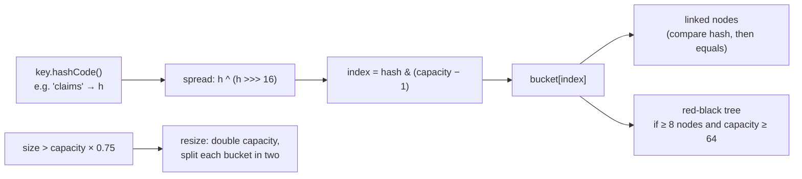
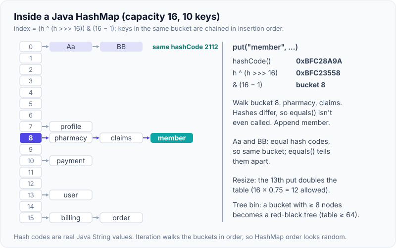
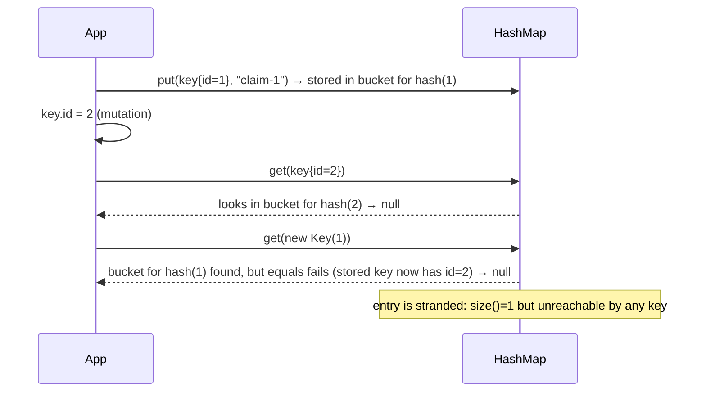
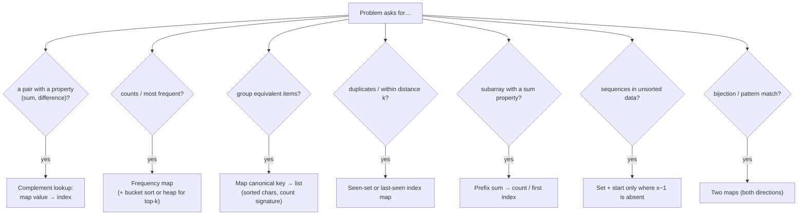

# Hashing Patterns

!!! abstract "Key takeaways"
    - A **hash map** gives expected **O(1)** insert, lookup and delete by turning a key into a bucket index. In Java's `HashMap`: the key's `hashCode()` is spread (`h ^ (h >>> 16)`), masked to a power-of-two table, collisions are chained in buckets, the table **doubles** when size > capacity × **0.75**, and since Java 8 a bucket with **≥ 8** entries (table ≥ 64) becomes a **red-black tree**.
    - **The contract:** equal objects must have equal hash codes, and keys must not change while in the map. Measured: a key mutated after `put` became **unfindable** (`get` returned null for both the mutated key and an equal fresh one, size still 1). `equals` without `hashCode` let a `HashSet` hold **two "equal" objects**. Records generate both correctly.
    - **Collisions:** 50,000 inserts took **11 ms** with good hashes, **58 ms** with a constant hash on `Comparable` keys (tree bins give O(log n)), and **19,162 ms** with a constant hash on non-`Comparable` keys (effectively O(n) per operation) (measured).
    - **Patterns:**
        - Complement lookup (two sum, O(n)).
        - Frequency counting (`merge(k, 1, Integer::sum)`).
        - Grouping by a canonical key (anagrams: sorted letters or a count signature).
        - Seen-set and last-seen index (duplicates within distance k).
        - Prefix-sum → count maps (subarray sum k).
        - Bucket sort by frequency (top-k in O(n)).
        - Set-based sequence building (longest consecutive sequence in O(n): only start from numbers with no predecessor).
    - **Pick the map by need:** `HashMap` (fast, no order), `LinkedHashMap` (insertion or access order, LRU caches), `TreeMap` (sorted, O(log n), floor/ceiling/range queries), `ConcurrentHashMap` (thread-safe, atomic `compute`/`merge`), `EnumMap` and `BitSet` for small dense keys.

## Why it matters

Hashing is the most common optimisation in coding interviews: it's often the step that turns an O(n²) solution into O(n). Senior Java interviews go further: how `HashMap` works internally, what happens on collisions, the `equals`/`hashCode` contract, why mutable keys break maps, and which map to use for ordering, concurrency or caching. In production the same knowledge prevents subtle bugs (lost entries, memory leaks from keys that never match) and performance issues (bad hash functions, hash-flooding).

All solutions on this page were checked against brute force on 2,000 random inputs each (8,000 checks), and the internals demos were run on Java 21.

## Core concepts

### How a HashMap works


*Notice that `equals` is only called on keys in the same bucket with the same hash. A good `hashCode` keeps buckets short, which is what makes lookups O(1) on average.*

{ loading=lazy }
*Notice that three unrelated keys share bucket 8, and that walking the chain compares hashes first, so equals() runs only for keys like Aa and BB whose hash codes are equal.*

- **Default capacity** is 16 (allocated lazily on the first put) and the **load factor** 0.75, so the first resize happens at the 13th entry. Each resize is O(n) but rare (doubling), so puts are amortised O(1). Presize with `HashMap.newHashMap(expected)` (Java 19+) or `new HashMap<>((int) (expected / 0.75f) + 1)`.
- **Spreading** XORs the high bits into the low bits because the index uses only the low bits of the hash.
- **Tree bins (JEP 180):** a long bucket becomes a balanced tree ordered by hash, then by `compareTo` if keys are `Comparable`. That bounds the worst case at O(log n). Non-comparable keys with identical hashes can't be ordered usefully, so the tree must search both sides: effectively linear.
- **Null:** `HashMap` allows one null key and null values. `ConcurrentHashMap`, `Map.of` and `TreeMap` (natural ordering) reject null keys.
- **Iteration order** of `HashMap` is unspecified and can change after resizes. `Map.of`/`Set.of` deliberately randomise their iteration order per JVM run (measured: `[b, c, d, a]` for keys inserted a–d).

### The equals/hashCode contract

1. If `a.equals(b)`, then `a.hashCode() == b.hashCode()`.
2. Unequal objects may share a hash code (collisions are allowed: `"Aa"` and `"BB"` both hash to 2112, measured).
3. `hashCode` must be consistent while the fields used by `equals` don't change.


*Notice that the entry is lost both ways: the new hash points to a different bucket, and the old bucket's key no longer equals anything with id 1. This is a classic memory leak in long-lived caches.*

Measured violations:

| Bug | Result |
|---|---|
| Key mutated after `put` | `get(key)` = null, `get(new Key(1))` = null, `containsKey` = false, `size()` = 1 |
| `equals` overridden, `hashCode` not | `HashSet` held 2 "equal" objects; `contains(new NoHash(1))` = false |
| `record Point(int x, int y)` as key | `contains(new Point(1, 2))` = true (records generate `equals` and `hashCode` from all components) |

**Rules:** use immutable keys (`String`, boxed numbers, records with immutable components, enums). Build `hashCode` from the same fields as `equals` (`Objects.hash(...)` or record defaults). Never use mutable collections as keys.

### Collision cost, measured

| Keys (50,000) | Insert | 5,000 lookups | Why |
|---|---|---|---|
| `Integer` (good hash) | 11.3 ms | 0.5 ms | Short buckets, O(1) expected |
| Constant `hashCode`, `Comparable` | 57.6 ms | 7.9 ms | One treeified bucket, ordered by `compareTo`: O(log n) |
| Constant `hashCode`, not `Comparable` | **19,162 ms** | **2,279 ms** | Tree can't order keys: effectively O(n) per operation, O(n²) total |

This is why hash-flooding attacks worked against web frameworks that put request parameters in hash maps, and why your `hashCode` should mix all significant fields.

### Core patterns


*Notice that each pattern stores exactly the information needed to answer "have I seen what I need?" in O(1), which replaces an inner loop.*

{ loading=lazy }
*Watch the order inside each step: look up the complement first, then insert. That's what stops an element pairing with itself.*

| Pattern | Classic problems | Complexity |
|---|---|---|
| Complement lookup | Two sum (original indices), pairs with difference k | O(n) time, O(n) space |
| Frequency map | Valid anagram, first unique character, majority element, ransom note | O(n) |
| Canonical key grouping | Group anagrams, group shifted strings | O(n·k log k) with sorting, O(n·k) with count keys |
| Seen-set / last index | Contains duplicate, duplicate within distance k, longest substring without repeats | O(n) |
| Prefix sum map | Subarray sum equals k, longest subarray with sum k, contiguous array | O(n) |
| Bucket sort by frequency | Top-k frequent elements, sort characters by frequency | O(n) |
| Set sequences | Longest consecutive sequence | O(n) |
| Two-way maps | Isomorphic strings, word pattern | O(n) |
| Hash + linked list | LRU cache (`LinkedHashMap` with access order) | O(1) per operation |

**Integer arrays as maps:** when keys are small and dense (lowercase letters, ASCII, ids 0..n), `int[26]`/`int[128]` or `BitSet` beat `HashMap` (no hashing, no boxing).

### Which map or set?

| Need | Use | Cost |
|---|---|---|
| Fastest lookup, no order | `HashMap` / `HashSet` | O(1) expected |
| Predictable iteration (insertion order) | `LinkedHashMap` / `LinkedHashSet` | O(1), more memory |
| LRU cache | `LinkedHashMap(cap, 0.75f, true)` + `removeEldestEntry` | O(1) |
| Sorted keys, floor/ceiling, ranges | `TreeMap` / `TreeSet` | O(log n) |
| Concurrent access | `ConcurrentHashMap` (`compute`, `merge` are atomic per key) | O(1) expected |
| Enum keys | `EnumMap` / `EnumSet` | Array-backed, very fast |
| Small dense int keys | `int[]`, `BitSet` | O(1), no boxing |
| Immutable constants | `Map.of`, `Set.of`, `Map.copyOf` | No nulls, randomised order |

Measured iteration order for keys inserted as pharmacy, claims, profile, billing: `HashMap` gave `[profile, pharmacy, claims, billing]`, `LinkedHashMap` `[pharmacy, claims, profile, billing]`, `TreeMap` `[billing, claims, pharmacy, profile]`.

## In practice: code & configuration

### Two sum (original indices)

=== "❌ O(n²) pairs"

    ```java
    static int[] twoSum(int[] a, int target) {
        for (int i = 0; i < a.length; i++)
            for (int j = i + 1; j < a.length; j++)
                if (a[i] + a[j] == target) return new int[]{i, j};
        return new int[0];
    }
    ```

=== "✅ O(n) complement map"

    ```java
    static int[] twoSum(int[] a, int target) {
        Map<Integer, Integer> indexOf = new HashMap<>();
        for (int i = 0; i < a.length; i++) {
            Integer j = indexOf.get(target - a[i]);   // have we seen the complement?
            if (j != null) return new int[]{j, i};
            indexOf.put(a[i], i);                     // insert after checking: no self-pairing
        }
        return new int[0];
    }
    ```

### Group anagrams

```java
static List<List<String>> groupAnagrams(String[] words) {
    Map<String, List<String>> groups = new HashMap<>();
    for (String w : words) {
        int[] count = new int[26];
        for (char c : w.toCharArray()) count[c - 'a']++;
        String key = Arrays.toString(count);          // canonical signature, O(k) instead of O(k log k) sort
        groups.computeIfAbsent(key, k -> new ArrayList<>()).add(w);
    }
    return new ArrayList<>(groups.values());
}
// ["eat","tea","tan","ate","nat","bat"] → [[eat, tea, ate], [bat], [tan, nat]] (group order unspecified)
```

### Top-k frequent with bucket sort

```java
static int[] topKFrequent(int[] a, int k) {
    Map<Integer, Integer> freq = new HashMap<>();
    for (int x : a) freq.merge(x, 1, Integer::sum);           // frequency count

    @SuppressWarnings("unchecked")
    List<Integer>[] buckets = new List[a.length + 1];          // index = frequency (max n)
    freq.forEach((value, count) -> {
        if (buckets[count] == null) buckets[count] = new ArrayList<>();
        buckets[count].add(value);
    });

    int[] result = new int[k];
    int i = 0;
    for (int c = a.length; c > 0 && i < k; c--)                // highest frequency first
        if (buckets[c] != null)
            for (int v : buckets[c]) if (i < k) result[i++] = v;
    return result;
}
// O(n) time and space. A min-heap of size k gives O(n log k); see Heaps & priority queues.
```

### Longest consecutive sequence

```java
static int longestConsecutive(int[] a) {
    Set<Integer> set = new HashSet<>();
    for (int x : a) set.add(x);
    int best = 0;
    for (int x : set) {
        if (set.contains(x - 1)) continue;        // only start counting at the beginning of a run
        int y = x;
        while (set.contains(y + 1)) y++;          // each number is visited by at most one inner loop
        best = Math.max(best, y - x + 1);
    }
    return best;
}
// O(n) expected despite the nested loop; sorting would be O(n log n)
```

### Duplicate within distance k, isomorphic strings

```java
static boolean containsNearbyDuplicate(int[] a, int k) {
    Map<Integer, Integer> lastIndex = new HashMap<>();
    for (int i = 0; i < a.length; i++) {
        Integer prev = lastIndex.put(a[i], i);         // put returns the previous value
        if (prev != null && i - prev <= k) return true;
    }
    return false;
}

static boolean isIsomorphic(String s, String t) {
    Map<Character, Character> st = new HashMap<>(), ts = new HashMap<>();
    for (int i = 0; i < s.length(); i++) {
        char a = s.charAt(i), b = t.charAt(i);
        if (st.getOrDefault(a, b) != b || ts.getOrDefault(b, a) != a) return false; // both directions
        st.put(a, b);
        ts.put(b, a);
    }
    return true;
}
// "egg"/"add" true, "foo"/"bar" false, "badc"/"baba" false (needs the reverse map)
```

### Keys done right

=== "❌ Mutable key, missing hashCode"

    ```java
    class ClaimKey {                    // mutable, equals without hashCode
        String memberId; LocalDate date;
        @Override public boolean equals(Object o) { /* compares memberId and date */ }
    }
    Map<ClaimKey, Claim> cache = new HashMap<>();
    // Two equal keys land in different buckets; mutating a stored key strands the entry
    ```

=== "✅ Immutable record key"

    ```java
    record ClaimKey(String memberId, LocalDate date) {}   // equals + hashCode from both fields

    Map<ClaimKey, Claim> cache = new HashMap<>();
    cache.put(new ClaimKey("M1", LocalDate.of(2026, 1, 5)), claim);
    cache.get(new ClaimKey("M1", LocalDate.of(2026, 1, 5)));  // found
    ```

### Frequency counting idioms and safe removal

```java
Map<String, Integer> counts = new HashMap<>();
for (String w : words) counts.merge(w, 1, Integer::sum);       // insert 1 or add 1

Map<String, List<Claim>> byMember = claims.stream()
    .collect(Collectors.groupingBy(Claim::memberId));          // grouping

// Removing during iteration: map.remove inside a for-each threw ConcurrentModificationException (measured)
counts.keySet().removeIf(k -> counts.get(k) < 2);              // safe
counts.entrySet().removeIf(e -> e.getValue() < 2);             // also safe

// Concurrent counting
ConcurrentHashMap<String, LongAdder> hits = new ConcurrentHashMap<>();
hits.computeIfAbsent(path, p -> new LongAdder()).increment();  // atomic and low-contention
```

## Real-world usage

- **Caches:** in-process caches (Caffeine, `LinkedHashMap` LRU) and distributed ones (Redis is a giant hash table) rely on stable keys: the record-key rule matters for cache hit rates.
- **Deduplication and idempotency:** a seen-set of message or request IDs (in memory, Redis `SETNX` or a unique database constraint) makes Kafka consumers and payment APIs idempotent.
- **Joins:** a hash join builds a hash table on the smaller input and probes it with the larger, the database version of index-then-lookup.
- **Partitioning:** Kafka partitions keys by hash (murmur2 of the key modulo partitions), and consistent hashing spreads cache keys across nodes with minimal movement when nodes change.
- **Security:** hash-flooding (CVE-2011-4858 for Tomcat and similar for other platforms) made request parsing O(n²). Mitigations were parameter-count limits, randomised hashing in some languages, and Java 8 tree bins.

## Trade-offs & production gotchas

!!! warning "Hashing pitfalls"
    - **Mutable keys** or keys whose `hashCode` changes: stranded entries and memory leaks (measured).
    - **`equals` without `hashCode`:** "duplicate" entries in sets (measured). Records or IDE-generated pairs avoid this.
    - **Poor hash functions** (constant, or only using one field): long buckets, up to O(n) per operation for non-comparable keys (measured 19 s for 50k inserts).
    - **Relying on `HashMap` iteration order:** it's unspecified and changes with capacity. Use `LinkedHashMap` or `TreeMap`.
    - **Modifying a map while iterating:** `ConcurrentModificationException` (measured). Use `removeIf` or an iterator's `remove`.
    - **`HashMap` shared across threads:** lost updates and corrupted state. Use `ConcurrentHashMap`, and use its atomic `compute`/`merge`, not `get` then `put`.
    - **Boxing overhead:** `HashMap<Integer, Integer>` allocates objects. For dense int keys use arrays, for heavy workloads primitive collections (fastutil, Eclipse Collections).
    - **Unbounded maps as caches:** memory leaks. Use size or time-bounded caches (Caffeine).

- **Hash vs tree:** hashing is O(1) expected but unordered. Trees are O(log n) with ordering and range queries, and predictable worst cases.
- **Time vs memory:** a hash set uses far more memory per element than a sorted primitive array. For memory-bound workloads, sort + binary search may be better.

## How this connects to my experience

- **Not a resume item as DSA.** Hashing shows up directly in backend work.
- **Honest bridges:** Redis caching at OptumRx (key design is the same equals/hashCode discipline at the cache level), Kafka partitioning by key, and idempotent consumers with retry and DLQ handling (seen-set or unique constraints for deduplication). Key lookups by ID in a GraphQL aggregation layer use the index-then-lookup pattern. *[confirm: how cache keys were built, how duplicates were detected in Kafka consumers]*
- **Talking points:**
    - "Whenever I see an inner loop that searches, I ask what I'd need to have stored to answer it in O(1). That's usually a map."
    - "Keys must be immutable with consistent equals and hashCode. I use records for composite keys."
    - "For concurrency I use ConcurrentHashMap with compute or merge, never get-then-put."

## Interview questions

### Fundamentals

??? question "Q1. How does Java's HashMap work internally?"
    **Answer:** An array of buckets (power-of-two capacity, default 16, allocated on the first put). On `put`, the key's `hashCode` is spread (`h ^ (h >>> 16)`) and masked with `capacity − 1` to pick a bucket. The bucket holds a linked list of nodes. Lookup compares the stored hash first, then `equals`. When size exceeds capacity × load factor (0.75), the table doubles and nodes are redistributed (each bucket splits into two). Since Java 8, a bucket with 8 or more nodes (in a table of at least 64) becomes a red-black tree, so the worst case is O(log n) for comparable keys. Expected O(1) for get and put, amortised for resizes.

    **Interviewer listens for:** buckets, spreading, equals after hash, load factor and resize, tree bins.

    **Common wrong answer:** "It's a binary search tree of keys" or "it's always O(1)."

??? question "Q2. What is the equals/hashCode contract, and what breaks if you violate it?"
    **Answer:** Equal objects must have equal hash codes, and both must be consistent while the object is used as a key. Collisions between unequal objects are allowed. If you override `equals` but not `hashCode`, equal objects usually land in different buckets: a `HashSet` held two "equal" objects and `contains` returned false (measured). If a key's fields change after insertion, its hash points to another bucket and the stored entry can't be found by any key (measured: `get` null both ways, size 1), which leaks memory. Use immutable keys, records, or generate both methods from the same fields.

    **Interviewer listens for:** both directions of the contract, concrete failure modes, immutability.

    **Common wrong answer:** "Unequal objects must have different hash codes."

??? question "Q3. Solve two sum in O(n), returning the original indices."
    **Answer:** One pass with a map from value to index. For each element, check whether `target − a[i]` is already in the map; if so, return both indices; otherwise put `a[i] → i`. Checking before inserting prevents pairing an element with itself, and handles duplicates (`[3, 3]`, target 6). O(n) time, O(n) space. Sorting + two pointers is O(n log n) and loses indices unless you sort index pairs.

    **Interviewer listens for:** check-then-insert, duplicates, why not sort.

    **Common wrong answer:** Inserting first and returning `[i, i]` for `a[i] * 2 == target`.

??? question "Q4. HashMap, LinkedHashMap, TreeMap, ConcurrentHashMap: when do you use each?"
    **Answer:** `HashMap` for the fastest unordered lookups. `LinkedHashMap` when iteration order must be predictable (insertion order) or for LRU caches (access order + `removeEldestEntry`). `TreeMap` for sorted keys and navigation (`floorKey`, `ceilingKey`, `subMap`), O(log n). `ConcurrentHashMap` for shared mutable maps across threads, with atomic per-key `compute`/`merge`/`computeIfAbsent`. Measured iteration orders differed exactly as expected: unspecified, insertion and sorted. Also `EnumMap` for enum keys and `Map.of` for immutable constants (no nulls, randomised order).

    **Interviewer listens for:** ordering, navigation, concurrency, LRU.

    **Common wrong answer:** "Use `Collections.synchronizedMap` or Hashtable for concurrency" (works but coarse-grained), or "HashMap keeps insertion order."

### Intermediate

??? question "Q5. Group a list of words into anagram groups."
    **Answer:** Map each word to a canonical key shared by all its anagrams, and group with `computeIfAbsent(key, k -> new ArrayList<>()).add(word)`. The key can be the sorted characters (O(k log k) per word) or a 26-count signature (O(k) per word, e.g. `Arrays.toString(count)`). Total O(n·k log k) or O(n·k). Example output: `[[eat, tea, ate], [bat], [tan, nat]]`. Ask about character set and case; for Unicode use sorted code points or a map-based signature.

    **Interviewer listens for:** canonical key idea, two key options and their costs.

    **Common wrong answer:** Comparing every pair of words for anagram-ness (O(n²·k)).

??? question "Q6. Find the k most frequent elements. Can you beat O(n log n)?"
    **Answer:** Count frequencies with a hash map (O(n)). Then either use a min-heap of size k (O(n log k)), or bucket sort: an array of lists indexed by frequency (frequencies are at most n), walked from high to low until k elements are collected, which is O(n) time and space. Quickselect on the distinct elements by frequency is O(n) average. Clarify tie-breaking and whether output order matters.

    **Interviewer listens for:** frequency map + heap or buckets, complexity comparison, ties.

    **Common wrong answer:** Sorting all entries by frequency and claiming O(n).

??? question "Q7. Find the length of the longest consecutive sequence in an unsorted array in O(n)."
    **Answer:** Put all numbers in a hash set. For each number x, only start counting if `x − 1` isn't in the set (x starts a run), then extend while `x + 1, x + 2, …` are present. Each number is part of exactly one run and is visited by at most one inner loop, so the total is O(n) expected even though the loop looks nested. Iterate over the set, not the array, to avoid repeated work on duplicates. Sorting gives O(n log n).

    **Interviewer listens for:** start-of-run check, amortised argument, iterate the set.

    **Common wrong answer:** Extending from every element (O(n²) in the worst case).

??? question "Q8. What happens to HashMap performance when many keys collide?"
    **Answer:** Colliding keys share a bucket, so operations scan more nodes. Before Java 8 that was a linked list, O(n) per operation in the worst case. Since Java 8, a bucket of 8 or more nodes becomes a red-black tree ordered by hash and then `compareTo` for `Comparable` keys, giving O(log n). Measured for 50,000 keys with a constant hash: 58 ms for comparable keys vs 19,162 ms for non-comparable ones (versus 11 ms with good hashes). Non-comparable keys with identical hashes can't be ordered, so the tree degrades to scanning. Fix the hash function: mix all fields used in `equals`.

    **Interviewer listens for:** list vs tree bins, Comparable requirement, measured magnitude, fixing the hash.

    **Common wrong answer:** "Collisions don't matter because Java handles them."

### Senior

??? question "Q9. Implement an LRU cache with O(1) get and put."
    **Answer:** Combine a hash map (key → node) with a doubly linked list ordered by recency. `get`: look up the node, move it to the front, return the value. `put`: update and move to the front, or insert at the front and, if over capacity, remove the tail node and its map entry. All O(1). In Java, `LinkedHashMap` with `accessOrder = true` and an overridden `removeEldestEntry(e) { return size() > capacity; }` does this in a few lines. For concurrency, use Caffeine (better hit rates with W-TinyLFU), or synchronise, since `LinkedHashMap` isn't thread-safe and even `get` mutates order.

    **Interviewer listens for:** map + doubly linked list, `LinkedHashMap` shortcut, thread safety.

    **Common wrong answer:** Using a queue and scanning it to move items (O(n)).

??? question "Q10. How do you count word frequencies safely across threads?"
    **Answer:** Use `ConcurrentHashMap` with an atomic per-key update: `map.merge(word, 1L, Long::sum)` or `map.computeIfAbsent(word, k -> new LongAdder()).increment()` (LongAdder reduces contention on hot keys). Avoid `get` then `put` (a race that loses updates) and plain `HashMap` (corruption). For bulk processing, parallel streams with `Collectors.groupingByConcurrent(..., counting())`, or per-thread maps merged at the end (no contention), are good options. `ConcurrentHashMap` doesn't allow null keys or values.

    **Interviewer listens for:** atomic compute/merge, LongAdder, check-then-act race.

    **Common wrong answer:** "Wrap the increments in synchronized blocks on the HashMap" (works, but coarse) or "volatile map".

??? question "Q11. You need to check whether a string matches a pattern like \"abba\" ↔ \"dog cat cat dog\". What's the pitfall?"
    **Answer:** You need a bijection, so map both directions: pattern char → word and word → pattern char. A single map accepts `"abba"` vs `"dog dog dog dog"` (a→dog, b→dog) because it doesn't detect two pattern letters mapping to the same word. Check lengths first, then for each position verify both maps agree, inserting as you go. O(n) time, O(distinct) space. The same applies to isomorphic strings (`"badc"`/`"baba"` fails only with the reverse map, verified).

    **Interviewer listens for:** bijection, two maps, length check.

    **Common wrong answer:** One map from pattern to word.

??? question "Q12. When would you not use a hash map?"
    **Answer:** When you need ordering or range queries (`TreeMap`, sorted arrays), when keys are small dense integers or characters (`int[]`, `BitSet`: no hashing or boxing), when memory is tight (a sorted primitive array with binary search uses much less memory than `HashSet<Integer>`), when worst-case latency matters more than average (balanced trees have guaranteed O(log n)), when the data is tiny (a linear scan of 8 items is fine), or when keys are untrusted and the hash isn't collision-resistant (bound the size, or use a tree map).

    **Interviewer listens for:** ordering, dense keys, memory, worst case, adversarial input.

    **Common wrong answer:** "Hash maps are always best because they're O(1)."

### Scenario-based

??? question "Q13. A long-running service's cache map keeps growing and hit rates are low, although the same claims are requested repeatedly. What do you check?"
    **Answer:** Key design first: a key class without proper `equals`/`hashCode` (each request creates a "new" key, so every lookup misses and adds an entry), or a mutable key changed after insertion (stranded entries). Both were reproduced: missing `hashCode` gave duplicate entries, a mutated key made the entry unreachable while size stayed 1. Also check keys including volatile fields (timestamps, request IDs), case or whitespace differences, and an unbounded map with no eviction. Fix with record keys built from the identifying fields only, normalisation, and a bounded cache (Caffeine with size and TTL) with hit-rate metrics.

    **Interviewer listens for:** equals/hashCode and mutability, volatile key fields, bounding and metrics.

    **Common wrong answer:** "Increase the heap size."

??? question "Q14. A Kafka consumer occasionally processes the same payment message twice after rebalances. How do you use hashing to make it idempotent?"
    **Answer:** At-least-once delivery means duplicates are expected after rebalances or retries, so deduplicate by a stable message or business key (payment ID, idempotency key). In memory, a seen-set only works per instance and is lost on restart, so use a durable store: a unique constraint on the payment ID in the database written in the same transaction as the effect (insert-if-absent), or Redis `SET key NX EX ttl` checked before processing (with care around failures between check and effect). Bound memory with TTLs matching the retry window. Kafka's idempotent producer and transactions help producer-side duplicates and read-process-write within Kafka, not external side effects.

    **Interviewer listens for:** stable key, durable seen-set (unique constraint/SETNX), atomicity with the effect, TTL.

    **Common wrong answer:** "Use a HashSet in the consumer."

## Cheat sheet

| Topic | Remember |
|---|---|
| HashMap internals | Buckets, spread `h ^ h>>>16`, index `hash & (cap−1)`, load 0.75, doubles, tree bins at 8 (cap ≥ 64) |
| Contract | equals ⇒ same hash; immutable keys; records do it right |
| Measured bugs | Mutated key → unreachable entry; equals w/o hashCode → duplicates |
| Collisions (50k) | Good 11 ms · constant+Comparable 58 ms · constant non-Comparable 19,162 ms |
| Patterns | Complement, frequency, canonical key, seen/last index, prefix-sum map, bucket top-k, set sequences, two-way maps |
| Choose | HashMap · LinkedHashMap (order, LRU) · TreeMap (sorted, ranges) · ConcurrentHashMap (atomic merge) · EnumMap · int[]/BitSet |
| Idioms | `merge(k,1,Integer::sum)`, `computeIfAbsent`, `removeIf`, `groupingBy` |
| Pitfalls | Iteration order, CME on removal, get-then-put races, boxing, unbounded caches |

## Sources
1. [Java SE 21 API: HashMap](https://docs.oracle.com/en/java/javase/21/docs/api/java.base/java/util/HashMap.html), [Object.hashCode / equals](https://docs.oracle.com/en/java/javase/21/docs/api/java.base/java/lang/Object.html#hashCode()), [LinkedHashMap](https://docs.oracle.com/en/java/javase/21/docs/api/java.base/java/util/LinkedHashMap.html), [ConcurrentHashMap](https://docs.oracle.com/en/java/javase/21/docs/api/java.base/java/util/concurrent/ConcurrentHashMap.html).
2. [JEP 180: Handle Frequent HashMap Collisions with Balanced Trees](https://openjdk.org/jeps/180).
3. OpenJDK `java.util.HashMap` source (implementation notes on spreading, treeification thresholds).
4. Joshua Bloch, *Effective Java* (3rd ed.), Items 10–11 (equals and hashCode).
5. Crosby & Wallach, *Denial of Service via Algorithmic Complexity Attacks* (USENIX Security 2003), and the 2011 hash-flooding disclosures (oCERT-2011-003).
6. Cormen, Leiserson, Rivest, Stein, *Introduction to Algorithms* (4th ed.), hash tables chapter.
7. [Caffeine cache](https://github.com/ben-manes/caffeine).
8. Demonstrations on this page: Java 21, each solution checked against a brute force on 2,000 random inputs (8,000 checks), collision timings from single runs, run while writing this page.
