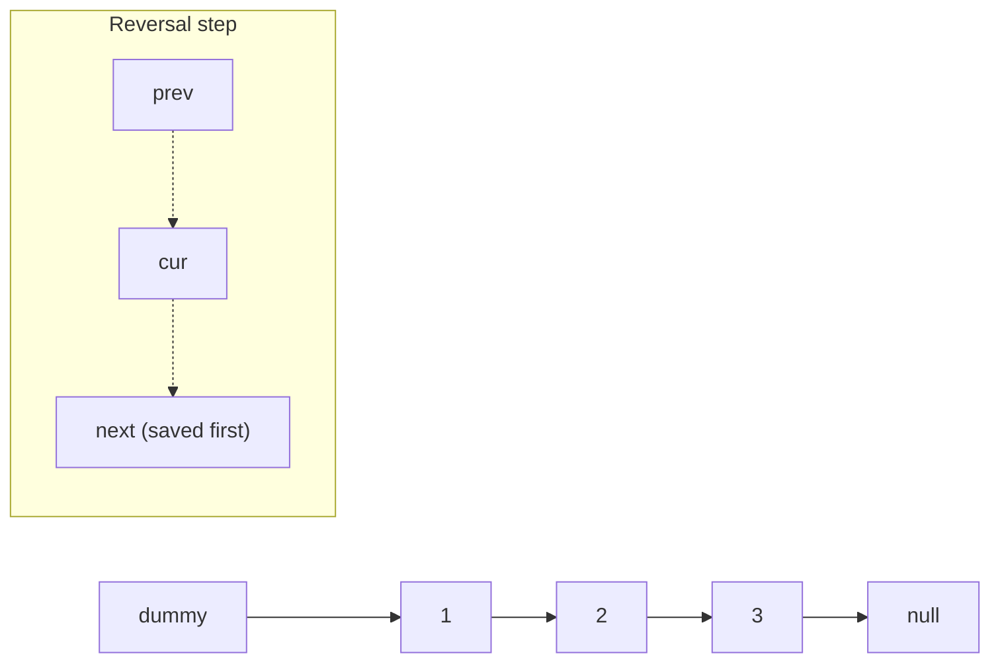
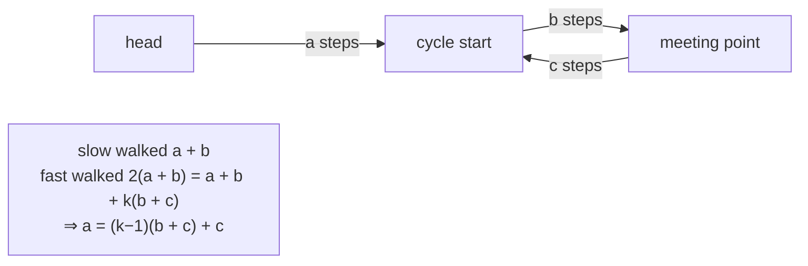
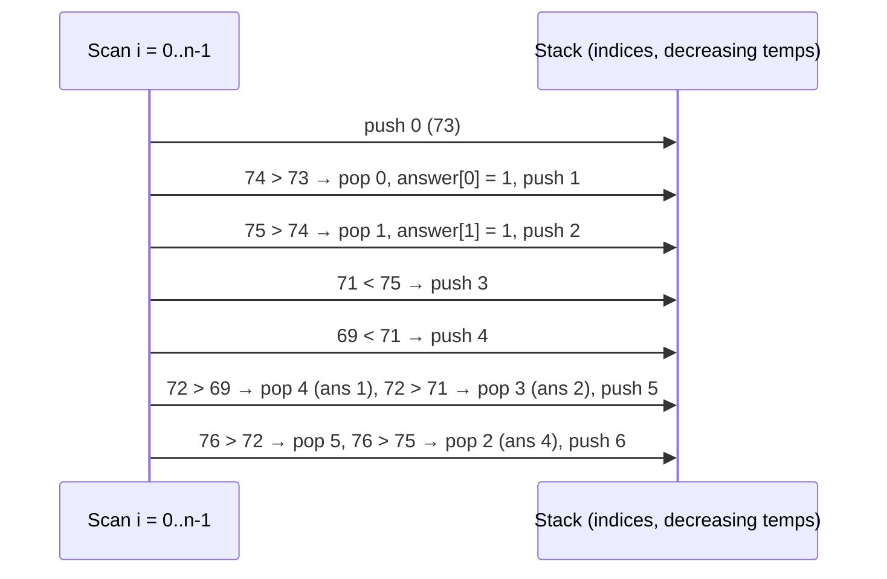

# Linked Lists, Stacks & Queues

!!! abstract "Key takeaways"
    - **Linked lists** trade O(1) insertion and removal at a known node for O(n) access by index. Interview techniques:
        - A **dummy head** removes edge cases at the front.
        - **Iterative reversal** uses three pointers: `prev`, `cur`, `next`.
        - **Fast/slow pointers** find the middle, detect cycles (Floyd) and find the cycle start.
        - A **gap of n** between two pointers removes the nth node from the end in one pass.
        - **Merging** two sorted lists uses a tail pointer.
    - **Stacks** (LIFO) handle nesting and "most recent unmatched" problems: bracket matching, undo, expression evaluation, DFS. **Monotonic stacks** answer "next greater/smaller element" for every index in O(n): daily temperatures, largest rectangle in a histogram.
    - **Queues** (FIFO) handle order of arrival: BFS, task scheduling, buffering. **Deques** support both ends. A **monotonic deque** gives sliding-window maximum in O(n). A queue built from two stacks is amortised O(1).
    - **In Java use `ArrayDeque`** for stacks and queues. Measured with 5M push+pop: `ArrayDeque` **198 ms**, legacy `Stack` 565 ms, `LinkedList` 1,664 ms. Draining 100k items from the front: `ArrayList.remove(0)` **449 ms** (O(n) each) vs `ArrayDeque.poll` **12.7 ms**. `ArrayDeque` rejects nulls.
    - **Recursion depth:** recursive list reversal worked for 10,000 nodes and threw **`StackOverflowError` at 100,000** with default settings (measured), so prefer iteration on lists.

## Why it matters

Linked-list problems test pointer manipulation and careful edge-case handling under pressure. Stack and queue problems test whether you recognise LIFO/FIFO structure in a problem, and monotonic stacks are a favourite "medium/hard" pattern. In Java interviews you're also expected to know which collection to use (`ArrayDeque`, not `Stack` or `LinkedList`) and why. In production these structures appear as LRU caches (hash map + doubly linked list), work queues, BFS over dependency graphs, and parsers.

All solutions on this page passed 18,000 randomised checks against brute-force or reference implementations on Java 21.

## Core concepts

### Linked lists


*Notice the dummy node in front of the real head. Operations that may change the head (insert at front, delete the first node, merge) can always work on `dummy.next` and return it, with no special case.*

| Operation | Singly linked | Doubly linked | Array / ArrayList |
|---|---|---|---|
| Access index i | O(n) | O(n) | O(1) |
| Insert/remove at head | O(1) | O(1) | O(n) |
| Insert/remove at tail | O(n) without tail pointer, O(1) with | O(1) | O(1) amortised |
| Insert/remove at a known node | O(1) after the predecessor | O(1) | O(n) |
| Memory | +1 pointer per node | +2 pointers per node | Compact, cache-friendly |

Arrays usually win in practice because of cache locality and fewer allocations. Linked lists win when you hold node references and splice often (LRU caches, free lists, the JDK's `LinkedHashMap` ordering).

**Core techniques:**

- **Dummy head:** `ListNode dummy = new ListNode(0); dummy.next = head; … return dummy.next;`
- **Reversal:** save `next`, point `cur.next` to `prev`, advance both. O(n) time, O(1) space. The recursive version uses O(n) stack.
- **Fast/slow pointers:** slow moves 1, fast moves 2. When fast reaches the end, slow is at the middle (the second middle for even lengths).
- **Floyd's cycle detection:** if there's a cycle, fast eventually meets slow inside it. To find the cycle start, reset one pointer to the head and move both one step at a time. They meet at the start, because the distance from the head to the start equals the distance from the meeting point to the start (modulo the cycle length).
- **Two pointers with a gap:** advance `fast` n+1 steps from the dummy, then move both until `fast` is null. `slow.next` is the node to remove.
- **Merge:** a tail pointer appends the smaller head each step, then attaches the remainder.


*Notice the conclusion `a = c` modulo the cycle length: a pointer from the head and a pointer from the meeting point, both moving one step, arrive at the cycle start together.*

### Stacks

A stack is last in, first out. It fits problems where the most recent unfinished thing must be resolved first:

- **Matching brackets:** push the expected closer for each opener, pop and compare on each closer, and require an empty stack at the end.
- **Expression evaluation:** Reverse Polish notation directly. Infix via the shunting-yard algorithm (operator precedence) or two stacks.
- **Min stack:** store `(value, minSoFar)` pairs so `getMin` is O(1).
- **Undo/redo, browser history, call stacks, iterative DFS.**

**Monotonic stack:** keep indices whose values are increasing (or decreasing). When a new element breaks the order, pop. Each popped index has just found its "next greater" (or smaller) element. Every index is pushed and popped once, so O(n).


*Notice that each index waits on the stack until a warmer day arrives, and leaves exactly once. That's why the double loop is O(n).*

Uses: next greater element, daily temperatures, stock span, largest rectangle in a histogram (for each bar, the nearest smaller bars on both sides bound its rectangle), trapping rain water, removing k digits to make the smallest number.

### Queues and deques

- **Queue (FIFO):** BFS (level by level), producer/consumer buffers, round-robin scheduling, rate-limited work queues.
- **Deque:** add and remove at both ends. Works as a stack and a queue.
- **Queue from two stacks:** push to `in`. To pop, if `out` is empty, move everything from `in` to `out` (reversing order), then pop `out`. Each element moves at most once, so amortised O(1).
- **Monotonic deque (sliding-window maximum):** keep indices with decreasing values. Drop the front when it leaves the window, drop from the back while smaller than the new element. The front is always the window maximum. O(n) total.
- **Priority queue:** not FIFO. Ordered by priority (a heap), covered in [Heaps & priority queues](06-heaps-and-priority-queues.md).
- **Circular buffer:** a fixed-size array with head and tail indices modulo capacity (how `ArrayDeque` works internally, growing when full).

### Java classes

| Need | Use | Avoid | Why |
|---|---|---|---|
| Stack | `ArrayDeque` (`push`/`pop`/`peek`) | `Stack` | `Stack` extends synchronized `Vector` (slower, measured 565 vs 198 ms) |
| Queue | `ArrayDeque` (`offer`/`poll`/`peek`) | `LinkedList` | `LinkedList` allocates a node per element and has poor locality (1,664 ms) |
| Deque | `ArrayDeque` | | Circular array, amortised O(1) at both ends |
| Remove from front of a list | `ArrayDeque.poll` | `ArrayList.remove(0)` | O(n) shift per removal (449 ms vs 12.7 ms for 100k) |
| Concurrent producer/consumer | `ArrayBlockingQueue`, `LinkedBlockingQueue` | Synchronising an `ArrayDeque` by hand | Blocking `put`/`take`, bounded capacity for back-pressure |
| Lock-free queue | `ConcurrentLinkedQueue` / `ConcurrentLinkedDeque` | | Non-blocking |
| Priority | `PriorityQueue` / `PriorityBlockingQueue` | | Heap |

`ArrayDeque` doesn't allow `null` elements (measured `NullPointerException`), because `null` is its "empty" signal for `poll`/`peek`.

## In practice: code & configuration

### Reverse a linked list

=== "❌ Recursive on long lists"

    ```java
    static ListNode reverse(ListNode h) {
        if (h == null || h.next == null) return h;
        ListNode newHead = reverse(h.next);   // one stack frame per node
        h.next.next = h;
        h.next = null;
        return newHead;
    }
    // O(n) stack: StackOverflowError at 100,000 nodes with default settings (measured)
    ```

=== "✅ Iterative, O(1) space"

    ```java
    static ListNode reverse(ListNode head) {
        ListNode prev = null, cur = head;
        while (cur != null) {
            ListNode next = cur.next;   // save before overwriting
            cur.next = prev;            // flip the pointer
            prev = cur;                 // advance
            cur = next;
        }
        return prev;                    // new head
    }
    ```

### Fast/slow pointers: middle, cycle, cycle start

```java
static ListNode middle(ListNode h) {
    ListNode slow = h, fast = h;
    while (fast != null && fast.next != null) { slow = slow.next; fast = fast.next.next; }
    return slow;                                   // second middle for even length
}

static ListNode cycleStart(ListNode h) {
    ListNode slow = h, fast = h;
    while (fast != null && fast.next != null) {
        slow = slow.next;
        fast = fast.next.next;
        if (slow == fast) {                        // inside the cycle
            ListNode p = h;
            while (p != slow) { p = p.next; slow = slow.next; } // meet at the start
            return p;
        }
    }
    return null;                                   // no cycle
}
// O(n) time, O(1) space; a HashSet of visited nodes is O(n) space
```

### Merge two sorted lists, remove nth from end

```java
static ListNode merge(ListNode a, ListNode b) {
    ListNode dummy = new ListNode(0), tail = dummy;
    while (a != null && b != null) {
        if (a.val <= b.val) { tail.next = a; a = a.next; }   // <= keeps it stable
        else               { tail.next = b; b = b.next; }
        tail = tail.next;
    }
    tail.next = (a != null) ? a : b;                         // attach the remainder
    return dummy.next;
}

static ListNode removeNthFromEnd(ListNode head, int n) {
    ListNode dummy = new ListNode(0);
    dummy.next = head;
    ListNode fast = dummy, slow = dummy;
    for (int i = 0; i <= n; i++) fast = fast.next;   // gap of n+1
    while (fast != null) { fast = fast.next; slow = slow.next; }
    slow.next = slow.next.next;                       // works even when removing the head
    return dummy.next;
}
```

### Stacks: brackets and min stack

```java
static boolean isValid(String s) {
    Deque<Character> stack = new ArrayDeque<>();
    for (char c : s.toCharArray()) {
        switch (c) {
            case '(' -> stack.push(')');           // push the expected closer
            case '[' -> stack.push(']');
            case '{' -> stack.push('}');
            default -> { if (stack.isEmpty() || stack.pop() != c) return false; }
        }
    }
    return stack.isEmpty();                        // unclosed openers fail
}

final class MinStack {
    private final Deque<int[]> stack = new ArrayDeque<>();   // [value, minSoFar]
    void push(int x) { stack.push(new int[]{x, stack.isEmpty() ? x : Math.min(x, stack.peek()[1])}); }
    void pop()       { stack.pop(); }
    int top()        { return stack.peek()[0]; }
    int getMin()     { return stack.peek()[1]; }            // O(1)
}
```

### Monotonic stack: daily temperatures and largest rectangle

=== "❌ O(n²) scan forward from each day"

    ```java
    for (int i = 0; i < t.length; i++)
        for (int j = i + 1; j < t.length; j++)
            if (t[j] > t[i]) { res[i] = j - i; break; }
    ```

=== "✅ O(n) monotonic stack"

    ```java
    static int[] dailyTemperatures(int[] t) {
        int[] res = new int[t.length];
        Deque<Integer> stack = new ArrayDeque<>();        // indices, temperatures decreasing
        for (int i = 0; i < t.length; i++) {
            while (!stack.isEmpty() && t[stack.peek()] < t[i]) {
                int j = stack.pop();
                res[j] = i - j;                           // i is j's next warmer day
            }
            stack.push(i);
        }
        return res;                                       // remaining indices stay 0
    }
    ```

```java
static int largestRectangle(int[] h) {
    Deque<Integer> stack = new ArrayDeque<>();             // indices, heights increasing
    int best = 0;
    for (int i = 0; i <= h.length; i++) {
        int cur = (i == h.length) ? 0 : h[i];              // sentinel 0 flushes the stack
        while (!stack.isEmpty() && h[stack.peek()] >= cur) {
            int height = h[stack.pop()];
            int left = stack.isEmpty() ? -1 : stack.peek(); // nearest smaller on the left
            best = Math.max(best, height * (i - left - 1)); // i is the nearest smaller on the right
        }
        stack.push(i);
    }
    return best;
}
```

### Queues: two stacks and sliding-window maximum

```java
final class MyQueue {
    private final Deque<Integer> in = new ArrayDeque<>(), out = new ArrayDeque<>();
    void push(int x) { in.push(x); }
    int peek() {
        if (out.isEmpty()) while (!in.isEmpty()) out.push(in.pop()); // reverse once
        return out.peek();
    }
    int pop() { peek(); return out.pop(); }    // amortised O(1): each element moves once
    boolean empty() { return in.isEmpty() && out.isEmpty(); }
}

static int[] maxSlidingWindow(int[] a, int k) {
    int[] res = new int[a.length - k + 1];
    Deque<Integer> dq = new ArrayDeque<>();                    // indices, values decreasing
    for (int i = 0; i < a.length; i++) {
        if (!dq.isEmpty() && dq.peekFirst() <= i - k) dq.pollFirst();     // left the window
        while (!dq.isEmpty() && a[dq.peekLast()] <= a[i]) dq.pollLast(); // can never be max again
        dq.offerLast(i);
        if (i >= k - 1) res[i - k + 1] = a[dq.peekFirst()];               // front is the max
    }
    return res;
}
```

## Real-world usage

- **LRU caches:** hash map + doubly linked list (`LinkedHashMap` with access order, Caffeine's internal deques), O(1) move-to-front and eviction.
- **Work queues:** `ThreadPoolExecutor` uses a `BlockingQueue`; a bounded queue gives back-pressure, an unbounded one risks running out of memory. Kafka, SQS and RabbitMQ are distributed queues.
- **BFS and schedulers:** dependency resolution, shortest paths in unweighted graphs, level-order processing.
- **Parsers and interpreters:** stacks for expression evaluation, bracket matching in editors, and the JVM's operand stack.
- **Undo/redo and navigation history:** two stacks.
- **Streaming analytics:** monotonic deques compute rolling max/min in O(1) amortised per event (for example, peak latency over the last minute).

## Trade-offs & production gotchas

!!! warning "Linked list, stack and queue pitfalls"
    - **Losing the rest of the list:** overwrite `cur.next` only after saving it.
    - **Null checks for fast pointers:** `fast != null && fast.next != null` before `fast.next.next`.
    - **Head edge cases:** use a dummy node instead of special-casing the first element.
    - **Recursion on long lists:** stack overflow (measured at 100,000 nodes). Iterate.
    - **`Stack` and `LinkedList` as defaults:** slower than `ArrayDeque` (measured 3× and 8×).
    - **`ArrayList.remove(0)` as a queue:** O(n) per removal (measured 35× slower than `ArrayDeque.poll` for 100k).
    - **`pop()` on an empty deque** throws `NoSuchElementException`; `poll()` returns null. Pick deliberately.
    - **Unbounded work queues** in executors: memory grows under load. Bound them and choose a rejection policy.
    - **Monotonic stack with duplicates:** decide whether to pop on `<` or `<=` to avoid double counting or missed answers.

- **Linked list vs array:** O(1) splicing vs cache locality. Benchmark before choosing a linked list.
- **Blocking vs non-blocking queues:** blocking queues give back-pressure and simple code; lock-free queues have lower latency but need other back-pressure.

## How this connects to my experience

- **Not a resume item as DSA.** The structures show up in backend systems.
- **Honest bridges:** Kafka (an append-only log consumed in order, like a durable queue) with retry topics and a DLQ at OptumRx, thread-pool work queues in Spring Boot services, and LRU-style eviction in Redis caching (Redis uses approximated LRU/LFU). *[confirm: any bounded queue or back-pressure configuration you tuned, e.g. executor queue sizes or consumer concurrency]*
- **Talking points:**
    - "In Java I use ArrayDeque for stacks and queues. Stack and LinkedList are slower and Stack is synchronized for no benefit."
    - "For next-greater or sliding-window max problems I reach for a monotonic stack or deque: each element goes in and out once, so O(n)."

## Interview questions

### Fundamentals

??? question "Q1. When would you choose a linked list over an array, and vice versa?"
    **Answer:** Arrays (and `ArrayList`) give O(1) indexed access, compact memory and good cache locality, with O(n) insertion or removal in the middle and amortised O(1) appends. Linked lists give O(1) insertion and removal at a node you already hold (and at the head), but O(n) access by index, extra memory per node and poor locality. Choose a linked list when you splice nodes you hold references to (LRU caches, free lists). Otherwise arrays usually win in practice. Measured: an indexed loop over a 50k `LinkedList` was thousands of times slower than over an `ArrayList`.

    **Interviewer listens for:** access vs splice trade-off, cache locality, LRU example.

    **Common wrong answer:** "Linked lists are faster for insertions, so use them for lists that change." (Finding the position is O(n).)

??? question "Q2. How do you reverse a singly linked list?"
    **Answer:** Iteratively with three pointers: `prev = null`, `cur = head`. In each step save `next = cur.next`, set `cur.next = prev`, then move `prev = cur` and `cur = next`. When `cur` is null, `prev` is the new head. O(n) time, O(1) space. The recursive version is elegant but uses O(n) stack (it threw `StackOverflowError` at 100,000 nodes with default settings, measured). Edge cases: empty list and a single node.

    **Interviewer listens for:** saving next first, returning prev, iterative over recursive.

    **Common wrong answer:** Copying values into an array and writing them back (O(n) space), or losing the rest of the list.

??? question "Q3. How do you check whether a string of brackets is balanced?"
    **Answer:** Use a stack. For each opener, push the expected closer. For each closer, the stack must be non-empty and its top must equal the closer (pop it). At the end the stack must be empty. O(n) time, O(n) space. Edge cases: a closer with an empty stack (`")("`) and leftover openers (`"(("`). In Java use `ArrayDeque<Character>`.

    **Interviewer listens for:** LIFO reasoning, both failure conditions.

    **Common wrong answer:** Counting opens and closes per type (fails for `"([)]"`).

??? question "Q4. Why use ArrayDeque instead of Stack or LinkedList in Java?"
    **Answer:** `Stack` extends `Vector`, so every operation is synchronized (unnecessary cost in single-threaded code) and it exposes index-based methods that break the stack abstraction. `LinkedList` allocates a node object per element and has poor cache locality. `ArrayDeque` is a resizable circular array with amortised O(1) operations at both ends. Measured with 5M push+pop: `ArrayDeque` 198 ms, `Stack` 565 ms, `LinkedList` 1,664 ms. `ArrayDeque` doesn't allow nulls and isn't thread-safe; for concurrency use `BlockingQueue` implementations or `ConcurrentLinkedDeque`.

    **Interviewer listens for:** synchronization overhead, allocation and locality, null restriction.

    **Common wrong answer:** "Stack is the stack class, so it's the right one."

### Intermediate

??? question "Q5. Detect a cycle in a linked list and return the node where it begins, in O(1) space."
    **Answer:** Floyd's algorithm: slow moves one step, fast two. If fast hits null, there's no cycle. If they meet, there's a cycle. To find the start, reset one pointer to the head and move both one step at a time; they meet at the cycle start. Proof sketch: if a is the distance to the start, b from the start to the meeting point, and c the rest of the cycle, then 2(a + b) = a + b + k(b + c), so a = (k−1)(b + c) + c: walking a steps from the head and from the meeting point lands both at the start. O(n) time, O(1) space. A `HashSet` of visited nodes also works with O(n) space.

    **Interviewer listens for:** meeting argument, reset trick, space comparison.

    **Common wrong answer:** Marking nodes by changing values (destructive) or only detecting without finding the start.

??? question "Q6. Remove the nth node from the end of a list in one pass."
    **Answer:** Use a dummy node before the head and two pointers. Move `fast` n+1 steps ahead from the dummy, then move both until `fast` is null. Now `slow` is just before the target, so `slow.next = slow.next.next`. Return `dummy.next`. The dummy handles removing the head (n equals the length). O(L) time, O(1) space.

    **Interviewer listens for:** gap of n+1, dummy for head removal.

    **Common wrong answer:** Two passes (count, then walk) when one pass was asked, or failing when the head is removed.

??? question "Q7. Implement a stack that returns its minimum in O(1)."
    **Answer:** Store, with each element, the minimum of the stack at the time it was pushed: push `(x, min(x, currentMin))`. `getMin` reads the top's stored minimum, and popping automatically restores the previous minimum. All operations O(1), O(n) extra space. Alternative: a second stack holding only new minimums (push when `x <= currentMin`, pop when the popped value equals the top), which saves space when minimums change rarely. The `<=` matters for duplicates.

    **Interviewer listens for:** min snapshot per element, duplicate handling in the two-stack variant.

    **Common wrong answer:** Keeping a single `min` variable (can't restore after popping the minimum).

??? question "Q8. For each day, how many days until a warmer temperature? Do it in O(n)."
    **Answer:** A monotonic stack of indices with decreasing temperatures. For each day i, while the stack top is colder than `t[i]`, pop it and set its answer to `i − top`. Then push i. Days left on the stack never get warmer (answer 0). Each index is pushed and popped once, so O(n) time and O(n) space, versus O(n²) for scanning forward from each day. The same pattern gives next greater element, stock span and the nearest smaller bars for histogram problems.

    **Interviewer listens for:** monotonic invariant, amortised O(n), generalisation.

    **Common wrong answer:** A nested loop with early break, claimed to be O(n).

### Senior

??? question "Q9. Find the largest rectangle in a histogram."
    **Answer:** For each bar, the widest rectangle with that bar as the shortest one extends to the nearest smaller bar on each side. A monotonic increasing stack finds both: when bar i is lower than the stack top, pop the top; its right boundary is i and its left boundary is the new stack top (or −1). Area = height × (i − left − 1). Append a sentinel height 0 at the end to flush the stack. O(n) time and space. Brute force over all pairs is O(n²). This is also the core of "maximal rectangle in a binary matrix" (run it per row on accumulated heights).

    **Interviewer listens for:** nearest-smaller boundaries, sentinel, O(n), matrix extension.

    **Common wrong answer:** Expanding left and right from every bar (O(n²)) without recognising the stack pattern.

??? question "Q10. Compute the maximum of every window of size k in O(n)."
    **Answer:** A deque of indices whose values are decreasing from front to back. For each i: drop the front if it's out of the window (`<= i − k`), drop from the back while `a[back] <= a[i]` (they can never be the maximum while i is in the window), push i. Once `i >= k − 1`, the front is the window maximum. Each index enters and leaves once: O(n) time, O(k) space. A max-heap with lazy deletion gives O(n log n), and recomputing each window is O(n·k).

    **Interviewer listens for:** why smaller elements can be discarded, expiry at the front, O(n).

    **Common wrong answer:** Using a heap without handling expired elements, or claiming O(n) for O(n·k).

??? question "Q11. Implement a queue using two stacks. What's the complexity?"
    **Answer:** `push` goes to the `in` stack. `pop`/`peek`: if `out` is empty, move all elements from `in` to `out` (which reverses them so the oldest is on top), then pop or peek `out`. A single `pop` can be O(n), but each element is moved from `in` to `out` at most once, so any sequence of n operations costs O(n): amortised O(1) per operation. Verified against `ArrayDeque` on random operation sequences. This idea also appears in functional queues and in some concurrent designs.

    **Interviewer listens for:** lazy transfer, amortised argument, worst-case single op.

    **Common wrong answer:** Moving elements back and forth on every operation (O(n) each).

??? question "Q12. How would you implement an LRU cache from scratch, and what changes for concurrency?"
    **Answer:** A hash map from key to node plus a doubly linked list ordered by recency, with dummy head and tail sentinels. `get` moves the node to the front. `put` inserts at the front and evicts the tail when over capacity, removing it from the map. All O(1). In Java, `LinkedHashMap(capacity, 0.75f, true)` with `removeEldestEntry` provides this. Concurrency: even `get` mutates the list, so a plain implementation needs a lock around every operation (a bottleneck). Production caches (Caffeine) use concurrent hash maps with buffered, batched reordering and better eviction policies (W-TinyLFU) instead of a strict global LRU list.

    **Interviewer listens for:** map + doubly linked list with sentinels, O(1) ops, read-mutates problem.

    **Common wrong answer:** A `synchronized` `LinkedHashMap` without noting the contention, or a list scan to find nodes.

### Scenario-based

??? question "Q13. A Spring service's thread pool uses an unbounded LinkedBlockingQueue and memory grows during traffic spikes until the pod is killed. What do you change?"
    **Answer:** The unbounded queue absorbs every task, so under sustained overload it grows without limit and requests wait longer and longer. Use a bounded queue (`ArrayBlockingQueue` or a bounded `LinkedBlockingQueue`) sized from target latency and throughput, with an explicit rejection policy (`CallerRunsPolicy` for natural back-pressure, or fail fast with 429/503 so clients and load balancers react). Tune core and max pool sizes (with an unbounded queue, max size is never reached). Add metrics on queue depth and rejection counts, timeouts on downstream calls, and possibly bulkheads per dependency.

    **Interviewer listens for:** bounded queue, rejection policy, back-pressure, metrics.

    **Common wrong answer:** "Increase the pod memory limit."

??? question "Q14. You need the peak request latency over the last 60 seconds, updated on every request, at high throughput. How do you design it?"
    **Answer:** A monotonic deque of `(timestamp, latency)` with decreasing latencies. On each request, pop from the back while the back's latency is `<=` the new one, push the new entry, and pop from the front while its timestamp is older than now − 60 s. The front is the current peak. Amortised O(1) per request, memory bounded by the window. For multiple threads, either shard per thread and combine, or use per-second buckets (an array ring of 60 per-second maxima) for O(60) reads and simpler concurrency. For percentiles rather than max, use histograms (HdrHistogram, Micrometer) instead.

    **Interviewer listens for:** monotonic deque with expiry, amortised O(1), concurrency and bucket alternatives.

    **Common wrong answer:** Storing all latencies in a list and scanning it on every request.

## Cheat sheet

| Topic | Remember |
|---|---|
| Dummy head | Removes head special cases; return `dummy.next` |
| Reverse | Save next → flip → advance; return prev; iterate (recursion overflowed at 100k) |
| Fast/slow | Middle; Floyd cycle; reset to head to find the start |
| Gap pointers | nth from end: fast n+1 ahead of dummy |
| Merge | Tail pointer, `<=` for stability, attach remainder |
| Stack uses | Brackets, RPN, min stack (value, min), undo, DFS |
| Monotonic stack | Next greater/smaller, daily temps, histogram (sentinel 0), O(n) |
| Monotonic deque | Sliding-window max, expire front, pop smaller back |
| Two-stack queue | Lazy transfer, amortised O(1) |
| Java | `ArrayDeque` (198 ms) > `Stack` (565) > `LinkedList` (1,664); no nulls; `ArrayList.remove(0)` is O(n) |
| Concurrency | `ArrayBlockingQueue` (bounded) + rejection policy |

## Sources
1. Cormen, Leiserson, Rivest, Stein, *Introduction to Algorithms* (4th ed.), elementary data structures; amortised analysis.
2. Sedgewick & Wayne, *Algorithms* (4th ed.), bags, queues and stacks.
3. Robert W. Floyd's cycle-finding algorithm, as described in Knuth, *The Art of Computer Programming*, Vol. 2, §3.1, exercise 6.
4. [Java SE 21 API: ArrayDeque](https://docs.oracle.com/en/java/javase/21/docs/api/java.base/java/util/ArrayDeque.html) ("likely to be faster than Stack when used as a stack, and faster than LinkedList when used as a queue"), [Deque](https://docs.oracle.com/en/java/javase/21/docs/api/java.base/java/util/Deque.html), [BlockingQueue](https://docs.oracle.com/en/java/javase/21/docs/api/java.base/java/util/concurrent/BlockingQueue.html).
5. [Java SE 21 API: ThreadPoolExecutor](https://docs.oracle.com/en/java/javase/21/docs/api/java.base/java/util/concurrent/ThreadPoolExecutor.html) (queuing strategies and rejection policies).
6. Demonstrations on this page: Java 21, solutions checked on 2,000 random inputs each (18,000 checks), timings from single runs after warm-up, run while writing this page.
