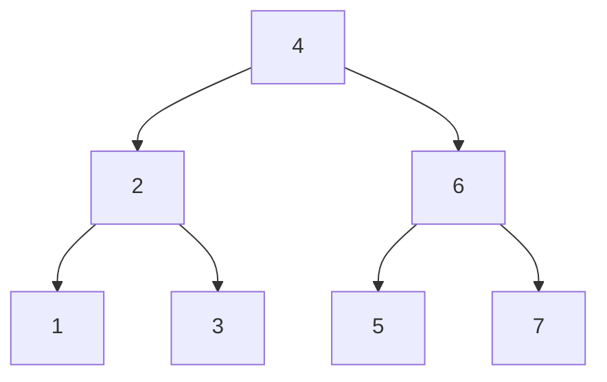
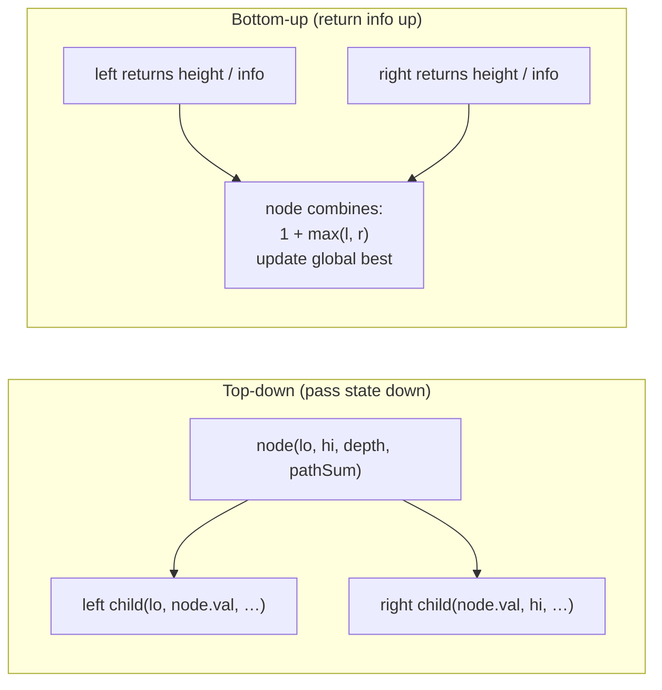
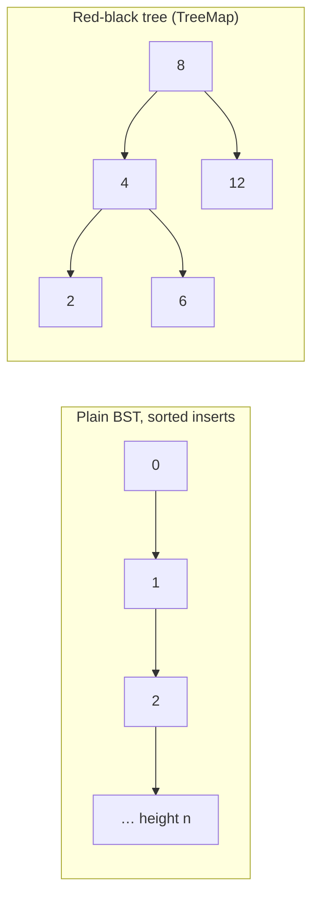

# Trees & BST; Tree Traversal Patterns

!!! abstract "Key takeaways"
    - **Traversals:**
        - **DFS:** pre-order (node, left, right), **in-order** (left, node, right: **sorted order for a BST**), post-order (left, right, node: children before parent).
        - **BFS level order** uses a queue and processes `queue.size()` nodes per level.
        - All are O(n) time. Space is O(h) for DFS (h = height) and O(w) for BFS (w = max width).
    - **Two recursion patterns cover most tree problems:**
        - **Bottom-up:** return information from children and combine it (height, diameter, balanced, max path sum, LCA).
        - **Top-down:** pass state down (BST bounds, path sums, depth). The diameter and max-path-sum problems use a return value *and* a global best.
    - **BST:** left subtree < node < right subtree, for **every** node and its **whole** subtree. A parent-child-only check wrongly accepted `5 → 3 → (right) 7` (measured). Pass `(lo, hi)` bounds as `long` (handles `Integer.MIN_VALUE`), or check that the in-order sequence is strictly increasing.
    - **Balance matters:** inserting 0..19,999 in sorted order into a plain BST gave height **20,000** (a linked list), random order gave **34** (measured). 20k sorted inserts took **407 ms** in a plain BST vs **5.0 ms** in `TreeMap` (a red-black tree, guaranteed O(log n)).
    - Know: LCA (BST walk, or the general "found in both subtrees" recursion), serialise/deserialise with null markers, build from pre-order + in-order (index map, O(n)), k-th smallest via iterative in-order, and **tries** for prefix search.
    - All solutions on this page passed 20,000 randomised checks against brute-force versions.

## Why it matters

Trees are one of the most frequent interview categories, because they test recursion, choosing between DFS and BFS, and reasoning about invariants. Senior candidates are expected to explain why `TreeMap` is O(log n) (balancing), when recursion depth becomes a problem, and how tree ideas show up in real systems: database B-tree indexes, the DOM and React's component tree, JSON documents, file systems, org charts and category hierarchies.

All solutions were checked on Java 21 against brute-force or reference implementations on 2,000 random trees each.

## Core concepts

### Terminology

- **Root, parent, child, leaf, subtree, ancestor, descendant.**
- **Depth** of a node: edges from the root. **Height** of a tree: the longest root-to-leaf path (nodes or edges: say which).
- **Binary tree:** at most two children. **Full:** 0 or 2 children. **Complete:** all levels full except possibly the last, filled left to right (heaps). **Perfect:** all levels full (2ʰ − 1 nodes). **Balanced:** heights of subtrees differ by at most 1 everywhere (AVL definition), so height is O(log n).
- **n nodes** have n − 1 edges. A balanced tree has height about log₂ n. A degenerate tree has height n.

### Traversals


*Notice the outputs for this BST: pre-order 4 2 1 3 6 5 7 · in-order 1 2 3 4 5 6 7 (sorted) · post-order 1 3 2 5 7 6 4 · level order [4] [2 6] [1 3 5 7].*

| Traversal | Order | Typical use |
|---|---|---|
| Pre-order | node, left, right | Copy or serialise a tree, print a hierarchy |
| In-order | left, node, right | Sorted output of a BST, k-th smallest, validate BST |
| Post-order | left, right, node | Delete or free a tree, compute sizes and heights, evaluate expression trees |
| Level order (BFS) | level by level | Minimum depth, right-side view, level averages, shortest path in unweighted trees |

**Iterative versions** use an explicit stack (DFS) or queue (BFS). They avoid stack overflow on deep trees and are worth knowing: in-order (push left spine, pop, go right), pre-order (pop, push right then left), post-order (reverse of a modified pre-order, or a stack with a "last visited" pointer).

**Morris traversal** does in-order in O(1) extra space by temporarily threading right pointers to in-order successors. It's rarely asked, but good to mention for "O(1) space".

### Two recursion patterns


*Notice the question to ask: does the node need information from its ancestors (top-down) or from its subtrees (bottom-up)? Many hard tree problems are bottom-up with a global best.*

- **Top-down:** validate BST with bounds, path sum from root to leaf, max depth with a depth parameter, printing paths.
- **Bottom-up:** height, balanced check (return −1 for "unbalanced" to stop early), diameter (best `l + r` across nodes, return `1 + max(l, r)`), maximum path sum (best `val + max(0,l) + max(0,r)`, return `val + max(0, max(l, r))`), LCA, subtree sums.

### Binary search trees

**Invariant:** for every node, all keys in the left subtree are smaller and all keys in the right subtree are larger (duplicates need a policy: reject, count, or always go right).

| Operation | Balanced BST | Degenerate BST |
|---|---|---|
| Search, insert, delete | O(log n) | O(n) |
| Min / max | O(log n) | O(n) |
| In-order iteration | O(n) | O(n) |
| Floor / ceiling / range query | O(log n + k) | O(n) |

**Delete** has three cases: a leaf (remove), one child (splice it up), two children (replace the value with the in-order successor, the minimum of the right subtree, then delete that successor).

**Validation pitfall:** checking only `left.val < node.val < right.val` misses violations deeper down. Measured: the tree `5` with left child `3`, whose right child is `7`, passed the parent-child check but fails the bounds check (7 is in 5's left subtree). Pass bounds down, as `long` so `Integer.MIN_VALUE`/`MAX_VALUE` nodes work.

### Balance: why TreeMap is O(log n)


*Notice that the same sorted input makes a plain BST a linked list. Self-balancing trees rotate on insert and delete to keep the height O(log n).*

Measured with 20,000 keys: sorted inserts into a plain BST produced height 20,000 and took 407 ms (O(n²) total), random order gave height 34 (about 2.3 × log₂ n, typical for random BSTs), and `TreeMap` took 5.0 ms for the sorted inserts.

| Balanced tree | Guarantee | Where |
|---|---|---|
| **Red-black** | Height ≤ 2 log₂(n + 1) | Java `TreeMap`/`TreeSet`, `HashMap` tree bins, C++ `std::map`, Linux scheduler |
| **AVL** | Height ≤ ~1.44 log₂ n (stricter, faster lookups, more rotations) | Some databases and in-memory indexes |
| **B-tree / B+ tree** | Many keys per node, height log_B n | Database and file-system indexes (PostgreSQL, MySQL InnoDB) |
| **Skip list** (probabilistic) | Expected O(log n) | Redis sorted sets, `ConcurrentSkipListMap` |

### Other tree problems to know

- **Lowest common ancestor (LCA):** in a BST, walk from the root: both smaller → go left, both larger → go right, otherwise the current node is the LCA. In a general binary tree, recurse: if the node is p or q, return it; if both subtrees return non-null, the node is the LCA; otherwise return the non-null side. O(n).
- **Serialise/deserialise:** pre-order with null markers (`"1,2,#,#,3,#,#"`), read back recursively with a queue of tokens. Level order with nulls also works.
- **Build from traversals:** pre-order + in-order (or post-order + in-order) determine a tree with unique values. The first pre-order value is the root; its position in the in-order sequence splits left and right subtrees. Use a value → index map for O(n). Pre-order + post-order alone is ambiguous unless the tree is full.
- **Views and levels:** right-side view (last node per level), zigzag order, level averages, vertical order (BFS with column indices).
- **Tries (prefix trees):** each edge is a character, so insert and search take O(L) for a word of length L, independent of how many words are stored. Used for autocomplete, spell checking, IP routing (radix tries).

## In practice: code & configuration

### Traversals: recursive and iterative

```java
// In-order recursive: O(n) time, O(h) stack
static void inorder(TreeNode n, List<Integer> out) {
    if (n == null) return;
    inorder(n.left, out);
    out.add(n.val);
    inorder(n.right, out);
}

// In-order iterative: explicit stack, no recursion depth limit
static List<Integer> inorderIter(TreeNode root) {
    List<Integer> out = new ArrayList<>();
    Deque<TreeNode> stack = new ArrayDeque<>();
    TreeNode cur = root;
    while (cur != null || !stack.isEmpty()) {
        while (cur != null) { stack.push(cur); cur = cur.left; } // go left as far as possible
        cur = stack.pop();
        out.add(cur.val);                                       // visit
        cur = cur.right;                                        // then the right subtree
    }
    return out;
}

// Level order (BFS)
static List<List<Integer>> levelOrder(TreeNode root) {
    List<List<Integer>> res = new ArrayList<>();
    if (root == null) return res;
    Deque<TreeNode> q = new ArrayDeque<>();
    q.offer(root);
    while (!q.isEmpty()) {
        int size = q.size();                      // nodes in this level
        List<Integer> level = new ArrayList<>(size);
        for (int i = 0; i < size; i++) {
            TreeNode n = q.poll();
            level.add(n.val);
            if (n.left != null) q.offer(n.left);
            if (n.right != null) q.offer(n.right);
        }
        res.add(level);
    }
    return res;
}
```

### Validate a BST

=== "❌ Parent-child comparison only"

    ```java
    static boolean isValid(TreeNode n) {
        if (n == null) return true;
        if (n.left != null && n.left.val >= n.val) return false;
        if (n.right != null && n.right.val <= n.val) return false;
        return isValid(n.left) && isValid(n.right);
    }
    // Accepts 5 → left 3 → right 7, although 7 sits in 5's left subtree (measured: true)
    ```

=== "✅ Bounds passed down"

    ```java
    static boolean isValidBST(TreeNode root) {
        return valid(root, Long.MIN_VALUE, Long.MAX_VALUE);   // long: Integer.MIN_VALUE nodes are allowed
    }
    static boolean valid(TreeNode n, long lo, long hi) {
        if (n == null) return true;
        if (n.val <= lo || n.val >= hi) return false;        // strict: no duplicates
        return valid(n.left, lo, n.val) && valid(n.right, n.val, hi);
    }
    // Alternative: iterative in-order, checking each value is greater than the previous
    ```

### Bottom-up with a global best: diameter and max path sum

```java
private int diameter;

int diameterOfBinaryTree(TreeNode root) {
    diameter = 0;
    height(root);
    return diameter;                                   // in edges
}
private int height(TreeNode n) {
    if (n == null) return 0;
    int l = height(n.left), r = height(n.right);
    diameter = Math.max(diameter, l + r);              // longest path through n
    return 1 + Math.max(l, r);                         // what the parent needs
}

private int best;

int maxPathSum(TreeNode root) {
    best = Integer.MIN_VALUE;
    gain(root);
    return best;
}
private int gain(TreeNode n) {
    if (n == null) return 0;
    int l = Math.max(0, gain(n.left));                 // drop negative branches
    int r = Math.max(0, gain(n.right));
    best = Math.max(best, n.val + l + r);              // path that bends at n
    return n.val + Math.max(l, r);                     // a path going up can use only one side
}
```

### Lowest common ancestor

```java
// BST: O(h), O(1) space
static TreeNode lcaBST(TreeNode root, int p, int q) {
    TreeNode cur = root;
    while (cur != null) {
        if (p < cur.val && q < cur.val) cur = cur.left;
        else if (p > cur.val && q > cur.val) cur = cur.right;
        else return cur;                               // split point (or equals p or q)
    }
    return null;
}

// General binary tree: O(n)
static TreeNode lca(TreeNode root, TreeNode p, TreeNode q) {
    if (root == null || root == p || root == q) return root;
    TreeNode left = lca(root.left, p, q);
    TreeNode right = lca(root.right, p, q);
    if (left != null && right != null) return root;    // p and q on different sides
    return left != null ? left : right;
}
```

### Serialise and rebuild

```java
static String serialize(TreeNode n) {
    StringBuilder sb = new StringBuilder();
    ser(n, sb);
    return sb.toString();
}
static void ser(TreeNode n, StringBuilder sb) {
    if (n == null) { sb.append("#,"); return; }        // null marker keeps the shape
    sb.append(n.val).append(',');
    ser(n.left, sb);
    ser(n.right, sb);
}
static TreeNode deserialize(String s) {
    return des(new ArrayDeque<>(Arrays.asList(s.split(","))));
}
static TreeNode des(Deque<String> tokens) {
    String t = tokens.poll();
    if (t.equals("#")) return null;
    TreeNode n = new TreeNode(Integer.parseInt(t));
    n.left = des(tokens);
    n.right = des(tokens);
    return n;
}

// Build from pre-order + in-order (unique values), O(n) with an index map
static TreeNode buildTree(int[] pre, int[] in) {
    Map<Integer, Integer> idx = new HashMap<>();
    for (int i = 0; i < in.length; i++) idx.put(in[i], i);
    return build(pre, new int[]{0}, 0, in.length - 1, idx);
}
static TreeNode build(int[] pre, int[] p, int lo, int hi, Map<Integer, Integer> idx) {
    if (lo > hi) return null;
    TreeNode n = new TreeNode(pre[p[0]++]);            // next pre-order value is this subtree's root
    int m = idx.get(n.val);
    n.left = build(pre, p, lo, m - 1, idx);            // left part of the in-order range
    n.right = build(pre, p, m + 1, hi, idx);
    return n;
}
```

### Use the library's balanced trees

```java
TreeMap<LocalDate, Claim> byDate = new TreeMap<>();
byDate.floorEntry(date);                       // latest claim on or before date, O(log n)
byDate.subMap(from, true, to, true);           // range view, O(log n + k)
byDate.headMap(cutoff).clear();                // drop everything older than cutoff

TreeSet<Integer> slots = new TreeSet<>(List.of(9, 10, 13, 15));
slots.ceiling(11);                             // 13: next free slot at or after 11
```

## Real-world usage

- **Database indexes:** B+ trees keep keys sorted with high fan-out, so a lookup among millions of rows takes 3–4 page reads. Range scans walk linked leaf pages (an in-order traversal).
- **UI trees:** the DOM and React's component tree are traversed depth-first for rendering and reconciliation. Event bubbling walks up to ancestors.
- **Hierarchies:** org charts, category trees, file systems, JSON/XML documents. Recursive SQL (`WITH RECURSIVE`) or materialised paths store them in relational databases.
- **Search and autocomplete:** tries and radix trees (also used in HTTP routers and IP routing tables).
- **Ordered maps in Java:** `TreeMap` for time-ordered data, scheduling and leaderboards. `ConcurrentSkipListMap` for concurrent sorted maps.
- **Merkle trees:** hash trees for verifying data integrity in Git, Cassandra anti-entropy repair and blockchains.

## Trade-offs & production gotchas

!!! warning "Tree pitfalls"
    - **Validating a BST with parent-child checks only** (measured false positive). Use bounds or in-order.
    - **`int` bounds** in BST validation fail for `Integer.MIN_VALUE`/`MAX_VALUE` nodes. Use `long` or nullable bounds.
    - **Recursion depth:** recursive traversal of a degenerate tree is O(n) stack. 20,000 levels worked here, but 100,000-node recursive list reversal overflowed. Use iterative traversal for untrusted or deep inputs.
    - **Unbalanced BSTs from sorted input:** height n (measured 20,000) and O(n²) build time (407 ms vs 5 ms). Use `TreeMap` or shuffle.
    - **Confusing height in nodes vs edges:** say which one you return.
    - **Global state in recursive solutions** (static fields) not reset between calls or shared across threads. Reset it or use a holder object.
    - **BFS level loops:** capture `queue.size()` before the loop. Using `q.size()` in the loop condition changes as you add children.

- **DFS vs BFS:** DFS uses O(h) memory and suits path or subtree problems. BFS uses O(width) memory (up to n/2 for a complete tree's last level) and suits level or nearest-node problems.
- **Recursive vs iterative:** recursion is clearer, iteration avoids stack limits.
- **TreeMap vs HashMap:** O(log n) with ordering and range queries vs O(1) expected without order.

## How this connects to my experience

- **Not a resume item as DSA.** Trees appear in backend and frontend work.
- **Honest bridges:** MongoDB and PostgreSQL B-tree indexes behind the services at OptumRx and Deloitte (compound index design is about key order in a B-tree), GraphQL queries and responses as trees resolved field by field (the GraphQL Consumer Service resolves a query tree across 5 upstream systems), and the React component tree in the app built from scratch. *[confirm: any hierarchical data you modelled, e.g. organisation or plan hierarchies, and how you queried it]*
- **Talking points:**
    - "I decide whether a node needs information from above (pass it down) or from below (return it up). Most hard tree problems are bottom-up with a global best."
    - "TreeMap is a red-black tree, so it's O(log n) even for sorted inserts. A plain BST degrades to a linked list."

## Interview questions

### Fundamentals

??? question "Q1. Describe pre-order, in-order, post-order and level-order traversal, with a use for each."
    **Answer:** Pre-order visits node, left, right: used to copy or serialise a tree. In-order visits left, node, right: in a BST it yields sorted order (k-th smallest, validation). Post-order visits left, right, node: children are processed before parents (deleting a tree, computing heights or subtree sums, evaluating expression trees). Level order visits by depth using a queue: minimum depth, right-side view, level averages. All are O(n) time. DFS uses O(h) stack, BFS O(w) queue memory.

    **Interviewer listens for:** correct orders, matching uses, space difference.

    **Common wrong answer:** "In-order is sorted for any binary tree."

??? question "Q2. What is a BST, and what are its operation costs?"
    **Answer:** A binary tree where, for every node, all keys in the left subtree are smaller and all keys in the right subtree are larger. Search, insert and delete follow one root-to-leaf path: O(h). For a balanced tree h = O(log n); for a degenerate one (built from sorted input) h = n (measured: height 20,000 for 20,000 sorted inserts). Self-balancing variants (red-black, AVL) guarantee O(log n). In-order traversal is O(n) and sorted. Deletion with two children replaces the node with its in-order successor.

    **Interviewer listens for:** whole-subtree invariant, O(h), degenerate case, balancing.

    **Common wrong answer:** "BST operations are always O(log n)."

??? question "Q3. How do you find the maximum depth of a binary tree, recursively and iteratively?"
    **Answer:** Recursively: `depth(null) = 0`, `depth(n) = 1 + max(depth(left), depth(right))`, a bottom-up pattern. O(n) time, O(h) stack. Iteratively: BFS counting levels (each outer loop over `queue.size()` nodes is one level), or DFS with a stack of (node, depth) pairs. Iteration avoids stack overflow on very deep trees. Clarify whether depth counts nodes or edges.

    **Interviewer listens for:** base case, both approaches, nodes vs edges.

    **Common wrong answer:** Counting all nodes instead of the longest path.

??? question "Q4. Why is `TreeMap` O(log n), and when would you use it over `HashMap`?"
    **Answer:** `TreeMap` is a red-black tree: it recolours and rotates on insert and delete so the height stays at most about 2 log₂(n + 1). Every operation walks one path: O(log n), even for sorted input (measured: 20k sorted inserts in 5 ms vs 407 ms for a plain BST). Use it when you need sorted iteration or navigation: `floorKey`, `ceilingKey`, `headMap`, `subMap`, first/last. Use `HashMap` for O(1) expected lookups when order doesn't matter.

    **Interviewer listens for:** self-balancing, height bound, navigation methods.

    **Common wrong answer:** "TreeMap sorts the keys on each access."

### Intermediate

??? question "Q5. Validate that a binary tree is a BST."
    **Answer:** Pass bounds down: each node must satisfy `lo < val < hi`. Recurse left with `(lo, val)` and right with `(val, hi)`, starting from `(Long.MIN_VALUE, Long.MAX_VALUE)` so nodes holding `Integer.MIN_VALUE` or `MAX_VALUE` work. Alternatively, run an iterative in-order traversal and check each value is strictly greater than the previous one. Comparing a node only with its children is wrong: `5 → 3 → (right) 7` passes that check (measured) but 7 violates the root's bound. O(n) time, O(h) space.

    **Interviewer listens for:** subtree-wide constraint, long bounds or in-order, counterexample.

    **Common wrong answer:** The parent-child check.

??? question "Q6. Find the lowest common ancestor of two nodes in a BST and in a general binary tree."
    **Answer:** BST: start at the root; if both values are smaller, go left; if both larger, go right; otherwise the current node is where they split, which is the LCA (it may be p or q itself). O(h), O(1) space. General tree: recursive post-order: return the node if it's null, p or q; recurse left and right; if both return non-null, the current node is the LCA; otherwise pass up whichever is non-null. O(n) time, O(h) space. Assumes both nodes exist; otherwise verify presence separately.

    **Interviewer listens for:** BST split point, general "both sides" logic, existence assumption.

    **Common wrong answer:** Storing root-to-node paths for both and comparing (works, but uses extra space; fine as a first answer if acknowledged).

??? question "Q7. Compute the diameter of a binary tree."
    **Answer:** The diameter is the longest path between any two nodes (in edges), which may not pass through the root. Bottom-up: a helper returns each subtree's height, and at each node updates a global best with `leftHeight + rightHeight` (the longest path bending at that node), returning `1 + max(l, r)` to the parent. One O(n) pass, O(h) space. Computing heights separately at every node is O(n²) in the worst case.

    **Interviewer listens for:** path may not include root, return height and update global, O(n).

    **Common wrong answer:** `height(root.left) + height(root.right)` only at the root.

??? question "Q8. How do you serialise and deserialise a binary tree?"
    **Answer:** Pre-order DFS writing values and a null marker for missing children (`"1,2,#,#,3,4,#,#,5,#,#"`). Deserialise by reading tokens in the same order with a queue: a marker returns null; otherwise create the node and recursively build left, then right. The null markers make the shape unambiguous. O(n) time and space. Level order with nulls (LeetCode's format) also works. Verified by round-tripping 2,000 random trees.

    **Interviewer listens for:** null markers, same order for both directions, complexity.

    **Common wrong answer:** Serialising only an in-order sequence (shape is lost).

### Senior

??? question "Q9. Find the maximum path sum in a binary tree where values can be negative."
    **Answer:** A path can bend at most once, at its highest node. Bottom-up: `gain(n)` returns the best sum of a downward path starting at n: `n.val + max(0, max(gain(left), gain(right)))` (negative branches are dropped). At each node update a global best with `n.val + max(0, gain(left)) + max(0, gain(right))`, the best path bending there. Initialise best to `Integer.MIN_VALUE` so an all-negative tree returns its largest value. O(n) time, O(h) space.

    **Interviewer listens for:** returned value vs global best distinction, dropping negatives, all-negative case.

    **Common wrong answer:** Returning `val + left + right` to the parent (a path can't fork upwards).

??? question "Q10. Rebuild a binary tree from its pre-order and in-order traversals."
    **Answer:** The first pre-order element is the root. Its index in the in-order array splits it into the left subtree (elements before) and the right subtree (elements after). Recurse, consuming pre-order elements in order (a shared index) and narrowing the in-order range. Precompute a value → index map so each split is O(1): O(n) total time and space. Requires unique values. In-order + post-order works the same way from the end. Pre-order + post-order alone is ambiguous unless every node has 0 or 2 children.

    **Interviewer listens for:** root from pre-order, split by in-order, index map, uniqueness.

    **Common wrong answer:** Searching linearly for the root in in-order each time (O(n²)) without noting it, or claiming pre + post always works.

??? question "Q11. Why might a recursive tree solution fail in production, and what do you do?"
    **Answer:** Recursion depth equals tree height, and Java's thread stack is limited (commonly 512 KB–1 MB). Degenerate or adversarial inputs (a deeply nested JSON document, a long parent chain, a skewed BST) can throw `StackOverflowError`. Measured here: 20,000 levels of recursive depth computation worked, while a recursive reversal of 100,000 list nodes overflowed. Fixes: iterative traversal with an explicit `ArrayDeque`, limits on input depth (JSON parsers such as Jackson have nesting limits), balancing the structure, or running on a thread with a larger stack as a last resort.

    **Interviewer listens for:** height = stack depth, adversarial input, iterative conversion, input limits.

    **Common wrong answer:** "Increase `-Xss` globally."

??? question "Q12. How does a database B+ tree differ from a binary search tree, and why?"
    **Answer:** A B+ tree node holds many keys (hundreds) and has many children, sized to a disk or memory page, so the height is log_B n: around 3–4 levels for millions of rows, meaning very few page reads per lookup. Values (or row pointers) live in leaves, which are linked for fast range scans. Inserts split full nodes and the tree grows at the root, staying balanced. A binary tree would be about log₂ n deep (20+ levels for a million keys) with one random I/O per level. The design minimises I/O and improves cache use, which matters more than comparison counts.

    **Interviewer listens for:** high fan-out, page-sized nodes, linked leaves for ranges, I/O reasoning.

    **Common wrong answer:** "Databases use red-black trees for indexes."

### Scenario-based

??? question "Q13. You must show a claims-history page that frequently asks \"latest status on or before date X\" and \"all events between two dates\" for a member. Which structure do you use in memory?"
    **Answer:** A sorted map keyed by timestamp per member: `TreeMap<Instant, Event>` (or `ConcurrentSkipListMap` if shared across threads). `floorEntry(x)` answers "latest on or before X" in O(log n), and `subMap(from, true, to, true)` returns a range in O(log n + k). Inserting events in time order is still O(log n) because the tree balances itself (a plain BST would degenerate: measured height 20,000 for sorted inserts). For data in a database, use a B-tree index on (member_id, event_time) and range queries instead.

    **Interviewer listens for:** sorted map with floor/range, balancing with ordered inserts, database index alternative.

    **Common wrong answer:** A `HashMap` with a linear scan, or sorting a list on every query.

??? question "Q14. Implement autocomplete over 1 million product names. What tree would you use, and what are the trade-offs?"
    **Answer:** A trie: each node maps a character to a child, so finding the prefix node takes O(L) regardless of the number of names. Store at each node the top-k suggestions (by popularity) to answer instantly instead of walking the whole subtree. Memory is the main cost: use a compressed radix tree, arrays for small alphabets, or a sorted array of names with binary search for the prefix range (O(L log n), very compact). At scale, use a search engine (Elasticsearch completion suggester or edge n-grams) with typo tolerance. Handle case folding and Unicode normalisation.

    **Interviewer listens for:** trie with O(L) prefix lookup, cached top-k, memory trade-offs, sorted-array and search-engine alternatives.

    **Common wrong answer:** `names.stream().filter(n -> n.startsWith(prefix))` on every keystroke.

## Cheat sheet

| Topic | Remember |
|---|---|
| Traversals | Pre (copy), In (BST sorted), Post (children first), Level (queue, `size()` per level) |
| Space | DFS O(h), BFS O(width) |
| Patterns | Top-down (bounds, path state) vs bottom-up (return info + global best) |
| Validate BST | Bounds with `long`; parent-child check is wrong (5→3→7 measured) |
| LCA | BST: split point O(h); general: both sides non-null |
| Diameter / max path | Return height/gain, update global with l + r (+ val), drop negatives |
| Serialise | Pre-order + null markers; rebuild with a token queue |
| Build | Pre + in-order with index map, O(n); unique values |
| Balance | Sorted inserts: plain BST height 20,000 (407 ms) vs TreeMap 5 ms; random height 34 |
| Java | `TreeMap`/`TreeSet` (red-black): floor, ceiling, subMap; `ConcurrentSkipListMap` |
| Tries | O(L) prefix search; cache top-k; radix compression |

## Sources
1. Cormen, Leiserson, Rivest, Stein, *Introduction to Algorithms* (4th ed.), binary search trees, red-black trees, B-trees.
2. Sedgewick & Wayne, *Algorithms* (4th ed.), balanced search trees (left-leaning red-black trees).
3. [Java SE 21 API: TreeMap](https://docs.oracle.com/en/java/javase/21/docs/api/java.base/java/util/TreeMap.html) ("a Red-Black tree based NavigableMap implementation… guaranteed log(n) time cost") and [NavigableMap](https://docs.oracle.com/en/java/javase/21/docs/api/java.base/java/util/NavigableMap.html).
4. [PostgreSQL docs: B-tree indexes](https://www.postgresql.org/docs/current/btree.html).
5. Knuth, *The Art of Computer Programming*, Vol. 1 (tree traversal) and Vol. 3 (searching, tries).
6. Demonstrations on this page: Java 21, solutions checked on 2,000 random trees each (20,000 checks), timings from single runs, run while writing this page.
