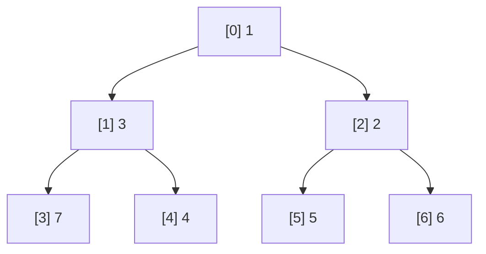
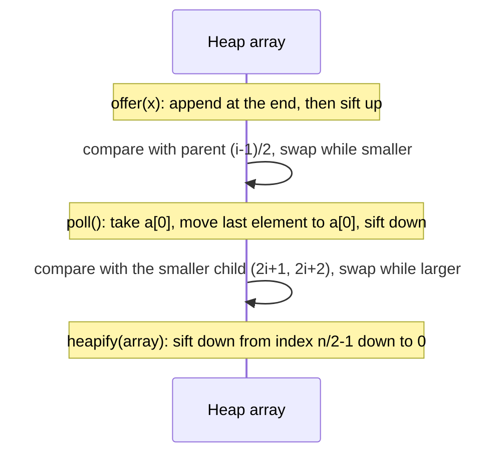
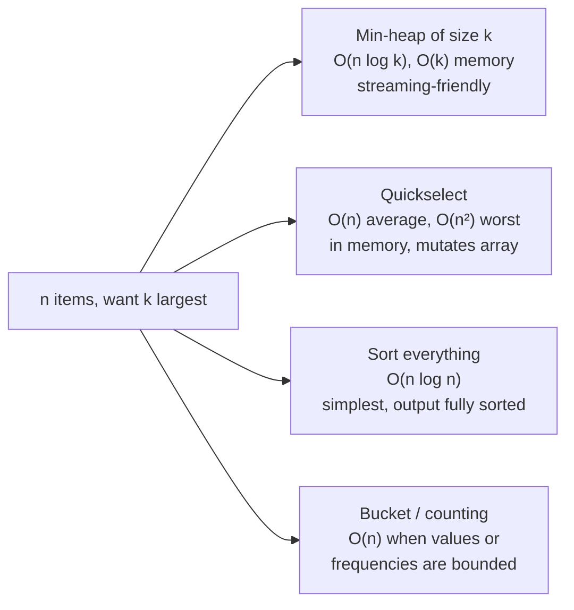
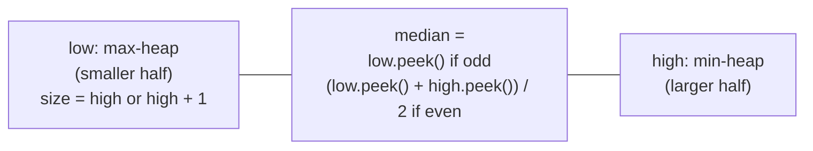

# Heaps & Priority Queues (Top-K)

!!! abstract "Key takeaways"
    - A **binary heap** is a complete binary tree stored in an array. Each parent is ≤ its children (min-heap) or ≥ them (max-heap), so the min or max is always at index 0. Children of `i` are `2i+1` and `2i+2`, and the parent is `(i−1)/2`.
    - **Costs:** `peek` O(1); `offer` and `poll` O(log n) (sift-up and sift-down); **building from n items is O(n)** with bottom-up heapify. Measured on 1,048,576 ints: heapify used **1.88** comparisons per element; n inserts in random order used 2.28 per element; descending input (worst case for a min-heap) used **18** per element (≈ log₂ n).
    - Java's **`PriorityQueue`** is a min-heap by default. Use `Comparator.reverseOrder()` for a max-heap. **Iteration and `toString` aren't sorted** (`[1, 2, 4, 5, 3]`, while polling gave 1..5, measured). `remove(Object)` is O(n) (2,000 removals from 100k took 188 ms). Never write comparators as `a - b`: it overflowed and sorted `MAX_VALUE` first (measured). Use `Integer.compare`.
    - **Top-k largest:** keep a **min-heap of size k** and evict the smallest. That's O(n log k) time and O(k) memory, and it works on streams. Measured top-100 of 10M ints: **17 ms** heap, **331 ms** quickselect, **1,279 ms** full sort.
    - **Patterns:**
        - k-way merge of sorted lists (heap of list heads, O(N log k)).
        - Running median (max-heap of the lower half + min-heap of the upper half).
        - k closest points (max-heap of size k).
        - Task scheduling with cooldowns.
        - Meeting rooms (min-heap of end times).
        - Dijkstra's shortest path.
    - All solutions on this page passed 12,000 randomised checks against sorting-based references.

## Why it matters

"Top k", "k-th largest", "merge k sorted" and "median of a stream" are among the most common interview problems, and the heap is the expected tool. Senior interviews also check that you know heapify is O(n), when quickselect or sorting is better, `PriorityQueue`'s quirks, and how the same structure appears in schedulers, timers, Dijkstra, and streaming top-N analytics.

All code ran on Java 21. Solutions were checked against sorting-based references on 2,000 random inputs each.

## Core concepts

### Structure


*Notice that the tree is stored level by level in an array `[1, 3, 2, 7, 4, 5, 6]`: no pointers. Only parent ≤ child is guaranteed, so siblings and cousins aren't ordered relative to each other. That's why iterating the array isn't sorted.*

- **Complete tree** (filled level by level, left to right) means height ⌊log₂ n⌋ and no gaps in the array.
- **Heap property:** `a[parent(i)] ≤ a[i]` for a min-heap.
- **Not a BST:** you can't search a heap efficiently (finding an arbitrary value is O(n)).

### Operations


*Notice that both sift operations walk a single root-to-leaf path, which is why they're O(log n).*

{ loading=lazy }
*Watch the tree and the array change together: each swap moves 0 from index i to (i − 1) / 2, so three swaps take it from the last slot to the root.*

| Operation | Cost | Note |
|---|---|---|
| `peek` | O(1) | Root |
| `offer` / `add` | O(log n) worst, O(1) average for random input | Measured 2.28 comparisons/element random, 18 for descending input |
| `poll` | O(log n) | Sift down the moved last element |
| Build from n items (heapify) | **O(n)** | Most nodes are near the bottom and sift only a little: measured 1.88 comparisons/element |
| `remove(Object)`, `contains` | O(n) | Linear search, then re-sift |
| Heap sort | O(n log n), in place, not stable | Heapify, then repeatedly swap root to the end |

**Why heapify is O(n):** about half the nodes are leaves (no work), a quarter sift down at most 1 level, an eighth at most 2, and so on. The sum n·(1/4·1 + 1/8·2 + 1/16·3 + …) is bounded by n. In Java, `new PriorityQueue<>(collection)` heapifies in O(n), while adding n items one by one is O(n log n) worst case.

### PriorityQueue in Java

- Min-heap with natural ordering, or pass a `Comparator`. `new PriorityQueue<>(Comparator.reverseOrder())` is a max-heap.
- **Not thread-safe:** use `PriorityBlockingQueue` (unbounded, blocking `take`) or synchronise. `DelayQueue` orders by remaining delay, for scheduling.
- **No nulls.** Elements must be mutually comparable.
- **Iterator and `toString` follow array order**, not priority order (measured `[1, 2, 4, 5, 3]`). Poll repeatedly to get sorted order.
- **Don't mutate an element's priority** while it's in the queue: the heap won't re-sift. Remove and re-insert, or insert a new entry and skip stale ones on poll ("lazy deletion", common in Dijkstra).
- **Comparator overflow:** `(a, b) -> a - b` is wrong for large or mixed-sign values. Measured: sorting `[MAX_VALUE, -10, MIN_VALUE+5, 0]` gave `[2147483647, -2147483643, -10, 0]`. Use `Integer.compare(a, b)`, `Comparator.comparingInt(...)`, or `Long.compare`.

### Top-k: three approaches


*Notice why the heap keeps the k largest in a **min**-heap: its root is the smallest of the current top k, so it's the one to evict when a bigger item arrives.*

{ loading=lazy }
*Watch the teal root: it's the smallest of the current top 3, so a new item only has to beat it. Most items in a large stream are rejected by that single comparison.*

Measured, top-100 of 10,000,000 random ints:

| Approach | Time |
|---|---|
| Min-heap of size 100 | **17 ms** (most items are smaller than the root and are rejected after one comparison) |
| Quickselect (random pivot, on a copy) | 331 ms |
| `Arrays.sort` on a copy | 1,279 ms |

Choose the heap for streams, unknown n, or small k. Choose quickselect for one-off k-th element queries in memory (median of a large array). Sort when you need everything ordered anyway or n is small. For frequency-based top-k, count first, then heap or [bucket-sort](03-hashing-patterns.md) the counts.

### Two heaps: running median


*Notice the two invariants: every element in `low` ≤ every element in `high`, and the sizes differ by at most one. Adding through `low` then moving its max to `high` maintains the first invariant automatically.*

O(log n) per insert, O(1) per median query. Variants: sliding-window median (two heaps with lazy deletion, or two `TreeMap`s with counts), and "IPO"/"maximise capital" problems (one heap ordered by cost, one by profit).

### Other heap patterns

| Pattern | Idea | Complexity |
|---|---|---|
| k-way merge | Heap of (value, list, index) for each list's head; poll, output, push the next from that list | O(N log k) for N total items |
| k closest points / k smallest | **Max**-heap of size k, evict the largest | O(n log k) |
| Meeting rooms II | Sort by start; min-heap of end times; reuse a room if the earliest end ≤ start | O(n log n) |
| Task scheduler with cooldown | Max-heap of remaining counts + cooldown queue (or the counting formula) | O(T log 26) |
| Dijkstra | Min-heap of (distance, node), skip stale entries | O((V + E) log V) |
| Reorganise string (no adjacent equal) | Max-heap by count, place the top two alternately | O(n log σ) |
| Kth smallest in a sorted matrix | Heap of row heads, or binary search on values | O(k log n) |

## In practice: code & configuration

### Top-k largest

=== "❌ Sort everything, or a max-heap of all n"

    ```java
    static int[] topK(int[] a, int k) {
        int[] c = a.clone();
        Arrays.sort(c);                                     // O(n log n), O(n) memory
        return Arrays.copyOfRange(c, c.length - k, c.length);
    }
    // Measured top-100 of 10M: 1,279 ms. Can't process a stream that doesn't fit in memory.
    ```

=== "✅ Min-heap of size k"

    ```java
    static int[] topK(int[] a, int k) {
        PriorityQueue<Integer> heap = new PriorityQueue<>(k);   // min-heap: root = smallest of the top k
        for (int x : a) {
            if (heap.size() < k) heap.offer(x);
            else if (x > heap.peek()) {                          // only bigger items get in
                heap.poll();
                heap.offer(x);
            }
        }
        return heap.stream().mapToInt(Integer::intValue).sorted().toArray();
    }
    // O(n log k) time, O(k) memory, works on streams. Measured: 17 ms
    ```

### Quickselect for the k-th largest

```java
static int kthLargest(int[] a, int k) {
    int[] b = a.clone();
    int target = b.length - k, lo = 0, hi = b.length - 1;
    ThreadLocalRandom rnd = ThreadLocalRandom.current();
    while (true) {
        int p = lo + rnd.nextInt(hi - lo + 1);       // random pivot avoids O(n²) on sorted input
        int pv = b[p];
        swap(b, p, hi);
        int store = lo;
        for (int i = lo; i < hi; i++) if (b[i] < pv) swap(b, store++, i); // Lomuto partition
        swap(b, store, hi);                           // pivot in its final position
        if (store == target) return b[store];
        if (store < target) lo = store + 1; else hi = store - 1;
    }
}
// O(n) average, O(n²) worst; mutates (a copy here)
```

### Merge k sorted lists

```java
static int[] mergeK(int[][] lists) {
    // heap entries: {listIndex, elementIndex}, ordered by the element's value
    PriorityQueue<int[]> heap = new PriorityQueue<>(Comparator.comparingInt(e -> lists[e[0]][e[1]]));
    int total = 0;
    for (int i = 0; i < lists.length; i++) {
        total += lists[i].length;
        if (lists[i].length > 0) heap.offer(new int[]{i, 0});
    }
    int[] out = new int[total];
    int w = 0;
    while (!heap.isEmpty()) {
        int[] e = heap.poll();
        out[w++] = lists[e[0]][e[1]];
        if (e[1] + 1 < lists[e[0]].length) heap.offer(new int[]{e[0], e[1] + 1}); // next from the same list
    }
    return out;
}
// O(N log k) time, O(k) heap
```

### Running median

```java
final class MedianFinder {
    private final PriorityQueue<Integer> low = new PriorityQueue<>(Comparator.reverseOrder()); // max-heap
    private final PriorityQueue<Integer> high = new PriorityQueue<>();                        // min-heap

    void add(int x) {
        low.offer(x);
        high.offer(low.poll());                 // largest of the low half moves up: keeps low ≤ high
        if (high.size() > low.size()) low.offer(high.poll()); // keep low the same size or one bigger
    }

    double median() {
        return low.size() > high.size()
            ? low.peek()
            : (low.peek() + (long) high.peek()) / 2.0;          // long: avoid int overflow
    }
}
```

### Comparators done right

=== "❌ Subtraction comparator"

    ```java
    PriorityQueue<Claim> byAmount = new PriorityQueue<>((a, b) -> a.amountCents() - b.amountCents());
    // Overflows for large or mixed-sign values: MAX_VALUE sorted before negatives (measured)
    ```

=== "✅ Library comparators"

    ```java
    PriorityQueue<Claim> byAmount =
        new PriorityQueue<>(Comparator.comparingLong(Claim::amountCents));       // min by amount

    PriorityQueue<Claim> urgentFirst = new PriorityQueue<>(
        Comparator.comparingInt(Claim::priority).reversed()                     // highest priority first
                  .thenComparing(Claim::submittedAt));                           // then oldest first
    ```

### Meeting rooms (minimum rooms needed)

```java
static int minMeetingRooms(int[][] intervals) {
    Arrays.sort(intervals, Comparator.comparingInt(iv -> iv[0]));   // by start
    PriorityQueue<Integer> ends = new PriorityQueue<>();             // end times of rooms in use
    for (int[] iv : intervals) {
        if (!ends.isEmpty() && ends.peek() <= iv[0]) ends.poll();    // earliest-ending room is free
        ends.offer(iv[1]);
    }
    return ends.size();
}
// O(n log n)
```

## Real-world usage

- **Schedulers and timers:** `ScheduledThreadPoolExecutor` keeps delayed tasks in a heap-ordered `DelayedWorkQueue`. OS schedulers, Kafka's purgatory and Netty use timing wheels or heaps for timeouts.
- **Streaming top-N:** "top 10 products in the last hour" uses a size-k heap per window over counts (often with Count-Min Sketch for approximate counts at scale).
- **Shortest paths and routing:** Dijkstra and A* (maps, network routing, OSPF).
- **External sorting and merges:** k-way merges of sorted runs (database sorts, LSM-tree compaction in Cassandra and RocksDB, merging sorted log files).
- **Load balancing:** least-connections or least-loaded selection with a heap keyed by load.
- **Event simulation and job queues:** priority job queues (urgent claims first) and discrete-event simulators.

## Trade-offs & production gotchas

!!! warning "Heap pitfalls"
    - **Using a max-heap for top-k largest** (keeps all n) instead of a min-heap of size k.
    - **Expecting sorted iteration** from `PriorityQueue` (measured `[1, 2, 4, 5, 3]`). Poll to drain in order.
    - **Subtraction comparators** overflow (measured wrong order). Use `Integer.compare` / `comparingInt`.
    - **Changing priorities in place:** the heap isn't re-sifted. Remove and re-insert, or use lazy deletion.
    - **`remove(Object)` in a loop:** O(n) each (measured 188 ms for 2,000 removals). Use lazy deletion or an indexed heap.
    - **Building with n `offer` calls when you have all data:** use the collection constructor (O(n) heapify).
    - **Thread safety:** `PriorityQueue` isn't thread-safe. Use `PriorityBlockingQueue`.
    - **Unbounded priority queues** in job systems can starve low-priority work forever. Add aging or separate queues.

- **Heap vs sorted structure:** a heap gives only the min or max quickly. If you need both ends, ordered iteration or removal of arbitrary items, use a `TreeMap`/`TreeSet` (O(log n) for all) at a higher constant cost.
- **Heap vs quickselect vs sort:** streaming and small k favour heaps, one-shot in-memory selection favours quickselect, small n or full ordering favours sorting.

## How this connects to my experience

- **Not a resume item as DSA.** The patterns appear in backend systems.
- **Honest bridges:** scheduling and retry delays around Kafka retry topics at OptumRx (delayed reprocessing is a time-ordered queue), prioritising work in services, and merging sorted results from several upstream systems in the GraphQL Consumer Service (a k-way merge if results are paged and sorted). *[confirm: any priority-based processing, scheduled jobs or sorted merges you implemented]*
- **Talking points:**
    - "For top-k largest I keep a min-heap of size k: O(n log k), O(k) memory, and it works on a stream."
    - "PriorityQueue's iterator isn't sorted, and I never write comparators as a minus b."

## Interview questions

### Fundamentals

??? question "Q1. What is a binary heap, and how is it stored?"
    **Answer:** A complete binary tree with the heap property: every parent is ≤ its children (min-heap) or ≥ (max-heap), so the extreme value is at the root. Because the tree is complete, it's stored in an array level by level: children of index i at 2i+1 and 2i+2, parent at (i−1)/2, with no pointers. `peek` is O(1), `offer` and `poll` are O(log n) via sift-up and sift-down. Siblings aren't ordered, so it's not a search structure: finding an arbitrary element is O(n).

    **Interviewer listens for:** complete tree, array indexing, heap property only between parent and child.

    **Common wrong answer:** "A heap is a sorted array" or "a heap is a BST."

??? question "Q2. Why is building a heap from n elements O(n), not O(n log n)?"
    **Answer:** Bottom-up heapify sifts down every non-leaf node, starting from index n/2 − 1 up to the root. A node at height h sifts down at most h levels, and there are about n/2^(h+1) nodes at height h. The total is n · Σ h/2^(h+1), which converges to a constant times n. Most nodes are near the bottom and do almost no work. Measured on about 1 million ints: 1.88 comparisons per element. Inserting one by one is O(n log n) worst case (measured 18 comparisons per element for descending input). Java's `new PriorityQueue<>(collection)` heapifies.

    **Interviewer listens for:** bottom-up direction, height-weighted sum, contrast with repeated inserts.

    **Common wrong answer:** "n inserts at log n each, so O(n log n)."

??? question "Q3. How do you find the k largest elements in an array, and why a min-heap?"
    **Answer:** Keep a min-heap of at most k elements. For each item, if the heap has fewer than k items, add it; otherwise, if it's larger than the root (the smallest of the current top k), replace the root. At the end the heap holds the k largest. O(n log k) time, O(k) memory, and it works on streams. The min-heap matters because the root is exactly the element to evict. Measured top-100 of 10M: 17 ms vs 1,279 ms for a full sort. Alternatives: quickselect (O(n) average, in memory) and sorting (simple, O(n log n)).

    **Interviewer listens for:** size-k min-heap reasoning, complexity, alternatives.

    **Common wrong answer:** "Put everything in a max-heap and poll k times." (O(n + k log n) with heapify, but O(n) memory and not streaming.)

??? question "Q4. What are the main gotchas of Java's PriorityQueue?"
    **Answer:** It's a min-heap by default (use `Comparator.reverseOrder()` for a max-heap). Its iterator and `toString` follow the internal array order, not priority order (measured `[1, 2, 4, 5, 3]`). `remove(Object)` and `contains` are O(n). It isn't thread-safe (`PriorityBlockingQueue` is). It rejects nulls. Changing an element's fields that affect ordering while it's inside breaks the heap. Comparators written as `a - b` overflow (measured wrong order). Use `Integer.compare` or `Comparator.comparingInt`.

    **Interviewer listens for:** iteration order, O(n) remove, overflow, thread safety, mutation.

    **Common wrong answer:** "Iterating a PriorityQueue gives sorted order."

### Intermediate

??? question "Q5. Merge k sorted lists into one sorted list."
    **Answer:** Put the head of each list in a min-heap (value, list id, index). Repeatedly poll the smallest, append it to the output, and push the next element from the same list. Each of the N elements is pushed and polled once with a heap of size at most k: O(N log k) time, O(k) extra space. Alternatives: merging pairs in rounds (divide and conquer), also O(N log k); merging lists one by one is O(N·k). This is the basis of external sorting and LSM-tree compaction.

    **Interviewer listens for:** heap of heads, N log k, divide-and-conquer alternative.

    **Common wrong answer:** Concatenating and sorting (O(N log N)), or sequential merging without noting O(N·k).

??? question "Q6. Design a structure that returns the median of a stream of numbers."
    **Answer:** Two heaps: a max-heap for the smaller half and a min-heap for the larger half. Keep every element in the low heap ≤ every element in the high heap, and the sizes equal or the low heap one larger. To add: push into low, move low's max to high, then if high is bigger move its min back to low. The median is low's top (odd count) or the average of both tops (even count, using `long` to avoid overflow). O(log n) per add, O(1) per query. Verified against sorting after every insert.

    **Interviewer listens for:** two heaps, both invariants, overflow in averaging.

    **Common wrong answer:** Sorting the list on every query (O(n log n)) or a single heap.

??? question "Q7. Find the k-th largest element. When would you choose quickselect over a heap?"
    **Answer:** A min-heap of size k gives O(n log k) time and O(k) space and works for streams. Quickselect partitions around a random pivot and recurses into the side that contains index n − k: O(n) average, O(n²) worst (mitigated by random pivots or median-of-medians for a guaranteed O(n)). It needs the whole array in memory and mutates it. Choose quickselect for a one-off selection on an in-memory array with large k (like the median). Choose a heap for streams, small k, or repeated queries as data arrives. Measured top-100 of 10M: heap 17 ms vs quickselect 331 ms, since with small k most items are rejected after one comparison.

    **Interviewer listens for:** both approaches, average vs worst case, streaming vs in-memory, k size.

    **Common wrong answer:** "Quickselect is always faster because it's O(n)."

??? question "Q8. How many meeting rooms are needed for a set of intervals?"
    **Answer:** Sort meetings by start time. Keep a min-heap of end times for rooms in use. For each meeting, if the earliest end time ≤ its start, that room is free (poll it). Then push the meeting's end time. The heap's size at the end (its maximum size over the run) is the number of rooms. O(n log n). Alternative: sort starts and ends separately and sweep with two pointers, counting concurrent meetings, also O(n log n). Clarify whether a meeting ending at 10 frees the room for one starting at 10 (`<=`).

    **Interviewer listens for:** sort by start, heap of ends, boundary condition, sweep alternative.

    **Common wrong answer:** Comparing each meeting only with the previous one.

### Senior

??? question "Q9. Implement a task scheduler: tasks with a cooldown n between identical tasks. What's the minimum time?"
    **Answer:** Greedy with a max-heap of remaining counts: each time unit, run the task with the most remaining (to avoid ending with many copies of one task), put it in a cooldown queue with the time it becomes available, and return tasks from the cooldown queue to the heap when ready. Idle when nothing is available. O(T log 26). There's also a formula: with maximum frequency f and m tasks sharing it, the answer is `max(T, (f − 1)(n + 1) + m)`. The simulation and the formula matched on 2,000 random cases.

    **Interviewer listens for:** greedy by most remaining, cooldown handling, formula and its reasoning.

    **Common wrong answer:** Round-robin in alphabetical order.

??? question "Q10. You need to update the priority of items already in a heap (e.g. Dijkstra's decrease-key). How do you handle that in Java?"
    **Answer:** `PriorityQueue` has no decrease-key, and mutating an element breaks the heap. Options: lazy deletion: push a new (priority, item) entry and, when polling, skip entries whose priority no longer matches the best known value (standard for Dijkstra, at the cost of up to O(E) heap entries). Remove and re-insert: `remove(Object)` is O(n) (measured 188 ms for 2,000 removals on 100k). An indexed heap that tracks each item's array position supports O(log n) decrease-key but must be written by hand. Or use a `TreeSet` of (priority, id) pairs: remove and add are both O(log n).

    **Interviewer listens for:** no decrease-key, lazy deletion, indexed heap or TreeSet alternatives.

    **Common wrong answer:** "Change the field and the queue will reorder."

??? question "Q11. Find the top 10 most frequent search terms from a stream of billions of queries."
    **Answer:** Exact counting needs a hash map of all distinct terms, which may not fit in memory. Options: shard by term hash across machines, count per shard, take each shard's top 10 with a size-10 min-heap, and merge (correct because a term lives on exactly one shard). For bounded memory on one machine, use approximate algorithms: Count-Min Sketch for frequencies plus a heap of candidates, or Space-Saving / Misra–Gries heavy hitters, which guarantee finding items above a frequency threshold. For time windows, keep per-window counts and expire old windows. Kafka Streams or Flink implement this with windowed aggregations.

    **Interviewer listens for:** sharding by key, local top-k + merge, approximate sketches, windows.

    **Common wrong answer:** Sorting all terms by count on one machine.

??? question "Q12. Compare a heap, a TreeMap and a sorted list as priority queues."
    **Answer:** Heap: O(1) peek, O(log n) insert and poll, O(n) build, compact array, but only one end is fast and arbitrary removal or priority change is O(n). `TreeMap`/`TreeSet` (red-black tree): O(log n) for insert, delete, min, max, arbitrary removal and range queries, ordered iteration, but higher memory per entry and larger constants (and keys must be unique, so add a tie-breaker). Sorted array or list: O(1) min (and max), O(n) insert. Pick a heap for plain priority scheduling and top-k, a tree when you need both ends, removals or ordered views (sliding-window median, order books), and a sorted array for read-mostly data.

    **Interviewer listens for:** operation-by-operation comparison, uniqueness caveat for trees, use cases.

    **Common wrong answer:** "They're interchangeable."

### Scenario-based

??? question "Q13. A claims-processing service must handle urgent claims first but low-priority claims are waiting for days. What do you change?"
    **Answer:** A strict priority queue lets a steady flow of high-priority work starve low-priority items. Fixes: aging (priority increases with waiting time, by ordering on an effective priority such as `priority − waitTime/k`, recomputed via re-insertion or by using time-bucketed queues), weighted fair queuing (separate queues per priority, served in a ratio such as 5:2:1), or an SLA-based ordering (deadline = submitted time + SLA per priority, ordered by deadline: earliest deadline first). Add metrics on wait time per priority and alerts on SLA breaches. In distributed systems, use separate topics or queues per priority with consumer capacity allocated by weight.

    **Interviewer listens for:** starvation, aging/weighted fairness/EDF, monitoring.

    **Common wrong answer:** "Increase the priority of old claims manually."

??? question "Q14. You must merge 500 sorted 2 GB log files into one sorted file on a machine with 8 GB of RAM. How?"
    **Answer:** A k-way merge with a heap of size 500: open buffered readers for every file, push each file's first record (keyed by timestamp) into a min-heap, then repeatedly poll the smallest record, write it to a buffered output, and push the next record from the same file. Memory is O(k) records plus I/O buffers (for example 500 × 1 MB buffers), independent of the 1 TB total size. Time O(N log k). Tune buffer sizes for sequential I/O. If file handles are limited, merge in multiple passes (e.g. 50 files at a time, then merge the results). Handle ties stably (by file index) and malformed lines.

    **Interviewer listens for:** heap of k heads, streaming with buffers, memory bound, multi-pass fallback.

    **Common wrong answer:** Loading everything into memory and sorting.

## Cheat sheet

| Topic | Remember |
|---|---|
| Array layout | children 2i+1, 2i+2; parent (i−1)/2; complete tree |
| Costs | peek O(1); offer/poll O(log n); heapify O(n) (1.88 cmp/elem measured); remove(Object) O(n) |
| Java | `PriorityQueue` min-heap; `reverseOrder()` for max; iteration not sorted; no nulls; not thread-safe |
| Comparators | `Integer.compare`, `comparingInt`; never `a - b` (overflow measured) |
| Top-k largest | Min-heap of size k: O(n log k); 17 ms vs sort 1,279 ms (top-100 of 10M) |
| k-th element | Heap O(n log k) or quickselect O(n) avg |
| Merge k sorted | Heap of heads, O(N log k) |
| Median stream | Max-heap low + min-heap high, sizes differ ≤ 1 |
| Intervals | Meeting rooms: sort by start + min-heap of ends |
| Decrease-key | Lazy deletion, indexed heap, or TreeSet |
| Starvation | Aging, weighted fair queues, earliest deadline first |

## Sources
1. Cormen, Leiserson, Rivest, Stein, *Introduction to Algorithms* (4th ed.), heapsort and priority queues (BUILD-MAX-HEAP is O(n)); medians and order statistics (quickselect).
2. Sedgewick & Wayne, *Algorithms* (4th ed.), priority queues.
3. [Java SE 21 API: PriorityQueue](https://docs.oracle.com/en/java/javase/21/docs/api/java.base/java/util/PriorityQueue.html) ("The Iterator… is not guaranteed to traverse the elements… in any particular order"; linear time for remove(Object) and contains), [PriorityBlockingQueue](https://docs.oracle.com/en/java/javase/21/docs/api/java.base/java/util/concurrent/PriorityBlockingQueue.html), [Comparator](https://docs.oracle.com/en/java/javase/21/docs/api/java.base/java/util/Comparator.html).
4. Cormode & Muthukrishnan, *An Improved Data Stream Summary: The Count-Min Sketch and its Applications* (2005); Metwally, Agrawal, El Abbadi, *Efficient Computation of Frequent and Top-k Elements in Data Streams* (Space-Saving, 2005).
5. Demonstrations on this page: Java 21, solutions checked on 2,000 random inputs each (12,000 checks), timings from single runs after warm-up, run while writing this page.
