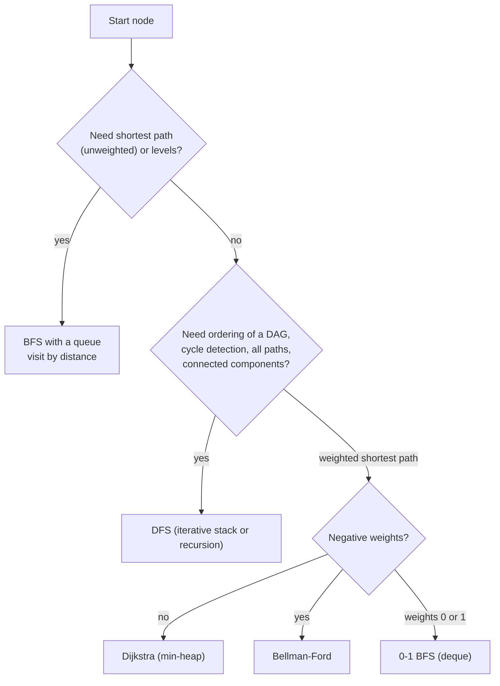
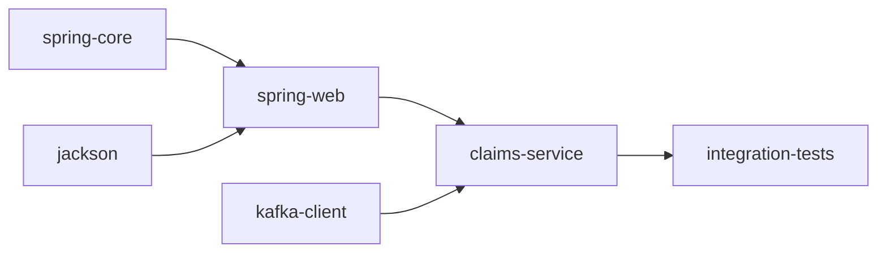
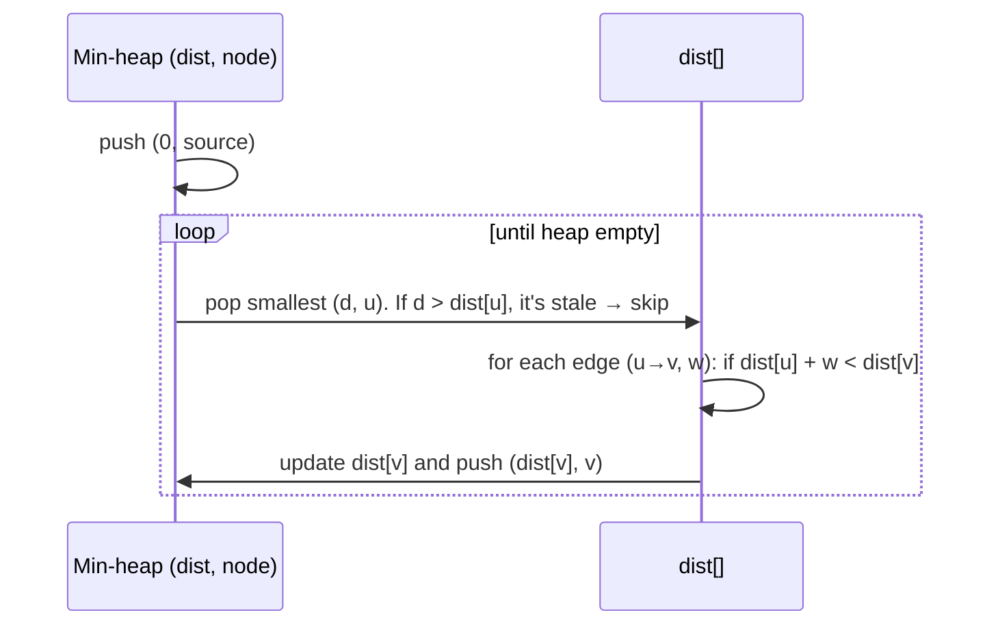

# Graphs: BFS, DFS, Topological Sort, Shortest Path

!!! abstract "Key takeaways"
    - **Model first:** nodes, edges, directed or undirected, weighted or not, possibly implicit (grid cells, word ladders, states). Use an **adjacency list** (`List<List<Integer>>`), which takes O(V + E) memory. An adjacency matrix for 200k nodes would need about **40 GB** as `boolean[][]` (computed).
    - **BFS** (queue) visits by distance, so it finds **shortest paths in unweighted graphs**, levels and the nearest target. **DFS** (stack or recursion) explores deeply: connectivity, flood fill, cycle detection, path enumeration, topological order. Both are O(V + E). **Mark nodes visited when you enqueue them**, not when you dequeue.
    - **Recursion depth is real:** recursive DFS flood fill on a 1000×1000 all-land grid threw **`StackOverflowError`**. The iterative version finished in **177 ms** (measured).
    - **Topological sort** orders a DAG so every edge goes forward. **Kahn's algorithm** repeatedly takes zero in-degree nodes; if fewer than V nodes come out, there's a cycle. DFS uses three colours (white/grey/black) and reverse post-order. Typical uses: build order, course schedule, task dependencies.
    - **Shortest paths:**
        - Unweighted: BFS.
        - 0/1 weights: 0-1 BFS with a deque.
        - Non-negative weights: **Dijkstra** with a min-heap, O((V + E) log V). Measured on V = 200k, E = 1.2M: **309 ms**.
        - **Negative edges:** Bellman-Ford, O(V·E). It also detects negative cycles. Textbook Dijkstra returned **2** where the true distance was **1** (measured).
        - All pairs on small graphs: Floyd-Warshall, O(V³).
    - **Union-find** (path compression + union by rank) answers "are these connected?" in near-O(1) amortised: dynamic connectivity, Kruskal's MST, redundant connections. Also know bipartite checks (2-colouring by BFS) and MST (Kruskal, Prim).
    - All algorithms on this page passed 6,000 randomised checks against Floyd-Warshall, brute-force colouring or recursive references.

## Why it matters

Graph problems appear in most senior coding loops, often disguised: grids (islands, rotting oranges), dependencies (course schedule, build order), word transformations, networks and maps. Interviewers check modelling, choosing BFS vs DFS vs Dijkstra, cycle detection and complexity. In real systems the same algorithms schedule builds and pipelines (DAGs in Gradle, Airflow, Terraform), resolve dependencies (Maven, npm), route traffic, detect deadlocks (cycles in wait-for graphs) and power recommendations and fraud detection.

All code ran on Java 21 and was checked against reference algorithms on 1,000 random graphs per check.

## Core concepts

### Representations

| Representation | Memory | Check edge (u, v) | Iterate neighbours | Best for |
|---|---|---|---|---|
| **Adjacency list** | O(V + E) | O(deg u) | O(deg u) | Sparse graphs (most real ones) |
| Adjacency matrix | O(V²) | O(1) | O(V) | Dense, small graphs; Floyd-Warshall |
| Edge list | O(E) | O(E) | O(E) | Kruskal, Bellman-Ford |
| Implicit | O(1) | compute | compute | Grids, state spaces, word ladders |

In interviews, build adjacency lists from an edge list: `List<List<Integer>> g` (or `List<List<int[]>>` for weighted `{to, weight}` edges). For grids, neighbours come from a direction array `{{1,0},{-1,0},{0,1},{0,-1}}`.

### BFS vs DFS


*Notice that BFS gives shortest paths only when every edge has the same cost. Once weights differ, you need Dijkstra or Bellman-Ford.*

**BFS rules:** mark a node visited when it's enqueued (otherwise it can be enqueued many times). Process level by level with `queue.size()` when you need distances or levels. **Multi-source BFS** starts with all sources in the queue at distance 0 (rotting oranges, distance to nearest exit). **Bidirectional BFS** searches from both ends to cut the explored area (word ladder).

**DFS rules:** recursion is concise but limited by stack depth (measured overflow on a 1000×1000 grid). Use an explicit stack for large inputs. For directed cycle detection, track three states: unvisited, **in progress** (on the current path), done. An edge to an in-progress node is a back edge, which means a cycle. In undirected graphs, a visited neighbour other than the parent means a cycle (or use union-find).

### Topological sort


*Notice that any valid build order must put every arrow's source first: for example jackson, spring-core, kafka-client, spring-web, claims-service, integration-tests. Several orders can be valid, and a cycle makes every order impossible.*

**Kahn's algorithm (BFS):** compute in-degrees, queue every node with in-degree 0, repeatedly remove one, append it to the order, and decrement its neighbours' in-degrees (queueing those that reach 0). If the order has fewer than V nodes, the remaining ones are in a cycle. O(V + E). It naturally gives "levels" that can run in parallel (all nodes ready at the same time).

**DFS approach:** run DFS and add each node to a list when it finishes (post-order). The reversed list is a topological order. A back edge to a grey (in-progress) node reveals a cycle.

### Shortest paths

| Algorithm | Graph | Complexity | Notes |
|---|---|---|---|
| BFS | Unweighted | O(V + E) | Distance = number of edges |
| 0-1 BFS | Weights 0 or 1 | O(V + E) | Deque: 0-weight edges to the front, 1-weight to the back |
| **Dijkstra** | Non-negative weights | O((V + E) log V) with a binary heap | Greedy: the closest unsettled node is final |
| **Bellman-Ford** | Negative weights allowed | O(V·E) | Relax all edges V−1 times. A further improvement means a negative cycle |
| Floyd-Warshall | All pairs, small V | O(V³) time, O(V²) space | DP over intermediate nodes |
| A* | Non-negative + admissible heuristic | Often far less than Dijkstra | Maps and games (heuristic = straight-line distance) |
| DAG shortest path | DAG, any weights | O(V + E) | Relax edges in topological order |


*Notice the "skip stale entries" step. Java's `PriorityQueue` has no decrease-key, so you push a new entry and ignore outdated ones when they're polled (lazy deletion).*

**Why Dijkstra fails with negative edges:** it finalises the closest node assuming no later path can be shorter, which non-negative weights guarantee. Measured with edges 0→1 (2), 0→2 (5), 2→1 (−4): textbook Dijkstra finalised node 1 at distance 2, while the true shortest path 0→2→1 costs 1 (Bellman-Ford found 1). With a negative cycle, shortest paths are undefined, and Bellman-Ford detects it (measured).

### Union-find (disjoint set union)

Each set is a tree with a root representative. `find` follows parents to the root (with **path compression** making nodes point closer to the root), and `union` attaches the shorter tree under the taller one (**union by rank**). Together they give amortised O(α(n)) per operation, where α (inverse Ackermann) is below 5 for any practical n.

Uses: counting connected components as edges arrive, detecting a cycle in an undirected graph (union of two nodes already in the same set), Kruskal's MST, accounts merge, "number of provinces", redundant connection, percolation.

### Other graph topics

- **Bipartite check:** 2-colour with BFS/DFS. An edge between same-coloured nodes means not bipartite (an odd cycle exists). Verified against brute-force colouring of all 2ⁿ assignments for small graphs.
- **Minimum spanning tree:** Kruskal (sort edges, add if union-find says they join different sets, O(E log E)) or Prim (heap from a start node, O(E log V)). Used for network design and clustering.
- **Strongly connected components:** Tarjan or Kosaraju, O(V + E). Used for dependency cycles and 2-SAT.
- **Bridges and articulation points:** Tarjan's low-link values. These are single points of failure in networks.
- **Clone a graph:** BFS/DFS with a map from original to copy.

## In practice: code & configuration

### BFS shortest path (unweighted)

=== "❌ Mark visited on dequeue"

    ```java
    while (!q.isEmpty()) {
        int u = q.poll();
        if (visited[u]) continue;
        visited[u] = true;           // too late: u may already be in the queue many times
        for (int v : g.get(u)) if (!visited[v]) q.offer(v);
    }
    // Correct distances only with extra bookkeeping; queue can grow to O(E)
    ```

=== "✅ Mark when enqueued"

    ```java
    static int[] bfsDistances(List<List<Integer>> g, int source) {
        int[] dist = new int[g.size()];
        Arrays.fill(dist, -1);                     // -1 = unreachable / unvisited
        dist[source] = 0;
        Deque<Integer> q = new ArrayDeque<>();
        q.offer(source);
        while (!q.isEmpty()) {
            int u = q.poll();
            for (int v : g.get(u)) {
                if (dist[v] == -1) {               // first time seen = shortest distance
                    dist[v] = dist[u] + 1;
                    q.offer(v);
                }
            }
        }
        return dist;
    }
    ```

### Number of islands (grid DFS)

=== "❌ Recursive flood fill on large grids"

    ```java
    static void dfs(char[][] g, boolean[][] seen, int r, int c) {
        if (r < 0 || c < 0 || r >= g.length || c >= g[0].length || g[r][c] != '1' || seen[r][c]) return;
        seen[r][c] = true;
        dfs(g, seen, r + 1, c); dfs(g, seen, r - 1, c);
        dfs(g, seen, r, c + 1); dfs(g, seen, r, c - 1);
    }
    // 1000×1000 land: StackOverflowError (measured)
    ```

=== "✅ Iterative with an explicit stack"

    ```java
    static final int[][] DIRS = {{1, 0}, {-1, 0}, {0, 1}, {0, -1}};

    static int numIslands(char[][] grid) {
        int rows = grid.length, cols = grid[0].length, count = 0;
        boolean[][] seen = new boolean[rows][cols];
        Deque<int[]> stack = new ArrayDeque<>();
        for (int r = 0; r < rows; r++)
            for (int c = 0; c < cols; c++) {
                if (grid[r][c] != '1' || seen[r][c]) continue;
                count++;                                       // new island
                seen[r][c] = true;
                stack.push(new int[]{r, c});
                while (!stack.isEmpty()) {
                    int[] p = stack.pop();
                    for (int[] d : DIRS) {
                        int nr = p[0] + d[0], nc = p[1] + d[1];
                        if (nr >= 0 && nr < rows && nc >= 0 && nc < cols
                                && grid[nr][nc] == '1' && !seen[nr][nc]) {
                            seen[nr][nc] = true;
                            stack.push(new int[]{nr, nc});
                        }
                    }
                }
            }
        return count;
    }
    // O(R·C) time and space. Measured 1000×1000 land: 177 ms
    ```

### Topological sort (Kahn) with cycle detection

```java
static int[] buildOrder(int n, int[][] deps) {          // deps[i] = {before, after}
    List<List<Integer>> g = new ArrayList<>();
    for (int i = 0; i < n; i++) g.add(new ArrayList<>());
    int[] indegree = new int[n];
    for (int[] e : deps) { g.get(e[0]).add(e[1]); indegree[e[1]]++; }

    Deque<Integer> ready = new ArrayDeque<>();
    for (int i = 0; i < n; i++) if (indegree[i] == 0) ready.offer(i);

    int[] order = new int[n];
    int k = 0;
    while (!ready.isEmpty()) {
        int u = ready.poll();
        order[k++] = u;
        for (int v : g.get(u)) if (--indegree[v] == 0) ready.offer(v);  // all prerequisites done
    }
    return k == n ? order : null;                       // null: a cycle blocks some nodes
}
```

### Dijkstra

```java
static long[] dijkstra(List<List<int[]>> g, int source) {   // g.get(u) = list of {v, weight}, weight >= 0
    long[] dist = new long[g.size()];
    Arrays.fill(dist, Long.MAX_VALUE);
    dist[source] = 0;
    PriorityQueue<long[]> pq = new PriorityQueue<>(Comparator.comparingLong(a -> a[0]));
    pq.offer(new long[]{0, source});
    while (!pq.isEmpty()) {
        long[] cur = pq.poll();
        int u = (int) cur[1];
        if (cur[0] > dist[u]) continue;                       // stale entry (lazy deletion)
        for (int[] e : g.get(u)) {
            long nd = dist[u] + e[1];
            if (nd < dist[e[0]]) {
                dist[e[0]] = nd;
                pq.offer(new long[]{nd, e[0]});
            }
        }
    }
    return dist;
}
// O((V + E) log V). Measured V = 200k, E = 1.2M: 309 ms
```

### Bellman-Ford (negative edges, cycle detection)

```java
static long[] bellmanFord(int n, List<int[]> edges, int source) {   // edges: {from, to, weight}
    long[] dist = new long[n];
    Arrays.fill(dist, Long.MAX_VALUE);
    dist[source] = 0;
    for (int i = 0; i < n - 1; i++)                                  // V-1 rounds of relaxation
        for (int[] e : edges)
            if (dist[e[0]] != Long.MAX_VALUE && dist[e[0]] + e[2] < dist[e[1]])
                dist[e[1]] = dist[e[0]] + e[2];
    for (int[] e : edges)                                            // still improving? negative cycle
        if (dist[e[0]] != Long.MAX_VALUE && dist[e[0]] + e[2] < dist[e[1]]) return null;
    return dist;
}
```

### Union-find

```java
final class DSU {
    private final int[] parent, rank;
    int components;

    DSU(int n) {
        parent = new int[n];
        rank = new int[n];
        components = n;
        for (int i = 0; i < n; i++) parent[i] = i;
    }
    int find(int x) {
        while (parent[x] != x) {
            parent[x] = parent[parent[x]];   // path halving (a form of path compression)
            x = parent[x];
        }
        return x;
    }
    boolean union(int a, int b) {
        int ra = find(a), rb = find(b);
        if (ra == rb) return false;          // already connected: this edge would form a cycle
        if (rank[ra] < rank[rb]) { int t = ra; ra = rb; rb = t; }
        parent[rb] = ra;                     // attach the shorter tree under the taller
        if (rank[ra] == rank[rb]) rank[ra]++;
        components--;
        return true;
    }
}
```

## Real-world usage

- **Build systems and pipelines:** Gradle, Maven, Bazel, npm, Terraform, Airflow and GitHub Actions `needs:` all topologically sort a DAG and report cycles. Kahn's levels map to parallel execution.
- **Microservice dependency maps and service meshes:** call graphs from tracing (Jaeger, X-Ray) are graphs. Cycles between services are a design smell, and critical paths drive latency budgets.
- **Routing:** OSPF and IS-IS (link-state routing) run Dijkstra; distance-vector protocols are related to Bellman-Ford; maps use A* and contraction hierarchies.
- **Deadlock detection:** databases build wait-for graphs and abort a transaction when they find a cycle.
- **Fraud and identity resolution:** connected components and union-find link accounts sharing devices, cards or addresses. Graph databases (Neo4j, Amazon Neptune) run traversals at scale.
- **Garbage collection:** marking reachable objects from GC roots is a graph traversal (the JVM's collectors use iterative marking with explicit stacks).
- **Social and recommendation graphs:** BFS for degrees of separation, PageRank for importance.

## Trade-offs & production gotchas

!!! warning "Graph pitfalls"
    - **Marking visited too late** (on dequeue): duplicates in the queue and wrong or slow BFS.
    - **Recursive DFS on large inputs:** stack overflow (measured on a 1000×1000 grid). Use an explicit stack.
    - **Dijkstra with negative weights:** wrong answers (measured 2 vs correct 1). Use Bellman-Ford, or reweight (Johnson's algorithm).
    - **Undirected cycle detection that counts the parent edge** as a cycle. Track the parent or use union-find.
    - **Adjacency matrices for sparse graphs:** O(V²) memory (40 GB for 200k nodes as computed).
    - **`int` distance overflow** when adding weights to "infinity". Use `long` and check for unreached nodes before adding.
    - **Forgetting disconnected components:** loop over all nodes as possible starts.
    - **Grid boundary checks** in the wrong order (index before bounds) cause `ArrayIndexOutOfBoundsException`.

- **BFS vs DFS memory:** BFS holds a whole frontier (wide graphs), DFS holds a path (deep graphs).
- **Dijkstra vs Bellman-Ford:** faster vs handles negative edges and detects negative cycles.
- **Union-find vs DFS for connectivity:** union-find handles edges arriving over time; DFS/BFS are simpler for a static graph and also give paths.

## How this connects to my experience

- **Not a resume item as DSA.** Graph thinking applies to systems work.
- **Honest bridges:** microservice and Kafka topic dependencies at OptumRx form a graph (producers, topics, consumers, retry and DLQ topics), CI/CD pipeline stages are a DAG (GitLab CI `needs:`), and Terraform at Deloitte builds a resource dependency graph and applies it in topological order (`terraform graph`). The GraphQL Consumer Service resolving data from 5 upstream systems has a dependency graph between resolvers. *[confirm: any dependency-ordering or graph traversal you implemented, e.g. job orchestration or hierarchical entitlements]*
- **Talking points:**
    - "First I decide what the nodes and edges are, then pick BFS for unweighted shortest paths, Dijkstra for non-negative weights, Bellman-Ford if weights can be negative, and Kahn's algorithm for dependencies."
    - "I mark nodes visited when enqueuing and use iterative DFS on large inputs to avoid stack overflows."

## Interview questions

### Fundamentals

??? question "Q1. Adjacency list or adjacency matrix: how do you choose?"
    **Answer:** An adjacency list uses O(V + E) memory and iterates a node's neighbours in O(degree), ideal for sparse graphs, which most real graphs are. An adjacency matrix uses O(V²) memory, checks a specific edge in O(1) and suits small or dense graphs and algorithms like Floyd-Warshall. For 200k nodes a boolean matrix would need about 40 GB, while a list stores only the actual 1.2M edges. Implicit graphs (grids, state spaces) compute neighbours on the fly.

    **Interviewer listens for:** memory and operation costs, sparse vs dense.

    **Common wrong answer:** "Matrices are always faster."

??? question "Q2. When do you use BFS vs DFS?"
    **Answer:** BFS explores in order of distance, so it finds shortest paths in unweighted graphs, processes levels and finds the nearest target. It uses memory proportional to the frontier. DFS goes deep first: connected components, flood fill, cycle detection, topological sort, path enumeration and backtracking. It uses memory proportional to the depth (watch the recursion limit: measured overflow on a 1000×1000 grid). Both are O(V + E). For weighted shortest paths, neither: use Dijkstra or Bellman-Ford.

    **Interviewer listens for:** shortest path property of BFS, DFS uses, memory, complexity.

    **Common wrong answer:** "DFS finds the shortest path too, just in a different order."

??? question "Q3. How do you count the number of islands in a grid?"
    **Answer:** Scan every cell. When you find unvisited land, increment the count and flood-fill its whole island with BFS or DFS, marking cells visited (a `seen` array, or overwriting with '0' if mutation is allowed). Each cell is visited a constant number of times: O(R·C) time and space. Use an iterative stack or queue for large grids (recursive DFS overflowed on 1000×1000; the iterative version took 177 ms). Union-find is an alternative that also supports adding land incrementally ("number of islands II").

    **Interviewer listens for:** flood fill, visited marking, complexity, recursion risk.

    **Common wrong answer:** Counting land cells, or missing diagonal/4-direction clarification.

??? question "Q4. What is topological sort, and how do you detect that it's impossible?"
    **Answer:** An ordering of a directed graph's nodes so that every edge goes from earlier to later. It exists only for DAGs. Kahn's algorithm: compute in-degrees, queue nodes with in-degree 0, repeatedly output one and decrement its neighbours' in-degrees, queueing those that reach 0. If fewer than V nodes are output, the rest are in a cycle. DFS alternative: reverse post-order, with grey (in-progress) nodes marking back edges, i.e. cycles. O(V + E). Uses: build order, course schedules, task pipelines.

    **Interviewer listens for:** DAG requirement, Kahn's algorithm, cycle detection via count or back edges.

    **Common wrong answer:** "Sort nodes by number of dependencies."

### Intermediate

??? question "Q5. Explain Dijkstra's algorithm and its complexity. Why can't it handle negative edges?"
    **Answer:** Maintain tentative distances; repeatedly take the unsettled node with the smallest distance from a min-heap, settle it, and relax its outgoing edges, pushing improved distances. In Java, skip stale heap entries since `PriorityQueue` lacks decrease-key. With a binary heap it's O((V + E) log V) (measured 309 ms on 200k nodes and 1.2M edges). It's correct because with non-negative weights no later path can be shorter than the current minimum. A negative edge breaks that: measured with edges 0→1 (2), 0→2 (5), 2→1 (−4), textbook Dijkstra settled node 1 at 2, while the true distance is 1. Use Bellman-Ford there.

    **Interviewer listens for:** greedy settling, heap complexity, stale entries, negative-edge counterexample.

    **Common wrong answer:** "Dijkstra works with negative edges if there's no negative cycle."

??? question "Q6. Find the shortest transformation from one word to another, changing one letter at a time (word ladder)."
    **Answer:** Model words as nodes and one-letter differences as unweighted edges, then BFS from the start word. Generate neighbours implicitly: for each position and each letter a–z, check membership in a hash set of dictionary words (O(L·26) per word), or precompute wildcard buckets (`h*t → [hot, hit]`). Mark visited when enqueuing (or remove from the set). Bidirectional BFS from both ends greatly reduces explored nodes. Complexity O(N·L·26) for N words of length L.

    **Interviewer listens for:** implicit graph, BFS for unweighted shortest path, neighbour generation, bidirectional optimisation.

    **Common wrong answer:** DFS exploring all paths.

??? question "Q7. Detect a cycle in a directed graph and in an undirected graph."
    **Answer:** Directed: DFS with three states: unvisited, in progress (on the recursion stack) and done. An edge to an in-progress node is a back edge, so there's a cycle. Or run Kahn's algorithm and check whether all nodes were output. Undirected: DFS where a visited neighbour other than the parent means a cycle, or union-find: if an edge connects two nodes already in the same set, it closes a cycle. A two-state visited array is wrong for directed graphs (it flags cross edges as cycles).

    **Interviewer listens for:** three colours for directed, parent check or DSU for undirected.

    **Common wrong answer:** Using a single visited set for directed graphs.

??? question "Q8. What is union-find, and when do you use it?"
    **Answer:** A structure for disjoint sets supporting `find` (which set is x in) and `union` (merge two sets). Each set is a tree with a root representative. Path compression flattens trees during `find`, and union by rank attaches shorter trees under taller ones, together giving amortised O(α(n)), effectively constant. Use it for dynamic connectivity (edges arriving over time), counting components, detecting cycles in undirected graphs, Kruskal's MST, and grouping problems such as accounts merge. It doesn't give paths: use BFS/DFS for that.

    **Interviewer listens for:** find/union, both optimisations, use cases, limitation.

    **Common wrong answer:** Implementing it without path compression or rank and claiming O(1).

### Senior

??? question "Q9. Compare Dijkstra, Bellman-Ford, Floyd-Warshall and A*."
    **Answer:** Dijkstra: single source, non-negative weights, O((V + E) log V). Bellman-Ford: single source, negative weights allowed, detects negative cycles, O(V·E), and can be distributed (distance-vector routing). Floyd-Warshall: all pairs, dynamic programming over intermediate nodes, O(V³) time and O(V²) space, fine for a few hundred nodes, handles negative edges. A*: Dijkstra plus an admissible heuristic (never overestimating, e.g. straight-line distance), which explores far fewer nodes on maps and grids. Special cases: BFS for unweighted, 0-1 BFS for 0/1 weights, DAG relaxation in topological order for any weights in O(V + E).

    **Interviewer listens for:** constraints and complexity of each, special cases.

    **Common wrong answer:** "Always use Dijkstra."

??? question "Q10. Design the dependency resolution for a CI pipeline where jobs depend on other jobs. What happens with cycles, and how do you parallelise?"
    **Answer:** Jobs are nodes and dependencies are edges. Validate the graph when the pipeline is defined: run Kahn's algorithm, and if not all jobs are output, report the cycle (find it with DFS back edges and print the path). For execution, Kahn's algorithm gives readiness naturally: all jobs with in-degree 0 run in parallel; when a job finishes, decrement its dependants and start those that reach 0, bounded by available runners. On failure, skip all descendants (a traversal from the failed node). Track the critical path (longest path in the DAG by duration) to know what limits total time.

    **Interviewer listens for:** validation with cycle reporting, Kahn-driven parallel scheduling, failure propagation, critical path.

    **Common wrong answer:** Running jobs in the order they're declared.

??? question "Q11. Why does BFS give shortest paths only for unweighted graphs, and what is 0-1 BFS?"
    **Answer:** BFS processes nodes in order of the number of edges from the source. That equals distance only when every edge costs the same. With weights, a path with more edges can be cheaper. When weights are only 0 or 1 (e.g. moving free in one direction and paying to break a wall), 0-1 BFS uses a deque: relaxing a 0-weight edge pushes the neighbour to the front, a 1-weight edge to the back. The deque stays sorted by distance like Dijkstra's heap, but in O(V + E). For general small integer weights, Dial's algorithm uses buckets.

    **Interviewer listens for:** edge count vs cost, deque trick, complexity.

    **Common wrong answer:** "BFS works with weights if you add the weights to the distance."

??? question "Q12. How would you find connected groups among 100 million accounts that share phone numbers, emails or devices?"
    **Answer:** It's a connected-components problem on a huge sparse graph (accounts and identifiers as nodes, or accounts linked through shared identifiers). On one machine with enough memory, union-find with integer IDs: for each identifier, union all accounts that use it. Near-linear time. At larger scale, distributed algorithms: iterative label propagation (each node takes the minimum label of its neighbours until stable) in Spark GraphX or GraphFrames, or a graph database for interactive queries. Handle "super nodes" (an identifier shared by millions, like a test phone number) by filtering them, or they merge everything into one giant component.

    **Interviewer listens for:** connected components, union-find, distributed label propagation, super-node handling.

    **Common wrong answer:** Pairwise comparison of all accounts.

### Scenario-based

??? question "Q13. A grid represents a warehouse with obstacles; robots need the shortest path from a dock to many pick locations, repeatedly. How do you design it?"
    **Answer:** The grid is an implicit unweighted graph (4 or 8 directions), so BFS gives shortest paths. For many queries from the same dock, run one BFS from the dock to get distances (and parent pointers for paths) to every cell: O(R·C) once, then O(path length) per query. If robots start from different places, multi-source or per-start BFS, cached. If moves have different costs (turns, congestion), use Dijkstra or A* with Manhattan distance as the heuristic. Recompute or patch distances when obstacles change, and use iterative implementations to avoid stack limits.

    **Interviewer listens for:** BFS from the fixed source, parent pointers, weighted alternatives, caching.

    **Common wrong answer:** Running DFS for each pick location.

??? question "Q14. Students must take courses with prerequisites. Return a valid order, or explain why it's impossible, and handle the case where some prerequisites are optional alternatives."
    **Answer:** Required prerequisites form a directed graph: run Kahn's algorithm, returning the order or reporting the courses left in a cycle (with DFS back edges to print the exact cycle). Kahn's levels also give the minimum number of semesters if there's no course-load limit (the longest path). "Any one of A or B" alternatives make it an AND/OR graph: one approach is to treat each alternative group as a node satisfied when any member is complete (a modified in-degree counter that drops to 0 when one prerequisite in the group finishes). With semester capacity limits, scheduling becomes harder (it's NP-hard in general), so use greedy heuristics such as prioritising courses on the critical path.

    **Interviewer listens for:** Kahn's algorithm with cycle reporting, levels as semesters, AND/OR modelling, complexity caveat.

    **Common wrong answer:** Sorting courses by course number.

## Cheat sheet

| Topic | Remember |
|---|---|
| Representation | Adjacency list O(V + E); matrix O(V²) (40 GB for 200k nodes) |
| BFS | Queue, mark on enqueue, shortest path unweighted, multi-source, bidirectional |
| DFS | Stack/recursion; components, flood fill, cycles, topo; iterative for big inputs (1000×1000 overflow measured) |
| Directed cycle | 3 colours (back edge to grey) or Kahn count < V |
| Undirected cycle | Parent check or union-find |
| Topological sort | Kahn (in-degree queue, levels = parallelism) or reverse post-order |
| Dijkstra | Min-heap, skip stale, non-negative only, O((V+E) log V); 309 ms for 200k/1.2M |
| Bellman-Ford | V−1 relaxations, negative edges, detects negative cycles, O(VE) |
| Others | 0-1 BFS (deque), Floyd-Warshall O(V³), A* (heuristic), DAG relax O(V+E) |
| Union-find | Path compression + rank, α(n); components, Kruskal, cycles |
| Bipartite | BFS 2-colouring; odd cycle ⇒ not bipartite |
| Overflow | `long` distances, check unreached before adding |

## Sources
1. Cormen, Leiserson, Rivest, Stein, *Introduction to Algorithms* (4th ed.), elementary graph algorithms, single-source and all-pairs shortest paths, minimum spanning trees, disjoint sets.
2. Sedgewick & Wayne, *Algorithms* (4th ed.), graphs chapter (undirected, directed, MST, shortest paths).
3. Kahn, A. B., *Topological sorting of large networks*, Communications of the ACM 5(11), 1962.
4. Dijkstra, E. W., *A note on two problems in connexion with graphs*, Numerische Mathematik 1, 1959.
5. Tarjan, R. E., *Efficiency of a Good But Not Linear Set Union Algorithm*, JACM 22(2), 1975.
6. [Gradle: task graph](https://docs.gradle.org/current/userguide/build_lifecycle.html) and [Terraform: resource graph](https://developer.hashicorp.com/terraform/internals/graph).
7. Demonstrations on this page: Java 21, algorithms checked against Floyd-Warshall, brute-force 2-colouring and recursive references on 1,000 random graphs each (6,000 checks), timings from single runs after warm-up, run while writing this page.
