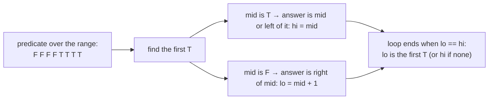
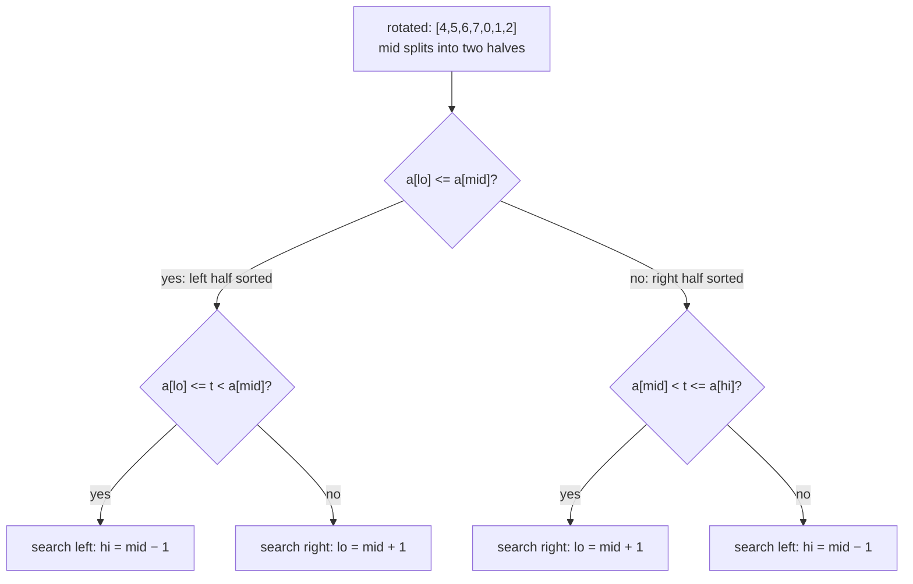
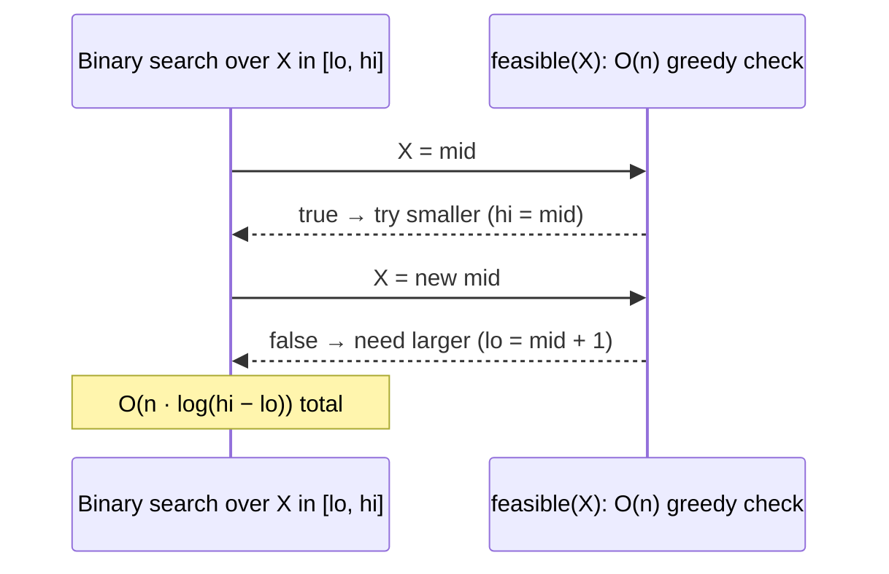

# Binary Search Patterns

!!! abstract "TL;DR"
    - Binary search works on anything **monotonic**: a sorted array, or any yes/no predicate that flips **once** from false to true over a range (`canFinish(speed)`, `fitsIn(capacity)`). Each step halves the range: **O(log n)**. 10M elements need at most **24** probes. Measured: 1,000,000 binary searches over 10M sorted ints took **368 ms** (368 ns each), while one linear scan averaged **2,020 µs**.
    - **Use one template and state its invariant.** The most reusable is **"first index where the predicate is true"** on a half-open range `[lo, hi)`: `while (lo < hi) { mid = (lo+hi)>>>1; if (ok(mid)) hi = mid; else lo = mid + 1; }`. `lowerBound` (first ≥ t) and `upperBound` (first > t) are instances of it. Together they give the first and last positions of a value and the count of duplicates.
    - **Midpoints:** `(lo + hi) / 2` **overflowed** to −397,483,648 for lo = 1.5e9, hi = 2e9. `lo + (hi − lo) / 2` and `(lo + hi) >>> 1` gave 1,750,000,000 (measured). Pairing `lo = mid` with a floor midpoint **loops forever** on a two-element range (measured: stuck at lo=0, hi=1). Use a ceiling midpoint in that case.
    - **Java APIs:** `Arrays.binarySearch` returns **any** matching index with duplicates (index 3 in `[1,2,2,2,2,2,3]`, measured) and `−(insertionPoint) − 1` when the value is absent (`−3` → insertion point 2 for 4 in `[1,3,5,7]`). On unsorted input the result is undefined.
    - **Patterns:**
        - Rotated sorted array: one half is always sorted.
        - Minimum of a rotated array: compare with `a[hi]`.
        - Peak element: move towards the larger neighbour.
        - 2D matrix as a flat sorted array.
        - **Binary search on the answer:** minimise the maximum or find the minimum feasible value with an O(n) feasibility check, giving O(n log range).
        - Median of two sorted arrays: binary-search the partition, O(log min(m, n)).
    - All patterns on this page passed **27,000** randomised checks against linear or brute-force versions.

## Why it matters

Binary search is simple to describe and notoriously easy to get wrong: off-by-one errors, infinite loops, overflow, wrong handling of duplicates. Interviewers use it to test precise reasoning about invariants, and "binary search on the answer" problems test whether you can spot monotonicity in an optimisation problem. In production: database B-tree lookups, `git bisect` to find a regression, finding the maximum safe throughput or batch size, version ranges, and time-series lookups.

All code ran on Java 21 and each pattern was checked against linear or brute-force versions on 3,000 random inputs.

## Core concepts

### The invariant view


*Notice that every binary search can be phrased as "find the boundary between F and T". Once you define the predicate, the template does the rest and the off-by-one decisions disappear.*

**Invariant** for the first-true template on `[lo, hi)`: everything before `lo` is false, everything from `hi` onwards is true (or out of range). Each step shrinks the unknown range `[lo, hi)` while keeping the invariant, so when `lo == hi`, it's the boundary.

### Three templates

| Template | Range | Loop | Updates | Returns | Use for |
|---|---|---|---|---|---|
| **Exact match** | `[lo, hi]` closed | `lo <= hi` | `lo = mid + 1` / `hi = mid − 1` | index or −1 | "Is x present?" with distinct values |
| **First true (lower bound)** | `[lo, hi)` half-open | `lo < hi` | true: `hi = mid`; false: `lo = mid + 1` | boundary index (`hi` = none) | First ≥ x, first bad version, minimum feasible value |
| **Last true** | `[lo, hi]` | `lo < hi` | true: `lo = mid`; false: `hi = mid − 1`, with **ceiling** mid | last index where true | Integer square root, maximum feasible value |

**Midpoint rules:**

- Avoid `(lo + hi) / 2` with large ints (overflow, measured negative). Use `lo + (hi − lo) / 2` or `(lo + hi) >>> 1` (unsigned shift works for non-negative indices).
- If a branch sets `lo = mid`, use the **ceiling** midpoint `lo + (hi − lo + 1) / 2`, otherwise a two-element range never shrinks (measured infinite loop).
- If a branch sets `hi = mid`, use the floor midpoint.

### Lower bound, upper bound and duplicates

For a sorted array and target t:

- `lowerBound(t)` = first index with `a[i] >= t` (the insertion point that keeps order, before equal elements).
- `upperBound(t)` = first index with `a[i] > t`.
- First occurrence = `lowerBound` if `a[lb] == t`. Last occurrence = `upperBound − 1`. Count = `upperBound − lowerBound`.
- Measured on `[1,2,2,2,2,2,3]`, t = 2: `lowerBound` 1, `upperBound` 6 (count 5), while `Arrays.binarySearch` returned 3: *some* match.

Java equivalents: `TreeMap.ceilingKey/floorKey/higherKey/lowerKey` and `TreeSet.ceiling/floor` provide the same queries on sorted sets. `Arrays.binarySearch` gives an insertion point for missing values (`−(ip) − 1`).

### Searching modified sorted arrays


*Notice the key fact: in a rotated sorted array (distinct values), at least one half around `mid` is always sorted, and a sorted half lets you test whether the target lies in it with two comparisons.*

- **Minimum of a rotated array:** if `a[mid] > a[hi]`, the minimum is to the right (`lo = mid + 1`), else it's at mid or to the left (`hi = mid`). With duplicates, `a[mid] == a[hi]` gives no information, so shrink `hi--`, which degrades the worst case to O(n).
- **Peak element** (any element greater than its neighbours): if `a[mid] < a[mid+1]`, a peak exists to the right, so climb towards the larger neighbour. O(log n) even though the array isn't sorted. The predicate "`a[i] < a[i+1]`" is what you're searching on.
- **2D matrix with each row sorted and each row starting after the previous row ends:** treat it as a flat array of R·C elements, `value = m[mid / C][mid % C]`. For a matrix sorted by rows and columns separately, start at the top-right corner and step left or down: O(R + C).
- **Unknown length or infinite stream:** double the upper bound (1, 2, 4, 8…) until it passes the target (exponential search), then binary search: O(log p) for position p.

### Binary search on the answer

Many optimisation problems ask for the minimum (or maximum) value X such that something is feasible, where feasibility is **monotonic**: if X works, every larger X works too.


*Notice that you never construct the optimal solution directly. You only need a fast yes/no check, and binary search finds the threshold.*

| Problem | X | Feasibility check | Range |
|---|---|---|---|
| Koko eating bananas | Eating speed k | `Σ ceil(pile / k) ≤ h` | [1, max pile] |
| Ship packages within D days | Capacity | Greedy fill days ≤ D | [max weight, sum] |
| Split array largest sum (k parts) | Max part sum | Greedy parts ≤ k | [max, sum] |
| Minimum days to make bouquets | Day | Count bouquets ready by that day | [min, max] bloom day |
| Aggressive cows / magnetic balls | Minimum distance | Greedy placement count ≥ k | [1, span] |
| Integer square root | Root | `mid² ≤ x` (last true, use `long`) | [0, x] |

Both feasibility checks above (Koko and ship capacity) were verified against linear search over every candidate.

### Median of two sorted arrays

Binary search on how many elements to take from the shorter array (`i`), with `j = half − i` from the other, so the left partition has exactly half the elements. A partition is correct when `A[i−1] ≤ B[j]` and `B[j−1] ≤ A[i]` (using −∞/+∞ at the edges). Then the median comes from the boundary values. O(log min(m, n)). Verified against merge-and-sort on 3,000 random pairs, including empty arrays.

## In practice: code & configuration

### The templates

```java
// 1) Exact match in a sorted array of distinct values
static int search(int[] a, int target) {
    int lo = 0, hi = a.length - 1;                  // closed range [lo, hi]
    while (lo <= hi) {
        int mid = lo + (hi - lo) / 2;               // no overflow
        if (a[mid] == target) return mid;
        if (a[mid] < target) lo = mid + 1; else hi = mid - 1;
    }
    return -1;
}

// 2) First index with a[i] >= target (lower bound); a.length if none
static int lowerBound(int[] a, int target) {
    int lo = 0, hi = a.length;                      // half-open [lo, hi)
    while (lo < hi) {
        int mid = (lo + hi) >>> 1;
        if (a[mid] < target) lo = mid + 1;          // answer is right of mid
        else hi = mid;                              // mid could be the answer
    }
    return lo;
}

// upperBound: change the condition to a[mid] <= target

// 3) Generic: first value in [lo, hi] where ok(x) is true (assumes ok(hi) is true)
static long firstTrue(long lo, long hi, LongPredicate ok) {
    while (lo < hi) {
        long mid = lo + (hi - lo) / 2;
        if (ok.test(mid)) hi = mid; else lo = mid + 1;
    }
    return lo;
}
```

### Midpoint and loop pitfalls

=== "❌ Overflow and non-shrinking range"

    ```java
    int mid = (lo + hi) / 2;          // lo=1.5e9, hi=2e9 → -397,483,648 (measured)

    // "last true" with a floor midpoint:
    while (lo < hi) {
        int mid = (lo + hi) / 2;      // lo=0, hi=1 → mid=0
        if (ok(mid)) lo = mid;        // lo stays 0: infinite loop (measured)
        else hi = mid - 1;
    }
    ```

=== "✅ Safe midpoint, matching rounding"

    ```java
    int mid = lo + (hi - lo) / 2;     // or (lo + hi) >>> 1 for non-negative ints

    // "last true": round the midpoint up when the true-branch sets lo = mid
    while (lo < hi) {
        int mid = lo + (hi - lo + 1) / 2;
        if (ok(mid)) lo = mid;
        else hi = mid - 1;
    }
    ```

### Rotated array: search and minimum

```java
static int searchRotated(int[] a, int target) {           // distinct values
    int lo = 0, hi = a.length - 1;
    while (lo <= hi) {
        int mid = lo + (hi - lo) / 2;
        if (a[mid] == target) return mid;
        if (a[lo] <= a[mid]) {                             // left half is sorted
            if (a[lo] <= target && target < a[mid]) hi = mid - 1;
            else lo = mid + 1;
        } else {                                           // right half is sorted
            if (a[mid] < target && target <= a[hi]) lo = mid + 1;
            else hi = mid - 1;
        }
    }
    return -1;
}

static int findMin(int[] a) {
    int lo = 0, hi = a.length - 1;
    while (lo < hi) {
        int mid = (lo + hi) >>> 1;
        if (a[mid] > a[hi]) lo = mid + 1;                  // drop point is right of mid
        else hi = mid;                                     // mid could be the minimum
    }
    return a[lo];
}
```

### Binary search on the answer

```java
// Minimum eating speed to finish all piles within h hours
static int minEatingSpeed(int[] piles, int h) {
    int max = Arrays.stream(piles).max().getAsInt();
    return (int) firstTrue(1, max, k -> {
        long hours = 0;                                   // long: sums can exceed int
        for (int p : piles) hours += (p + k - 1) / k;     // ceil(p / k) without floating point
        return hours <= h;                                // monotonic: faster speed never needs more hours
    });
}

// Minimum ship capacity to deliver in order within `days`
static int shipWithinDays(int[] weights, int days) {
    int lo = Arrays.stream(weights).max().getAsInt();     // must fit the heaviest package
    int hi = Arrays.stream(weights).sum();                // everything in one day
    return (int) firstTrue(lo, hi, cap -> {
        int needed = 1;
        long load = 0;
        for (int w : weights) {
            if (load + w > cap) { needed++; load = 0; }   // start a new day
            load += w;
        }
        return needed <= days;
    });
}
// O(n log(sum)) each
```

### Integer square root without floating point

```java
static int isqrt(int x) {
    long lo = 0, hi = x;
    while (lo < hi) {
        long mid = (lo + hi + 1) >>> 1;          // ceiling: the true-branch sets lo = mid
        if (mid * mid <= x) lo = mid;            // long: mid² overflows int
        else hi = mid - 1;
    }
    return (int) lo;
}
```

### Using the JDK correctly

```java
int[] sorted = {1, 3, 5, 7};
int i = Arrays.binarySearch(sorted, 4);          // -3: not found
int insertionPoint = -i - 1;                     // 2: where 4 would go

// Duplicates: binarySearch returns any match. For first/last occurrence use lower/upper bound.
// Unsorted input: result undefined (Collections.binarySearch on [5,1,4,2,3] for 1 returned -1)

TreeMap<Instant, Price> prices = new TreeMap<>();
prices.floorEntry(t);                            // latest price at or before t: O(log n)
```

## Real-world usage

- **Database indexes:** B-tree lookups binary-search within each page and descend levels. Sorted SSTables in LSM stores (Cassandra, RocksDB) use binary search over block indexes.
- **`git bisect`:** binary search over commits for the first bad one (a first-true search over history). Similar tools exist for bisecting dependency versions or config changes.
- **Capacity and load testing:** finding the highest throughput that keeps p99 latency under the SLO, or the largest batch size that fits memory, is binary search on the answer with a test run as the feasibility check.
- **Time-series and versioned data:** "value as of time t" uses floor lookups (`TreeMap.floorEntry`, sorted arrays of timestamps).
- **Networking:** TCP congestion control's binary increase (BIC) and path MTU discovery searches use similar halving ideas.
- **Libraries:** `Arrays.binarySearch`, `Collections.binarySearch`, `TreeMap` navigation, and `java.util.Arrays.sort`'s insertion step for small runs (binary insertion sort in TimSort).

## Trade-offs & production gotchas

!!! warning "Binary search pitfalls"
    - **Overflow in `(lo + hi) / 2`** for large ints (measured negative midpoint). Use `lo + (hi − lo) / 2` or `>>> 1`.
    - **Infinite loops** when `lo = mid` uses a floor midpoint (measured). Match rounding to the update.
    - **Mixing templates** (closed range with `hi = mid`, or half-open with `hi = mid − 1`). Pick one and keep its invariant.
    - **Duplicates:** `Arrays.binarySearch` returns any match (measured index 3 of 1..5). Use lower/upper bounds for first/last.
    - **Unsorted input:** results are undefined, not an exception (measured −1 for a present value).
    - **Non-monotonic predicates** in binary search on the answer: the search silently returns garbage. Prove monotonicity first.
    - **Wrong search range** for answer problems: the lower bound must be feasible-possible (e.g. ship capacity ≥ max weight), and the upper bound must be feasible.
    - **Overflow inside the check** (`mid * mid`, summing hours). Use `long`.
    - **Floating-point binary search:** iterate a fixed number of times (e.g. 100) or until `hi − lo < ε`, rather than testing equality.

- **Binary search vs hash lookup:** O(log n) on a sorted array with tiny memory and range queries vs O(1) expected with more memory and no ordering.
- **Binary search vs linear scan:** for very small arrays (tens of elements), a linear scan can be as fast thanks to branch prediction and cache locality. On large arrays, random binary searches are dominated by cache misses (368 ns each on 10M ints), which is why B-trees group keys into pages.

## How this connects to my experience

- **Not a resume item as DSA.** The pattern shows up in operations and debugging.
- **Honest bridges:** finding the change that introduced a regression across releases or commits (a bisect over CI builds), tuning Kafka consumer batch sizes or connection-pool sizes to the largest value that meets latency targets (binary search on the answer with load tests), and database index lookups in MongoDB and PostgreSQL. *[confirm: any time you bisected a regression or tuned a limit this way]*
- **Talking points:**
    - "I phrase every binary search as 'find the first index where a predicate is true', state the invariant, and the off-by-ones take care of themselves."
    - "When a problem asks for the minimum value that makes something possible, I check whether feasibility is monotonic. If so, binary search on the answer with an O(n) check."

## Interview questions

### Fundamentals

??? question "Q1. What conditions does binary search need, and what is its complexity?"
    **Answer:** A search space where a yes/no predicate is monotonic: false for a prefix and true for the rest (a sorted array is the classic case: `a[i] >= target`). Each comparison halves the remaining range, so it takes O(log n) steps: at most 24 for 10 million elements. It needs O(1) access to the middle element (arrays, not linked lists) and O(1) extra space iteratively. Measured: 1,000,000 binary searches over 10M ints took 368 ms in total, while a single linear scan averaged about 2 ms.

    **Interviewer listens for:** monotonic predicate (not just "sorted"), log n, random access.

    **Common wrong answer:** "It only works on sorted arrays of numbers."

??? question "Q2. How do you find the first and last positions of a value in a sorted array with duplicates?"
    **Answer:** Two boundary searches. Lower bound: first index with `a[i] >= t`. Upper bound: first index with `a[i] > t`. If `lowerBound < n` and `a[lowerBound] == t`, the first position is `lowerBound` and the last is `upperBound − 1`; the count is `upperBound − lowerBound`. Both are O(log n). Measured on `[1,2,2,2,2,2,3]`: bounds 1 and 6, while `Arrays.binarySearch` returned 3 (any matching index). Avoid finding one match and scanning outwards, which is O(n) for many duplicates.

    **Interviewer listens for:** two bound searches, duplicates, avoiding linear expansion.

    **Common wrong answer:** Using `Arrays.binarySearch` and assuming it returns the first occurrence.

??? question "Q3. Why is `(lo + hi) / 2` dangerous, and what do you use instead?"
    **Answer:** With large indices or values, `lo + hi` exceeds `Integer.MAX_VALUE` and wraps negative: measured −397,483,648 for lo = 1.5 billion, hi = 2 billion. This bug lived in the JDK's own `Arrays.binarySearch` for years (fixed in 2006, described by Joshua Bloch). Use `lo + (hi − lo) / 2`, or `(lo + hi) >>> 1` (unsigned shift, correct for non-negative ints). For searches over values (answer ranges) use `long`.

    **Interviewer listens for:** overflow explanation, fixes, historical context is a bonus.

    **Common wrong answer:** "It's fine because arrays can't be that large." (Answer-space searches easily are.)

??? question "Q4. What does `Arrays.binarySearch` return when the key isn't found?"
    **Answer:** `−(insertionPoint) − 1`, where the insertion point is the index of the first element greater than the key (or the array length). For 4 in `[1,3,5,7]` it returned −3, so the insertion point is `−(−3) − 1 = 2`. The encoding keeps "not found" negative even when the insertion point is 0. With duplicates it returns any matching index, and on unsorted input the result is undefined (measured −1 for a value that is present).

    **Interviewer listens for:** encoding formula, duplicates and unsorted caveats.

    **Common wrong answer:** "It returns −1 when not found."

### Intermediate

??? question "Q5. Search for a target in a rotated sorted array."
    **Answer:** Modified binary search. At each step one half around `mid` is sorted: if `a[lo] <= a[mid]`, the left half is; otherwise the right half is. If the target is within the sorted half's range, search there; otherwise search the other half. O(log n) for distinct values. With duplicates, `a[lo] == a[mid] == a[hi]` gives no information: shrink both ends, which makes the worst case O(n). An alternative is to find the rotation point first (the minimum), then binary-search the appropriate half.

    **Interviewer listens for:** "one half is sorted" insight, range checks, duplicate caveat.

    **Common wrong answer:** Linear search, or rotating the array back first (O(n)).

??? question "Q6. Find a peak element in an unsorted array in O(log n)."
    **Answer:** Compare `a[mid]` with `a[mid+1]`. If `a[mid] < a[mid+1]`, a peak exists to the right (the sequence rises there and must come down or end), so `lo = mid + 1`; otherwise a peak is at mid or to the left, so `hi = mid`. The loop ends at a peak. This works because the predicate "`a[i] > a[i+1]`" goes from false to true at a peak, even though the array isn't sorted. Assumes neighbours differ and treats out-of-range neighbours as −∞.

    **Interviewer listens for:** climb towards the larger neighbour, why a peak must exist, edge assumptions.

    **Common wrong answer:** "Binary search needs a sorted array, so it's O(n)."

??? question "Q7. What is \"binary search on the answer\"? Give an example."
    **Answer:** When asked for the minimum (or maximum) value that satisfies a condition, and feasibility is monotonic (if X works, larger X works too), binary search over the value range with a fast feasibility check. Example: Koko eating bananas: find the minimum speed k so all piles finish within h hours. The check sums `ceil(pile / k)`: O(n). The range is [1, max pile], giving O(n log max). Others: shipping capacity within D days (range [max weight, total weight]), split array largest sum, minimum days to make bouquets. Both the Koko and shipping solutions matched brute force on 3,000 random cases.

    **Interviewer listens for:** monotonic feasibility, correct bounds, complexity.

    **Common wrong answer:** Trying every value linearly, or dynamic programming when a greedy check suffices.

??? question "Q8. How do you search a matrix where each row is sorted and each row starts after the previous ends? And one where rows and columns are sorted independently?"
    **Answer:** The first is a sorted array laid out in rows: binary-search the index range [0, R·C) and map `mid` to `m[mid / C][mid % C]`. O(log(R·C)). For rows and columns sorted independently, start at the top-right corner: if the value is larger than the target, move left (the column below is even larger); if smaller, move down. O(R + C). Binary search per row would be O(R log C).

    **Interviewer listens for:** index mapping, staircase search for the second kind, complexities.

    **Common wrong answer:** Using the flat binary search on the second kind of matrix.

### Senior

??? question "Q9. Find the median of two sorted arrays in O(log(min(m, n)))."
    **Answer:** Binary-search the partition of the shorter array A: take i elements from A and `j = (m + n + 1)/2 − i` from B so the left side holds half the elements. The partition is correct when `A[i−1] <= B[j]` and `B[j−1] <= A[i]` (with −∞ and +∞ at the edges). If `A[i−1] > B[j]`, take fewer from A (`hi = i − 1`); otherwise take more (`lo = i + 1`). The median is `max(left sides)` for odd totals, or the average of `max(left)` and `min(right)` for even totals (computed in `long` or `double`). Verified on 3,000 random pairs including an empty array. Merging is O(m + n).

    **Interviewer listens for:** partition idea, correctness condition, edges, searching the shorter array.

    **Common wrong answer:** Merging both arrays and taking the middle, presented as optimal.

??? question "Q10. How do you avoid off-by-one errors and infinite loops in binary search?"
    **Answer:** Use a fixed template and write down its invariant. For "first true" on `[lo, hi)`: everything before lo is false, everything from hi on is true; `while (lo < hi)`; true → `hi = mid`, false → `lo = mid + 1`; floor midpoint. For "last true" with `lo = mid`, use a ceiling midpoint, or a two-element range never shrinks (measured stuck at lo=0, hi=1). Check that every branch strictly shrinks the range, test with 0, 1 and 2 elements and with targets below, above and between values, and define what's returned when nothing is true.

    **Interviewer listens for:** invariant, template consistency, rounding rule, small-case testing.

    **Common wrong answer:** "Add or subtract one until the tests pass."

??? question "Q11. Split an array into k contiguous parts minimising the largest part sum."
    **Answer:** Binary search on the answer S (the largest allowed part sum) over [max element, total sum]. Feasibility: greedily add elements to the current part while the sum stays ≤ S, starting a new part when it would exceed; feasible if the number of parts ≤ k. Larger S never needs more parts, so feasibility is monotonic. O(n log(sum)). A DP solution is O(k·n²) or O(k·n) with optimisations, so binary search is simpler and faster here. Same structure as shipping within D days.

    **Interviewer listens for:** recognising the min-max structure, greedy check, bounds, comparison with DP.

    **Common wrong answer:** Trying all split positions recursively.

??? question "Q12. When is binary search not the right tool, even on sorted data?"
    **Answer:** When data lacks O(1) random access (linked lists, where reaching the middle is O(n)), when n is tiny (a linear scan is simpler and can be faster thanks to branch prediction and locality), when you need many lookups and memory allows (a hash map gives O(1) expected), when data changes often (keeping an array sorted costs O(n) per insert, so use a balanced tree), or when data lives on disk (B-trees, which group many keys per page, reduce I/O compared with a plain binary search, which suffers cache and I/O misses: measured 368 ns per lookup even in memory on 10M ints).

    **Interviewer listens for:** access model, small n, update cost, cache and I/O.

    **Common wrong answer:** "Binary search is always best for sorted data."

### Scenario-based

??? question "Q13. A performance regression appeared somewhere in the last 400 commits. How do you find it quickly?"
    **Answer:** It's a first-true search over commit history: "is this commit slow?" is false before the regression and true after (assuming it stays). Use `git bisect` (`git bisect start; git bisect bad HEAD; git bisect good v2.3.0`) with a reproducible benchmark script (`git bisect run ./perf-check.sh` returning non-zero when slow). That needs about log₂ 400 ≈ 9 builds and benchmark runs instead of hundreds. Make the benchmark stable (warm-up, multiple runs, a clear threshold), and handle untestable commits with `git bisect skip`. If several changes combined to cause it, bisection finds the first commit where it crossed the threshold.

    **Interviewer listens for:** monotonic predicate over history, git bisect run, stable benchmark, log₂ steps.

    **Common wrong answer:** Reading through all 400 diffs.

??? question "Q14. You must find the highest request rate a service can sustain with p99 latency under 200 ms. How do you approach it?"
    **Answer:** Treat "p99 < 200 ms at rate R" as a predicate that's true up to some threshold and false after it. Binary search on R between a known-good rate and a known-bad rate, running a load test (Gatling, k6) at each midpoint long enough to reach steady state. That gives a tight answer in about log₂(range/precision) runs. Caveats: measurements are noisy, so repeat runs and leave a margin; warm caches and JIT before measuring; and the system may not be strictly monotonic (GC or autoscaling effects), so confirm the final value with a longer soak test. Report the result with the configuration it was measured on.

    **Interviewer listens for:** monotonic predicate, binary search on the answer, noise and warm-up handling, soak confirmation.

    **Common wrong answer:** Increasing the load in small fixed steps until it fails, without bounding the number of runs.

## Cheat sheet

| Topic | Remember |
|---|---|
| Requirement | Monotonic predicate (F…F T…T) + random access |
| Cost | O(log n): 24 probes for 10M; 368 ns each measured |
| First true | `[lo,hi)`, `lo<hi`, true→`hi=mid`, false→`lo=mid+1`, floor mid |
| Last true | true→`lo=mid` needs ceiling mid `lo+(hi−lo+1)/2` |
| Midpoint | `lo+(hi−lo)/2` or `(lo+hi)>>>1`; `(lo+hi)/2` overflowed (measured) |
| Bounds | lower (first ≥), upper (first >); count = upper − lower |
| JDK | `Arrays.binarySearch`: any match; not found = −(ip)−1; unsorted undefined |
| Rotated | One half sorted; min: compare with `a[hi]`; duplicates → O(n) worst |
| Peak | Move towards the larger neighbour |
| Matrix | Flat index `mid/C, mid%C`; row+col sorted → staircase O(R+C) |
| On the answer | Monotonic feasibility + O(n) check: O(n log range); Koko, ship, split array |
| Median of 2 | Partition the shorter array, O(log min) |

## Sources
1. Knuth, *The Art of Computer Programming*, Vol. 3, §6.2.1 (searching an ordered table).
2. Jon Bentley, *Programming Pearls* (2nd ed.), column 4 "Writing Correct Programs" (binary search invariants).
3. Joshua Bloch, [Extra, Extra – Read All About It: Nearly All Binary Searches and Mergesorts are Broken](https://research.google/blog/extra-extra-read-all-about-it-nearly-all-binary-searches-and-mergesorts-are-broken/) (Google Research blog, 2006).
4. [Java SE 21 API: Arrays.binarySearch](https://docs.oracle.com/en/java/javase/21/docs/api/java.base/java/util/Arrays.html#binarySearch(int%5B%5D,int)) and [Collections.binarySearch](https://docs.oracle.com/en/java/javase/21/docs/api/java.base/java/util/Collections.html#binarySearch(java.util.List,T)).
5. [git-bisect documentation](https://git-scm.com/docs/git-bisect).
6. Cormen, Leiserson, Rivest, Stein, *Introduction to Algorithms* (4th ed.), divide-and-conquer.
7. Demonstrations on this page: Java 21, each pattern checked against linear or brute-force versions on 3,000 random inputs (27,000 checks), timings from single runs after warm-up, run while writing this page.
