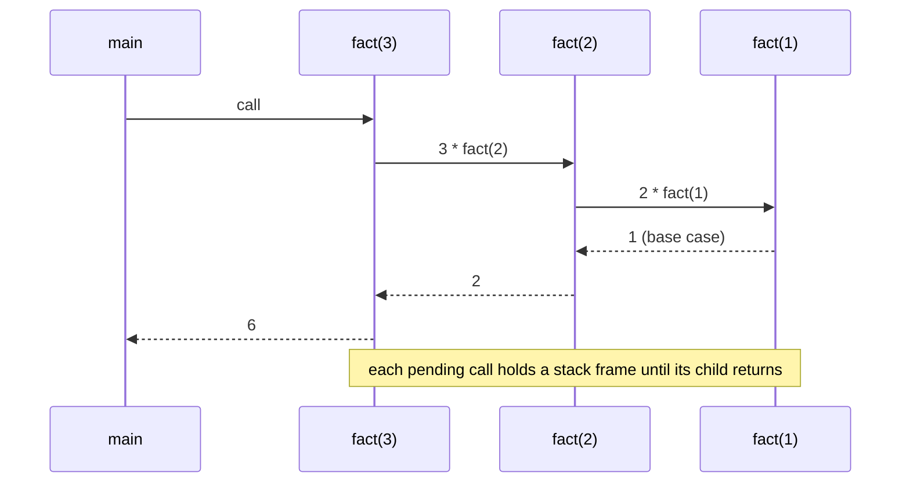
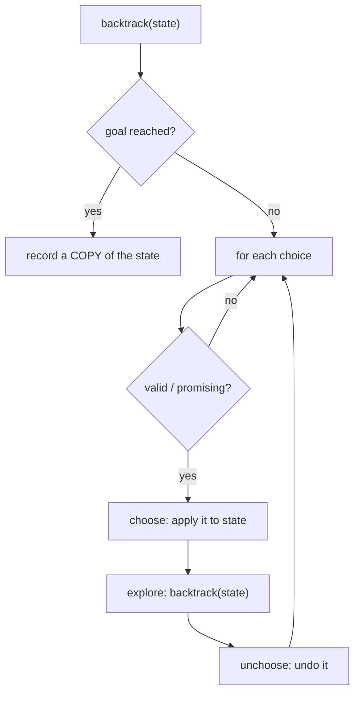
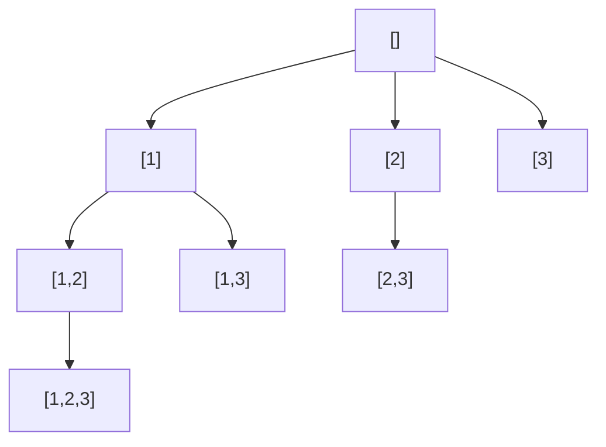

# Recursion & Backtracking

!!! abstract "Key takeaways"
    - **Recursion:** solve a problem by calling yourself on a **smaller** input. You need a **base case**, progress towards it, and to trust that the recursive call returns the right answer for the smaller input. Each call uses a stack frame: the default 1 MB Java thread stack held about **45,000** frames of a trivial method before `StackOverflowError`, and a thread created with a 64 MB stack held about 4.2 million (measured). Real frames are bigger, so practical depth limits are lower.
    - **Backtracking** builds candidates step by step and abandons a partial candidate as soon as it can't lead to a valid solution. The template is **choose → explore → unchoose**, with **copies** taken only when you record a solution (`new ArrayList<>(path)`).
    - **The four shapes:**
        - **Subsets:** each element in or out, 2ⁿ results.
        - **Combinations:** choose k, or a target sum, with a `start` index to avoid reordering.
        - **Permutations:** n! results, with a `used[]` array.
        - **Constraint placement:** N-Queens, Sudoku, word search.
        - **Duplicates** in the input: sort, then skip `a[i] == a[i-1]` at the same depth (for permutations, skip when the previous equal element is unused).
    - **Pruning is the whole game:** N-Queens n = 8 explored **19,173,961** nodes without pruning vs **2,057** with column and diagonal checks (92 solutions). Bitmask state made n = 14 **20× faster**: 253 ms vs 4,974 ms for 365,596 solutions (measured).
    - **Complexity** = nodes in the search tree × work per node: subsets O(n·2ⁿ), permutations O(n·n!) (3,628,800 permutations of 10 took 1.3 s, measured), generate parentheses gives the Catalan numbers (1, 1, 2, 5, 14, 42…, verified). If subproblems **repeat**, add memoisation, which turns it into [dynamic programming](10-dynamic-programming-patterns.md).
    - All solutions on this page were checked against brute force, closed-form counts (2ⁿ, n!, Catalan numbers, known N-Queens counts) or a DP count.

## Why it matters

Backtracking problems (subsets, permutations, combination sum, N-Queens, word search) are standard in coding rounds, and recursion is the foundation for trees, graphs, divide and conquer and dynamic programming. Interviewers watch for a clean template, correct handling of duplicates, aliasing bugs (adding the same mutable list to the results), pruning, and an honest exponential complexity analysis. In real systems the same ideas power constraint solvers (scheduling, configuration), parsers (recursive descent), regex engines (and catastrophic backtracking, ReDoS), and recursive traversals of JSON, file systems and GraphQL queries.

All solutions ran on Java 21 and were checked against brute-force enumeration or closed-form counts.

## Core concepts

### Designing a recursive function

1. **Define the function precisely:** "`subsets(i)` returns all subsets of `a[i..]`" or "`solve(row)` places queens in rows `row..n-1`".
2. **Base case(s):** the smallest inputs answered directly (empty array, `row == n`, target 0).
3. **Recursive case:** reduce to smaller inputs and combine. Trust the definition for the smaller call (the "leap of faith").
4. **Progress:** every call must move towards a base case, or it recurses forever.


*Notice that the frames pile up until the base case returns. Depth n means O(n) stack memory, which is why deep recursion overflows.*

**Java and the stack:** each thread has a fixed stack (default 1 MB on 64-bit Linux, `-Xss` to change it). Measured: about 45,000 frames of a trivial recursive method on the default stack, about 4.2 million with a 64 MB thread stack (`new Thread(group, task, name, stackSize)`). Java has no tail-call optimisation, so a tail-recursive method still uses a frame per call. Convert deep recursion to iteration with an explicit stack, or use a thread with a larger stack when the depth is bounded and known.

### Recursion shapes

| Shape | Calls per level | Example | Typical cost |
|---|---|---|---|
| Linear | 1 | Factorial, list traversal, sum of digits | O(n) time, O(n) stack |
| Divide and conquer | 2 on halves | Merge sort, binary search (1 call), tree height | O(n log n) / O(log n) |
| Tree recursion | 2+ on overlapping inputs | Naive Fibonacci | Exponential: memoise |
| Backtracking | Up to n choices, with undo | Subsets, permutations, N-Queens | Exponential, cut down by pruning |

### The backtracking template


*Notice the undo step. Because the same `path` object is reused through the whole search, every change must be reversed before trying the next choice, and solutions must be copied when recorded.*

```java
void backtrack(State state, List<Result> results) {
    if (isGoal(state)) { results.add(copyOf(state)); return; }
    for (Choice c : choices(state)) {
        if (!isValid(state, c)) continue;   // prune early
        apply(state, c);                    // choose
        backtrack(state, results);          // explore
        undo(state, c);                     // unchoose
    }
}
```

### Subsets, combinations, permutations


*Notice the subsets tree for [1,2,3] using a `start` index: each node is a subset (record at every node), and children only use later elements, so [2,1] never appears. That index is what separates combinations from permutations.*

| Problem | Key state | Record when | Avoid duplicates by | Count |
|---|---|---|---|---|
| Subsets | `start` index | Every node | Children start at `j + 1` | 2ⁿ |
| Subsets with duplicates | `start`, sorted input | Every node | Skip `j > start && a[j] == a[j−1]` | Distinct multisets |
| Combinations (n choose k) | `start`, size | Size == k | `start` index; prune when too few remain | C(n, k) |
| Combination sum (reuse allowed) | `start`, remaining | Remaining == 0 | Recurse with `i` (not `i+1`); sorted → break when `a[i] > remaining` | Verified = DP count |
| Permutations | `used[]` | Length == n | — | n! |
| Permutations with duplicates | `used[]`, sorted | Length == n | Skip `a[i] == a[i−1] && !used[i−1]` | n! / ∏(multiplicity!) |

All counts were verified on 500 random inputs against bitmask enumeration (subsets), `HashSet` deduplication of all permutations, and a coin-change DP count (combination sum).

### Constraint problems and pruning

**N-Queens:** place n queens so none attack each other. Place one queen per row and choose a column, pruning if the column or either diagonal is taken.

| n = 8 | Nodes visited | Solutions |
|---|---|---|
| No pruning (check only complete boards) | 19,173,961 | 92 |
| Prune on column and diagonals | **2,057** | 92 |

Represent the occupied columns and diagonals as **bitmasks** (`cols`, `d1`, `d2`) and get the available positions with `~(cols | d1 | d2) & mask`, iterating set bits with `bit = avail & −avail`. Measured n = 14: 4,974 ms with array scanning vs **253 ms** with bitmasks. Known counts for n = 1..9 (1, 0, 0, 2, 10, 4, 40, 92, 352) were verified.

Other constraint problems: **Sudoku** (track row, column and box sets; choose the cell with the fewest candidates first), **word search** (DFS on a grid, mark the cell as used during the path and restore it after), **palindrome partitioning** (cut only at palindromic prefixes), **generate parentheses** (add `(` while open < n, add `)` while close < open). Counts follow the Catalan numbers (verified for n = 0..8).

**Pruning techniques:**

- **Feasibility checks** before recursing (constraints, remaining sum, remaining slots).
- **Sorting** so you can `break` once candidates exceed the remaining target.
- **Ordering heuristics:** most-constrained variable first (Sudoku), most promising choices first.
- **Bounding** (branch and bound): stop when the best possible completion can't beat the current best.
- **Symmetry breaking:** for N-Queens, only place the first queen in the left half and double the count.
- **Memoisation** when the same subproblem appears again: then it's DP.

### Complexity

Count nodes in the search tree × work per node, plus output size:

- Subsets: 2ⁿ nodes, each copied in O(n) → O(n·2ⁿ).
- Permutations: n! leaves (plus internal nodes), O(n) copy each → O(n·n!). Measured: 40,320 permutations of 8 in 4 ms, 3,628,800 of 10 in 1.3 s.
- Combinations C(n, k) × O(k).
- N-Queens: worst case O(n!), far less with pruning.
- Word search on an R×C board with word length L: O(R·C·3^L) (four directions at the start, three after, since you can't go back).
- Space: O(depth) for the recursion and path, plus the output.

## In practice: code & configuration

### Subsets and permutations

```java
static List<List<Integer>> subsets(int[] a) {
    List<List<Integer>> res = new ArrayList<>();
    backtrackSubsets(a, 0, new ArrayList<>(), res);
    return res;
}
static void backtrackSubsets(int[] a, int start, List<Integer> path, List<List<Integer>> res) {
    res.add(new ArrayList<>(path));                    // every node is a subset: record a copy
    for (int j = start; j < a.length; j++) {
        path.add(a[j]);                                // choose
        backtrackSubsets(a, j + 1, path, res);         // explore: only later elements
        path.remove(path.size() - 1);                  // unchoose
    }
}

static List<List<Integer>> permuteUnique(int[] input) {
    int[] a = input.clone();
    Arrays.sort(a);                                    // equal values adjacent
    List<List<Integer>> res = new ArrayList<>();
    backtrackPerm(a, new boolean[a.length], new ArrayList<>(), res);
    return res;
}
static void backtrackPerm(int[] a, boolean[] used, List<Integer> path, List<List<Integer>> res) {
    if (path.size() == a.length) { res.add(new ArrayList<>(path)); return; }
    for (int i = 0; i < a.length; i++) {
        if (used[i]) continue;
        if (i > 0 && a[i] == a[i - 1] && !used[i - 1]) continue; // use equal values in order only
        used[i] = true;
        path.add(a[i]);
        backtrackPerm(a, used, path, res);
        path.remove(path.size() - 1);
        used[i] = false;
    }
}
```

### The aliasing bug

=== "❌ Recording the shared list"

    ```java
    if (path.size() == k) {
        res.add(path);          // the same object every time; later undo steps empty it
        return;
    }
    // Result: k-length "solutions" that are all [] at the end
    ```

=== "✅ Record a copy"

    ```java
    if (path.size() == k) {
        res.add(new ArrayList<>(path));   // snapshot of the current path
        return;
    }
    ```

### Combination sum with pruning

```java
static List<List<Integer>> combinationSum(int[] candidates, int target) {
    int[] a = candidates.clone();
    Arrays.sort(a);                                        // enables early break
    List<List<Integer>> res = new ArrayList<>();
    backtrackSum(a, target, 0, new ArrayList<>(), res);
    return res;
}
static void backtrackSum(int[] a, int remaining, int start, List<Integer> path, List<List<Integer>> res) {
    if (remaining == 0) { res.add(new ArrayList<>(path)); return; }
    for (int i = start; i < a.length && a[i] <= remaining; i++) {  // sorted: stop when too big
        path.add(a[i]);
        backtrackSum(a, remaining - a[i], i, path, res);   // i, not i + 1: reuse allowed
        path.remove(path.size() - 1);
    }
}
```

### N-Queens with bitmasks

=== "❌ Generate full boards, then check"

    ```java
    // Try every column in every row and validate only at the end:
    // n = 8 explores 19,173,961 nodes (measured)
    ```

=== "✅ Prune with bitmask state"

    ```java
    static int totalNQueens(int n) {
        return place(n, 0, 0, 0, 0);
    }
    static int place(int n, int row, int cols, int diag1, int diag2) {
        if (row == n) return 1;
        int count = 0;
        int available = ~(cols | diag1 | diag2) & ((1 << n) - 1);  // free columns in this row
        while (available != 0) {
            int bit = available & -available;                       // lowest free column
            available -= bit;
            count += place(n, row + 1,
                           cols | bit,
                           (diag1 | bit) << 1,                       // diagonals shift each row
                           (diag2 | bit) >>> 1);
        }
        return count;
    }
    // n = 14: 365,596 solutions in 253 ms (array-scan version: 4,974 ms)
    ```

### Word search (grid backtracking)

```java
static boolean exist(char[][] board, String word) {
    for (int r = 0; r < board.length; r++)
        for (int c = 0; c < board[0].length; c++)
            if (dfs(board, word, 0, r, c)) return true;
    return false;
}
static boolean dfs(char[][] b, String w, int i, int r, int c) {
    if (i == w.length()) return true;
    if (r < 0 || c < 0 || r >= b.length || c >= b[0].length || b[r][c] != w.charAt(i)) return false;
    char saved = b[r][c];
    b[r][c] = '#';                                  // mark as used on this path
    boolean found = dfs(b, w, i + 1, r + 1, c) || dfs(b, w, i + 1, r - 1, c)
                 || dfs(b, w, i + 1, r, c + 1) || dfs(b, w, i + 1, r, c - 1);
    b[r][c] = saved;                                // restore (unchoose)
    return found;
}
```

### Generate parentheses

```java
static List<String> generateParenthesis(int n) {
    List<String> res = new ArrayList<>();
    gen(n, 0, 0, new StringBuilder(), res);
    return res;
}
static void gen(int n, int open, int close, StringBuilder sb, List<String> res) {
    if (sb.length() == 2 * n) { res.add(sb.toString()); return; }
    if (open < n)     { sb.append('('); gen(n, open + 1, close, sb, res); sb.setLength(sb.length() - 1); }
    if (close < open) { sb.append(')'); gen(n, open, close + 1, sb, res); sb.setLength(sb.length() - 1); }
}
// Only valid prefixes are built; counts are Catalan numbers 1, 1, 2, 5, 14, 42, ...
```

## Real-world usage

- **Constraint solvers:** scheduling (shifts, rooms, appointments), configuration and routing use backtracking with strong pruning, usually through libraries (OptaPlanner/Timefold, Google OR-Tools, SAT/SMT solvers) rather than hand-written search.
- **Parsers:** recursive-descent parsers (many JSON and expression parsers, GraphQL parsers) map grammar rules to recursive functions. Backtracking parsers try alternatives.
- **Regex engines:** Java's `java.util.regex` is a backtracking engine. Patterns like `(a+)+$` on a long non-matching input backtrack exponentially (ReDoS). Mitigate with possessive quantifiers or atomic groups, input limits, or non-backtracking engines (RE2).
- **Recursive data:** JSON/XML processing, file-system walks (`Files.walk` is iterative internally), GraphQL query execution (resolvers recurse over the selection set), and React's component tree.
- **Search and games:** puzzle solvers, game trees (minimax with alpha-beta pruning).
- **Security:** recursion-depth limits in parsers (Jackson's `StreamReadConstraints` nesting limit, GraphQL query depth limits) defend against stack exhaustion from deeply nested input.

## Trade-offs & production gotchas

!!! warning "Recursion and backtracking pitfalls"
    - **Missing or unreachable base case:** infinite recursion and `StackOverflowError`.
    - **Recording the shared path object** instead of a copy: all results end up empty or identical.
    - **Forgetting to undo** state (used flags, board cells, path): later branches see stale choices.
    - **Duplicate results** from duplicate input values: sort and skip equal values at the same depth.
    - **Deep recursion on large input:** about 45,000 trivial frames on a 1 MB stack (measured). Real methods hold fewer. Iterate, or bound the depth.
    - **No pruning:** N-Queens n = 8 went from 2,057 to 19 million nodes without it (measured).
    - **String concatenation in recursion** (`path + c`) creates O(L) copies per call. Use a `StringBuilder` with `setLength` to undo.
    - **Exponential blow-ups in production:** regex backtracking, recursive permission checks, and recursive GraphQL queries need limits and timeouts.
    - **Overlapping subproblems without memoisation:** exponential time for what DP solves polynomially.

- **Recursion vs iteration:** recursion is clearer for trees and backtracking; iteration with an explicit stack avoids depth limits and gives more control.
- **Backtracking vs DP:** backtracking enumerates solutions (needed when you must list them); DP counts or optimises when subproblems overlap (much faster when only a number is required).

## How this connects to my experience

- **Not a resume item as DSA.** Recursion shows up in backend and frontend work.
- **Honest bridges:** GraphQL query execution in the GraphQL Consumer Service at OptumRx is recursive over the selection set, and query depth or complexity limits protect against abusive nested queries. Recursive React components render nested data (trees, menus). Recursive processing of nested JSON from upstream systems. *[confirm: whether you configured GraphQL depth or complexity limits, or handled deeply nested payloads]*
- **Talking points:**
    - "I use one template, choose, explore, unchoose, and I always record a copy of the path."
    - "Pruning decides whether backtracking is usable: on 8-Queens it cut the search from 19 million nodes to about 2,000."
    - "If the same subproblem repeats, I memoise. That's the step from backtracking to DP."

## Interview questions

### Fundamentals

??? question "Q1. What makes a recursive function correct, and what happens on the call stack?"
    **Answer:** A precise definition of what the function returns, a base case for the smallest inputs, a recursive case that reduces to strictly smaller inputs, and combining results correctly (trusting the definition for the smaller call). Each call pushes a frame (parameters, locals, return address) onto the thread's stack, and frames pop as calls return. Depth d uses O(d) stack memory. The default 1 MB Java stack held about 45,000 frames of a trivial method (measured), and Java has no tail-call optimisation, so deep recursion can throw `StackOverflowError`.

    **Interviewer listens for:** base case, progress, stack frames, depth limit, no TCO in Java.

    **Common wrong answer:** "Recursion is always slower and should be avoided" or "the JVM optimises tail recursion."

??? question "Q2. What is backtracking, and how does it differ from brute force?"
    **Answer:** Backtracking builds a solution incrementally and abandons a partial solution as soon as it violates a constraint or can't lead to a valid answer, then undoes the last choice and tries the next. Brute force generates every complete candidate and checks each. Both are exponential in the worst case, but pruning makes backtracking vastly faster in practice: 8-Queens explored 2,057 nodes with pruning vs 19,173,961 checking complete boards (measured). Template: choose, explore, unchoose, recording a copy at the goal.

    **Interviewer listens for:** incremental construction, early abandonment, undo, pruning effect.

    **Common wrong answer:** "Backtracking is recursion that goes back up the stack."

??? question "Q3. Generate all subsets of a set of distinct numbers. What's the complexity?"
    **Answer:** Backtracking with a start index: record the current path at every node (each node is a subset), and for each `j` from `start`, add `a[j]`, recurse with `j + 1`, then remove it. Alternatives: include/exclude recursion (two branches per element), or iterate over bitmasks 0..2ⁿ−1. There are 2ⁿ subsets and copying each costs up to O(n), so O(n·2ⁿ) time, O(n) recursion space plus output. Verified that the results had 2ⁿ distinct subsets.

    **Interviewer listens for:** start index, recording at every node, 2ⁿ with copy cost.

    **Common wrong answer:** Claiming O(2ⁿ) without the copy cost, or O(n²).

??? question "Q4. What's the difference between permutation and combination backtracking?"
    **Answer:** Combinations (and subsets) ignore order, so you pass a `start` index and only pick elements after the last one chosen: `[1,2]` appears but `[2,1]` doesn't. Permutations care about order, so every unused element can come next: track `used[]` (or swap elements in place) and loop from 0 each time. Counts: C(n, k) combinations of size k vs n!/(n−k)! permutations. With duplicates, sort and skip equal values at the same level. For permutations the skip condition is `a[i] == a[i−1] && !used[i−1]`.

    **Interviewer listens for:** start index vs used array, counts, duplicate handling.

    **Common wrong answer:** Using a `HashSet` of results to remove duplicates (works, but wastes the exponential work).

### Intermediate

??? question "Q5. Find all combinations of candidates that sum to a target, where each candidate can be reused."
    **Answer:** Sort the candidates. Backtrack with `(remaining, start)`: if remaining is 0, record a copy; otherwise for `i` from `start` while `a[i] <= remaining` (the sorted order allows a `break`), add `a[i]`, recurse with `remaining − a[i]` and the **same** `i` (reuse allowed), then remove it. Using `i` instead of `i + 1` allows reuse, and the `start` index prevents permutations of the same multiset. If each candidate can be used once and the input has duplicates, recurse with `i + 1` and skip `a[i] == a[i−1]` for `i > start`. Verified: the number of results matched a coin-change DP count on 500 random cases.

    **Interviewer listens for:** start index, reuse vs single use, sorting for pruning, duplicate skipping.

    **Common wrong answer:** Recursing from index 0 every time, producing [2,3] and [3,2].

??? question "Q6. Solve N-Queens. How do you make it fast?"
    **Answer:** Place one queen per row. For each row, try each column that isn't attacked: same column, or same diagonal (`row − col` constant) or anti-diagonal (`row + col` constant). Track them in boolean arrays or sets for O(1) checks, and undo after recursing. Faster: bitmasks for columns and both diagonals; available columns are `~(cols | d1 | d2) & ((1 << n) − 1)`, iterate with `bit = avail & −avail`, and shift the diagonal masks by one each row. Measured n = 14: 253 ms with bitmasks vs 4,974 ms scanning arrays. Symmetry (mirror the first row) halves the work. Verified counts for n = 1..9.

    **Interviewer listens for:** row-by-row placement, diagonal identities, O(1) checks, bitmask optimisation.

    **Common wrong answer:** Checking the whole board after each placement.

??? question "Q7. Find whether a word exists in a grid of letters, moving to adjacent cells without reusing a cell."
    **Answer:** DFS backtracking from every cell matching the first letter. At each step, check bounds and the next character, mark the cell as used (overwrite with `#` or use a visited array), recurse into the four neighbours, then restore the cell. Return as soon as the whole word is matched. Worst case O(R·C·3^L) for word length L. Optimisations: check that the board contains enough of each letter first, and start from the rarer end of the word. For many words, build a trie of the words and search them together (word search II).

    **Interviewer listens for:** mark and restore, early return, complexity, trie for many words.

    **Common wrong answer:** BFS without per-path visited tracking (cells can be reused across paths).

??? question "Q8. Generate all valid combinations of n pairs of parentheses."
    **Answer:** Backtrack on a `StringBuilder`, tracking open and close counts. Add `(` while `open < n`, add `)` while `close < open`, and record when the length is 2n. These rules only ever build valid prefixes, so no invalid string is generated and checked. The count is the n-th Catalan number, C(2n, n)/(n+1): 1, 1, 2, 5, 14, 42, 132, 429, 1430 for n = 0..8 (verified). Complexity is about O(4ⁿ/√n) results × O(n) per string.

    **Interviewer listens for:** pruning rules, valid-prefix property, Catalan count.

    **Common wrong answer:** Generating all 2^(2n) strings and filtering.

### Senior

??? question "Q9. How do you analyse the time complexity of a backtracking algorithm?"
    **Answer:** Bound the number of nodes in the search tree and multiply by the work per node (copying, validity checks), and remember the output size as a lower bound. Subsets: 2ⁿ nodes × O(n) copy. Permutations: about e·n! nodes, O(n·n!) (3.6 million permutations of 10 took 1.3 s, measured). Combinations: C(n, k) × O(k). Pruning changes the actual count but usually not the worst-case bound, so state both: "worst case O(n!), but with diagonal pruning 8-Queens visits about 2,000 nodes." Space is O(depth) plus output.

    **Interviewer listens for:** nodes × work, output lower bound, worst case vs practical pruning.

    **Common wrong answer:** Counting loops in the code ("two loops, so O(n²)").

??? question "Q10. When should you convert backtracking to dynamic programming?"
    **Answer:** When the same subproblem is solved repeatedly and the answer depends only on a small state (index, remaining sum, a bitmask), and when you only need a count, an optimum or a yes/no answer rather than every solution. Then memoise on that state (top-down DP) or fill a table (bottom-up). Examples: "how many combinations sum to target?" (count with coin-change DP in O(n·target) instead of enumerating), word break (memoise on the start index), partition equal subset sum. If you must list all solutions, the output size itself is exponential, so backtracking remains, possibly with memoised feasibility to prune dead branches.

    **Interviewer listens for:** overlapping subproblems, state definition, count vs enumerate.

    **Common wrong answer:** "DP is always better than backtracking."

??? question "Q11. How do you handle recursion that may be too deep for the Java stack?"
    **Answer:** Estimate the maximum depth from input bounds. If it can be large or attacker-controlled (nested JSON, deep trees, long chains), convert to iteration with an explicit `ArrayDeque` stack holding the state you'd have kept in locals, including a "phase" for post-order work. Enforce input limits (maximum nesting depth, as Jackson and GraphQL servers do). If the depth is known and bounded but large, run the work on a dedicated thread with a bigger stack (measured: a 64 MB thread stack held about 4.2 million trivial frames vs 45,000 on the default 1 MB), rather than raising `-Xss` for every thread. Don't rely on tail-call optimisation: the JVM doesn't do it.

    **Interviewer listens for:** iterative conversion, input limits, per-thread stack size, no TCO.

    **Common wrong answer:** "Catch StackOverflowError and retry."

??? question "Q12. A regex validation endpoint sometimes pins a CPU at 100%. What's happening, and how do you fix it?"
    **Answer:** Catastrophic backtracking (ReDoS). Java's regex engine is a backtracking matcher, and patterns with nested or overlapping quantifiers, such as `(a+)+$` or `(\w+\s?)*$`, can try an exponential number of ways to match before failing on a crafted input. Fixes: rewrite the pattern to remove ambiguity, use possessive quantifiers (`a++`) or atomic groups (`(?>...)`) to stop backtracking, limit input length, add timeouts (run matching with an interruptible `CharSequence` wrapper or in a bounded task), or use a non-backtracking engine (RE2/J) for untrusted input. Add regex analysis to code review or static analysis.

    **Interviewer listens for:** backtracking engine, nested quantifiers, possessive/atomic, input limits, RE2.

    **Common wrong answer:** "The server needs more CPU."

### Scenario-based

??? question "Q13. You need to schedule 30 interviews into rooms and time slots with constraints (interviewer availability, no overlaps, candidate breaks). How would you approach it?"
    **Answer:** It's a constraint satisfaction problem. For a small instance, backtracking with strong pruning works: assign interviews one at a time, choosing the most constrained interview first (fewest valid slots), try slots in a sensible order, check constraints incrementally (availability, room conflicts, breaks), and backtrack on a dead end. Forward checking (remove slots that become invalid for remaining interviews and backtrack early when one has none left) cuts the search a lot. For real-world sizes or soft preferences, use a solver (Timefold/OptaPlanner, OR-Tools CP-SAT) that adds propagation, heuristics and local search. Return the best partial solution with explanations if it's infeasible.

    **Interviewer listens for:** CSP framing, most-constrained-first, forward checking, solver libraries.

    **Common wrong answer:** Generating all possible schedules and filtering.

??? question "Q14. A recursive permission check (role inherits role inherits role…) sometimes overflows the stack or loops forever. How do you fix it?"
    **Answer:** The role graph has a cycle (A inherits B inherits A) or is very deep, and the recursion has no visited tracking. Fix the traversal: treat roles as a graph and use iterative DFS or BFS with a visited set, so each role is expanded once (O(V + E)) and cycles terminate. Validate on write: reject an inheritance edge that would create a cycle (a reachability check before inserting), and limit the depth. Cache the resolved permission set per role and invalidate it when inheritance changes, since permission checks are frequent. Log and alert on detected cycles in existing data.

    **Interviewer listens for:** cycle detection with visited set, iterative traversal, validation on write, caching.

    **Common wrong answer:** "Increase the stack size."

## Cheat sheet

| Topic | Remember |
|---|---|
| Recursion | Definition, base case, smaller input, trust the call; O(depth) stack; no TCO in Java |
| Stack | ~45,000 trivial frames on 1 MB default; 64 MB thread ~4.2M (measured); iterate for deep input |
| Template | choose → explore → unchoose; record `new ArrayList<>(path)` |
| Subsets | `start` index, record every node; 2ⁿ, O(n·2ⁿ) |
| Combinations | `start` index; reuse → recurse with `i`; sort + break when too big |
| Permutations | `used[]`; n!; duplicates: skip `a[i]==a[i−1] && !used[i−1]` |
| Duplicates | Sort, skip equal values at the same depth |
| N-Queens | Row by row; diagonals `r−c`, `r+c`; bitmasks; 8-Queens 2,057 vs 19.2M nodes; n=14 253 ms vs 4,974 ms |
| Grid search | Mark cell, recurse, restore; O(R·C·3^L) |
| Parentheses | open < n, close < open; Catalan numbers |
| Complexity | Nodes × work per node; output is a lower bound |
| To DP | Overlapping subproblems + only count/optimum needed |

## Sources
1. Cormen, Leiserson, Rivest, Stein, *Introduction to Algorithms* (4th ed.), recursion and divide-and-conquer.
2. Steven Skiena, *The Algorithm Design Manual* (3rd ed.), combinatorial search and backtracking.
3. Knuth, *The Art of Computer Programming*, Vol. 4A/4B (combinatorial algorithms, backtrack programming, dancing links).
4. [Java SE 21 API: Thread(ThreadGroup, Runnable, String, long stackSize)](https://docs.oracle.com/en/java/javase/21/docs/api/java.base/java/lang/Thread.html#%3Cinit%3E(java.lang.ThreadGroup,java.lang.Runnable,java.lang.String,long)) and the `java` command `-Xss` option.
5. [OWASP: Regular expression Denial of Service (ReDoS)](https://owasp.org/www-community/attacks/Regular_expression_Denial_of_Service_-_ReDoS) and [Java Pattern: possessive quantifiers](https://docs.oracle.com/en/java/javase/21/docs/api/java.base/java/util/regex/Pattern.html).
6. [OEIS A000170](https://oeis.org/A000170) (N-Queens solution counts) and [A000108](https://oeis.org/A000108) (Catalan numbers).
7. Demonstrations on this page: Java 21, solutions checked against brute-force enumeration, closed-form counts and DP counts (2,500 random checks plus fixed cases), timings from single runs, run while writing this page.
