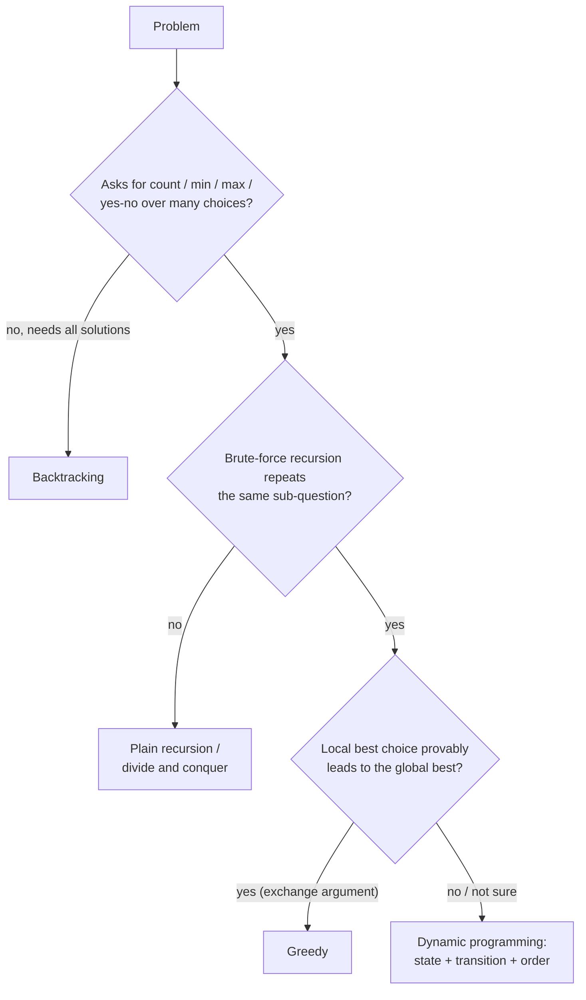
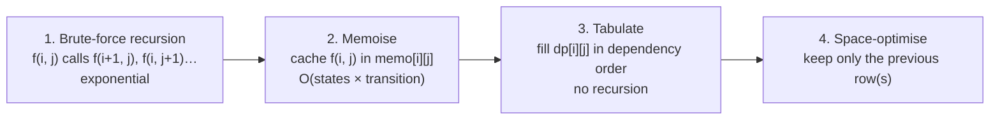
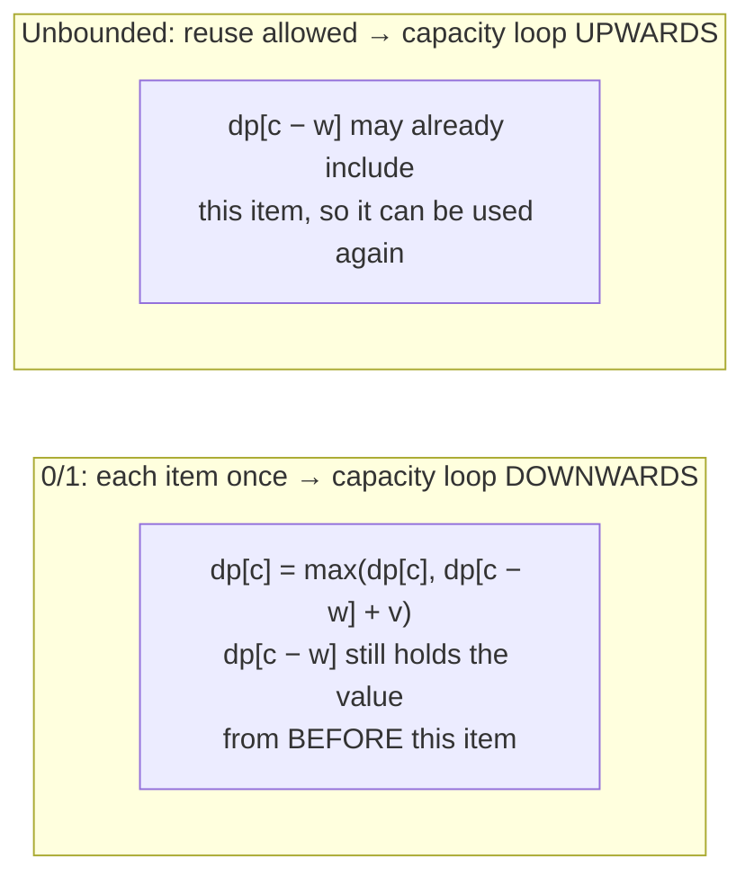
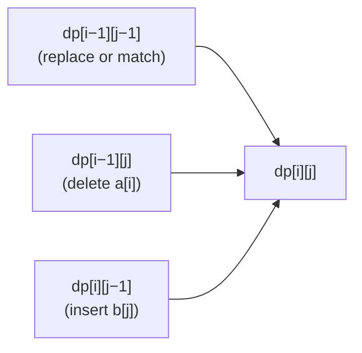

# Dynamic Programming Patterns

!!! abstract "TL;DR"
    - **DP = recursion + reuse.** It applies when a problem has **overlapping subproblems** (the same sub-question is asked many times) and **optimal substructure** (the best answer is built from best answers to sub-questions). Naive edit distance on two 12-character strings made **46,992,969** calls; memoised, **353** (measured).
    - **Recipe:**
        1. Define the **state** precisely: "`dp[i]` = best answer for the first i items".
        2. Write the **transition** (recurrence).
        3. Set the **base cases**.
        4. Pick an **evaluation order** so dependencies come first.
        5. Read off the **answer**.
        6. Optimise space (keep only the rows you need).
    - **Top-down** (memoised recursion) is easiest to derive and computes only reachable states, but uses stack depth. **Bottom-up** (tabulation) has no recursion and is easier to space-optimise: edit distance on 5,000 × 5,000 ran in **73 ms** with two rows instead of a 100 MB table (measured).
    - **Patterns:**
        - **1D linear:** climbing stairs, house robber, decode ways.
        - **Knapsack:** in 0/1 knapsack, loop capacity **downwards**. The forward loop silently reused items: it gave 60 instead of 35 (measured). Unbounded knapsack and coin change loop forwards. Coin-change **combinations** loop coins outer (4 ways for 5 with {1,2,5}); **ordered sequences** loop amount outer (9) (measured).
        - **LIS:** O(n²) DP, or O(n log n) with patience sorting. On n = 100k: **7.3 ms vs 12,935 ms** (measured).
        - **Two sequences:** LCS, edit distance.
        - **Grid paths, interval DP, state machines** (stock trading with k transactions).
    - **Greedy isn't DP:** greedy coin change on {1,3,4} for 6 used 3 coins, DP found **2** (measured). Prove greedy or use DP.
    - All solutions on this page passed **13,500** randomised checks against brute-force recursion or bitmask enumeration.

## Why it matters

DP is the category candidates fear most and interviewers use most to separate levels: it tests whether you can define a state, derive a recurrence and reason about complexity rather than memorise solutions. Senior candidates are expected to move from brute-force recursion to memoisation to tabulation to space optimisation, and to explain why it's correct. In real systems DP drives diff tools (LCS), spell checkers and fuzzy search (edit distance), sequence alignment in bioinformatics, resource allocation (knapsack-style budgeting), query optimisers (join ordering), and text layout (line breaking).

All code ran on Java 21 and each solution was checked against exhaustive recursion or bitmask enumeration on 1,500 random inputs.

## Core concepts

### When is it DP?


*Notice the middle question: DP only pays off when subproblems overlap. Merge sort's halves never overlap, so it's divide and conquer, not DP.*

Signals in the wording: "number of ways", "minimum cost", "maximum value", "longest/shortest subsequence", "can you reach/partition/form", with constraints like n ≤ 1000 (suggesting O(n²)) or a target ≤ 10⁴ (suggesting O(n·target)).

### From recursion to DP


*Notice that steps 2–4 don't change the recurrence, only how it's evaluated. Getting step 1 right (the state and recurrence) is the real work.*

**Complexity** = number of states × work per transition. Edit distance: (m+1)(n+1) states × O(1) = O(m·n). LIS (simple): n states × O(n) = O(n²).

| | Top-down (memoisation) | Bottom-up (tabulation) |
|---|---|---|
| Derivation | Direct from the recurrence | Needs an explicit order |
| States computed | Only reachable ones | All in the table |
| Recursion depth | O(depth): can overflow in Java | None |
| Space optimisation | Hard | Easy (rolling rows) |
| Constant factor | Higher (calls, boxing if using maps) | Lower (array loops) |

### Pattern catalogue

| Pattern | State | Transition | Examples | Complexity |
|---|---|---|---|---|
| **1D linear** | `dp[i]` = answer for prefix i | From `dp[i−1]`, `dp[i−2]`… | Climbing stairs, house robber, decode ways, min cost stairs | O(n), O(1) space |
| **Unbounded knapsack / coins** | `dp[a]` = best for amount a | `dp[a] = min(dp[a − c] + 1)` | Coin change (min coins), perfect squares | O(n·amount) |
| **Counting combinations** | `dp[a]` = ways | coins outer, amount inner (forward) | Coin change II | O(n·amount) |
| **0/1 knapsack / subset sum** | `dp[c]` = best with capacity c | capacity loop **downwards** | Knapsack, partition equal subset, target sum | O(n·W) |
| **LIS family** | `dp[i]` = LIS ending at i, or `tails[]` | max over j < i, or binary search | LIS, Russian doll envelopes, longest chain | O(n²) or O(n log n) |
| **Two sequences** | `dp[i][j]` for prefixes | Match → diagonal, else min/max of neighbours | LCS, edit distance, distinct subsequences, regex/wildcard matching | O(m·n) |
| **Grid** | `dp[r][c]` | From top and left | Unique paths, min path sum, maximal square | O(R·C) |
| **Interval** | `dp[i][j]` for substring/subarray i..j | Split point k or shrink ends | Palindromic substrings, burst balloons, matrix chain | O(n²)–O(n³) |
| **State machine** | `dp[i][state]` | Transitions between states | Stock buy/sell with cooldown, fee, k transactions | O(n·k) |
| **Bitmask** | `dp[mask][i]` | Add one element to the subset | Travelling salesman (small n), assignment | O(2ⁿ·n²) |

### Knapsack and loop direction


*Notice that the only difference between 0/1 and unbounded knapsack in the 1D form is the loop direction. Get it wrong and you silently solve the other problem.*

Measured with W = 4 and items (weight 1, value 15), (3, 20), (4, 30): the downward loop returned **35** (items 1 + 3), the upward loop returned **60** (item 1 used four times).

**Combinations vs permutations in counting:** with coins outer and amounts inner, each combination is counted once (each coin is "introduced" in a fixed order): {1,2,5} → 5 has **4** ways. With amounts outer and coins inner, different orders count separately: **9** sequences (measured). Ask which one the problem wants.

### Longest increasing subsequence

- **O(n²):** `dp[i]` = length of the LIS ending at i = 1 + max `dp[j]` over j < i with `a[j] < a[i]`.
- **O(n log n), patience sorting:** keep `tails[k]` = the smallest possible tail of an increasing subsequence of length k+1. For each x, binary-search the first tail ≥ x and replace it (or append). The array length is the LIS length. `tails` isn't itself an LIS, but its length is correct.
- Measured on 100,000 random ints: O(n log n) **7.3 ms**, O(n²) **12,935 ms**, both returning 619.

### Two-sequence DP: edit distance


*Notice that each cell depends only on the previous row and the cell to its left, so two rows of length n+1 are enough. That's how 5,000 × 5,000 fits in kilobytes instead of 100 MB.*

`dp[i][j]` = edits to turn the first i characters of a into the first j of b. If `a[i−1] == b[j−1]`, `dp[i][j] = dp[i−1][j−1]`; otherwise `1 + min(replace, delete, insert)`. Base cases: `dp[i][0] = i`, `dp[0][j] = j`. LCS uses the same shape with "+1 on match, else max of top and left".

### Reconstructing the solution

DP tables give the optimal value. To get the actual items, path or alignment, either store a choice per cell (parent pointers) or walk back from the final cell, re-checking which transition produced each value. Space-optimised versions lose this information. Use the full table, or Hirschberg's algorithm (linear space for alignments).

## In practice: code & configuration

### 1D linear: house robber

```java
static int rob(int[] houses) {
    int prev = 0, cur = 0;                         // best up to i-2, best up to i-1
    for (int h : houses) {
        int next = Math.max(cur, prev + h);        // skip this house, or rob it plus best up to i-2
        prev = cur;
        cur = next;
    }
    return cur;
}
// O(n) time, O(1) space; state: best total for the first i houses
```

### Coin change: minimum coins, and greedy is wrong

=== "❌ Greedy largest-coin-first"

    ```java
    // coins {1, 3, 4}, amount 6: greedy takes 4 + 1 + 1 = 3 coins (measured)
    // Works for canonical systems like {1, 5, 10, 25}, not in general
    ```

=== "✅ DP over amounts"

    ```java
    static int coinChange(int[] coins, int amount) {
        int[] dp = new int[amount + 1];
        Arrays.fill(dp, amount + 1);               // "infinity": more than any real answer
        dp[0] = 0;
        for (int a = 1; a <= amount; a++)
            for (int c : coins)
                if (c <= a) dp[a] = Math.min(dp[a], dp[a - c] + 1);
        return dp[amount] > amount ? -1 : dp[amount];
    }
    // {1, 3, 4}, 6 → 2 (3 + 3). O(amount × coins)
    ```

### Counting: combinations vs ordered sequences

```java
static long combinations(int[] coins, int amount) {   // {1,2,5}, 5 → 4
    long[] dp = new long[amount + 1];
    dp[0] = 1;
    for (int c : coins)                                // coins outer: order of coins fixed
        for (int a = c; a <= amount; a++) dp[a] += dp[a - c];
    return dp[amount];
}

static long orderedSequences(int[] coins, int amount) { // {1,2,5}, 5 → 9
    long[] dp = new long[amount + 1];
    dp[0] = 1;
    for (int a = 1; a <= amount; a++)                  // amount outer: any coin can come last
        for (int c : coins) if (c <= a) dp[a] += dp[a - c];
    return dp[amount];
}
```

### 0/1 knapsack and subset sum

=== "❌ Forward capacity loop"

    ```java
    for (int i = 0; i < n; i++)
        for (int c = w[i]; c <= W; c++)                // dp[c - w[i]] may already include item i
            dp[c] = Math.max(dp[c], dp[c - w[i]] + v[i]);
    // Solves UNBOUNDED knapsack: returned 60 instead of 35 (measured)
    ```

=== "✅ Backward capacity loop"

    ```java
    static int knapsack01(int[] w, int[] v, int W) {
        int[] dp = new int[W + 1];                     // dp[c] = best value with capacity c
        for (int i = 0; i < w.length; i++)
            for (int c = W; c >= w[i]; c--)            // downwards: each item used at most once
                dp[c] = Math.max(dp[c], dp[c - w[i]] + v[i]);
        return dp[W];
    }

    static boolean canPartition(int[] a) {             // subset sum = total / 2
        int sum = Arrays.stream(a).sum();
        if (sum % 2 == 1) return false;
        boolean[] dp = new boolean[sum / 2 + 1];
        dp[0] = true;
        for (int x : a)
            for (int s = sum / 2; s >= x; s--) dp[s] |= dp[s - x];
        return dp[sum / 2];
    }
    // O(n × W) time, O(W) space (pseudo-polynomial: depends on the value of W)
    ```

### Longest increasing subsequence

=== "❌ O(n²) on large input"

    ```java
    for (int i = 0; i < n; i++) {
        dp[i] = 1;
        for (int j = 0; j < i; j++) if (a[j] < a[i]) dp[i] = Math.max(dp[i], dp[j] + 1);
    }
    // n = 100,000: 12,935 ms (measured)
    ```

=== "✅ O(n log n) patience sorting"

    ```java
    static int lengthOfLIS(int[] a) {
        int[] tails = new int[a.length];               // tails[k] = smallest tail of an LIS of length k+1
        int len = 0;
        for (int x : a) {
            int lo = 0, hi = len;
            while (lo < hi) {                          // first tail >= x
                int mid = (lo + hi) >>> 1;
                if (tails[mid] < x) lo = mid + 1; else hi = mid;
            }
            tails[lo] = x;                             // replace (keeps tails as small as possible)
            if (lo == len) len++;                      // extended the longest subsequence
        }
        return len;
    }
    // n = 100,000: 7.3 ms (measured). Use "first tail > x" for non-decreasing subsequences.
    ```

### Edit distance with two rows

```java
static int editDistance(String a, String b) {
    int m = a.length(), n = b.length();
    int[] prev = new int[n + 1], cur = new int[n + 1];
    for (int j = 0; j <= n; j++) prev[j] = j;              // "" → b[0..j): j inserts
    for (int i = 1; i <= m; i++) {
        cur[0] = i;                                        // a[0..i) → "": i deletes
        for (int j = 1; j <= n; j++) {
            if (a.charAt(i - 1) == b.charAt(j - 1)) cur[j] = prev[j - 1];   // match: no cost
            else cur[j] = 1 + Math.min(prev[j - 1],                        // replace
                                Math.min(prev[j],                           // delete
                                         cur[j - 1]));                      // insert
        }
        int[] t = prev; prev = cur; cur = t;               // roll the rows
    }
    return prev[n];
}
// O(m·n) time, O(n) space. 5,000 × 5,000 in 73 ms (measured)
```

### Top-down memoisation

```java
// Word break: can s be segmented into dictionary words?
static boolean wordBreak(String s, Set<String> dict) {
    return canBreak(s, 0, dict, new Boolean[s.length() + 1]);
}
static boolean canBreak(String s, int start, Set<String> dict, Boolean[] memo) {
    if (start == s.length()) return true;
    if (memo[start] != null) return memo[start];           // already answered for this suffix
    for (int end = start + 1; end <= s.length(); end++)
        if (dict.contains(s.substring(start, end)) && canBreak(s, end, dict, memo))
            return memo[start] = true;
    return memo[start] = false;
}
// O(n²) substring checks (× substring cost) instead of exponential
```

### State machine: stock trading with at most k transactions

```java
static int maxProfit(int k, int[] prices) {
    int[] buy = new int[k + 1], sell = new int[k + 1];
    Arrays.fill(buy, Integer.MIN_VALUE / 2);               // holding a stock after t buys
    for (int p : prices)
        for (int t = 1; t <= k; t++) {
            buy[t] = Math.max(buy[t], sell[t - 1] - p);    // buy using profit from t-1 completed trades
            sell[t] = Math.max(sell[t], buy[t] + p);       // sell the stock bought in trade t
        }
    return sell[k];
}
// k = 2, [3,3,5,0,0,3,1,4] → 6. O(n·k)
```

## Real-world usage

- **Diff and version control:** `diff` and Git's diff algorithms compute an LCS-like shortest edit script (Myers' algorithm is an O(N·D) refinement).
- **Fuzzy search and spell checking:** edit distance (Levenshtein, Damerau) powers "did you mean", Elasticsearch fuzzy queries (bounded edit distance via automata), and record linkage of patient or member names.
- **Bioinformatics:** sequence alignment (Needleman–Wunsch, Smith–Waterman) is two-sequence DP.
- **Query optimisers:** PostgreSQL's planner uses DP over subsets of relations to pick join orders for moderate numbers of tables (and a genetic optimiser, GEQO, beyond a threshold).
- **Text layout:** TeX's line-breaking algorithm minimises total "badness" with DP.
- **Resource allocation:** budgeting, cargo loading and ad selection under constraints are knapsack variants, usually solved with integer programming solvers at scale.
- **Speech and NLP:** the Viterbi algorithm (hidden Markov models) is DP over states and time.

## Trade-offs & production gotchas

!!! warning "DP pitfalls"
    - **Vague state definitions:** write down exactly what `dp[i][j]` means before coding.
    - **Wrong loop direction** in 1D knapsack: 0/1 vs unbounded (measured 35 vs 60).
    - **Combinations vs permutations** in counting: loop order changes the answer (4 vs 9 measured).
    - **Assuming greedy works:** {1,3,4} for 6 gave 3 coins greedily vs 2 with DP.
    - **Off-by-one in table sizes:** use n+1 with an empty-prefix row and column.
    - **Infinity overflow:** `Integer.MAX_VALUE + 1` wraps negative. Use `amount + 1`, or `MAX_VALUE / 2`.
    - **Deep memoised recursion** overflowing the stack for large n. Switch to bottom-up.
    - **`HashMap` memo with boxed keys** on hot paths: slow. Prefer arrays indexed by state.
    - **Memory:** a 5,000 × 5,000 `int` table is 100 MB (computed). Roll rows when only the value is needed.
    - **Pseudo-polynomial time:** O(n·W) is exponential in the number of bits of W. Huge capacities need different methods.

- **Top-down vs bottom-up:** top-down for quick derivation and sparse state spaces, bottom-up for performance and space optimisation.
- **DP vs greedy:** greedy is simpler and faster when provably correct (activity selection, Huffman, canonical coin systems). DP is the safe choice when you can't prove it.

## How this connects to my experience

- **Not a resume item as DSA.** The patterns appear in data and search features.
- **Honest bridges:** fuzzy matching of member or provider names in healthcare data (edit distance, also used by Elasticsearch fuzzy queries; Elasticsearch is on my Deloitte resume), and caching or memoising expensive computed results in services (the same "compute once, reuse" idea as memoisation, at the Redis level at OptumRx). *[confirm: any fuzzy matching, deduplication or optimisation problem you solved, and how]*
- **Talking points:**
    - "I start from a brute-force recursion, identify the state, memoise, then convert to a table and roll the rows if only the value is needed."
    - "For knapsack-style problems I check the loop direction: downwards for 0/1, upwards for unbounded. It's a silent bug otherwise."

## Interview questions

### Fundamentals

??? question "Q1. What is dynamic programming, and when does it apply?"
    **Answer:** A technique for problems with overlapping subproblems and optimal substructure: solve each distinct subproblem once, store the result, and build larger answers from smaller ones. It applies to counting, minimisation, maximisation and feasibility problems where brute-force recursion recomputes the same states. Measured: naive edit distance on 12-character strings made about 47 million calls, memoised only 353. It doesn't help when subproblems don't overlap (merge sort) or when you must list every solution (backtracking).

    **Interviewer listens for:** both properties, reuse of subproblem results, when it doesn't apply.

    **Common wrong answer:** "DP is recursion with a cache" (only half the story: you also need the right state and optimal substructure), or "any recursive problem."

??? question "Q2. Top-down memoisation vs bottom-up tabulation: what are the trade-offs?"
    **Answer:** Top-down writes the recurrence as recursion and caches results: easy to derive, computes only reachable states, but uses stack depth (risky in Java for large n) and has call overhead. Bottom-up fills a table in dependency order: no recursion, lower constant factors, and easy space optimisation by keeping only the rows you need (edit distance 5,000 × 5,000 in 73 ms with two rows instead of a 100 MB table, measured). Both have the same asymptotic complexity: states × transition cost.

    **Interviewer listens for:** reachable states, stack depth, space optimisation, same complexity.

    **Common wrong answer:** "Bottom-up is always faster asymptotically."

??? question "Q3. Solve climbing stairs (1 or 2 steps at a time) and explain the state."
    **Answer:** `dp[i]` = number of ways to reach step i. The last move was 1 or 2 steps, so `dp[i] = dp[i−1] + dp[i−2]` with `dp[0] = dp[1] = 1`: the Fibonacci sequence. Only the previous two values are needed: O(n) time, O(1) space (verified: 89 ways for 10 steps, 1,836,311,903 for 45). Generalisations: steps from a set (sum over the set), costs per step (min instead of sum), or forbidden steps (set those to 0).

    **Interviewer listens for:** state definition, last-move reasoning, O(1) space.

    **Common wrong answer:** Plain recursion without memoisation (exponential).

??? question "Q4. Why doesn't a greedy algorithm solve coin change in general?"
    **Answer:** Greedy (always take the largest coin that fits) is only optimal for "canonical" coin systems like {1, 5, 10, 25}. For {1, 3, 4} and amount 6 it takes 4 + 1 + 1 = 3 coins, but 3 + 3 = 2 coins is optimal (measured). DP over amounts considers every last coin: `dp[a] = min(dp[a − c] + 1)` over coins c, O(amount × coins), with `dp[0] = 0` and "infinity" for unreachable amounts (return −1). Greedy needs a proof (an exchange argument) before you rely on it.

    **Interviewer listens for:** counterexample, DP recurrence, unreachable handling.

    **Common wrong answer:** "Greedy works because using bigger coins means fewer coins."

### Intermediate

??? question "Q5. Explain 0/1 knapsack and why the 1D version loops capacity downwards."
    **Answer:** `dp[i][c]` = best value using the first i items with capacity c: `max(dp[i−1][c], dp[i−1][c − w] + v)`. Each row depends only on the previous row, so one array suffices if you update capacities from high to low: then `dp[c − w]` still holds the previous row's value (item i not yet used). Looping upwards lets an item be added again in the same pass, which solves unbounded knapsack instead: measured 60 vs the correct 35 for W = 4 with items (1,15), (3,20), (4,30). O(n·W) time, pseudo-polynomial.

    **Interviewer listens for:** 2D recurrence, row dependency, direction reasoning, pseudo-polynomial.

    **Common wrong answer:** "Loop direction doesn't matter."

??? question "Q6. Count the ways to make an amount from coins. Why does loop order matter?"
    **Answer:** With coins in the outer loop and amounts in the inner loop (`dp[a] += dp[a − c]`), each coin is introduced once in a fixed order, so each multiset is counted once: combinations ({1,2,5} → 5 has 4 ways). With amounts outer and coins inner, every coin can be the last one at each amount, so different orders count separately: ordered sequences (9 for the same input, measured). Choose based on whether [1,2,2] and [2,1,2] are the same answer. `dp[0] = 1` (one way to make zero), and use `long` since counts grow fast.

    **Interviewer listens for:** order of loops ↔ combinations vs permutations, base case, overflow.

    **Common wrong answer:** Not realising the two loop orders count different things.

??? question "Q7. Find the length of the longest increasing subsequence. Can you do better than O(n²)?"
    **Answer:** O(n²): `dp[i]` = LIS ending at i = 1 + max `dp[j]` for j < i with `a[j] < a[i]`. O(n log n): maintain `tails[k]`, the smallest tail of any increasing subsequence of length k+1. For each x, binary-search the first tail ≥ x and replace it, or append if x is larger than all tails. The length of `tails` is the LIS length (but `tails` isn't an actual LIS; keep predecessor indices to reconstruct one). Measured on 100,000 elements: 7.3 ms vs 12,935 ms. For non-decreasing subsequences, search for the first tail > x.

    **Interviewer listens for:** both methods, the tails invariant, reconstruction caveat, strict vs non-strict.

    **Common wrong answer:** Claiming `tails` is the subsequence itself.

??? question "Q8. Compute the edit distance between two strings."
    **Answer:** `dp[i][j]` = minimum edits to turn the first i characters of a into the first j characters of b. Base: `dp[i][0] = i`, `dp[0][j] = j`. If the last characters match, `dp[i][j] = dp[i−1][j−1]`; otherwise `1 + min(dp[i−1][j−1] (replace), dp[i−1][j] (delete), dp[i][j−1] (insert))`. O(m·n) time. Since each row depends only on the previous row, two rows give O(min(m, n)) space (5,000 × 5,000 in 73 ms). To output the actual edits, keep the full table and backtrack from `dp[m][n]`.

    **Interviewer listens for:** state, three operations, base cases, space optimisation, reconstruction.

    **Common wrong answer:** Counting differing characters position by position.

### Senior

??? question "Q9. How do you approach a DP problem you haven't seen before?"
    **Answer:** Start with brute-force recursion that makes one decision at a time (take or skip an item, match or edit a character, choose a split point). Identify what the recursive call depends on: those parameters are the state (index, remaining capacity, previous choice, a bitmask). Check that the state space is small enough (states × transition fits the constraints), memoise, then define base cases and evaluation order for a bottom-up table, and optimise space if only the value is needed. Validate on small cases against the brute force (which is how every solution here was checked: 13,500 random comparisons). Finally, decide whether the answer needs reconstruction.

    **Interviewer listens for:** decision-based recursion, state from parameters, size check, validation against brute force.

    **Common wrong answer:** "Find the matching LeetCode pattern."

??? question "Q10. What is pseudo-polynomial time, and why does it matter for knapsack?"
    **Answer:** O(n·W) looks polynomial, but W is a number, and its input size is about log₂ W bits. So the running time is exponential in the input's bit length: doubling the number of digits of W squares the work. Knapsack is NP-hard in general. The DP is practical when W is moderate (thousands or millions), not when capacities are huge (10¹⁸). Alternatives: DP over values instead of weights (if values are small), meet-in-the-middle for small n (O(2^(n/2))), branch and bound, approximation schemes (FPTAS), or integer programming solvers.

    **Interviewer listens for:** input size in bits, NP-hardness, alternatives.

    **Common wrong answer:** "O(n·W) is polynomial, so knapsack is in P."

??? question "Q11. How would you handle stock trading with at most k transactions, and with a cooldown?"
    **Answer:** As a state machine. For k transactions, keep `buy[t]` (best profit while holding a stock bought in transaction t) and `sell[t]` (best profit after completing t transactions). For each price, `buy[t] = max(buy[t], sell[t−1] − p)` and `sell[t] = max(sell[t], buy[t] + p)`. O(n·k) time and O(k) space (verified: k = 2 on [3,3,5,0,0,3,1,4] gives 6). If k ≥ n/2 it's effectively unlimited: sum all positive day-to-day differences. For a cooldown, use states hold, sold (just sold, must rest) and rest, with transitions between them. For a fee, subtract it when selling.

    **Interviewer listens for:** states and transitions, O(n·k), unlimited-k shortcut, variants.

    **Common wrong answer:** Trying all pairs of buy and sell days recursively.

??? question "Q12. How do you reconstruct the actual solution (not just its value) from a DP table, and what does that cost?"
    **Answer:** Keep the full table (or a parent/choice table) and walk back from the final state: at each cell, determine which transition produced its value (for LCS, a diagonal move on a character match; for knapsack, whether `dp[i][c] != dp[i−1][c]` means item i was taken) and move to that predecessor, collecting choices. That needs O(states) memory, so the rolling-row optimisation can't be used directly. For long sequence alignments, Hirschberg's algorithm reconstructs in linear space with divide and conquer (about twice the time). For LIS, store predecessor indices alongside the `tails` positions.

    **Interviewer listens for:** backtracking through the table, memory cost, Hirschberg or parent pointers.

    **Common wrong answer:** "Store the full solution list in every cell" (works, but multiplies memory and time).

### Scenario-based

??? question "Q13. You need to match incoming patient names against 2 million records, tolerating typos. Edit distance on every pair is too slow. What do you do?"
    **Answer:** Pairwise edit distance is O(N × L²) per query. Reduce candidates first, then apply DP only to them: index names with n-grams, phonetic keys (Soundex, Double Metaphone) or a search engine (Elasticsearch fuzzy queries use Levenshtein automata to find terms within edit distance 1–2 efficiently). Use a bounded edit distance that stops once the distance exceeds k (only a diagonal band of width 2k+1 of the DP table is needed, O(k·L)). Combine with other fields (date of birth, address) for record linkage, and normalise case, accents and nicknames. Keep a human review step for borderline matches in healthcare.

    **Interviewer listens for:** candidate generation, bounded/banded DP, search-engine fuzzy matching, multi-field linkage.

    **Common wrong answer:** Running full edit distance against all 2 million names per query.

??? question "Q14. A recursive memoised solution works in tests but throws StackOverflowError in production for large inputs. How do you fix it?"
    **Answer:** The recursion depth grows with input size (e.g. `solve(i)` calling `solve(i+1)` down to n = 100,000), and Java has no tail-call optimisation. Convert to bottom-up tabulation: determine the dependency order (here, from i = n down to 0) and fill an array iteratively, which also removes call overhead and allows space optimisation. If the state space is sparse and top-down is much simpler, use an explicit stack to simulate the recursion, or run on a thread with a larger stack as a stopgap. Add a regression test at production-scale input sizes.

    **Interviewer listens for:** depth cause, bottom-up conversion, explicit stack alternative, scale tests.

    **Common wrong answer:** "Increase -Xss for the whole JVM."

## Cheat sheet

| Topic | Remember |
|---|---|
| When | Overlapping subproblems + optimal substructure; count/min/max/feasible |
| Recipe | State → transition → base → order → answer → space |
| Measured reuse | Edit distance 12 chars: 46,992,969 naive calls vs 353 memoised |
| Top-down vs bottom-up | Reachable states + easy derivation vs no recursion + rolling rows |
| 1D | Stairs, robber: `dp[i]` from `dp[i−1]`, `dp[i−2]`; O(1) space |
| Coin change | min: `dp[a]=min(dp[a−c]+1)`; greedy fails ({1,3,4}, 6: 3 vs 2) |
| Counting | Coins outer = combinations (4); amount outer = sequences (9) |
| 0/1 knapsack | Capacity loop downwards (35); upwards = unbounded (60) |
| LIS | O(n²) or tails + binary search O(n log n): 7.3 ms vs 12,935 ms at 100k |
| Two sequences | LCS / edit distance `dp[i][j]`, n+1 sizes, two rows (5k×5k in 73 ms) |
| State machine | Stock k transactions: buy[t], sell[t], O(n·k) |
| Pitfalls | Loop direction, infinity overflow, deep recursion, 100 MB tables, pseudo-polynomial W |

## Sources
1. Cormen, Leiserson, Rivest, Stein, *Introduction to Algorithms* (4th ed.), dynamic programming chapter (rod cutting, LCS, optimal BSTs).
2. Steven Skiena, *The Algorithm Design Manual* (3rd ed.), dynamic programming chapter (edit distance, war stories).
3. Kleinberg & Tardos, *Algorithm Design*, dynamic programming (weighted interval scheduling, knapsack, sequence alignment, Hirschberg's algorithm).
4. Eugene W. Myers, *An O(ND) Difference Algorithm and Its Variations*, Algorithmica 1(2), 1986.
5. [PostgreSQL docs: Planner/Optimizer](https://www.postgresql.org/docs/current/planner-optimizer.html) and [Genetic Query Optimizer](https://www.postgresql.org/docs/current/geqo.html).
6. [Elasticsearch: fuzzy query](https://www.elastic.co/guide/en/elasticsearch/reference/current/query-dsl-fuzzy-query.html).
7. Demonstrations on this page: Java 21, solutions checked against brute-force recursion or bitmask enumeration on 1,500 random inputs each (13,500 checks), timings from single runs after warm-up, run while writing this page.
