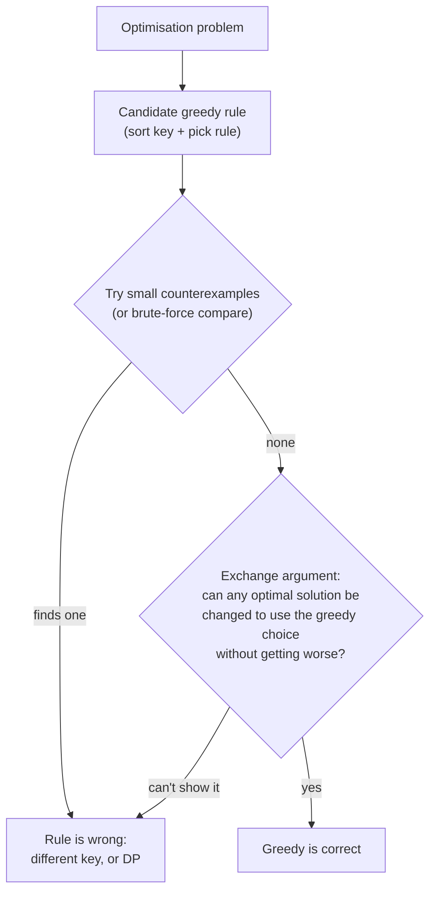
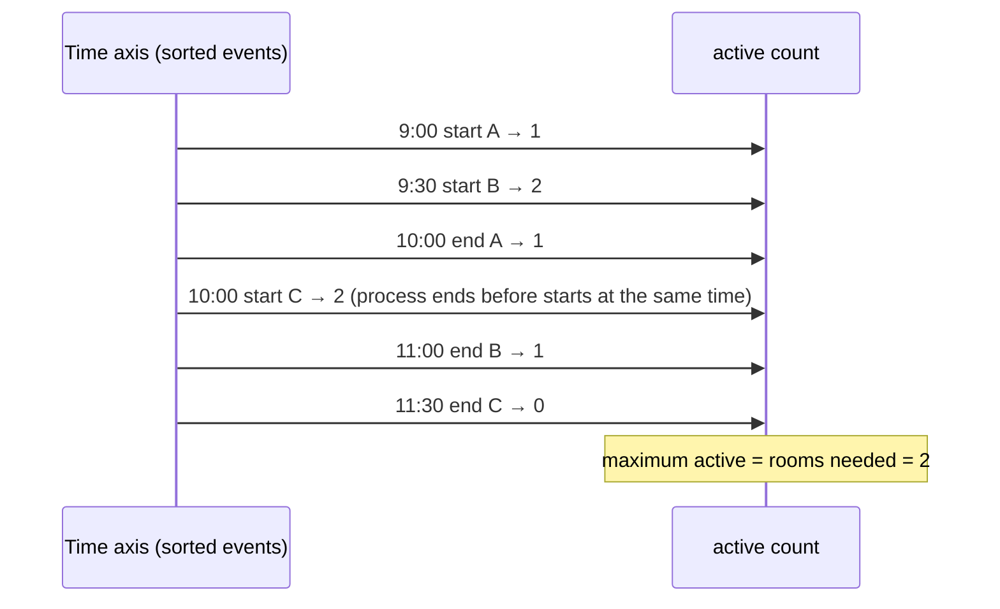

# Greedy & Intervals

!!! abstract "TL;DR"
    - A **greedy algorithm** makes the locally best choice at each step and never revisits it. It's correct only when the problem has the **greedy-choice property** (some optimal solution starts with the greedy choice) and **optimal substructure**. Prove it with an **exchange argument**: any optimal solution can be changed to include the greedy choice without getting worse. Otherwise use [DP](10-dynamic-programming-patterns.md).
    - **The sort key is the algorithm.** For maximum non-overlapping intervals (activity selection), **sort by end time**. On `[0,10],[1,2],[3,4],[5,6]`, earliest-end picked **3**, earliest-start picked **1**. "Shortest first" picked 1 where 2 was optimal (measured).
    - **Interval toolkit** (sort first, O(n log n)):
        - **Merge:** sort by start, extend the last merged interval while overlapping. 1M intervals merged in **906 ms**, dominated by the sort (measured).
        - **Insert into sorted:** three phases (before, overlapping, after), O(n).
        - **Erase the minimum to make non-overlapping:** n minus the activity-selection count.
        - **Minimum arrows / points to stab all intervals:** sort by end.
        - **Maximum concurrent intervals (meeting rooms):** a sweep over sorted starts and ends, or a min-heap of end times.
    - **Other classic greedy problems:**
        - **Jump game:** track the farthest reachable index. For the minimum jumps, use a BFS-like layering, O(n).
        - **Gas station:** if total gas ≥ total cost, the answer is the index after the last point where the running tank went negative.
        - **Partition labels:** extend each part to the last occurrence of every character it contains.
        - **Assign cookies / two-pointer matching** after sorting.
    - **Comparator overflow again:** `(a, b) -> a[1] − b[1]` sorted `[2147483646, …]` **before** `[−2147483646, …]` (measured). Use `Integer.compare`.
    - All solutions on this page passed **16,000** randomised checks against brute force (bitmask enumeration, BFS, or trying every start).

## Why it matters

Interval problems (merge, insert, meeting rooms, non-overlapping) are among the most common interview questions, and greedy problems test whether you can justify a shortcut rather than just guess one. Senior interviewers often ask "why is greedy correct here?" or offer a tempting but wrong greedy to see whether you test it. In production, intervals are everywhere: calendar and appointment scheduling, booking systems, time-range queries, maintenance windows, IP ranges, coverage periods and eligibility spans in healthcare and insurance, and resource allocation.

All solutions ran on Java 21 and were checked against brute force on 2,000 random inputs each.

## Core concepts

### When greedy works


*Notice that testing against brute force on small random inputs is a fast, honest way to catch a wrong greedy rule before you try to prove it. That's how every rule on this page was checked.*

**Exchange argument for activity selection (sort by end):** let g be the interval that ends first. Take any optimal schedule and its first interval o. Since g ends no later than o, replacing o with g keeps all the other intervals compatible. So some optimal schedule starts with g. Remove everything that overlaps g and repeat on the rest (optimal substructure).

**Classic greedy algorithms** that are provably optimal: activity selection, Huffman coding, Dijkstra (non-negative weights), Prim and Kruskal (MST), fractional knapsack (by value/weight ratio), and coin change for canonical systems like {1, 5, 10, 25}. **Not** greedy-solvable in general: 0/1 knapsack, coin change for arbitrary coins ({1,3,4} for 6: greedy 3 coins vs optimal 2), longest path, the travelling salesman problem.

### Choosing the sort key for interval problems

| Problem | Sort by | Rule | Why |
|---|---|---|---|
| **Merge overlapping intervals** | Start | Extend the last merged interval while `start ≤ lastEnd` | Overlapping intervals become adjacent |
| **Max non-overlapping (activity selection)** | **End** | Take an interval if `start ≥ lastEnd` | Ending earliest leaves the most room |
| **Min removals to make non-overlapping** | End | n − (activity selection count) | Same as keeping the maximum |
| **Min arrows / points stabbing all intervals** | End | Shoot at the end of the first un-hit interval | That point hits every interval starting before it |
| **Max concurrent intervals (meeting rooms)** | Starts and ends separately (or start + heap) | Sweep: +1 at start, −1 at end | Count active intervals at each event |
| **Insert into sorted, non-overlapping list** | Already sorted | Before / overlap / after phases | Linear |
| **Interval intersection of two sorted lists** | Already sorted | Two pointers, advance the one that ends first | Linear |

Measured counterexamples for activity selection on `[0,10], [1,2], [3,4], [5,6]`: sorting by end picks 3, by start picks 1 (the long interval blocks everything). On `[0,5], [4,7], [6,11]`, "shortest first" picks 1 while the optimum is 2.

**Closed vs half-open intervals:** decide whether `[1,3]` and `[3,5]` overlap. Meetings usually use half-open `[start, end)` (back-to-back is fine: use `start >= lastEnd`). Balloons and closed ranges overlap at shared endpoints (use `start > pos`). Write the comparison deliberately.

### Sweep line


*Notice the tie rule: at equal times, processing ends before starts treats back-to-back meetings as non-overlapping. Reversing it would count them as overlapping.*

A sweep line turns interval questions into sorted events: maximum overlap, total covered length, skyline, and "who is active at time t". O(n log n) for sorting, then O(n). With a min-heap of end times instead, you also know which room becomes free first.

### Other greedy patterns

- **Jump game (can you reach the end?):** track the farthest reachable index. If you ever stand beyond it, you're stuck. O(n).
- **Jump game II (minimum jumps):** BFS layers without a queue: the current layer ends at `end`; while scanning it, track `far`; when you reach `end`, take a jump and set `end = far`. O(n). Verified against an explicit BFS.
- **Gas station:** if total gas < total cost, no start works. Otherwise, whenever the running tank drops below zero at i, no start between the current start and i can work, so restart at i + 1. One pass. Verified against trying every start.
- **Partition labels:** record each character's last index. Extend the current part's end to the last index of every character seen, and cut when i reaches the end. `"ababcbacadefegdehijhklij"` → `[9, 7, 8]` (verified).
- **Two-pointer matching after sorting:** assign cookies (smallest sufficient cookie to the least greedy child), boats to save people (pair heaviest with lightest).
- **Task scheduling by deadline:** earliest deadline first minimises maximum lateness. Shortest processing time first minimises average completion time.
- **Huffman coding:** repeatedly merge the two least frequent symbols (min-heap).

## In practice: code & configuration

### Merge intervals

```java
static int[][] merge(int[][] intervals) {
    int[][] a = intervals.clone();
    Arrays.sort(a, Comparator.comparingInt(iv -> iv[0]));       // by start: overlaps become adjacent
    List<int[]> out = new ArrayList<>();
    for (int[] iv : a) {
        int[] last = out.isEmpty() ? null : out.get(out.size() - 1);
        if (last != null && last[1] >= iv[0]) {                   // overlaps (or touches, for closed intervals)
            last[1] = Math.max(last[1], iv[1]);                   // max: iv may be inside last
        } else {
            out.add(new int[]{iv[0], iv[1]});                     // copy: don't alias the input
        }
    }
    return out.toArray(new int[0][]);
}
// O(n log n). Measured 1M intervals: 906 ms, dominated by sorting
```

### Insert into a sorted, non-overlapping list

```java
static int[][] insert(int[][] sorted, int[] newIv) {
    List<int[]> out = new ArrayList<>();
    int i = 0, n = sorted.length, s = newIv[0], e = newIv[1];
    while (i < n && sorted[i][1] < s) out.add(sorted[i++]);       // entirely before
    while (i < n && sorted[i][0] <= e) {                          // overlapping: absorb
        s = Math.min(s, sorted[i][0]);
        e = Math.max(e, sorted[i][1]);
        i++;
    }
    out.add(new int[]{s, e});
    while (i < n) out.add(sorted[i++]);                           // entirely after
    return out.toArray(new int[0][]);
}
// O(n), no sorting needed
```

### Activity selection and minimum removals

=== "❌ Sort by start (or by length)"

    ```java
    Arrays.sort(a, Comparator.comparingInt(iv -> iv[0]));
    // [0,10],[1,2],[3,4],[5,6]: picks [0,10] first and keeps 1 interval (optimal 3), measured
    ```

=== "✅ Sort by end"

    ```java
    static int maxNonOverlapping(int[][] intervals) {             // half-open [start, end)
        int[][] a = intervals.clone();
        Arrays.sort(a, Comparator.comparingInt(iv -> iv[1]));     // earliest end first
        int count = 0;
        long lastEnd = Long.MIN_VALUE;
        for (int[] iv : a) {
            if (iv[0] >= lastEnd) {                               // compatible with what we kept
                count++;
                lastEnd = iv[1];
            }
        }
        return count;
    }

    static int eraseOverlapIntervals(int[][] intervals) {
        return intervals.length - maxNonOverlapping(intervals);  // remove the rest
    }
    ```

### Minimum arrows (closed intervals) with a safe comparator

=== "❌ Subtraction comparator"

    ```java
    Arrays.sort(points, (a, b) -> a[1] - b[1]);
    // With coordinates near ±2^31 the subtraction overflows:
    // [2147483646, 2147483647] sorted before [-2147483646, -2147483645] (measured)
    ```

=== "✅ Integer.compare"

    ```java
    static int findMinArrowShots(int[][] points) {
        int[][] a = points.clone();
        Arrays.sort(a, Comparator.comparingInt(p -> p[1]));      // no overflow
        int arrows = 0;
        long pos = Long.MIN_VALUE;                                // long: below any int coordinate
        for (int[] b : a) {
            if (b[0] > pos) {                                     // closed intervals: touching counts as hit
                arrows++;
                pos = b[1];                                       // shoot at this balloon's end
            }
        }
        return arrows;
    }
    ```

### Meeting rooms with a sweep

```java
static int minMeetingRooms(int[][] meetings) {                  // half-open [start, end)
    int n = meetings.length;
    int[] starts = new int[n], ends = new int[n];
    for (int i = 0; i < n; i++) { starts[i] = meetings[i][0]; ends[i] = meetings[i][1]; }
    Arrays.sort(starts);
    Arrays.sort(ends);
    int rooms = 0, active = 0, j = 0;
    for (int i = 0; i < n; i++) {
        while (j < n && ends[j] <= starts[i]) { j++; active--; } // free rooms that ended (ends before starts)
        active++;
        rooms = Math.max(rooms, active);
    }
    return rooms;
}
// O(n log n). The heap version is in Heaps & priority queues.
```

### Jump game, gas station, partition labels

```java
static boolean canJump(int[] a) {
    int reach = 0;
    for (int i = 0; i < a.length; i++) {
        if (i > reach) return false;            // can't even stand here
        reach = Math.max(reach, i + a[i]);
    }
    return true;
}

static int minJumps(int[] a) {                  // assumes the end is reachable
    int jumps = 0, end = 0, far = 0;
    for (int i = 0; i < a.length - 1; i++) {
        far = Math.max(far, i + a[i]);          // best reach from the current layer
        if (i == end) { jumps++; end = far; }   // finished this layer: jump
    }
    return jumps;
}

static int canCompleteCircuit(int[] gas, int[] cost) {
    int total = 0, tank = 0, start = 0;
    for (int i = 0; i < gas.length; i++) {
        int diff = gas[i] - cost[i];
        total += diff;
        tank += diff;
        if (tank < 0) { start = i + 1; tank = 0; }  // no start in [start..i] can work
    }
    return total >= 0 ? start : -1;
}

static List<Integer> partitionLabels(String s) {
    int[] last = new int[26];
    for (int i = 0; i < s.length(); i++) last[s.charAt(i) - 'a'] = i;
    List<Integer> sizes = new ArrayList<>();
    int start = 0, end = 0;
    for (int i = 0; i < s.length(); i++) {
        end = Math.max(end, last[s.charAt(i) - 'a']);   // part must reach this char's last occurrence
        if (i == end) { sizes.add(end - start + 1); start = i + 1; }
    }
    return sizes;
}
```

## Real-world usage

- **Scheduling and booking:** calendar free/busy merging (merge intervals), room and resource allocation (sweep or heap), appointment slot finding (gaps between merged busy intervals), maintenance windows.
- **Healthcare and insurance:** eligibility and coverage periods per member are interval lists: merging overlapping coverage spans, finding gaps in coverage, and checking whether a claim's service date falls inside an active span.
- **Databases:** PostgreSQL range types (`tstzrange`, `daterange`) with `&&` overlap operators, GiST indexes and exclusion constraints (`EXCLUDE USING gist (room WITH =, during WITH &&)`) enforce "no double booking" in the database.
- **Networking:** merging CIDR/IP ranges for firewall rules and allowlists, and interval trees for range lookups.
- **Compression and encoding:** Huffman coding (greedy) in DEFLATE/gzip and JPEG.
- **Schedulers:** earliest-deadline-first scheduling in real-time systems. Kubernetes' scheduler uses filtering and scoring heuristics (greedy placement per pod).

## Trade-offs & production gotchas

!!! warning "Greedy and interval pitfalls"
    - **Plausible but wrong greedy rules** (sort by start or by length for activity selection: measured wrong). Test against brute force, then prove with an exchange argument.
    - **Closed vs half-open intervals:** `>=` vs `>` changes whether touching intervals overlap. Decide explicitly.
    - **Tie-breaking in sweeps:** process ends before starts at equal times for half-open intervals.
    - **Comparator overflow:** `a[1] − b[1]` misordered large values (measured). Use `Integer.compare` / `comparingInt`.
    - **Forgetting `max` when merging:** an interval fully inside the previous one must not shrink it.
    - **Aliasing the input arrays** while merging (mutating callers' data). Copy when adding to the output.
    - **Time zones and DST** in real scheduling: compare instants (`Instant`, `OffsetDateTime`), not local times.
    - **Applying greedy to 0/1 knapsack or arbitrary coin systems:** suboptimal answers. Use DP.

- **Greedy vs DP:** greedy is O(n log n) and simple, but only when provably correct. DP is slower and more general.
- **Sweep vs heap for meeting rooms:** the sweep gives just the count. The heap also tells you which room frees up first (useful for actual assignment).
- **In-memory vs database enforcement:** checking overlaps in application code is racy under concurrency. Database exclusion constraints or locking make "no double booking" reliable.

## How this connects to my experience

- **Not a resume item as DSA.** Interval logic is common in healthcare and pharmacy systems.
- **Honest bridges:** at OptumRx, pharmacy benefit data involves date ranges (coverage periods, prescription validity, refill windows), where merging overlapping spans and checking whether a date falls in an active period are interval problems. Kafka retry scheduling with backoff windows is time-interval logic too. *[confirm: whether you implemented eligibility or coverage-period logic, overlap checks or scheduling features, and how they were stored and queried]*
- **Talking points:**
    - "For intervals I pick the sort key deliberately: by start to merge, by end to select the maximum number of non-overlapping ones or to stab them."
    - "Before trusting a greedy rule, I test it against brute force on small cases and look for an exchange argument. If I can't find one, I use DP."
    - "To prevent double bookings for real, I push the overlap check into the database with an exclusion constraint."

## Interview questions

### Fundamentals

??? question "Q1. What is a greedy algorithm, and how do you know it's correct?"
    **Answer:** An algorithm that makes the locally best choice at each step and never reconsiders it. It's correct when the problem has the greedy-choice property (some optimal solution includes the greedy first choice) and optimal substructure (after the choice, the rest is the same problem, smaller). Prove it with an exchange argument: take any optimal solution and show you can swap in the greedy choice without making it worse. In an interview, also test the rule on small counterexamples or against a brute force: many intuitive rules (sort by start or shortest first for activity selection) are wrong (measured).

    **Interviewer listens for:** both properties, exchange argument, testing for counterexamples.

    **Common wrong answer:** "Greedy works whenever it's faster" or "pick the biggest value each time."

??? question "Q2. Merge all overlapping intervals."
    **Answer:** Sort by start time. Walk through the intervals: if the current one starts at or before the end of the last merged interval, extend that end to `max(lastEnd, currentEnd)` (the max matters for nested intervals); otherwise start a new merged interval. O(n log n) for the sort, O(n) for the pass, O(n) output. Decide whether touching intervals (`[1,3]` and `[3,5]`) merge. Measured: 1M intervals in 906 ms, dominated by the sort. Verified against a coverage-based brute force on 2,000 random cases.

    **Interviewer listens for:** sort by start, max for nested intervals, touching policy, complexity.

    **Common wrong answer:** Comparing every pair of intervals repeatedly (O(n²) or worse).

??? question "Q3. What's the maximum number of non-overlapping intervals you can choose, and why sort by end?"
    **Answer:** Sort by end time and greedily take each interval whose start is ≥ the last chosen end. Exchange argument: the interval that ends first leaves the most room for the rest, and swapping it into any optimal solution keeps the solution valid. O(n log n). Sorting by start fails (`[0,10],[1,2],[3,4],[5,6]` gives 1 instead of 3, measured), and so does shortest-first (`[0,5],[4,7],[6,11]` gives 1 instead of 2). The minimum number of removals to make the set non-overlapping is n minus this count.

    **Interviewer listens for:** end-time sort, exchange argument, counterexamples for other keys, removals variant.

    **Common wrong answer:** Sorting by start or by duration.

??? question "Q4. How many meeting rooms are needed for a set of meetings?"
    **Answer:** It's the maximum number of meetings active at the same time. Sweep: sort start times and end times separately; walk through starts, and before counting each start, release all meetings whose end is ≤ that start (back-to-back meetings share a room); track the maximum active count. Or sort by start and keep a min-heap of end times, reusing the room that frees earliest. Both O(n log n). Verified against counting overlaps at every time point on 2,000 random inputs.

    **Interviewer listens for:** max concurrency framing, tie handling, sweep or heap.

    **Common wrong answer:** Counting how many meetings overlap with the first one.

### Intermediate

??? question "Q5. Insert a new interval into a sorted list of non-overlapping intervals."
    **Answer:** One pass in three phases: copy all intervals that end before the new one starts; then absorb every interval that starts at or before the new interval's end, expanding the new interval to the min start and max end; add the merged interval; then copy the rest. O(n) time, no sorting needed because the input is already sorted. Verified to match "append and re-merge" on 2,000 random cases. Edge cases: insertion at the very beginning or end, and the new interval covering everything.

    **Interviewer listens for:** three phases, linear time, edge cases.

    **Common wrong answer:** Appending and re-sorting (O(n log n)) as the final answer.

??? question "Q6. Find the minimum number of arrows to burst all balloons (closed intervals on a line)."
    **Answer:** Sort by end coordinate. Shoot the first arrow at the end of the first balloon; it bursts every balloon that starts at or before that point. For each subsequent balloon that starts after the last arrow's position, shoot another arrow at its end. O(n log n). It's equivalent to the maximum set of pairwise disjoint closed intervals (verified by brute force). Watch for comparator overflow with extreme coordinates: `a[1] − b[1]` misordered `[2147483646, …]` and `[−2147483646, …]` (measured), so use `Integer.compare`, and start the arrow position at `Long.MIN_VALUE`.

    **Interviewer listens for:** sort by end, closed-interval comparison, overflow handling.

    **Common wrong answer:** Sorting by start and shooting at starts.

??? question "Q7. Can you reach the last index of an array where each value is the maximum jump length? And what's the minimum number of jumps?"
    **Answer:** Reachability: scan left to right keeping `reach = max(reach, i + a[i])`; if `i > reach` at any point, you can't proceed. O(n). Minimum jumps: think of BFS levels. The indices reachable with j jumps form a contiguous range. Track the end of the current range and the farthest index reachable from it; when you reach the end, increment jumps and set the end to the farthest. O(n), O(1) space. Verified against an explicit BFS on 2,000 random arrays.

    **Interviewer listens for:** farthest-reach invariant, level interpretation for minimum jumps.

    **Common wrong answer:** DP over all jumps (O(n²)) presented as optimal, or always jumping the maximum distance.

??? question "Q8. Gas stations are arranged in a circle. Find a start station from which you can complete the loop."
    **Answer:** If total gas < total cost, it's impossible. Otherwise a solution exists, and one pass finds it: keep a running tank from the current start; if it drops below zero at station i, no station between the start and i can be a valid start (each would arrive at i with even less gas), so set start = i + 1 and reset the tank. The final start is the answer. O(n), O(1) space. Verified against trying every start on 2,000 random cases.

    **Interviewer listens for:** total check, why skipping is safe, one pass.

    **Common wrong answer:** Simulating from every station (O(n²)).

### Senior

??? question "Q9. Give an example where a natural greedy approach fails, and what you'd use instead."
    **Answer:** Coin change with coins {1, 3, 4} for 6: greedy takes 4 + 1 + 1 = 3 coins, but 3 + 3 = 2 is optimal (measured), so use DP over amounts. 0/1 knapsack: taking the best value/weight ratio first fails (it works only for fractional knapsack), so use DP. Activity selection by earliest start or shortest duration fails (measured counterexamples), so sort by end instead. Longest path in a general graph: greedy and Dijkstra-like methods don't work (NP-hard). The lesson: test greedy against brute force and look for an exchange argument before relying on it.

    **Interviewer listens for:** concrete counterexamples, correct alternatives, testing habit.

    **Common wrong answer:** "Greedy always works if you sort first."

??? question "Q10. How do you find free time slots common to several people's calendars?"
    **Answer:** Collect everyone's busy intervals, merge them (sort by start, merge overlaps), then the gaps between consecutive merged intervals inside the working-hours window are the common free slots. Filter by the required meeting length. If each person's calendar is already sorted, a k-way merge with a heap avoids re-sorting: O(N log k). Use half-open intervals in UTC instants (time zones and DST), and treat tentative events by policy. Calendar services add availability caching and conflict checks at booking time.

    **Interviewer listens for:** merge then gaps, k-way merge optimisation, time zone handling.

    **Common wrong answer:** Checking every minute of the day against every event.

??? question "Q11. Two lists of sorted, disjoint intervals: compute their intersection."
    **Answer:** Two pointers, i and j. The overlap of `A[i]` and `B[j]` is `[max(starts), min(ends)]`, valid if start ≤ end; add it if so. Then advance the pointer whose interval ends first (it can't intersect anything further in the other list). O(m + n). This is the core of merging availability windows and of intersecting eligibility periods with service dates. For unsorted inputs, sort first, or use an interval tree for many queries.

    **Interviewer listens for:** max/min overlap formula, advance-the-earlier-end rule, linear time.

    **Common wrong answer:** Nested loops comparing all pairs.

??? question "Q12. How would you prevent double-booking a room in a booking service under concurrent requests?"
    **Answer:** An in-memory overlap check (is there a booking with `start < newEnd AND newStart < end`?) is racy: two requests can both see no conflict and both insert. Enforce it in the database: PostgreSQL range types with an exclusion constraint (`EXCLUDE USING gist (room_id WITH =, during WITH &&)`) reject overlapping rows atomically. Alternatively, serialise per room (`SELECT … FOR UPDATE` on a room row, or a distributed lock), or model time as discrete slots with a unique constraint on (room, slot). Return a clear conflict error (409) and suggest the nearest free slot (from merged busy intervals).

    **Interviewer listens for:** race condition, exclusion constraint or locking, overlap predicate, UX on conflict.

    **Common wrong answer:** "Check for overlaps before inserting" with no concurrency control.

### Scenario-based

??? question "Q13. A member's coverage is stored as many overlapping and adjacent date spans from different source systems. You need clean coverage periods and gaps. How do you do it?"
    **Answer:** Normalise first: convert to a consistent representation (inclusive dates → half-open `[start, end+1day)`), drop invalid spans, and decide whether adjacent spans (one ends the day before the next starts) should join. Sort by start and merge overlapping or adjacent spans, keeping the source attributes you need (or splitting at attribute changes, if plans differ). Gaps are the spaces between consecutive merged spans. In SQL, use window functions (`LAG` to detect breaks, then group) or PostgreSQL `range_agg` / multiranges (PostgreSQL 14+). Test boundaries: same-day spans, open-ended spans (`end = null`), time zones.

    **Interviewer listens for:** normalisation and inclusive/exclusive handling, merge, gaps, SQL options, edge cases.

    **Common wrong answer:** Merging without normalising inclusive end dates, producing false gaps of one day.

??? question "Q14. A greedy scheduling heuristic for assigning jobs to servers is giving poor utilisation. How do you investigate and improve it?"
    **Answer:** Define the objective precisely (makespan, average completion time, utilisation, fairness) and measure the current heuristic against a lower bound (total work / servers, or the largest job) or against an exact solver on small samples. Check the greedy rule: assigning jobs in arrival order to the least-loaded server is a decent online heuristic, but for batch scheduling, "longest processing time first" to the least-loaded server has a 4/3 approximation guarantee for makespan. Consider bin-packing heuristics (first-fit decreasing) for capacity-constrained placement. For complex constraints (affinity, deadlines), use a solver (OR-Tools, Timefold) or local search on top of the greedy start. Monitor results in production.

    **Interviewer listens for:** clear objective, lower bounds, better greedy orderings with guarantees, solvers.

    **Common wrong answer:** Tweaking the heuristic randomly without a metric or baseline.

## Cheat sheet

| Topic | Remember |
|---|---|
| Greedy correct when | Greedy-choice property + optimal substructure; prove by exchange argument; test vs brute force |
| Merge | Sort by start; extend with `max`; touching policy; 1M in 906 ms |
| Insert | Before / absorb / after, O(n) |
| Max non-overlapping | **Sort by end**, take if `start ≥ lastEnd`; start-sort gave 1 vs 3 |
| Min removals | n − max non-overlapping |
| Min arrows | Sort by end, shoot at end, `start > pos` (closed) |
| Meeting rooms | Sweep (ends before starts on ties) or heap of ends |
| Intersection | Two pointers, advance the earlier end |
| Jump game | Farthest reach; min jumps = BFS levels |
| Gas station | Total ≥ 0; restart after a negative tank |
| Partition labels | Extend to the last occurrence; cut at end |
| Greedy fails | Coin {1,3,4} for 6 (3 vs 2), 0/1 knapsack, shortest-first selection |
| Gotchas | `Integer.compare` (overflow measured), closed vs half-open, DST, DB exclusion constraints |

## Sources
1. Cormen, Leiserson, Rivest, Stein, *Introduction to Algorithms* (4th ed.), greedy algorithms (activity selection, Huffman codes, exchange arguments).
2. Kleinberg & Tardos, *Algorithm Design*, greedy algorithms (interval scheduling, interval partitioning, minimising lateness, "greedy stays ahead" and exchange arguments).
3. Graham, R. L., *Bounds on Multiprocessing Timing Anomalies*, SIAM J. Applied Math 17(2), 1969 (LPT scheduling bound).
4. [PostgreSQL docs: Range types and exclusion constraints](https://www.postgresql.org/docs/current/rangetypes.html) and [range functions (range_agg)](https://www.postgresql.org/docs/current/functions-range.html).
5. [Java SE 21 API: Comparator.comparingInt](https://docs.oracle.com/en/java/javase/21/docs/api/java.base/java/util/Comparator.html#comparingInt(java.util.function.ToIntFunction)) and [Integer.compare](https://docs.oracle.com/en/java/javase/21/docs/api/java.base/java/lang/Integer.html#compare(int,int)).
6. Demonstrations on this page: Java 21, solutions checked against brute force (bitmask enumeration, BFS, coverage counting, trying every start) on 2,000 random inputs each (16,000 checks), timings from single runs after warm-up, run while writing this page.
