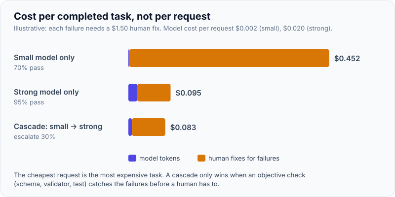
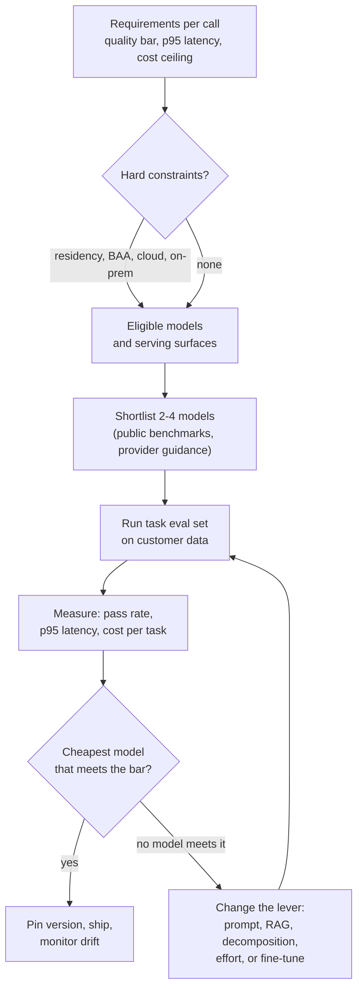
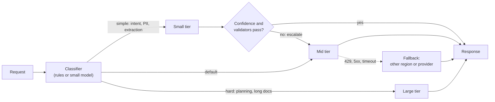
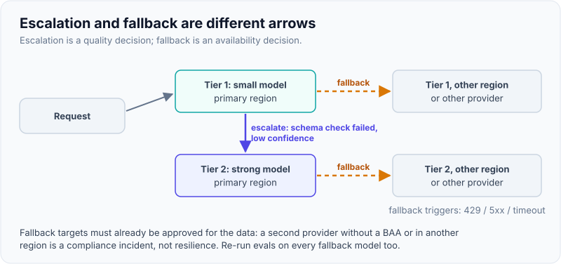

# Model Selection & Routing: Quality vs Latency vs Cost Across Providers

!!! abstract "Key takeaways"
    - **Choose per task, not per company.** A deployment usually has several LLM calls (classify, retrieve, extract, draft, check). Each has its own quality bar, latency budget and cost ceiling, so each can use a different model.
    - **Evidence beats leaderboards.** Public benchmarks shortlist; a **task-specific eval set** on the customer's data decides. Measure quality, p95 latency and cost per *completed task*, not per request.
    - **Routing patterns:** static routing by task (start here), **cascades** (cheap model first, escalate on low confidence or a failed check), **fallback chains** (other region or provider on 429/5xx/timeout) and, rarely, a learned router.
    - **Non-functional constraints often decide first:** data residency, BAA/zero-retention eligibility, which cloud the customer already buys from (Bedrock, Vertex AI, Azure/Foundry), rate limits and feature parity per platform.
    - **Keep the model swappable.** Put a thin gateway between the app and providers, pin model versions, and re-run evals on every model change. Model names and prices below are dated **October 2026**; verify before quoting.

## Why it matters

In a demo, one frontier model does everything and nobody looks at the bill. In production at a customer, three things change:

1. **Volume.** A claims-triage flow might run 50,000 times a day. A 10× price difference between tiers is the difference between a project that pays back and one that gets cancelled at the next budget review.
2. **Latency.** A call-centre agent assist needs the first token in well under a second; a nightly batch summariser doesn't care.
3. **Constraints.** The customer's security team may allow only models served from their own cloud account, in one region, under a signed BAA.

FDE interviewers ask "Which model would you use?" to see whether you reason from **requirements and evidence** or from brand loyalty. The strong answer names a starting point, says how you'd measure it, and explains how the system stays able to switch.

Before 2024 most teams hard-coded one model. Since then the market has settled into **tiers** inside each provider (large/flagship, mid, small/fast), multiple serving surfaces for the same model (first-party API, AWS, Google Cloud, Azure), and per-request knobs (reasoning effort, thinking, service tier) that move a single model along the quality-latency-cost curve.

## Core concepts

### The three-way trade-off, per call

Every LLM call sits somewhere on three axes:

| Axis | What drives it | How you measure it |
|---|---|---|
| **Quality** | Model capability, prompt, context (RAG), reasoning effort | Task eval pass rate; human review; business KPI (e.g. % of drafts accepted unedited) |
| **Latency** | Model size, reasoning/thinking tokens, output length, input length, region, queueing | Time to first token (TTFT), total time, **p95/p99** not average |
| **Cost** | Price per input/output token × tokens, caching, batch discounts, retries | Cost per completed task (including retries and escalations) |

Two non-obvious points interviewers like:

- **Output tokens dominate latency** (they're generated one by one) and usually cost 4–8× input tokens per token. Shortening output often beats switching model.
- **Reasoning effort is a model selection knob.** Current models from Anthropic, OpenAI and Google expose effort or thinking controls. Before building a multi-model cascade, test the stronger model at *lower* effort: one model is simpler to operate and keeps one prompt cache.

{ loading=lazy }
*The cheapest request can be the most expensive task.*

### The model landscape (as of October 2026)

Prices and names change every few months. Treat this table as the *shape* of the market, and check the providers' model pages before a customer conversation.

| Provider | Tiers today (examples) | Serving surfaces | Notes for deployments |
|---|---|---|---|
| **Anthropic** | Claude Opus 5.5 (`claude-opus-5-5`, $4/$20 per 1M input/output tokens), Claude Sonnet 5.5 (`claude-sonnet-5-5`, $2/$10), Claude Haiku 5.5 (`claude-haiku-5-5`, $0.10/$0.50 for prompts up to 100K tokens, $0.50/$2.50 beyond) for fast/cheap work | Claude API, Amazon Bedrock, Google Vertex AI, Microsoft Foundry | 1M-token context on Opus 5.5, Sonnet 5.5 and Haiku 5.5; effort levels `low`→`max` (Anthropic models table, October 2026) |
| **OpenAI** | GPT-5.5 family (third-party trackers list ~$5/$30 per 1M; Pro variant much higher), smaller "mini/nano" tiers | OpenAI API, Azure (Foundry) | Responses API is the primary surface; reasoning effort parameter; Batch and Flex tiers at about half price |
| **Google** | Gemini 3.5 Flash (GA June 2026), Gemini 3.1 Pro (preview), Flash-Lite tiers | Gemini API, Vertex AI | Implicit caching on by default; Gemini 2.5 family reported to be shut down mid-October 2026 *[verify]* |
| **Open-weight** | Llama, Mistral, Qwen, DeepSeek and others | Self-hosted (vLLM, TGI), Bedrock, Vertex, Azure | Full data control and fine-tuning; you own GPUs, scaling and safety |

!!! warning "Perishable facts"
    Anthropic's Opus 5.5 and Sonnet 5.5 IDs and prices come from Anthropic's model table and launch coverage (late September 2026). OpenAI and Google figures above come partly from third-party trackers. Never quote a price to a customer from memory; open the pricing page with them.

### Selection process: from requirements to a shortlist to a decision


*Notice that hard constraints filter before quality is even measured, and that "no model meets the bar" sends you back to the system design, not to a bigger model by default.*

Practical rules:

1. **Start with the strongest model that meets the hard constraints** to find out whether the task is solvable at all. If the best model fails, a cheaper one will too, and the problem is the prompt, the context or the task framing.
2. **Then walk down the tiers** on the same eval set until quality drops below the bar. That gives you a cost-quality curve the customer can choose from.
3. **Measure cost per completed task.** A cheap model that needs two retries and a human fix is not cheap.
4. **Record the decision** (eval results, date, versions) so you can defend it to the customer's architecture board and repeat it when new models ship.

### Routing patterns


*Notice the two different arrows out of a tier: escalation is a quality decision (the answer was not good enough), fallback is an availability decision (the call failed). Mixing them up is a common design bug.*

{ loading=lazy }
*Quality failures escalate; availability failures fall back.*

| Pattern | How it works | Good for | Watch out for |
|---|---|---|---|
| **Static routing by task** | Each pipeline step has a configured model | Most deployments; easy to reason about and evaluate | Needs re-evaluation when traffic mix changes |
| **Cascade (escalation)** | Small model first; escalate if a validator fails or self-reported confidence is low | High volume where most requests are easy | LLM self-confidence is poorly calibrated; prefer objective checks (schema, grounding, rules). Escalation adds latency to hard cases |
| **Fallback chain** | Same tier, different region/provider on errors | Availability SLOs, rate limits | Prompts and outputs differ across providers; each fallback model needs its own eval pass |
| **Learned router** | A classifier predicts which model will succeed | Very high volume with measurable savings | Needs labelled data and monitoring; often overkill for a single customer |
| **Ensemble / judge** | Several models answer; a judge picks or merges | Rare, high-stakes outputs | Multiplies cost and latency |

### Hard constraints that decide before quality

- **Data handling:** Is the provider able to sign a BAA for this use (healthcare)? Is zero data retention available for the endpoints you need? Both Anthropic and OpenAI limit BAA/ZDR coverage to specific endpoints and features, so check the feature eligibility list, not just "the provider".
- **Where it runs:** Customers with an AWS commit often want Bedrock; Google shops want Vertex AI; Microsoft shops want Azure/Foundry. Feature availability (prompt caching options, batch, newest tools) can lag on partner platforms; check the platform's own availability table.
- **Region and residency:** Some providers offer regional inference controls (Anthropic has an `inference_geo` request parameter on recent models, for example). Map this to the customer's residency requirement.
- **Rate limits and capacity:** Tokens-per-minute limits per model and account can be the real bottleneck at launch. Ask for limit increases early, or provisioned throughput on cloud platforms.
- **Open weights vs API:** Required if data cannot leave the customer network at all or if the customer wants full control. Cost moves from tokens to GPUs and people.

## In practice: code & configuration

### A provider-neutral gateway with routing and fallback

The common mistake is calling one provider SDK directly from business code. The fix is a small interface plus configuration. The routing logic below runs offline with fake backends (it was executed in a scratch directory); real backends wrap provider SDK calls.

=== "❌ Common mistake"
    ```python
    # Business code tied to one model and one provider.
    from openai import OpenAI
    client = OpenAI()

    def summarise_case(note: str) -> str:
        r = client.responses.create(model="gpt-5.5", input=f"Summarise: {note}")
        return r.output_text
    # - No way to switch model per task or fall back on outage.
    # - No version pinning, no eval gate, no cost/latency logging.
    # - The model name is buried in code; changing it is a redeploy.
    ```

=== "✅ Correct approach"
    ```python
    # router.py - provider-neutral routing with cascade + fallback (offline demo ran OK).
    import time
    from dataclasses import dataclass
    from typing import Callable, Protocol

    class Backend(Protocol):
        name: str
        def complete(self, prompt: str, timeout_s: float) -> tuple[str, float]: ...  # (text, confidence)

    class ProviderError(Exception): ...

    @dataclass
    class Route:
        tier: str                       # "small" | "mid" | "large"
        chain: list[Backend]            # primary first, then fallbacks (other region/provider)
        timeout_s: float
        escalate_below: float | None    # confidence threshold to try the next tier up

    def classify(task: str, prompt: str) -> str:
        """Cheap, deterministic routing first. Add a learned router only if evals justify it."""
        if task in {"pii_detect", "intent", "extract_fields"}:
            return "small"
        if task in {"agent_plan", "clinical_summary"} or len(prompt) > 20_000:
            return "large"
        return "mid"

    def call_with_fallback(route: Route, prompt: str, log: Callable[[dict], None]):
        last: Exception | None = None
        for backend in route.chain:
            t0 = time.perf_counter()
            try:
                text, conf = backend.complete(prompt, route.timeout_s)
                log({"backend": backend.name, "ok": True, "ms": round((time.perf_counter() - t0) * 1000)})
                return text, conf, backend.name
            except (ProviderError, TimeoutError) as e:   # retryable: 429, 5xx, timeout, overloaded
                log({"backend": backend.name, "ok": False, "error": type(e).__name__})
                last = e
        raise RuntimeError("all backends failed") from last

    def answer(task: str, prompt: str, routes: dict[str, Route], log=print) -> str:
        order = ["small", "mid", "large"]
        tier = classify(task, prompt)
        for t in order[order.index(tier):]:
            text, conf, used = call_with_fallback(routes[t], prompt, log)
            if routes[t].escalate_below is None or conf >= routes[t].escalate_below:
                return f"[{t}/{used}] {text}"
            log({"escalate_from": t, "confidence": conf})    # quality decision, not availability
        return f"[{t}/{used}] {text}"
    ```
    Output of the offline demo (small tier returns confidence 0.55, mid-tier primary returns 503):
    ```text
    {'backend': 'small-A', 'ok': True, 'ms': 0}
    {'escalate_from': 'small', 'confidence': 0.55}
    {'backend': 'mid-A', 'ok': False, 'error': 'ProviderError'}
    {'backend': 'mid-B-other-region', 'ok': True, 'ms': 0}
    [mid/mid-B-other-region] answer from mid-B-other-region
    ```

### Real backends (not run here: needs API keys)

Each backend is a thin adapter. Shapes follow the official SDKs (Anthropic Python SDK 1.x, OpenAI Python SDK, Google Gen AI SDK) as of October 2026. Model IDs come from config, never from code.

```python
# backends.py - NOT RUN (requires API keys). Verify model IDs on each provider's models page.
import anthropic, openai
from google import genai
from google.genai import types

class ClaudeBackend:
    def __init__(self, model: str, name: str):
        self.client, self.model, self.name = anthropic.Anthropic(), model, name
    def complete(self, prompt: str, timeout_s: float):
        r = self.client.with_options(timeout=timeout_s, max_retries=0).messages.create(
            model=self.model,                       # e.g. "claude-sonnet-5-5"
            max_tokens=2048,
            output_config={"effort": "low"},        # effort is a per-route knob on current Claude models
            messages=[{"role": "user", "content": prompt}],
        )
        text = "".join(b.text for b in r.content if b.type == "text")
        return text, 1.0                            # confidence comes from YOUR validators, not the model

class OpenAIBackend:
    def __init__(self, model: str, name: str):
        self.client, self.model, self.name = openai.OpenAI(), model, name
    def complete(self, prompt: str, timeout_s: float):
        r = self.client.with_options(timeout=timeout_s, max_retries=0).responses.create(
            model=self.model,                       # e.g. a GPT-5.5-family ID from config
            input=prompt,
            reasoning={"effort": "low"},
        )
        return r.output_text, 1.0

class GeminiBackend:
    def __init__(self, model: str, name: str):
        self.client, self.model, self.name = genai.Client(), model, name
    def complete(self, prompt: str, timeout_s: float):
        r = self.client.models.generate_content(model=self.model, contents=prompt)  # e.g. "gemini-3.5-flash"
        return r.text, 1.0
```

Set `max_retries=0` in the adapter so the router, not the SDK, decides when to fall back; otherwise SDK retries (2 by default in the Anthropic SDK) multiply your timeout before the fallback ever fires.

### Routing configuration, versioned with the evals

```yaml
# routes.yaml - reviewed like code; every change re-runs the eval suite in CI
routes:
  intent_classify:  {tier: small, primary: haiku-tier,  fallback: [small-other-provider], timeout_s: 2,  max_output_tokens: 50}
  extract_pa_form:  {tier: small, primary: haiku-tier,  escalate_to: mid, escalate_if: "schema_or_business_check_failed"}
  draft_letter:     {tier: mid,   primary: claude-sonnet-5-5, fallback: [sonnet-on-bedrock-us-east], timeout_s: 20}
  agent_plan:       {tier: large, primary: claude-opus-5-5,   effort: high, timeout_s: 120}
eval_gate: {suite: evals/pa_v3.jsonl, min_pass_rate: 0.92, max_p95_ms: {draft_letter: 9000}}
```

## Real-world usage

- **Tiered pipelines** are the norm: a small model classifies and extracts, a mid model drafts, a large model handles planning or the hardest 5–10% of cases. Anthropic's own guidance describes this split, for example a cheaper worker model for sub-agents with a stronger orchestrator.
- **Cloud-provider serving** is often chosen for procurement and network reasons, not model reasons. In a bank or payer, "Claude on Bedrock inside our AWS org with PrivateLink" or "Gemini on Vertex in our GCP project" is easier to approve than a new vendor contract.
- **LLM gateways** (open-source proxies or cloud gateways) give one API across providers, central keys, rate limiting, logging and fallback. They help, but they don't remove the need to evaluate each model, because prompts behave differently across providers.
- **Failure modes seen in the field:** a provider deprecates a model and output format shifts silently; a fallback provider was never evaluated and produces off-policy answers during an outage; a "cheap" cascade escalates 60% of traffic, so it costs more and is slower than calling the mid model directly.
- **Healthcare and banking specifics:** the eligible model list is constrained by BAA/ZDR scope and residency. Expect the security team to ask which sub-processors see data, where inference runs and how long anything is retained.

## Trade-offs & production gotchas

| Option | Pros | Cons | Use when |
|---|---|---|---|
| One frontier model everywhere | Simplest; highest quality ceiling; one cache | Highest cost and often latency | Pilots, low volume, high-stakes reasoning |
| Static per-task routing | Predictable; each step evaluated on its own | Must maintain several prompts/evals | Most production pipelines |
| Cascade small → mid | Big savings when most traffic is easy | Calibration problem; extra latency on escalations | High volume with objective validators |
| Multi-provider fallback | Availability, negotiating leverage | Double the evals, prompt drift, two data-processing agreements | Strict SLOs; customer already contracted with both |
| Self-hosted open weights | Data never leaves; tune freely | GPU ops, scaling, safety work, slower model upgrades | Air-gapped or sovereign requirements; very high steady volume |

!!! warning "Gotcha: same model name, different behaviour"
    The same model served via a partner cloud can lag in features (newest tools, cache options, batch) and has its own quotas and IDs (Bedrock uses an `anthropic.` prefix, for example). Evaluate on the surface you will actually deploy.

!!! warning "Gotcha: pin versions and watch deprecations"
    Aliases that point to "latest" change behaviour under you. Pin the exact model ID in config, subscribe to deprecation notices, and run the eval suite before moving. Newer Claude models also changed API surface (for example, Opus 5.5 and Sonnet 5.5 reject forced `tool_choice` and some sampling parameters as of October 2026), so a model upgrade can be a code change, not just a config change.

!!! tip "Interview angle"
    Say the order out loud: "constraints, shortlist, eval on their data, cheapest model that meets the bar, then routing and fallback, with the decision recorded and re-run when models change."

## How this connects to my experience

- **Where I used it:** not used directly; no LLM work on the resume. Position it as transferable knowledge.
- **Talking points:**
    - At OptumRx Meteor I owned the **GraphQL Consumer Service** as the integration layer between 5 upstream systems and many consumers. Routing requests to the right upstream, timeouts, and fallbacks when an upstream is slow are the same design moves as an LLM gateway.
    - **Redis caching** for frequent queries maps directly to prompt/response caching decisions in a cost-sensitive route.
    - **Kafka retry and DLQ handling** is the async analogue of a fallback chain: failed LLM jobs go to a retry topic, then a dead-letter queue for review.
    - **Multi-cloud key management at CCKM (AWS, Azure, GCP)** gives credibility when discussing Bedrock vs Vertex vs Azure serving and customer-managed keys.
- **Likely follow-up chain:** "Which model would you pick for X?" → "How would you prove the cheaper model is good enough?" → "What happens when the provider has an outage?" → "How do you stop the bill from exploding?". Answer with the selection flow, the eval set ([Evals](05-evals-golden-datasets-llm-as-judge-retrieval-vs-answer-metri.md)), the fallback chain, and the cost controls in [Observability & cost](07-llm-observability-latency-budgets-and-token-cost-control.md).

## Interview questions

### Fundamentals

??? question "Q1. How do you choose a model for a new LLM feature at a customer?"
    **Answer:** Start from the requirements of each call: quality bar, p95 latency budget, cost ceiling and hard constraints (residency, BAA/ZDR, which cloud, on-prem). Filter eligible models and serving surfaces by the constraints. Shortlist two to four using public benchmarks and provider guidance. Build a small eval set from the customer's real data and run the shortlist. Pick the cheapest model that meets the bar, pin its version, and record the results so the decision can be repeated when new models ship.

    **Interviewer listens for:** constraints first, task-specific evals, cost per task, version pinning.

    **Common wrong answer:** "The one at the top of the leaderboard" or "the newest GPT/Claude."

??? question "Q2. Why measure cost per completed task instead of cost per request?"
    **Answer:** Because a cheaper model can need more retries, more tool calls, longer outputs, escalations or human correction. The business pays for finished work. Cost per task includes all model calls in the flow, retries, escalation calls and an estimate of human review time.

    **Interviewer listens for:** retries and escalations counted; link to business outcome.

    **Common wrong answer:** comparing price-per-token tables only.

??? question "Q3. What drives LLM latency, and which metric do you track?"
    **Answer:** Queueing and network, input processing (prefill, grows with prompt length), reasoning/thinking tokens, and output generation, which is sequential per token and usually dominates. Track time to first token for interactive UX and total time for end-to-end flows, at p95/p99, per route.

    **Interviewer listens for:** output tokens dominate; TTFT vs total; percentiles.

    **Common wrong answer:** "Bigger models are slower," with no mention of output length or percentiles.

??? question "Q4. What is the difference between escalation and fallback in a router?"
    **Answer:** Escalation is a quality decision: the answer from a cheaper tier failed a check, so a stronger model tries. Fallback is an availability decision: the call failed (429, 5xx, timeout), so the same tier on another region or provider tries. They have different triggers, different logging and different eval needs.

    **Interviewer listens for:** clear separation; objective triggers.

    **Common wrong answer:** treating them as the same "retry with another model."

### Intermediate

??? question "Q5. When does a cascade (small model first, escalate on failure) save money, and when does it backfire?"
    **Answer:** It saves money when most traffic is easy and you have an objective, cheap way to detect failure (schema validation, business rules, grounding check). It backfires when escalation rates are high (you pay for both calls and add latency), when the escalation trigger relies on poorly calibrated self-confidence, or when the cheap model fails silently with plausible output. Measure escalation rate and total cost against simply using the mid tier.

    **Interviewer listens for:** escalation rate math; objective validators; latency on hard cases.

    **Common wrong answer:** "Cascades always save money."

??? question "Q6. How would you test whether a stronger model at low effort beats a cascade of two models?"
    **Answer:** Run the same eval set three ways: strong model at low or medium effort, mid model alone, and the cascade. Compare pass rate, p95 latency and cost per task. One model at lower effort is often competitive and simpler to run: one prompt, one cache namespace, one set of evals. Choose the cascade only if the measured savings are worth the extra complexity.

    **Interviewer listens for:** effort as a knob; operational simplicity; same eval set.

    **Common wrong answer:** assuming cheaper model = cheaper system.

??? question "Q7. A customer insists on running Claude through Bedrock (or Gemini through Vertex AI). What changes?"
    **Answer:** Model IDs, auth (IAM or Google ADC instead of API keys), quotas and pricing are platform-specific. Some features can lag on partner platforms, so check the availability table for caching options, batch, tools and newest models. Networking can be private (PrivateLink or Private Service Connect). Evaluate on that platform because defaults and limits differ. The benefits are procurement, data staying within their cloud account boundary, and existing security controls.

    **Interviewer listens for:** feature parity check; identity and networking; eval on the real surface.

    **Common wrong answer:** "Same model, nothing changes."

??? question "Q8. How do you keep model choice reversible?"
    **Answer:** A gateway interface between business code and providers; model IDs and parameters in versioned config; prompts and evals stored per route and per model; outputs validated against schemas so downstream code does not depend on one model's style; logging that records model and version on every call; and a CI gate that runs evals before a model change is promoted.

    **Interviewer listens for:** config not code; evals as the gate; schema contracts.

    **Common wrong answer:** "Use LangChain so we can switch."

### Senior

??? question "Q9. How do you design a multi-provider fallback without creating a compliance problem?"
    **Answer:** Only include providers and surfaces that are already approved for this data class (BAA/ZDR scope, residency, sub-processor list). Prefer the same model on a second region or cloud surface before a different vendor. Evaluate each fallback model on the full suite, including safety cases. Make fallback visible in logs and metrics, cap how long you stay on fallback, and alert. Document it in the data-flow diagram the security team approved.

    **Interviewer listens for:** approval scope; evals for fallbacks; observability.

    **Common wrong answer:** adding a random cheaper provider "just for outages."

??? question "Q10. Your team wants a learned router. How do you decide whether it's worth it?"
    **Answer:** Estimate the upside: share of traffic a cheaper model already handles correctly (from eval and production logs) × price difference × volume. Compare with the cost of labelled data, training, monitoring and the risk of misroutes. Start with rules and a cascade with objective checks; build a learned router only at high volume when the measured savings justify it, and keep a holdout to measure its regret.

    **Interviewer listens for:** quantified case; rules first; monitoring misroutes.

    **Common wrong answer:** building one because it's interesting.

??? question "Q11. How do you handle model deprecations and silent upgrades?"
    **Answer:** Pin exact versions, avoid floating aliases in production, track provider deprecation schedules, and keep a migration runbook: run evals on the new model, compare outputs on a sample of production traffic (shadow mode), check API changes (new models sometimes remove parameters or change defaults), then ramp gradually with rollback. Re-tune prompts if needed.

    **Interviewer listens for:** shadow traffic; API-surface changes; rollback.

    **Common wrong answer:** "Upgrade when the new one comes out; it's better."

### Scenario-based

??? question "Q12. A payer wants an assistant for call-centre agents: answers in under 2 seconds, PHI involved, AWS-only. Walk me through model selection."
    **Answer:** Constraints first: PHI means BAA-eligible endpoints only, AWS-only suggests Bedrock in their account and region, with private networking. Latency means streaming, small or mid tier for the answer, short outputs, and retrieval kept fast. Shortlist the eligible models on Bedrock, build a 100–200 question eval set from real (de-identified) calls, measure TTFT p95 and pass rate. Probably a mid tier for answers, a small tier for intent and PII detection, and a fallback to the same model in a second approved region. Revisit after two weeks of production data.

    **Interviewer listens for:** constraints, streaming, TTFT, eval data from real calls, same-model fallback.

    **Common wrong answer:** naming a model without addressing PHI or latency.

??? question "Q13. Finance says the LLM bill tripled after launch. What do you check first?"
    **Answer:** Break cost down by route, model, tenant and token type (input, cached input, output). Typical culprits: a route silently on the large model, cache hit rate collapsed (a timestamp in the system prompt), retrieval stuffing too many chunks, agent loops with many turns, retries on errors, or long outputs. Then fix the biggest bucket: routing, caching, context trimming, output limits, batch for offline work. See the cost calculator in [Observability & cost](07-llm-observability-latency-budgets-and-token-cost-control.md).

    **Interviewer listens for:** measure before acting; token-type breakdown; concrete levers.

    **Common wrong answer:** "Switch everything to the cheapest model."

??? question "Q14. The customer's CTO asks, 'Why not just use the best model for everything?' How do you respond?"
    **Answer:** For a pilot, that is often right: it shows what's possible. For production, show the eval results: on, say, intent classification, the small tier scores the same at a fraction of the cost and latency, while on drafting the larger model is clearly better. Offer a cost-quality table per step so they choose with data, and keep the option to move any step up if quality slips.

    **Interviewer listens for:** agreeing where valid; data-driven options; customer chooses.

    **Common wrong answer:** dismissing the question or arguing on price alone.

## Cheat sheet

| Concept | Remember |
|---|---|
| Selection order | Constraints → shortlist → eval on customer data → cheapest that meets the bar → pin and record |
| Metrics | Pass rate, TTFT and total at p95, cost per completed task |
| Latency | Output tokens dominate; stream; cap output; effort/thinking adds time |
| Escalation vs fallback | Quality decision vs availability decision |
| Cascade | Worth it only with objective validators and low escalation rate |
| Effort knob | Try a strong model at low effort before building a cascade |
| Platforms | Bedrock / Vertex / Foundry: different IDs, quotas, feature lag; evaluate there |
| Compliance | BAA/ZDR cover specific endpoints/features; residency; sub-processors |
| Reversibility | Gateway interface, config not code, evals as CI gate, schema contracts |
| Dated facts (Oct 2026) | `claude-opus-5-5` $4/$20, `claude-sonnet-5-5` $2/$10; GPT-5.5 family; Gemini 3.5 Flash GA |

## Sources
1. [Anthropic: Models overview](https://platform.claude.com/docs/en/about-claude/models/overview): current Claude model IDs, context windows, pricing (checked via Anthropic's model table, October 2026).
2. [Andrew.ooo: Claude 5.5 family tier guide (Oct 2026)](https://andrew.ooo/answers/claude-5-5-family-opus-vs-sonnet-vs-haiku-which-tier-october-2026/) and [There's an AI for That: Sonnet 5.5](https://theresanaiforthat.com/model/sonnet-5-5/): Opus 5.5 / Sonnet 5.5 launch dates and prices; Haiku 5.5 status (secondary).
3. [OpenAI: Pricing](https://platform.openai.com/docs/pricing) and [Morph: OpenAI API pricing 2026](https://morphllm.com/openai-api-pricing): GPT-5.5 family pricing, batch/flex discounts (secondary tracker).
4. [Google AI for Developers: Gemini API changelog](https://ai.google.dev/gemini/docs/changelog): Gemini 3.5 Flash GA (June 2026).
5. [Anthropic: Building effective agents](https://www.anthropic.com/engineering/building-effective-agents): routing workflow pattern and "start simple" guidance.
6. [Anthropic: API and data retention](https://platform.claude.com/docs/en/manage-claude/api-and-data-retention) and [OpenAI: BAA / HIPAA guide](https://cdn.openai.com/osa/baa-hipaa-guide.pdf): BAA and ZDR apply to specific endpoints and features.
7. [Anthropic: Message Batches API announcement](https://anthropic.com/news/message-batches-api): 50% batch discount, 24-hour processing window.
8. [OpenAI: Reasoning models guide](https://platform.openai.com/docs/guides/reasoning): reasoning effort as a cost/latency knob.
