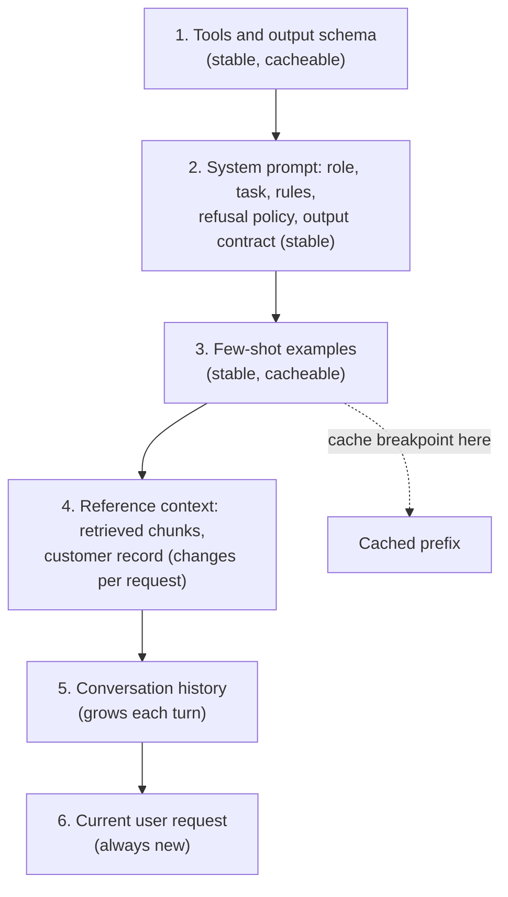
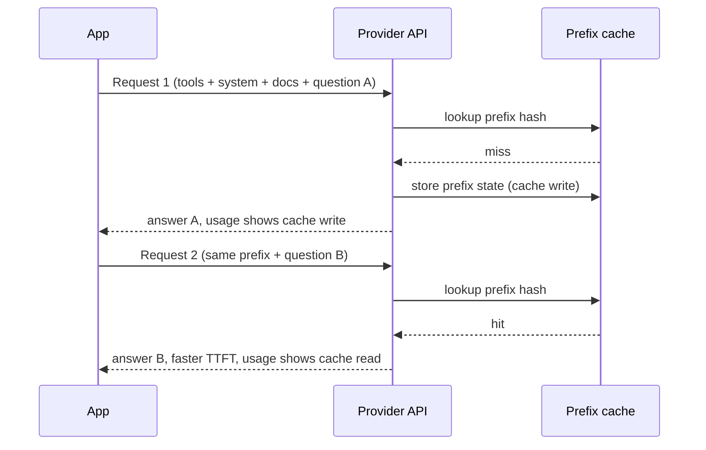

# Production Prompt Engineering, Structured Outputs & Prompt Caching

!!! abstract "Key takeaways"
    - **A production prompt is code:** versioned, reviewed, tested against an eval set, and deployed with the model version it was tuned for. Structure it as stable instructions → tools/schema → reference context → the variable request.
    - **Structured outputs** constrain decoding to a JSON Schema: Anthropic `output_config.format` (or `messages.parse`), OpenAI Responses `text.format` with `strict: true` (or `responses.parse`), Gemini `response_json_schema`. Strict tool definitions do the same for tool arguments.
    - **Schema-valid is not business-valid.** Still validate with Pydantic or Bean Validation, check evidence quotes against the source, and handle refusals and truncation.
    - **Prompt caching is a prefix match.** Put everything stable first and anything that changes per request last. One timestamp at the top of the system prompt can turn a 90% discount into a cost increase.
    - Caching mechanics differ: Anthropic is explicit (`cache_control`, 5-minute default TTL, 1-hour option, writes cost more, reads ~10% of base), OpenAI is automatic for prompts of 1,024+ tokens (`prompt_cache_key`, optional 24-hour retention), Gemini has implicit caching plus explicit cached content with a TTL.

## Why it matters

The demo prompt is one paragraph in a notebook. The production prompt runs a million times against inputs nobody anticipated, and its output is parsed by code that will throw if a field is missing. Three engineering problems show up immediately:

1. **Reliability of behaviour:** the model must follow the same policy for every user, refuse what it should, and say "I don't know" instead of guessing.
2. **Reliability of format:** downstream systems (a claims queue, a CRM, a Kafka topic) need valid, typed data, not prose with JSON somewhere inside it.
3. **Cost and latency:** long system prompts, tool definitions and few-shot examples are resent on every call. Without caching you pay full price for the same tokens every time.

Before provider-enforced schemas (2024), teams asked for "JSON only", then used regex and retry loops to fix broken output. Prefilling the assistant turn with `{` was a common trick; current Claude models reject assistant prefill, so structured outputs are now the supported path.

## Core concepts

### Anatomy of a production prompt


*Notice that the order is both a prompting choice and a caching choice: the stable parts come first so they form a reusable prefix, and the request-specific parts come last.*

What goes in each part:

- **Role and task:** who the assistant serves and the job, in plain language ("You draft prior-authorisation request letters for pharmacists at a pharmacy benefit manager").
- **Rules with reasons:** models follow rules better when they know why ("Never include member SSNs, because letters are sent to external prescribers").
- **Grounding rules:** "Answer only from the documents in `<context>`. If the answer is not there, say so and list what's missing." Ask for citations to chunk IDs.
- **Separation of data and instructions:** wrap untrusted content in clear delimiters (XML-style tags work well across providers) and tell the model that text inside them is data, not instructions. This reduces, but does not prevent, prompt injection (see [Guardrails](06-guardrails-prompt-injection-pii-phi-redaction-grounding-chec.md)).
- **Output contract:** either a schema enforced by the API or, for prose, a clear structure (headings, length limit).
- **Examples:** 2–5 diverse few-shot examples that show edge cases, not just the happy path. Examples are powerful and the model copies them closely, including their mistakes.

### Production prompting practices

| Practice | Why |
|---|---|
| Version prompts in git with the model ID they were tuned for | A model upgrade can change behaviour; you need to know which prompt ran |
| Template variables, never string concatenation of user input into instructions | Keeps untrusted text in the data section |
| Keep prompts direct and specific; avoid ALL-CAPS threats | Newer models follow instructions closely; over-emphatic prompts written for older models can cause over-refusal or rigidity |
| Give the model a way out ("If unsure, return `status: needs_review`") | Reduces confident guessing |
| Test every change against the eval suite in CI | A fix for one case often breaks three others |
| Log the rendered prompt hash, model, version and parameters per call | Debugging and audit |

### Structured outputs: how they work

There are three levels of format control:

1. **Instructions only** ("respond in JSON"): works most of the time, fails at scale.
2. **JSON mode:** guarantees syntactically valid JSON, not your schema.
3. **Schema-constrained decoding (structured outputs):** the provider compiles your JSON Schema into a grammar and restricts which tokens can be generated, so output always parses and matches the schema. First requests with a new schema can be slower while the grammar is built, and only a subset of JSON Schema is supported (check each provider's list).

The same idea applies to **tool calls**: a tool definition with `strict: true` (Anthropic and OpenAI) guarantees the arguments match the tool's input schema.

| Provider | Response format | Strict tool arguments | SDK helper |
|---|---|---|---|
| Anthropic Messages API | `output_config: {format: {type: "json_schema", schema: {...}}}` (the older `output_format` request parameter is deprecated) | `strict: true` on the tool definition | `client.messages.parse(..., output_format=PydanticModel)` → `response.parsed_output` |
| OpenAI Responses API | `text: {format: {type: "json_schema", name, schema, strict: true}}` (Chat Completions used `response_format`) | `strict: true` on function tools | `client.responses.parse(..., text_format=PydanticModel)` → `response.output_parsed` |
| Gemini API | `response_mime_type: "application/json"` + `response_json_schema` (older `response_schema` uses an OpenAPI subset) | Function declarations with schemas | Pass a Pydantic model's JSON schema |

Schema design tips that matter in production:

- `additionalProperties: false` and every field in `required`; make optional fields **nullable** rather than omitted, so the model must decide explicitly.
- Use `enum` for categorical fields (status, urgency) so downstream `switch` statements never see a surprise value.
- Add an **evidence** field (verbatim quotes from the source) next to extracted values. It makes grounding checks cheap and reviews faster.
- Add an escape hatch (`needs_review`, `confidence`, `missing_fields`) instead of forcing the model to invent a value for a required field.
- Field order matters a little: put reasoning or evidence fields *before* the decision field if you want the model to consider evidence first.

!!! warning "Gotcha: citations vs structured outputs"
    On the Claude API, the document **citations** feature is incompatible with `output_config.format` (the request is rejected). Pick one per call: citations for grounded prose answers, structured outputs with an `evidence_quotes` field for extraction.

### Prompt caching: the mechanism

LLM inference has two phases: **prefill** (process the whole prompt, building attention key/value state) and **decode** (generate tokens). If many requests share the same prompt prefix, the provider can keep the computed state for that prefix and skip recomputing it. You get lower input cost and lower time to first token.

Key properties, common across providers:

- **Exact prefix match.** Any change at position *n* invalidates everything after *n*. Order: tools → system → messages (Anthropic renders in that order).
- **Minimum length.** Short prefixes aren't cached (thresholds are model-specific, from about 1,024 to 4,096 tokens).
- **Time-to-live.** Entries expire after minutes of inactivity unless you choose a longer TTL.
- **Scope.** Caches are per model (and per organisation or project). Switching models in a cascade loses the cache.

| | Anthropic | OpenAI | Gemini |
|---|---|---|---|
| Activation | Explicit `cache_control` breakpoints (up to 4) or top-level automatic `cache_control` | Automatic on prompts ≥ 1,024 tokens | Implicit (on by default for 2.5 and newer) + explicit `CachedContent` |
| TTL | 5 min default (refreshed on use); `ttl: "1h"` option | In-memory by default; `prompt_cache_retention: "24h"` option | Explicit cache TTL defaults to 1 hour; you can set it |
| Pricing shape | Write 1.25× base input (5-min) or 2× (1-hour); read 0.1× | Discounted cached input; no write surcharge | Discounted cached tokens; explicit caches also bill storage time |
| Routing hint | n/a | `prompt_cache_key` to improve hit rate for shared prefixes | Send similar-prefix requests close together |
| Verify | `usage.cache_read_input_tokens`, `cache_creation_input_tokens` | `usage.input_tokens_details.cached_tokens` (Responses API) | `usage_metadata` cached token count |


*Notice that the second request only pays full price for the new suffix; if anything in the prefix had changed, even one character, request 2 would be another miss and write.*

**Silent cache killers** (check these first when the hit rate is low): a timestamp or request ID in the system prompt; tools listed in a non-deterministic order; JSON serialised without sorted keys; per-user data placed before the shared documents; switching model or effort level mid-conversation; editing earlier turns of history instead of appending.

## In practice: code & configuration

### The cache-busting mistake

=== "❌ Common mistake"
    ```python
    from datetime import datetime
    SYSTEM = f"""You are a prior-auth assistant. Today is {datetime.now().isoformat()}.
    User: {user.name} (member {user.member_id})
    {FORMULARY_POLICY_40K_TOKENS}
    """
    # - Timestamp and user fields at the top change on every call: 0% cache hits.
    # - PHI in the system prompt also ends up in every log of the prompt.
    # - "Respond in JSON" in prose, then json.loads() on whatever comes back.
    ```

=== "✅ Correct approach"
    ```python
    SYSTEM = (                      # byte-identical across requests -> cacheable
        "You are a prior-auth assistant for pharmacists.\n"
        "Answer only from <policy> and <case>. If information is missing, set status to needs_review.\n"
        f"<policy>\n{FORMULARY_POLICY_40K_TOKENS}\n</policy>"
    )
    user_turn = (                   # everything volatile goes AFTER the cached prefix
        f"<today>{date.today().isoformat()}</today>\n"
        f"<case>\n{redacted_case_text}\n</case>\n"
        "Extract the prior-authorisation fields."
    )
    # + schema-enforced output (below) + Pydantic validation at the boundary.
    ```

### Anthropic Messages API: structured output plus caching (not run: needs API key)

Shapes follow the Anthropic Python SDK 1.x as of October 2026.

```python
# NOT RUN - requires ANTHROPIC_API_KEY. Model ID from config; verify on the models page.
import anthropic
from schemas import PriorAuthExtraction      # Pydantic model, shown below

client = anthropic.Anthropic()

resp = client.messages.parse(
    model="claude-sonnet-5-5",
    max_tokens=2048,
    system=[{
        "type": "text",
        "text": SYSTEM,                                  # long, stable policy text
        "cache_control": {"type": "ephemeral"},          # breakpoint: cache everything up to here
    }],
    messages=[{"role": "user", "content": user_turn}],
    output_format=PriorAuthExtraction,                   # SDK converts to output_config.format
)

if resp.stop_reason == "refusal":                         # always check before reading content
    raise RefusedError(resp.stop_details)
if resp.stop_reason == "max_tokens":                      # truncated JSON cannot be trusted
    raise TruncatedError()

extraction = resp.parsed_output                           # validated PriorAuthExtraction
u = resp.usage
log.info("cache_write=%s cache_read=%s uncached_in=%s out=%s",
         u.cache_creation_input_tokens, u.cache_read_input_tokens, u.input_tokens, u.output_tokens)
```

### OpenAI Responses API: the same contract (not run: needs API key)

```python
# NOT RUN - requires OPENAI_API_KEY. Model ID from config.
from openai import OpenAI
from schemas import PriorAuthExtraction

client = OpenAI()

resp = client.responses.parse(
    model=MODEL_ID,                                   # a GPT-5.5-family ID from config
    instructions=SYSTEM,                              # stable prefix; cached automatically at >= 1,024 tokens
    input=user_turn,
    text_format=PriorAuthExtraction,                  # -> text.format json_schema, strict
    prompt_cache_key="pa-extract-v3",                 # routing hint so shared-prefix traffic hits the same cache
    prompt_cache_retention="24h",                     # optional extended retention ("in_memory" is default)
    store=False,                                      # don't keep application state server-side
)
extraction = resp.output_parsed
print(resp.usage.input_tokens_details.cached_tokens)  # 0 on a miss or for prompts < 1,024 tokens
```

Raw JSON Schema form, if you're not using the helper:

```python
resp = client.responses.create(
    model=MODEL_ID,
    input=user_turn,
    text={"format": {
        "type": "json_schema", "name": "prior_auth", "strict": True,
        "schema": PriorAuthExtraction.model_json_schema(),   # must satisfy strict-mode rules
    }},
)
```

### Gemini API (not run: needs API key)

```python
# NOT RUN - requires GEMINI_API_KEY (or Vertex AI ADC). Model ID from config.
from google import genai
from google.genai import types

client = genai.Client()
resp = client.models.generate_content(
    model="gemini-3.5-flash",
    contents=user_turn,
    config=types.GenerateContentConfig(
        system_instruction=SYSTEM,                    # implicit caching applies to repeated prefixes
        response_mime_type="application/json",
        response_json_schema=PriorAuthExtraction.model_json_schema(),
    ),
)
extraction = PriorAuthExtraction.model_validate_json(resp.text)
```

### Validate at the boundary (ran offline)

Schema enforcement guarantees shape. It does not guarantee the quote is real or the date makes sense. This Pydantic model and check ran in the scratch directory:

```python
from datetime import date
from typing import Literal
from pydantic import BaseModel, Field, ValidationError, field_validator

class PriorAuthExtraction(BaseModel):
    model_config = {"extra": "forbid"}                 # -> additionalProperties: false
    drug_name: str
    hcpcs_code: str | None = Field(default=None, pattern=r"^[A-Z]\d{4}$")
    diagnosis_icd10: list[str]
    urgency: Literal["standard", "expedited"]          # enum, never a surprise value downstream
    date_of_service: date | None                       # required but nullable: model must decide
    confidence: float = Field(ge=0, le=1)
    evidence_quotes: list[str] = Field(description="Verbatim spans from the note supporting each field")

    @field_validator("diagnosis_icd10")
    @classmethod
    def icd10_shape(cls, v):
        bad = [c for c in v if not (len(c) >= 3 and c[0].isalpha() and c[1:3].isdigit())]
        if bad:
            raise ValueError(f"not ICD-10 shaped: {bad}")
        return v

def business_checks(x: PriorAuthExtraction, source_note: str) -> list[str]:
    problems = [f"quote not in note: {q[:40]!r}" for q in x.evidence_quotes if q not in source_note]
    if x.date_of_service and x.date_of_service > date.today():
        problems.append("date_of_service in the future")
    return problems
```

```text
good         schema OK; business: OK
hallucinated schema OK; business: ["quote not in note: 'Failed methotrexate for 6 months'"]
broken       schema FAIL: ['notes: extra_forbidden', 'diagnosis_icd10: value_error',
                           'urgency: literal_error', 'date_of_service: missing', 'confidence: less_than_equal']
```

The "hallucinated" case is the important one: perfectly valid JSON with an invented clinical fact. Only the evidence check catches it.

### Java: Spring AI `ChatClient` with a typed entity (not compiled here)

Spring AI 2.0.x (latest stable 2.0.1 per the docs, October 2026) maps a Java record to a JSON Schema. In 2.0 you can ask for the provider's native structured output per call.

```java
// NOT COMPILED HERE - Spring Boot 3/4 + Spring AI 2.0.x starter for your provider.
public record PriorAuthExtraction(
        String drugName, String hcpcsCode, List<String> diagnosisIcd10,
        Urgency urgency, LocalDate dateOfService, double confidence, List<String> evidenceQuotes) {
    public enum Urgency { STANDARD, EXPEDITED }
}

@Service
class PriorAuthExtractor {
    private final ChatClient chat;

    PriorAuthExtractor(ChatClient.Builder builder, @Value("classpath:prompts/pa-system-v3.st") Resource system) {
        this.chat = builder.defaultSystem(system).build();          // stable system prompt
    }

    PriorAuthExtraction extract(String redactedCase) {
        return chat.prompt()
                .user(u -> u.text("<case>{c}</case>\nExtract the prior-authorisation fields.")
                            .param("c", redactedCase))               // template param, not concatenation
                .call()
                .entity(PriorAuthExtraction.class,
                        spec -> spec.useProviderStructuredOutput()); // 2.0: provider-enforced schema
    }
}
```

Then validate with Bean Validation (`@Pattern`, `@DecimalMax`) and the same evidence check before anything is written to the claims system.

## Real-world usage

- **Extraction pipelines** (prior-auth forms, invoices, KYC documents) are the most common structured-output use: schema-enforced output feeds straight into queues and databases, with low-confidence or failed-check items routed to humans.
- **Prompt caching** pays off most for long, shared prefixes: large policy manuals, codebases, tool catalogues for agents, and multi-turn chats. Anthropic advertises up to 90% lower input cost on cached tokens; Anthropic's contextual retrieval write-up relied on caching to make per-chunk context generation cheap.
- **Prompt registries** (in git or a prompt-management tool) with versions, owners and linked eval results are standard in mature teams. Spring AI, LangChain and provider consoles all support templated prompts.
- **Failure modes:** a schema change shipped without updating consumers; a prompt tweak that fixed one complaint and broke refusals; cache hit rate silently dropping to zero after someone added "Current time:" to the system prompt; JSON truncated by a low `max_tokens` and parsed anyway.

## Trade-offs & production gotchas

| Option | Pros | Cons | Use when |
|---|---|---|---|
| Prose instructions for format | Flexible; any model | Breaks at scale; needs repair loops | Free-text answers for humans |
| JSON mode | Always parses | Not your schema | Legacy models without schema support |
| Structured outputs (response schema) | Always matches the schema | Supported-subset limits; first-call compile latency; not compatible with some features | Extraction, classification, any machine consumer |
| Strict tool calling | Guaranteed tool arguments | Tool must be defined; model decides whether to call | Agents and actions |
| Explicit caching (Anthropic) | Control over what's cached and TTL | Write premium; breakpoint management | Long stable prefixes, agents, RAG over fixed corpora |
| Automatic caching (OpenAI, Gemini implicit) | Zero effort | Less control; hit rate depends on routing | Default; improve with prefix ordering and cache keys |

!!! warning "Gotcha: 1-hour vs 5-minute TTL is an economic choice"
    On Anthropic, a 1-hour write costs 2× base input versus 1.25× for 5 minutes. Use 1 hour when requests sharing the prefix arrive more than 5 minutes apart (batch jobs, low-traffic tenants); otherwise the 5-minute cache refreshed by traffic is cheaper.

!!! warning "Gotcha: refusals and truncation"
    A schema can't force the model to comply. Check `stop_reason` (`refusal`, `max_tokens`) before parsing, and set `max_tokens` generously for structured responses; a truncated JSON object is a failure, not a partial result.

## How this connects to my experience

- **Where I used it:** not used directly; no LLM work on the resume. Transferable pieces:
    - **GraphQL schemas** at OptumRx Meteor: typed contracts between 5 upstream systems and consumers. Structured outputs are the same idea: a schema is the contract between a non-deterministic producer and deterministic consumers.
    - **Redis caching** of frequent queries and reference data: the same reasoning about keys, TTLs, hit rate and invalidation applies to prompt caching (except the key is an exact prefix).
    - **Engineering standards for testing and CI/CD**: prompts become versioned artefacts with tests, like any other code.
- **Talking points:** "I treat the schema as the API contract and the model as an unreliable upstream: enforce at the API, validate at my boundary, and route failures to a human queue, just as we did with DLQs for bad Kafka events."
- **Likely follow-up chain:** "How do you get reliable JSON?" → "What if it's valid JSON but wrong?" → "How do you control cost of a 40K-token policy prompt?" → "Why is the cache hit rate zero?". Answer with structured outputs, evidence checks, caching, and the silent-killer checklist.

## Interview questions

### Fundamentals

??? question "Q1. What's the difference between JSON mode and structured outputs?"
    **Answer:** JSON mode guarantees syntactically valid JSON but not any particular shape. Structured outputs constrain decoding against a supplied JSON Schema, so the output parses and matches the schema (required fields, types, enums). Providers compile the schema into a grammar; supported keywords are a subset of JSON Schema.

    **Interviewer listens for:** constrained decoding; schema subset; still needs semantic validation.

    **Common wrong answer:** "They're the same; both return JSON."

??? question "Q2. How do you structure a production system prompt?"
    **Answer:** Role and task; rules with reasons; grounding rules (answer only from the provided context, cite sources, say when information is missing); clear delimiters separating untrusted data from instructions; an output contract (schema or format); a small set of diverse examples. Stable content first, volatile content last, so it's cacheable. Version it with the model ID and test it against an eval set.

    **Interviewer listens for:** grounding, delimiters, versioning, ordering for caching.

    **Common wrong answer:** "Tell it to be an expert and add 'do not hallucinate'."

??? question "Q3. How does prompt caching work and why does order matter?"
    **Answer:** The provider stores the computed attention state for a prompt prefix and reuses it when a later request starts with exactly the same tokens. Any difference invalidates the cache from that point on. So stable content (tools, system prompt, documents, examples) goes first and per-request content (user data, question, timestamps) goes last.

    **Interviewer listens for:** prefix match; KV state reuse; ordering.

    **Common wrong answer:** "It caches responses to identical questions." (That's response caching, a different thing.)

??? question "Q4. How do the three big providers differ on caching?"
    **Answer:** Anthropic: explicit `cache_control` breakpoints (or automatic top-level), 5-minute TTL by default with a 1-hour option, writes at a premium (1.25× or 2×), reads at about 0.1×. OpenAI: automatic for prompts of 1,024+ tokens, `prompt_cache_key` to improve routing, optional 24-hour retention, reported as `cached_tokens`. Gemini: implicit caching on newer models plus explicit cached content objects with a TTL (default 1 hour) and storage cost. Mechanics change; check the docs.

    **Interviewer listens for:** explicit vs automatic; how to verify hits.

    **Common wrong answer:** not knowing that you must verify hits in usage fields.

### Intermediate

??? question "Q5. Your cache hit rate is near zero. What do you look for?"
    **Answer:** Something changing in the prefix: timestamps or IDs in the system prompt, tool definitions in a non-deterministic order, unsorted JSON, user-specific data placed before shared content, model or effort switches, edited history, prefix below the minimum length, or requests spread so far apart the TTL expires (consider a longer TTL). Compare two consecutive rendered prompts byte by byte and check the usage fields.

    **Interviewer listens for:** systematic diff; usage fields; TTL economics.

    **Common wrong answer:** "Increase the cache size."

??? question "Q6. Structured outputs guarantee the schema. Why validate again?"
    **Answer:** Because schema-valid isn't correct. The model can invent a value that fits the type, quote text that's not in the source, return a date in the future, or pick a valid enum that's wrong. Validate business rules, check evidence quotes against the source, cross-check codes against reference tables, and route failures to review. Also handle refusals and truncation, which return no valid object.

    **Interviewer listens for:** evidence check; business rules; refusal/truncation handling.

    **Common wrong answer:** "If it matches the schema it's fine."

??? question "Q7. How do you design a schema for extraction from messy clinical notes?"
    **Answer:** Required-but-nullable fields so the model must decide explicitly; enums for categories; patterns for codes; an `evidence_quotes` field per decision; a `missing_fields` or `needs_review` escape hatch; `additionalProperties: false`. Keep nesting shallow. Put evidence before the decision if you want the model to look first. Test with notes that lack fields to make sure it returns null instead of inventing.

    **Interviewer listens for:** nullability over invention; evidence; escape hatch.

    **Common wrong answer:** making every field required and non-null.

??? question "Q8. Few-shot examples: when do they help and when do they hurt?"
    **Answer:** They help to show format, tone and edge-case handling the instructions can't express. They hurt when they're all similar (the model overfits to them), when they contain mistakes (copied), when they leak real customer data, or when they bloat every request. Use a few diverse examples, include an "insufficient information" example, and keep them in the cached prefix.

    **Interviewer listens for:** diversity; negative examples; cost and caching.

    **Common wrong answer:** "More examples are always better."

### Senior

??? question "Q9. How do you manage prompts across environments and model versions?"
    **Answer:** Prompts live in version control (or a prompt registry backed by it) with an ID, version, owner, target model and linked eval results. Deploy prompt+model as a unit through the same CI/CD as code, with the eval suite as a gate. Log the prompt version on every call. Support rollback and A/B or shadow runs for changes. On a model upgrade, re-run the evals and re-tune; prompts written for older models are often too prescriptive for newer ones.

    **Interviewer listens for:** prompt+model as a unit; eval gate; traceability.

    **Common wrong answer:** editing prompts in a UI in production.

??? question "Q10. When would you choose a 1-hour cache TTL on Anthropic?"
    **Answer:** When requests that share a large prefix arrive more than five minutes apart, so the 5-minute cache would expire between them: low-traffic tenants, batch jobs spread over time, agents that pause for tool calls or humans. A 1-hour write costs 2× base input versus 1.25×, so it pays off only if it avoids at least one extra write per hour. Calculate with real traffic.

    **Interviewer listens for:** arrival-interval reasoning; cost math.

    **Common wrong answer:** "Always use the longest TTL."

??? question "Q11. Structured outputs vs tool calling for getting data out of a model?"
    **Answer:** Use a response schema when you always want one object back (extraction, classification). Use tools when the model should decide whether and which action to take, or when there are several possible actions. On current Claude models, forced tool choice is rejected, so "define a tool just to force JSON" no longer works; structured outputs are the supported route.

    **Interviewer listens for:** decision vs always-output; current API constraints.

    **Common wrong answer:** using a fake tool for every structured response.

### Scenario-based

??? question "Q12. A customer's 60K-token policy manual is sent on every request and the bill is too high. What do you do?"
    **Answer:** Make the manual part of a stable cached prefix (system prompt or first user block with a cache breakpoint), move all per-request data after it, and verify hits in usage fields. Consider the TTL against arrival rates. Then ask whether all 60K tokens are needed: retrieval over the manual might send only relevant sections. Compare cost and quality on the eval set: caching full context vs RAG.

    **Interviewer listens for:** caching first; then RAG vs long-context trade-off measured.

    **Common wrong answer:** "Summarise the manual" without checking quality impact.

??? question "Q13. After a prompt change, the extraction pass rate went from 94% to 88%. How do you handle it?"
    **Answer:** Roll back (prompt versions are deployable units). Diff per-case results to find which cases regressed and why: often a new instruction conflicts with an old one or an example biases outputs. Add the regressed cases to the eval set, fix, and re-run the full suite before re-deploying. Make the CI gate block regressions beyond a threshold.

    **Interviewer listens for:** rollback, per-case diff, eval gate.

    **Common wrong answer:** tweaking in production until complaints stop.

??? question "Q14. The integration team asks for a guarantee that the model never returns malformed data to their claims API. What do you promise?"
    **Answer:** That every message sent to their API is schema-valid, because we use provider-enforced schemas and validate again at our boundary; anything that fails (refusal, truncation, business-rule failure) never reaches them and goes to a review queue instead. I don't promise the content is always right: we report measured accuracy from evals and production sampling, with confidence and evidence fields so they can set thresholds.

    **Interviewer listens for:** guarantee format, measure correctness; failure path.

    **Common wrong answer:** promising 100% accuracy.

## Cheat sheet

| Concept | Remember |
|---|---|
| Prompt order | Tools/schema → system rules → examples → context → history → request |
| Anthropic schema | `output_config.format` / `messages.parse(output_format=...)`; strict tools `strict: true` |
| OpenAI schema | Responses `text.format` json_schema `strict: true` / `responses.parse(text_format=...)` |
| Gemini schema | `response_mime_type="application/json"` + `response_json_schema` |
| Schema design | `additionalProperties: false`, required+nullable, enums, evidence field, escape hatch |
| Validate | Business rules, evidence-in-source, refusal and `max_tokens` checks |
| Caching rule | Exact prefix match; stable first, volatile last |
| Anthropic cache | `cache_control`, 5 min default / 1 h option; write 1.25× / 2×, read 0.1× |
| OpenAI cache | Automatic ≥ 1,024 tokens; `prompt_cache_key`; `prompt_cache_retention: "24h"` |
| Gemini cache | Implicit on 2.5+; explicit cached content, TTL default 1 h |
| Cache killers | Timestamps, IDs, unsorted JSON/tools, model switch, edited history |

## Sources
1. [Anthropic: Structured outputs](https://platform.claude.com/docs/en/build-with-claude/structured-outputs): `output_config.format`, strict tool use, SDK `parse` helper.
2. [Anthropic: Prompt caching](https://docs.anthropic.com/en/docs/build-with-claude/prompt-caching): breakpoints, TTLs, 1.25×/2× write and 0.1× read multipliers, usage fields.
3. [OpenAI: Structured model outputs](https://developers.openai.com/api/docs/guides/structured-outputs): `text.format` json_schema with `strict`, schema subset, Responses vs Chat Completions.
4. [OpenAI Cookbook: Prompt Caching 201](https://developers.openai.com/cookbook/examples/prompt_caching_201) and [OpenAI: Prompt caching guide](https://developers.openai.com/docs/guides/prompt-caching): automatic caching ≥ 1,024 tokens, `prompt_cache_key`, `prompt_cache_retention`, `cached_tokens`.
5. [Google AI for Developers: Context caching](https://ai.google.dev/gemini-api/docs/caching): implicit caching on 2.5+, explicit caching, default 1-hour TTL, minimum token tables.
6. [Google blog: Improving structured outputs in the Gemini API](https://blog.google/innovation-and-ai/technology/developers-tools/gemini-api-structured-outputs/) and [python-genai JSON response guide](https://mintlify.com/googleapis/python-genai/guides/json-response): `response_json_schema`, Pydantic support.
7. [Spring AI reference: Structured output](https://docs.spring.io/spring-ai/reference/2.0-SNAPSHOT/api/structured-output.html) and [Spring AI 2.0.0-RC1 announcement](https://spring.io/blog/2026/06/06/spring-ai-2-0-0-RC1-available-now/): `.entity(...)`, `EntityParamSpec`, provider-native structured output.
8. [Spring blog: Prompt caching support in Spring AI with Anthropic Claude](https://spring.io/blog/2025/10/27/spring-ai-anthropic-prompt-caching-blog/): caching from Java.
9. [Anthropic: Prompt engineering overview](https://platform.claude.com/docs/en/build-with-claude/prompt-engineering/overview): clear instructions, XML tags, examples.
