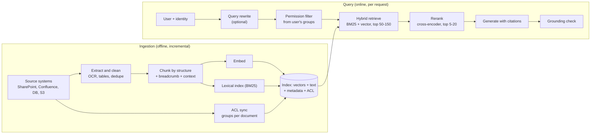
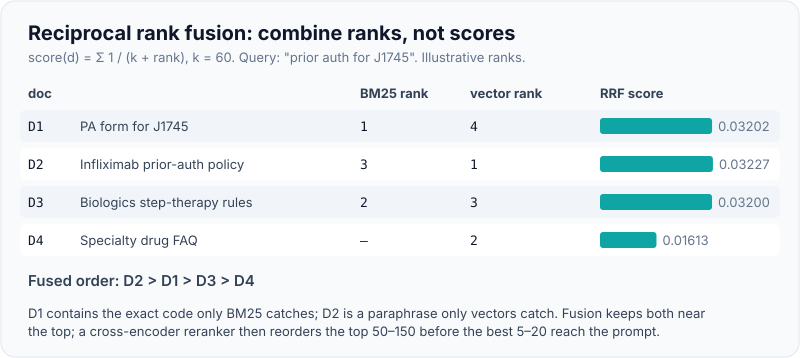
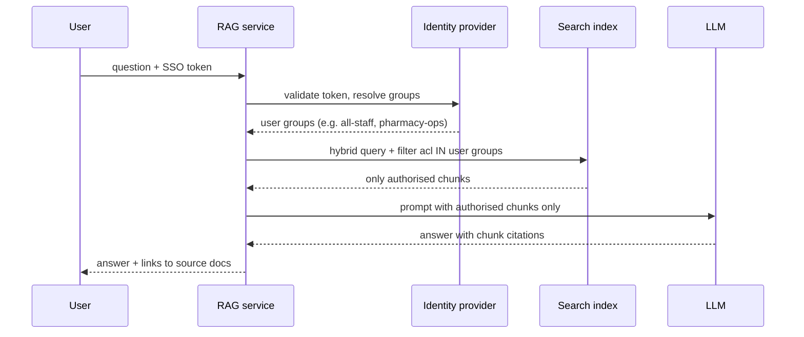

# Production RAG: Chunking, Hybrid Search, Reranking, Permission-Aware Retrieval

!!! abstract "Key takeaways"
    - **Most RAG failures are retrieval failures.** If the right chunk isn't in the top-k, no model or prompt can fix the answer. Measure retrieval (recall@k, MRR) separately from generation.
    - **Chunk by structure, not by character count:** split on headings, sections and table boundaries; keep a breadcrumb (document title, section path) with each chunk; add a short generated context ("contextual retrieval") when chunks lose meaning on their own.
    - **Hybrid search** (BM25 for exact terms such as codes, IDs and names + embeddings for paraphrase) fused with **reciprocal rank fusion** (score = Σ 1/(k + rank), k≈60) beats either alone on most enterprise corpora. A **reranker** (cross-encoder) on the top 50–150 candidates then picks the final few.
    - **Permission-aware retrieval is non-negotiable:** filter by the *end user's* entitlements **before** ranking, sync ACLs from the source system, and never let unauthorised text reach the prompt. The LLM is not an access-control layer.
    - Production RAG is a **data pipeline**: incremental ingestion, deletes and ACL changes propagated quickly, versioned indexes, and evals on every change.

## Why it matters

Nearly every enterprise LLM deployment needs company knowledge the model wasn't trained on: policies, contracts, tickets, clinical guidelines, product docs. Retrieval-augmented generation (RAG) fetches relevant passages at query time and puts them in the prompt, so answers are current, citable and limited to what the user may see.

The demo version (split PDFs every 1,000 characters, embed, top-5 cosine, stuff into a prompt) works on ten clean documents. At a customer it meets 400,000 SharePoint pages, scanned faxes, tables, acronyms, product codes, stale versions and per-team permissions. That is where FDE work happens. The [GenAI topic](../genai/index.md) covers RAG basics; this page covers what changes in production.

Long context windows (1M tokens on current flagship models) don't remove the need for RAG in the enterprise: the corpus is far bigger than any window, cost scales with tokens sent, and permissions must be applied per user. Long context does change the trade-off for *small* corpora (see [Prompting vs RAG vs fine-tuning](08-prompting-vs-rag-vs-fine-tuning-choosing-the-right-lever.md)).

## Core concepts

### The two pipelines


*Notice that the ACL is indexed alongside the text and applied before retrieval, and that ingestion is a pipeline of its own with freshness and deletion requirements.*

### Ingestion and chunking

Chunking decides what a "unit of retrieval" is. Too small and chunks lose meaning ("It increased 3% over the prior quarter" — what did?). Too big and you dilute relevance and waste tokens.

| Strategy | How | Good for | Weakness |
|---|---|---|---|
| Fixed size with overlap | N tokens, M overlap | Uniform prose; quick baseline | Splits sentences, tables, sections |
| Recursive / sentence-aware | Split on paragraphs → sentences → words until under size | General text | Ignores document semantics |
| **Structure-aware** | Split on headings, sections, list items, table rows; keep the heading path | Policies, manuals, contracts, wikis | Needs parsers per format |
| Semantic | Split where embedding similarity between sentences drops | Long unstructured text | Extra compute; unpredictable sizes |
| Parent-child (small-to-big) | Retrieve small chunks, return their parent section to the LLM | Precise match, rich context | Larger prompts |
| **Contextual chunks** | Prepend 50–100 tokens of LLM-generated context about where the chunk sits in the document | Chunks that are ambiguous alone (financials, clauses) | One LLM call per chunk at ingest (cheap with prompt caching) |

Anthropic's **contextual retrieval** experiment reported that contextual embeddings cut the top-20 retrieval failure rate by about 35%, adding contextual BM25 brought it to about 49%, and adding reranking to about 67% (best configuration in their test; results vary by corpus). The mechanism is simple: give each chunk the context a human would have from reading the surrounding document.

Other ingestion realities:

- **Tables and forms:** convert to Markdown or row-wise text with headers repeated; a table split mid-row is useless.
- **Scans and faxes:** OCR quality caps retrieval quality. Test it early on real documents.
- **Duplicates and versions:** keep only the effective version, or index version and effective date as metadata and filter on them.
- **Metadata:** document ID, title, section path, source URL, owner, effective date, product, region, **ACL groups**. Metadata powers filters and citations.

### Hybrid search: why two retrievers

- **Lexical (BM25)** scores documents by term frequency weighted by rarity (IDF), with length normalisation. It nails exact tokens: `J0135`, `RX-7`, a member ID format, a drug name, an error code.
- **Dense vectors (embeddings)** map text to vectors where similar meaning is close. They handle paraphrase ("refund" vs "reimbursement") and natural-language questions, but can miss exact codes and rare names.

Running both and fusing the ranked lists covers each one's blind spots. **Reciprocal rank fusion** (Cormack, Clarke and Büttcher, 2009) ignores raw scores (which are on incomparable scales) and uses only ranks:

`RRF(d) = Σ over retrievers 1 / (k + rank_r(d))`, with k = 60 as the common default.

A document ranked 1st by one retriever and 5th by the other beats one ranked 1st by one retriever and absent from the other. Elasticsearch, OpenSearch, Azure AI Search, MongoDB Atlas and Weaviate support RRF natively. The alternative, weighted score blending, needs score normalisation and tuning per corpus.

{ loading=lazy }
*Fusion uses ranks, so BM25 and vector scores never need to be comparable.*

### Reranking

Retrievers use **bi-encoders**: query and document are embedded separately, which is fast but coarse. A **cross-encoder reranker** reads the query and each candidate together and outputs a relevance score: much more accurate, too slow for the whole corpus, ideal for the top 50–150 candidates. Hosted rerank APIs exist from several vendors, and open-source cross-encoders can run in the customer's VPC. An LLM can also rerank (listwise), at higher cost and latency.

Typical budget: retrieval 20–80 ms, reranking 50–300 ms for ~100 candidates, generation seconds. Reranking is usually worth it; measure.

### Query-side techniques

- **Query rewriting:** turn a chat turn ("what about for kids?") into a standalone query using conversation history.
- **Multi-query / decomposition:** split compound questions and retrieve for each part.
- **HyDE:** generate a hypothetical answer and embed it; helps when questions and documents use different language.
- **Metadata filters from the query:** "2025 formulary for Medicare" → filter `year=2025, line_of_business=medicare`.
- **Agentic retrieval:** let the model call a search tool several times (see [Agents in production](04-agents-in-production-tool-use-mcp-servers-sub-agents-skills.md)). More flexible, more latency and cost.

### Permission-aware retrieval

The rule: **a user must never receive an answer derived from a document they couldn't open in the source system.**


*Notice that the filter is applied inside the index query, so unauthorised chunks never reach the application, the prompt, the logs or the model.*

{ loading=lazy }
*Filter before ranking, or unauthorised text has already left the index.*

Design decisions:

| Approach | How | Pros | Cons |
|---|---|---|---|
| **Pre-filter (recommended)** | ACL groups stored as chunk metadata; query filters on the user's groups | Unauthorised text never retrieved; top-k is full of usable results | Must sync ACLs; group explosion for per-user ACLs |
| Post-filter | Retrieve top-k, then drop unauthorised results | Simple | Can return zero results; leaks via timing/counts; risky if a bug skips the filter |
| Late check against the source | Before using a chunk, ask the source system "can user X read doc Y?" | Always current | Latency; source API rate limits |
| Index per tenant/role | Separate indexes | Strong isolation, simple queries | Many indexes; doesn't fit fine-grained ACLs |

Production details:

- **Use the end user's identity**, propagated from SSO (OIDC/SAML via the customer's IdP), not a service account that can read everything.
- **ACL sync:** pull permissions with the content and on change events; deletion and revocation must propagate within an agreed SLA (minutes to hours). Combine with a late check for very sensitive sources.
- **Group expansion:** nested groups in Active Directory can be deep; resolve and cache them, and set a TTL.
- **Multi-tenant isolation:** a mandatory tenant filter at the data access layer, plus tests that try to read across tenants.
- **Caching:** response and retrieval caches must be keyed by permission scope, or one user's cached answer serves another.

## In practice: code & configuration

### Wrong vs right retrieval

=== "❌ Common mistake"
    ```python
    # Demo RAG: fixed chunks, vectors only, no permissions, no citations.
    chunks = [text[i:i + 1000] for i in range(0, len(text), 1000)]   # splits tables and sentences
    index.add([embed(c) for c in chunks])
    hits = index.search(embed(question), k=5)                        # misses exact codes like J0135
    prompt = "Answer: " + question + "\n" + "\n".join(hits)          # HR salary doc can end up here
    # - Any user can retrieve any document: a data breach waiting to happen.
    # - No way to cite or audit which document produced the answer.
    ```

=== "✅ Correct approach"
    ```python
    # Structure-aware chunks with breadcrumbs and ACLs, hybrid retrieval with RRF,
    # permission filter BEFORE ranking, chunk IDs for citations. (Full runnable code below.)
    chunks = chunk_markdown(doc_id, markdown, acl=source_acl(doc_id))
    results = hybrid_search(question, chunks, user_groups=groups_from_sso(token))
    context = "\n".join(f'<doc id="{c.chunk_id}">{c.text}</doc>' for c, _ in rerank(question, results))
    ```

### Runnable hybrid retrieval with permissions (ran offline)

Pure standard library, so it runs anywhere. The "embedding" is a toy hashing vector with a small synonym table, standing in for a real embedding model; BM25 and RRF are real.

```python
import math, re, hashlib
from collections import Counter
from dataclasses import dataclass, field

@dataclass
class Chunk:
    chunk_id: str
    doc_id: str
    heading: str            # breadcrumb kept with the chunk
    text: str
    acl: frozenset[str]     # groups allowed to read the SOURCE document
    meta: dict = field(default_factory=dict)

def chunk_markdown(doc_id: str, md: str, acl: set[str], max_words: int = 120, overlap: int = 20) -> list[Chunk]:
    """Split on headings first, then word windows with overlap inside a section."""
    chunks, heading = [], ""
    for part in re.split(r"(?m)^(#{1,3} .*)$", md):
        if re.match(r"^#{1,3} ", part):
            heading = part.lstrip("# ").strip()
            continue
        words, step = part.split(), max_words - overlap
        for start in range(0, max(len(words), 1), step):
            window = words[start:start + max_words]
            if not window:
                break
            # Prefix the heading so the chunk is self-describing (cheap contextual chunking).
            chunks.append(Chunk(f"{doc_id}#{len(chunks)}", doc_id, heading,
                                f"{heading}: " + " ".join(window), frozenset(acl)))
            if start + max_words >= len(words):
                break
    return chunks

TOKEN = re.compile(r"[a-z0-9]+")
def tokenize(s: str) -> list[str]:
    return TOKEN.findall(s.lower())

class BM25:
    def __init__(self, docs: list[str], k1: float = 1.2, b: float = 0.75):
        self.toks = [tokenize(d) for d in docs]
        self.avgdl = sum(map(len, self.toks)) / len(self.toks)
        self.df = Counter(t for doc in self.toks for t in set(doc))
        self.N, self.k1, self.b = len(docs), k1, b
    def score(self, q: str, i: int) -> float:
        tf, dl, s = Counter(self.toks[i]), len(self.toks[i]), 0.0
        for t in tokenize(q):
            if t in tf:
                idf = math.log(1 + (self.N - self.df[t] + 0.5) / (self.df[t] + 0.5))   # rare terms weigh more
                s += idf * tf[t] * (self.k1 + 1) / (tf[t] + self.k1 * (1 - self.b + self.b * dl / self.avgdl))
        return s

SYNONYMS = {"refund": "reimburse", "reimbursement": "reimburse", "cost": "price", "drug": "medication"}
def embed(s: str, dim: int = 64) -> list[float]:          # TOY stand-in for an embedding model
    v = [0.0] * dim
    for t in tokenize(s):
        v[int(hashlib.md5(SYNONYMS.get(t, t).encode()).hexdigest(), 16) % dim] += 1.0
    n = math.sqrt(sum(x * x for x in v)) or 1.0
    return [x / n for x in v]

def rrf(rankings: list[list[str]], k: int = 60) -> list[tuple[str, float]]:
    scores: dict[str, float] = {}
    for ranking in rankings:
        for rank, cid in enumerate(ranking, start=1):
            scores[cid] = scores.get(cid, 0.0) + 1.0 / (k + rank)   # ranks, not raw scores
    return sorted(scores.items(), key=lambda kv: kv[1], reverse=True)

def hybrid_search(query: str, chunks: list[Chunk], user_groups: set[str], top_k: int = 3, depth: int = 20):
    allowed = [c for c in chunks if c.acl & user_groups]       # PRE-filter on entitlements
    if not allowed:
        return []
    bm = BM25([c.text for c in allowed])
    lex_scores = {i: bm.score(query, i) for i in range(len(allowed))}
    lex = [i for i in sorted(lex_scores, key=lex_scores.get, reverse=True) if lex_scores[i] > 0][:depth]
    qv = embed(query)
    vec = sorted(range(len(allowed)),
                 key=lambda i: sum(a * b for a, b in zip(qv, embed(allowed[i].text))), reverse=True)[:depth]
    fused = rrf([[allowed[i].chunk_id for i in lex], [allowed[i].chunk_id for i in vec]])
    by_id = {c.chunk_id: c for c in allowed}
    return [(by_id[cid], round(s, 4)) for cid, s in fused[:top_k]]
```

Output on a five-document toy corpus (one HR document restricted to group `hr`):

```text
Q: refund for drug cost
   lexical: []  vector: ['policy-formulary#1', 'faq-portal#1', 'policy-formulary#0']
  0.0164 policy-formulary#1     Reimbursement: Members can reimburse out-of-network pharmacy

Q: J0135
   lexical: ['policy-formulary#0']  vector: ['policy-formulary#0', 'policy-formulary#1', ...]
  0.0328 policy-formulary#0     Formulary: Tier 3 medication requires prior authorisation. C

Q: pharmacist band price            (as an all-staff user: HR doc is never a candidate)
  0.0328 policy-formulary#1     Reimbursement: Members can reimburse out-of-network pharmacy

Same query as an HR user:
  0.0328 hr-salaries#0          Salary bands: Pharmacist band P4 price range is confidential
```

What to notice: BM25 found nothing for the paraphrased "refund for drug cost" while vectors did; for the exact code `J0135` both agree and the RRF score doubles (0.0328 ≈ 2 × 1/61); and the HR document is invisible to non-HR users because it was filtered before ranking.

### Contextual chunk generation (not run: needs API key)

```python
# NOT RUN - one call per chunk at ingest; the whole document sits in a cached prefix,
# so each extra chunk pays mainly for the short chunk text and ~100 output tokens.
CONTEXT_PROMPT = ("Here is a chunk from the document above:\n<chunk>{chunk}</chunk>\n"
                  "Write one or two sentences situating this chunk within the overall document "
                  "to improve search retrieval. Answer with the context only.")

def contextualise(client, model: str, document: str, chunk: str) -> str:
    r = client.messages.create(
        model=model,                                   # a small/cheap tier is usually enough
        max_tokens=150,
        system=[{"type": "text", "text": f"<document>{document}</document>",
                 "cache_control": {"type": "ephemeral"}}],   # document cached across its chunks
        messages=[{"role": "user", "content": CONTEXT_PROMPT.format(chunk=chunk)}],
    )
    return "".join(b.text for b in r.content if b.type == "text") + "\n" + chunk  # index THIS text
```

### Java: Spring AI RAG with a per-request permission filter (not compiled here)

Spring AI's `QuestionAnswerAdvisor` retrieves from a `VectorStore` and accepts a filter expression, either fixed at build time or per request through the `FILTER_EXPRESSION` advisor parameter (Spring AI 2.0.x; needs the `spring-ai-vector-store-advisor` dependency).

```java
// NOT COMPILED HERE - Spring AI 2.0.x with a VectorStore (pgvector, OpenSearch, ...).
@Service
class PolicyAssistant {
    private final ChatClient chat;

    PolicyAssistant(ChatClient.Builder builder, VectorStore store) {
        this.chat = builder
            .defaultAdvisors(QuestionAnswerAdvisor.builder(store)
                .searchRequest(SearchRequest.builder().topK(8).similarityThreshold(0.5).build())
                .build())
            .build();
    }

    String ask(String question, Set<String> userGroups) {       // groups resolved from the SSO token
        String acl = userGroups.stream().map(g -> "'" + g.replace("'", "") + "'")
                               .collect(Collectors.joining(",", "acl in [", "]"));
        return chat.prompt()
            .user(question)
            .advisors(a -> a.param(QuestionAnswerAdvisor.FILTER_EXPRESSION, acl))  // per-request ACL filter
            .call()
            .content();
    }
}
```

Spring AI's vector-store filter is semantic retrieval only; for hybrid search, use a store with native BM25 + vector + RRF (OpenSearch, Elasticsearch, Azure AI Search) or fuse two retrievers yourself.

## Real-world usage

- **Enterprise search connectors** (SharePoint, Confluence, Google Drive, ServiceNow, Salesforce) are the bulk of RAG engineering: incremental sync, permission mapping and deletes. Many FDE engagements spend more time here than on prompts.
- **Search engines with hybrid support** (OpenSearch, Elasticsearch, Azure AI Search, Vertex AI Search, pgvector plus Postgres full-text, MongoDB Atlas) are common because customers already run them and they support filters and RRF.
- **Healthcare example:** a payer's policy assistant must retrieve the *effective* version of a coverage policy for the member's plan and state, cite it, and never mix in another plan's policy. Metadata filters (plan, state, effective date) matter as much as relevance.
- **Known failure modes:** stale indexes after a policy update; deleted documents still answerable; a service account used for retrieval exposing restricted content (this is the classic enterprise-copilot oversharing problem); answers citing a chunk that doesn't support the claim; table-heavy documents retrieved as garbage text.
- **Indirect prompt injection** through retrieved documents is a real attack: a document containing instructions ("ignore previous instructions and ...") gets retrieved and followed. Treat retrieved text as untrusted (see [Guardrails](06-guardrails-prompt-injection-pii-phi-redaction-grounding-chec.md)).

## Trade-offs & production gotchas

| Choice | Option A | Option B | Guidance |
|---|---|---|---|
| Chunk size | Small (100–300 tokens): precise | Large (500–1,000): more context | Start ~300–500 with structure-aware splits; tune on recall@k; consider parent-child |
| Retrieval | Vector only: simple | Hybrid + RRF: robust to codes and names | Default to hybrid for enterprise text |
| Reranker | None: fast, cheap | Cross-encoder: better precision | Add when recall@50 is good but precision@5 is poor |
| top-k to the LLM | Few (3–5): cheap, focused | Many (10–20): higher recall | Tune on evals; more context can distract and costs more |
| ACL enforcement | Pre-filter in index | Late check at source | Pre-filter always; add late check for the most sensitive sources |
| Embedding model | Hosted API | Self-hosted in VPC | Residency and PHI rules decide; changing models means re-embedding everything |

!!! warning "Gotcha: changing the embedding model is a migration"
    Vectors from different embedding models aren't comparable. Version the index (`policies_v3_embedA`), re-embed in the background, evaluate, then switch an alias. Keep the old index for rollback.

!!! warning "Gotcha: deletes and revocations"
    "Right to be forgotten", a revoked SharePoint permission or a withdrawn policy must disappear from retrieval within an agreed time. Test deletion end to end, including caches, and include it in the security review.

!!! tip "Interview angle"
    When asked to "design RAG", spend the first minute on the data: sources, formats, size, update rate, permissions. Then chunking, hybrid retrieval, reranking, generation with citations, and evals for retrieval and answers separately.

## How this connects to my experience

- **Where I used it:** not LLM RAG, but close building blocks on the resume:
    - **Elasticsearch-powered search** at Deloitte (ConvergeHealth Data Asset Explorer): lexical search, analyzers and relevance tuning are the BM25 half of hybrid search. *[confirm: which features you built, e.g. analyzers, filters, relevance tuning, index design]*
    - **Secure data discovery platform** at Deloitte with IAM and KMS: the permission-aware part.
    - **OAuth2, PingFederate and Active Directory** at OptumRx: resolving user identity and AD groups is exactly what a permission filter needs.
- **Talking points:**
    - "The search half of RAG is a problem I've worked on: Elasticsearch indexes, filters, relevance. Hybrid search adds vectors and fuses rankings with RRF."
    - "I'd never retrieve with a service account. The user's AD groups from the SSO token become a filter in the index query, the same way our APIs enforced OAuth2 scopes."
- **Likely follow-up chain:** "How would you chunk a 300-page policy manual?" → "Why hybrid instead of just vectors?" → "How do you enforce permissions?" → "A permission was revoked an hour ago; can the user still get the answer?". Answer with structure-aware chunks plus context, BM25 for codes, pre-filtering on synced ACLs, and an ACL-sync SLA plus late check for sensitive sources.

## Interview questions

### Fundamentals

??? question "Q1. What are the main stages of a production RAG system?"
    **Answer:** Ingestion: extract and clean documents, chunk, enrich with metadata and ACLs, embed and index (vector plus lexical), kept fresh incrementally. Query: rewrite the query if needed, apply permission and metadata filters, hybrid retrieval, rerank, assemble context with IDs, generate with citations, run grounding checks. Plus evaluation and monitoring for both halves.

    **Interviewer listens for:** ingestion as a pipeline; permissions; citations; evals.

    **Common wrong answer:** "Embed documents, cosine search, send to the LLM."

??? question "Q2. Why use hybrid search instead of vectors alone?"
    **Answer:** Dense vectors capture meaning and paraphrase but can miss exact tokens: product codes, IDs, rare names, error codes. BM25 is strong on those and weak on paraphrase. Running both and fusing (RRF) covers both failure modes; studies and vendor benchmarks consistently show gains on enterprise text.

    **Interviewer listens for:** exact vs semantic match; fusion.

    **Common wrong answer:** "Vectors are strictly better than keyword search."

??? question "Q3. Explain reciprocal rank fusion."
    **Answer:** For each document, sum 1/(k + rank) over each retriever's ranked list (zero if absent), with k typically 60. It uses ranks, not scores, so it needs no normalisation across BM25 and cosine scales, and it rewards documents that rank well in several lists. Lower k gives more weight to top ranks.

    **Interviewer listens for:** formula; why ranks; k's role.

    **Common wrong answer:** "Average the two scores."

??? question "Q4. What does a reranker do and why not use it for the whole corpus?"
    **Answer:** A cross-encoder reads the query and a candidate together and scores relevance much more accurately than separate embeddings. It's too slow to run over millions of chunks, so it reorders the top 50–150 candidates from fast retrieval, and you pass the best few to the LLM.

    **Interviewer listens for:** bi-encoder vs cross-encoder; two-stage retrieval.

    **Common wrong answer:** "It's another embedding model."

### Intermediate

??? question "Q5. How would you chunk a 300-page insurance policy manual with tables?"
    **Answer:** Parse structure (headings, sections, numbered clauses, tables). Chunk by section with a size cap, keeping the heading path as a breadcrumb; convert tables to row-wise text with repeated headers or keep small tables whole; add metadata (policy ID, version, effective date, plan); consider contextual chunk text for clauses that refer to "the above"; possibly parent-child retrieval so a matched clause brings its section. Tune size on retrieval evals.

    **Interviewer listens for:** structure first; tables; metadata; tuning with evals.

    **Common wrong answer:** "1,000 characters with 200 overlap."

??? question "Q6. What is contextual retrieval and when is it worth it?"
    **Answer:** At ingest, an LLM writes a short context for each chunk describing where it sits in the document (company, section, period), and that text is prepended before embedding and BM25 indexing. Anthropic reported large reductions in retrieval failures (about 49% with contextual embeddings + contextual BM25, about 67% with reranking, in their best configuration). Worth it when chunks are ambiguous alone; prompt caching keeps the ingest cost low.

    **Interviewer listens for:** mechanism; cost control via caching; measure on own corpus.

    **Common wrong answer:** confusing it with query rewriting.

??? question "Q7. Pre-filtering vs post-filtering for permissions?"
    **Answer:** Pre-filtering applies the user's entitlements inside the index query, so only authorised chunks are candidates; top-k stays full and nothing unauthorised is ever retrieved. Post-filtering retrieves first and drops unauthorised results, which can return empty results, wastes work and risks leaks if a code path skips the filter. Pre-filter by default; add a late check against the source for very sensitive content.

    **Interviewer listens for:** pre-filter default; never trust the LLM to withhold.

    **Common wrong answer:** "Tell the model not to reveal restricted content."

??? question "Q8. How do you measure whether retrieval is good?"
    **Answer:** A labelled set of questions with the chunks or documents that answer them. Metrics: recall@k (is a relevant chunk in the top k), MRR or nDCG (how high), precision@k for what you send to the LLM. Also RAGAS-style context precision/recall. Evaluate retrieval separately from answer quality so you know which half to fix. See [Evals](05-evals-golden-datasets-llm-as-judge-retrieval-vs-answer-metri.md).

    **Interviewer listens for:** separate metrics; labelled set.

    **Common wrong answer:** "Ask users if answers look good."

### Senior

??? question "Q9. How do you keep a RAG index consistent with source systems?"
    **Answer:** Incremental sync with change feeds or webhooks where available, periodic full reconciliation, content hashes to skip unchanged documents, tombstones for deletes, ACL changes synced as first-class events, versioned indexes with alias switching, and monitoring for lag (newest indexed timestamp per source). Agree freshness and deletion SLAs with the customer and test them.

    **Interviewer listens for:** deletes and ACL changes; reconciliation; SLAs.

    **Common wrong answer:** "Re-index nightly."

??? question "Q10. Long-context models take 1M tokens. Why still do RAG?"
    **Answer:** Enterprise corpora are far larger than any window; cost and latency scale with tokens sent per request; per-user permissions require selecting what each user may see; and models can attend less reliably to details buried in very long contexts. For a small, stable corpus (a few hundred pages) used by everyone, long context plus prompt caching can be simpler and is worth testing.

    **Interviewer listens for:** cost, permissions, scale; nuance for small corpora.

    **Common wrong answer:** "RAG is obsolete" or "long context never works."

??? question "Q11. How do you design multi-tenant RAG for a SaaS vendor's customers?"
    **Answer:** Tenant ID as a mandatory filter enforced in the data access layer (not by callers), or separate indexes/namespaces for strong isolation; per-tenant encryption keys if required; caches keyed by tenant and permission scope; per-tenant quotas; and automated tests that attempt cross-tenant reads. Log tenant on every retrieval for audit.

    **Interviewer listens for:** enforced isolation; caches; tests.

    **Common wrong answer:** "Add tenant to the prompt."

### Scenario-based

??? question "Q12. Users say the assistant can't find answers about specific drug codes, but handles general questions well. What's wrong?"
    **Answer:** Probably vector-only retrieval missing exact tokens, or a tokenizer/analyzer splitting codes badly. Check retrieval logs for those queries, add BM25 (with an analyzer that keeps codes intact) and fuse with RRF, add codes as metadata for exact filtering, and add those questions to the retrieval eval set.

    **Interviewer listens for:** diagnose with logs; lexical retrieval; analyzer.

    **Common wrong answer:** "Use a bigger LLM."

??? question "Q13. A security reviewer asks how you guarantee a nurse can't see answers drawn from HR documents. What do you say?"
    **Answer:** Retrieval runs as the user: we resolve their groups from the SSO token, and every chunk carries the ACL synced from the source system; the index query filters on those groups, so HR chunks are never candidates and never reach the model, logs or caches. ACL changes sync within N minutes, and the most sensitive sources get a live permission check. We have automated tests with personas that try to retrieve restricted documents, and audit logs list retrieved document IDs per answer.

    **Interviewer listens for:** identity propagation; pre-filter; sync SLA; tests and audit.

    **Common wrong answer:** "The system prompt tells the model not to reveal HR data."

??? question "Q14. Answers cite the right document but the cited passage doesn't support the claim. How do you fix it?"
    **Answer:** That's a generation-grounding failure, not retrieval. Tighten the prompt (answer only from context, quote or cite chunk IDs per claim), reduce irrelevant context (rerank, lower top-k), add a grounding check (NLI or LLM judge per claim) that blocks or flags unsupported statements, and measure faithfulness in evals. Consider structured answers with evidence quotes checked against the chunk.

    **Interviewer listens for:** separate grounding from retrieval; checks; metrics.

    **Common wrong answer:** "Retrieve more documents."

## Cheat sheet

| Concept | Remember |
|---|---|
| First principle | Retrieval failures cap answer quality; evaluate retrieval separately |
| Chunking | Structure-aware, breadcrumb, metadata; tables row-wise; contextual chunks when ambiguous |
| Contextual retrieval | ~35% fewer failures (embeddings), ~49% (+BM25), ~67% (+rerank) in Anthropic's test |
| Hybrid | BM25 for codes/IDs/names + vectors for paraphrase |
| RRF | Σ 1/(k + rank), k ≈ 60; ranks not scores |
| Rerank | Cross-encoder on top 50–150; send best 5–20 |
| Permissions | User identity → groups → pre-filter in index; never the LLM's job |
| Freshness | Incremental sync, deletes, ACL events, versioned index + alias |
| Embedding change | Re-embed everything; version and switch alias |
| Spring AI | `QuestionAnswerAdvisor` + `FILTER_EXPRESSION` per request |

## Sources
1. [Anthropic: Introducing contextual retrieval](https://www.anthropic.com/news/contextual-retrieval) and [Maginative summary](https://www.maginative.com/article/anthropics-contextual-retrieval-technique-enhances-rag-accuracy-by-67): method and the 35/49/67% failure-reduction figures.
2. Cormack, Clarke, Büttcher, "Reciprocal Rank Fusion outperforms Condorcet and individual rank learning methods" (SIGIR 2009), summarised in [BigData Boutique: RRF](https://bigdataboutique.com/blog/reciprocal-rank-fusion-how-it-works-and-when-to-use-it): RRF formula, k = 60, engine support.
3. [Elastic: Reciprocal rank fusion](https://www.elastic.co/guide/en/elasticsearch/reference/current/rrf.html): native RRF in Elasticsearch.
4. Robertson and Zaragoza, "The Probabilistic Relevance Framework: BM25 and Beyond" (2009): BM25 scoring with k1 and b.
5. [Spring AI reference: Retrieval Augmented Generation](https://docs.spring.io/spring-ai/reference/api/retrieval-augmented-generation.html): `QuestionAnswerAdvisor`, `FILTER_EXPRESSION`, builder API, 2.0.1 stable.
6. [OWASP Top 10 for LLM Applications 2025](https://genai.owasp.org/llm-top-10/): LLM08 Vector and Embedding Weaknesses, LLM01 indirect prompt injection.
7. [Anthropic: Context windows and long-context tips](https://platform.claude.com/docs/en/build-with-claude/context-windows): long-context trade-offs.
8. [Ragas documentation: metrics](https://docs.ragas.io/en/v0.1.21/concepts/metrics/): context precision and recall definitions.
