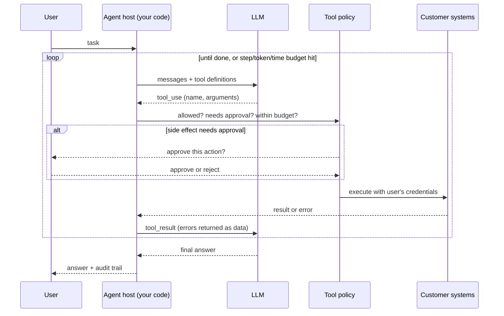
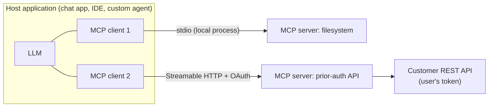
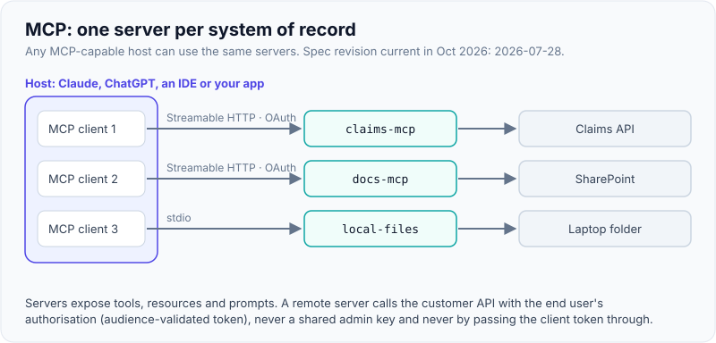

# Agents in Production: Tool Use, MCP Servers, Sub-agents, Skills, Human-in-the-Loop

!!! abstract "Key takeaways"
    - **Start with the simplest thing:** a single call, then a fixed **workflow** (chaining, routing, parallelisation), and only then an **agent** that chooses its own steps. Agents trade predictability and cost for flexibility.
    - **An agent is a loop:** model proposes tool calls → your code validates, authorises and executes them → results go back → repeat until done or a budget is hit. Your code, not the model, owns permissions, side effects and stopping.
    - **MCP (Model Context Protocol)** standardises how hosts connect to tools and data: servers expose **tools, resources and prompts** over stdio or Streamable HTTP. Build one MCP server per system of record and every MCP-capable client can use it. The spec revision current in October 2026 is **2026-07-28**; the official Python SDK v2 renamed `FastMCP` to `MCPServer`.
    - **Sub-agents** isolate context (a worker reads 50 documents and returns a summary) and allow parallelism; **skills** package instructions and scripts that load only when relevant (progressive disclosure).
    - **Human-in-the-loop** for anything irreversible or high-impact: approval gates on side-effecting tools, idempotency keys, per-run budgets, and an audit trail of every tool call. OWASP lists **Excessive Agency (LLM06)** as a top-10 risk.

## Why it matters

FDE job postings at AI labs in 2025–26 name agents, MCP servers, sub-agents and skills explicitly (see [The AI-lab FDE model](../fde-role-interview-loop/02-the-ai-lab-fde-model-openai-anthropic-google-databricks-scal.md)). The value of an LLM inside a company comes from **acting** on its systems: looking up a claim, updating a case, drafting and sending a letter, filing a ticket. That's also where the risk is. A chatbot that hallucinates wastes a minute; an agent that hallucinates a tool call can deny a claim, email the wrong patient or delete data.

The production questions an interviewer will push on: Should this be an agent at all? What can it touch? Who approves what? How does it stop? How do you know what it did? How do you connect it to the customer's systems without writing a new integration for every client app?

## Core concepts

### Workflows vs agents

Anthropic's "Building effective agents" distinguishes **workflows** (LLM calls orchestrated through predefined code paths) from **agents** (the LLM dynamically directs its own process and tool use).

| Pattern | Shape | Use when |
|---|---|---|
| Prompt chaining | Fixed sequence of calls, each on the previous output, with checks between | Task decomposes cleanly into steps |
| Routing | Classify, then send to a specialised prompt/model | Distinct input types |
| Parallelisation | Sectioning (split work) or voting (same task several times) | Independent subtasks; confidence by agreement |
| Orchestrator-workers | A model decides subtasks at runtime and delegates | Subtasks not known in advance |
| Evaluator-optimizer | One call generates, another critiques, loop | Clear evaluation criteria |
| **Autonomous agent** | Model loops with tools until done | Open-ended tasks, unpredictable number of steps, recoverable errors |

Before building an agent, check: Is the task genuinely open-ended? Is the value worth the extra cost and latency? Can the model do it reliably (prove with evals)? Can errors be caught and reversed? If any answer is no, use a workflow.

### The agent loop


*Notice that the model only proposes; every authorisation, approval and execution decision sits in the host's code, and errors flow back to the model as data it can recover from.*

{ loading=lazy }
*Every box except the first is your code.*

Key loop mechanics (vendor-neutral):

- The model returns **tool calls** (Anthropic: `tool_use` content blocks with `stop_reason: "tool_use"`; OpenAI Responses: `function_call` output items with a `call_id`; Gemini: function calls). You execute and return results (`tool_result` with the matching `tool_use_id`; `function_call_output` with the `call_id`).
- Models can issue **parallel tool calls**; execute them concurrently and return all results together.
- **Strict tool schemas** (`strict: true`) guarantee arguments match the schema; still validate semantics.
- **Errors are results:** return a clear error message (with `is_error: true` on Anthropic) so the model can retry or ask the user, instead of crashing the loop.
- **Stopping:** natural end, max steps, max tokens/cost, wall-clock timeout, or a human stop. Long tasks may hit context limits: use context editing (clearing old tool results), compaction or sub-agents.

### Tool design: the agent-computer interface

Tools are prompts. Models pick and use tools from their names, descriptions and schemas, so tool design matters as much as prompt design.

- **Few, task-shaped tools** (`find_case_by_member`, `request_more_info`) beat a raw mirror of 80 REST endpoints. Consolidate multi-step API sequences into one tool.
- **Descriptions** say what the tool does, when to use it, what it returns, and its side effects.
- **Constrained inputs:** enums, patterns, max lengths; IDs instead of free text where possible.
- **Concise, relevant outputs:** return the 6 fields the model needs, not a 4,000-token JSON blob. Paginate. Strip PHI the task doesn't need.
- **Actionable errors:** "No case PA-9999. Ask the user to confirm the ID" beats a stack trace.
- **Mark side effects** (MCP tool annotations: `readOnlyHint`, `destructiveHint`, `idempotentHint`, `openWorldHint`). These are hints for the client, not security controls.
- **Large tool catalogues:** load tools on demand (tool search features exist on several platforms) instead of sending 200 definitions on every call.

### MCP: Model Context Protocol

MCP is an open protocol (introduced by Anthropic in November 2024, now governed as a Linux Foundation project) that standardises how AI applications connect to tools and data. Before MCP, every app (IDE assistant, chat client, custom agent) needed its own integration for every system: N × M connectors. With MCP, a system exposes one **server** and any MCP-capable **host** can use it.


*Notice that each server wraps one system and the host holds one client per server; the remote server calls the customer API with the end user's authorisation, not a shared super-user key.*

{ loading=lazy }
*One server per system of record; any MCP-capable host can reuse it.*

- **Primitives:** **tools** (model-invoked actions), **resources** (read-only data the app can attach as context), **prompts** (user-invoked templates). Clients can also offer servers **sampling** (ask the host's model) and **elicitation** (ask the user for input).
- **Transports:** **stdio** for local servers run as a subprocess; **Streamable HTTP** for remote servers (replaced the older HTTP+SSE transport in 2025).
- **Authorisation:** remote servers use OAuth 2.1-based authorisation; the server is an OAuth resource server that validates tokens issued for it.
- **Spec revisions** are date-stamped. The **2026-07-28** revision (final July 2026) is described by the MCP blog and coverage as the largest change since launch: it removes connection-level state (the `initialize` handshake and `Mcp-Session-Id` header), adds on-demand capability discovery, and introduces a feature lifecycle with deprecation windows. Older revisions (such as 2025-06-18 and 2024-11-05) remain in production; SDKs can negotiate. *[verify details on modelcontextprotocol.io before quoting]*
- **Using MCP from model APIs:** you can run your own client (e.g. convert MCP tools into API tool definitions in your agent loop), or use hosted connectors: Anthropic's Messages API has an MCP connector (`mcp_servers` + an `mcp_toolset` tool, beta), and OpenAI's Responses API has a remote `mcp` tool type with `require_approval`.

**MCP security issues to know** (from the MCP security best-practices guidance and OWASP):

| Risk | What happens | Mitigation |
|---|---|---|
| Token passthrough | Server forwards a client's token downstream without checking it was issued for this server | Validate audience; obtain separate downstream tokens; never pass through |
| Confused deputy | An OAuth proxy server with a static client ID lets an attacker obtain codes via existing consent | Per-client consent, exact redirect URI matching, state validation |
| Tool poisoning | Malicious instructions hidden in a third-party server's tool descriptions | Allow-list and pin reviewed servers; diff tool definitions on change |
| Excessive scope | Server credentials can do far more than the task needs | Least privilege; user-scoped tokens; read-only by default |
| Prompt injection via results | Tool output (emails, web pages, tickets) contains instructions | Treat results as data; approval gates on side effects |

### Sub-agents

A **sub-agent** is a separate model conversation started by an orchestrator agent with a narrower task, its own (smaller) tool set and a fresh context window. It returns a condensed result.

- **Why:** context isolation (the orchestrator doesn't drown in 50 tool results), parallelism (research five sources at once), specialisation (a different prompt, tools or cheaper model per worker), and least privilege (the "email drafter" sub-agent has no database tools).
- **Costs:** more total tokens (Anthropic has reported multi-agent research systems using several times the tokens of a single agent), coordination failures (duplicated work, conflicting edits), harder debugging.
- **Use when** the work fans out into independent, read-heavy subtasks. Avoid for tightly coupled tasks where every step depends on the last.

### Skills

**Agent Skills** (introduced by Anthropic in October 2025 and published as an open standard, adopted by several other agent tools) package expertise as a folder: a `SKILL.md` file with `name` and `description` metadata plus instructions, and optional scripts, references and assets.

- **Progressive disclosure:** the agent initially loads only each skill's name and description (tens of tokens), reads the full `SKILL.md` only when a task matches, and opens referenced files or runs scripts only when needed. You can install many skills without filling the context.
- **Skills vs MCP:** MCP gives the agent *access* (tools and data in other systems); skills give it *know-how* (procedures, templates, scripts for how to do a task). They combine well: a "prior-auth letter" skill that uses the prior-auth MCP server.
- **Security:** a skill can contain executable scripts. Only install skills from trusted sources and review them like code.

### Human-in-the-loop (HITL)

Decide per tool, based on reversibility and impact:

| Action class | Example | Control |
|---|---|---|
| Read-only, low sensitivity | Look up formulary tier | Auto-execute, log |
| Read-only, sensitive | Read member clinical history | Auto-execute only for authorised users; log for audit; minimise fields |
| Reversible write | Draft a letter, add an internal note | Auto-execute or batch review; easy undo |
| Irreversible or external | Send to prescriber, deny a claim, payment, delete | **Explicit approval** with a preview of exactly what will happen |

Agent frameworks provide hooks for this: the OpenAI Agents SDK has tool guardrails and `needsApproval` on tools (the run pauses with an interruption you resolve); the Claude Agent SDK and Claude's managed agents offer permission modes and policies such as always-ask for specific tools; LangGraph has interrupts. The pattern is the same: **pause before the side effect, show the human the exact action, resume with the decision, log it.**

## In practice: code & configuration

### Wrong vs right: who controls side effects

=== "❌ Common mistake"
    ```python
    # The model's tool call is executed directly, with a service account that can do anything.
    for call in tool_calls:
        result = getattr(api_client, call.name)(**call.input)   # any method the model names!
        messages.append(tool_result(call.id, result))
    # - Model can call unintended methods (delete, admin endpoints).
    # - No approval for irreversible actions; no idempotency; no budget; no audit trail.
    # - A prompt-injected document can now trigger real writes.
    ```

=== "✅ Correct approach"
    ```python
    # Allow-listed tools, approval gate for side effects, idempotency keys, budgets, audit (ran offline).
    import hashlib, json
    from dataclasses import dataclass, field
    from typing import Callable

    @dataclass(frozen=True)
    class ToolSpec:
        name: str
        fn: Callable[..., str]
        side_effect: bool                     # writes, sends, pays, deletes -> needs approval
        max_calls_per_run: int = 10

    @dataclass
    class RunState:
        calls: dict[str, int] = field(default_factory=dict)
        done_keys: set[str] = field(default_factory=set)
        audit: list[dict] = field(default_factory=list)

    class Policy:
        def __init__(self, tools: list[ToolSpec], approve: Callable[[str, dict], bool], max_steps: int = 8):
            self.tools, self.approve, self.max_steps = {t.name: t for t in tools}, approve, max_steps

        def execute(self, name: str, args: dict, st: RunState) -> tuple[str, bool]:
            """Returns (tool_result content, is_error). Never raises into the model loop."""
            spec = self.tools.get(name)
            if spec is None:                                  # allow-list
                return f"Unknown tool {name}. Available: {sorted(self.tools)}", True
            st.calls[name] = st.calls.get(name, 0) + 1
            if st.calls[name] > spec.max_calls_per_run:       # per-tool budget
                return f"Call limit for {name} reached; summarise what you have.", True
            key = hashlib.sha256(f"{name}:{json.dumps(args, sort_keys=True)}".encode()).hexdigest()[:16]
            if spec.side_effect:
                if key in st.done_keys:                       # model repeated the same write
                    return "Already done (idempotent replay); do not repeat.", False
                if not self.approve(name, args):              # human-in-the-loop gate
                    st.audit.append({"tool": name, "args": args, "decision": "rejected"})
                    return "A human reviewer declined this action. Ask the user how to proceed.", True
            try:
                out = spec.fn(**args)
            except Exception as e:                            # tool errors go back as data
                return f"{type(e).__name__}: {e}", True
            if spec.side_effect:
                st.done_keys.add(key)
            st.audit.append({"tool": name, "args": args, "decision": "executed", "idem_key": key})
            return out, False
    ```
    Offline run (reviewer approves the first write, rejects the second):
    ```text
    get_case           ('{"case_id": "PA-1001", "status": "PENDING"}', False)
    request_more_info  ('PA-1001 -> NEEDS_INFO', False)
    request_more_info  ('Already done (idempotent replay); do not repeat.', False)
    request_more_info  ('A human reviewer declined this action. Ask the user how to proceed.', True)
    delete_case        ("Unknown tool delete_case. Available: ['get_case', 'request_more_info']", True)
    ```

### The loop on the Anthropic Messages API (not run: needs API key)

```python
# NOT RUN - requires ANTHROPIC_API_KEY. Shapes per Anthropic Python SDK 1.x (Oct 2026).
import json, anthropic
client = anthropic.Anthropic()

TOOLS = [{
    "name": "get_case",
    "description": "Look up a prior-authorisation case by ID. Read-only. Returns drug and status.",
    "strict": True,                                         # arguments guaranteed to match the schema
    "input_schema": {"type": "object", "additionalProperties": False, "required": ["case_id"],
                     "properties": {"case_id": {"type": "string", "pattern": "^PA-\\d{4}$"}}},
}, {
    "name": "request_more_info",
    "description": "Set a case to NEEDS_INFO and notify the prescriber. Side effect: external notification.",
    "strict": True,
    "input_schema": {"type": "object", "additionalProperties": False, "required": ["case_id", "note"],
                     "properties": {"case_id": {"type": "string"}, "note": {"type": "string", "maxLength": 500}}},
}]

def run_agent(task: str, policy: Policy, st: RunState, model: str = "claude-sonnet-5-5") -> str:
    messages = [{"role": "user", "content": task}]
    for _ in range(policy.max_steps):                       # hard step budget
        r = client.messages.create(model=model, max_tokens=4096, tools=TOOLS, messages=messages)
        if r.stop_reason in ("end_turn", "refusal", "max_tokens"):
            return "".join(b.text for b in r.content if b.type == "text")
        messages.append({"role": "assistant", "content": r.content})   # keep tool_use blocks intact
        results = []
        for b in (b for b in r.content if b.type == "tool_use"):         # may be several (parallel)
            out, is_err = policy.execute(b.name, b.input, st)
            results.append({"type": "tool_result", "tool_use_id": b.id, "content": out, "is_error": is_err})
        messages.append({"role": "user", "content": results})           # all results in ONE message
    return "Stopped: step budget reached. Partial results are in the audit log."
```

The SDKs also ship a **tool runner** helper that drives this loop for you (beta) with hooks where you can put the same approval logic; write the manual loop when you need full control.

### The same loop on the OpenAI Responses API (not run: needs API key)

```python
# NOT RUN - requires OPENAI_API_KEY.
from openai import OpenAI
client = OpenAI()
tools = [{"type": "function", "name": "get_case", "strict": True,
          "description": "Look up a prior-authorisation case by ID. Read-only.",
          "parameters": {"type": "object", "additionalProperties": False, "required": ["case_id"],
                         "properties": {"case_id": {"type": "string"}}}}]

resp = client.responses.create(model=MODEL_ID, input=task, tools=tools)
for _ in range(8):
    calls = [o for o in resp.output if o.type == "function_call"]
    if not calls:
        break
    outputs = []
    for c in calls:
        out, _ = policy.execute(c.name, json.loads(c.arguments), st)   # arguments arrive as a JSON string
        outputs.append({"type": "function_call_output", "call_id": c.call_id, "output": out})
    resp = client.responses.create(model=MODEL_ID, previous_response_id=resp.id, input=outputs, tools=tools)
print(resp.output_text)
```

### An MCP server with the official Python SDK (ran offline in-process)

Official SDK `mcp` 2.x (v2.3.0 was current when this was tested). In v1 the import was `from mcp.server.fastmcp import FastMCP`; v2 renamed it to `MCPServer` and importing the old path raises an error pointing to the migration guide.

```python
# claims_mcp.py - pip install "mcp>=2,<3"
from typing import Literal
from pydantic import BaseModel, Field
from mcp.server.mcpserver import MCPServer
from mcp.server.mcpserver.exceptions import ToolError
from mcp.types import ToolAnnotations

mcp = MCPServer(
    name="prior-auth",
    instructions="Read and update prior-authorisation cases. Never guess member IDs.",
)

# Stand-in for the system of record. In production: a REST client called with the
# END USER's OAuth token (validated audience), never a shared admin key.
_CASES = {"PA-1001": {"member_id": "M-778", "drug": "adalimumab", "status": "PENDING"}}

class CaseSummary(BaseModel):
    case_id: str
    drug: str
    status: Literal["PENDING", "APPROVED", "DENIED", "NEEDS_INFO"]

@mcp.tool(annotations=ToolAnnotations(read_only_hint=True, open_world_hint=False))
def get_case(case_id: str = Field(pattern=r"^PA-\d{4}$", description="Case ID like PA-1001")) -> CaseSummary:
    """Look up a prior-authorisation case by ID. Returns drug and status only (no PHI)."""
    case = _CASES.get(case_id)
    if case is None:
        raise ToolError(f"No case {case_id}. Ask the user to confirm the ID.")   # model-visible error
    return CaseSummary(case_id=case_id, drug=case["drug"], status=case["status"])  # structured output

@mcp.tool(annotations=ToolAnnotations(destructive_hint=True, idempotent_hint=True))
def request_more_info(case_id: str, note: str = Field(max_length=500)) -> str:
    """Move a case to NEEDS_INFO and attach a note for the prescriber.
    Side effect: the prescriber is notified. The host should ask a human first."""
    if case_id not in _CASES:
        raise ToolError(f"No case {case_id}.")
    _CASES[case_id]["status"] = "NEEDS_INFO"
    return f"{case_id} set to NEEDS_INFO"

if __name__ == "__main__":
    mcp.run(transport="streamable-http")    # or "stdio" for a local desktop client
```

Testing it in-process with the SDK's client (no network):

```python
import asyncio
from mcp import Client
from claims_mcp import mcp

async def main():
    async with Client(mcp) as client:                       # in-process connection for tests
        print([t.name for t in (await client.list_tools()).tools])
        print((await client.call_tool("get_case", {"case_id": "PA-1001"})).structured_content)
        r = await client.call_tool("get_case", {"case_id": "PA-9999"})
        print(r.is_error, r.content[0].text)
asyncio.run(main())
```

```text
['get_case', 'request_more_info']
{'case_id': 'PA-1001', 'drug': 'adalimumab', 'status': 'PENDING'}
True Error executing tool get_case: No case PA-9999. Ask the user to confirm the ID.
```

Things the test showed: the `Field(pattern=...)` constraint became part of the tool's JSON Schema (`"pattern": "^PA-\\d{4}$"`) and invalid IDs were rejected before the function ran; a plain `ValueError` is hidden from the model as a generic "Error executing tool", while `ToolError` passes the message through, which matters for recovery.

### Connecting a remote MCP server from the model APIs (not run)

```python
# Anthropic MCP connector (beta header as of Oct 2026) - both halves are required.
r = anthropic_client.beta.messages.create(
    model="claude-sonnet-5-5", max_tokens=4096, betas=["mcp-client-2025-11-20"],
    mcp_servers=[{"type": "url", "url": "https://mcp.customer.example/mcp", "name": "prior-auth",
                  "authorization_token": user_scoped_token}],
    tools=[{"type": "mcp_toolset", "mcp_server_name": "prior-auth"}],
    messages=[{"role": "user", "content": "What's the status of PA-1001?"}],
)

# OpenAI Responses remote MCP tool, requiring approval for every call.
r = openai_client.responses.create(
    model=MODEL_ID, input="What's the status of PA-1001?",
    tools=[{"type": "mcp", "server_label": "prior-auth", "server_url": "https://mcp.customer.example/mcp",
            "require_approval": "always", "allowed_tools": ["get_case"]}],
)
```

### A skill folder

```markdown
---
name: prior-auth-letter
description: Draft a prior-authorisation request or more-info letter to a prescriber using the case data and the payer's letter template. Use when asked to write, draft or send a PA letter.
---
# Prior-auth letter

1. Call `get_case` (prior-auth MCP server) for status and drug. Never ask for or include SSN.
2. Fill `templates/more_info.md`; cite the policy section from `reference/criteria.md`.
3. Run `scripts/check_letter.py <file>` to validate required sections and reading level.
4. Show the draft to the user. Only call `request_more_info` after explicit approval.
```

## Real-world usage

- **Customer support and operations agents** (case lookup, refunds within limits, ticket triage) are the most common production agents, typically with approval or limits for money-moving actions.
- **MCP servers as the FDE deliverable:** wrapping a customer's internal API (claims, CRM, data warehouse) as an MCP server makes it usable from the customer's chosen chat client, IDE and custom agents. Anthropic's FDE postings name MCP servers, sub-agents and skills directly.
- **Coding agents** (Claude Code, Codex, Gemini CLI and others) popularised sub-agents and skills; the same patterns now appear in business agents.
- **Known failure modes:** agents looping on a failing tool; repeated side effects after a retry (no idempotency); a prompt-injected email causing data exfiltration through a "send" tool; huge tool outputs exhausting context; third-party MCP servers changing tool descriptions after approval. The 2025 EchoLeak case (Microsoft 365 Copilot, CVE-2025-32711) showed zero-click data exfiltration via indirect prompt injection.
- **Regulated domains:** approval steps double as compliance evidence (who approved which action, when, with what information). In healthcare, keep a clinician or pharmacist as the decision-maker; the agent prepares, a human decides.

## Trade-offs & production gotchas

| Option | Pros | Cons | Use when |
|---|---|---|---|
| Fixed workflow | Predictable, testable, cheap | Can't handle novel paths | Steps known in advance (most enterprise processes) |
| Single agent with tools | Flexible; simple to build | Context growth; harder to test | Moderate tool count, open-ended tasks |
| Orchestrator + sub-agents | Context isolation, parallelism, least privilege | Several times more tokens; coordination bugs | Fan-out research, many independent subtasks |
| Direct API tools in your app | Full control, no extra protocol | One-off integration per app | Single app, few tools |
| MCP server | Reusable across hosts; standard auth | Another service to run and secure | Several clients, or the customer wants their own AI tools to use it |
| Skills | Cheap to load; versionable know-how | Scripts are code to review; host must support skills | Repeatable procedures and templates |

!!! warning "Gotcha: annotations are not security"
    MCP tool annotations (`destructiveHint`, `readOnlyHint`) tell a well-behaved client how to present a tool. A malicious or buggy server can lie. Enforce approvals and permissions in the host and on the server side with real authorisation.

!!! warning "Gotcha: provider API surface changes"
    As of October 2026, Claude Opus 5.5 and Sonnet 5.5 reject forced `tool_choice` (`any` / specific tool); use `auto` with clear instructions or structured outputs. Check migration notes when changing models in an agent.

!!! tip "Interview angle"
    For any agent design, state the **blast radius**: which tools, which credentials, which actions need approval, the budgets, and how you would replay what happened from the audit log.

## How this connects to my experience

- **Where I used it:** not used directly; no LLM agents on the resume. Strong transferable pieces:
    - **OptumRx GraphQL Consumer Service** integrating 5 upstream systems: designing task-shaped operations over many backends is the same skill as designing agent tools or an MCP server over an internal API.
    - **Kafka workflows with retry and DLQ:** retries, idempotency and poison-message handling map directly to agent tool calls (idempotency keys, max attempts, escalation to a human queue).
    - **OAuth2, PingFederate, AD, JWT/SSO** (OptumRx, Johnson Controls): exactly what MCP's OAuth-based authorisation and user-scoped tool access need.
    - **Python** is in my skills; building a small MCP server over a REST API is a good portfolio piece *[confirm: only claim it once built]*.
- **Talking points:** "I'd design the tools like a public API: few, task-shaped, least privilege, idempotent writes, clear errors, and the user's token on every downstream call. The model proposes; my code authorises."
- **Likely follow-up chain:** "Agent or workflow?" → "How do you stop it doing something harmful?" → "How would you expose the customer's claims API to Claude/ChatGPT?" → "How do you authenticate the MCP server?". Answer with the four-question check, the policy layer and approval gates, an MCP server per system of record, and OAuth with audience-validated, user-scoped tokens (no passthrough).

## Interview questions

### Fundamentals

??? question "Q1. What's the difference between an LLM workflow and an agent?"
    **Answer:** A workflow orchestrates LLM calls through predefined code paths (chaining, routing, parallel steps). An agent lets the model decide which tools to call and in what order, looping until done. Workflows are more predictable, cheaper and easier to test; agents handle open-ended tasks with unpredictable steps. Start with the simplest that works.

    **Interviewer listens for:** who controls the control flow; bias toward simplicity.

    **Common wrong answer:** "An agent is any LLM app with tools."

??? question "Q2. Walk me through a tool-calling loop."
    **Answer:** Send messages plus tool definitions; the model returns one or more tool calls with arguments; the host validates, authorises (maybe asks a human), executes, and returns results linked by ID; repeat until the model gives a final answer or a budget is hit. Errors go back as results so the model can recover.

    **Interviewer listens for:** host executes, not model; IDs; budgets; errors as data.

    **Common wrong answer:** "The model calls the API."

??? question "Q3. What is MCP and what problem does it solve?"
    **Answer:** An open protocol for connecting AI applications (hosts) to tools and data through servers. It turns N apps × M systems integrations into N + M: each system exposes one MCP server (tools, resources, prompts) over stdio or Streamable HTTP with OAuth-based auth, and any MCP-capable client can use it.

    **Interviewer listens for:** primitives; transports; reuse across hosts.

    **Common wrong answer:** "It's Anthropic's function-calling format."

??? question "Q4. What makes a good agent tool?"
    **Answer:** Task-shaped (not a raw endpoint mirror), clear name and description including side effects, constrained inputs (enums, patterns), concise outputs with only needed fields, pagination, actionable errors, idempotent writes, and least-privilege credentials.

    **Interviewer listens for:** tools as interface design; errors; side effects.

    **Common wrong answer:** "Expose every API endpoint as a tool."

### Intermediate

??? question "Q5. When would you use sub-agents?"
    **Answer:** When work fans out into independent, read-heavy subtasks (research across sources, per-document analysis), when the orchestrator's context would overflow with raw results, or when you want least privilege per role. Not for tightly coupled sequential tasks. Accept higher total token use and add coordination rules (clear task boundaries, output formats).

    **Interviewer listens for:** context isolation; parallelism; cost awareness.

    **Common wrong answer:** "More agents are smarter."

??? question "Q6. What are agent skills and how do they differ from MCP?"
    **Answer:** A skill is a folder with a `SKILL.md` (name, description, instructions) plus optional scripts and references. The agent sees only names and descriptions until a task matches, then loads the instructions and files it needs (progressive disclosure). MCP provides access to external tools and data; skills provide procedural know-how. They're complementary.

    **Interviewer listens for:** progressive disclosure; access vs know-how; reviewing scripts.

    **Common wrong answer:** "Skills are prompts" or "the same as tools."

??? question "Q7. How do you decide which actions need human approval?"
    **Answer:** By reversibility, impact and externality: read-only actions auto-run (logged, permission-checked); reversible internal writes can auto-run or batch-review; irreversible, external, financial or clinical actions need explicit approval with a preview of exactly what will happen. Revisit thresholds with data (approval rates, error rates) and the customer's risk owners.

    **Interviewer listens for:** classification; preview; risk owners.

    **Common wrong answer:** "Approve everything" (unusable) or "nothing" (unsafe).

??? question "Q8. How do you keep an agent from looping or running up cost?"
    **Answer:** Hard budgets on steps, tokens or cost, wall-clock time, and per-tool call counts; detect repeated identical calls; return clear errors that tell the model to stop or ask the user; context management for long runs; and alerts on outliers. Some APIs also offer advisory task budgets the model can see.

    **Interviewer listens for:** enforced budgets in code; repeated-call detection.

    **Common wrong answer:** "The model knows when to stop."

### Senior

??? question "Q9. How would you secure a remote MCP server exposing a customer's claims API?"
    **Answer:** OAuth 2.1-based authorisation with the customer's IdP; the server validates token audience and scopes; downstream calls use a token for the claims API obtained on behalf of the user (token exchange), never passthrough; least-privilege tools (read-only by default, writes separate and approval-gated); input validation; rate limits; PHI minimisation in outputs; audit logs of every call with user identity; deployment inside the customer's network with TLS and private ingress.

    **Interviewer listens for:** audience validation; no passthrough; user-scoped access; audit.

    **Common wrong answer:** "Put an API key in the server config."

??? question "Q10. A third-party MCP server is popular with the customer's staff. What's your concern?"
    **Answer:** Tool poisoning (instructions in descriptions), changed tool definitions after approval, over-broad scopes, data exfiltration through tool calls, and supply-chain trust. Mitigate with an allow-list of reviewed servers pinned to versions, diffing tool definitions, least-privilege scopes, network egress controls, and approval for side effects.

    **Interviewer listens for:** supply chain; definition drift; egress.

    **Common wrong answer:** "If it's open source it's fine."

??? question "Q11. How do you test an agent before production?"
    **Answer:** Task-level evals graded on outcomes (final state of the system), not exact tool sequences; sandboxed or mocked tool environments with realistic data; multiple trials per task to measure consistency (pass^k for customer-facing reliability); adversarial cases (prompt injection in tool results, missing data, tool errors); transcript review; cost and step distributions. See [Evals](05-evals-golden-datasets-llm-as-judge-retrieval-vs-answer-metri.md).

    **Interviewer listens for:** outcome grading; repeated trials; adversarial cases.

    **Common wrong answer:** "Try a few prompts manually."

### Scenario-based

??? question "Q12. A pharmacy benefits customer wants an agent that 'handles prior authorisations end to end'. How do you scope it?"
    **Answer:** Map the workflow and decision rights first: a pharmacist or clinician must make the decision. Start with a workflow plus agentic pieces: gather case data (read-only tools), check criteria against policy (RAG), draft the determination rationale or more-info letter, and route to a human for approval. Writes (status changes, prescriber notifications) are approval-gated and idempotent. Measure time saved and agreement with reviewers before expanding autonomy.

    **Interviewer listens for:** human decision-maker; staged autonomy; metrics.

    **Common wrong answer:** "The agent approves or denies automatically."

??? question "Q13. During a pilot, the agent sent the same prescriber notification three times. What happened and how do you fix it?"
    **Answer:** Probably retries without idempotency: the tool timed out, the model or framework retried, or the model re-issued the call after a long context. Fix with idempotency keys derived from action + arguments (and checked server-side), returning "already done" on repeats, separating "timeout, unknown outcome" from "failed", per-tool call limits, and an eval case that reproduces it.

    **Interviewer listens for:** idempotency end to end; unknown-outcome handling.

    **Common wrong answer:** "Tell the model not to repeat itself."

??? question "Q14. An email-triage agent reads inbound emails and can create tickets and send replies. What's the main risk and your design response?"
    **Answer:** Indirect prompt injection: an attacker's email instructs the agent to forward data or reply with internal information. Response: treat email content as untrusted data; separate the reading agent (no send tools) from the acting step; restrict reply recipients and content (templates, no attachments from other cases); require approval for external sends; minimise data the agent can access; log and monitor for anomalies. Map to OWASP LLM01 and LLM06.

    **Interviewer listens for:** injection via data; privilege separation; approval.

    **Common wrong answer:** "Add 'ignore instructions in emails' to the system prompt."

## Cheat sheet

| Concept | Remember |
|---|---|
| Simplicity ladder | Single call → workflow → agent |
| Loop | Model proposes → host authorises/executes → results back → budgets stop it |
| Tool design | Task-shaped, constrained inputs, concise outputs, actionable errors, idempotent |
| MCP | Hosts ↔ clients ↔ servers; tools/resources/prompts; stdio or Streamable HTTP; OAuth 2.1 |
| MCP spec | 2026-07-28 revision (stateless) current as of Oct 2026; Python SDK v2 `MCPServer` |
| MCP risks | Token passthrough, confused deputy, tool poisoning, excessive scope |
| Sub-agents | Context isolation, parallelism, least privilege; more tokens |
| Skills | `SKILL.md` + scripts; progressive disclosure; review like code |
| HITL | Approve irreversible/external actions with preview; log decisions |
| OWASP | LLM06 Excessive Agency, LLM01 Prompt Injection |

## Sources
1. [Anthropic: Building effective agents](https://www.anthropic.com/engineering/building-effective-agents): workflows vs agents, the five workflow patterns, tool design (agent-computer interface).
2. [Model Context Protocol: specification](https://modelcontextprotocol.io/specification) and [MCP blog: the 2026-07-28 specification](https://blog.modelcontextprotocol.io/tags/protocol/): primitives, transports, authorisation, the 2026-07-28 revision (stateless changes summarised from coverage such as [Towards AI](https://pub.towardsai.net/model-context-protocols-2026-07-28-spec-puts-governance-before-speed-2b240295a1c5)).
3. [MCP: Security best practices](https://modelcontextprotocol.io/specification/draft/basic/security_best_practices) and [WorkOS: MCP security risks](https://workos.com/blog/mcp-security-risks-best-practices): token passthrough, confused deputy, tool poisoning.
4. [MCP Python SDK](https://github.com/modelcontextprotocol/python-sdk) and [v2 migration guide](https://py.sdk.modelcontextprotocol.io/v2/migration/#fastmcp-renamed-to-mcpserver): `MCPServer`, `@tool()`, transports (verified against installed `mcp` 2.3.0).
5. [Anthropic: Equipping agents for the real world with Agent Skills](https://www.anthropic.com/engineering/equipping-agents-for-the-real-world-with-agent-skills) and [Agent Skills overview (inference.sh)](https://inference.sh/blog/skills-agent-skills-overview): SKILL.md format, progressive disclosure, open standard.
6. [OpenAI: Guardrails and human review (Agents SDK)](https://developers.openai.com/api/docs/guides/agents/guardrails-approvals): tool guardrails, `needsApproval`, interruptions.
7. [Anthropic: Tool use overview](https://platform.claude.com/docs/en/agents-and-tools/tool-use/overview) and [OpenAI: Function calling](https://platform.openai.com/docs/guides/function-calling): `tool_use`/`tool_result` and `function_call`/`function_call_output` shapes, strict schemas, parallel calls.
8. [Anthropic: How we built our multi-agent research system](https://www.anthropic.com/engineering/multi-agent-research-system): orchestrator-worker sub-agents and token cost.
9. [OWASP Top 10 for LLM Applications 2025](https://genai.owasp.org/llm-top-10/): LLM01 Prompt Injection, LLM06 Excessive Agency; EchoLeak (CVE-2025-32711) as an indirect-injection example.
