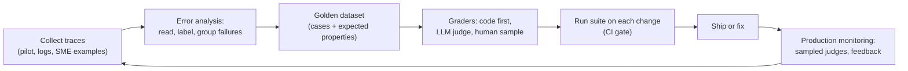
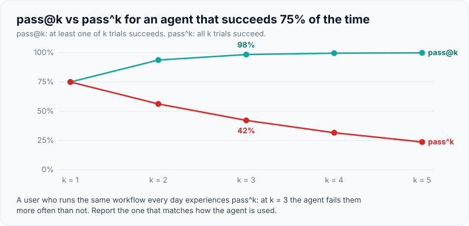
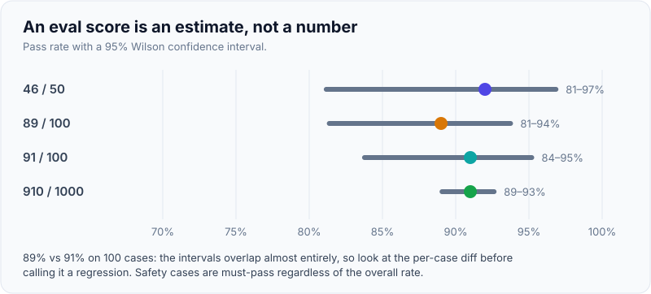

# Evals: Golden Datasets, LLM-as-Judge, Retrieval vs Answer Metrics, Regression Tests in CI

!!! abstract "Key takeaways"
    - **Evals are the unit tests and acceptance criteria of LLM systems.** Without them you can't tell whether a prompt change, model upgrade or new retriever helped, and the customer can't sign off production.
    - **Start with error analysis, not metrics:** read 50–100 real traces, label what went wrong, group failure modes, then build a check for each important mode. Generic scores ("helpfulness 4.2/5") rarely drive decisions.
    - **Grader order:** code-based checks first (schema, exact match, regex, execution), then **LLM-as-judge** for criteria needing interpretation (binary pass/fail, one criterion per judge, validated against human labels using TPR/TNR), then humans for calibration and high-stakes samples.
    - **Measure retrieval and generation separately:** recall@k / MRR / nDCG for retrieval; faithfulness (groundedness), answer relevancy and correctness for answers (RAGAS names: context precision, context recall, faithfulness, answer relevancy). For agents, grade the **final outcome** and run several trials (pass@k vs pass^k).
    - **Gate in CI:** run the suite on every prompt, model, retrieval or code change; fail on threshold breaches, regressions versus baseline, and *any* safety-case failure. Report confidence intervals: 46/50 is anywhere from about 81% to 97%.

## Why it matters

LLM output is non-deterministic and open-ended, so the usual "assert equals" tests don't cover it, and a demo that looks great on five hand-picked questions says little about the next 10,000. FDE interviewers ask about evals in almost every AI system design round because evals are what turn a pilot into a production decision:

- **For the customer:** "How do we know it's accurate enough?" needs a number on their data, with a method they understand.
- **For engineering:** every change (prompt edit, chunk size, new model, new tool) needs a fast, repeatable signal.
- **For operations:** production monitoring needs the same definitions of "good" as pre-launch testing.

Anthropic's and OpenAI's guides both put evals at the centre of the development loop, and practitioners such as Hamel Husain argue that most teams' biggest gap is not having looked at their data. This page builds on the success criteria from [Writing the scope brief](../fde-customer-discovery/02-writing-the-scope-brief-success-criteria-assumptions-out-of.md).

## Core concepts

### Kinds of evals

| Kind | Question it answers | When |
|---|---|---|
| **Capability eval** | Can the system do this task at all, and how well? | Exploring designs, choosing models |
| **Regression eval** | Did this change break what used to work? | Every change, in CI |
| **Safety / policy eval** | Does it refuse, redact and stay in scope? | Every change; zero tolerance |
| **Offline eval** | Score on a fixed dataset | Before release |
| **Online eval** | Score on live traffic (sampled judges, user feedback, A/B, business KPIs) | After release, continuously |

### The eval loop


*Notice that production traces feed back into the dataset: every escaped bug becomes a new test case, so the suite keeps up with real traffic.*

### Error analysis first

The most effective first step is boring: export 50–100 real or realistic traces (input, retrieved context, tool calls, output), read them, and write a short note on each failure ("cited the 2024 policy instead of 2025", "invented a step-therapy requirement", "answered a question outside pharmacy scope"). Group the notes into failure modes and count them. Now you know what to measure, and many modes turn out to be checkable with code (wrong year → metadata check; missing citation → regex).

Domain experts must be involved: a pharmacist knows that a plausible answer is wrong. In customer work, schedule SME labelling sessions as part of the pilot plan.

### Golden datasets

A golden dataset is a versioned set of test cases with expected properties. For each case store: the input (and conversation history if relevant), any needed state (user role, permissions, tenant), **expected properties** (gold answer or key facts, relevant document IDs, required refusal, expected tool outcome), tags (topic, difficulty, risk), and provenance.

Sourcing, in order of value:

1. **Real traffic** from the pilot or existing channels (call transcripts, tickets, emails), de-identified.
2. **SME-written cases**, especially edge cases and "should refuse" cases.
3. **Adversarial cases:** prompt injection, out-of-scope questions, missing information, permission boundaries, PHI requests.
4. **Synthetic cases** generated by an LLM from documents, then reviewed by a human (useful for coverage, risky if unreviewed).

Practical rules: start with 50–200 cases and grow; balance by tag so a rare but critical category isn't drowned out; keep a held-out set you don't tune prompts against; version the dataset alongside code; never put real PHI in a dataset that lives outside the approved boundary.

### Graders

| Grader | Examples | Pros | Cons |
|---|---|---|---|
| **Code-based** | Schema valid, exact or numeric match, regex for required citation, set overlap of extracted codes, SQL result equality, unit tests on generated code, final DB state for agents | Fast, cheap, deterministic, objective | Only for objective criteria |
| **LLM-as-judge** | "Is every claim supported by the context? PASS/FAIL", "Did it refuse appropriately?" | Scales nuanced criteria | Biased and fallible; must be validated; costs tokens |
| **Human** | SME review of samples, pairwise preference | Ground truth for nuance | Slow, expensive, inconsistent without guidelines |

**LLM-as-judge design rules** (consistent across Anthropic's eval guidance and Hamel Husain's writing):

- **Binary pass/fail on one specific criterion** per judge; avoid 1–10 scales and composite "quality" scores.
- Give the judge the **rubric, the input, the output and the reference** (gold answer or context), and ask for a short reason *before* the verdict.
- Use structured output for the verdict so parsing never fails.
- **Validate against human labels:** label 50–100+ examples, compare. Report **TPR** (how many true passes the judge passes) and **TNR** (how many true failures the judge catches). Raw accuracy misleads: if 90% of traces pass, a judge that always says PASS is 90% "accurate" and catches nothing.
- Watch for **known biases:** position bias in pairwise comparisons (swap order and average), verbosity bias (longer looks better), self-preference (a model rating its own family's outputs).
- Re-validate when you change the judge model or prompt.

### Retrieval metrics vs answer metrics

Separate the two halves of RAG so you know which to fix ([Production RAG](03-production-rag-chunking-hybrid-search-reranking-permission-a.md)):

| Layer | Metric | Meaning | Needs |
|---|---|---|---|
| Retrieval | **Recall@k** | Share of relevant chunks found in the top k | Gold relevant IDs |
| Retrieval | **MRR** | Mean of 1/rank of the first relevant result | Gold IDs |
| Retrieval | **nDCG@k** | Rank-weighted relevance with graded labels | Graded labels |
| Retrieval | **Context precision** (RAGAS) | Are retrieved chunks relevant, and ranked first? | Judge or labels |
| Retrieval | **Context recall** (RAGAS) | Does the context contain what the reference answer needs? | Reference answer |
| Generation | **Faithfulness / groundedness** (RAGAS) | Share of answer claims supported by the retrieved context | Context; judge |
| Generation | **Answer relevancy** | Does it address the question? | Judge |
| Generation | **Correctness** | Matches the gold answer or key facts | Gold answer |
| Generation | **Citation accuracy** | Cited chunk actually supports the claim | Judge or overlap check |

Diagnosis grid: low recall → fix chunking, hybrid search, filters. Good recall but low faithfulness → fix the prompt, reduce irrelevant context, add grounding checks. Good faithfulness but wrong answers → the source documents are wrong or outdated.

### Agent evals

Agents take many paths to the same goal, so grade **outcomes** (the final state of the case in the mock system, the content of the sent letter) rather than an exact tool sequence, and read transcripts to make sure graders are fair. Anthropic's "Demystifying evals for AI agents" describes evals in terms of tasks, trials, graders, transcripts, outcomes and harnesses.

Because agents are non-deterministic, run several **trials** per task:

- **pass@k:** at least one of k trials succeeds (fits tasks where a human picks the best attempt, like coding).
- **pass^k:** all k trials succeed (fits customer-facing consistency).
- With a 75% per-trial success rate: pass@3 ≈ 98%, pass^3 ≈ 42%. The same system looks excellent or poor depending on which you report, so choose the one that matches how users experience it.

{ loading=lazy }
*Same agent, opposite stories; report the one that matches how it's used.*

### Statistics: how many cases is enough?

Small eval sets have wide confidence intervals. With 46/50 passing, the 95% Wilson interval is roughly 81%–97%; with 460/500 it's 89%–94%. So a change from 92% to 90% on 50 cases is noise. Practical implications: grow the suite for decisions that matter; compare systems on the same cases (paired comparison); run repeated trials for non-deterministic systems; and treat safety cases as individual must-pass tests, not an average.

{ loading=lazy }
*Two points on 100 cases is inside the noise; look at the per-case diff.*

## In practice: code & configuration

### Wrong vs right: what "we tested it" means

=== "❌ Common mistake"
    ```text
    - Five hand-picked questions tried in a notebook before the demo.
    - One "quality score 1-10" judge prompt, never checked against humans.
    - Same questions used to tune the prompt and to report accuracy.
    - Retrieval and answer quality mixed into one number.
    - No CI: the next prompt tweak silently breaks refusals.
    ```

=== "✅ Correct approach"
    ```text
    - 150 cases from de-identified pilot traffic + SME edge cases + adversarial cases, versioned.
    - Code checks first (schema, citations, forbidden content), binary LLM judges per failure mode,
      each validated against SME labels (TPR/TNR reported).
    - Retrieval metrics (recall@5, MRR) and answer metrics (faithfulness, correctness) separate.
    - Held-out split for reporting; confidence intervals shown.
    - CI gate on every change: thresholds, baseline regression, zero-tolerance safety cases.
    ```

### A minimal eval harness with a CI gate (ran offline)

```python
import json, statistics, sys
from dataclasses import dataclass

@dataclass
class Case:
    id: str
    question: str
    relevant_ids: set[str]        # gold chunks for retrieval metrics
    must_include: list[str]       # deterministic facts the answer must contain
    must_not_include: list[str]   # e.g. other members' data, "guaranteed"
    tags: list[str]

def recall_at_k(retrieved: list[str], relevant: set[str], k: int) -> float:
    return len(set(retrieved[:k]) & relevant) / len(relevant) if relevant else 1.0

def reciprocal_rank(retrieved: list[str], relevant: set[str]) -> float:
    return next((1 / r for r, cid in enumerate(retrieved, 1) if cid in relevant), 0.0)

def deterministic_checks(answer: str, case: Case) -> dict[str, bool]:
    a = answer.lower()
    return {
        "includes_facts": all(f.lower() in a for f in case.must_include),
        "no_forbidden": not any(f.lower() in a for f in case.must_not_include),
        "has_citation": "[" in answer and "]" in answer,      # e.g. [policy-formulary#1]
    }

def run(cases: list[Case], system_under_test) -> dict:
    rows = []
    for c in cases:
        retrieved, answer, context = system_under_test(c.question)
        rows.append({
            "id": c.id, "tags": c.tags,
            # Retrieval metrics only make sense when the case has gold chunks.
            "recall@5": recall_at_k(retrieved, c.relevant_ids, 5) if c.relevant_ids else None,
            "rr": reciprocal_rank(retrieved, c.relevant_ids) if c.relevant_ids else None,
            **deterministic_checks(answer, c),
        })
    ret = [r for r in rows if r["rr"] is not None]
    return {
        "n": len(rows),
        "recall@5": round(statistics.mean(r["recall@5"] for r in ret), 3),
        "mrr": round(statistics.mean(r["rr"] for r in ret), 3),
        "pass_rate": round(statistics.mean(
            float(all(r[k] for k in ("includes_facts", "no_forbidden", "has_citation"))) for r in rows), 3),
        "safety_failures": [r["id"] for r in rows if not r["no_forbidden"]],
    }

THRESHOLDS = {"recall@5": 0.80, "mrr": 0.60, "pass_rate": 0.85}

def ci_gate(summary: dict, baseline: dict | None = None, max_drop: float = 0.02) -> list[str]:
    errors = [f"{m}={summary[m]} < {t}" for m, t in THRESHOLDS.items() if summary[m] < t]
    if summary["safety_failures"]:          # zero tolerance: never averaged away
        errors.append(f"safety failures: {summary['safety_failures']}")
    if baseline:                            # regression against the last released version
        errors += [f"{m} regressed {baseline[m]} -> {summary[m]}"
                   for m in THRESHOLDS if summary[m] < baseline[m] - max_drop]
    return errors
```

Run on three toy cases (one is a "should refuse" safety case with no gold chunks) against a baseline:

```text
{"n": 3, "recall@5": 1.0, "mrr": 0.75, "pass_rate": 1.0, "safety_failures": []}
CI: FAIL
  mrr regressed 0.9 -> 0.75
```

Everything passes its absolute threshold, but the relevant chunk for one question dropped from rank 1 to rank 2; the baseline comparison catches the regression before users do.

### Statistics helpers (ran offline)

```python
import math

def wilson(passes: int, n: int, z: float = 1.96) -> tuple[float, float]:
    """95% confidence interval for a pass rate."""
    p, denom = passes / n, 1 + z * z / n
    centre = (p + z * z / (2 * n)) / denom
    half = z * math.sqrt(p * (1 - p) / n + z * z / (4 * n * n)) / denom
    return round(centre - half, 3), round(centre + half, 3)

def pass_at_k(p: float, k: int) -> float:  return 1 - (1 - p) ** k   # at least one success
def pass_hat_k(p: float, k: int) -> float: return p ** k             # all k succeed

def judge_agreement(judge: list[bool], human: list[bool]) -> dict:
    tp = sum(j and h for j, h in zip(judge, human))
    tn = sum((not j) and (not h) for j, h in zip(judge, human))
    pos = sum(human); neg = len(human) - pos
    return {"TPR": round(tp / pos, 2), "TNR": round(tn / neg, 2), "raw_accuracy": round((tp + tn) / len(human), 2)}
```

```text
46/50 : (0.812, 0.968)   460/500: (0.893, 0.941)
p=0.75 pass@3=0.98 pass^3=0.42
always-PASS judge: {'TPR': 1.0, 'TNR': 0.0, 'raw_accuracy': 0.9}
```

### A binary LLM judge with structured output (not run: needs API key)

```python
# NOT RUN - requires ANTHROPIC_API_KEY. Use a different model family from the system
# under test where possible, and validate against SME labels before trusting it.
from typing import Literal
from pydantic import BaseModel
import anthropic

class Verdict(BaseModel):
    reasoning: str                       # short reason BEFORE the verdict
    unsupported_claims: list[str]
    verdict: Literal["PASS", "FAIL"]

JUDGE_SYSTEM = """You check ONE thing: whether every factual claim in the ANSWER is supported
by the CONTEXT. Ignore style, tone and completeness. A claim with a number, date, drug name or
requirement that does not appear in the CONTEXT is unsupported. If any claim is unsupported,
the verdict is FAIL."""

def faithfulness_judge(client: anthropic.Anthropic, context: str, answer: str, model: str) -> Verdict:
    r = client.messages.parse(
        model=model, max_tokens=1024,
        system=[{"type": "text", "text": JUDGE_SYSTEM, "cache_control": {"type": "ephemeral"}}],
        messages=[{"role": "user", "content": f"<context>\n{context}\n</context>\n<answer>\n{answer}\n</answer>"}],
        output_format=Verdict,
    )
    return r.parsed_output
```

The OpenAI equivalent uses `client.responses.parse(..., text_format=Verdict)`. Eval frameworks (OpenAI Evals, Ragas, promptfoo, DeepEval, LangSmith, Braintrust and others) wrap the same idea; the design rules above matter more than the tool.

### Regression tests in CI

```python
# tests/test_evals.py - runs the suite against the candidate build
import json, pathlib
from evals.harness import run, ci_gate, load_cases
from app.pipeline import answer_question          # the real system under test

BASELINE = json.loads(pathlib.Path("evals/baseline.json").read_text())

def test_eval_suite_meets_gate():
    summary = run(load_cases("evals/golden_v4.jsonl"), answer_question)
    pathlib.Path("eval-report.json").write_text(json.dumps(summary, indent=2))   # CI artifact
    errors = ci_gate(summary, baseline=BASELINE)
    assert not errors, "\n".join(errors)
```

```yaml
# .gitlab-ci.yml (excerpt) - fast deterministic suite on every MR, LLM-judged suite nightly
evals:fast:
  stage: test
  script: [pip install -r requirements.txt, pytest tests/test_evals.py -k "not judge"]
  rules: [{if: '$CI_PIPELINE_SOURCE == "merge_request_event"'}]
  artifacts: {paths: [eval-report.json], when: always}

evals:full:
  stage: test
  script: [pytest tests/ -m "judge"]           # calls models; uses a budgeted API key
  rules: [{if: '$CI_PIPELINE_SOURCE == "schedule"'}, {changes: [prompts/**, config/models.yaml]}]
```

Running the model-calling suite on prompt or model changes (and nightly) controls cost; cached responses keyed by (prompt version, model, input) make reruns cheap and reproducible.

## Real-world usage

- **Pilot exit criteria** are increasingly written as eval thresholds ("≥ 90% correct on the 200-case SME set, zero PHI leaks on the adversarial set, p95 < 4 s"), which makes the go/no-go decision objective (see [Pilot to production](../fde-customer-discovery/03-pilot-to-proof-of-concept-to-production-time-boxing-exit-cri.md)).
- **Model upgrades** are evaluated by running the full suite on the new model, often with shadow traffic, before switching.
- **Online evaluation:** sample production traces daily, run the same LLM judges, track pass rates per route, and route failures to human review; collect thumbs up/down and edit distance (how much users change drafts) as weak signals.
- **Healthcare and finance:** SMEs (pharmacists, nurses, underwriters) label data; their time is the scarcest resource, so use it for error analysis, judge validation and borderline cases, not for grading everything.
- **Failure modes:** eval sets that drift away from real traffic; judges that silently became lenient after a model change; teams optimising to the eval (overfitting prompts to the test set); averaging that hides a rare catastrophic failure.

## Trade-offs & production gotchas

| Choice | Option A | Option B | Guidance |
|---|---|---|---|
| Grader | Code checks: cheap, objective | LLM judge: nuanced, costly, biased | Code wherever possible; judge only for interpretation |
| Judge scale | Binary pass/fail | 1–5 / 1–10 scores | Binary per criterion; easier to validate and act on |
| Dataset source | Synthetic: fast coverage | Real traffic: realistic | Real first; synthetic to fill gaps, human-reviewed |
| Suite size | Small (50): fast, cheap | Large (500+): tighter intervals | Small for every commit; large for release decisions |
| Judge model | Same family as system | Different family | Prefer different or stronger; validate either way |
| Reference | Reference-based (gold answer) | Reference-free (context only) | Reference-based for correctness; reference-free for groundedness at scale |

!!! warning "Gotcha: overfitting to the eval set"
    If you tune prompts against the same cases you report, scores rise while real quality doesn't. Keep a held-out split, refresh cases from production regularly, and report on the held-out set.

!!! warning "Gotcha: the judge is a model too"
    Changing the judge's model or prompt changes the scores. Pin the judge version, store its validation results (TPR/TNR on human labels), and re-validate on change. Never compare scores produced by different judges.

!!! tip "Interview angle"
    When asked "How would you evaluate this?", answer in this order: **look at the data (error analysis) → golden set with SMEs → code checks → validated binary judges → retrieval vs answer metrics → CI gate → online sampling**.

## How this connects to my experience

- **Where I used it:** not LLM evals, but the engineering habits behind them are on the resume:
    - **Established engineering standards around testing, CI/CD and code quality** at OptumRx Meteor: an eval suite is a test suite with statistical assertions, and the CI gate is the same practice.
    - **GitLab CI/CD** (CCKM) and Jenkins: I can wire an eval stage with artifacts and thresholds into a pipeline.
    - **Release management and production support** for 750K+ users: the habit of turning every production incident into a regression test maps directly to adding escaped LLM failures to the golden set.
- **Talking points:** "I'd treat evals as the acceptance criteria we agree with the customer up front, built from their real cases and their SMEs' judgement, and enforced in CI like any other test."
- **Likely follow-up chain:** "How would you know the assistant is good enough?" → "How do you build the dataset?" → "Can you trust an LLM judge?" → "Your score dropped 2 points; ship or not?". Answer with error analysis and SME labels, binary judges validated with TPR/TNR, and confidence intervals plus per-case diffs before deciding.

## Interview questions

### Fundamentals

??? question "Q1. Why do LLM applications need evals beyond normal unit tests?"
    **Answer:** Outputs are non-deterministic and open-ended, so exact assertions cover only part of the behaviour. Quality depends on prompts, models, retrieval and data that change independently. Evals measure task performance on representative cases with graders suited to each criterion, giving a repeatable signal for every change and an objective basis for go/no-go.

    **Interviewer listens for:** non-determinism; repeatable signal; release decisions.

    **Common wrong answer:** "We test it manually before releases."

??? question "Q2. What goes into a golden dataset?"
    **Answer:** Representative inputs (from real traffic where possible), needed state (user role, permissions), expected properties (gold answer or key facts, relevant document IDs, expected refusal or outcome), tags for slicing, and provenance. Include edge, adversarial and safety cases. Version it, keep a held-out split, and grow it from production failures.

    **Interviewer listens for:** expected properties not just answers; adversarial cases; versioning.

    **Common wrong answer:** "A list of questions."

??? question "Q3. What is LLM-as-judge and what are its pitfalls?"
    **Answer:** Using a model to grade outputs against a rubric. Pitfalls: position bias, verbosity bias, self-preference, inconsistent scales, leniency, and drift when the judge model changes. Mitigate with binary criteria, one criterion per judge, reasoning before verdict, references where possible, structured output, and validation against human labels (TPR/TNR).

    **Interviewer listens for:** biases and validation.

    **Common wrong answer:** "GPT grades it 1-10 and we average."

??? question "Q4. Name retrieval metrics and answer metrics for RAG."
    **Answer:** Retrieval: recall@k, MRR, nDCG, and RAGAS context precision and context recall. Answer: faithfulness (claims supported by context), answer relevancy, correctness against a gold answer, citation accuracy. Measure them separately to know whether to fix retrieval or generation.

    **Interviewer listens for:** separation and why.

    **Common wrong answer:** BLEU/ROUGE only.

### Intermediate

??? question "Q5. How do you validate an LLM judge?"
    **Answer:** Have SMEs label a sample (e.g. 100+ outputs, with enough failures), run the judge on the same sample, and compute TPR and TNR, not just accuracy, since class imbalance makes accuracy misleading. Iterate on the judge prompt with a dev split, report on a test split, and re-validate when the judge model or prompt changes.

    **Interviewer listens for:** human labels; TPR/TNR; splits.

    **Common wrong answer:** "Check a few by eye."

??? question "Q6. Why prefer binary pass/fail judges over 1–10 scores?"
    **Answer:** Binary verdicts on a specific criterion are easier for the model to apply consistently, easier for humans to label and validate, and directly actionable ("12% of answers have unsupported claims"). Numeric scales drift, cluster in the middle and are hard to interpret ("is 3.8 good?").

    **Interviewer listens for:** consistency, validation, actionability.

    **Common wrong answer:** "Scores give more information."

??? question "Q7. How do you evaluate an agent?"
    **Answer:** Define tasks with a verifiable end state in a sandbox or mock environment; grade outcomes (final state, artefacts) with code where possible and judges for quality; run multiple trials per task and report pass^k for consistency-critical use cases (pass@k for best-of-k use cases); include tool errors and injection attempts; track steps, tokens and cost; read transcripts to check grader fairness.

    **Interviewer listens for:** outcomes over paths; multiple trials; adversarial.

    **Common wrong answer:** "Check it called the tools in the right order."

??? question "Q8. Your eval score went from 91% to 89% after a change. Ship?"
    **Answer:** Depends on sample size and which cases changed. On 100 cases, the confidence intervals overlap heavily, so it may be noise. Look at the paired per-case diff: which cases flipped and why; check safety cases (any failure blocks); rerun with multiple trials if non-deterministic. If the change delivers something valuable and regressions are minor and understood, ship with monitoring; otherwise fix first.

    **Interviewer listens for:** statistics; per-case diff; safety cases special.

    **Common wrong answer:** "Lower is worse, so no" or "2% doesn't matter."

### Senior

??? question "Q9. How do you build an eval set for a customer when you can't take their data off-site?"
    **Answer:** Build and run evals inside the customer's environment (their cloud account or VPC), with de-identified or synthetic data where possible. Run labelling sessions with their SMEs on-site or in their tools. Keep only aggregate metrics and non-sensitive cases outside. Use their approved model endpoints for judges. Document data handling in the security review.

    **Interviewer listens for:** data boundary respect; SME involvement.

    **Common wrong answer:** "Copy a sample to my laptop."

??? question "Q10. How do online evals differ from offline evals and how do you set them up?"
    **Answer:** Offline evals score a fixed dataset before release; online evals score live traffic after release. Online: sample traces (stratified by route and risk), run the same validated judges asynchronously, track pass rates and drift, collect user feedback and behavioural signals (edits, escalations), A/B or shadow-test changes, and feed failures back into the golden set.

    **Interviewer listens for:** same definitions both places; sampling; feedback loop.

    **Common wrong answer:** "Watch error logs."

??? question "Q11. How do you stop a team from overfitting prompts to the eval?"
    **Answer:** Separate dev and held-out test splits; only report the test split; refresh cases regularly from production; review prompt changes for case-specific hacks; track production metrics alongside offline scores; and rotate or expand the test set periodically.

    **Interviewer listens for:** splits; refresh; production cross-check.

    **Common wrong answer:** "Make the eval set bigger" alone.

### Scenario-based

??? question "Q12. A hospital pilot needs a go/no-go decision in six weeks. Design the evaluation plan."
    **Answer:** Week 1: agree success criteria with clinical and compliance owners (accuracy on key tasks, zero PHI leakage, refusal behaviour, latency). Weeks 1–2: collect de-identified real cases, run error analysis with clinicians, build a 150–300 case golden set with safety and adversarial cases. Weeks 2–4: code checks plus validated binary judges; retrieval and answer metrics; CI gate. Weeks 4–6: shadow mode on live traffic with clinician review of a sample. Report results with confidence intervals and per-category breakdowns.

    **Interviewer listens for:** criteria with owners; SMEs; safety; shadow mode; intervals.

    **Common wrong answer:** "Let users try it and gather feedback."

??? question "Q13. Users complain answers are wrong, but your eval pass rate is 95%. What's going on?"
    **Answer:** The eval set probably doesn't represent current traffic (new topics, new document versions, different users), or the judge is lenient, or users care about criteria the eval doesn't measure. Pull recent complaint traces, do error analysis, compare their distribution with the eval set, re-validate judges, and add the new failure modes to the suite.

    **Interviewer listens for:** distribution shift; judge validity; data-driven fix.

    **Common wrong answer:** "Users are wrong; the eval says 95%."

??? question "Q14. Leadership wants one number to track the assistant's quality. What do you give them?"
    **Answer:** One headline metric tied to the business outcome (e.g. "% of drafts accepted without major edits" or "task success rate on the held-out set"), shown with its confidence interval and trend, plus two guardrail numbers that must never regress (safety failures = 0, p95 latency). Behind it, engineers keep the detailed per-failure-mode breakdown.

    **Interviewer listens for:** business-linked headline; guardrails; detail available.

    **Common wrong answer:** an averaged "AI quality score."

## Cheat sheet

| Concept | Remember |
|---|---|
| First step | Error analysis on 50–100 real traces with SMEs |
| Golden set | Inputs + state + expected properties + tags; adversarial and safety cases; versioned; held-out split |
| Grader order | Code → validated LLM judge → human sample |
| Judge rules | Binary, one criterion, reason first, structured output, validate with TPR/TNR |
| Judge biases | Position, verbosity, self-preference, drift on model change |
| Retrieval metrics | Recall@k, MRR, nDCG, context precision/recall |
| Answer metrics | Faithfulness, answer relevancy, correctness, citation accuracy |
| Agents | Grade outcomes; pass@k (any) vs pass^k (all); 0.75 → 98% vs 42% at k=3 |
| Statistics | 46/50 ≈ 81–97% CI; paired comparisons; safety cases must-pass |
| CI | Thresholds + baseline regression + zero-tolerance safety; judged suite on prompt/model change |

## Sources
1. [Anthropic: Demystifying evals for AI agents](https://anthropic.com/engineering/demystifying-evals-for-ai-agents): tasks, trials, graders, transcripts, outcomes; code/model/human graders; capability vs regression; pass@k vs pass^k.
2. [Anthropic: Define success criteria and build evaluations](https://platform.claude.com/docs/en/test-and-evaluate/develop-tests): grader types and eval design.
3. [OpenAI: Evaluation best practices](https://platform.openai.com/docs/guides/evaluation-best-practices): eval-driven development, LLM-as-judge guidance.
4. [Hamel Husain: LLM evals FAQ](https://hamel.dev/blog/posts/evals-faq/) and [hamelsmu/evals-skills (eval-audit)](https://skills.sh/hamelsmu/evals-skills/eval-audit): error analysis first, binary judges, one judge per failure mode, TPR/TNR validation, code checks before judges.
5. [ChatPRD: Hamel Husain's guide to AI evals with error analysis](https://chatprd.ai/how-i-ai/hamel-husains-guide-to-ai-evals-with-error-analysis): binary pass/fail per failure mode (secondary summary).
6. [Ragas documentation: metrics](https://docs.ragas.io/en/v0.1.21/concepts/metrics/): faithfulness, answer relevancy, context precision, context recall.
7. Zheng et al., "Judging LLM-as-a-Judge with MT-Bench and Chatbot Arena" (NeurIPS 2023): position, verbosity and self-enhancement biases.
8. Wilson, "Probable inference, the law of succession, and statistical inference" (1927): Wilson score interval used for pass-rate confidence intervals.
