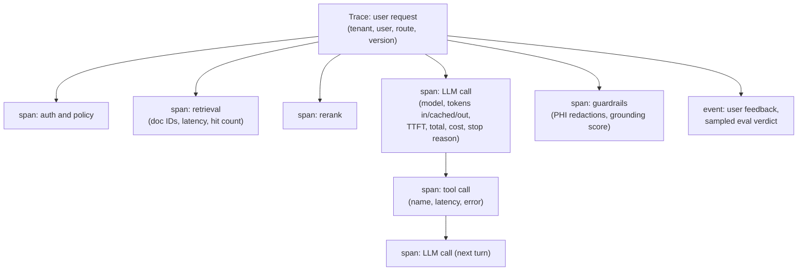
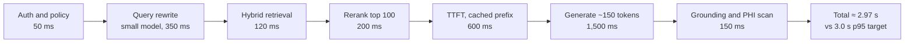
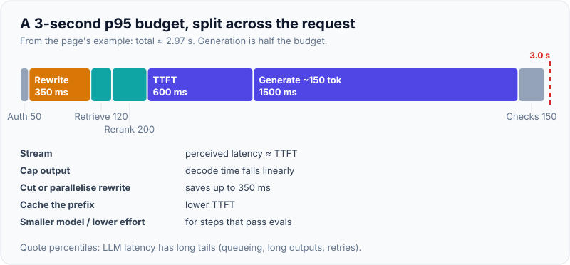
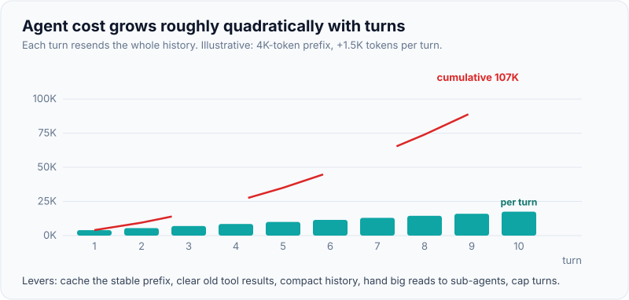

# LLM Observability, Latency Budgets & Token Cost Control

!!! abstract "Key takeaways"
    - **Trace every request end to end:** one trace per user request, with spans for retrieval, each LLM call, each tool call and each guardrail. Record model and version, token counts (input, cached, output), time to first token, total time, cost, errors and refusals. OpenTelemetry's **GenAI semantic conventions** (`gen_ai.*` attributes) give standard names; they are still in *Development* status.
    - **Latency is a budget you split:** auth + retrieval + rerank + model TTFT + generation + checks must fit the UX target at p95. Output tokens dominate generation time; **stream**, cap output, run independent steps in parallel, and use the smallest model that meets quality.
    - **Cost = Σ tokens × price, per route, per tenant.** Model it before launch (a spreadsheet or the calculator below), then measure it from usage fields on every response.
    - **Cost levers, roughly in order:** prompt caching, trimming context and output, routing to cheaper tiers or lower effort, batch APIs (~50% off for async work), response caching (scoped by permissions), and agent loop limits. Judge every lever by cost per *completed task* at the same quality.
    - **Control spend actively:** per-tenant quotas and budgets, rate limiting with backoff on 429s, alerts on anomalies, and dashboards finance can read.

## Why it matters

Two things kill LLM projects after a successful pilot: **it's too slow** for the workflow (a call-centre agent won't wait 12 seconds) and **it costs more than it saves** (the token bill grows with adoption faster than the business case). A third, quieter killer: nobody can explain what the system did when something goes wrong, because there's no trace of prompts, retrieved documents and tool calls.

LLM systems need more observability than typical services: each request has variable cost, latency depends on output length, quality can drift without any error being thrown, and multi-step agents can loop. FDEs are expected to set this up from day one in the customer's environment, often integrated with tools the customer already runs (Datadog, Grafana, Splunk, CloudWatch, Azure Monitor).

## Core concepts

### What to observe


*Notice that cost, latency and quality signals hang off the same trace, so a slow or expensive answer can be explained down to the specific call, documents and tool results.*

| Signal | Examples | Why |
|---|---|---|
| **Traces** | Spans per step with attributes | Debug a single bad answer; find where time goes |
| **Metrics** | TTFT and total latency (p50/p95/p99), tokens/sec, tokens in/out/cached, cost per request/route/tenant, error rate by type (429, 5xx, timeouts), refusal rate, cache hit rate, guardrail trigger rate, tool-call count per task | Dashboards, SLOs, alerts |
| **Logs / payloads** | Rendered prompts and outputs (redacted or in a PHI-approved store) | Error analysis and evals |
| **Quality** | Sampled LLM-judge verdicts, user feedback, edit distance on drafts, escalation rate | Detect silent quality drift ([Evals](05-evals-golden-datasets-llm-as-judge-retrieval-vs-answer-metri.md)) |
| **Business** | Tasks completed, time saved, deflection rate | Prove value; justify spend |

**OpenTelemetry GenAI semantic conventions** define span names (for example `chat {model}`) and attributes such as `gen_ai.operation.name`, `gen_ai.provider.name` (older versions used `gen_ai.system`), `gen_ai.request.model`, `gen_ai.response.model`, `gen_ai.usage.input_tokens`, `gen_ai.usage.output_tokens`, and cache attributes for cache-read and cache-creation input tokens. The conventions are marked *Development*, so names can still change; pin the version you implement. Many LLM observability tools (Langfuse, Arize Phoenix, LangSmith, Datadog LLM Observability, OpenLLMetry and others) ingest OTel or offer SDK auto-instrumentation. Spring AI emits Micrometer observations for chat calls, including token usage.

**Privacy rule:** prompts and completions often contain PHI or confidential data. Decide where payloads may be stored (a PHI-approved store inside the customer's boundary), store hashes and IDs elsewhere, and check that any SaaS observability tool is approved for the data class (see [Guardrails](06-guardrails-prompt-injection-pii-phi-redaction-grounding-chec.md)).

### Latency: anatomy and budgets

For one LLM call: **network + queueing → prefill** (process input; grows with prompt length, cut by prompt caching) **→ thinking/reasoning tokens** (if enabled) **→ decode** (one output token after another). Two numbers matter:

- **Time to first token (TTFT):** what the user perceives as responsiveness when you stream.
- **Total time:** TTFT + output tokens × time per output token. With hundreds of output tokens, decode usually dominates.


*Notice that generation is half the budget, so capping output length and streaming matter more than shaving retrieval; the query-rewrite step is a candidate to cut or run in parallel.*

{ loading=lazy }
*Generation is the biggest block, so shape the output first.*

Techniques, by impact:

| Technique | Effect |
|---|---|
| **Stream** the response | Perceived latency ≈ TTFT instead of total |
| **Cap and shape output** (`max_tokens`, "3 bullets", structured fields) | Decode time falls linearly |
| **Smaller/faster model or lower effort** for the step | Faster prefill and decode, fewer thinking tokens |
| **Prompt caching** | Lower TTFT on long shared prefixes |
| **Parallelise** independent steps (retrieval + profile lookup; sub-agents) | Wall-clock = slowest branch |
| **Remove steps** (skip query rewrite for single-turn queries) | Each LLM hop costs hundreds of ms |
| **Precompute** (summaries at ingest, nightly batch) | Moves work off the request path |
| **Region and provider choice** | Network RTT; capacity; some providers offer faster (premium-priced) serving modes, e.g. Anthropic's fast mode research preview on recent Opus models |
| **Timeouts with fallback** | Bounds the tail (p99) |

Always quote **percentiles**. LLM latency distributions have long tails (queueing, long outputs, retries), and averages hide them.

### Token cost: model, measure, attribute

Per request: `cost = uncached_input × p_in + cache_write × p_in × w + cache_read × p_in × r + output × p_out` where `w` and `r` are the provider's cache multipliers (Anthropic: 1.25× or 2× for writes, 0.1× for reads; OpenAI and Gemini discount cached input without a write surcharge on implicit caching). Thinking/reasoning tokens bill as output. Multiply by requests, and add agent turns (each turn resends the history).

Where cost hides:

- **Agents:** turn *n* resends everything from turns 1…n−1, so cost grows roughly quadratically with turns unless cached, cleared or compacted.
- **RAG:** 10 chunks × 500 tokens = 5,000 input tokens per question; reranking to 4 good chunks halves it.
- **Output:** output tokens cost several times input tokens; verbose answers and reasoning tokens add up.
- **Retries and escalations:** failed calls still bill for tokens processed.
- **Evals and judges:** a nightly 1,000-case suite with judges is a real line item.

{ loading=lazy }
*Linear per turn, quadratic in total.*

**Attribution:** tag every call with tenant, route, feature and model; aggregate daily; show cost per task and per tenant. This is what finance and the customer's sponsor ask for, and it tells you which lever to pull.

### Cost levers

| Lever | Typical saving | Trade-off |
|---|---|---|
| **Prompt caching** (stable prefix first) | Large on long prompts: cached reads at ~10% of input price on Anthropic | Prefix discipline; write premium on explicit caches |
| **Trim context** (rerank, fewer chunks, summarise history) | Proportional to tokens removed | Recall risk: check evals |
| **Trim output** (format, max length) | Large: output is the expensive side | Less detail |
| **Route to cheaper tier / lower effort** ([Model selection](01-model-selection-and-routing-quality-vs-latency-vs-cost-acros.md)) | 2–20× per routed call | Quality risk: eval per route |
| **Batch API** for async work | ~50% (Anthropic, OpenAI; results within 24 h) | Not for interactive use |
| **Response / semantic caching** | Up to 100% on repeats | Staleness; **must key by permission scope and tenant**; semantic matches can be wrong |
| **Agent limits** (steps, context clearing, compaction, sub-agents for reading) | Avoids runaway sessions | May cut off hard tasks |
| **Fine-tuned small model** for a narrow, high-volume task | Large at volume | Training and maintenance cost; availability varies ([Prompting vs RAG vs fine-tuning](08-prompting-vs-rag-vs-fine-tuning-choosing-the-right-lever.md)) |

### Rate limits, quotas and budgets

Providers enforce requests-per-minute and tokens-per-minute limits per model and organisation; cloud platforms have their own quotas and offer provisioned throughput. In production:

- **Client side:** respect `retry-after`; exponential backoff with jitter (SDKs retry 429/5xx a couple of times by default); a token-bucket limiter per route so one batch job can't starve interactive traffic; queue (e.g. Kafka or SQS) for async work.
- **Per-tenant quotas and budgets:** hard caps on tokens or dollars per day per tenant, with alerts at 50/80/100%; protects against abuse and bugs (OWASP LLM10 Unbounded Consumption).
- **Capacity planning:** peak RPM × average tokens → TPM needed; request limit increases or provisioned throughput before launch.

## In practice: code & configuration

### Wrong vs right instrumentation

=== "❌ Common mistake"
    ```python
    start = time.time()
    resp = client.messages.create(model=MODEL, max_tokens=4096, messages=msgs)   # no streaming
    logger.info(f"LLM call took {time.time() - start}s, prompt={msgs}")          # PHI in logs, no tokens
    # - Average latency only; no TTFT; no token or cost data; no route/tenant tags.
    # - max_tokens=4096 "just in case" lets verbose answers run up cost and latency.
    ```

=== "✅ Correct approach"
    ```python
    # Streaming with TTFT, usage-based cost, and an OTel span (NOT RUN: needs API key).
    import time
    t0 = time.perf_counter(); ttft = None
    with tracer.start_as_current_span(f"chat {MODEL}") as span, \
         client.messages.stream(model=MODEL, max_tokens=600, system=SYSTEM_CACHED, messages=msgs) as stream:
        for text in stream.text_stream:
            if ttft is None:
                ttft = time.perf_counter() - t0                    # time to first token
            forward_to_user(text)                                  # user sees tokens immediately
        final = stream.get_final_message()
        u = final.usage
        span.set_attribute("gen_ai.request.model", MODEL)
        span.set_attribute("gen_ai.usage.input_tokens", u.input_tokens)
        span.set_attribute("gen_ai.usage.output_tokens", u.output_tokens)
        span.set_attribute("gen_ai.usage.cache_read.input_tokens", u.cache_read_input_tokens or 0)
        span.set_attribute("app.ttft_ms", round(ttft * 1000))
        span.set_attribute("app.cost_usd", price_call(MODEL, u))    # prices from config, not code
        span.set_attribute("app.stop_reason", final.stop_reason)
    ```

### OpenTelemetry spans with GenAI attributes (ran offline, console exporter)

```python
from opentelemetry import trace
from opentelemetry.sdk.trace import TracerProvider
from opentelemetry.sdk.trace.export import SimpleSpanProcessor, ConsoleSpanExporter
from opentelemetry.sdk.resources import Resource

provider = TracerProvider(resource=Resource.create({"service.name": "pa-assistant"}))
provider.add_span_processor(SimpleSpanProcessor(ConsoleSpanExporter()))   # OTLP exporter in production
trace.set_tracer_provider(provider)
tracer = trace.get_tracer("pa-assistant")

with tracer.start_as_current_span("handle_request") as root:
    root.set_attribute("app.tenant", "payer-a")
    with tracer.start_as_current_span("retrieve") as r:
        r.set_attribute("app.retrieved_doc_ids", ["policy-formulary#0", "sop-appeals#0"])   # IDs, not text
    with tracer.start_as_current_span("chat claude-sonnet-5-5", kind=trace.SpanKind.CLIENT) as span:
        span.set_attribute("gen_ai.operation.name", "chat")
        span.set_attribute("gen_ai.provider.name", "anthropic")
        span.set_attribute("gen_ai.request.model", "claude-sonnet-5-5")
        span.set_attribute("gen_ai.usage.input_tokens", 6200)
        span.set_attribute("gen_ai.usage.output_tokens", 410)
        span.set_attribute("gen_ai.usage.cache_read.input_tokens", 5800)
```

```text
retrieve                 parent=handle_request  {'app.retrieved_doc_ids': ['policy-formulary#0', 'sop-appeals#0']}
chat claude-sonnet-5-5   parent=handle_request  {'gen_ai.operation.name': 'chat', 'gen_ai.provider.name': 'anthropic',
                                                 'gen_ai.request.model': 'claude-sonnet-5-5', 'gen_ai.usage.input_tokens': 6200,
                                                 'gen_ai.usage.output_tokens': 410, 'gen_ai.usage.cache_read.input_tokens': 5800}
handle_request           root                   {'app.tenant': 'payer-a'}
```

### From events to a dashboard (ran offline on 500 simulated calls)

```python
import statistics

def pct(xs, p):
    xs = sorted(xs)
    return xs[min(len(xs) - 1, int(round(p / 100 * (len(xs) - 1))))]

# EVENTS: one dict per LLM call with the attributes above plus app.ttft_ms, app.total_ms, app.cost_usd
ttft = [e["app.ttft_ms"] for e in EVENTS]
total = [e["app.total_ms"] for e in EVENTS]
cached_share = (sum(e["gen_ai.usage.cache_read.input_tokens"] for e in EVENTS)
                / sum(e["gen_ai.usage.input_tokens"] for e in EVENTS))
by_tenant: dict[str, float] = {}
for e in EVENTS:
    by_tenant[e["app.tenant"]] = by_tenant.get(e["app.tenant"], 0) + e["app.cost_usd"]
```

```text
TTFT p50=493ms p95=848ms | total p50=6404ms p95=10712ms
cache-read share of input tokens=53%  mean cost/request=$0.0174
{'t0': 2.98, 't1': 2.97, 't2': 2.77}
```

The simulated route has a fine TTFT but a 10.7 s p95 total because outputs run up to 900 tokens: the fix is output shaping and streaming, not a faster retriever.

### A cost model you can show the customer (ran offline)

Prices are inputs from config (the ones below are illustrative, not a quote). The cache multipliers default to Anthropic's (1.25× write, 0.1× read); adjust per provider.

```python
from dataclasses import dataclass

@dataclass(frozen=True)
class Price:                         # USD per 1M tokens
    input: float
    output: float
    cache_write_mult: float = 1.25   # Anthropic 5-min write (1-hour write is 2.0x)
    cache_read_mult: float = 0.10
    batch_discount: float = 0.50     # Anthropic / OpenAI batch APIs

@dataclass(frozen=True)
class Traffic:
    requests_per_day: int
    static_prefix_tokens: int        # system prompt + tools + examples (cacheable)
    dynamic_input_tokens: int        # user turn + retrieved chunks
    output_tokens: int
    cache_hit_rate: float = 0.0
    batch_share: float = 0.0

def cost_per_request(p: Price, t: Traffic, cached: bool) -> float:
    if cached:
        prefix = t.static_prefix_tokens * p.input * p.cache_read_mult
    elif t.cache_hit_rate > 0:
        prefix = t.static_prefix_tokens * p.input * p.cache_write_mult      # a miss writes the cache
    else:
        prefix = t.static_prefix_tokens * p.input
    return (prefix + t.dynamic_input_tokens * p.input + t.output_tokens * p.output) / 1e6

def monthly_cost(p: Price, t: Traffic, days: int = 30) -> float:
    per = t.cache_hit_rate * cost_per_request(p, t, True) + (1 - t.cache_hit_rate) * cost_per_request(p, t, False)
    blended = per * (1 - t.batch_share) + per * (1 - p.batch_discount) * t.batch_share
    return blended * t.requests_per_day * days
```

```text
50,000 requests/day, 6,000-token static prefix, 2,500 dynamic input, 400 output tokens
mid, no caching                  $    47,250/month  ( 100% of baseline)
mid, 85% cache hits              $    27,607/month  (  58% of baseline)
mid, cache + 40% batch           $    22,086/month  (  47% of baseline)
small, cache + 40% batch         $     5,890/month  (  12% of baseline)
mid, cache, trim RAG to 1.2k     $    21,758/month  (  46% of baseline)
```

The order of the levers is the point: caching and context trimming cut the bill by more than half with no quality risk to evaluate; routing to a smaller model cuts most, but only if evals say the small model is good enough.

### Budgets and rate limiting

```yaml
# llm-budgets.yaml - enforced in the gateway; alerts go to the on-call channel and the account owner
tenants:
  payer-a: {daily_usd: 400, monthly_usd: 9000, alert_at: [0.5, 0.8, 1.0], on_exceed: degrade_to_small_tier}
  payer-b: {daily_usd: 150, monthly_usd: 3500, alert_at: [0.8, 1.0], on_exceed: queue_non_interactive}
routes:
  agent_pa_workflow: {max_steps: 12, max_tokens_per_task: 120000, timeout_s: 180}
  interactive_qa:    {max_output_tokens: 600, p95_target_ms: 3000, rpm_limit: 600}
  nightly_summaries: {use_batch_api: true}
alerts:
  - {metric: cache_hit_rate, route: interactive_qa, below: 0.6, for: 30m}
  - {metric: cost_per_task_usd, route: agent_pa_workflow, above_baseline_pct: 50, for: 1h}
  - {metric: error_rate_429, above: 0.02, for: 10m}
```

## Real-world usage

- **Dashboards** for LLM features typically show, per route: request volume, p50/p95 TTFT and total latency, error and refusal rates, tokens and cost per request and per task, cache hit rate, sampled eval pass rate, and user feedback.
- **FinOps reviews** with the customer: monthly cost per tenant and per feature against the value delivered (hours saved, tickets deflected). Provider admin APIs and cloud billing exports feed these.
- **Common incidents:** cache hit rate silently dropping after a prompt change (a timestamp moved into the prefix); an agent loop bug burning a day's budget in an hour; a batch job hitting the same rate limit as interactive traffic; a provider incident with no fallback; observability tools capturing PHI that wasn't approved for them.
- **Spring Boot shops** can use Spring AI's Micrometer observations with their existing Prometheus/Grafana or Datadog setup, which eases adoption with Java platform teams.

## Trade-offs & production gotchas

| Option | Pros | Cons | Use when |
|---|---|---|---|
| Vendor LLM observability SaaS | Rich UI for traces, prompts, evals | Data leaves boundary; BAA/approval needed | Non-sensitive data, or approved vendor |
| Self-hosted (Langfuse, Phoenix) or OTel into existing APM | Data stays in customer boundary | You operate it | Regulated customers |
| Full payload logging | Best debugging and evals | Privacy risk, storage cost | Only into PHI-approved, access-controlled store |
| Hashes/IDs only | Safe | Harder debugging | General logs and metrics |
| Response caching | Big savings on repeats | Staleness; permission leaks if keyed wrong | FAQs, deterministic lookups, keyed by permission scope |
| Batch API | ~50% cheaper | Up to 24 h latency | Offline enrichment, nightly jobs, evals |

!!! warning "Gotcha: averages lie"
    A 1.8 s average can hide a 9 s p95. Set SLOs and alerts on percentiles per route, and break latency into TTFT and total.

!!! warning "Gotcha: a cache key without permissions is a data leak"
    Response or semantic caches must include tenant and permission scope (and document versions) in the key. Otherwise one user's answer, built from documents only they can see, is served to someone else.

!!! tip "Interview angle"
    When asked about cost, show the formula, a quick back-of-envelope (requests × tokens × price), and the levers in order (caching, trimming, routing, batch), each judged by cost per completed task at equal quality.

## How this connects to my experience

- **Where I used it:** not LLM-specific, but the mechanics are on the resume:
    - **Redis-based caching** for frequent queries and UI reference data at OptumRx Meteor: cache keys, TTLs, hit rates and invalidation, the same thinking as prompt and response caching (including keying by user scope). *[confirm: hit-rate or latency improvements you can quote]*
    - **Owning the GraphQL Consumer Service end to end** for 750K+ users, integrating 5 upstream systems: latency budgets across upstream calls, timeouts and production support. *[confirm: SLOs, p95 targets, the monitoring stack used]*
    - **Kafka event-driven workflows with retry and DLQ:** the natural home for batchable LLM work and backpressure against rate limits.
    - **AWS (Lambda, ECS, EKS, API Gateway, SQS, SNS)** and **Terraform** at Deloitte: deploying gateways, queues and metrics infrastructure in the customer's account. AWS Solutions Architect Associate supports the cost-modelling conversation.
- **Talking points:**
    - "I treat LLM calls like any other expensive, slow upstream: budget the latency, cache what's stable, queue what's not interactive, and put cost per tenant on a dashboard."
    - "On OptumRx I cached reference data in Redis; for LLMs the same idea becomes prompt caching (stable prefix first) and permission-scoped response caching."
- **Likely follow-up chain:** "How would you monitor this in production?" → "The p95 is 9 seconds; what do you do?" → "Finance says it's too expensive; what are your levers?" → "How do you stop one tenant burning the budget?". Answer with trace + metrics + sampled evals; TTFT vs total breakdown, then output shaping, streaming and parallelism; the lever table with the calculator; per-tenant quotas, token buckets and alerts.

## Interview questions

### Fundamentals

??? question "Q1. What should you capture for every LLM call in production?"
    **Answer:** Route, tenant, user (or pseudonymous ID), prompt template version, model and version, parameters, input/cached/output token counts, TTFT, total latency, cost, stop reason (including refusals and max-token truncation), errors, retrieved document IDs, tool calls, guardrail decisions, and a link to the stored payload in an approved store. Organise it as spans in one trace per request.

    **Interviewer listens for:** tokens by type; TTFT; versioning; privacy.

    **Common wrong answer:** "Latency and errors, like any API."

??? question "Q2. TTFT vs total latency: which matters?"
    **Answer:** Both, for different reasons. With streaming, users perceive TTFT; total time matters for downstream automation and for how long a user waits for the complete answer. TTFT depends on queueing, prompt length (prefill) and thinking; total adds output length × per-token time. Track both at p95 per route.

    **Interviewer listens for:** streaming; prefill vs decode.

    **Common wrong answer:** "Total latency is all that matters."

??? question "Q3. How do you estimate the monthly cost of an LLM feature before launch?"
    **Answer:** For each route: requests per day × (input tokens × input price + output tokens × output price), adjusted for expected cache hit rate and multipliers, batch share, agent turns and retries; plus evals and judges. Use the provider's current prices from config. Validate early with real usage fields from the pilot, then refine.

    **Interviewer listens for:** formula; caching and agent turns; validate with real data.

    **Common wrong answer:** "Price per token × number of users."

??? question "Q4. What are OpenTelemetry GenAI semantic conventions?"
    **Answer:** Standard span names and attributes for generative AI operations: for example `gen_ai.operation.name`, `gen_ai.provider.name`, `gen_ai.request.model`, `gen_ai.usage.input_tokens` and `gen_ai.usage.output_tokens`, plus cache token attributes. They let different tools interpret LLM telemetry consistently. They're still in Development status, so pin a version.

    **Interviewer listens for:** standard names; stability caveat.

    **Common wrong answer:** never heard of them (acceptable to admit, but know the idea).

### Intermediate

??? question "Q5. The p95 latency of your assistant is 9 seconds against a 3-second target. How do you approach it?"
    **Answer:** Break the trace down: where does time go at p95? Usually generation (long outputs), thinking tokens, sequential LLM hops, slow retrieval or reranking, or queueing/rate limiting. Fixes: stream; cap and shape output; smaller model or lower effort for that step; prompt caching for TTFT; parallelise independent steps; remove unnecessary hops; precompute; timeouts with fallback for the tail. Re-measure and check evals for quality impact.

    **Interviewer listens for:** measure first; output length; parallelism; quality check.

    **Common wrong answer:** "Get a faster GPU" or "use a smaller model" without measurement.

??? question "Q6. Why does agent cost grow faster than linearly with the number of turns?"
    **Answer:** Each turn resends the full history (system prompt, tools, previous messages and tool results), so input tokens on turn n are roughly the sum of everything before it: total input grows roughly quadratically with turns. Mitigate with prompt caching of the stable prefix and history, clearing old tool results, compaction, sub-agents for reading-heavy work, concise tool outputs and step limits.

    **Interviewer listens for:** history resend; mitigations.

    **Common wrong answer:** "Each turn costs the same."

??? question "Q7. What's semantic caching and what are its risks?"
    **Answer:** Returning a stored response when a new query is similar (by embedding distance) to a previous one. It saves cost and latency on repeated questions. Risks: wrong answers for queries that look similar but differ (a different plan or year), stale answers after document updates, and permission leaks if the key doesn't include tenant and access scope. Use high thresholds, scope keys, version on document updates, and limit it to low-risk routes.

    **Interviewer listens for:** permission scope; staleness; false matches.

    **Common wrong answer:** "Free savings."

??? question "Q8. How do you handle provider rate limits in production?"
    **Answer:** Know the limits per model (RPM, TPM) and request increases before launch; client-side token-bucket limiting per route with priorities (interactive over batch); retries with exponential backoff and jitter honouring `retry-after`; queues for async work; fallback to another region or provider when appropriate; alerts on 429 rate; provisioned throughput on cloud platforms for predictable peaks.

    **Interviewer listens for:** prioritisation; backoff; capacity planning.

    **Common wrong answer:** "Retry in a loop."

### Senior

??? question "Q9. How do you attribute LLM cost to customers or teams?"
    **Answer:** Tag every call with tenant, feature/route, model and environment at the gateway; compute cost from usage fields and a versioned price table; aggregate into a cost store; reconcile monthly with provider invoices or cloud billing exports; expose dashboards (cost per tenant, per task, trend) and budgets with alerts. For shared prefixes and cache writes, allocate by usage share.

    **Interviewer listens for:** gateway tagging; reconciliation; per-task view.

    **Common wrong answer:** "Split the invoice evenly."

??? question "Q10. Where would you store prompts and completions for debugging in a HIPAA environment?"
    **Answer:** In a store inside the customer's boundary approved for PHI: encrypted with customer-managed keys, access-controlled and access-logged, with retention limits. General logs, metrics and traces carry only IDs, hashes and counts. Any external observability vendor must be approved for PHI under a BAA, or receive redacted data only.

    **Interviewer listens for:** separation of payload vs telemetry; keys; retention.

    **Common wrong answer:** "In our LLM observability SaaS."

??? question "Q11. How do you detect silent quality degradation in production?"
    **Answer:** Sample traces daily and run validated LLM judges and code checks; track pass rates per route against the offline baseline; watch proxies (user edits, thumbs down, escalations, refusal rate, average output length, retrieval hit rates); alert on drift; investigate with error analysis; and add the failures to the golden set. Trigger re-evaluation on any model, prompt or corpus change.

    **Interviewer listens for:** online evals; proxies; feedback loop.

    **Common wrong answer:** "Users will tell us."

### Scenario-based

??? question "Q12. Finance shows the LLM bill tripled month over month while traffic grew 20%. Investigate."
    **Answer:** Break cost down by route, model, tenant and token type. Check: cache hit rate (prompt change broke the prefix?), a route moved to a larger model, retrieval sending more chunks, longer outputs, agent steps per task, retry rates, a runaway tenant or job, eval runs charged to production keys. Fix the top contributor, then add alerts on cost per task and cache hit rate so it can't recur silently.

    **Interviewer listens for:** decomposition; usual suspects; preventive alerts.

    **Common wrong answer:** "Switch to a cheaper model everywhere."

??? question "Q13. A customer wants real-time summaries during calls (under 1.5 s) and a detailed post-call summary. Design the latency and cost approach."
    **Answer:** Split it: real-time hints use a small/fast model, streaming, short structured outputs, cached prefix, minimal retrieval, timeouts and graceful degradation. The detailed summary runs after the call via a queue, possibly through a batch API at about half price if minutes-to-hours delay is acceptable, on a stronger model. Separate budgets and SLOs per route; monitor each.

    **Interviewer listens for:** split by latency need; batch for async; per-route SLOs.

    **Common wrong answer:** one model and one pipeline for both.

??? question "Q14. One tenant's integration bug sends 50× normal traffic overnight. What should have stopped it, and what do you do now?"
    **Answer:** Should have: per-tenant rate limits and daily budgets with alerts at thresholds and an automatic action (throttle, degrade, queue), plus anomaly alerts on tokens per tenant. Now: throttle the tenant, notify them, quantify the cost, review with the account team, and add the missing limits and alerts. Map to OWASP LLM10 Unbounded Consumption.

    **Interviewer listens for:** preventive controls; customer communication.

    **Common wrong answer:** "Block them permanently."

## Cheat sheet

| Concept | Remember |
|---|---|
| Trace | One per request; spans for retrieval, LLM calls, tools, guardrails |
| Key metrics | TTFT and total at p95, tokens in/cached/out, cost per task, errors by type, refusal rate, cache hit rate, sampled eval pass rate |
| OTel GenAI | `gen_ai.operation.name`, `gen_ai.provider.name`, `gen_ai.request.model`, `gen_ai.usage.input_tokens/output_tokens`; Development status |
| Latency | Prefill + thinking + decode; output dominates; stream, cap output, parallelise, cache |
| Cost formula | uncached×p_in + writes×p_in×w + reads×p_in×r + output×p_out; thinking bills as output |
| Lever order | Caching → trim context/output → route/effort → batch (~50%) → scoped response cache → agent limits |
| Agents | History resend → roughly quadratic input growth; cache, clear, compact, sub-agents |
| Limits | Token buckets per route, backoff with jitter, per-tenant budgets, 429 alerts |
| Privacy | Payloads only in PHI-approved store; telemetry carries IDs and hashes |

## Sources
1. [OpenTelemetry: Semantic conventions for generative AI client spans](https://opentelemetry.io/docs/specs/semconv/gen-ai/gen-ai-spans) and [GreptimeDB: OTel GenAI conventions overview (May 2026)](https://greptime.com/blogs/2026-05-09-opentelemetry-genai-semantic-conventions): span names, `gen_ai.*` attributes, cache token attributes, Development status.
2. [Anthropic: Prompt caching](https://docs.anthropic.com/en/docs/build-with-claude/prompt-caching): cache write/read multipliers and usage fields.
3. [OpenAI: Prompt caching guide](https://developers.openai.com/docs/guides/prompt-caching): automatic caching and `cached_tokens`.
4. [Anthropic: Message Batches API](https://anthropic.com/news/message-batches-api) and [OpenAI: Batch API guide](https://platform.openai.com/docs/guides/batch): ~50% discount, 24-hour window.
5. [Anthropic: Rate limits](https://platform.claude.com/docs/en/api/rate-limits) and [OpenAI: Rate limits](https://platform.openai.com/docs/guides/rate-limits): RPM/TPM limits, `retry-after`, backoff.
6. [Anthropic: Streaming messages](https://platform.claude.com/docs/en/build-with-claude/streaming): streaming events and final message helper.
7. [Spring AI reference: Observability](https://docs.spring.io/spring-ai/reference/observability/index.html): Micrometer observations and token usage metrics for chat calls.
8. [OWASP Top 10 for LLM Applications 2025: LLM10 Unbounded Consumption](https://genai.owasp.org/llmrisk/llm102025-unbounded-consumption/): rate limits and budgets as security controls.
9. [Google SRE Book: Monitoring distributed systems](https://sre.google/sre-book/monitoring-distributed-systems/): percentiles over averages, the four golden signals.
