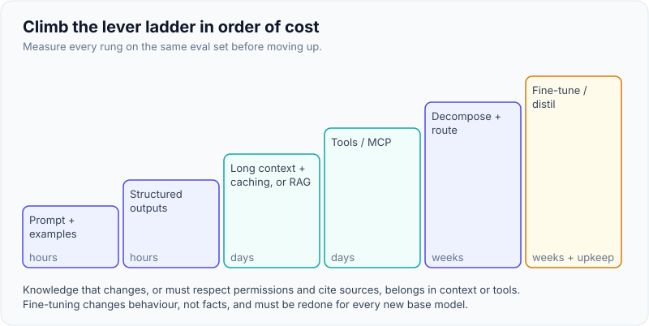
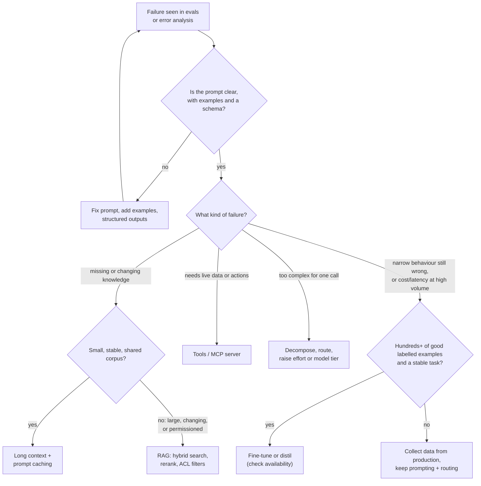
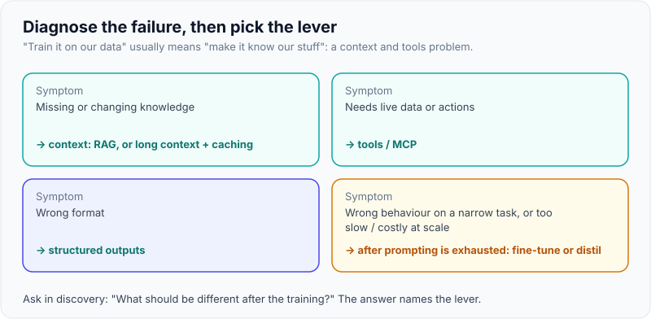

# Prompting vs RAG vs Fine-Tuning: Choosing the Right Lever

!!! abstract "Key takeaways"
    - **Diagnose the failure first.** Missing or changing *knowledge* → context (RAG, long context with caching). Needs *live data or actions* → tools/MCP. Wrong *format* → structured outputs. Wrong *behaviour* on a narrow task, or a need for a *cheaper/faster* model at scale → consider fine-tuning or distillation, after prompting has been exhausted.
    - **Climb the ladder in order of cost:** prompt + examples → structured outputs → long context with caching or RAG → tools → task decomposition and routing → fine-tuning. Each rung is measured on the same eval set before moving up.
    - **Fine-tuning teaches behaviour, not facts.** It is a poor way to add knowledge that changes, can't respect per-user permissions, can't cite sources, and must be redone for each new base model.
    - **Availability changed in 2026:** OpenAI announced in May 2026 that its self-serve fine-tuning platform is winding down (closed to new users; new jobs for existing users to end around January 2027, per OpenAI's notice and reports), citing newer models' instruction following. Vertex AI still offers supervised tuning for Gemini models; Bedrock and open-weight models remain options. Verify current status before proposing it.
    - **"Train it on our data" usually means "make it know our stuff"**, which is a RAG and tools problem. Clarify the real goal in discovery.

## Why it matters

Every FDE engagement reaches the moment when the pilot is "pretty good, but": it doesn't know the customer's products, it answers in the wrong format, it misses domain nuance, or it costs too much at volume. The customer often proposes the fix ("let's fine-tune on our documents"). The interview version of this question ("When would you fine-tune instead of using RAG?") checks whether you can diagnose before prescribing and whether you know the cost of each lever, including the maintenance cost after the FDE leaves.

Choosing wrong is expensive. Fine-tuning a model on a policy manual that changes monthly creates a model that's confidently out of date in four weeks, can't cite which policy version it used, and must be retrained when the provider releases a better base model. Building a full RAG pipeline for a 50-page handbook that fits in a cached prompt adds weeks of work for no gain.

## Core concepts

### What each lever changes

| Lever | What it changes | Fixes | Doesn't fix |
|---|---|---|---|
| **Prompting** (instructions, examples) | What the model is asked and shown, per request | Task framing, tone, rules, many format issues | Missing knowledge; capability limits |
| **Structured outputs** | Allowed output tokens (schema) | Format and parsing | Correctness of content |
| **Long context + caching** | Puts a whole small corpus in every request, cheaply via caching | Knowledge for small, stable, shared corpora | Large corpora; per-user permissions; cost at very large sizes |
| **RAG** | Selects relevant knowledge per request | Large, changing, permissioned knowledge; citations | Behaviour or style; reasoning skill |
| **Tools / MCP** | Lets the model fetch live data and act | Real-time data (claim status), calculations, actions | Style; knowledge in unstructured documents |
| **Decomposition / routing / effort** | Splits the task, sends parts to fitting models, adjusts reasoning | Complex tasks; cost and latency | Missing knowledge |
| **Fine-tuning (SFT)** | Model weights, from input→output examples | Consistent narrow behaviour, style, format, domain-specific classification; shorter prompts | Changing facts; permissions; citations |
| **Preference tuning (DPO)** | Weights, from preferred vs rejected responses | Subjective quality, tone preferences | Facts |
| **Reinforcement fine-tuning (RFT)** | Weights, from graded attempts on verifiable tasks | Reasoning on tasks with checkable answers | Tasks without reliable graders |
| **Distillation** | Trains a small model on a large model's outputs | Cost and latency at high volume for a narrow task | Breadth; frontier capability |

The clean mental model: **context levers change what the model sees; weight levers change how the model behaves.** Knowledge belongs in context; behaviour can go in weights.

{ loading=lazy }
*Climb only when the same eval set says the rung below isn't enough.*

### The decision flow


*Notice that fine-tuning is reachable only after the prompt is fixed and only for behaviour or efficiency problems with enough labelled data; knowledge problems always route to context or tools.*

{ loading=lazy }
*Name the symptom and the lever follows.*

### Long context vs RAG

Current flagship models accept very long contexts (1M tokens on current Claude Opus and Sonnet models, and similar on other providers' top models), and prompt caching makes a repeated large prefix much cheaper. For a **small, stable corpus that every user may see** (a 100-page product handbook), putting it all in a cached prompt can beat RAG: no retrieval misses, no chunking, simpler system. RAG still wins when the corpus is large, changes often, needs per-user permissions, needs citations to specific passages, or when per-request cost and latency of a huge prompt are too high. Test both on the eval set when the corpus is borderline.

### Fine-tuning in 2026: what's available

| Platform | Status (as of October 2026) | Notes |
|---|---|---|
| **OpenAI** | Self-serve fine-tuning **winding down**: closed to new users from May 2026; existing users can create jobs "for the coming months", with the final cutoff for new jobs reported as January 2027; fine-tuned models remain usable until their base models are deprecated | OpenAI cited newer base models (GPT-5.5) following instructions and formats well enough to need less customisation. Custom model programmes for large customers are separate |
| **Google Vertex AI** | **Supervised fine-tuning** for Gemini models available | Text, image, audio, video and document data; JSONL datasets; docs recommend setting thinking to the minimum for tuning; tuning is outside the SLA |
| **Amazon Bedrock** | Fine-tuning and distillation for selected models | Model list varies by region; check whether a given Claude model supports it *[verify]* |
| **Open-weight models** | Full or parameter-efficient fine-tuning (LoRA/QLoRA) on your own GPUs or managed services | Full control and data locality; you own serving, evaluation and safety |

This shift supports the general advice: most enterprise problems are solved with better prompting, context and tools, and fine-tuning is a specialised optimisation.

### Costs beyond the training run

| Cost | Prompting | RAG | Fine-tuning |
|---|---|---|---|
| Build | Hours–days | Weeks (ingestion, permissions, evals) | Weeks (data collection, labelling, training, evals) |
| Data needed | A few examples | The documents + ACLs | Hundreds to thousands of high-quality labelled examples |
| Update when knowledge changes | Edit prompt | Re-index (minutes–hours) | Retrain |
| Update when a better base model ships | Re-run evals, maybe re-tune prompt | Same | **Retrain and re-evaluate** (or stay on the old base) |
| Explainability | High (prompt is visible) | High (citations) | Low (behaviour is in weights) |
| Permissions | n/a | Per-user filters | None: anything trained in can surface for anyone |
| Per-request cost | Higher prompt tokens | Retrieval + context tokens | Shorter prompts; possibly a smaller model |

!!! warning "Gotcha: training data can leak"
    Anything in fine-tuning data can surface in outputs for any user. Never fine-tune on data that some users of the model shouldn't see (other members' PHI, HR data), and check the customer's data-use agreements before using production data for training.

## In practice: code & configuration

### Wrong vs right response to "train it on our data"

=== "❌ Common mistake"
    ```text
    Customer: "We want the model trained on our 30,000 policy documents."
    FDE:      "Sure, we'll fine-tune. Export the documents and we'll start a job."
    Result:   - Facts baked in at training time; stale after the next policy update.
              - No citations; compliance can't verify answers.
              - Every user can now elicit content from restricted documents.
              - Retrain needed for every model upgrade; platform availability may change.
    ```

=== "✅ Correct approach"
    ```text
    FDE: "When you say 'trained on our data', what should be different afterwards:
          that it knows your current policies, that it writes in your house style,
          or that it does a specific task faster and cheaper?"
    - Knows current policies          -> RAG with permissions and citations (or cached long context if small).
    - Needs live claim/member data    -> tools / an MCP server over the system of record.
    - House style, letter format      -> prompt + examples + structured outputs first.
    - Narrow high-volume task cheaper -> evaluate routing/smaller model; fine-tune or distil only if
                                         evals show a gap and we have labelled data.
    "Let's agree an eval set from your real cases, measure the prompt baseline this week,
     and pick the lever from the failures we see."
    ```

### A lever recommender for discovery notes (ran offline)

A thinking aid that encodes the decision flow; the real decision comes from evals.

```python
from dataclasses import dataclass

@dataclass(frozen=True)
class Situation:
    failure: str               # "missing_knowledge" | "stale_knowledge" | "format_or_style" |
                               # "task_behaviour" | "needs_live_data" | "latency_cost_at_scale"
    corpus_tokens: int = 0
    changes_weekly: bool = False
    per_user_permissions: bool = False
    labelled_examples: int = 0
    requests_per_day: int = 0

def recommend(s: Situation) -> list[str]:
    steps = ["Write/repair the prompt and add 3-5 examples; measure on the eval set"]
    if s.failure in {"missing_knowledge", "stale_knowledge"}:
        if s.corpus_tokens < 200_000 and not s.per_user_permissions and not s.changes_weekly:
            steps.append("Put the whole corpus in a cached prompt prefix (long context) and compare with RAG")
        else:
            steps.append("RAG: hybrid retrieval + rerank, ACL filters, incremental sync")
    if s.failure == "needs_live_data":
        steps.append("Tools / MCP server over the system of record (not RAG, not fine-tuning)")
    if s.failure == "format_or_style":
        steps.append("Structured outputs / schema; tighten examples")
    if s.failure in {"task_behaviour", "latency_cost_at_scale"}:
        if s.labelled_examples >= 500 and s.requests_per_day >= 50_000:
            steps.append("Consider fine-tuning (or distilling to) a smaller model; check provider availability")
        else:
            steps.append("Decompose the task, route by difficulty, raise effort; gather labelled data for later")
    return steps
```

```text
policy Q&A, 40 docs, rarely change
   1. Write/repair the prompt and add 3-5 examples; measure on the eval set
   2. Put the whole corpus in a cached prompt prefix (long context) and compare with RAG
SharePoint, 400k pages, per-team ACLs
   2. RAG: hybrid retrieval + rerank, ACL filters, incremental sync
claim status questions
   2. Tools / MCP server over the system of record (not RAG, not fine-tuning)
high-volume intent classifier
   2. Consider fine-tuning (or distilling to) a smaller model; check provider availability
```

The thresholds (200K tokens, 500 examples, 50K requests/day) are illustrative starting points for a conversation, not rules.

### Comparing levers on the same eval set

```python
# NOT RUN as written - wire in your pipelines. Same cases, same graders, different lever.
variants = {
    "prompt_only":        lambda q: prompt_pipeline(q),
    "long_context_cache": lambda q: long_context_pipeline(q, corpus=HANDBOOK),   # cached prefix
    "rag_hybrid":         lambda q: rag_pipeline(q, top_k=6),
}
for name, system in variants.items():
    s = run(load_cases("evals/golden_v4.jsonl"), system)          # harness from the Evals page
    print(f"{name:20} pass={s['pass_rate']:.2f}  cost/task=${s['cost_per_task']:.4f}  p95={s['p95_ms']}ms")
```

Decide on a table like this, with confidence intervals, rather than on intuition.

### What a supervised fine-tuning dataset looks like

Chat-format JSONL is the common shape (field names vary by platform; check the provider's dataset spec):

```json
{"messages": [
  {"role": "system", "content": "Classify the member message into one intent. Reply with the label only."},
  {"role": "user", "content": "my refill for adalimumab was rejected, why??"},
  {"role": "assistant", "content": "rx_rejection_inquiry"}]}
{"messages": [
  {"role": "system", "content": "Classify the member message into one intent. Reply with the label only."},
  {"role": "user", "content": "can I get 90 days of my BP meds by mail"},
  {"role": "assistant", "content": "mail_order_request"}]}
```

Data quality rules: de-identify, balance classes, include hard and ambiguous examples labelled by SMEs, hold out a test set, and compare the tuned model against the best prompt-only baseline and a routed small model on the same test set.

## Real-world usage

- **Most production enterprise assistants** run on base models with prompting, RAG and tools; fine-tuning is reserved for narrow high-volume tasks (classification, extraction, routing) or strict style requirements. OpenAI's 2026 wind-down of self-serve fine-tuning reflects how far prompting and instruction following have come.
- **Healthcare and finance:** compliance teams favour RAG because answers cite the current, approved source; fine-tuned models are harder to validate and to update when regulations or policies change.
- **Distillation** is used when a large model's quality is needed at a small model's price for one task: generate labelled outputs with the large model (reviewed), train a small model, evaluate, route.
- **Failure modes:** fine-tuned models that drift out of date; tuned models stranded on a deprecated base model; RAG built for a tiny corpus that would have fit in context; prompt bloat (a 15,000-token prompt of accumulated patches) that should have become a decomposed workflow or, at very high volume, a tuned model.

## Trade-offs & production gotchas

| Lever | Pros | Cons | Use when |
|---|---|---|---|
| Prompting + examples | Fastest, cheapest, transparent | Long prompts cost tokens; limits on behaviour change | Always first |
| Long context + caching | No retrieval misses; simple | Per-request size; no per-user filtering | Small, stable, shared corpora |
| RAG | Fresh, permissioned, citable knowledge | Pipeline to build and run; retrieval misses | Large or changing knowledge |
| Tools / MCP | Live data and actions | Integration and security work | System-of-record data, transactions |
| Fine-tuning | Consistent narrow behaviour; shorter prompts; smaller models | Data, retraining, availability, leak risk, no citations | Stable, narrow, high-volume tasks with labelled data |
| Distillation | Large-model quality at small-model cost | Narrow; needs a pipeline and evals | Very high volume single task |

!!! warning "Gotcha: comparing a tuned model with a weak prompt"
    Teams often compare a fine-tuned model against a quick prompt and declare victory. Compare against the best prompt you can write (with examples, schema, maybe a stronger model at low effort) on the same held-out set.

!!! tip "Interview angle"
    Lead with the question you'd ask the customer: "What should be different after training?" Then map knowledge → context, live data → tools, behaviour → prompt first and weights only with data and evals.

## How this connects to my experience

- **Where I used it:** not used directly; position as transferable knowledge.
    - **Deloitte: integrating AWS Personalize** recommendation services. That's a managed ML service where we chose a managed product over custom model training: the same buy-vs-build-vs-train judgement. *[confirm: whether you trained/tuned Personalize models (solutions, recipes) or only integrated existing campaigns]*
    - **Elasticsearch-powered search** at Deloitte and **GraphQL integration across 5 upstream systems** at OptumRx: the experience behind preferring retrieval and tools for knowledge and live data.
    - **Consulting background** (Publicis Sapient, Deloitte): used to clarifying what a client really means by a requested solution.
- **Talking points:** "When a client says 'train it on our data', I treat it like any requirement: ask what outcome they want, then pick the cheapest lever that our evals show works. Usually that's retrieval and tools, which also keeps answers current and permissioned."
- **Likely follow-up chain:** "RAG or fine-tuning?" → "When would you actually fine-tune?" → "What would the dataset look like?" → "What happens when the provider releases a better model?". Answer with the knowledge-vs-behaviour split, narrow high-volume tasks with labelled data, chat-format JSONL with SME labels and a held-out set, and the retraining and availability costs.

## Interview questions

### Fundamentals

??? question "Q1. When should you use RAG versus fine-tuning?"
    **Answer:** RAG when the model needs knowledge, especially large, changing or permissioned knowledge with citations. Fine-tuning when you need to change behaviour on a narrow, stable task (format, style, classification) that prompting can't fix, or to get a smaller, cheaper model to perform a high-volume task, and you have enough high-quality labelled data. They can combine: a tuned model can still use RAG.

    **Interviewer listens for:** knowledge vs behaviour; data requirements; combination.

    **Common wrong answer:** "Fine-tuning is better because it learns your data."

??? question "Q2. Why is fine-tuning a poor way to add company knowledge?"
    **Answer:** Facts baked into weights go stale and require retraining; the model can't cite sources, so answers are hard to verify; it can't enforce per-user permissions, so restricted data can surface for anyone; recall of specific facts from fine-tuning is unreliable; and every base-model upgrade means retraining.

    **Interviewer listens for:** staleness, citations, permissions, upgrades.

    **Common wrong answer:** "It's too expensive" alone.

??? question "Q3. What's the order you'd try levers in?"
    **Answer:** Prompt and examples, structured outputs, then context (cached long context or RAG) and tools depending on the failure, then decomposition, routing or a stronger model/effort, and fine-tuning or distillation last, each measured on the same eval set.

    **Interviewer listens for:** cost-ordered ladder; evals at each step.

    **Common wrong answer:** starting with fine-tuning.

??? question "Q4. When does long context beat RAG?"
    **Answer:** When the corpus is small enough to fit comfortably, stable, and shareable with every user, so it can sit in a cached prefix: no retrieval misses or chunking, simpler system. RAG wins for large, changing or permissioned corpora, when citations to passages are needed, or when per-request cost and latency of a huge prompt are too high.

    **Interviewer listens for:** size, stability, permissions, caching.

    **Common wrong answer:** "Long context makes RAG obsolete."

### Intermediate

??? question "Q5. What are SFT, DPO and RFT, briefly?"
    **Answer:** Supervised fine-tuning trains on input→ideal output pairs. Direct preference optimisation trains on pairs of preferred and rejected responses to shift style or quality preferences. Reinforcement fine-tuning trains on graded attempts at tasks with verifiable answers, improving reasoning on that task. Availability differs by provider and changes; check current docs.

    **Interviewer listens for:** data shape for each; when each fits.

    **Common wrong answer:** treating them as synonyms.

??? question "Q6. What changed for fine-tuning in 2026, and why does it matter for a customer proposal?"
    **Answer:** OpenAI announced in May 2026 that its self-serve fine-tuning platform is winding down: closed to new users, with existing users able to create jobs for a limited period (reported cutoff January 2027), and existing tuned models usable until their base models are deprecated. Vertex AI still offers supervised tuning for Gemini, and open-weight models remain an option. A proposal that depends on fine-tuning must name a platform with a future, budget for retraining, and justify why prompting and context aren't enough.

    **Interviewer listens for:** dated facts; platform risk in proposals.

    **Common wrong answer:** being unaware, or overstating details without hedging.

??? question "Q7. How much data do you need to fine-tune, and what quality?"
    **Answer:** For narrow tasks, from a few hundred to a few thousand high-quality, consistent examples (Google's docs suggest at least 100–500 for supervised tuning as a starting point); quality and coverage of edge cases matter more than volume. Data must be de-identified, labelled consistently by SMEs, balanced, and split into train/validation/test, with a test set never used for tuning.

    **Interviewer listens for:** quality over quantity; held-out test; privacy.

    **Common wrong answer:** "Dump all our documents in."

??? question "Q8. How would you decide between distilling to a small model and routing to a small base model?"
    **Answer:** First try the small base model with a good prompt on the eval set; if it meets the bar, route and stop. If there's a gap and volume is high enough that savings justify a training pipeline, distil: generate and review large-model outputs, tune the small model, evaluate against the same test set, and keep a fallback to the large model for low-confidence cases.

    **Interviewer listens for:** cheapest option first; ROI; fallback.

    **Common wrong answer:** distilling by default.

### Senior

??? question "Q9. How do you account for maintenance cost when choosing a lever?"
    **Answer:** Ask who maintains it after the FDE leaves and what triggers rework: knowledge changes (RAG re-index is cheap, retraining is not), base-model upgrades (prompts and RAG re-evaluated; tuned models retrained), schema changes, and team skills. Prefer levers the customer's team can operate, document runbooks, and leave the eval suite as the safety net.

    **Interviewer listens for:** ownership and handover; triggers for rework.

    **Common wrong answer:** only build-time cost.

??? question "Q10. A team's prompt has grown to 15,000 tokens of patches. What do you do?"
    **Answer:** Error-analyse what the patches fix and group them. Move knowledge into retrieval, live facts into tools, format into a schema; split distinct tasks into a workflow with focused prompts; delete rules that newer models don't need (re-run evals to confirm). If a narrow, stable behaviour still needs many instructions at very high volume, that's a candidate for fine-tuning or distillation.

    **Interviewer listens for:** restructuring by failure type; evals to prune.

    **Common wrong answer:** "Fine-tune to get rid of the prompt" immediately.

??? question "Q11. Can you combine RAG and fine-tuning? When does it make sense?"
    **Answer:** Yes: fine-tune for behaviour (how to use retrieved context, cite, format, domain language) and use RAG for knowledge. It makes sense at high volume when a smaller tuned model with RAG matches a larger base model with RAG at lower cost, or when a strict output style must hold. Evaluate retrieval and generation separately so you know which part improved.

    **Interviewer listens for:** division of labour; measured benefit.

    **Common wrong answer:** "Fine-tuning replaces RAG."

### Scenario-based

??? question "Q12. A bank asks you to fine-tune a model on 10 years of customer emails so the assistant 'sounds like us'. What do you do?"
    **Answer:** Clarify the goal: tone and format, or knowledge of products and policies? For tone, start with a style guide plus curated examples in the prompt and evaluate with SMEs. Flag that customer emails contain PII and possibly data customers didn't consent to train on, so legal and privacy must approve, and that anything trained in can leak. Knowledge goes to RAG over current approved content. Fine-tuning only if prompting fails on tone at volume and a de-identified, approved dataset exists, on a platform with a future.

    **Interviewer listens for:** clarify goal; privacy/consent; prompt first.

    **Common wrong answer:** "Sure, export the emails."

??? question "Q13. Your RAG assistant answers correctly but in the wrong structure and tone for the compliance team. Which lever?"
    **Answer:** Not more retrieval. Use structured outputs for structure, and prompt instructions plus a few approved examples for tone; measure with a compliance-defined rubric. Only if that fails consistently at high volume consider fine-tuning for style while keeping RAG for content.

    **Interviewer listens for:** match lever to failure.

    **Common wrong answer:** "Fine-tune on compliance documents."

??? question "Q14. An intent classifier handles 2 million messages a day on a mid-tier model and costs too much. Walk through your options."
    **Answer:** Measure the baseline on a labelled set. Try a small-tier model with a good prompt and examples; try lower effort; consider a classic ML classifier or embeddings + nearest neighbour for the bulk with an LLM fallback for low confidence; use caching for repeated messages. If a gap remains, fine-tune or distil a small model on SME-labelled data where a platform supports it, keep the mid model as fallback, and compare cost per correct classification.

    **Interviewer listens for:** cheaper options first, including non-LLM; fallback; metric.

    **Common wrong answer:** jumping straight to fine-tuning without baselines.

## Cheat sheet

| Concept | Remember |
|---|---|
| Diagnose first | Knowledge → context; live data → tools; format → schema; behaviour/cost at scale → maybe weights |
| Ladder | Prompt → schema → long context/RAG → tools → decompose/route → fine-tune/distil |
| Context vs weights | Context changes what it sees; weights change how it behaves |
| Long context | Small, stable, shared corpus + caching; else RAG |
| Fine-tuning limits | Stale facts, no citations, no permissions, leak risk, retrain on new base |
| Types | SFT (pairs), DPO (preferred vs rejected), RFT (graded verifiable tasks), distillation |
| 2026 availability | OpenAI self-serve FT winding down (May 2026; cutoff ~Jan 2027 reported); Vertex SFT for Gemini; Bedrock; open weights |
| Data | Hundreds–thousands of SME-labelled, de-identified examples; held-out test |
| Customer phrase | "Train on our data" → ask what should be different afterwards |

## Sources
1. [OpenAI: Direct preference optimization guide](https://developers.openai.com/api/docs/guides/direct-preference-optimization/index.html): SFT as default, DPO data shape, and the notice that the fine-tuning platform is no longer open to new users.
2. [OpenAI community: OpenAI is winding down the fine-tuning API and platform](https://community.openai.com/t/openai-is-winding-down-the-fine-tuning-api-and-platform-discussion-thread/1380522) and [Tessl: OpenAI shutting down fine-tuning](https://tessl.io/blog/openai-shutting-fine-tuning-signals-for-enterprise-ai): May 2026 timeline, staged cutoffs, January 2027 final date (secondary).
3. [Google Cloud: About supervised fine-tuning for Gemini models](https://cloud.google.com/vertex-ai/generative-ai/docs/models/tune-text-models-supervised) and [Gemini tuning overview](https://docs.cloud.google.com/vertex-ai/generative-ai/docs/models/gemini-tuning): supported data types, dataset guidance (100–500+ examples), thinking settings, SLA exclusion.
4. [Amazon Bedrock: Customize models (fine-tuning and distillation)](https://docs.aws.amazon.com/bedrock/latest/userguide/custom-models.html): model customisation options on Bedrock.
5. [Anthropic: Introducing contextual retrieval](https://www.anthropic.com/news/contextual-retrieval): note that for small knowledge bases, including the whole corpus in the prompt with caching can be simpler than RAG.
6. [Anthropic: Prompt engineering overview](https://platform.claude.com/docs/en/build-with-claude/prompt-engineering/overview): prompt-first approach before other levers.
7. Hu et al., "LoRA: Low-Rank Adaptation of Large Language Models" (2021): parameter-efficient fine-tuning for open-weight models.
8. Rafailov et al., "Direct Preference Optimization" (NeurIPS 2023): DPO method.
