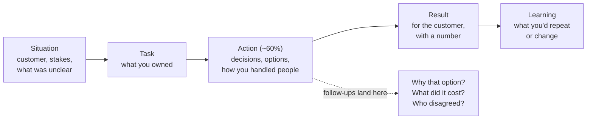

# FDE Story Bank: Ambiguity, No-Docs Systems, Scope Pushback, Client Conflict, Quick Fix vs Proper Fix

!!! abstract "Key takeaways"
    - FDE behavioral rounds probe **five story types** more than generic loops: **ambiguity** (no clear spec), **no-docs systems** (learning an unfamiliar system fast), **scope pushback** (saying no well), **client conflict** (disagreeing with a customer and keeping trust), and **quick fix vs proper fix** (judgement under time pressure).
    - Each story needs the **customer** in it: who they were, what they needed, what changed for them. A story that's entirely internal reads as a product-team answer.
    - Use **STAR-L** (Situation, Task, Action, Result, Learning) with ~60% on Action, and prepare **three levels of follow-up** for every story: "why that?", "what did it cost?", "what would you do differently?".
    - One real story can cover several types. Aim for **6–8 stories** that together cover all five types twice, from at least three different projects.
    - **Never invent.** If you lack a direct customer story, use an internal-customer or upstream-team story and say so. Interviewers probe details; a borrowed story collapses at the second follow-up.

## Why it matters

Prep sites and candidate reports agree that FDE loops weight behavioral signal heavily, because the job is unusually exposed: you work with customers' executives and engineers, in systems you didn't build, with nobody to hand ambiguity to. The [interview loop page](../fde-role-interview-loop/03-the-fde-interview-loop-mapped-screens-take-home-practical-co.md) lists the round; this page covers what to bring to it.

Generic behavioral prep (the [STAR story bank](../leadership-behavioral/01-star-framework-and-building-a-story-bank.md)) is necessary but not sufficient. Leadership-heavy stories ("how I grew my team") matter less in an IC FDE loop than stories showing you can walk into an unfamiliar environment, find the real problem, build something that works, and keep a customer's trust while saying no. If your background is consulting or services (as on this resume), the stories also have to answer the [three doubts](../fde-role-interview-loop/04-positioning-a-consulting-and-services-background-for-fde.md): did you own outcomes, can you build to product quality, and will you push back on a client?

## Core concepts

### The five story types and what interviewers listen for

| Type | Typical question | Listen-for signals | Red flags |
|---|---|---|---|
| **Ambiguity** | "Tell me about a time you had to deliver with no clear requirements." | Asked the right questions, framed the problem, made assumptions explicit, shipped a first slice, iterated | Waited for clarity; built the wrong thing confidently; blamed the client |
| **No-docs system** | "Tell me about getting productive in a system you didn't know." | Systematic recon, small experiments, found the people who knew, wrote it down for the next person | "I read all the code"; heroics without method |
| **Scope pushback** | "Tell me about a time you said no to a stakeholder." | Understood the need behind the ask, offered options, made the trade-off visible, sponsor decided, relationship kept | Flat no; yes then missed date; hid it from the sponsor |
| **Client conflict** | "Tell me about a disagreement with a customer." | Separated people from the problem, used data, escalated cleanly, disagreed and committed | Won the argument, lost the client; "the client was wrong" |
| **Quick fix vs proper fix** | "Tell me about a time you chose speed over the right solution (or vice versa)." | Named the trade-off, contained the risk, paid down the debt, told people | Hack never revisited; perfectionism that missed the moment |

### Structure: STAR-L with the customer in it


*Notice where follow-ups land: almost always on the Action. Prepare the reasons behind each decision, not just the decisions.*

A 2–3 minute answer: 20–30 seconds of Situation and Task, about 90 seconds of Action, 20–30 seconds of Result and Learning. Then stop and let them drill in.

### Building the bank from the resume (without inventing)

Map real experience to the five types. The resume facts below are verbatim; the details are yours to fill in.

| Resume source | Ambiguity | No-docs system | Scope pushback | Client conflict | Quick vs proper |
|---|---|---|---|---|---|
| OptumRx Meteor: GraphQL Consumer Service between **5 upstream systems** | ✓ | ✓ (upstream contracts) | ✓ | ✓ (upstream teams) | ✓ |
| OptumRx Meteor: **React app from the ground up**, micro-frontends | ✓ |  | ✓ |  | ✓ |
| OptumRx Meteor: **Kafka workflows with retry and DLQ**, production support |  |  |  |  | ✓ (incident) |
| OptumRx Meteor: sprint planning, **stakeholder communication**, release management |  |  | ✓ | ✓ |  |
| Coriolis CCKM: **HSM integrations (Thales Luna, SafeNet)**, AWS/Azure/GCP key management |  | ✓ (vendor SDKs) |  |  | ✓ |
| Deloitte ConvergeHealth: AWS services, **Terraform**, **AWS Personalize** integration | ✓ | ✓ (managed ML service) |  |  |  |
| Johnson Controls Metasys: **monolith to microservices migration**, JWT/SSO |  | ✓ (legacy code) |  |  | ✓ |

### Story skeletons to complete

Each skeleton is a structure with the resume fact filled in and the specifics marked *[confirm]*. Write your real details in, then rehearse aloud.

**1. Ambiguity: the integration layer with five upstreams (OptumRx Meteor)**

- **S:** Healthcare platform for 750K+ users; the GraphQL Consumer Service had to integrate 5 upstream systems for multiple consumers, and *[confirm: what was unclear, e.g. which upstream owned which data, response contracts, consumer needs]*.
- **T:** I owned the service end to end.
- **A:** *[confirm: how you framed it: consumer interviews, a first schema slice for one consumer, written assumptions per upstream, contract tests]*; decisions such as *[confirm: caching reference data in Redis, retry and DLQ for event flows]*.
- **R:** *[confirm: a number: consumers onboarded, latency, incidents, delivery date]*.
- **L:** "I'd now write a one-page scope brief per upstream on day one."

**2. No-docs system: HSM integration (Coriolis CCKM)**

- **S:** Key management across AWS, Azure and GCP with Thales Luna and SafeNet HSMs, *[confirm: documentation quality, what was undocumented]*.
- **A:** *[confirm: how you learned: vendor docs, a minimal working call first, small experiments, talking to vendor support, writing a team guide]*.
- **R:** *[confirm: automated rotation workflows shipped, time to first working integration]*.
- **L:** the [learning-round loop](../fde-decomposition-scoping/06-the-learning-round-picking-up-an-unfamiliar-api-language-or.md) in a real setting.

**3. Scope pushback: a late request before a release (OptumRx Meteor)**

- **S:** *[confirm: a stakeholder or client product owner asked for X close to a release]*.
- **A:** "Asked what it would let them do; sized it; offered a swap or a phase 2; the product owner chose; I wrote it down." *[confirm: the actual options and decision]*.
- **R:** *[confirm: release kept, request delivered in the next sprint, relationship]*. Structure: [saying no](../fde-customer-discovery/04-saying-no-and-managing-scope-creep-without-losing-trust.md).

**4. Client or upstream conflict**

- **S:** *[confirm: a disagreement with a client architect, product owner or upstream team, e.g. on an API contract, data ownership or approach]*.
- **A:** "Separated the people from the problem, brought data (latency, error rates, cost), proposed a test or a time-boxed spike, escalated jointly when needed, then committed to the decision."
- **R:** *[confirm]*. If you lack a customer conflict, say so and use an internal one: "The closest example is with an upstream team, who were effectively my customer and supplier."

**5. Quick fix vs proper fix: a production issue**

- **S:** *[confirm: a production incident on Meteor, e.g. a slow upstream, a poison message, a cache issue]*.
- **A:** "Mitigated first (rollback, feature flag, cache, DLQ), told stakeholders, then did the proper fix with a regression test and a ticket to remove the workaround." *[confirm specifics]*.
- **R:** *[confirm: time to mitigate, recurrence]*. Structure: [incidents and postmortems](../leadership-behavioral/08-production-incidents-and-postmortems.md).

### The follow-up ladder

Interviewers drill down two to four levels. Prepare these for every story:

1. "Why did you choose that approach over the alternative?"
2. "What did it cost? What did you give up?"
3. "Who disagreed, and how did you handle them?"
4. "How do you know it worked?" (the number, and where it came from)
5. "What would you do differently as an FDE at our company?"

The fifth one is FDE-specific: translate the story into their world. "As an FDE I'd have owned the discovery directly with the customer rather than through the client product owner, and I'd have fed the integration pattern back to the product team."

## In practice: answers

### Ambiguity: wrong vs right

=== "❌ Common mistake"
    ```text
    "The requirements were really unclear, so I set up a lot of meetings with the client to get
    them to define what they wanted. After a few weeks they gave us a requirements document and
    we built it on time."
    - Waited for someone else to remove the ambiguity.
    - No framing, no assumptions, no first slice, no customer outcome.
    ```

=== "✅ Correct approach"
    ```text
    "The ask was 'expose member data to the new app' across five upstream systems, with no agreed
    contracts. I owned the integration service. I started with one consumer and one screen:
    interviewed the app team about the decisions the screen supported, wrote down assumptions per
    upstream with an owner for each, and shipped a thin schema slice behind a feature flag in two
    weeks [confirm]. That surfaced two wrong assumptions early: [confirm]. We then added consumers
    one at a time with contract tests. Result: [confirm number]. What I'd repeat is the written
    assumption list; what I'd change is getting the upstream owners into the first meeting."
    ```

### Quick fix vs proper fix: the shape of a strong answer

```text
1. Stakes:      who was affected and how badly (users, money, compliance)
2. Quick fix:   what you did to stop the harm, and why it was safe and reversible
3. Disclosure:  who you told, when, and what you said
4. Proper fix:  root cause, the real fix, the regression test, removal of the workaround
5. Prevention:  what changed so it can't recur (alert, standard, design change)
6. Judgement:   when you'd make the other choice
```

### Question bank by type

| Type | Questions to rehearse |
|---|---|
| Ambiguity | "Delivered with no spec" · "Problem turned out different from the ask" · "Decision with incomplete data" |
| No-docs | "Ramped up on an unfamiliar codebase/system" · "Learned a technology fast for a deadline" · "Debugged something nobody understood" |
| Scope pushback | "Said no to a senior stakeholder" · "Managed scope creep" · "Customer asked for something you thought was wrong" |
| Client conflict | "Disagreed with a customer" · "Customer was unhappy with your work" · "Two stakeholders wanted opposite things" |
| Quick vs proper | "Shipped something imperfect" · "Took on technical debt deliberately" · "Pushed back on a hack" |

## Real-world usage

- **Amazon's interview guide** says its interviews are built on past-experience questions guided by its Leadership Principles, and advises candidates to prepare specific examples with measurable results and lessons. FDE loops at AI labs use the same behavioral style, with customer-facing scenarios emphasised.
- **Anthropic's candidate guidance** encourages using Claude to prepare (research, practising answers) but asks for no AI assistance in live interviews unless told otherwise, and for first drafts of written applications to be your own. Stories must be yours in the room.
- **Consulting-to-FDE candidates** are commonly probed on ownership and pushback; stories where you only "facilitated" or "coordinated" read as weak. Use "I decided", "I built", "I told the sponsor".

## Trade-offs & production gotchas

| Choice | Pros | Cons | Use when |
|---|---|---|---|
| Few deep stories (6–8) | Easy to rehearse, rich detail | Repetition across rounds | Most loops; vary emphasis per round |
| Many shallow stories | Coverage | Collapse at follow-up two | Never |
| Internal-customer story | Honest, detailed | Weaker FDE signal | When you lack direct customer stories; say so |
| Recent story | Detail fresh, relevant tech | May be under NDA | Anonymise names, clients and numbers you can't share |

!!! warning "Gotcha: confidential client details"
    Services backgrounds come with NDAs. Describe the domain, scale and problem without naming confidential details you can't share ("a US pharmacy benefits platform serving 750K+ users" is on the resume; internal incident details may not be). Saying "I can't share the client's numbers, but the improvement was roughly X%" is fine.

!!! tip "Interview angle"
    End every story with one sentence that maps it to the FDE job: "That's the part of the job I want more of: finding the real problem with the customer and owning the fix in production."

## How this connects to my experience

- **Where I used it:** the bank is built from the resume itself: OptumRx Meteor (team lead, GraphQL Consumer Service over 5 upstreams, React app from scratch, Kafka retry/DLQ, stakeholder communication, production support), Coriolis CCKM (HSM and multi-cloud key management), Deloitte ConvergeHealth (AWS, Terraform, Personalize), Johnson Controls Metasys (JWT/SSO, monolith migration).
- **Talking points:**
    - Strongest FDE-shaped story: owning the integration layer between five upstream systems and many consumers. *[confirm: the concrete ambiguity, decisions and numbers]*
    - Strongest no-docs story: HSM vendor integrations at Coriolis. *[confirm: what was hard and how you learned it]*
    - Gap to fill honestly: direct end-customer conflict. *[confirm: any direct client stakeholder disagreement; otherwise use upstream teams or client product owners and say so]*
- **Likely follow-up chain:** "Tell me about a time requirements were unclear" → "How did you decide what to build first?" → "What did you get wrong?" → "How would you do it as our FDE?". Answer with the five-upstream story, the first-slice decision, the wrong assumption you found, and the FDE translation (own discovery, feed the pattern back to product).

## Interview questions

### Fundamentals

??? question "Q1. Tell me about a time you had to deliver something with no clear requirements."
    **Answer:** Structure: the ambiguous ask and stakes; what you owned; how you framed it (users, decision, metric, assumptions written down), the first thin slice you shipped and what it revealed; the result with a number; what you'd repeat. Use a real story, such as an integration with undefined contracts.

    **Interviewer listens for:** you created clarity rather than waiting for it.

    **Common wrong answer:** "I asked the client to write better requirements."

??? question "Q2. Tell me about getting productive in a system with no documentation."
    **Answer:** Show method: ran it, found entry points and tests, traced one real request, made a small change to prove the mental model, found the people with tribal knowledge, and wrote down what you learned for the next person. Include time to first useful change.

    **Interviewer listens for:** systematic recon and leaving it better documented.

    **Common wrong answer:** "I read the whole codebase over a weekend."

??? question "Q3. Tell me about a time you said no to a stakeholder."
    **Answer:** The request; asking what it would let them do; sizing it; offering options (swap, phase 2, a different way); the decision-maker choosing; writing it down; the outcome and the relationship afterwards.

    **Interviewer listens for:** options and a preserved relationship.

    **Common wrong answer:** A flat refusal, or a yes that then slipped.

??? question "Q4. How many stories should you prepare, and how?"
    **Answer:** Six to eight real stories from at least three projects, each mapped to several story types, so all five FDE types are covered twice. Write STAR-L plus answers to three levels of follow-up for each, and rehearse aloud with a timer.

    **Interviewer listens for:** depth over breadth.

    **Common wrong answer:** "One story per question."

### Intermediate

??? question "Q5. Tell me about a disagreement with a customer."
    **Answer:** The disagreement and stakes; understanding their interest behind the position; data you brought; options proposed (a test, a spike, phasing); how it was decided (by whom); whether you disagreed and committed; the relationship and outcome.

    **Interviewer listens for:** respect, data, clean escalation, commitment.

    **Common wrong answer:** "I proved them wrong."

??? question "Q6. Tell me about a time you chose a quick fix over the proper fix."
    **Answer:** The stakes, why the quick fix was safe and reversible, who you told, how and when the proper fix followed (root cause, regression test, workaround removed), and what you'd decide differently in another context.

    **Interviewer listens for:** contained risk and debt actually paid.

    **Common wrong answer:** A hack that's still in production.

??? question "Q7. You don't have a direct customer conflict story. What do you do?"
    **Answer:** Say so, then use the closest real equivalent (an upstream team, a client product owner, an internal customer), explain why it's analogous, and show the same behaviours. Never borrow or invent a story.

    **Interviewer listens for:** honesty.

    **Common wrong answer:** Making one up.

??? question "Q8. How do you make a services-background story show ownership?"
    **Answer:** Use "I decided/built/told", show what happened after go-live (incidents, iteration, adoption), quantify the outcome for the end user, and say what you'd do differently with full ownership as an FDE (own discovery, feed product).

    **Interviewer listens for:** after-go-live ownership.

    **Common wrong answer:** "We delivered per the SOW."

### Senior

??? question "Q9. Tell me about a time the problem you were asked to solve wasn't the real problem."
    **Answer:** The original ask; what discovery revealed (workflow, data, the person who felt the pain); how you restated it and got agreement; what you built instead; the measured outcome; how you handled the stakeholder who asked for the original thing.

    **Interviewer listens for:** discovery and diplomatic redirection.

    **Common wrong answer:** Building what was asked and noting it didn't help.

??? question "Q10. Tell me about a time you were wrong about a technical approach."
    **Answer:** The approach and why it seemed right; the signal that showed it was wrong; how fast you changed course and who you told; the cost; what you changed in how you decide.

    **Interviewer listens for:** fast correction and transparency.

    **Common wrong answer:** A disguised success.

??? question "Q11. How would you adapt a story for an FDE interviewer versus a product-company interviewer?"
    **Answer:** For FDE, emphasise the customer (who, their constraints, their outcome), the environment you didn't control, discovery, and trust; for product roles, emphasise design depth, scale and long-term ownership of a codebase. Same facts, different emphasis.

    **Interviewer listens for:** audience awareness.

    **Common wrong answer:** Telling it identically everywhere.

### Scenario-based

??? question "Q12. The interviewer keeps asking 'but what did you personally do?' What's happening?"
    **Answer:** Your answer is too "we". Switch to first-person decisions and actions, with the reasons, and name what others did separately. Prepare stories with your own decisions marked.

    **Interviewer listens for:** recovering with specifics.

    **Common wrong answer:** Repeating the team story.

??? question "Q13. You're asked for a story about a customer escalation to your boss's boss. You've never had one. Answer."
    **Answer:** Say that you haven't had that exact situation, describe the closest one (a stakeholder escalation on a delivery date, an upstream outage that affected a client), and explain how you'd handle the FDE version: acknowledge, gather facts, a plan with dates, communicate on a cadence, and fix the cause.

    **Interviewer listens for:** honesty plus transferable behaviour.

    **Common wrong answer:** Inventing an escalation.

??? question "Q14. At the end of the behavioral round, the interviewer asks if there's anything else. What do you say?"
    **Answer:** Use it: one sentence connecting your strongest story to the role ("the part I'd bring is owning integrations into messy systems and keeping the customer close"), or address a gap you noticed ("I didn't mention X; briefly…"), then a thoughtful question about how FDEs are measured.

    **Interviewer listens for:** composure and intent.

    **Common wrong answer:** "No, I think that's everything."

## Cheat sheet

| Concept | Remember |
|---|---|
| Five types | Ambiguity · no-docs system · scope pushback · client conflict · quick vs proper fix |
| Structure | STAR-L, ~60% Action, customer in every story, a number in the result |
| Bank | 6–8 real stories, 3+ projects, each type covered twice |
| Follow-ups | Why that? · Cost? · Who disagreed? · How measured? · As our FDE? |
| Voice | "I decided / built / told"; "we" for the team |
| Honesty | No invented stories; say when it's an internal-customer analogue; respect NDAs |
| Close | Map each story to the FDE job in one sentence |

## Sources
1. [Amazon: Interview guide (aboutamazon.com)](https://www.aboutamazon.com/news/workplace/amazon-interview-guide): past-experience questions, Leadership Principles, specific examples with results.
2. [Anthropic: How to collaborate with Claude during our hiring process](https://www.anthropic.com/candidate-ai-guidance): AI use in applications, preparation and interviews.
3. [Fisher & Ury, *Getting to Yes*](https://www.pon.harvard.edu/tag/getting-to-yes/) (book): interests vs positions, separating people from the problem.
4. Related: [STAR story bank](../leadership-behavioral/01-star-framework-and-building-a-story-bank.md), [Positioning a consulting background](../fde-role-interview-loop/04-positioning-a-consulting-and-services-background-for-fde.md), [Saying no](../fde-customer-discovery/04-saying-no-and-managing-scope-creep-without-losing-trust.md), [Incidents and postmortems](../leadership-behavioral/08-production-incidents-and-postmortems.md).
