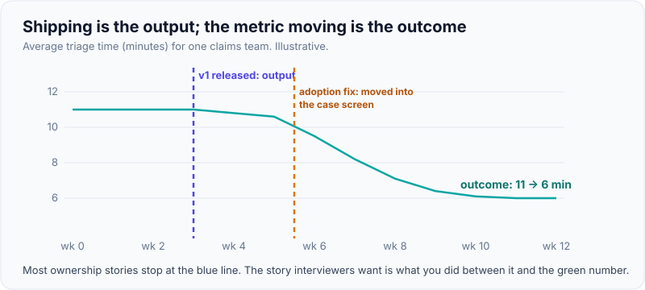
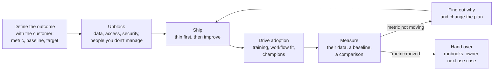
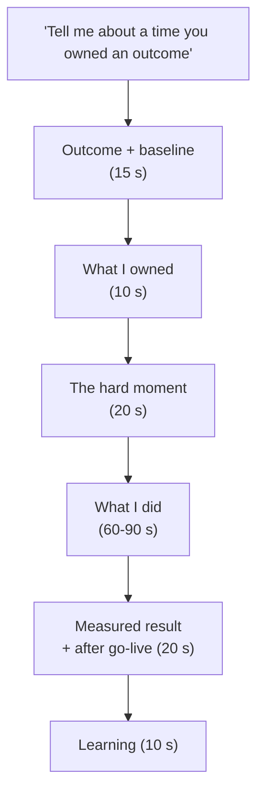

# Owning a Customer Outcome End to End

!!! abstract "Key takeaways"
    - **Output** is what you shipped; **outcome** is what changed for the customer (time saved, errors avoided, revenue, risk reduced). FDEs are hired and measured on outcomes, so ownership stories must end in one.
    - Ownership runs the full loop: **define the outcome with the customer → remove blockers you don't own → ship → drive adoption → measure → fix what didn't work → hand over**. Most candidates' stories stop at "shipped".
    - **Owning means acting on things outside your remit** (a slow security review, a missing data feed, a team that isn't using the tool) by escalating early, offering help and changing the plan, not by doing everyone's job or blaming them.
    - Show the **metric with its baseline and source**, what happened **after go-live** (adoption, incidents, iteration), and a moment where you **chose the outcome over your plan or your comfort**.
    - The senior version adds **leaving the customer able to own it**: runbooks, enablement, the next use case they can build themselves.

## Why it matters

OpenAI's FDE postings describe owning deployments end to end, from discovery and scoping to production rollout; Palantir's describe the role as being like a startup CTO with end-to-end ownership of high-stakes projects; an Accenture FDE posting quoted on the [role page](../fde-role-interview-loop/01-what-an-fde-is-palantir-origins-fde-vs-swe-vs-solutions-engi.md) says FDEs "own outcomes end-to-end" and that it isn't an advisory role. So "tell me about a time you owned an outcome, not just a task" is one of the most predictable questions in an FDE loop, and one of the most revealing.

The weak answer describes a feature delivered on time. The strong answer describes a customer whose situation measurably changed because the candidate kept going after the feature shipped: pushing adoption, fixing the data problem nobody owned, renegotiating scope when the first version didn't move the metric. For someone from a services background, this question is also the main test of the "did you own outcomes or deliver tickets?" doubt ([positioning](../fde-role-interview-loop/04-positioning-a-consulting-and-services-background-for-fde.md)).

## Core concepts

### Output vs outcome

| | Output | Outcome |
|---|---|---|
| Example | "Built the claims assistant and released it to 300 users" | "Cut average claim triage time from 11 to 6 minutes for 300 handlers" |
| Measured by | Delivery: scope, date, quality | Change in a business or user metric with a baseline |
| Owner's question | "Is it done?" | "Is it working for them, and how do we know?" |
| When it ends | At release | When the metric moves, or you've learned why it won't, and someone owns it going forward |

{ loading=lazy }
*The story interviewers want lives between the two dashed lines.*

### The ownership loop


*Notice the loop from Measure back to Ship. Ownership shows most clearly when the first version didn't move the metric and you kept going.*

{ loading=lazy }
*Ownership shows most clearly on the dashed arrow.*

Each stage maps to a page in this track: [discovery](../fde-customer-discovery/01-discovery-interviews-workflow-mapping-hidden-constraints-res.md), [scope brief](../fde-customer-discovery/02-writing-the-scope-brief-success-criteria-assumptions-out-of.md), [pilots and impact](../fde-customer-discovery/03-pilot-to-proof-of-concept-to-production-time-boxing-exit-cri.md), [rollout and handoff](../fde-enterprise-deployment/07-production-rollout-monitoring-on-call-and-handoff-to-the-cus.md).

### Owning what you don't control

Most blockers to a customer outcome sit outside the FDE's authority: the customer's security review, their data team's backlog, an upstream system's outage, users who don't change their habits. Ownership is how you behave towards those:

| Situation | Not ownership | Ownership |
|---|---|---|
| Security review hasn't started | "Waiting on security" in the status report | Book the review in week 1, pre-fill the questionnaire, offer an architecture walkthrough, flag the date risk to the sponsor |
| Data feed is unreliable | Build around it silently, or blame the data team | Quantify the impact, propose a fix with the data team, add validation and alerts, escalate with evidence if needed |
| Users aren't using the tool | "Adoption is the client's job" | Sit with users, find the friction (wrong place in the workflow? trust?), fix it, recruit champions |
| Metric isn't moving | Report "delivered as specified" | Investigate, show the sponsor what you learned, change the plan |
| Problem is in a product you don't own | Patch it locally and move on | Workaround for now, plus evidence to the product team ([field feedback](../fde-customer-discovery/07-field-feedback-to-product-and-research-codifying-repeatable.md)) |

The boundary matters too: owning the outcome doesn't mean doing everyone's job or making decisions that belong to the sponsor. It means making the blocker visible early, with options, and following up until it's resolved.

### Telling the ownership story

A structure that answers the follow-ups before they're asked:

1. **The outcome and who it was for**, with a baseline: "Pharmacy members couldn't see claim status without calling; ~X calls/month *[confirm]*."
2. **What you owned**, explicitly: "I owned the integration service and the outcome for the claims-status feature."
3. **The moment it got hard**: the blocker outside your control, or the first version that didn't work.
4. **What you did about it**: decisions, people you persuaded, what you changed.
5. **The result**, measured, and from which source.
6. **What happened after go-live**: adoption, incidents, iteration, handover.
7. **Learning**: what you'd do the same and differently.


*Notice that the hard moment comes early. An ownership story with no obstacle sounds like a task that went to plan, which isn't what the question is testing.*

## In practice: answers

### Wrong vs right

=== "❌ Common mistake"
    ```text
    "I owned the GraphQL service. I designed the schema, built the resolvers, set up caching with
    Redis and Kafka integration, wrote tests, and we delivered it on time for the release. The
    client was happy."
    - Output, not outcome: no user, no metric, no baseline.
    - No obstacle, no after-go-live, no evidence of ownership beyond the code.
    ```

=== "✅ Correct approach"
    ```text
    "Members of the pharmacy app had to call support to check [confirm: e.g. prescription status],
    about [confirm: N] calls a month. I owned the integration service that would expose that data
    from [confirm: upstream] to the app. The hard part wasn't the code: the upstream API was too
    slow for the app's latency budget and its team had no capacity to change it this quarter.
    I measured it, showed the client product owner the impact, and proposed caching reference data
    in Redis with a defined staleness window, plus an event-driven refresh via Kafka [confirm],
    which the upstream team agreed to. After launch, adoption was lower than expected because
    [confirm: e.g. the feature was buried in the UI]; we moved it with the product team. Result:
    [confirm: call volume / usage / latency number from source]. I'd now agree the success metric
    with the business before writing code, not after."
    ```

### A one-page outcome record (keep one per engagement)

```yaml
outcome_record:
  customer: "<team / organisation>"
  outcome: "<metric> from <baseline> to <target> by <date>"
  measured_from: "<system of record / report>"
  what_i_owned: "<scope of my ownership>"
  blockers_outside_my_control:
    - blocker: "<e.g. security review>"
      action: "<what I did>"
      result: "<resolved when>"
  after_go_live:
    adoption: "<users, usage over time>"
    incidents: "<what broke, how fixed>"
    iterations: "<what changed and why>"
  result: "<final metric, with source and caveats>"
  handover: "<owner, runbooks, enablement>"
  learning: "<keep / change>"
```

Keep these as you work; they become your interview stories and your promotion evidence.

## Real-world usage

- **FDE job descriptions** at OpenAI, Anthropic, Palantir and others centre on end-to-end ownership of deployments and outcomes, with feedback to product. Interviewers will test whether your stories have the same shape.
- **Outcome-based commercial models** (per-resolution pricing for support agents, outcome-linked fees) make the distinction concrete: the vendor gets paid when the customer's metric moves, not when software ships.
- **Amazon's "Ownership" leadership principle** ("Leaders are owners… They act on behalf of the entire company, beyond just their own team. They never say 'that's not my job'") is the best-known articulation; FDE behavioral rounds probe the same trait from the customer's side.

## Trade-offs & production gotchas

| Tension | Too little | Too much | Balance |
|---|---|---|---|
| Scope of ownership | "Not my job" | Doing the customer's team's job for them (hero dependency) | Own the outcome; enable others to own their parts |
| Persistence | Stop at release | Keep pushing a solution that isn't working | Measure, learn, change the plan, or stop with evidence |
| Escalation | Never escalate, absorb delays | Escalate everything | Escalate early with facts and options, once you've tried |
| Credit | "We" for everything | "I" for everything | "I" for your decisions, "we" for the team's work |

!!! warning "Gotcha: claiming the result without the measurement"
    "It improved efficiency a lot" invites "how do you know?". Give the number, its source and its caveats ("from the support system's call categories, comparing the quarter before and after; seasonal effects not fully controlled"). An honest caveat is stronger than an unsupported claim.

!!! tip "Interview angle"
    If the outcome wasn't fully achieved, say so: "We got from 11 to 8 minutes, not 6. Here's what I learned and what I'd do differently." Partial outcomes with clear learning are credible; perfect ones invite suspicion.

## How this connects to my experience

- **Where I used it:** OptumRx Meteor (Publicis Sapient): *"Owned the GraphQL Consumer Service end-to-end, acting as the integration layer between 5 upstream systems and multiple downstream consumers"* for *"enterprise healthcare applications serving 750K+ users"*, plus *"stakeholder communication, release management, and production support"* as lead of 8–10 engineers. Johnson Controls Metasys: *"owned JWT-based authentication and SSO implementation end-to-end"*.
- **Talking points:**
    - The outcome behind the GraphQL service: what changed for members or consumer teams because it existed. *[confirm: the user-facing outcome and a number, e.g. consumers onboarded, latency, call deflection, release frequency]*
    - A blocker outside your control you resolved: an upstream team, a security review, a client decision. *[confirm]*
    - What happened after go-live: production support, an incident, an iteration driven by usage data. *[confirm]*
    - Metasys SSO end to end: who the users were and what improved (fewer logins, fewer support tickets?). *[confirm]*
- **Likely follow-up chain:** "Tell me about an outcome you owned" → "How did you measure it?" → "What would have happened if you hadn't pushed?" → "What did you hand over, and to whom?". Answer with the integration-layer story, the metric and its source, the specific blocker you cleared, and the handover (runbooks, team ownership, standards).

## Interview questions

### Fundamentals

??? question "Q1. Tell me about a time you owned a customer outcome, not just a deliverable."
    **Answer:** Use the structure: outcome with baseline, what you owned, the hard moment, what you did (including outside your remit), the measured result with source, what happened after go-live, and learning. Keep the customer and the metric at the centre.

    **Interviewer listens for:** a metric, an obstacle, after-go-live ownership.

    **Common wrong answer:** A feature delivered on time.

??? question "Q2. What's the difference between an output and an outcome?"
    **Answer:** Output is what you produced (a service, a feature, a report). Outcome is the change it caused for the customer, measured against a baseline (minutes saved, errors avoided, revenue, risk). Owning outcomes means staying with the work until the metric moves or you know why it won't.

    **Interviewer listens for:** baseline and measurement.

    **Common wrong answer:** "Outcomes are just outputs that the client liked."

??? question "Q3. How do you measure whether your work changed anything?"
    **Answer:** Agree the metric, baseline and source with the customer before building; measure from their systems; use a comparison group or staggered rollout where possible; track adoption as a leading indicator; report with caveats.

    **Interviewer listens for:** customer-owned data and comparison.

    **Common wrong answer:** "User feedback was positive."

??? question "Q4. Tell me about a blocker outside your control and what you did."
    **Answer:** The blocker (security review, data feed, another team), its impact on the outcome, how early you raised it, the options you offered, the help you gave, the decision and follow-up, and the result.

    **Interviewer listens for:** early, constructive escalation.

    **Common wrong answer:** "We waited for them."

### Intermediate

??? question "Q5. Your feature shipped, but nobody used it. What do you do?"
    **Answer:** Treat it as your problem: go to users, watch the workflow, find the friction (wrong place, extra steps, trust, training), fix it with the product owner, recruit champions, measure adoption weekly. If it truly isn't needed, say so and redirect effort.

    **Interviewer listens for:** adoption as part of delivery.

    **Common wrong answer:** "Adoption is the client's responsibility."

??? question "Q6. How do you own an outcome without becoming the bottleneck?"
    **Answer:** Own the result, not every task: make owners explicit, enable the customer's team (pairing, runbooks, docs), automate checks, and plan the handover from the start. A hero dependency is an ownership failure.

    **Interviewer listens for:** enablement and handover.

    **Common wrong answer:** "I do everything myself to be safe."

??? question "Q7. Tell me about a time the first version didn't achieve the outcome."
    **Answer:** What you shipped, how you learned it wasn't working (metric, users), what you changed, the result, and the learning. This is the clearest evidence of outcome ownership.

    **Interviewer listens for:** the loop back from measurement.

    **Common wrong answer:** Only success stories.

??? question "Q8. How do you balance owning outcomes with respecting the customer's decisions?"
    **Answer:** Make trade-offs visible with evidence and let the sponsor decide; if you disagree, say so once, clearly, then commit. Owning the outcome includes making sure decision-makers have the facts, not overriding them.

    **Interviewer listens for:** disagree and commit.

    **Common wrong answer:** "I do what's right regardless."

### Senior

??? question "Q9. What does handover look like when you own an outcome?"
    **Answer:** A named owner on the customer side, runbooks, monitoring they read, a support model, shared on-call for a period, training, and a backlog of next improvements. Success is the metric holding after you've moved on, and their team building the next use case themselves.

    **Interviewer listens for:** sustainability.

    **Common wrong answer:** "Send the documentation."

??? question "Q10. How would you define success for yourself as an FDE in your first six months?"
    **Answer:** One or two customer use cases in production with measured outcomes, the customer team able to run and extend them, reusable assets or product feedback that made the next deployment faster, and trust with the customer's sponsor and engineers.

    **Interviewer listens for:** outcomes, enablement, compounding.

    **Common wrong answer:** "Learn the product and ship features."

??? question "Q11. Tell me about a time you owned something beyond your role."
    **Answer:** A real case where you saw a gap affecting the outcome (no monitoring, unclear ownership of a data feed, a missing standard), took it on or found its owner, and what changed. Show you didn't trample others' responsibilities.

    **Interviewer listens for:** initiative with judgement.

    **Common wrong answer:** Taking over another team's work without telling them.

### Scenario-based

??? question "Q12. Two weeks before go-live, the customer's data team says the feed you depend on won't be ready for two months. What do you do?"
    **Answer:** Quantify the impact on the outcome; look for alternatives (a temporary file export, a partial feed, a reduced first scope); bring options and a recommendation to the sponsor quickly; agree the new plan in writing; keep the go-live for what can work and communicate the change.

    **Interviewer listens for:** options, speed, sponsor decision.

    **Common wrong answer:** Delay everything silently.

??? question "Q13. After launch, your metric improved, but another team's metric got worse. What do you do?"
    **Answer:** Treat it as part of the outcome: investigate the link (e.g. faster triage pushed more work to a downstream team), share data with both teams and the sponsor, and adjust (capacity, routing, guardrail metrics). Add the guardrail to the success criteria.

    **Interviewer listens for:** system thinking and guardrails.

    **Common wrong answer:** "Not my metric."

??? question "Q14. The interviewer asks, 'What would have happened if you hadn't been there?' How do you answer?"
    **Answer:** Specifically and modestly: name the decision or action that changed the outcome (the blocker you cleared early, the metric you insisted on, the adoption fix), and what the likely counterfactual was, without diminishing the team.

    **Interviewer listens for:** a specific, credible contribution.

    **Common wrong answer:** "The project would have failed."

## Cheat sheet

| Concept | Remember |
|---|---|
| Output vs outcome | Shipped vs changed, with baseline and source |
| Loop | Define → unblock → ship → adopt → measure → fix → hand over |
| Owning the uncontrolled | Raise early, quantify, offer options and help, follow up |
| Story | Outcome + baseline → what I owned → hard moment → actions → measured result → after go-live → learning |
| Evidence | Number, source, caveats; partial outcomes are fine with learning |
| Boundaries | Own the outcome, not everyone's tasks; sponsor decides; enable, don't become the bottleneck |
| Keep | An outcome record per engagement |

## Sources
1. [OpenAI careers: Forward Deployed Engineer](https://openai.com/careers/forward-deployed-engineer-london/): end-to-end deployment ownership.
2. [Palantir FDSE posting (Lever)](https://jobs.lever.co/palantir/b46312f7-89c8-4447-bf01-931e45243d1a): startup-CTO framing and end-to-end ownership.
3. [Amazon: Leadership Principles (Ownership)](https://www.amazon.jobs/content/en/our-workplace/leadership-principles): "never say 'that's not my job'".
4. [Amazon: Interview guide](https://www.aboutamazon.com/news/workplace/amazon-interview-guide): specific examples with measurable results.
5. Related: [Pilots and measuring impact](../fde-customer-discovery/03-pilot-to-proof-of-concept-to-production-time-boxing-exit-cri.md), [Rollout and handoff](../fde-enterprise-deployment/07-production-rollout-monitoring-on-call-and-handoff-to-the-cus.md), [Leading a team: ownership](../leadership-behavioral/03-leading-a-team-of-8-10-delegation-ownership-accountability.md).
