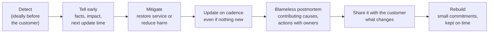

# Recovering Trust After a Failed Delivery or Incident

!!! abstract "Key takeaways"
    - Trust is lost through **surprises** more than failures. The first move after something goes wrong is **telling the customer early, yourself, with facts and a next update time**, before they find out another way.
    - A good apology has four parts: **what happened (facts, not excuses), the impact on them, what you're doing now, and when they'll hear next**. Own your part plainly; don't blame the customer's team, a vendor or "the model".
    - Then **fix, learn and prove**: mitigate, run a **blameless postmortem** (contributing causes, not culprits), agree concrete actions with owners and dates, and rebuild with **small, reliable commitments** delivered on time.
    - Trust follows the **trust equation** (credibility + reliability + intimacy) ÷ self-orientation: reliability is rebuilt by kept promises, and self-orientation rises when you sound defensive.
    - The **service recovery paradox** (satisfaction after an excellent recovery exceeding pre-failure levels) has meta-analytic support for satisfaction but not for repurchase or loyalty, and holds best for non-severe, first-time failures. Don't plan on it; recover well anyway.

## Why it matters

FDEs work where failures are visible: a pilot that misses its date, a demo that breaks in front of an executive, an AI answer that's confidently wrong, a deployment that takes down a workflow. Because the FDE is the customer's face of the vendor, how they handle the bad day often matters more to the account than the failure itself. Interviewers know this, which is why "tell me about a time you let a customer down" or "tell me about a production incident" appears in almost every FDE behavioral round.

What they listen for is consistent across sources: did you tell people early and honestly, did you own your part without throwing others under the bus, did you fix the cause and not just the symptom, and did the relationship survive? The incident mechanics (roles, mitigation, postmortems) are on [production incidents and postmortems](../leadership-behavioral/08-production-incidents-and-postmortems.md); this page is about the customer relationship around them.

## Core concepts

### What damages trust, and what rebuilds it

David Maister's trust equation (from *The Trusted Advisor*) is a useful lens:

**Trust = (Credibility + Reliability + Intimacy) ÷ Self-orientation**

| Term | After a failure, it drops when you… | It recovers when you… |
|---|---|---|
| Credibility | Give vague or wrong explanations | Explain precisely what happened and why, with evidence |
| Reliability | Miss the date you just reset | Make small commitments and keep every one |
| Intimacy | Hide behind email and process | Talk directly, acknowledge the impact on them personally |
| Self-orientation (denominator) | Defend yourself, your company, your design | Focus on their outcome; own your part plainly |

The practical rule from the [saying-no page](../fde-customer-discovery/04-saying-no-and-managing-scope-creep-without-losing-trust.md) applies doubly here: people forgive bad news delivered early; they don't forgive surprises.

### The recovery sequence


*Notice that "tell" comes before "mitigate" is finished. Waiting until you have the full answer is the most common way to turn an incident into a trust problem.*

**The first hour (an incident):**

1. Mitigate the harm if you can do it safely and quickly (roll back, disable the feature, switch the AI to suggestion-only).
2. Tell the customer's owner directly (call, then write): what you know, what you don't, impact, what you're doing, next update time.
3. Keep a timeline as you go; it becomes the postmortem.

**The first day (a missed delivery):**

1. Tell the sponsor before the date passes, not after.
2. Explain the cause in one or two sentences, without blaming.
3. Offer options: a smaller scope on the original date, the full scope on a new date, or a change of approach, with your recommendation.
4. Confirm the decision in writing and reset the plan.

### The apology that works

| Part | Example | Avoid |
|---|---|---|
| What happened (facts) | "Yesterday between 14:10 and 15:40, the assistant returned answers from the archived 2025 policy for 312 questions." | "There was a minor glitch." |
| Impact on them | "Your agents may have quoted outdated reimbursement limits to members." | Minimising: "Only 2% of traffic." |
| Ownership | "That's on our side: our ingestion job didn't apply the archive flag." | "The document owners didn't tag it." / "The model hallucinated." |
| What we're doing | "We've removed archived documents from the index, identified the 312 conversations, and we'll send your team the list by 10:00 tomorrow." | Promises without dates |
| Prevention | "We're adding an archived-content test to the release checks; full postmortem by Friday." | "It won't happen again." |
| Next update | "I'll call you at 17:00 today with the conversation list status." | Silence until it's fixed |

### Blameless postmortems with a customer

Google's SRE book describes blameless postmortems as focusing on contributing causes without indicting individuals or teams, assuming everyone acted with good intentions on the information they had, because blame drives problems underground and leaves the organisation with more risk. With customers:

- **Invite them** to the postmortem review, or share a customer version, when the incident affected them.
- **Contributing causes, not culprits**, including causes on both sides ("our job didn't apply the flag; the archive process didn't notify downstream systems"). Name yours first.
- **Actions with owners and dates**, tracked to done, and report back when they're closed. An action list that quietly expires destroys more trust than the incident.

### The service recovery paradox, used carefully

The idea that a well-handled failure can leave customers more satisfied than before has some support: a meta-analysis (de Matos, Henrique and Rossi, 2007) found a positive cumulative effect on satisfaction but no significant effect on repurchase intention, word of mouth or corporate image; experimental work (Magnini et al., 2007) found it most likely when the failure isn't severe and it's the customer's first one with the firm. The practical reading: an excellent recovery limits the damage and can strengthen the relationship, but it doesn't erase a pattern of failures, and you should never rely on it.

### Rebuilding: small commitments, kept

After the immediate recovery, credibility comes back through a run of kept promises:

- Make commitments **smaller and more frequent** for a while: weekly deliverables with dates, rather than one big date.
- **Over-communicate** on a fixed cadence, with status, trend and risks ([status updates](../fde-customer-discovery/05-talking-to-executives-vs-engineers-demos-executive-pitch-sta.md)).
- **Show the prevention working:** the new test that catches the issue, the dashboard that alerts on it.
- **Ask how it's going** with the sponsor directly after a few weeks; don't assume.

## In practice: messages and stories

### Incident message to the customer (first update)

```text
Subject: [Incident] Claims assistant: outdated policy answers today 14:10-15:40

Hi Priya,

What happened: between 14:10 and 15:40 today the assistant used the archived 2025 reimbursement
policy for some answers. We switched it to suggestion-only mode at 15:40, and answers now come
only from current documents.

Impact: 312 conversations used the archived document. Agents may have quoted outdated limits.

Cause (initial): our ingestion job didn't apply the archive flag in last night's update. This is
on our side.

Next steps: (1) list of the 312 conversations to your team lead by 10:00 tomorrow, (2) full
postmortem with actions by Friday, (3) assistant stays in suggestion-only mode until you approve
re-enabling it.

Next update: I'll call you at 17:00 today.

Vishal
```

### Wrong vs right: the interview story

=== "❌ Common mistake"
    ```text
    "We had an outage because the upstream team pushed a breaking change without telling us.
    We fixed it quickly and explained to the client that it wasn't our fault. After that we
    asked them to give us notice before changes."
    - Blame first; no ownership; customer impact unstated; no prevention on your side.
    ```

=== "✅ Correct approach"
    ```text
    "An upstream API changed a field format and our consumer service started failing requests
    for [confirm: feature], affecting [confirm: users/impact]. I was on point for production
    support. We rolled back the consumer's dependent release within [confirm] minutes and I
    called the client product owner before their support team noticed, with what we knew and
    a next update time. In the postmortem, we owned our part: no contract test on that upstream
    and no alert on that error class. We added both and agreed a change-notification process
    with the upstream team [confirm]. The product owner later asked us to run the same contract
    tests for two other upstreams [confirm]. What I learned: tell the customer before they find
    out, and fix your own contributing causes before asking others to fix theirs."
    ```

### Missed-date conversation (structure)

```text
1. Lead with the news: "We won't hit the 15 November date for the full pilot."
2. Why, in one sentence: "Access to the claims API took three weeks longer than planned."
3. What we own: "I should have escalated the access request a week earlier."
4. Options: A) 15 Nov with two of three workflows; B) all three on 29 Nov; C) A then B.
5. Recommendation: "C keeps your board demo and gets the full pilot two weeks later."
6. Decision and confirmation in writing; next checkpoint date.
```

## Real-world usage

- **Google SRE practice** made blameless postmortems standard across the industry: contributing causes, no individual blame, written actions. Customers of cloud providers see this in public incident reports that describe impact, root cause and remediation.
- **AI incidents raise the stakes:** in *Moffatt v. Air Canada* (2024) the company was held responsible for its chatbot's wrong answer and argued unsuccessfully that the chatbot was separate from it. "The model did it" is not an acceptable explanation to a customer or a tribunal.
- **Status pages and incident communication norms** (time-stamped updates, a next-update time even when nothing changed) are the public version of the cadence described above; enterprise customers expect the same from an FDE privately.

## Trade-offs & production gotchas

| Choice | Pros | Cons | Use when |
|---|---|---|---|
| Tell early with partial facts | Trust, customer can act | Facts may change | Almost always; label unknowns |
| Wait for root cause | Complete story | Customer hears elsewhere; looks like hiding | Never as a reason to delay first contact |
| Share full postmortem | Transparency, shared learning | May expose internal details | Customer-impacting incidents (redact internals as needed) |
| Offer compensation or credits | Tangible acknowledgement | Commercial decision, not yours | Raise with account lead; don't promise alone |

!!! warning "Gotcha: blaming 'the model'"
    "The AI hallucinated" sounds like an explanation and is heard as an excuse. The customer bought a system, and the system includes retrieval, prompts, guardrails and evals that you designed. Explain which control failed or was missing, and what you're changing.

!!! warning "Gotcha: promising it will never happen again"
    You can't promise that, and the customer knows it. Promise specific changes (a test, an alert, a review step) with dates, and report when they're done.

## How this connects to my experience

- **Where I used it:** OptumRx Meteor (Publicis Sapient): *"Led sprint planning, estimation, stakeholder communication, release management, and production support"* for *"enterprise healthcare applications serving 750K+ users"*, and *"Designed Kafka-based event-driven workflows with retry and DLQ handling"*.
- **Talking points:**
    - One real production incident told with the recovery sequence: detect, tell, mitigate, postmortem, prevention. *[confirm: the incident, impact, time to mitigate, what you told the client and when]*
    - One missed or at-risk delivery date: how and when you told the client, the options you offered, what they chose. *[confirm]*
    - What you changed afterwards: standards, contract tests, alerts, release checks. *[confirm: e.g. engineering standards you established after an incident]*
    - If you haven't had a customer-facing incident yourself, say so and use the closest one (an internal release that broke a consumer team) *[confirm]*.
- **Likely follow-up chain:** "Tell me about a time you let a customer down" → "When did they find out, and from whom?" → "What did you own?" → "How do you know trust was restored?". Answer with the real story, the timing of the first message, your contributing cause stated first, and evidence of restored trust (a later request, renewed scope, the client adopting your practice).

## Interview questions

### Fundamentals

??? question "Q1. Tell me about a time you let a customer down."
    **Answer:** A real failure; when and how you told them (ideally before they noticed); what you owned; the mitigation; the postmortem and your prevention actions; how trust was rebuilt and how you know.

    **Interviewer listens for:** early disclosure, ownership, prevention, evidence of restored trust.

    **Common wrong answer:** A story where someone else was at fault.

??? question "Q2. What's the first thing you do when you realise a delivery will be late?"
    **Answer:** Tell the sponsor now, before the date, with the cause in a sentence, what you own, options (smaller scope on time, full scope later, a different approach), a recommendation, and a decision date.

    **Interviewer listens for:** early, with options.

    **Common wrong answer:** "Work weekends to try to make it."

??? question "Q3. What makes an apology to a customer effective?"
    **Answer:** Facts of what happened, the impact on them, plain ownership of your part, what you're doing now with dates, prevention steps, and the next update time. No minimising, no blaming others, no promise that it will never happen again.

    **Interviewer listens for:** specifics and ownership.

    **Common wrong answer:** "Say sorry and that it's fixed."

??? question "Q4. What is a blameless postmortem and why use it with customers?"
    **Answer:** A review that identifies contributing causes and actions without blaming individuals, assuming people acted reasonably with what they knew. With customers it builds credibility (you show your reasoning and your part first) and creates shared actions instead of a blame contest.

    **Interviewer listens for:** contributing causes and actions with owners.

    **Common wrong answer:** "No one gets blamed, so no one is accountable."

### Intermediate

??? question "Q5. How do you communicate during an incident when you don't know the cause yet?"
    **Answer:** State what you know, what you don't, the impact, what you're doing, and a fixed next-update time; keep that cadence even when nothing has changed. Label anything uncertain as initial.

    **Interviewer listens for:** cadence and honesty about unknowns.

    **Common wrong answer:** "Wait until we have the root cause."

??? question "Q6. The incident was partly caused by the customer's own team. How do you handle it?"
    **Answer:** Lead with your contributing causes, then describe the shared ones factually and jointly ("the archive process didn't notify downstream systems"), propose actions for both sides, and let the customer's owner own theirs. Never lead with their fault.

    **Interviewer listens for:** owning your part first.

    **Common wrong answer:** "Point out it was their fault."

??? question "Q7. How do you rebuild trust after a serious failure?"
    **Answer:** Close the immediate issue, share the postmortem and actions, then make smaller, more frequent commitments and keep every one; over-communicate on a cadence; show the prevention working; check in with the sponsor about how they feel.

    **Interviewer listens for:** reliability through kept promises.

    **Common wrong answer:** "Deliver a big success next time."

??? question "Q8. How would you explain a wrong AI answer that reached a customer's users?"
    **Answer:** Explain which part of the system failed (stale content, retrieval miss, missing grounding check, a prompt change that wasn't evaluated), the impact and affected cases, the immediate containment (suggestion-only, content fix), and the changes (new eval cases, checks, release gates). Never "the model hallucinated" as the whole explanation.

    **Interviewer listens for:** treating it as a system failure with controls.

    **Common wrong answer:** "LLMs sometimes hallucinate."

### Senior

??? question "Q9. Is the service recovery paradox real, and does it matter?"
    **Answer:** Partly: a 2007 meta-analysis found excellent recoveries can raise satisfaction above pre-failure levels, but not repurchase intentions or loyalty, and the effect is strongest for non-severe, first failures. So recover excellently because it limits damage, but never treat failures as opportunities to impress.

    **Interviewer listens for:** nuance and evidence.

    **Common wrong answer:** "Failures are good for relationships."

??? question "Q10. A customer executive wants someone fired after an incident. What do you do?"
    **Answer:** Acknowledge their frustration and the impact, take ownership as the vendor, explain the blameless process and why it produces better fixes, show the concrete actions and accountability for completing them, and involve your leadership and the account lead. Don't scapegoat individuals.

    **Interviewer listens for:** composure and system accountability.

    **Common wrong answer:** Agreeing to blame someone.

??? question "Q11. When should compensation or credits come into it?"
    **Answer:** When the contract or the impact warrants it, but it's a commercial decision for the account lead and leadership, not the FDE alone. Raise it internally early with the facts; don't promise it in the moment.

    **Interviewer listens for:** knowing your authority.

    **Common wrong answer:** "Offer a discount immediately."

### Scenario-based

??? question "Q12. Your demo crashes in front of the customer's CEO. What do you do in the room and afterwards?"
    **Answer:** In the room: stay calm, acknowledge it, switch to the recorded fallback, continue the story, and offer a live session later. Afterwards: tell your sponsor what happened and why, fix it, offer the live demo, and change your demo hygiene (a pinned environment, rehearsal, a recording).

    **Interviewer listens for:** composure and a fallback.

    **Common wrong answer:** Debugging live for ten minutes.

??? question "Q13. You discover a bug that's been silently producing wrong data for two weeks. Nobody has noticed. What do you do?"
    **Answer:** Contain it, quantify the affected data, tell the customer's owner now with facts and a plan, fix the cause, repair or backfill the data with a before/after comparison, and add a check that would have caught it. Silence is never an option, even if nobody noticed.

    **Interviewer listens for:** disclosure without being caught.

    **Common wrong answer:** "Fix it quietly."

??? question "Q14. Three weeks after an incident, the sponsor still seems cold. What do you do?"
    **Answer:** Ask directly in a one-to-one how they feel about the recovery and what would rebuild confidence; listen; check whether postmortem actions are visibly closed; adjust cadence and commitments; involve your leadership if needed. Don't assume silence means acceptance.

    **Interviewer listens for:** asking, not assuming.

    **Common wrong answer:** "Give it time."

## Cheat sheet

| Concept | Remember |
|---|---|
| Rule | Surprises, not failures, destroy trust: tell early, yourself |
| Trust equation | (Credibility + Reliability + Intimacy) ÷ Self-orientation |
| Sequence | Detect → tell → mitigate → update on cadence → blameless postmortem → share → rebuild |
| Apology | Facts, impact, ownership, actions with dates, prevention, next update |
| Missed date | Before the date; cause in a sentence; options; recommendation; written decision |
| Postmortem | Contributing causes (yours first), actions with owners and dates, report closure |
| Paradox | Satisfaction yes, loyalty no; best for non-severe first failures; never rely on it |
| Never | Blame the model, the customer or a colleague; promise "never again" |

## Sources
1. [Google SRE book: Postmortem culture, learning from failure](https://sre.google/sre-book/postmortem-culture/): blameless postmortems, contributing causes.
2. [Google SRE Workbook: Postmortem culture](https://sre.google/workbook/postmortem-culture/): practical postmortem process.
3. [de Matos, Henrique & Rossi (2007), Service recovery paradox: a meta-analysis, *Journal of Service Research*](https://journals.sagepub.com/doi/10.1177/1094670507303012): positive effect on satisfaction, not on repurchase or word of mouth.
4. [Magnini et al. (2007), The service recovery paradox: justifiable theory or smoldering myth?](https://www.emeraldinsight.com/doi/abs/10.1108/08876040710746561): conditions (non-severe, first failure).
5. David Maister, Charles Green & Robert Galford, *The Trusted Advisor* (book): the trust equation.
6. [Moffatt v. Air Canada (CX Today report)](https://www.cxtoday.com/conversational-ai/court-orders-air-canada-to-pay-out-for-chatbots-bad-advice/): responsibility for AI answers.
7. Related: [Production incidents and postmortems](../leadership-behavioral/08-production-incidents-and-postmortems.md), [Saying no without losing trust](../fde-customer-discovery/04-saying-no-and-managing-scope-creep-without-losing-trust.md), [Status updates](../fde-customer-discovery/05-talking-to-executives-vs-engineers-demos-executive-pitch-sta.md).
