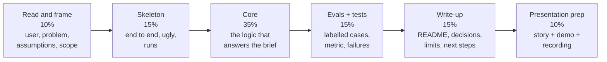
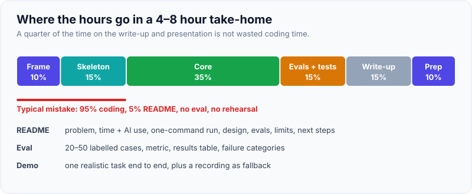
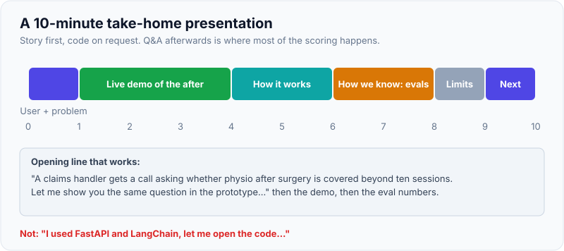

# Take-Home Project: Building, Writing Up & Presenting It

!!! abstract "Key takeaways"
    - A take-home is graded as a **small customer engagement**: did you frame the problem, scope sensibly, build something that runs, prove it works, explain trade-offs and present it to a mixed audience? Code is one signal of several.
    - **Respect the time box** and say how long you spent. Scope down to one user and one workflow; a working thin slice with tests and evals beats a half-built platform.
    - **The README is the deliverable** reviewers read first: problem and assumptions, how to run it in one command, design and trade-offs, how you evaluated it (with numbers), limitations, and what you'd do next.
    - For AI take-homes, **include an eval**: a small labelled set, a metric, a result, and the failure cases you found. Very few candidates do; it's the clearest seniority signal.
    - **Present a story, not a code tour**: the user's problem, a live demo of the "after", how you know it works, trade-offs, and next steps, in about 10 minutes, then defend decisions calmly in Q&A. Follow the company's **AI-use rules** exactly.

## Why it matters

Many FDE loops include a take-home followed by a presentation, or replace a coding screen with one (see [the interview loop](../fde-role-interview-loop/03-the-fde-interview-loop-mapped-screens-take-home-practical-co.md)). Candidate reports describe prompts such as "build a small RAG app over these documents", "integrate with this API and build a dashboard", "build an agent that does X with these tools", or a data-wrangling task with a write-up. Cognition has reportedly asked candidates to do the take-home inside its own agent product.

Take-homes are popular with FDE teams because they resemble the job: an ambiguous brief, limited time, real data or APIs, and a stakeholder to present to. They're also where strong engineers lose offers, by over-building, under-documenting, ignoring evaluation, or presenting a code walkthrough to a panel that wanted to hear about the user.

## Core concepts

### What graders look for

| Signal | Strong | Weak |
|---|---|---|
| Framing | States the user, the problem, assumptions and what's out of scope | Jumps into code; builds features nobody asked for |
| Working software | Runs with one command; handles the realistic edge cases | Doesn't run, or only on the author's machine |
| Code quality | Clear structure, seams where change is likely, tests on the core logic | Clever, over-abstracted or untested |
| Evidence it works | Tests plus an eval set with results and failure analysis | "It seems to work well" |
| Production thinking | Mentions auth, errors, retries, cost, latency, security, what changes for production | Ignores everything beyond the happy path |
| Communication | README and presentation tell a clear story to a mixed audience | Code tour; jargon; no trade-offs |
| Honesty | Time spent, limitations and AI use stated plainly | Overclaims, hides gaps |

### The plan for a typical 4–8 hour take-home


*Notice that write-up and presentation together are a quarter of the time. Candidates who spend 95% coding hand in something reviewers can't easily understand or run.*

{ loading=lazy }
*A quarter of the time on communication is part of the job, not overhead.*

If the brief says "about 4 hours", treat it as a real limit: reviewers calibrate against it, and many teams explicitly ask you not to exceed it. If you go over, say so in the README and say what you'd have cut.

### Scoping: one user, one workflow, one decision

The [prototyping page](../fde-practical-coding/07-rapid-full-stack-prototyping-typescript-service-plus-react-u.md) and [decomposition topic](../fde-decomposition-scoping/index.md) apply directly:

- Name the **user and the decision** the prototype supports in the first line of the README.
- Write the **assumptions** you made where the brief is silent (it always is, on purpose).
- Keep an explicit **out-of-scope** list: it shows you thought about those things and chose not to build them.
- Put **seams** where a real deployment would change things (data source, model provider, auth) and stub the rest honestly.

### Evals for AI take-homes

A minimal, credible eval:

1. **20–50 labelled cases** you created from the provided data (questions with the documents that answer them; inputs with expected extracted fields; tasks with expected end states), including a few hard and adversarial ones.
2. **One or two metrics** that match the task: retrieval recall@k and answer correctness for RAG; field-level accuracy for extraction; task success for an agent, run a few times each.
3. **Results in a table**, with the honest caveat that the set is small.
4. **Failure analysis**: three failure categories you found and what you'd do about each.
5. **A script** that re-runs it (`make eval`), so reviewers can see it isn't hand-waved.

See [evals](../fde-applied-llm/05-evals-golden-datasets-llm-as-judge-retrieval-vs-answer-metri.md).

### AI tools during the take-home

Policies differ and change. Anthropic's published candidate guidance (updated 2025) asks candidates to complete take-home assessments without Claude unless told otherwise, while encouraging AI for preparation; other companies allow or even require AI tools, and some evaluate how you use them. **Read the instructions, ask if unclear, and disclose what you used** in the README. If AI tools are allowed, you still own every line: be ready to explain any of it in the Q&A.

## In practice: the README and the presentation

### README template

```markdown
# Claims Policy Assistant (take-home)

**User and problem:** claims handlers spend minutes searching a 300-page policy manual for
reimbursement rules. This prototype answers policy questions with citations, for one user
role (claims handler), over the provided manual.

**Time spent:** ~6 hours (brief suggested 4–6). AI tools: [none | used X for Y, as allowed].

## Run it
    make setup && make run      # http://localhost:8000
    make test && make eval      # unit tests + eval report

## What it does (and doesn't)
- Answers questions with cited sections; says "not found" below a relevance threshold.
- Out of scope: per-user permissions (single role assumed), multi-document versioning, UI polish.

## Design
- Structure-aware chunking (section headings as breadcrumbs), hybrid retrieval (BM25 + vectors,
  reciprocal rank fusion), answer prompt requires citations, grounding check rejects unsupported
  answers. Model behind a small gateway so the provider can change.
- Key decisions and trade-offs: [3 bullets with the alternative you rejected and why]

## Evaluation
| Metric (40 labelled questions) | Result |
|---|---|
| Retrieval recall@8 | 0.93 |
| Answer correct (manual review) | 34/40 (85%) |
| Correct abstentions (6 unanswerable) | 5/6 |
Failures: (1) tables split across chunks, (2) questions using synonyms not in the manual,
(3) one answer cited the right section but overstated a limit. Fixes I'd try: [...]

## Production next steps
Auth + permission-aware retrieval, ingestion pipeline with versioning, larger eval set with
SME labels, monitoring (cost, latency, no-answer rate), deployment in the customer's cloud.

## Assumptions
- English only; manual is current; handlers have access to the whole manual.
```

### The presentation (about 10 minutes)

| Minute | Content |
|---|---|
| 0–1 | The user and the problem, in their words; what success looks like |
| 1–4 | **Live demo** of the "after": one realistic question or task, end to end (keep a recording as fallback) |
| 4–6 | How it works: one architecture diagram, two key decisions with the alternative you rejected |
| 6–8 | How you know it works: eval results, failure cases, what surprised you |
| 8–9 | Limitations and production next steps |
| 9–10 | What you'd ask the customer next |

Then Q&A, which is often longer than the presentation and where most of the scoring happens. Typical questions: "Why this chunking?", "What happens with 10,000 documents?", "How would you add permissions?", "What would you cut if you had half the time?", "Walk me through this function", "What did the AI tool write?". Answer briefly, admit limits, and connect back to the user.

{ loading=lazy }
*Open with the user's problem and the demo, not the framework.*

### Wrong vs right: opening the presentation

=== "❌ Common mistake"
    ```text
    "So, I used FastAPI for the backend, with a /query endpoint, and LangChain for the chain,
    and I used Chroma as the vector store with 512-token chunks... let me open the code and
    walk you through the files."
    - Starts with technology; no user; code tour; the panel loses the thread in minute one.
    ```

=== "✅ Correct approach"
    ```text
    "A claims handler gets a call asking whether physiotherapy after surgery is covered beyond
    ten sessions. Today she searches a 300-page manual. Let me show you the same question in the
    prototype... [demo: answer with two cited sections in about three seconds]. On 40 questions I
    labelled from the manual, it answered 85% correctly and refused 5 of 6 questions the manual
    doesn't cover. I'll show how it works, where it fails, and what I'd change for production."
    ```

## Real-world usage

- **Take-home + presentation** is reported in FDE loops at several AI companies and AI-native startups, sometimes replacing a coding screen; Cognition's loop reportedly includes a take-home done in its own agent product (candidate reports, so confirm with your recruiter).
- **AI-use policies vary:** Anthropic's candidate guidance asks for no AI on take-homes unless stated; other companies explicitly allow it or assess how candidates use AI. Disclosure is always safe; violating a stated policy is disqualifying.
- **Reviewers often run your code.** A missing dependency, an API key hard-coded or required without instructions, or a 20-step setup is a common, avoidable failure. Provide a one-command setup and a mock mode that runs without paid API keys if possible.

## Trade-offs & production gotchas

| Choice | Pros | Cons | Use when |
|---|---|---|---|
| Thin, working, evaluated slice | Clear signal, defensible | Fewer features | Almost always |
| Broad feature set | Looks impressive at first | Shallow, buggy, hard to defend | Never at the expense of working core |
| Heavy frameworks (agent/RAG frameworks) | Fast start | Hidden behaviour you must explain | When you know them well; otherwise plain code |
| Plain code with small seams | Easy to explain and test | A bit more typing | Default |
| Deployed demo URL | Easy for reviewers | Secrets, cost, availability | If allowed and cheap; always with local run instructions |

!!! warning "Gotcha: secrets and data"
    Never commit API keys; use `.env.example` and environment variables. Don't upload the company's provided data to public repos or third-party services unless the instructions allow it. Treat it like customer data, because they're watching whether you do.

!!! tip "Interview angle"
    Have a "with another day I'd…" list ready, ordered by impact on the user. It shows prioritisation and answers the inevitable "what would you do next?" in ten seconds.

## How this connects to my experience

- **Where it applies:** no take-home on the resume, but relevant skills: *"Built the ReactJS application from the ground up"* (OptumRx Meteor) for a fast UI; *"Established engineering standards around testing, CI/CD, code quality"* for tests and a one-command setup; *"Implemented Elasticsearch-powered search capabilities"* (Deloitte) for the retrieval half of a RAG take-home; Python listed in skills.
- **Talking points:**
    - "I'd treat the take-home like a two-day client prototype: one user, one workflow, working end to end, with an eval and a README a reviewer can run in one command."
    - Prepare a reusable skeleton (FastAPI or Node service, a minimal React UI, a test and eval harness, Makefile, Dockerfile) so setup costs minutes, not hours. *[confirm: your preferred stack for take-homes, given Java/Spring is your day-to-day]*
    - Honest gap: production LLM work. A practice take-home (permission-aware RAG or an MCP-based agent with evals) doubles as a portfolio piece. *[confirm once built]*
- **Likely follow-up chain:** "Walk me through your take-home" → "Why that approach?" → "How did you evaluate it?" → "How would it change for a real customer?". Answer with the user story, two decisions with rejected alternatives, the eval table and failures, and the production next-steps list (auth, permissions, ingestion, monitoring, deployment in their cloud).

## Interview questions

### Fundamentals

??? question "Q1. How do you approach a take-home with a vague brief?"
    **Answer:** Frame it like a customer engagement: name the user and decision, write assumptions and out-of-scope items, build a thin end-to-end slice first, then the core logic, then tests and an eval, leaving a quarter of the time for the write-up and presentation. Ask the recruiter a clarifying question if something critical is ambiguous.

    **Interviewer listens for:** framing, scoping and time allocation.

    **Common wrong answer:** "Build as many features as possible."

??? question "Q2. What goes in the README?"
    **Answer:** User and problem, time spent and AI use, one-command run and test instructions, what it does and doesn't do, design and key trade-offs, evaluation results and failures, limitations, production next steps, and assumptions.

    **Interviewer listens for:** run instructions, evals, limits.

    **Common wrong answer:** "Setup instructions."

??? question "Q3. Should you go over the suggested time?"
    **Answer:** Avoid it: reviewers calibrate to the time box and value judgement about what to cut. If you do exceed it, say how long you spent and what you would have cut to fit.

    **Interviewer listens for:** honesty and prioritisation.

    **Common wrong answer:** "Spend the whole weekend to make it perfect."

??? question "Q4. How do you show an AI prototype actually works?"
    **Answer:** A small labelled eval set from the provided data, task-appropriate metrics, a results table, failure categories with proposed fixes, and a script to re-run it. State that the set is small.

    **Interviewer listens for:** evidence beyond demos.

    **Common wrong answer:** "I tried it with a few questions."

### Intermediate

??? question "Q5. How do you structure the presentation?"
    **Answer:** User and problem, a live demo of the after, how it works with two key decisions, eval results and failures, limitations and next steps, and questions for the customer, in about ten minutes, leaving time for Q&A.

    **Interviewer listens for:** story first, code on request.

    **Common wrong answer:** A file-by-file code walkthrough.

??? question "Q6. AI tools: should you use them on a take-home?"
    **Answer:** Follow the company's stated policy exactly (some ask for none, some allow or assess it); ask if unclear; disclose what you used; and be able to explain every line you submit.

    **Interviewer listens for:** policy compliance and ownership.

    **Common wrong answer:** "Everyone uses them, so it doesn't matter."

??? question "Q7. What production concerns do you mention even if you didn't build them?"
    **Answer:** Auth and permissions, data handling and retention, error handling and retries, cost and latency, monitoring and evals in CI, deployment in the customer's environment, and ownership after handover.

    **Interviewer listens for:** awareness without over-building.

    **Common wrong answer:** None.

??? question "Q8. How do you make sure reviewers can run your code?"
    **Answer:** One-command setup (Makefile or script, pinned dependencies, Docker if helpful), environment variables with an example file, a mock mode or cached responses so it runs without paid keys, and testing a clean clone on a fresh machine before submitting.

    **Interviewer listens for:** empathy for the reviewer.

    **Common wrong answer:** "It works on my machine."

### Senior

??? question "Q9. In Q&A, an interviewer says your approach won't scale to 10 million documents. Respond."
    **Answer:** Agree with what's true, explain the scope choice, then show the path: incremental ingestion, a managed hybrid index with filters, ACL sync, batch embedding with throttling, index versioning, cost estimate. Show the design would change in specific components, not in its shape.

    **Interviewer listens for:** composure and a credible scaling path.

    **Common wrong answer:** Defending the prototype as production-ready.

??? question "Q10. What would you cut if you had half the time?"
    **Answer:** Keep the end-to-end slice, the core logic, a handful of eval cases and a short README; cut UI polish, secondary features, extra integrations and deployment. Say it in user-impact order.

    **Interviewer listens for:** prioritisation by user value.

    **Common wrong answer:** "The tests."

??? question "Q11. Your eval shows 70% accuracy. Do you hide it?"
    **Answer:** No: present it with the failure analysis and the fixes you'd try, and what accuracy the use case would need (with human review in the loop if not). Honest, analysed results are a stronger signal than an unverified claim of high accuracy.

    **Interviewer listens for:** honesty and analysis.

    **Common wrong answer:** Leaving the eval out.

### Scenario-based

??? question "Q12. Your live demo fails at the start of the presentation. What do you do?"
    **Answer:** Stay calm, say what happened, switch to the recording or screenshots, continue the story, and offer to debug or rerun at the end. Afterwards, note what you'd change in demo setup.

    **Interviewer listens for:** composure and a fallback.

    **Common wrong answer:** Debugging live for most of the slot.

??? question "Q13. A panellist asks you to explain a function you don't remember writing (AI-assisted). What now?"
    **Answer:** Read it aloud, explain what it does and why, and be honest that an assistant drafted it if that's the case (and if it was allowed). Better: never submit code you can't explain; review every line before submitting.

    **Interviewer listens for:** ownership of the code.

    **Common wrong answer:** Guessing confidently.

??? question "Q14. The brief asks for a 'production-ready' system in four hours. How do you respond?"
    **Answer:** Treat "production-ready" as a signal to show production thinking: a well-tested core, error handling, configuration, logging, a clear security and deployment section, and an explicit list of what production would still require, rather than trying to build everything.

    **Interviewer listens for:** realistic interpretation.

    **Common wrong answer:** Building half of everything.

## Cheat sheet

| Concept | Remember |
|---|---|
| Graded on | Framing, working code, quality, evidence, production thinking, communication, honesty |
| Time | Frame 10% · skeleton 15% · core 35% · evals/tests 15% · write-up 15% · presentation 10% |
| Scope | One user, one workflow, one decision; explicit out-of-scope list |
| README | Problem, time + AI use, one-command run, design + trade-offs, evals, limits, next steps, assumptions |
| Evals | 20–50 labelled cases, task metric, results table, failure categories, re-run script |
| Presentation | User → live demo → how it works → how we know → limits → next steps (~10 min) |
| AI tools | Follow the stated policy; disclose; own every line |
| Hygiene | No secrets, respect provided data, test a clean clone |

## Sources
1. [Anthropic: How to collaborate with Claude during our hiring process](https://www.anthropic.com/candidate-ai-guidance): take-homes without AI unless indicated; AI encouraged for preparation.
2. [Fortune: Anthropic updates candidate AI policy (July 2025)](https://fortune.com/2025/07/21/billion-dollar-giant-anthropic-ai-ban-hiring-policy-change-job-seekers-interview-process): policy context.
3. [Exponent: Cognition forward deployed engineer interview guide](https://www.tryexponent.com/guides/cognition-forward-deployed-engineer-interview): take-home and presentation format (candidate reports).
4. Related: [The FDE interview loop](../fde-role-interview-loop/03-the-fde-interview-loop-mapped-screens-take-home-practical-co.md), [Rapid prototyping](../fde-practical-coding/07-rapid-full-stack-prototyping-typescript-service-plus-react-u.md), [Evals](../fde-applied-llm/05-evals-golden-datasets-llm-as-judge-retrieval-vs-answer-metri.md), [Executive demos](../fde-customer-discovery/05-talking-to-executives-vs-engineers-demos-executive-pitch-sta.md).
