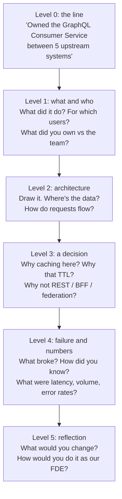
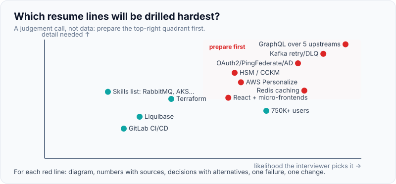

# Project Deep Dive: Defending Every Line of the Resume

!!! abstract "Key takeaways"
    - In a deep dive the interviewer picks **one project or one line** and drills **four or five levels** down: what it was → your part → a decision → why not the alternative → what broke → what you'd change. Anything on the resume is fair game.
    - **Audit every line before the loop.** For each claim, prepare the architecture you can draw, the numbers you can quote with their source, your specific decisions, one failure, and one thing you'd change. If you can't defend a line three levels down, **qualify it or remove it**.
    - Present a project with a fixed structure: **context and users → architecture (drawn) → your part → two or three key decisions with rejected alternatives → numbers → what went wrong → what you'd do differently**, in about 5 minutes, then follow the interviewer.
    - Separate **"I" from "we"** precisely; claim what you owned, credit what the team or architects did. Inflated ownership is the fastest way to fail a deep dive.
    - Respect confidentiality: describe architecture and scale, not client secrets, and say when you can't share a detail.

## Why it matters

The technical screen in many FDE loops is a past-work deep dive, and hiring managers return to the resume throughout the loop. The [loop page](../fde-role-interview-loop/03-the-fde-interview-loop-mapped-screens-take-home-practical-co.md) describes the format; [tell me about yourself and the project narrative](../leadership-behavioral/02-tell-me-about-yourself-and-project-deep-dive-narrative.md) covers the opening pitch. This page is about surviving the drill-down.

Deep dives are where consulting and services backgrounds get tested hardest: "led", "owned", "designed" and "established" are strong verbs, and interviewers check them by asking for decisions only the owner would know. They're also where resumes with long skills lists get exposed: a listed technology you used once will be the one the interviewer knows best.

## Core concepts

### How the drill-down works


*Notice that levels 3 and 4 are where unprepared candidates stall: decisions need reasons and rejected alternatives, and failures need specifics. Prepare those for every major line.*

{ loading=lazy }
*Levels 3 and 4 need reasons and numbers you've prepared.*

### The deep-dive presentation structure (about 5 minutes)

| Part | Time | Content |
|---|---|---|
| Context | 30 s | Business, users, scale, why it mattered |
| Architecture | 90 s | Draw it: components, data flow, integrations, where it runs |
| Your part | 30 s | What you owned, decided and built; what others did |
| Key decisions | 90 s | 2–3 decisions, each with the alternative and why you rejected it |
| Results | 20 s | Numbers with sources (latency, volume, reliability, delivery) |
| What went wrong | 30 s | One real failure or limitation and how you handled it |
| What you'd change | 20 s | With hindsight, and as an FDE |

Practise drawing the architecture in under two minutes on a blank page, from memory.

### Line-by-line audit of this resume

The claims below are verbatim from the resume. For each: the probes you should expect, the evidence you need ready, and a risk rating (how likely the interviewer is to go deep × how much detail you need). Fill every *[confirm]* before any loop.

**Publicis Sapient: OptumRx Meteor (Jan 2023–present)**

| Claim | Likely probes | Evidence to have ready | Risk |
|---|---|---|---|
| "Led a cross-functional team of 8–10 engineers … serving 750K+ users" | Team shape? Your role vs a manager's? Where does 750K come from (registered, monthly active)? | Org chart, your responsibilities, the user metric's definition and source *[confirm]* | High |
| "Owned the GraphQL Consumer Service end-to-end … 5 upstream systems and multiple downstream consumers" | Draw it. Which upstreams? Schema design? N+1 and batching? Error handling when one upstream fails? Federation vs single graph? | Architecture diagram, upstream list by domain, DataLoader/batching approach, partial-failure policy, latency numbers *[confirm all]* | **Very high** |
| "Collaborated with senior architects to design … API strategies, and data integration patterns" | What did you contribute vs the architects? A decision you influenced? | One concrete decision you drove *[confirm]* | Medium |
| "Microservices using Java, Spring Boot, Kafka, MongoDB, Redis, and GraphQL" | Why MongoDB? Consistency choices? Spring Boot version? | Data model rationale, versions *[confirm]* | Medium |
| "Redis-based caching for frequently accessed queries and UI reference data" | What was cached, keys, TTLs, invalidation, hit rate, PHI in cache? | Cache design and a hit-rate or latency number *[confirm]* | High |
| "Secure enterprise APIs using OAuth2, PingFederate, and Active Directory" | Which grant types? Token validation? Scopes vs AD groups? Service-to-service auth? | Token flow diagram *[confirm]* | High |
| "Kafka-based event-driven workflows with retry and DLQ handling" | Topics and partition keys? Retry topics vs blocking retries? Idempotency? DLQ replay process? | Flow diagram, retry config, a DLQ incident *[confirm]* | **Very high** |
| "Built the ReactJS application from the ground up and established a micro-frontend architecture" | Why micro-frontends? Module Federation or other? Shared state, design system? Was it worth it? | Decision and trade-offs, build tooling *[confirm]* | High |
| "Established engineering standards around testing, CI/CD, code quality, and deployment practices" | Which standards? How did you get buy-in? Evidence they helped? | 2–3 standards and a before/after *[confirm]* | Medium |

**Deloitte: ConvergeHealth Data Asset Explorer (Jun 2021–Jan 2023)**

| Claim | Likely probes | Evidence | Risk |
|---|---|---|---|
| "Lambda, EC2, ECS, EKS, API Gateway, RDS, DynamoDB, SQS, SNS, and S3" | Why so many compute options? Which did *you* build on? | Which services you personally used and why *[confirm]*; consider trimming to the ones you can defend | High |
| "Automated infrastructure provisioning … using Terraform" | Module structure, state management, environments, drift | Your Terraform layout *[confirm]* | Medium |
| "Elasticsearch-powered search capabilities and Liquibase migration strategies" | Index design, analysers, relevance tuning; Liquibase rollback, expand/contract | One search design decision; migration approach *[confirm]* | Medium |
| "Integrated AWS Personalize recommendation services" | What was recommended, data, training vs integration, how measured | Honest scope: integrated vs trained *[confirm]* | High for AI roles |
| "Security controls using IAM, KMS, and Secrets Manager" | Least-privilege design, key policies, rotation | One concrete control *[confirm]* | Medium |

**Coriolis: CipherTrust Cloud Key Management (Jul 2018–Jun 2021)**

| Claim | Likely probes | Evidence | Risk |
|---|---|---|---|
| "Key management capabilities supporting AWS, Azure, and GCP" | BYOK vs HYOK, differences between the three KMS models, what you built | The feature you built and cloud differences *[confirm]* | High |
| "Automated key rotation workflows and HSM integrations using Thales Luna and SafeNet" | Rotation semantics, failure handling mid-rotation, HSM APIs (PKCS#11?) | A rotation flow and one failure mode *[confirm]* | High |
| "REST APIs using Spring Boot … GitLab CI/CD" | API design, pipeline stages | Brief | Low |

**Johnson Controls: Metasys (Aug 2017–Jul 2018)**

| Claim | Likely probes | Evidence | Risk |
|---|---|---|---|
| "Owned JWT-based authentication and SSO implementation end-to-end" | Signing algorithm, token lifetime, refresh, revocation, SSO protocol | Design details *[confirm]*; it was a trainee role, so be precise about scope | High |
| "Contributed to the migration of a legacy monolithic application to microservices" | Your part, strangler approach, data migration | Your specific contribution *[confirm]* | Medium |

**Skills section:** every listed item is a potential probe. Python, RabbitMQ, Azure/AKS, Jenkins, Hibernate/JPA, PostgreSQL/MySQL, DynamoDB, Redux, React Query, Material UI, Storybook. For each, know where you used it and at what depth. Consider grouping into "production experience" and "working knowledge" so the claim matches the reality *[confirm]*.

{ loading=lazy }
*A judgement call: prepare the red dots before anything else.*

### Numbers: know them, source them, label estimates

| Number type | Example question | How to answer |
|---|---|---|
| Scale | "How many requests per second?" | A figure and its source, or "roughly X at peak, from our dashboards; I'd need to check exact numbers" |
| Performance | "What was p95 latency?" | p95/p99, not average, and for which endpoint |
| Reliability | "How often did it fail?" | Incidents per quarter, error rate, DLQ volume |
| Delivery | "How long did it take?" | Weeks/sprints, team size |
| Impact | "What changed for users?" | Business metric with baseline |

If you don't know a number, say so and give an honest estimate labelled as one. Inventing a number is worse than not knowing it: the next question will expose it.

### "I" vs "we"

| Say "I" for | Say "we" for |
|---|---|
| Decisions you made or drove | Work the team built |
| Code and designs you personally produced | Outcomes the team achieved |
| Conversations you led (with clients, architects, upstream teams) | Processes you participated in |

When the honest answer is "the architect decided that; I implemented it and raised a concern about X", say exactly that. It reads as credible, not weak.

## In practice: rehearsing a deep dive

### A worked opening for the flagship project (fill the blanks)

```text
Context:  "OptumRx Meteor is [confirm: what the product does] for [confirm: user type], about
           750K users. My team of 8-10 owned [confirm scope]."
Draw:     Clients (React app, micro-frontends) → GraphQL Consumer Service (Spring Boot)
           → 5 upstream systems [confirm: domains, protocols]; Redis for reference data;
           Kafka for [confirm: which workflows]; OAuth2 via PingFederate, AD groups.
My part:  "I owned the consumer service end to end: schema, resolvers, integration patterns,
           production support. Architects set [confirm: platform-level decisions]."
Decisions:
  1. "[confirm] Batching and caching per upstream instead of [alternative], because [reason]."
  2. "[confirm] Retry topics + DLQ for [flow] instead of blocking retries, because ordering
      wasn't required per key and we couldn't block the partition."
  3. "[confirm] Micro-frontends because [teams/release cadence], at the cost of [complexity]."
Numbers:  "[confirm: p95 latency, request volume, consumers, incidents]"
Failure:  "[confirm: an incident or wrong decision and the fix]"
Change:   "[confirm] I'd introduce contract tests per upstream earlier. As an FDE I'd also own
           the discovery with the end customer directly and feed integration patterns back."
```

### Wrong vs right: answering a level-3 question

=== "❌ Common mistake"
    ```text
    Q: "Why did you use Redis there?"
    A: "Redis is fast and it's an industry standard for caching. It's in-memory so it's much
        faster than the database."
    - Generic; no context; no alternative considered; no numbers; no trade-off.
    ```

=== "✅ Correct approach"
    ```text
    A: "[confirm details] Reference data such as [type] came from an upstream with ~800 ms p95
        and rate limits, and every screen needed it. Options were an in-process cache per pod,
        Redis, or asking the upstream for a faster endpoint. In-process caches would have
        diverged across pods and multiplied upstream calls on scale-out; the upstream team had
        no capacity that quarter. Redis gave one shared copy with a [confirm] TTL, which the
        business accepted as staleness. Member-specific PHI was not cached. Result: [confirm
        number]. The cost was another component to run and invalidation on [event]; I'd revisit
        if the upstream offered change events."
    ```

### Mock deep-dive checklist

```yaml
for_each_major_line:
  - can_draw_architecture_in_2_min: true
  - my_part_vs_team_part: "<written>"
  - decisions_with_alternatives: ["<decision> over <alternative> because <reason>"]
  - numbers_with_sources: ["<metric>: <value> (<source>)"]
  - one_failure_and_fix: "<incident or wrong call>"
  - would_change: "<hindsight>"
  - fde_translation: "<how I'd do it as an FDE>"
  - confidentiality_notes: "<what I can't share>"
```

## Real-world usage

- **FDE technical screens** are commonly past-work deep dives (prep-site and candidate reports), and hiring managers use them to check ownership claims and technical depth in one conversation.
- **Amazon-style "dive deep"** probing (asking for specifics until the candidate either shows command of the details or doesn't) is widely imitated; expect "how do you know?" and "what was the number?" on any claim.
- **Services backgrounds** are tested on ownership verbs ("led", "owned", "designed"); answers that separate personal decisions from team and architect decisions read as trustworthy.

## Trade-offs & production gotchas

| Choice | Pros | Cons | Use when |
|---|---|---|---|
| Long skills list | Keyword matching | Every item is a probe | Only items you can defend at level 2 |
| "Production" vs "working knowledge" grouping | Honest, sets expectations | Fewer headline skills | Recommended for deep-dive-heavy loops |
| Precise ownership claims | Credible | Less impressive-sounding | Always |
| Estimated numbers, labelled | Honest | Less precise | When exact figures are unknown or confidential |

!!! warning "Gotcha: the line you forgot about"
    Interviewers often pick the least-defended line on purpose: the older project, the cloud service you used once, the skill near the end of the list. Prepare the whole page, not just the flagship project.

!!! tip "Interview angle"
    When you hit the edge of your knowledge, say so and reason forward: "I didn't own the Kafka cluster configuration, so I don't know the exact replication settings, but here's what I'd expect and how I'd check." That earns more credit than a confident guess.

## How this connects to my experience

- **Where I used it:** this whole page is the resume. Highest-risk lines to prepare first: the GraphQL Consumer Service over 5 upstreams, Kafka retry/DLQ workflows, Redis caching, OAuth2/PingFederate/AD (OptumRx Meteor); AWS Personalize (Deloitte, because AI roles will probe it); HSM integrations and multi-cloud key management (Coriolis).
- **Talking points:**
    - Flagship deep dive: OptumRx Meteor integration layer, using the worked opening above. *[confirm every blank]*
    - AI-adjacent deep dive: AWS Personalize at Deloitte, with honest scope (integration vs training) *[confirm]*.
    - Security deep dive: CCKM key rotation and HSMs, a strong differentiator for enterprise AI deployments with customer-managed keys *[confirm]*.
    - Decide now which skills to keep, group or remove based on what you can defend *[confirm]*.
- **Likely follow-up chain:** "Walk me through the GraphQL service" → "Draw it" → "How did you handle one upstream being slow or down?" → "What was your p95?" → "What would you change?" → "How would you add an LLM feature to it for a customer?". The last one connects to the [FDE system design framework](../fde-system-design/01-fde-system-design-framework-customer-context-deployment-cons.md): an assistant over the service's data, permission-aware via existing OAuth2 scopes, rolled out shadow → assist.

## Interview questions

### Fundamentals

??? question "Q1. Walk me through the project you're most proud of."
    **Answer:** Five minutes with the structure: context and users, architecture drawn, your part, two or three decisions with rejected alternatives, numbers with sources, one failure, what you'd change. Then let the interviewer steer.

    **Interviewer listens for:** structure, ownership clarity, decisions with reasons.

    **Common wrong answer:** A chronological story of the project with no decisions.

??? question "Q2. What exactly did you do versus your team?"
    **Answer:** Name your decisions, designs and code specifically, then what the team built and what architects or managers decided, without diminishing anyone. Use "I" and "we" precisely.

    **Interviewer listens for:** precision.

    **Common wrong answer:** "We did everything together."

??? question "Q3. Where does the 750K users number come from?"
    **Answer:** The definition (registered, monthly active, members covered) and source (product analytics, client reporting), or an honest "that's the client's reported user base; I don't have the active-user split". Never inflate.

    **Interviewer listens for:** knowing what your numbers mean.

    **Common wrong answer:** "That's how many users we had."

??? question "Q4. Draw the architecture of your system."
    **Answer:** Clients, the service you owned, upstream systems and protocols, data stores and caches, messaging, identity, where it runs; then trace one request end to end and point out where it can fail.

    **Interviewer listens for:** command of the system and a request trace.

    **Common wrong answer:** Generic boxes with no flows.

### Intermediate

??? question "Q5. Why did you choose X over Y?"
    **Answer:** The context, the options considered, the criteria (latency, team skills, cost, constraints), the decision and its cost, and when you'd revisit it. If someone else decided, say so and explain the reasoning as you understood it.

    **Interviewer listens for:** alternatives and trade-offs.

    **Common wrong answer:** "X is best practice."

??? question "Q6. What went wrong on this project?"
    **Answer:** A real failure or limitation (an incident, a wrong assumption, a decision that didn't age well), how it was detected, what you did, and what changed because of it.

    **Interviewer listens for:** honesty and learning.

    **Common wrong answer:** "Nothing major."

??? question "Q7. You list a technology you used only briefly. The interviewer asks a deep question about it. What do you do?"
    **Answer:** Be upfront about the depth ("I used it for X over a few months; I didn't operate it at scale"), answer what you know, reason about the rest out loud, and offer how you'd find out. Then update the resume.

    **Interviewer listens for:** honesty under pressure.

    **Common wrong answer:** Bluffing.

??? question "Q8. How do you handle confidential client details in a deep dive?"
    **Answer:** Describe domain, scale, architecture and decisions in general terms; anonymise names and numbers you can't share; say explicitly when you can't share something. Interviewers expect this from consultants.

    **Interviewer listens for:** professionalism.

    **Common wrong answer:** Sharing confidential details to impress.

### Senior

??? question "Q9. With hindsight, what would you design differently?"
    **Answer:** One or two specific changes with reasons grounded in what happened (contract tests per upstream earlier, a different caching strategy, simpler frontend architecture), and what you'd keep. Shows you learn from production.

    **Interviewer listens for:** specific, evidence-based reflection.

    **Common wrong answer:** "Nothing, it went well" or a total rewrite.

??? question "Q10. How would you do this project as an FDE at our company?"
    **Answer:** Own discovery with the end customer directly, define the outcome metric up front, build the integration in their environment with their identity and security constraints, measure adoption and impact after go-live, hand over to their team, and feed reusable patterns back to the product.

    **Interviewer listens for:** translating services experience into the FDE model.

    **Common wrong answer:** "The same way."

??? question "Q11. What was the hardest technical problem on this project?"
    **Answer:** A specific problem (not a list), why it was hard, the approaches tried, what worked, the numbers before and after, and what you learned.

    **Interviewer listens for:** depth on one problem.

    **Common wrong answer:** "Integration in general."

### Scenario-based

??? question "Q12. The interviewer challenges a decision you made as clearly wrong. How do you respond?"
    **Answer:** Listen, restate their concern, explain the context and constraints at the time, acknowledge what you'd do differently with what you know now, and engage with their alternative on its merits. Don't get defensive, don't fold immediately.

    **Interviewer listens for:** composure and intellectual honesty.

    **Common wrong answer:** Arguing or abandoning the decision instantly.

??? question "Q13. You realise mid-answer that a number on your resume is overstated. What do you do?"
    **Answer:** Correct it on the spot ("I should be precise: that figure is the total member base, active users were lower") and update the resume afterwards. Self-correction builds credibility; being caught later destroys it.

    **Interviewer listens for:** integrity.

    **Common wrong answer:** Hoping they don't notice.

??? question "Q14. The interviewer asks you to deep-dive a project you were only on briefly. How do you handle it?"
    **Answer:** Say how long you were on it and your role, go deep on the part you did own, describe the rest at the level you know, and offer to go deeper on a project you owned more fully.

    **Interviewer listens for:** honest scoping.

    **Common wrong answer:** Pretending to have owned all of it.

## Cheat sheet

| Concept | Remember |
|---|---|
| Drill-down | Line → what/who → architecture → decision → failure/numbers → reflection |
| Presentation | Context · architecture (drawn) · my part · 2–3 decisions with alternatives · numbers · failure · change (~5 min) |
| Audit | Every line: diagram, numbers + source, decisions, failure, change, FDE translation |
| Highest-risk lines | GraphQL over 5 upstreams; Kafka retry/DLQ; Redis caching; OAuth2/PingFederate/AD; Personalize; HSM/CCKM |
| Numbers | Definition + source; label estimates; never invent |
| I vs we | "I" for decisions and work you did; "we" for the team; credit architects |
| Skills list | Keep only what you can defend; consider production vs working knowledge |
| Edge of knowledge | Say so, reason forward, say how you'd find out |

## Sources
1. [Amazon: Interview guide](https://www.aboutamazon.com/news/workplace/amazon-interview-guide): past-experience questions with specifics and measurable results.
2. [Amazon: Leadership Principles (Dive Deep)](https://www.amazon.jobs/content/en/our-workplace/leadership-principles): staying connected to details, auditing frequently.
3. [Exponent: Forward deployed engineer interview guides](https://www.tryexponent.com/guides/cognition-forward-deployed-engineer-interview): technical screen and past-work deep dive formats (candidate reports).
4. Related: [Tell me about yourself and project narrative](../leadership-behavioral/02-tell-me-about-yourself-and-project-deep-dive-narrative.md), [Positioning a consulting background](../fde-role-interview-loop/04-positioning-a-consulting-and-services-background-for-fde.md), [FDE story bank](01-fde-story-bank-ambiguity-no-docs-systems-scope-pushback-clie.md).
