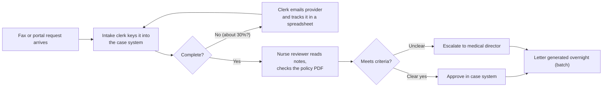
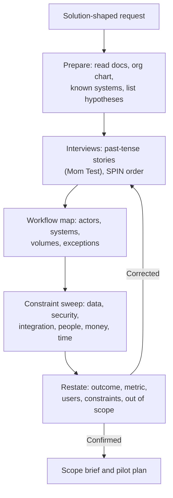

# Discovery Interviews: Workflow Mapping, Hidden Constraints, Restating the Real Need

!!! abstract "Key takeaways"
    - **The first request is a proposed solution, not the problem.** "We need a chatbot" is a guess at a fix. Your job is to find the workflow, the pain, the cost of the pain and the person who feels it, then decide what (if anything) to build.
    - **Ask about the past, not the future** (*The Mom Test*): "Walk me through the last time this happened" beats "Would you use a tool that…?". Compliments, hypotheticals and wishlists are bad data.
    - **Map the workflow as it really runs:** actors, systems of record, hand-offs, volumes, exceptions and workarounds (the spreadsheet on someone's desktop). The exceptions are where the value and the risk sit.
    - **Hunt for hidden constraints on purpose.** Data access and residency, security and compliance (PHI, PCI), integration limits, who signs off, the date that really matters, and the people whose jobs change. In the customer simulation round the interviewer usually hides one of these.
    - **Restate before you solve:** "So the outcome is X, measured by Y, for these users, within constraints Z. Did I get that right?" A correction here is cheap. The same correction after a two-week build is expensive.

## Why it matters

FDE roles exist because AI and data products usually fail at the last mile, not in the model. Palantir splits its field teams into **Deployment Strategists ("Echo")**, who work out what the most important problem is, and **Forward Deployed Engineers ("Delta")**, who build it. Both roles are described as a mix of product manager, engineer and strategist ([Palantir blog](https://blog.palantir.com/a-day-in-the-life-of-a-palantir-deployment-strategist-951cb59a5a96)). PostHog's FDE handbook says the same in 2026 terms: now that AI makes code cheap, the FDE's value is *judgement*, "helping them find the root of their problem" ([PostHog handbook](https://posthog.com/handbook/forward-deployed-engineering/overview)).

The industry data points the same way:

- Gartner predicted in 2024 that **at least 30% of GenAI projects would be abandoned after proof of concept** by the end of 2025, citing poor data quality, weak risk controls, rising costs and **unclear business value** ([Gartner, via Intelligent CIO](https://www.intelligentcio.com/eu/2024/08/05/gartner-predicts-30-of-generative-ai-projects-will-be-abandoned-after-proof-of-concept-by-end-of-2025/)).
- MIT NANDA's 2025 *GenAI Divide* report (as reported by Fortune) found most enterprise GenAI pilots showed no measurable P&L impact, and blamed a "learning gap": generic tools that don't fit real workflows ([Fortune](https://fortune.com/2025/08/18/mit-report-95-percent-generative-ai-pilots-at-companies-failing-cfo/)). Treat the headline 95% as a finding from that study's sample, not a universal rate.

Both failure causes ("unclear value", "doesn't fit the workflow") are discovery failures. In interviews, this skill is tested directly in the **customer simulation round** (see [page 6](06-customer-simulation-round-role-play-scenarios-and-how-they-a.md)), where prep sites and candidate reports describe an interviewer playing a stakeholder with a vague ask and a constraint they don't volunteer ([Valletta FDE JD template](https://vallettasoftware.com/blog/post/forward-deployed-engineer-job-description), [techinterview.org](https://www.techinterview.org/post/3233477236/forward-deployed-engineer-interview/)). Weaker candidates solve before they clarify ([FDE Academy](https://fde.academy/blog/common-reasons-candidates-fail-forward-deployed-engineer-interviews)).

## Core concepts

### The request is a hypothesis

Customers arrive with **solution-shaped requests**: "a chatbot for our support team", "a RAG over our policy PDFs", "an agent that does claims". Each one contains a guess about the cause of a pain they haven't fully described. Treat it as a hypothesis to test, not a spec.

| What they say | What it usually hides | What to ask |
|---|---|---|
| "We need a chatbot." | Agents spend too long finding answers, or customers can't self-serve, or ticket volume spiked after a change | "What happens today when a customer asks that? Walk me through the last one." |
| "Make it real time." | One report is stale at 9 a.m. for one manager | "Who looks at it, when, and what do they do differently if it's an hour old?" |
| "It must be 99% accurate." | Fear of a specific embarrassing error | "What's the worst mistake it could make? What happens today when a human makes it?" |
| "Integrate with everything." | One system of record matters, the rest are nice to have | "If it only read from one system, which one?" |

This mirrors the **jobs-to-be-done** idea: people "hire" a product to make progress in a specific situation, so you study the situation and the progress, not the product they named (Christensen et al., *Competing Against Luck*).

### The Mom Test: getting honest data

Rob Fitzpatrick's *The Mom Test* is written for founders but it is the clearest guide to discovery conversations. Its three rules:

1. **Talk about their life, not your idea.** As soon as you pitch, they start judging and being polite.
2. **Ask about specifics in the past, not generics or opinions about the future.** "How did you handle the last one?" not "Would you…?".
3. **Talk less, listen more.**

It also names the three kinds of **bad data**:

- **Compliments** ("That sounds great!"), which Fitzpatrick calls "the fool's gold of customer learning".
- **Fluff:** generic claims ("I usually…", "I always…") and hypotheticals ("I would definitely…").
- **Ideas and feature requests:** worth noting, but dig for the motivation behind them ("Why do you want that? What would it let you do?").

!!! tip "Deflect, then dig"
    When a stakeholder says "it would be great if it also summarised calls", don't write it down as a requirement. Ask: "When did you last need a call summary? What did you do instead? What did that cost?". If there was no recent case, it's a wish, not a need.

### SPIN: a sequence that gets to value

Neil Rackham's *SPIN Selling* came from studying more than 35,000 sales calls. Its four question types give discovery a useful order:

| Stage | Purpose | FDE example |
|---|---|---|
| **S**ituation | Facts about the current state (keep these few; read the docs beforehand) | "Which system holds the prior-auth requests? How many a day?" |
| **P**roblem | Difficulties and dissatisfaction | "Where do requests get stuck? Which step do your nurses hate?" |
| **I**mplication | The consequences, which turn a problem into a priority | "When a request waits three days, what happens to the patient? To your SLA penalties?" |
| **N**eed-payoff | The customer states the value of solving it | "If reviewers only touched the 20% that need judgement, what would that free up?" |

Rackham found need-payoff questions were most strongly linked to successful outcomes, because the buyer states the value in their own words. For an FDE that sentence is gold: it becomes the success metric in your [scope brief](02-writing-the-scope-brief-success-criteria-assumptions-out-of.md).

### Workflow mapping

Interviews give opinions. A workflow map gives facts. Borrow from **contextual inquiry** (Beyer & Holtzblatt, *Contextual Design*): sit with the user as an apprentice and watch them do the real task, asking "why did you do that?" as they go. When you can't sit with them, ask them to share their screen and walk through the last real case.

Capture six things for every step:

1. **Actor:** who does it (role, not name), and how many of them there are.
2. **Trigger and input:** what starts it and what arrives (a fax, an email, a queue item, a CSV).
3. **System:** which system of record is read or written, and how (UI, API, export).
4. **Decision:** what judgement is applied, using which rules or documents.
5. **Volume and time:** how many per day and how long each takes (touch time vs wait time).
6. **Exceptions and workarounds:** what goes wrong, and the side spreadsheet or email thread that holds the process together.


*Notice where the value and the risk sit: the incomplete-request loop and the side spreadsheet (a cheap, high-volume win), the nurse's policy lookup (a good LLM assist) and the overnight batch letter (a hidden constraint on any "real-time" promise). The numbers are placeholders to confirm with the customer.*

Once the map exists, quantify it. If 400 requests arrive a day, 30% are incomplete and each incomplete one costs 25 minutes of chasing, that's about 50 staff-hours a day. That number, not "a chatbot", is what earns a pilot.

### Hidden constraints

A hidden constraint is anything that would kill or reshape the solution and that the stakeholder won't mention unless asked. Usually they aren't hiding it: it's so normal to them that they forget it matters. Work through the categories on purpose:

| Category | Examples | Question that surfaces it |
|---|---|---|
| **Data access** | Data lives in a mainframe with a nightly extract. No API. Records are scanned PDFs | "How would *you* get last month's data out today? Who would you ask?" |
| **Data sensitivity and residency** | PHI or PCI data, EU-only processing, no data to third-party model providers | "Is there anything about this data that legal or security would worry about?" |
| **Security and deployment** | Must run in the customer VPC or on-prem, no internet egress, SSO only, a 6-week security review | "What did the last vendor have to go through before they got access?" |
| **Integration** | System of record is read-only for vendors. Change freeze in Q4. Batch windows | "Which systems would this need to write back to? Who owns them?" |
| **People and politics** | The team whose work is automated, a union, a sponsor leaving, a rival internal project | "Who else has tried to fix this? What happened?" |
| **Decision and money** | Budget is set in the next fiscal year. Procurement needs three quotes | "If the pilot works, what happens next, and who decides?" |
| **Time** | A regulatory deadline or contract renewal that is the real date | "What happens if this isn't live by then? Why that date?" |
| **Quality bar** | One error type is unacceptable (a wrong dose, a wrong account) | "What's the mistake that would get this switched off?" |

!!! question "Interview angle"
    In a customer simulation you won't have time for every category. Ask one sweeping question early ("What would make this a non-starter for your security, legal or IT teams?") and one late ("Is there anything we haven't talked about that would stop this going live?"). Interviewers report that the hidden constraint usually surfaces only when asked directly.

### Who to talk to

One stakeholder gives you one view. A typical enterprise engagement needs at least:

- **Economic buyer or sponsor:** owns the budget and the business outcome. Gives you the "why now" and the success metric.
- **Champion:** wants this to work and will pull you through the organisation.
- **End users:** do the work every day. They know the exceptions and workarounds.
- **IT, security and data owners:** they own the constraints and can block go-live.
- **The skeptic or blocker:** often the team whose work changes. Meet them early; ignoring them is how pilots die quietly.

### Restating the real need

After discovery, play it back before proposing anything. A good restatement has five parts:

> "Let me check I've got this right. **Today**, intake clerks spend most of their time chasing incomplete requests (the workflow). **That** pushes approvals past your 72-hour target, which drives penalties and complaints (the implication). **Success** would be cutting incomplete-request chasing by half within a quarter, measured in your case system (the metric). It **has to** stay inside your Azure tenant, and nothing can auto-approve: a nurse signs every decision (the constraints). **Out of scope** for now is the letter generation. Is that right? What did I miss?"

This uses two techniques from negotiation practice. **Labelling** ("It sounds like the overnight batch is a big frustration") invites the stakeholder to correct or expand. **Calibrated "what" and "how" questions** ("What would make this a failure for you?") keep them talking instead of answering yes or no (Chris Voss, *Never Split the Difference*). The final "what did I miss?" is the most important line: it gives them permission to reveal the constraint they've been sitting on.


*Notice the loop from "Restate" back to "Interviews". A correction during playback is the process working, not failing. Only a confirmed restatement turns into a [scope brief](02-writing-the-scope-brief-success-criteria-assumptions-out-of.md).*

## In practice: code & configuration

The FDE "code" for discovery is a set of reusable artifacts. Keep them in your engagement repo next to the real code.

### Discovery question bank

```text
OPENERS (situation, keep short; do homework first)
- What prompted you to look at this now? Why this quarter?
- Who is involved in this process today, and roughly how many people?

WORKFLOW (past, specific)
- Walk me through the last time this happened, from the moment it arrived.
- Can you share your screen and show me the last one you worked?
- Where does the information come from? Where does it go next?
- What happens when it goes wrong? When did that last happen?
- Is there a spreadsheet, inbox or doc that holds this together?

PROBLEM AND IMPLICATION
- Which step takes the longest? Which one do people avoid?
- What does a delay or error here cost you: money, SLA, risk, people?
- What have you already tried? Why didn't it stick?

VALUE (need-payoff)
- If this step took a tenth of the time, what would your team do instead?
- How would you know, in numbers, that this worked?

CONSTRAINT SWEEP
- What data can we use, and how would you get it to us today?
- What would security, legal or compliance need to see first?
- Where must this run? Any limits on which model providers can see the data?
- Which systems does it need to write back to, and who owns them?
- What's the mistake that would get this switched off?
- What happens if this isn't live by <date>? Why that date?

DECISION
- If the pilot works, what happens next? Who decides, and on what evidence?

CLOSE
- Let me play back what I heard... What did I miss?
- Who else should I talk to? Can you introduce me?
```

### Workflow map template

```text
| # | Step                  | Actor (count) | System / interface      | Volume/day | Touch time | Exceptions / workarounds         |
|---|-----------------------|---------------|-------------------------|------------|------------|----------------------------------|
| 1 | Request intake        | Clerk (12)    | Fax -> case system (UI) | ~400       | 6 min      | ~30% incomplete -> email + XLS   |
| 2 | Clinical review       | Nurse (20)    | Case system + policy PDF| ~280       | 18 min     | Policy PDFs out of date          |
| 3 | Escalation            | MD (3)        | Email                   | ~40        | 30 min     | No tracking; lost in inboxes     |
| 4 | Letter                | Batch job     | Nightly batch           | all        | n/a        | Can't be sent same day           |
All numbers are hypotheses until confirmed against system data.
```

### A discovery exchange: wrong vs right

=== "❌ Common mistake"
    ```text
    Customer: We want a chatbot for our nurses to answer policy questions.
    FDE:      Great, we can do that with RAG. We'll index the policy PDFs into a
              vector store, use GPT-class models, and add citations. Two weeks?
    Customer: Sounds great!
    -- Pitched in the first minute, accepted the solution, collected a
       compliment, and never learned that the PDFs are out of date, the data
       can't leave the Azure tenant and the real delay is incomplete intake.
    ```

=== "✅ Correct approach"
    ```text
    Customer: We want a chatbot for our nurses to answer policy questions.
    FDE:      Happy to look at that. Before I suggest anything, can you walk me
              through the last request a nurse found hard?
    Customer: Yesterday one took 40 minutes. The policy PDF was outdated, so she
              called the medical director.
    FDE:      How often does that happen? And where does most of the waiting
              happen overall?
    Customer: Honestly, the big delay is intake. A third of requests are missing
              documents, and the clerks chase them by email.
    FDE:      It sounds like the policy lookup is painful, but intake is where the
              days are lost. If we could only fix one this quarter, which matters
              more to your 72-hour target?
    Customer: Intake.
    FDE:      Anything about this data security would worry about?
    Customer: It's PHI. It has to stay in our Azure tenant.
    FDE:      Let me play that back... (restatement). What did I miss?
    ```

## Real-world usage

- **Palantir:** Echo postings describe "synthesizing disconnected streams of thought into a cohesive understanding of what the most important problem is" ([Palantir Deployment Strategist posting](https://jobs.lever.co/palantir/7fe8d9e5-9c33-4548-8efd-9f0a6c863ec6)). Discovery is a role, not a meeting.
- **OpenAI:** FDE postings measure success through "production adoption, measurable workflow impact, and eval-driven feedback", which makes the workflow and its metric the unit of work ([OpenAI careers](https://openai.com/careers/forward-deployed-software-engineer-sf/)).
- **Cognition:** a 2026 AI Engineer talk on FDE at Cognition contrasts token-usage targets with measurable customer outcomes, such as a customer-reported 82% timeline reduction on a migration ([AI Engineer talk](https://ai.engineer/talks/how-forward-deployed-engineering-is-done-at-cognition)). Measuring the right outcome starts with discovering which one matters.
- **Healthcare and banking:** in regulated domains the hidden constraint is usually data: PHI under HIPAA, card data under PCI DSS, residency rules, or a model-provider allow-list. Ask about it in the first meeting, not after the demo.
- **Failure mode:** the "demo-driven pilot". A team builds what the sponsor described, users never adopt it because it doesn't match the real workflow, and the pilot is quietly shelved. This is exactly the "learning gap" the MIT report describes.

## Trade-offs & production gotchas

| Technique | Pros | Cons | Use when |
|---|---|---|---|
| 1:1 interviews | Depth, candour, politics surface | Opinions, memory bias | Early; sponsors and users |
| Shadowing / screen-share | Real behaviour, finds workarounds | Time-consuming, observer effect | Before committing to a workflow |
| Data and log analysis | Real volumes and timings | Needs access; misses the "why" | To size the pain and set baselines |
| Group workshop (e.g. event storming) | Fast shared map, alignment | Loud voices dominate, politics hide | Cross-team processes with many hand-offs |
| Questionnaire | Scale | Shallow, leading questions | Validating a pattern you already found |

!!! warning "Gotchas"
    - **Pitching too early.** The moment you describe your solution, the conversation turns into feedback on your idea.
    - **Talking only to the sponsor.** Sponsors describe the process as designed. Users show you the process as it runs.
    - **Leading questions.** "Wouldn't it help if…?" always gets a yes.
    - **Taking numbers on trust.** "About 400 a day" is a hypothesis until you see the system data.
    - **Skipping the decision question.** A pilot nobody has the authority to scale is a demo.
    - **Notes nobody else can use.** Write the restatement down and send it the same day.

## How this connects to my experience

- **Where I used it:** not FDE discovery directly; position as transferable experience. At Publicis Sapient on OptumRx Meteor I owned the GraphQL Consumer Service as the integration layer between **5 upstream systems** and multiple downstream consumers, and collaborated with senior architects on "data integration patterns". Understanding each upstream's contract, data shape and limits is the integration-constraint part of discovery. Healthcare (OptumRx, Deloitte ConvergeHealth) means I already think about PHI as a first-meeting question.
- **Talking points:**
    - "In a pharmacy platform serving 750K+ users, the hard constraints were never the code. They were which upstream owned which data, its availability and its change process." *[confirm specific example]*
    - "I've worked inside client organisations in consulting (Publicis Sapient, Deloitte), so I'm used to separating what the client asks for from what the business needs." *[confirm an example where the request changed after questioning]*
    - Be honest: "Formal discovery was often done by product or client partners. I took part in requirement sessions with *[confirm role]*. As an FDE I'd own it end to end."
- **Likely follow-up chain:** "How would you run discovery for X?" → "What if the stakeholder insists on their solution?" → "How do you know you found the real constraint?" → Answer: past-tense workflow walkthrough → respect their idea, test it against the workflow and the metric, and propose a small experiment → restate it, sweep the constraint categories, check with IT and security, and confirm with data.

## Interview questions

### Fundamentals

??? question "Q1. What is the goal of a discovery conversation with a new customer?"
    **Answer:** To understand the workflow, the pain, its cost and the constraints well enough to decide what is worth building and how success will be measured. The output is a confirmed restatement of the real need, not a list of features. Often the most valuable result is learning that the requested solution is the wrong one.

    **Interviewer listens for:** outcome and metric orientation; "decide what to build", not "collect requirements".

    **Common wrong answer:** "Gather the requirements so we can start building."

??? question "Q2. What is The Mom Test and why does it matter for an FDE?"
    **Answer:** Rob Fitzpatrick's rules for customer conversations: talk about their life, not your idea; ask about specific past events, not opinions about the future; listen more than you talk. It matters because customers are polite: they compliment demos and say they "would" use things they never will. Past behaviour is evidence. Hypotheticals aren't.

    **Interviewer listens for:** the three rules and the bad-data types (compliments, fluff, wishlists).

    **Common wrong answer:** "Ask customers whether they like the idea."

??? question "Q3. Give an example of a good and a bad discovery question."
    **Answer:** Bad: "Would an AI assistant help your team?" (hypothetical, leading, always "yes"). Good: "Walk me through the last request that took more than an hour. Where did the time go?" (specific, past, reveals workflow and exceptions).

    **Interviewer listens for:** past and specific vs future and generic.

    **Common wrong answer:** a yes/no question or one that names your solution.

??? question "Q4. What is a hidden constraint? Give five categories."
    **Answer:** Anything that would kill or reshape the solution that the stakeholder doesn't volunteer, usually because it is normal to them. Categories: data access (no API, nightly extracts), data sensitivity and residency (PHI, PCI, EU-only), security and deployment (VPC/on-prem, security review), integration ownership (read-only systems, change freezes), people and politics (affected teams, a previous failed project), decision and budget, the real deadline, and the unacceptable error.

    **Interviewer listens for:** that you sweep categories deliberately rather than hoping it comes up.

    **Common wrong answer:** "Technical limitations like latency."

### Intermediate

??? question "Q5. How do you map a workflow you can't observe in person?"
    **Answer:** Ask the user to share their screen and work the last real case, narrating as they go. Capture actor, trigger, system, decision, volume, time and exceptions per step. Then check the map against system data (queue counts, timestamps) and get a second user to correct it. Mark every number as a hypothesis until it's confirmed.

    **Interviewer listens for:** real cases, exceptions and validation against data.

    **Common wrong answer:** "Ask the manager for the process document." That is the process as designed, not as run.

??? question "Q6. How does SPIN help structure a discovery call?"
    **Answer:** It orders questions: a few Situation questions (do homework so you need few), Problem questions to find dissatisfaction, Implication questions to establish the consequence (cost, risk, SLA) and Need-payoff questions where the customer states the value. The need-payoff answer becomes the success metric and the sponsor's own justification.

    **Interviewer listens for:** using implications to prioritise, and letting the customer state the value.

    **Common wrong answer:** spending the whole call on situation questions.

??? question "Q7. How do you restate the real need, and why does it matter?"
    **Answer:** Play back the workflow, the problem and its implication, the success metric, the users, the constraints and what's out of scope, then ask "What did I miss?". It turns a conversation into a shared understanding, catches misunderstandings while they're cheap and often surfaces the constraint they held back. Send it in writing the same day.

    **Interviewer listens for:** metric plus constraints plus explicit out-of-scope, and an invitation to correct.

    **Common wrong answer:** "Summarise the features we agreed."

??? question "Q8. Who do you need to talk to in a new enterprise engagement, and why?"
    **Answer:** The economic sponsor (why now, the metric, budget), a champion, the end users (real workflow and exceptions), IT, security and data owners (constraints, go-live gates) and the skeptic or affected team (adoption risk). Each one owns a different way the project can fail.

    **Interviewer listens for:** users and blockers, not just the sponsor.

    **Common wrong answer:** "Whoever signed the contract."

### Senior

??? question "Q9. The customer insists on a specific solution you think is wrong. What do you do?"
    **Answer:** Take it seriously as a hypothesis. Ask what problem it solves and what they'd see if it worked. Map the workflow to see whether that's where the cost is. If the evidence points elsewhere, show it ("most of the delay is at intake") and offer a small experiment that tests both. If they still want theirs and it's safe and cheap, it may be right to build it with a clear metric. Being right about the problem matters more than winning the argument.

    **Interviewer listens for:** evidence, respect for their context, small experiments.

    **Common wrong answer:** either "build what they ask" or "tell them they're wrong".

??? question "Q10. How do you avoid confirmation bias in your own discovery?"
    **Answer:** Write hypotheses down beforehand, including what would disprove them. Ask open, past-tense questions. Talk to users who disagree with the sponsor. Check claims against system data. Have a colleague review your notes for leading questions.

    **Interviewer listens for:** disconfirming evidence on purpose.

    **Common wrong answer:** "I trust my experience."

??? question "Q11. How do you quantify a pain point so a sponsor will fund it?"
    **Answer:** Volume × time or error rate × cost per occurrence, from the workflow map and system data. For example, 400 requests a day, 30% incomplete, 25 minutes chasing each, is about 50 staff-hours a day. Add the implication the sponsor cares about (SLA penalties, risk, churn). Use their numbers and say which are estimates.

    **Interviewer listens for:** a simple, traceable model with stated assumptions.

    **Common wrong answer:** "AI will save 40%" with no baseline.

??? question "Q12. When should discovery stop?"
    **Answer:** When you can write a restatement the sponsor and users both confirm, with a measurable outcome, known constraints and a decision path, and further interviews stop changing it. Time-box it (days, not months) and continue discovering during the pilot. Some questions are only answered by building something small.

    **Interviewer listens for:** a time-box and a clear exit condition.

    **Common wrong answer:** "When we've gathered all the requirements."

### Scenario-based

??? question "Q13. A bank's head of operations says: 'We need an AI agent to handle disputes.' You have 30 minutes. How do you run it?"
    **Answer:**
    1. Two minutes on why now and what success looks like to them.
    2. Walk through the last dispute end to end: channels, systems, hand-offs, volumes, time.
    3. Find the costly step and its implication (regulatory deadlines for disputes, write-offs, headcount).
    4. Constraint sweep: card data (PCI), which systems are writable, model-provider restrictions, auditability, who can approve a refund.
    5. Decision path: who decides on a pilot and on what evidence.
    6. Restate and ask what I missed. Agree next steps: users to shadow, data samples, a security contact.

    **Interviewer listens for:** structure, the constraint sweep, a close with next steps.

    **Common wrong answer:** designing the agent architecture in minute five.

??? question "Q14. Halfway through, the stakeholder mentions that 'of course nothing can leave our data centre'. What now?"
    **Answer:** Thank them. Label it ("so on-prem is a hard requirement") and explore it: is it all data or only customer data? Which models or services are approved? Is there an existing GPU or private-cloud platform? Who owns the exception process? Then revisit the options with them: an on-prem open-weights model, a private cloud endpoint if allowed, or a narrower use case on non-sensitive data. Don't defend the earlier plan.

    **Interviewer listens for:** curiosity rather than defensiveness, and re-scoping live.

    **Common wrong answer:** "We can probably get an exception."

??? question "Q15. Users and their manager describe the process differently. Whom do you believe?"
    **Answer:** Neither, until you check the data and observe the work. Usually both are right: the manager describes the designed process, users describe the real one with workarounds. The gap is a finding in itself, often the pain. Present it neutrally, without blaming the users for the workarounds.

    **Interviewer listens for:** observation and data, and handling the politics with tact.

    **Common wrong answer:** "The manager, because they're the sponsor."

## Cheat sheet

| Concept | Remember |
|---|---|
| Request | A hypothesis about a fix. Find the workflow and the pain |
| Mom Test | Their life, not your idea. Past specifics. Listen more |
| Bad data | Compliments, fluff (generic or hypothetical), wishlists |
| SPIN | Situation → Problem → Implication → Need-payoff |
| Workflow map | Actor, trigger, system, decision, volume and time, exceptions |
| Constraint sweep | Data, sensitivity, security, integration, people, money, time, unacceptable error |
| Stakeholders | Sponsor, champion, users, IT and security, skeptic |
| Restatement | Workflow, implication, metric, users, constraints, out of scope, "What did I miss?" |
| Related | [Estimation & stakeholder management](../leadership-behavioral/07-estimation-deadlines-and-stakeholder-management.md), [Decomposition & scoping](../fde-decomposition-scoping/index.md) |

## Sources
1. Rob Fitzpatrick, *The Mom Test* ([momtestbook.com](https://www.momtestbook.com/)): the three rules, bad data, deflecting compliments. Summary of the rules cross-checked at [Shortform](https://www.shortform.com/blog/what-is-the-mom-test/).
2. Neil Rackham, *SPIN Selling* (1988): Situation, Problem, Implication, Need-payoff and the 35,000-call research ([summary](https://www.lucidchart.com/blog/the-4-steps-to-spin-selling)).
3. Hugh Beyer & Karen Holtzblatt, *Contextual Design*: contextual inquiry, the master/apprentice model.
4. Clayton Christensen et al., *Competing Against Luck*: jobs to be done.
5. Chris Voss, *Never Split the Difference*: labelling and calibrated questions.
6. [Palantir: A Day in the Life of a Deployment Strategist](https://blog.palantir.com/a-day-in-the-life-of-a-palantir-deployment-strategist-951cb59a5a96): Echo and Delta roles.
7. [PostHog FDE handbook: overview](https://posthog.com/handbook/forward-deployed-engineering/overview): judgement and finding the root problem as the FDE's value.
8. [OpenAI: Forward Deployed Software Engineer](https://openai.com/careers/forward-deployed-software-engineer-sf/): success measured by adoption and workflow impact.
9. [Gartner prediction on GenAI projects abandoned after PoC (Intelligent CIO reprint)](https://www.intelligentcio.com/eu/2024/08/05/gartner-predicts-30-of-generative-ai-projects-will-be-abandoned-after-proof-of-concept-by-end-of-2025/): 30% and the reasons.
10. [Fortune on the MIT NANDA GenAI Divide report](https://fortune.com/2025/08/18/mit-report-95-percent-generative-ai-pilots-at-companies-failing-cfo/): pilots stalling, the learning gap.
11. [AI Engineer: How forward deployed engineering is done at Cognition](https://ai.engineer/talks/how-forward-deployed-engineering-is-done-at-cognition): outcomes over usage metrics.
12. Candidate-report and prep-site descriptions of the customer simulation round: [Valletta FDE JD template](https://vallettasoftware.com/blog/post/forward-deployed-engineer-job-description), [techinterview.org](https://www.techinterview.org/post/3233477236/forward-deployed-engineer-interview/), [FDE Academy: why candidates fail](https://fde.academy/blog/common-reasons-candidates-fail-forward-deployed-engineer-interviews). These are not official company sources.
13. Resume: `Vishal_Hulawale_Resume_10012026.pdf` (OptumRx Meteor, 5 upstream systems, Deloitte ConvergeHealth).
