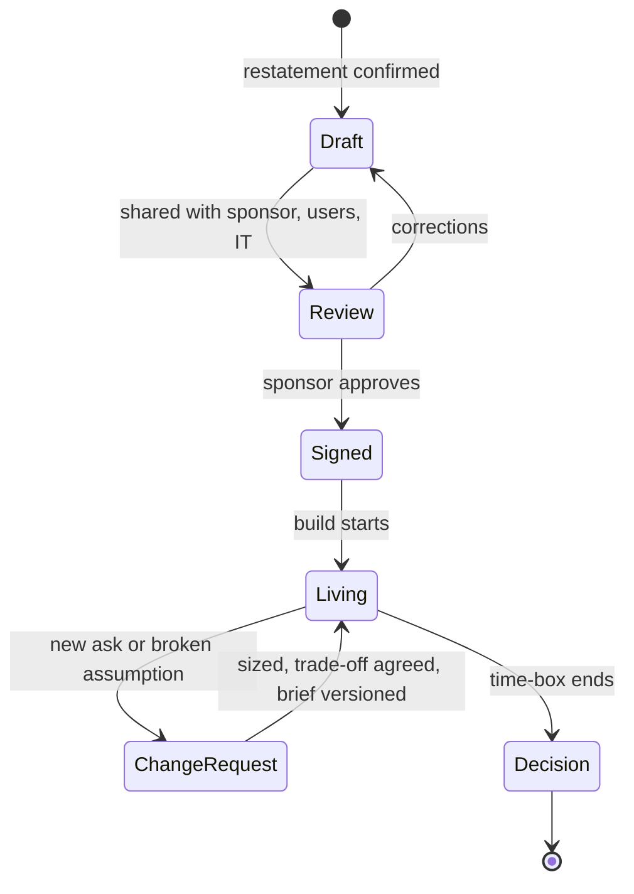
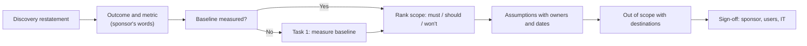

# Writing the Scope Brief: Success Criteria, Assumptions, Out of Scope

!!! abstract "Key takeaways"
    - **A scope brief is a shared understanding written down**, one to two pages, signed by the sponsor before building starts. It is not a contract (that's the SOW). It is what you point at when scope starts to drift.
    - **Success criteria are measurable, baselined and owned:** "reduce incomplete-request chasing from ~50 to ≤25 staff-hours/day in the pilot team by week 8, measured from case-system timestamps". Add **guardrails** (what must not get worse) and an **eval threshold** for LLM features.
    - **Assumptions are risks with an owner and a date.** "Customer provides a de-identified sample of 500 cases by week 1 (owner: data lead)". When one breaks, the plan changes, and everyone already agreed that it would.
    - **Out of scope is the most valuable section.** List the things people will ask for ("letter generation", "mobile", "other regions") with "not in this phase" and where they'll go instead.
    - **Fix time, flex scope.** Time-box the engagement, rank the scope (must / should / won't), name the decision-maker, and write down how changes get approved.

## Why it matters

Discovery ([page 1](01-discovery-interviews-workflow-mapping-hidden-constraints-res.md)) ends with a confirmed restatement. The scope brief makes it durable. Without it:

- The sponsor remembers the ambitious version, the users remember the helpful version, and IT remembers nothing. Six weeks later everyone is disappointed in a different way.
- "Done" can't be decided, so the pilot never ends. It drifts into unpaid production support.
- Scope creep has no reference point. You can't say "that's a change" if nothing says what the plan was ([page 4](04-saying-no-and-managing-scope-creep-without-losing-trust.md)).

Gartner's list of reasons GenAI projects get abandoned after proof of concept starts with poor data and ends with **unclear business value** ([Gartner, via Intelligent CIO](https://www.intelligentcio.com/eu/2024/08/05/gartner-predicts-30-of-generative-ai-projects-will-be-abandoned-after-proof-of-concept-by-end-of-2025/)). A brief with a baselined metric and a data assumption tackles both on day one.

In FDE interviews the brief shows up in several places. Decomposition and take-home rounds often ask you to turn a vague goal into a plan, and behavioral rounds ask "tell me about a time scope changed". Exponent's FDE behavioral course has a lesson on a customer pushing beyond the SOW ([Exponent](https://www.tryexponent.com/courses/fde-behavioral/customer-pushing-sow)). A well-written brief is your best evidence.

## Core concepts

### Brief vs SOW vs PR/FAQ vs mutual action plan

| Document | Owner | Purpose | Binding? |
|---|---|---|---|
| **Scope brief** | FDE / deployment lead | Shared understanding of problem, outcome, scope, assumptions | No, but signed off |
| **Statement of work (SOW)** | Sales, legal, delivery | Commercial terms, deliverables, fees, acceptance | Yes, contractual |
| **PR/FAQ** (Amazon "Working Backwards") | Product | Tests whether the idea is worth building, written as a future press release plus FAQ | No |
| **Mutual action plan (MAP)** | Account team + customer | Joint timeline, owners, success criteria and decision date for a POC or deal | No, jointly approved |

In practice the FDE brief borrows from all three: the outcome-first framing of a PR/FAQ ([Working Backwards](https://www.goodreads.com/notes/55297149-working-backwards/7776814-kareem-kamal)), the joint owners and decision date of a MAP ([Rework](https://resources.rework.com/vi/libraries/saas-growth/poc-pilot-programs)) and enough precision that the SOW can reference it.

### Anatomy of a brief

1. **Problem and context:** two or three sentences from the restatement, using the customer's words and numbers.
2. **Users and stakeholders:** who uses it, who sponsors, who approves go-live.
3. **Outcome and success criteria:** the business metric, baseline, target, measurement method, date.
4. **Guardrails:** what must not get worse (accuracy on a critical class, latency, staff workload, compliance).
5. **Scope:** ranked in-scope items (must / should / could).
6. **Out of scope:** explicit "not in this phase" list.
7. **Assumptions:** with owner and validation date.
8. **Constraints:** data, security, deployment, integration, time. These aren't negotiable within this phase.
9. **Risks and dependencies:** top three to five, with mitigations.
10. **Plan and decision:** time-box, milestones, decision meeting and decision-maker.
11. **Change process:** how changes are raised, sized and approved.


*Notice that the brief stays alive after sign-off. Every accepted change or broken assumption produces a new version, so the decision meeting judges the plan everyone last agreed, not the first draft.*

### Writing success criteria

Good criteria tie to a business outcome, are measurable, and are agreed with the people who'll judge them ([Presales Collective](https://www.presalescollective.com/post/part-3-dont-derail-the-proof-of-concept)). Practitioners note the trap: teams obsess over criteria and forget to make sure they can actually **measure** the result.

Use three layers:

| Layer | Question | Example (prior-auth intake) |
|---|---|---|
| **Business outcome** (lagging) | Did it move the number the sponsor cares about? | % of requests decided within 72h: 61% → ≥75% in the pilot team |
| **Operational / adoption** (leading) | Are people using it in the real workflow? | ≥80% of incomplete requests in the pilot team go through the tool by week 4 |
| **Quality / eval** (technical) | Is the output good enough to trust? | Missing-document detection: recall ≥95%, precision ≥85% on a 300-case labelled set |

Then **guardrails**: "no increase in wrongful denials", "p95 response under 5 s", "no PHI leaves the tenant", "nurse remains the decision-maker". Guardrails stop a team from hitting the target by breaking something else.

Rules of thumb:

- **Baseline first.** No baseline, no claim. If the baseline doesn't exist, measuring it is task one.
- **Their data, their dashboard.** Measure from the customer's systems where possible. It ends arguments.
- **One primary metric.** Several metrics are fine, but one decides the go/no-go.
- **Thresholds the sponsor wrote.** Ask "what number would make you scale this?". It's their decision.
- **For LLM features, define the eval set in the brief:** who labels it, how big it is, and which error types matter most (see [Applied LLM engineering](../fde-applied-llm/index.md)).

### Assumptions

An assumption is something the plan relies on that you haven't verified. Write each one so it can be proven false:

| Assumption | Owner | Validate by | If false |
|---|---|---|---|
| De-identified sample of 500 cases available | Customer data lead | Week 1 | Pilot slips day-for-day; escalate to sponsor |
| Case system exposes a read API for status | Customer IT | Week 1 spike | Fall back to nightly export; real-time view out of scope |
| Azure OpenAI is approved for PHI in this tenant | Customer security | Week 2 | Switch to an approved model; re-run the eval |
| 4 nurses available 2 h/week for labelling and feedback | Clinical lead | Ongoing | Quality criteria can't be measured |

The last column is the point: you agree the consequence **before** the assumption breaks, so a slip is a plan, not a blame conversation. Track assumptions with risks in a RAID log, the same one described in [Estimation & stakeholder management](../leadership-behavioral/07-estimation-deadlines-and-stakeholder-management.md).

### Out of scope

The out-of-scope list prevents the most arguments. Include:

- **Natural extensions** people will assume: other regions, other document types, write-back, mobile.
- **Adjacent pains** you heard in discovery but chose not to tackle (the letter batch, the policy-PDF chatbot).
- **Production concerns** a pilot won't cover: HA, DR, 24/7 support, full SSO roll-out, if true.
- **Where each one goes:** "phase 2 candidate", "backlog for product", "customer's IT team".

Phrase it as "not in this phase", not "never". It's a parking lot, not a rejection, which makes it far easier for the sponsor to sign.

### Fix time, flex scope

Basecamp's *Shape Up* calls the time budget the **appetite**: decide how much time the problem is worth, then shape scope to fit, instead of estimating scope and letting time grow ([Shape Up](https://basecamp.com/shapeup)). For FDE work this is the default: pilots are time-boxed (often 4–8 weeks in vendor practice) and ranked scope is what moves. MoSCoW labels (must, should, could, won't) make the ranking explicit, and "won't" lines up directly with the out-of-scope list.


*Notice the order: outcome before scope. If you start from features, success criteria end up describing the features ("chatbot deployed") instead of the result ("72-hour rate up").*

## In practice: code & configuration

### Scope brief template

```markdown
# Scope brief: <customer> / <use case>         v1.2 · 2026-10-09 · owner: <FDE>

## 1. Problem
Intake clerks spend ~50 staff-hours/day chasing incomplete prior-auth requests
(~30% of ~400/day). Only 61% of requests are decided within the 72h target.

## 2. Users & stakeholders
Users: 12 intake clerks (pilot: 4). Sponsor: VP Utilisation Management.
Go-live approvers: CISO delegate, case-system owner. Clinical lead: <name>.

## 3. Outcome & success criteria (decided at week-8 review)
| Metric (primary first)            | Baseline | Target  | Source             |
|-----------------------------------|----------|---------|--------------------|
| Chasing hours/day, pilot team     | ~17      | <= 8    | Case-system events |
| Decided within 72h, pilot team    | 61%      | >= 75%  | Case-system report |
| Adoption: incomplete reqs via tool| 0%       | >= 80%  | Tool logs          |
| Missing-doc detection (eval set)  | n/a      | R>=95%, P>=85% | 300 labelled cases |

## 4. Guardrails
No auto-denials; clerk confirms every outreach. p95 < 5s. No PHI leaves tenant.
No increase in wrong-provider outreach (sampled weekly).

## 5. In scope (ranked)
MUST: detect missing documents on intake; draft provider outreach; status view.
SHOULD: auto-follow-up reminders after 24h.
COULD: weekly summary for the sponsor.

## 6. Out of scope (this phase)
Letter generation (phase-2 candidate) · nurse policy chatbot (backlog) ·
other regions · write-back to case system (read-only this phase) · 24/7 support.

## 7. Assumptions
| # | Assumption                            | Owner      | By     | If false              |
|---|---------------------------------------|------------|--------|-----------------------|
| A1| 500-case de-identified sample         | Data lead  | Wk 1   | Slip day-for-day      |
| A2| Read API for case status              | IT         | Wk 1   | Nightly export        |
| A3| Approved LLM endpoint for PHI         | Security   | Wk 2   | Swap model, re-eval   |

## 8. Constraints
Azure tenant only · SSO via Entra ID · change freeze from Dec 15 · read-only.

## 9. Risks & dependencies
R1 Security review > 2 weeks -> start paperwork in week 0.
R2 Clerk adoption -> co-design sessions weekly; champion: <name>.

## 10. Plan & decision
Time-box: 8 weeks. Mid-point review week 4 (stop if A1-A3 unmet).
Decision meeting week 8: scale / extend / stop. Decision-maker: sponsor.

## 11. Change process
New asks go to the change log, sized within 2 days, trade-off proposed
(swap, defer, or extend), sponsor approves, brief re-versioned.

Sign-off: ____ (sponsor)   ____ (clinical lead)   ____ (IT/security)
```

### Success criteria: wrong vs right

=== "❌ Common mistake"
    ```text
    Success criteria:
    - Deploy an AI assistant for intake.
    - Users find it helpful.
    - High accuracy.
    - Integrate with the case system.
    -- Outputs, not outcomes. No baseline, no number, no date, no source,
       no owner. "Helpful" and "high" will be argued about at the review.
    ```

=== "✅ Correct approach"
    ```text
    Primary: chasing hours/day in the pilot team from ~17 (baseline, Sep
    case-system events) to <= 8 by week 8.
    Adoption: >= 80% of incomplete requests handled via the tool by week 4.
    Quality: missing-document detection recall >= 95%, precision >= 85% on a
    300-case set labelled by 2 nurses (labels frozen in week 2).
    Guardrail: zero auto-denials; wrong-provider outreach not above baseline.
    Decision: sponsor decides scale/extend/stop at the week-8 review.
    ```

## Real-world usage

- **Consulting and services firms** run on SOWs with acceptance criteria and change-request processes. The brief is the engineering-level version that keeps the SOW honest.
- **Amazon** tests ideas with PR/FAQs written before building, reviewed in silent-reading meetings, and reworks or kills ideas that don't convince on paper (Bryar & Carr, *Working Backwards*).
- **Enterprise presales** teams use mutual action plans listing objective, measurable success criteria, scope and exclusions, owners on both sides, checkpoints and a final decision meeting ([Rework](https://resources.rework.com/vi/libraries/saas-growth/poc-pilot-programs)).
- **PostHog FDE engagements** range from hands-on work in the customer's codebase to advising their team without touching code ([PostHog handbook](https://posthog.com/handbook/forward-deployed-engineering/overview)). That range is exactly why an explicit scope line matters.
- **Regulated domains:** in healthcare and banking, the constraints section carries the compliance commitments (PHI handling, audit trail, human-in-the-loop), and the brief becomes evidence for the security review.

## Trade-offs & production gotchas

| Choice | Pros | Cons | Use when |
|---|---|---|---|
| One-page brief | Read and signed quickly | Can hide ambiguity | Short pilots, engaged sponsor |
| Detailed brief (2–4 pages) | Fewer surprises, supports the SOW | Slower sign-off | Regulated domains, many stakeholders |
| Fixed scope, flexible time | Predictable output | Pilots drift, costs grow | Rarely in FDE work |
| Fixed time, flexible scope | Forces a decision, protects trust | Needs ranked scope and a strong "won't" list | Default for pilots |
| Customer writes the metric | Ownership, harder to dispute | May be unrealistic | Always propose, then let them set the number |

!!! warning "Gotchas"
    - **Success = "deployed".** That's an output. Ask what changes in the business when it's deployed.
    - **No baseline.** If you can't measure today, you can't claim improvement. Measure first.
    - **Unowned assumptions.** "Data will be available" with no owner and no date is a wish.
    - **Silent constraints.** If security or IT didn't review the brief, expect a surprise at go-live.
    - **Brief written and forgotten.** Version it, and open it in every weekly check-in.
    - **Sponsor signs, users don't know.** Walk the users through it too. They decide adoption.

## How this connects to my experience

- **Where I used it:**
    - "Led sprint planning, estimation, stakeholder communication, release management, and production support" (Leadership highlights).
    - "Owned the GraphQL Consumer Service end-to-end, acting as the integration layer between 5 upstream systems and multiple downstream consumers" (OptumRx Meteor). Owning an integration layer means agreeing what each upstream provides and what consumers can expect: interface scope and assumptions.
    - Consulting delivery at Publicis Sapient and Deloitte, where scope is negotiated against client expectations.
- **Talking points:**
    - "Before a feature started I'd write down *[confirm format: HLD, design doc, Confluence page, story map]* what we were building, what we weren't, and which upstream assumptions it depended on." *[confirm]*
    - "Upstream availability was our riskiest assumption, so I tracked it with an owner and a date and agreed the fallback in advance." *[confirm example]*
    - "Engineering standards around testing and CI/CD gave us objective 'done' criteria. I'd apply the same idea to customer success criteria: measurable and agreed up front."
    - Honest framing: "In consulting, the SOW was owned by *[confirm: engagement manager / client partner]*. I owned the technical scope inside it. As an FDE I'd write the brief myself."
- **Likely follow-up chain:** "Show me how you'd write success criteria for X." → "What if the customer has no baseline?" → "What happens when an assumption breaks mid-pilot?" → "Have you ever had scope change after sign-off?" Answer: three layers (outcome, adoption, quality) plus guardrails → measuring the baseline is task one, or use a control group → the pre-agreed "if false" column, re-version the brief, tell the sponsor the same day → a real story *[confirm]* with the trade-off you offered.

## Interview questions

### Fundamentals

??? question "Q1. What is a scope brief and how is it different from an SOW?"
    **Answer:** A one-to-two page shared understanding of the problem, outcome, success criteria, scope, out of scope, assumptions, constraints and decision process, owned by the FDE and signed off by the sponsor. The SOW is the commercial, contractual document (deliverables, fees, acceptance). The brief is what the team works from day to day and what the SOW can reference.

    **Interviewer listens for:** purpose (alignment, decision-making) and the distinction.

    **Common wrong answer:** "It's the requirements list."

??? question "Q2. What makes a good success criterion?"
    **Answer:** It's tied to a business outcome, measurable from a named source, has a baseline and a target, has a date, and the decision-maker agreed the threshold. Example: "Chasing hours/day from ~17 to ≤8 in the pilot team by week 8, from case-system events."

    **Interviewer listens for:** baseline, source, date, owner.

    **Common wrong answer:** "The system is deployed and users like it."

??? question "Q3. Why is the out-of-scope section so important?"
    **Answer:** Because the things people assume are included cause most disputes. Listing natural extensions and adjacent pains as "not in this phase", with where they go instead, prevents creep, gives you a reference when new asks arrive, and is easy to sign because it isn't a "never".

    **Interviewer listens for:** explicit, specific items, and "parking lot not rejection".

    **Common wrong answer:** "Anything not listed is out of scope." Nobody reads it that way.

??? question "Q4. What is the difference between an assumption and a constraint?"
    **Answer:** A constraint is a known, fixed condition you must work within (data stays in the tenant, change freeze on Dec 15). An assumption is something the plan relies on that you haven't verified yet (a read API exists). Assumptions get owners, validation dates and pre-agreed consequences. Once verified, an assumption becomes a fact. If it's false, the plan changes.

    **Interviewer listens for:** verification and consequences.

    **Common wrong answer:** treating them as the same list.

### Intermediate

??? question "Q5. The customer has no baseline for the metric they care about. What do you do?"
    **Answer:** Make measuring it the first task: pull historical data from their systems, instrument the current process for a week or two, or sample manually. If that's impossible, use a comparison group (pilot team vs a similar team) during the pilot. Never claim improvement without one of these.

    **Interviewer listens for:** baseline as task one, or a control group.

    **Common wrong answer:** "We'll estimate it."

??? question "Q6. How do you write success criteria for an LLM feature?"
    **Answer:** Three layers. Business outcome (what changes for the customer). Adoption (usage in the real workflow). Quality: an eval set with an agreed size, who labels it, when labels freeze, and thresholds per error type (for example, recall on the critical class). Plus guardrails: human in the loop, latency, cost per task, and data handling.

    **Interviewer listens for:** an eval set defined in the brief, error-type weighting, guardrails.

    **Common wrong answer:** "95% accuracy" with no dataset or definition.

??? question "Q7. What are guardrail metrics and why include them?"
    **Answer:** Metrics that must not get worse while you improve the primary one: error rates on critical cases, latency, workload, compliance, cost. Without them a team can hit the target by shifting harm elsewhere, for example faster decisions with more wrongful denials.

    **Interviewer listens for:** preventing perverse optimisation.

    **Common wrong answer:** "We only track one metric to keep it simple."

??? question "Q8. Who should sign the scope brief?"
    **Answer:** The sponsor (owns the outcome and the decision), a user or clinical lead (owns adoption and quality judgement), and IT or security (own the constraints and go-live gates). On your side, the FDE and the account lead. Missing IT or security is the most common reason a "signed" scope blows up at go-live.

    **Interviewer listens for:** constraint owners included.

    **Common wrong answer:** "Just the sponsor."

### Senior

??? question "Q9. Why fix time and flex scope for pilots?"
    **Answer:** Because a pilot's purpose is a decision, and decisions need a date. Fixed scope with flexible time drifts and burns trust and money. With a time-box and ranked scope, the musts get done, the rest moves, and the decision meeting happens on schedule. It's Shape Up's "appetite" idea applied to customer work.

    **Interviewer listens for:** decision orientation, ranked scope.

    **Common wrong answer:** "We'll finish all the features, then decide."

??? question "Q10. How do you handle a stakeholder who refuses to commit to a number?"
    **Answer:** Find out why: fear of being blamed, real uncertainty, or no access to data. Offer a range or a directional target, propose a number based on the baseline and ask them to adjust it, or agree the decision rule instead ("scale if chasing hours fall by at least a third"). If nobody will own any threshold, flag it as a risk: there's no real sponsor.

    **Interviewer listens for:** empathy plus persistence, and treating it as a sponsorship signal.

    **Common wrong answer:** "Leave it vague."

??? question "Q11. An assumption fails in week 2. Walk me through it."
    **Answer:** Check the impact against the brief's "if false" column. Tell the sponsor the same day with the pre-agreed consequence and any better options. Update the brief (new version, change log). Adjust the plan: swap scope, slip, or switch to the fallback. Because the consequence was agreed in advance, it's a plan update, not a negotiation.

    **Interviewer listens for:** speed, pre-agreement, versioning.

    **Common wrong answer:** "Work around it quietly and catch up."

??? question "Q12. How detailed should the brief be?"
    **Answer:** Detailed enough that two people reading it would agree whether a given request is in scope and whether the pilot succeeded. Usually one page for a short, low-risk pilot and two to four for regulated or multi-stakeholder work. Detail goes into criteria, assumptions and out of scope, not into implementation.

    **Interviewer listens for:** a test for "detailed enough".

    **Common wrong answer:** a 30-page requirements document.

### Scenario-based

??? question "Q13. Write success criteria for: 'Use AI to help our call-centre agents answer billing questions faster.'"
    **Answer:** Primary: average handle time for billing calls in the pilot group from baseline (say 9 minutes, from telephony data) to ≤7 by week 8. Adoption: assistant opened on ≥70% of billing calls by week 4. Quality: answer correctness ≥90% on a 200-question set graded by senior agents, zero incorrect refund-policy answers in the sample. Guardrails: first-contact resolution and CSAT not below baseline, no card data sent to the model. Decision: the head of customer service decides at week 8.

    **Interviewer listens for:** all layers, baselines, a critical error class, guardrails.

    **Common wrong answer:** "Agents answer faster with AI."

??? question "Q14. The sponsor wants to add 'and also summarise calls' to the brief the day before sign-off. What do you do?"
    **Answer:** Ask what problem the summaries solve and how often it happens. If it's important, put it in the ranked scope and show what it displaces or how much it extends the time-box. Otherwise add it to out of scope as a phase-2 candidate. Don't sign a brief that has grown without a trade-off. See [Saying no & managing scope creep](04-saying-no-and-managing-scope-creep-without-losing-trust.md).

    **Interviewer listens for:** the trade-off made visible, the parking lot.

    **Common wrong answer:** "Sure, we'll add it."

??? question "Q15. Tell me about a time you wrote down scope or acceptance criteria that later saved a project."
    **Answer structure (STAR):** Situation: the project and stakeholders *[confirm]*. Task: your ownership of the technical scope. Action: what you wrote (assumptions about an upstream, explicit exclusions, acceptance criteria) and how you got sign-off. Result: the moment it mattered (a disputed request, a broken assumption) and how the written record turned an argument into a trade-off. Lesson: what you now always include.

    **Interviewer listens for:** a real document, a real moment, a learned habit.

    **Common wrong answer:** a generic story with no artifact.

## Cheat sheet

| Section | Remember |
|---|---|
| Purpose | Shared understanding, signed. Not the SOW |
| Success criteria | Outcome + adoption + quality. Baseline, target, source, date, owner |
| Guardrails | What must not get worse |
| Assumptions | Owner, validation date, "if false" consequence |
| Out of scope | Specific items, "not in this phase", where they go |
| Constraints | Fixed conditions: data, security, deployment, freeze dates |
| Plan | Fixed time, ranked scope, midpoint review, decision meeting |
| Change process | Log → size → trade-off → sponsor approves → re-version |
| Related | [Pilots](03-pilot-to-proof-of-concept-to-production-time-boxing-exit-cri.md), [Scope creep](04-saying-no-and-managing-scope-creep-without-losing-trust.md), [Estimation](../leadership-behavioral/07-estimation-deadlines-and-stakeholder-management.md) |

## Sources
1. Colin Bryar & Bill Carr, *Working Backwards*: PR/FAQ and narrative documents ([notes](https://www.goodreads.com/notes/55297149-working-backwards/7776814-kareem-kamal)).
2. [Basecamp: Shape Up](https://basecamp.com/shapeup): appetite, fixed time and variable scope.
3. [Rework: POC & pilot programs](https://resources.rework.com/vi/libraries/saas-growth/poc-pilot-programs): mutual action plan contents (objective, success criteria, exclusions, owners, decision meeting).
4. [Presales Collective: Don't derail the proof of concept](https://www.presalescollective.com/post/part-3-dont-derail-the-proof-of-concept): business-tied, measurable criteria; measurability often ignored.
5. [Gartner prediction on GenAI projects abandoned after PoC (Intelligent CIO reprint)](https://www.intelligentcio.com/eu/2024/08/05/gartner-predicts-30-of-generative-ai-projects-will-be-abandoned-after-proof-of-concept-by-end-of-2025/): data quality and unclear value.
6. [PostHog FDE handbook: overview](https://posthog.com/handbook/forward-deployed-engineering/overview): range of engagement types.
7. [Exponent FDE behavioral: customer pushing beyond the SOW](https://www.tryexponent.com/courses/fde-behavioral/customer-pushing-sow): interview angle (prep site, paywalled body).
8. Dai Clegg, MoSCoW prioritisation (DSDM): must / should / could / won't.
9. Resume: `Vishal_Hulawale_Resume_10012026.pdf` (stakeholder communication, GraphQL Consumer Service ownership, 5 upstream systems).
