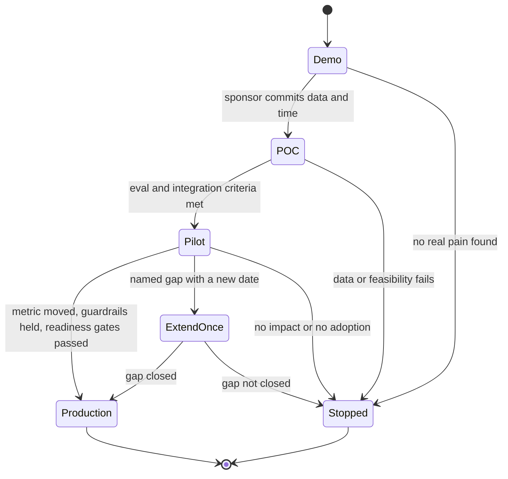
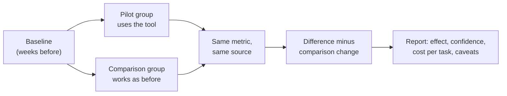

# Pilot → Proof of Concept → Production: Time-Boxing, Exit Criteria, Measuring Business Impact

!!! abstract "Key takeaways"
    - **Each stage answers one question.** Demo: *is this interesting?* Proof of concept: *can it work on their data and systems?* Pilot: *does it change the metric for real users in the real workflow?* Production: *can it run safely at scale, supported, every day?* Names vary between companies, so agree the definitions with the customer.
    - **Time-box every stage and end it with a decision:** **go** (next stage), **extend** (once, for a named reason, with a new date) or **stop**. A midpoint review with stop criteria prevents slow death.
    - **Build the path to production from day one.** Start the security review, SSO, data access and support ownership during the pilot, not after it. Most "pilot purgatory" is production work nobody started.
    - **Measure impact like a sceptic would:** a baseline, a comparison group or staggered roll-out, the customer's own data, and leading indicators (adoption) alongside lagging ones (the business metric). Report cost per task, not just accuracy.
    - **Stopping is a valid outcome.** Ending a pilot early with clear evidence protects trust more than stretching one that isn't working.

## Why it matters

The FDE job is defined by production, not demos. OpenAI's FDE postings measure success through "production adoption, measurable workflow impact, and eval-driven feedback" ([OpenAI careers](https://openai.com/careers/forward-deployed-software-engineer-sf/)). Cognition's deployed-engineer postings say the role leads "designing compelling product demos, executing pilots" and rolling Devin out across thousands of engineers ([Cognition Deployed Engineer posting](https://jobs.generalcatalyst.com/companies/cognition-technologies/jobs/86735488-deployed-engineer)), and a 2026 talk from Cognition stresses measurable customer outcomes over usage metrics ([AI Engineer](https://ai.engineer/talks/how-forward-deployed-engineering-is-done-at-cognition)).

The gap between pilot and production is where most enterprise AI work dies:

- Gartner predicted **at least 30% of GenAI projects would be abandoned after proof of concept** by the end of 2025, because of poor data quality, inadequate risk controls, escalating costs or unclear business value ([Gartner, via Intelligent CIO](https://www.intelligentcio.com/eu/2024/08/05/gartner-predicts-30-of-generative-ai-projects-will-be-abandoned-after-proof-of-concept-by-end-of-2025/)).
- MIT NANDA's 2025 report (as covered by Fortune) found most enterprise GenAI pilots stalled with little measurable P&L impact, and pointed to brittle workflows and tools that don't adapt, not model quality ([Fortune](https://fortune.com/2025/08/18/mit-report-95-percent-generative-ai-pilots-at-companies-failing-cfo/)).

Palantir changed its own go-to-market for this reason. It replaced pilots that "generally take one to three months" with **AIP Bootcamps** that deliver real workflows on customer data in one to five days, and reported deals signed days after a bootcamp ([Palantir blog](https://blog.palantir.com/deploying-full-spectrum-ai-in-days-how-aip-bootcamps-work-21829ec8d560); Palantir Q3 2023 earnings call, company-reported). The lesson: shorter, sharper stages with real data beat long, vague pilots.

Interviewers probe this in decomposition, system design and behavioral rounds: "How would you run the pilot?", "What are your exit criteria?", "How would you prove ROI?", "Tell me about a pilot that didn't go to production."

## Core concepts

### What each stage proves

| Stage | Question it answers | Data | Users | Typical length | Exit evidence |
|---|---|---|---|---|---|
| **Demo** | Is this worth exploring? | Synthetic or public | None (watched) | Hours | Sponsor wants a POC with their data |
| **Proof of concept (POC)** | Can it work on *their* data and systems? | Sample of real data, sandbox | FDE + a few experts | 1–4 weeks | Eval thresholds met on their data; integration path proven |
| **Pilot** | Does it move the metric in the real workflow? | Production data, limited scope | A real team (e.g. 4 of 12 clerks) | 4–12 weeks | Primary metric vs baseline; adoption; guardrails held |
| **Production** | Can it run safely at scale, every day? | Full production | All target users | Ongoing | SLOs, cost, support, compliance, continuing value |

The topic title orders it "pilot → proof of concept → production" and real companies use the words interchangeably: some call a paid POC a "pilot", others call a pilot a "limited production roll-out". Don't argue about vocabulary. **Write down what the next stage will prove** in the [scope brief](02-writing-the-scope-brief-success-criteria-assumptions-out-of.md).


*Notice that every stage has an explicit exit to "Stopped", and "extend" can only happen once. A pilot without these exits is how teams end up supporting a half-built system for a year.*

### Time-boxing

A time-box forces a decision. Vendor and presales practice suggests a fixed end date (often 4–8 weeks for a POC), a **midpoint review** and hard stop rules: "if success criteria aren't trending by midpoint, pause and reassess; if the customer's resource commitments aren't met, stop" ([Rework](https://resources.rework.com/vi/libraries/saas-growth/poc-pilot-programs)).

Good time-box practice:

1. **Set the decision date on day one**, with the decision-maker in the calendar invite.
2. **Rank scope** so the time-box cuts scope, not quality (see Shape Up's "appetite" in [page 2](02-writing-the-scope-brief-success-criteria-assumptions-out-of.md)).
3. **Front-load risk.** Data access, the riskiest integration and the eval set come in week 1, not week 6.
4. **Midpoint review** against the criteria and the customer's commitments (data, SMEs, access).
5. **Weekly written status:** progress on metrics, risks, asks. Bad news early, with options (as in [Estimation & stakeholder management](../leadership-behavioral/07-estimation-deadlines-and-stakeholder-management.md)).

### Exit criteria: go, extend, stop

Write exit criteria for all three outcomes before the pilot starts:

| Decision | Criteria (example) |
|---|---|
| **Go to production** | Primary metric hit (≥ target vs baseline), adoption ≥ target, guardrails held, readiness gates passed or scheduled with owners, sponsor has budget for the next phase |
| **Extend once** | Metric trending but blocked by a named, fixable gap (e.g. data access arrived in week 5); new date ≤ 4 weeks; same criteria |
| **Stop** | No movement after fixes; adoption below threshold with no fixable cause; a constraint makes production impossible (data can't be used); sponsor lost |

A stop isn't a failure if it's quick and well documented. It saves the customer money, it's honest, and it often leads to a better use case. "We learned in 3 weeks that the documents are too inconsistent to automate. Here's what would need to change" builds more trust than a quiet three-month fade.

### Production-readiness gates

Most pilots stall here because nobody started this work. Run a readiness checklist **in parallel** with the pilot:

- **Security and compliance:** vendor security review, data processing agreement, PHI or PCI handling, pen test, audit logging. These take weeks, so start them in week 0.
- **Identity and access:** SSO (SAML or OIDC), role mapping, least privilege.
- **Deployment:** the customer's environment (VPC, on-prem, approved model endpoint), CI/CD, infrastructure as code. See [Enterprise deployment environments](../fde-enterprise-deployment/index.md).
- **Reliability:** SLOs, monitoring and alerting, runbooks, on-call ownership, DR.
- **Quality over time:** regression evals in CI, drift monitoring, a human-review sample, a feedback loop.
- **Cost:** cost per task at production volume, model choice, caching, budget alerts.
- **Ownership:** who supports it after the FDE leaves: the customer's team, the vendor's support team, or a managed service. Training and documentation.

### Measuring business impact

Executives will ask "did it work, and how do you know?". A credible answer has five parts:

1. **Baseline** from before the pilot, measured the same way.
2. **Comparison:** a control group (the pilot team vs a similar team), a staggered roll-out (team A starts in week 1, team B in week 4) or a before/after with seasonality checked. Without a comparison, a busy month can fake success or hide it.
3. **Customer-owned data:** their case system, their telephony, their finance numbers, not your tool's logs alone.
4. **Leading and lagging indicators:** adoption and time-per-task move in weeks. The business metric (SLA attainment, cost, revenue) can take a quarter.
5. **Unit economics:** cost per task (model + infrastructure + human review) vs the old cost per task, and payback time.


*Notice that the impact is the pilot group's change minus the comparison group's change. A plain before/after comparison would credit the tool for a quiet month or blame it for a busy one.*

### LLM-specific stage design

- **POC:** prove quality on an eval set from their data, labelled by their experts. Measure cost and latency at the same time.
- **Pilot, step 1 (shadow mode):** the model runs alongside humans; outputs are compared but not shown or acted on. This de-risks without affecting customers.
- **Pilot, step 2 (assist):** humans see suggestions and decide. Measure acceptance rate and edits.
- **Production (automate where earned):** automate only the slices where the evals and the pilot showed it's safe, keep humans on the rest, and keep monitoring.

Details on evals and guardrails are in [Applied LLM engineering](../fde-applied-llm/index.md).

## In practice: code & configuration

### Pilot success-criteria and exit table

```text
PILOT: Prior-auth intake assistant · 8 weeks · decision 2026-12-04 · decider: VP UM

| Criterion                         | Baseline | Go threshold | Stop signal (by wk 4)   | Source            |
|-----------------------------------|----------|--------------|-------------------------|-------------------|
| Chasing hrs/day (pilot vs control)| 17 vs 16 | -50% vs ctrl | < -15% vs ctrl          | Case-system events|
| Adoption (incomplete reqs via tool)| 0%      | >= 80%       | < 40%                   | Tool logs         |
| Missing-doc recall / precision    | n/a      | 95% / 85%    | < 85% recall            | 300-case eval set |
| Wrong-provider outreach           | 0.4%     | <= 0.4%      | > 1%                    | Weekly sample     |
| Cost per request (all-in)         | $3.10*   | <= $1.50     | > $3.00                 | Finance + billing |
* clerk time at loaded rate; confirm with finance

Readiness gates (parallel): security review [wk0-5] · SSO [wk2] · runbook [wk6]
· support owner named [wk6] · regression evals in CI [wk4]
Extend once if: blocked by a named dependency; max +4 weeks; same thresholds.
```

### Impact and ROI calculation

```python
from dataclasses import dataclass

@dataclass
class GroupStats:
    before_hours_per_day: float   # baseline window, same metric and source
    after_hours_per_day: float    # pilot window

def pilot_effect(pilot: GroupStats, control: GroupStats) -> float:
    """Difference-in-differences: pilot change minus control change (hours/day)."""
    pilot_change = pilot.after_hours_per_day - pilot.before_hours_per_day
    control_change = control.after_hours_per_day - control.before_hours_per_day
    return pilot_change - control_change   # negative = hours saved

def monthly_roi(hours_saved_per_day: float, loaded_rate: float, working_days: int,
                tool_cost_per_month: float) -> tuple[float, float]:
    """Return (net monthly benefit, benefit/cost ratio). Inputs come from the customer."""
    gross = hours_saved_per_day * loaded_rate * working_days
    return gross - tool_cost_per_month, gross / tool_cost_per_month

effect = pilot_effect(GroupStats(17, 8), GroupStats(16, 15))   # -8.0 h/day, not -9
net, ratio = monthly_roi(-effect * 3, loaded_rate=38.0, working_days=21,   # x3: scale to 12 clerks
                         tool_cost_per_month=6_000)
print(f"effect={effect:.1f} h/day, net=${net:,.0f}/month, ratio={ratio:.1f}x")
# State every assumption (rate, scaling factor, cost) next to the number in the report.
```

### Pilot plan: wrong vs right

=== "❌ Common mistake"
    ```text
    "Let's do a pilot and see how it goes."
    - No end date, no decision-maker, no baseline, no comparison group.
    - Security review starts after the pilot "succeeds" (6 more weeks).
    - Success judged by a demo to the sponsor and a few happy quotes.
    - Week 10: users drifted back to the old process; sponsor asks for
      "a few more features"; nobody can say whether it worked.
    ```

=== "✅ Correct approach"
    ```text
    8-week time-box; decision meeting booked with the VP for week 8.
    Week 0: security paperwork, data access, eval set labelling started.
    Weeks 1-2: shadow mode; eval on real cases; fix top failure modes.
    Weeks 3-8: assist mode for 4 clerks; 4 similar clerks as control.
    Week 4 midpoint: stop signals checked; customer commitments checked.
    Weekly one-page status: metric vs control, adoption, risks, asks.
    Week 8: go / extend once / stop, with readiness gates and cost per task.
    ```

## Real-world usage

- **Palantir AIP Bootcamps:** compress the first stages into one to five days of hands-on work on the customer's own data, replacing one-to-three-month pilots; Palantir reported more than 560 bootcamps across 465 organisations by late 2023 and several deals signed within days (company-reported, [Palantir blog](https://blog.palantir.com/deploying-full-spectrum-ai-in-days-how-aip-bootcamps-work-21829ec8d560)).
- **Cognition:** deployed engineers run pilots and then enablement programmes for very large engineering organisations; outcomes are framed as delivery metrics (timeline reduction, PR throughput, migrations), not token usage ([AI Engineer](https://ai.engineer/talks/how-forward-deployed-engineering-is-done-at-cognition)).
- **Enterprise presales:** mutual action plans with midpoint reviews and a booked decision meeting are standard practice for POCs ([Rework](https://resources.rework.com/vi/libraries/saas-growth/poc-pilot-programs), [Presales Collective](https://www.presalescollective.com/post/part-3-dont-derail-the-proof-of-concept)).
- **Healthcare and banking:** the production gate is usually compliance (HIPAA business associate agreement, model-risk review, audit trail), so it must run in parallel with the pilot.
- **Failure modes:** pilot purgatory (no decision date), the hero pilot (works because the FDE does manual steps nobody else can), success theatre (a demo instead of a metric), and the cost surprise (the model is affordable at pilot volume and not at production volume).

## Trade-offs & production gotchas

| Choice | Pros | Cons | Use when |
|---|---|---|---|
| Very short POC (days, bootcamp style) | Fast value, momentum, cheap to stop | Shallow; may hide integration and data issues | Early, to choose a use case |
| Longer pilot (6–12 weeks) | Real adoption and business metric | Costly; risk of drift | Once the use case is chosen |
| Sandbox / sample data | Starts fast, low risk | Hides data-quality and access problems | POC only, with a plan for real data |
| Production data, limited users | Real evidence | Needs security approval up front | Pilots |
| Shadow mode | Safe quality evidence | No business impact yet | High-risk decisions (health, money) |
| Control group | Credible impact | Needs comparable teams and patience | Whenever the sponsor will defend ROI upward |

!!! warning "Gotchas"
    - **The hero pilot:** if the FDE is secretly doing manual cleanup, the pilot proves nothing about production. Log every manual step.
    - **Readiness after success:** a six-week security review after a successful pilot loses momentum and sometimes the budget.
    - **Measuring with your own logs only.** The customer's CFO will trust their own systems.
    - **Cost at pilot scale.** Recompute cost per task at production volume before the decision meeting.
    - **Extending forever.** One extension, with a named gap and a date. After that, decide.
    - **No owner after go-live.** Name the support owner before production, or the FDE becomes permanent support.

## How this connects to my experience

- **Where I used it:** not FDE pilots directly; position as transferable production experience.
    - "Led sprint planning, estimation, stakeholder communication, **release management, and production support**" (Leadership highlights): I know what production readiness and support ownership cost.
    - "Established engineering standards around testing, CI/CD, code quality, and deployment practices" (OptumRx): the readiness gates in this page are those standards applied to a customer pilot.
    - "Designed Kafka-based event-driven workflows with retry and DLQ handling": production failure handling, which pilots usually skip.
    - Deloitte ConvergeHealth: AWS services with "security controls using IAM, KMS, and Secrets Manager", the kind of controls a security review checks.
- **Talking points:**
    - "In healthcare, nothing reached 750K+ users without security sign-off and production support plans, so I'd start those gates in week 0 of a pilot." *[confirm the release and security process]*
    - "I'd measure impact with the customer's own data and a comparison group, because I've seen *[confirm: a launch where metrics were disputed]*."
    - If asked about a POC you ran: *[confirm whether you built any prototype or spike that a client evaluated, e.g. AWS Personalize integration at Deloitte]*.
- **Likely follow-up chain:** "How would you run a pilot for X?" → "How long?" → "How do you prove ROI?" → "What if results are ambiguous at the end?" Answer: stages and what each proves → a time-box with a midpoint review → baseline plus comparison group plus customer data plus cost per task → extend once for a named gap, otherwise decide, and stopping is acceptable.

## Interview questions

### Fundamentals

??? question "Q1. What's the difference between a demo, a POC, a pilot and production?"
    **Answer:** Demo: is it interesting (synthetic data). POC: can it work on their data and systems (sample data, sandbox, experts). Pilot: does it move the metric in the real workflow (production data, a real team, limited scope). Production: safe, supported and cost-effective at scale. Names vary between companies, so write down what each stage proves.

    **Interviewer listens for:** one question per stage.

    **Common wrong answer:** treating POC and pilot as the same thing with different names, and not defining either.

??? question "Q2. Why time-box a pilot?"
    **Answer:** A pilot's purpose is a decision, and decisions need dates. Without a time-box, scope grows, costs grow, momentum dies and the result is never judged. A time-box with ranked scope and a booked decision meeting forces focus and protects trust.

    **Interviewer listens for:** decision orientation.

    **Common wrong answer:** "So the customer doesn't get charged too much." It's partly that, but mostly decision-making.

??? question "Q3. What are exit criteria and what should they cover?"
    **Answer:** Pre-agreed conditions for each outcome: go (metric, adoption, guardrails, readiness, budget), extend once (a named, fixable gap with a new date), and stop (no movement, no adoption, an impossible constraint, sponsor lost). They're written before the pilot starts so the decision is about evidence, not mood.

    **Interviewer listens for:** all three outcomes, written in advance.

    **Common wrong answer:** only success criteria.

??? question "Q4. What is pilot purgatory and how do you avoid it?"
    **Answer:** Pilots that never become production or get stopped: they continue indefinitely with no decision. Avoid it with a time-box, a booked decision meeting and decider, a one-time extension rule, readiness gates started in parallel, and a sponsor with budget for the next stage.

    **Interviewer listens for:** structural causes, parallel readiness work.

    **Common wrong answer:** "Make the demo more impressive."

### Intermediate

??? question "Q5. How do you measure business impact credibly?"
    **Answer:** A baseline measured the same way; a comparison group or staggered roll-out to remove seasonality; the customer's own data sources; leading (adoption, time per task) and lagging (business metric) indicators; and unit economics (cost per task vs old cost). Report the effect with caveats and assumptions.

    **Interviewer listens for:** a comparison group and customer-owned data.

    **Common wrong answer:** "Compare before and after in our dashboard."

??? question "Q6. What production-readiness work should start during the pilot?"
    **Answer:** Security review and data agreements, SSO and access, deployment into the customer's environment, monitoring and runbooks, regression evals in CI, cost at production volume, support ownership and training. These take weeks and are the usual reason successful pilots stall.

    **Interviewer listens for:** security review in week 0, support ownership.

    **Common wrong answer:** "After the pilot succeeds we'll productionise it."

??? question "Q7. How do you stage an LLM feature to reduce risk?"
    **Answer:** POC with an eval set from their data. Shadow mode (runs alongside humans, not acted on). Assist mode (humans decide, measure acceptance and edits). Automate only slices with proven quality, keep humans on the rest, and keep monitoring and regression evals.

    **Interviewer listens for:** shadow → assist → selective automation.

    **Common wrong answer:** "Turn it on for everyone once accuracy looks good."

??? question "Q8. What is a hero pilot and why is it dangerous?"
    **Answer:** A pilot that works because the FDE quietly does manual steps (cleaning data, fixing outputs, restarting jobs). It proves the FDE works hard, not that the system works. Log every manual step, automate or price them, and include them in the production plan.

    **Interviewer listens for:** honesty about manual effort.

    **Common wrong answer:** "Whatever it takes to make the pilot succeed."

### Senior

??? question "Q9. When would you recommend stopping a pilot early?"
    **Answer:** When stop signals at the midpoint show no realistic path: the data can't support the quality bar, a constraint makes production impossible, users don't adopt it for reasons the pilot can't fix, the customer can't meet its commitments, or the sponsor has gone. Recommend it with evidence and, where possible, a better alternative use case. A fast, honest stop builds trust.

    **Interviewer listens for:** courage, evidence, an alternative.

    **Common wrong answer:** "Never. We always make it work."

??? question "Q10. Results at week 8 are ambiguous. What do you do?"
    **Answer:** Separate the causes: was it the tool (quality), the adoption (process, training), the measurement (noisy metric, short window) or the environment (volume changes)? If there's a named, fixable gap, propose one extension with a date and the same criteria. If not, present the evidence honestly and recommend stop or a narrower scope where the effect was clear.

    **Interviewer listens for:** diagnosis before decision, and the one-extension rule.

    **Common wrong answer:** "Extend until the numbers look good."

??? question "Q11. How do you calculate cost per task for an LLM workflow?"
    **Answer:** Model cost (tokens in and out × price, including retries and tool calls) + infrastructure (hosting, vector store, observability) + human review time × loaded rate + amortised build and support, divided by tasks. Compare it with the current cost per task. Recompute at production volume and with the model you'll actually run.

    **Interviewer listens for:** human review and production volume included.

    **Common wrong answer:** "Just the API price per call."

??? question "Q12. How do you keep a pilot honest when the sponsor wants it to succeed?"
    **Answer:** Agree criteria, data sources and comparison groups before starting. Report weekly against them, including bad news. Separate the effect from the effort. Invite a sceptic (finance or ops) to the decision meeting. A sponsor who championed a failed pilot is better off knowing early; one who scales a non-working system loses credibility later.

    **Interviewer listens for:** pre-registration of criteria, a sceptic in the room.

    **Common wrong answer:** "Show the best numbers."

### Scenario-based

??? question "Q13. Design a pilot for an AI assistant that drafts responses for a bank's complaints team."
    **Answer:**
    - **POC (2 weeks):** eval set of 300 past complaints with ideal responses written by senior handlers. Measure correctness, tone and regulatory phrasing. Check data handling with security.
    - **Pilot (8 weeks):** shadow mode for 2 weeks, then assist mode for one team with a comparable control team.
    - **Metrics:** handling time, complaints closed within the regulatory deadline, acceptance and edit rate, QA scores.
    - **Guardrails:** no auto-send, no customer data outside approved boundaries, audit trail of drafts and edits.
    - **Readiness in parallel:** model-risk review, SSO, logging, support owner.
    - **Decision:** head of complaints at week 8, with cost per complaint.

    **Interviewer listens for:** staged risk, a control group, regulation, a decision date.

    **Common wrong answer:** "Deploy it to all handlers and see what happens."

??? question "Q14. A pilot succeeded, but production is blocked by a 10-week security review nobody started. What now, and what would you change?"
    **Answer:** Now: get on the security team's calendar, provide everything they need (architecture, data flows, pen test results, DPA), ask whether a limited production scope (the same pilot team, same data) can go ahead under an interim approval, and keep the sponsor informed with the revised timeline. Next time: security paperwork in week 0 and a named contact in the brief's assumptions.

    **Interviewer listens for:** recovery plus the process fix.

    **Common wrong answer:** "Push security to approve faster."

??? question "Q15. The customer wants to skip the pilot and go straight to production across 2,000 users. How do you respond?"
    **Answer:** Welcome the commitment, then explain the risk in their terms: untested quality on their data, adoption and support load, and no evidence for the ROI case. Offer a fast path: a 2-week POC on their data, then a staged roll-out (one team, then a region, then everyone) with go/stop gates. That's still "production", just staged. If they accept the risks in writing and it's low-risk, a faster staged roll-out may be fine.

    **Interviewer listens for:** staged roll-out as a compromise, risk in business terms.

    **Common wrong answer:** "Great, let's go." Or "We always require a 3-month pilot."

## Cheat sheet

| Concept | Remember |
|---|---|
| Stages | Demo (interesting?) → POC (works on their data?) → Pilot (moves metric?) → Production (safe at scale?) |
| Time-box | Decision date and decider booked on day one. Midpoint review |
| Exits | Go / extend once (named gap, new date) / stop |
| Readiness | Security, SSO, deployment, monitoring, evals in CI, cost, support owner. Start in week 0 |
| Impact | Baseline + comparison group + customer data + leading and lagging + cost per task |
| LLM staging | Eval → shadow → assist → selective automation |
| Failure modes | Purgatory, hero pilot, success theatre, cost surprise |
| Related | [Scope brief](02-writing-the-scope-brief-success-criteria-assumptions-out-of.md), [Exec updates](05-talking-to-executives-vs-engineers-demos-executive-pitch-sta.md), [Enterprise deployment](../fde-enterprise-deployment/index.md) |

## Sources
1. [OpenAI: Forward Deployed Software Engineer](https://openai.com/careers/forward-deployed-software-engineer-sf/): production adoption and measurable workflow impact as success measures.
2. [AI Engineer: How forward deployed engineering is done at Cognition](https://ai.engineer/talks/how-forward-deployed-engineering-is-done-at-cognition): outcomes over usage; customer-reported delivery metrics.
3. [Palantir: How AIP Bootcamps work](https://blog.palantir.com/deploying-full-spectrum-ai-in-days-how-aip-bootcamps-work-21829ec8d560): one-to-five-day bootcamps; Palantir Q3 2023 earnings call ([transcript](https://www.fool.com/earnings/call-transcripts/2023/11/02/palantir-technologies-pltr-q3-2023-earnings-call-t/)) for the pilot comparison and bootcamp counts (company-reported).
4. [Gartner prediction on GenAI projects abandoned after PoC (Intelligent CIO reprint)](https://www.intelligentcio.com/eu/2024/08/05/gartner-predicts-30-of-generative-ai-projects-will-be-abandoned-after-proof-of-concept-by-end-of-2025/): abandonment causes.
5. [Fortune on the MIT NANDA GenAI Divide report](https://fortune.com/2025/08/18/mit-report-95-percent-generative-ai-pilots-at-companies-failing-cfo/): pilots stalling; workflow fit.
6. [Rework: POC & pilot programs](https://resources.rework.com/vi/libraries/saas-growth/poc-pilot-programs): time-boxes, midpoint stop rules, decision meetings (vendor practice).
7. [Presales Collective: Don't derail the proof of concept](https://www.presalescollective.com/post/part-3-dont-derail-the-proof-of-concept): measurable, business-tied POC criteria.
8. [Basecamp: Shape Up](https://basecamp.com/shapeup): fixed time, variable scope.
9. Joshua Angrist & Jörn-Steffen Pischke, *Mastering 'Metrics*: difference-in-differences and comparison groups.
10. Resume: `Vishal_Hulawale_Resume_10012026.pdf` (release management, production support, engineering standards, Kafka retry/DLQ, AWS security controls).
