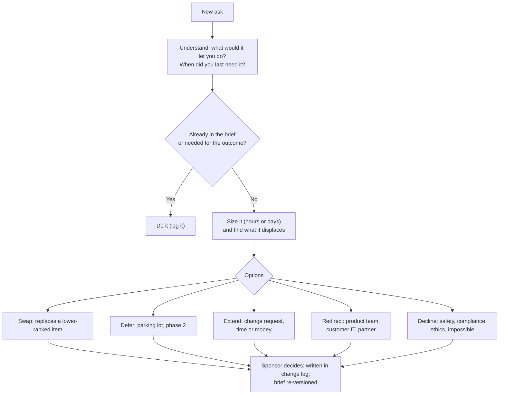
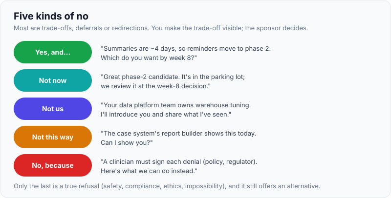

# Saying No & Managing Scope Creep Without Losing Trust

!!! abstract "Key takeaways"
    - **Scope creep is usually reasonable requests, one at a time.** Each "small" ask makes sense on its own. Together they kill the time-box and the outcome. The defence is a written baseline (the [scope brief](02-writing-the-scope-brief-success-criteria-assumptions-out-of.md)) and a visible change process.
    - **Understand before you answer.** "What would that let you do?" turns a feature request into a need, and the need often fits inside the current scope, or doesn't matter.
    - **There are five kinds of no:** *yes, and here's the trade-off* · *not now, here's when* · *not us, here's who* · *not this way, here's a better way* · *no, here's why* (only for safety, compliance, ethics or impossibility).
    - **You make trade-offs visible; the sponsor decides.** Show what the new ask displaces, or what it costs in time, and let the person who owns the outcome choose. Put the decision in writing.
    - **Trust is lost through surprises, not refusals.** A clear, early, reasoned "not now" with an alternative builds credibility. A "yes" you can't deliver destroys it.

## Why it matters

An FDE sits inside the customer's organisation, often for weeks. Everyone can reach you: the sponsor, users, IT, the sponsor's boss. Asks arrive in meetings, in Slack, and in the corridor. PostHog's FDE handbook frames the job's value as judgement, "prioritizing for our team and the customer" ([PostHog handbook](https://posthog.com/handbook/forward-deployed-engineering/overview)). Saying yes to everything turns a product deployment into an open-ended custom-development contract, misses the outcome the sponsor actually signed up for, and burns the FDE out.

Interviewers test this directly:

- In Palantir-style customer simulations, prep sites describe the interviewer as a difficult stakeholder who keeps moving the goalposts while you defend a scope decision. One JD template describes watching whether the candidate "can say no without the room getting cold" ([Valletta FDE JD template](https://vallettasoftware.com/blog/post/forward-deployed-engineer-job-description); see [page 6](06-customer-simulation-round-role-play-scenarios-and-how-they-a.md)).
- Behavioral rounds ask about scope creep, client conflict and recovering trust. Exponent's FDE behavioral course has lessons on pushing back on a client and on a customer pushing beyond the SOW ([Exponent](https://www.tryexponent.com/courses/fde-behavioral/push-back-client-technical-cross-functional)).

The general mechanics of saying no to a senior stakeholder (start from their goal, offer options, write it down) are covered in [Estimation, Deadlines & Stakeholder Management](../leadership-behavioral/07-estimation-deadlines-and-stakeholder-management.md), and positions vs interests in [Handling Conflict](../leadership-behavioral/05-handling-conflict-and-technical-disagreements.md). This page adds the FDE-specific parts: a customer who isn't your employer, a contract, product gaps, and an outcome you're accountable for.

## Core concepts

### Kinds of scope creep

| Kind | What it looks like | Response |
|---|---|---|
| **Feature drift** | "Could it also summarise calls?" | Triage against the outcome |
| **Stakeholder creep** | A new department joins: "we'd like it for claims too" | Welcome it; separate phase or brief |
| **Quality creep** | "Can accuracy be 99.9%?" | Tie the bar to the decision and the eval; price the extra |
| **"While you're here"** | "Can you look at our data warehouse performance?" | Redirect to the right owner, or price it |
| **Late constraint** | "Security says it must run on-prem" | Legitimate change: re-plan openly, don't absorb it |
| **Product gap** | "Your product needs SAML group sync" | Route to product with evidence ([page 7](07-field-feedback-to-product-and-research-codifying-repeatable.md)); offer a workaround |
| **Gold-plating (self-inflicted)** | The FDE adds polish nobody asked for | Discipline: the brief applies to you too |

Note the last one. Engineers often cause creep themselves by building the elegant generic version instead of the one the pilot needs.

### Triage: a repeatable path for every new ask


*Notice two things: "understand" comes before any answer, and every path ends with the sponsor's decision written down. The FDE frames the options; the owner of the outcome chooses.*

{ loading=lazy }
*Same four asks; only the bottom row still ends inside the time-box.*

### The five kinds of no

Most "no"s aren't refusals. They're trade-offs, deferrals or redirections.

| Kind | Script | When |
|---|---|---|
| **Yes, and…** | "Yes, we can add call summaries. It's about four days, so the reminder feature moves to phase 2. Which would you rather have by week 8?" | The ask is valuable and fits if something moves |
| **Not now** | "That's a great phase-2 candidate. I've added it to the parking lot with your notes, and we'll review it at the week-8 decision." | Valuable but not needed for the outcome |
| **Not us** | "That's a warehouse tuning question. Your data platform team owns it. I'll introduce you and share what I've seen." | Someone else owns it |
| **Not this way** | "Instead of building a custom dashboard, the case system's report builder can show this today. Can I show you?" | A cheaper path meets the need |
| **No, because** | "We can't auto-approve denials. Your policy and the regulator require a clinician to sign each one. Here's what we can do instead." | Safety, compliance, ethics or technical impossibility |

The only true "no" without options is the last row, and even that comes with an alternative.

{ loading=lazy }
*Four of the five keep the conversation going.*

### Principles from negotiation

*Getting to Yes* (Fisher & Ury) gives four principles that map directly to scope conversations:

1. **Separate the people from the problem.** The stakeholder isn't the enemy. The time-box is the shared problem.
2. **Focus on interests, not positions.** "I want summaries" is a position. "My team leads can't review calls fast enough" is the interest. There may be cheaper ways to serve it.
3. **Invent options for mutual gain.** Swap, phase, simplify, redirect.
4. **Use objective criteria.** The scope brief's outcome and success criteria are the criteria: "Does this help us hit the 72-hour target by week 8?"

Chris Voss's *Never Split the Difference* adds two tactics: **calibrated questions** ("How would we fit that in without moving the decision date?") let the stakeholder work through the constraint themselves; and a **"no"-oriented question** ("Would it be a bad idea to keep summaries for phase 2?") is easier for people to answer honestly than one that demands a yes.

### Trust: what builds and destroys it

David Maister's *The Trusted Advisor* defines trust as **(credibility + reliability + intimacy) ÷ self-orientation**. Each term maps to a scope behaviour:

- **Credibility:** your reasons are sound and specific ("four days, because of the telephony export").
- **Reliability:** you deliver what you said yes to, when you said. Fewer, kept promises beat many broken ones.
- **Intimacy:** they can tell you the real pressure ("my boss promised this to the COO"), which often explains the ask.
- **Self-orientation (the denominator):** if your "no" sounds like protecting yourself or your company's margin, trust drops. Frame every answer around their outcome.

The practical rule: **people forgive "not now"; they don't forgive "yes" followed by silence**. Bad news early, with options, as in the [estimation page](../leadership-behavioral/07-estimation-deadlines-and-stakeholder-management.md).

### When the right answer is yes

Being good at "no" doesn't mean always saying it:

- **New information changes the outcome.** A late constraint (on-prem, a regulator's rule) isn't creep. Re-plan openly.
- **The ask is cheap and builds real goodwill.** Small, clearly bounded favours are fine, if you track them. Many teams keep a small contingency for this. Judge it case by case, and stop when they add up.
- **The ask is the real need.** Sometimes discovery missed it. Say so, and re-scope with the sponsor.
- **It moves a strategic account to production.** That's a commercial call: escalate it to your account lead rather than deciding alone.

### Who decides, and escalation

The FDE frames options. The **sponsor** decides customer-side trade-offs. Your **account lead or engagement manager** decides anything affecting the contract (price, dates, staffing). When a stakeholder goes around the sponsor ("the COO wants it"), don't choose sides: bring the ask back to the sponsor with the trade-off. If two customer stakeholders disagree, escalate together with a written problem statement, as described in [Handling Conflict](../leadership-behavioral/05-handling-conflict-and-technical-disagreements.md).

## In practice: code & configuration

### Change log template

```text
CHANGE LOG — <customer> / <use case>  (linked from scope brief v1.3)

| ID  | Date  | Requested by | Ask (need behind it)                     | Size  | Option chosen       | Decided by | Brief ver |
|-----|-------|--------------|------------------------------------------|-------|---------------------|------------|-----------|
| C01 | 10/14 | Clinical lead| Call summaries (leads can't review fast) | 4 d   | Swap: reminders->P2 | Sponsor    | v1.2      |
| C02 | 10/16 | IT           | Must run on-prem (late constraint)       | +2 wk | Extend: change req  | Sponsor+AE | v1.3      |
| C03 | 10/20 | Ops manager  | Warehouse tuning                         | n/a   | Redirect: data team | n/a        | -         |
| C04 | 10/21 | Ops manager  | Auto-approve simple cases                | n/a   | Decline: policy     | Sponsor    | -         |
Parking lot (phase-2 candidates): reminders, multilingual outreach, mobile view.
```

### Written follow-up after a trade-off conversation

```text
Subject: Call summaries: decision and impact on the pilot plan

Hi <sponsor>,
Thanks for the time today. Summary of what we agreed:
- Need: team leads can't review calls fast enough (from <clinical lead>).
- Option chosen: add call summaries (about 4 days) and move automated
  reminders to the phase-2 parking lot.
- No change to the week-8 decision date or the success criteria.
- Brief updated to v1.2 (link). Change log entry C01.
If I've got any of this wrong, reply and I'll correct it.
<FDE>
```

### Role-play: a sponsor adds scope mid-pilot

=== "❌ Common mistake"
    ```text
    Sponsor: The COO saw the demo. She wants it to handle claims appeals too,
             for the board meeting in three weeks.
    FDE:     Sure, we'll make it work.
    -- Week 3: intake work half-done, appeals prototype brittle, no metric
       for either. The board demo goes badly; the pilot criteria are missed.
       Trust is lost on both sides.

    (Or the opposite failure:)
    FDE:     That's out of scope. It's not in the SOW.
    -- Technically true; the sponsor now sees you as an obstacle and goes
       around you.
    ```

=== "✅ Correct approach"
    ```text
    Sponsor: The COO saw the demo. She wants it to handle claims appeals too,
             for the board meeting in three weeks.
    FDE:     That's a good sign: she's seen value. What does she want to show
             the board: appeals working, or the impact of AI on operations?
    Sponsor: Honestly, a story about impact.
    FDE:     Then here are three options. One: keep the plan and give her a
             board slide with the intake results so far against the control
             group. That's real numbers. Two: a scripted appeals demo on
             sample data, clearly labelled a prototype. About three days,
             and intake slips three days. Three: a full appeals pilot as
             phase 2, starting after week 8. Which would serve her best?
    Sponsor: One, plus the phase-2 plan for appeals.
    FDE:     Great. I'll draft the slide and the phase-2 outline by Friday and
             send a summary of this decision today.
    ```

## Real-world usage

- **Consulting and systems integrators** formalise this as **change requests** against an SOW: each change is sized, priced and signed before work starts. FDEs need the same discipline with less paperwork and more speed.
- **Product companies with FDE teams** (Palantir, OpenAI, PostHog) have a second reason to say no: every custom one-off adds maintenance and pulls the product away from a reusable platform. PostHog says patterns seen across customers should become "reusable artifacts, skills, and product improvements" ([PostHog handbook](https://posthog.com/handbook/forward-deployed-engineering/overview)), so the right "no" is often a redirect to product.
- **Regulated domains:** many hard "no"s come from compliance: no autonomous clinical or credit decisions, no customer data to unapproved processors, audit trails required. Name the rule and the owner instead of saying "we can't".
- **Failure modes:** the yes-machine FDE (beloved for a month, then blamed for missing the outcome), the contract lawyer FDE ("not in the SOW", trust gone), and invisible absorption (doing changes quietly, so the plan looks wrong and the effort is never credited).

## Trade-offs & production gotchas

| Response | Pros | Cons | Use when |
|---|---|---|---|
| Absorb silently | No friction today | Hidden cost, missed outcome, unrecognised effort | Never for non-trivial asks |
| Swap | Keeps date and outcome | Something else waits | Ask is more valuable than a ranked item |
| Defer (parking lot) | Keeps focus, shows you listened | Stakeholder may feel brushed off | Valuable but not needed for this decision |
| Extend (change request) | Honest about cost | Slower, commercial conversation | Large or legitimate changes (late constraints) |
| Redirect | Right owner, builds network | Looks like passing the buck if done coldly | Someone else owns it; introduce and follow up |
| Decline | Protects safety and compliance | Friction | Safety, compliance, ethics, impossibility |

!!! warning "Gotchas"
    - **Answering in the hallway.** "I'll look into it" becomes "you promised". Say "Let me size it and come back with options by Thursday."
    - **Saying no to the person instead of the trade-off.** "Not in scope" alone sounds like a rule. "Here's what it would displace" invites a decision.
    - **Going around the sponsor.** A request from the sponsor's boss still goes through the sponsor.
    - **No written record.** Verbal trade-offs are forgotten; send the summary the same day.
    - **Treating late constraints as creep.** They're legitimate changes. Re-plan, don't resist.

## How this connects to my experience

- **Where I used it:**
    - "Led sprint planning, estimation, **stakeholder communication**, release management" (Leadership highlights).
    - Leading a cross-functional team of 8–10 on OptumRx Meteor, where requests came from the client product side, 5 upstream system teams and downstream consumers of the GraphQL Consumer Service.
    - Consulting delivery at Publicis Sapient and Deloitte, where scope is negotiated against an engagement.
- **Talking points:**
    - **Saying-no story:** a request you turned into a phased plan or a swap, with the trade-off you showed and the decision the product owner made. *[confirm: the request, who asked, what moved, outcome]*
    - **Redirect story:** a request to change the GraphQL layer that really belonged upstream (or vice versa), and how you routed it to the owning team. *[confirm]*
    - **Late-constraint story:** an upstream or security requirement that arrived late, and how you re-planned openly instead of absorbing it. *[confirm]*
    - Principle: "I make the trade-off visible and let the product owner decide, then write it down." This matches the approach in the [estimation page](../leadership-behavioral/07-estimation-deadlines-and-stakeholder-management.md).
- **Likely follow-up chain:** "Tell me about a time you said no to a client." → "How did they react?" → "What if they'd gone over your head?" → "Have you ever said yes and regretted it?" Answer: the real story with options → the decision and the relationship after → bring it back to the sponsor with the trade-off, escalate together with your account lead → an honest regret *[confirm]* and the habit it created (size first, answer later).

## Interview questions

### Fundamentals

??? question "Q1. What is scope creep and why is it dangerous in an FDE engagement?"
    **Answer:** The gradual growth of work beyond the agreed scope, usually through individually reasonable asks. In FDE work it breaks the time-box, dilutes focus so the agreed outcome is missed, turns a product deployment into custom development, and makes the FDE the bottleneck. Its main defence is a written baseline and a visible change process.

    **Interviewer listens for:** "individually reasonable" and the impact on the outcome.

    **Common wrong answer:** "When the customer asks for too much." It's often self-inflicted, too.

??? question "Q2. What's the first thing you do when a stakeholder asks for something new?"
    **Answer:** Understand the need behind it: "What would that let you do? When did you last need it?". Then check it against the brief and the outcome, size it, and come back with options. Don't answer yes or no on the spot for anything non-trivial.

    **Interviewer listens for:** understanding before answering.

    **Common wrong answer:** an immediate yes or an immediate "out of scope".

??? question "Q3. What are the different ways to say no?"
    **Answer:** Yes with a trade-off (swap), not now (parking lot or phase 2), not us (redirect to the owner), not this way (a cheaper alternative), and a reasoned no (safety, compliance, ethics, impossibility) that still offers an alternative.

    **Interviewer listens for:** that most "no"s are options.

    **Common wrong answer:** "I just explain that it's not in scope."

??? question "Q4. Who decides whether a change gets accepted?"
    **Answer:** The customer sponsor who owns the outcome decides customer-side trade-offs. The account lead or engagement manager decides contract-level changes (price, dates, staffing). The FDE sizes, frames options and recommends, and records the decision.

    **Interviewer listens for:** FDE frames, owner decides.

    **Common wrong answer:** "I decide, because I know the technical cost."

### Intermediate

??? question "Q5. How do you say no without damaging the relationship?"
    **Answer:** Start from their goal, show you understood the need, explain the constraint in their terms (the decision date, the outcome they signed up for, compliance), offer options, recommend one, let them choose, and follow up in writing. Deliver reliably on what you did agree. Trust comes from reliability and transparency, not from agreeing.

    **Interviewer listens for:** their goal first, options, reliability.

    **Common wrong answer:** "Be polite but firm." That's tone without substance.

??? question "Q6. How do you distinguish legitimate change from scope creep?"
    **Answer:** Legitimate change comes from new information that affects the outcome or feasibility: a late constraint, a discovery miss, a changed business priority. Creep adds things not needed for the agreed outcome. Both go through the change process; the difference is in how you frame it. Legitimate change means an open re-plan. Creep means a trade-off or the parking lot.

    **Interviewer listens for:** that late constraints are re-planned, not resisted.

    **Common wrong answer:** "Anything not in the original scope is creep."

??? question "Q7. What is gold-plating and how do you prevent it?"
    **Answer:** Engineers adding unrequested polish or generality (a generic framework when the pilot needs one workflow). Prevent it by holding yourself to the brief, reviewing work against the success criteria, and noting generalisation ideas for the product team instead of building them in the pilot.

    **Interviewer listens for:** self-awareness.

    **Common wrong answer:** "That's not creep, that's quality."

??? question "Q8. Why write down trade-off decisions?"
    **Answer:** Memories differ, stakeholders change, and decisions get relitigated. A short same-day summary and a change-log entry keep the brief accurate, credit the work done, and protect both sides at the decision meeting.

    **Interviewer listens for:** same day, linked to the brief.

    **Common wrong answer:** "Only for big changes."

### Senior

??? question "Q9. A request is a product gap, not a project task. How do you handle it?"
    **Answer:** Separate the immediate need from the product change. Offer a workaround if one exists and is safe. Log the gap for product with evidence: who needs it, how often, what it blocks, the revenue or deal at stake, and whether other customers hit it. Don't build a one-off fork the product team will have to maintain. Tell the customer honestly what happens next.

    **Interviewer listens for:** no forks, evidence-based product feedback, honesty.

    **Common wrong answer:** "Build it in the customer's branch."

??? question "Q10. When should an FDE say yes to something out of scope?"
    **Answer:** When new information makes it necessary for the outcome; when it's cheap, bounded and builds real goodwill (tracked, not unlimited); when discovery missed the real need; or when it's strategic and the account lead agrees to the commercial impact. In every case, make the cost visible.

    **Interviewer listens for:** judgement, not dogma.

    **Common wrong answer:** "Never."

??? question "Q11. How does the trust equation apply to scope conversations?"
    **Answer:** Maister's equation is (credibility + reliability + intimacy) ÷ self-orientation. Specific reasoning builds credibility, kept promises build reliability, and stakeholders who share their real pressures enable better options. A "no" that sounds self-protective (margin, effort) increases self-orientation and lowers trust, so frame everything around their outcome.

    **Interviewer listens for:** applying it, not reciting it.

    **Common wrong answer:** "Trust comes from saying yes."

??? question "Q12. How do you prevent scope creep structurally, not just case by case?"
    **Answer:** A signed brief with ranked scope and an explicit out-of-scope list; a change log and same-day summaries; a time-box with a booked decision meeting; weekly status showing changes and their impact; a parking lot reviewed at milestones; a single intake channel for requests; and a routing path to product for product gaps.

    **Interviewer listens for:** a system, not willpower.

    **Common wrong answer:** "Be strict with the customer."

### Scenario-based

??? question "Q13. A user stops you in the corridor: 'Can you just add one more field to the export? It's tiny.' What do you do?"
    **Answer:** Ask what they'd use it for and how often. If it's genuinely tiny and fits the outcome, log it and do it, and tell the sponsor in the weekly update. If not, say "Let me check how it fits the plan and come back to you by Thursday," and route it through triage. Never promise in the corridor.

    **Interviewer listens for:** small asks still logged, no corridor promises.

    **Common wrong answer:** "It's tiny, so just do it." Or "Raise a ticket."

??? question "Q14. The sponsor's boss tells you directly to add a feature and skip the sponsor. What do you do?"
    **Answer:** Listen and understand the goal behind it. Say you'll work out options with the sponsor, who owns the plan. Bring the request to the sponsor the same day with the trade-off and a recommendation. Involve your account lead if it affects the contract. Don't go around the sponsor, and don't refuse the boss either.

    **Interviewer listens for:** respecting the sponsor, not refusing seniority.

    **Common wrong answer:** "Do what the most senior person says."

??? question "Q15. Mid-pilot, IT announces the system must run on-prem rather than in the customer's cloud tenant. Is this scope creep? What do you do?"
    **Answer:** It's a legitimate late constraint, not creep. Understand the reason and the exact boundary (all data? which services are allowed?). Size the impact (model choice, infrastructure, security work). Present options: re-plan with a new date, narrow the pilot to data that can stay in the cloud while on-prem is built, or pause. Document it as a change request, tell the sponsor the same day, and add "deployment model confirmed with IT" to your discovery checklist.

    **Interviewer listens for:** classifying correctly, re-planning openly, a learning for discovery.

    **Common wrong answer:** "Push back on IT," or "absorb it and work weekends".

## Cheat sheet

| Concept | Remember |
|---|---|
| Creep | Reasonable asks, one at a time. Includes gold-plating |
| First move | "What would that let you do?" Size before answering |
| Five noes | Yes-and (swap) · not now · not us · not this way · no-because |
| Getting to Yes | People vs problem, interests, options, objective criteria (the brief) |
| Decides | Sponsor (customer trade-offs), account lead (contract). FDE frames |
| Trust | (Credibility + reliability + intimacy) ÷ self-orientation. Surprises kill it |
| Record | Change log + same-day summary + brief version |
| Product gaps | Workaround + evidence to product. No forks |
| Related | [Estimation & stakeholders](../leadership-behavioral/07-estimation-deadlines-and-stakeholder-management.md), [Conflict](../leadership-behavioral/05-handling-conflict-and-technical-disagreements.md), [Scope brief](02-writing-the-scope-brief-success-criteria-assumptions-out-of.md) |

## Sources
1. Roger Fisher & William Ury, *Getting to Yes*: interests not positions, options for mutual gain, objective criteria.
2. Chris Voss, *Never Split the Difference*: calibrated questions and "no"-oriented questions.
3. David Maister, Charles Green & Robert Galford, *The Trusted Advisor*: the trust equation.
4. [PostHog FDE handbook: overview](https://posthog.com/handbook/forward-deployed-engineering/overview): judgement and prioritisation; reusable artifacts from repeated patterns.
5. [Valletta FDE JD template](https://vallettasoftware.com/blog/post/forward-deployed-engineer-job-description): customer simulation with a hidden constraint and saying no (single prep-style source).
6. [Exponent FDE behavioral: pushing back on clients](https://www.tryexponent.com/courses/fde-behavioral/push-back-client-technical-cross-functional) and [customer pushing beyond the SOW](https://www.tryexponent.com/courses/fde-behavioral/customer-pushing-sow): interview angle (prep site).
7. [Basecamp: Shape Up](https://basecamp.com/shapeup): fixed time, variable scope as the frame for trade-offs.
8. Resume: `Vishal_Hulawale_Resume_10012026.pdf` (stakeholder communication, cross-functional team of 8–10, 5 upstream systems).
