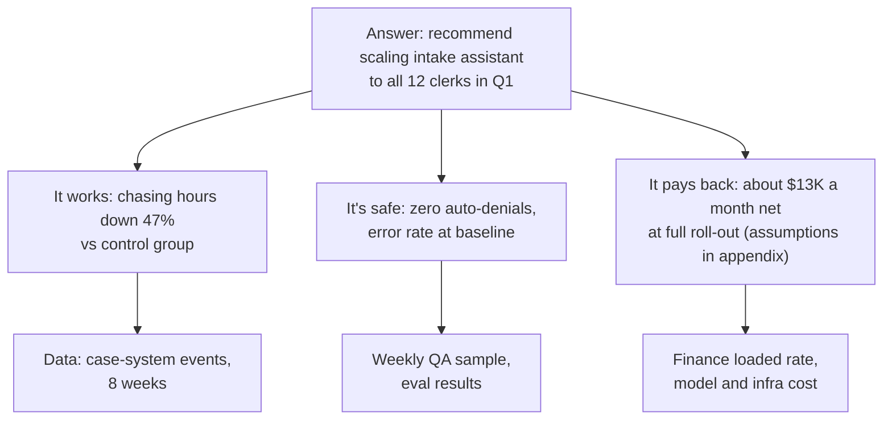
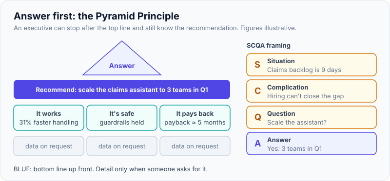
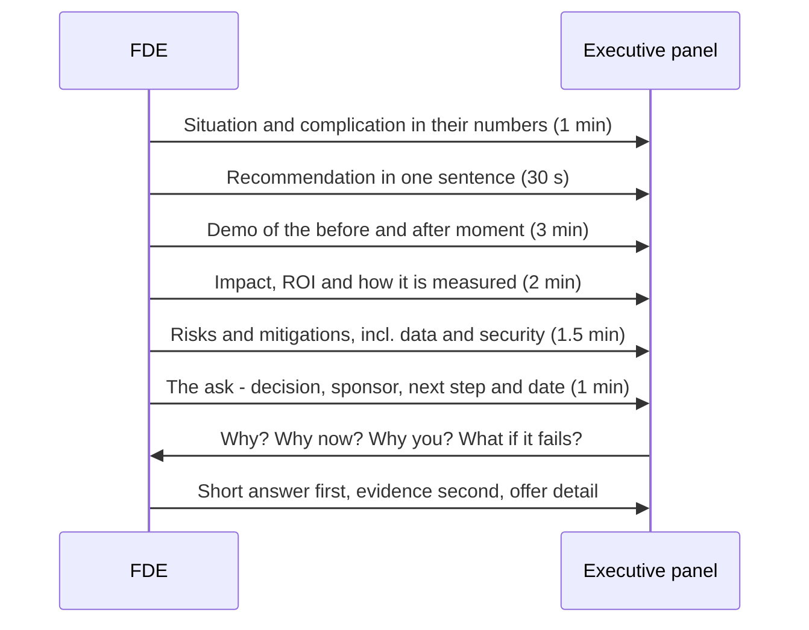
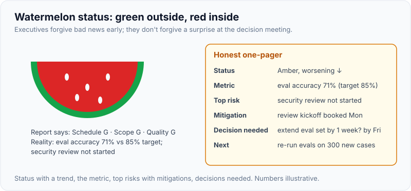

# Talking to Executives vs Engineers: Demos, Executive Pitch, Status Updates

!!! abstract "Key takeaways"
    - **Same facts, different altitude.** Executives want *outcome, risk, money, decision needed*. Engineers want *how it works, interfaces, constraints, failure modes*. End users want *what changes in my day*. Security wants *data flows and controls*.
    - **Answer first for executives** (Minto's Pyramid Principle, BLUF): recommendation in the first sentence, three supporting points, detail only on request. Frame it with **SCQA**: Situation, Complication, Question, Answer.
    - **Demos tell a story about their workflow, not your technology:** a named user, today's pain in their numbers, the "after" moment, proof on their data, and an ask. Rehearse, use their data where allowed, and keep a recording as a fallback.
    - **The executive pitch round** (reported at Cognition) rewards stating business value in the first five minutes, staying composed under "why?" questions, and saying "I don't know, here's how I'd find out" cleanly.
    - **Status updates:** status *with trend*, progress against the metric, top risks with mitigations, and decisions needed, on one page, on a fixed cadence. Bad news early, with options. No "watermelons" (green outside, red inside).

## Why it matters

In one day an FDE may present to a COO, debug an integration with the customer's platform engineers, train end users and answer a security architect. Palantir describes its field roles as a blend of "product manager, software engineer and strategist" ([Palantir blog](https://blog.palantir.com/a-day-in-the-life-of-a-palantir-deployment-strategist-951cb59a5a96)). The skill being tested is **changing altitude without changing the truth**.

Interview loops test it explicitly:

- **Cognition:** candidate reports on Exponent describe an **executive pitch**, a simulated product pitch to a panel playing company executives, plus a case-study customer call. One candidate who got an offer advised being able to say "in the first five minutes why it mattered to the business" and practising being "hit with a question you genuinely do not know, because that is basically the interview" ([Exponent: Cognition guide](https://www.tryexponent.com/guides/cognition-forward-deployed-engineer-interview), [candidate experience](https://www.tryexponent.com/experiences/cognition-ai-forward-deployed-engineer-interview-0f2ca2)). These are candidate reports, not official Cognition material.
- **Take-home presentations and deep dives** across FDE loops ask you to present the same work to technical and non-technical listeners. Another report notes the need to make "a tangled technical idea clear in about thirty seconds" ([Exponent candidate experience](https://www.tryexponent.com/experiences/cognition-ai-forward-deployed-engineer-interview-2fb476)).
- Tailoring status to executives vs teams is covered for internal stakeholders in [Estimation & stakeholder management](../leadership-behavioral/07-estimation-deadlines-and-stakeholder-management.md). This page covers customer-facing versions: demos, pitches and customer status.

## Core concepts

### The audience matrix

| Audience | Cares about | Format | Vocabulary | Length |
|---|---|---|---|---|
| **Executive sponsor / C-level** | Outcome, money, risk, timing, decision needed, what peers do | Answer-first, one page or 5 slides, live conversation | Business metrics, their KPIs | 1–10 min |
| **Middle manager / process owner** | Team workload, adoption, process change, their metrics | Before/after workflow, plan | Process, roles, SLAs | 15–30 min |
| **Engineers / platform team** | Architecture, interfaces, data contracts, failure modes, ops burden | Diagrams, code, logs, docs | Precise technical | As long as needed |
| **End users** | What changes in their day, will it make mistakes, will it replace them | Hands-on, their real cases | Their job words | Short, repeated |
| **Security / compliance** | Data flows, storage, access, audit, model provider terms | Data-flow diagram, controls matrix | Controls, standards | Document + review |

### Answer first: Pyramid, SCQA, BLUF

Barbara Minto's **Pyramid Principle** (from her time at McKinsey) says to *think* bottom-up (data → findings → conclusion) but *communicate* top-down: lead with the governing thought, then group supporting arguments (ideally three, mutually exclusive and collectively exhaustive), then detail ([Pyramid Principle summary](https://managementconsulted.com/pyramid-principle/)). **SCQA** frames the opening: **S**ituation (what we all agree on), **C**omplication (what changed or is going wrong), **Q**uestion (what to do), **A**nswer (the recommendation). The military version, **BLUF** (bottom line up front), says the same thing for emails.


*Notice that the executive can stop reading after the top box and still know the recommendation, or after the second row and know why. Detail is there only for whoever asks. The figures are illustrative.*

{ loading=lazy }
*Read only the top line: you should already know the ask.*

### Translating technology into business terms

Climb the "so what?" ladder until you reach something the executive measures:

| Rung | Example |
|---|---|
| Technology | "We use retrieval-augmented generation with a re-ranker." |
| Capability | "It finds the right policy paragraph and cites it." |
| Workflow change | "Nurses stop hunting through PDFs for each request." |
| Outcome | "Review time per request drops from 18 to 11 minutes." |
| Business metric | "72-hour compliance rises from 61% to the 75% target, avoiding penalties." |

Executives start at the bottom two rungs. Engineers start at the top two. A good FDE can ride the ladder in both directions in one sentence: "It cites the policy paragraph (capability), which is why review time dropped 40% (outcome)."

### Demo craft

A demo is a story with a proof in the middle. Structure:

1. **Hook in their numbers:** "Your clerks chased 2,600 incomplete requests last month."
2. **Persona and "before":** "This is Priya's queue at 9 a.m." Show the real pain, briefly.
3. **The "after" moment:** the one interaction that makes them lean forward. Get there within the first few minutes.
4. **Proof:** their data (or realistic data if they can't share yet), the eval result, the edge case handled well, and one case where it says "I'm not sure" (that builds more trust than a flawless run).
5. **Impact and ask:** "If this holds for all 12 clerks, that's about 50 hours a day. We propose an 8-week pilot with this team."

Demo rules:

- **Rehearse the exact path** at least twice in the real environment. Know what will be slow.
- **Have a fallback:** a recorded run, screenshots, a second environment. Say calmly, "Let me switch to the recording" if something breaks.
- **Don't demo features, demo the workflow.** Nobody remembers your settings page.
- **Use their language:** their system names, their roles, their document types.
- **For engineers, flip the order:** architecture first, then live code, logs, failure handling and "how would we operate this?". They trust a demo that shows what happens when an upstream times out.

### The executive pitch

A pitch to executives (or a panel playing them) is a short, structured argument. A reliable ten-minute shape:


*Notice that the recommendation comes in the first ninety seconds and the ask is concrete (a decision, an owner, a date). The Q&A is where most of the scoring happens, so leave time for it.*

**Handling executive questions:**

- **Answer in one sentence first**, then offer depth: "Yes, it can run in your tenant. Want the detail?"
- **Don't know?** "I don't know. Here's how I'd find out, and I'll have it to you by Thursday." Never bluff; executives test for it on purpose.
- **Hostile or sceptical question:** acknowledge the concern ("That's the right worry"), give the evidence or the mitigation, and check: "Does that address it?"
- **"Why not build it ourselves?"** Compare on time to value, risk, maintenance and opportunity cost, respectfully; their engineers may be in the room.
- **Questions about cost:** have the cost-per-task number and the assumptions ready (see [page 3](03-pilot-to-proof-of-concept-to-production-time-boxing-exit-cri.md)).

### Status updates that executives trust

A weekly customer status note has five parts:

1. **Headline:** on track / at risk / off track, *with the trend* ("at risk, improving").
2. **Progress against the metric**, not tasks completed.
3. **Top three risks** with owner and mitigation.
4. **Decisions needed** from them, with a date.
5. **Next week.**

Engineers get a different note: tickets, blockers, interface changes, environments and incidents. The danger in both is the **watermelon report**: green on the outside, red inside. Report the real state early; amber with a plan beats red with a surprise.

{ loading=lazy }
*Amber with a plan beats red with a surprise.*

## In practice: code & configuration

### Demo script (12 minutes, executive audience)

```text
DEMO: Prior-auth intake assistant · audience: VP UM, COO delegate · 12 min

0:00  Hook        "Last month your clerks chased 2,600 incomplete requests:
                   about 50 staff-hours a day." (their case-system data)
0:45  Before      Priya's queue at 9 a.m.: three incomplete requests, the side
                   spreadsheet, the email template. 60 seconds, no more.
1:45  After       Same queue: assistant flags missing documents with the policy
                   citation, drafts provider outreach; Priya edits and sends.
                   -> the "lean forward" moment
4:00  Edge case   A request where the assistant says "not sure, needs review".
                   Point: it knows its limits; a human decides.
5:00  Proof       Eval on 300 of their past cases: recall 96%, precision 88%.
                   Pilot plan with control group.
7:00  Safety      Runs in their Azure tenant; no auto-denials; audit log.
8:00  Impact      50 h/day at full roll-out; cost per request ~$1.40 vs ~$3.10.
                   Assumptions on one slide.
9:00  Ask         "Approve an 8-week pilot with 4 clerks; decision on Dec 4.
                   We need a security contact by Friday."
9:30  Q&A         Leave the rest for questions.
FALLBACK: recorded run (same path) on laptop + screenshots in the deck.
```

### Executive status one-pager

```text
STATUS — Intake assistant pilot · Week 5 of 8 · 2026-11-06
Headline: AT RISK (improving). Results on track; security review is the risk.

Metric vs target     Chasing hours, pilot vs control: -41% (target -50% by wk 8)
                     Adoption: 78% of incomplete requests (target 80%)
                     Guardrails: 0 auto-denials; outreach errors 0.3% (base 0.4%)
Top risks            1. Security review not started by customer IT -> production
                        slips 6 wks. Ask below. (owner: CISO delegate)
                     2. Two clerks on leave in wk 7 -> smaller sample. Mitigation:
                        extend measurement window by 1 wk if needed.
Decisions needed     Name the security reviewer by Nov 10 (sponsor).
Next week            Fix top-2 failure modes from QA sample; prep decision deck.
```

### Same question, two audiences

=== "❌ Common mistake"
    ```text
    COO: "Will it make things up?"
    FDE: "Well, LLMs are probabilistic, so hallucination is an open research
          problem. We use RAG with a hybrid BM25 and dense retriever, a cross-
          encoder re-ranker, temperature zero, and we're evaluating faithfulness
          with an LLM-as-judge on a golden set, though the judge has its own
          biases, and..."
    -- Accurate, but the COO still doesn't know: how often, how bad, and what
       stops a bad answer reaching a patient.
    ```

=== "✅ Correct approach"
    ```text
    To the COO:
    "Sometimes, yes. That's why it never acts on its own. On 300 of your past
     cases it was wrong about 4% of the time, and every one of those was caught
     because a clerk approves each message. We track the error rate weekly; if
     it rises above your current human error rate, we stop and fix it."

    To the customer's platform engineers:
    "Retrieval is hybrid BM25 plus embeddings over the policy corpus, re-ranked,
     with citations required in the output schema. Faithfulness is checked
     against a 300-case golden set in CI. Failures cluster on scanned PDFs with
     bad OCR; that's our top fix this week. Logs and traces are in your Log
     Analytics workspace."
    ```

## Real-world usage

- **Amazon** replaced slide decks in senior meetings with six-page narratives and PR/FAQs read silently at the start of the meeting, on the view that full sentences force clearer thinking than bullets (Bryar & Carr, *Working Backwards*). Useful for written customer proposals.
- **McKinsey-style consulting** uses the Pyramid Principle and SCQA for executive decks: one governing message per slide, written as a full-sentence headline.
- **Palantir and AI-lab FDE teams** demo on the customer's own data wherever possible. Palantir's AIP Bootcamps are built around customers seeing their own workflows running within days ([Palantir blog](https://blog.palantir.com/deploying-full-spectrum-ai-in-days-how-aip-bootcamps-work-21829ec8d560)).
- **Regulated domains:** in healthcare and banking, the security and compliance audience is often the real decision-maker for go-live. Prepare a data-flow diagram and a controls table as carefully as the executive deck.
- **Failure modes:** the feature tour (every setting, no story), the live demo with no fallback, the jargon wall to executives, the hand-wave to engineers ("it scales"), and the watermelon status.

## Trade-offs & production gotchas

| Format | Pros | Cons | Use when |
|---|---|---|---|
| Live demo | Credible, engaging, handles questions | Can fail live | Real environment rehearsed; fallback ready |
| Recorded demo | Reliable, tight timing | Less credible, no improvisation | Unstable environment, large audience, fallback |
| Slides | Structured, shareable | Easy to hide weak logic in bullets | Executive pitch with clear headlines |
| Written narrative (memo, 1–6 pages) | Forces clear thinking, reads asynchronously | Takes time to write | Proposals, decisions, scope briefs |
| Whiteboard / diagram session | Collaborative, good for engineers | Hard to share afterwards | Architecture with the customer's platform team |

!!! warning "Gotchas"
    - **Starting with the architecture for executives.** You'll lose them before the value.
    - **Starting with the value for engineers and never getting to the how.** They'll assume it doesn't exist.
    - **Bluffing an answer.** One caught bluff discredits the whole pitch.
    - **No ask.** A great demo with no requested decision becomes "very interesting, let's stay in touch".
    - **Status about activity, not outcome.** "Completed 14 tickets" tells an executive nothing.
    - **Demo data that leaks.** Never show one customer's data to another, and check what's visible in your browser tabs and terminals before sharing your screen.

## How this connects to my experience

- **Where I used it:**
    - "Led sprint planning, estimation, **stakeholder communication**, release management" (Leadership highlights).
    - "Collaborated with senior architects to design scalable service architecture, API strategies, and data integration patterns" (OptumRx): technical audience at architect level.
    - Leading a cross-functional team of 8–10 across backend, frontend and QA, and mentoring 5+ engineers: explaining the same design to different levels.
    - "Conducted technical interviews": comfortable assessing and explaining technical depth live.
- **Talking points:**
    - "I'd present sprint demos to *[confirm: client product owners / business stakeholders]*, showing working features on the user journey rather than API details." *[confirm cadence and audience]*
    - "With architects I went deep on GraphQL schema design, caching and Kafka retry/DLQ trade-offs; with client stakeholders I talked about what users would see and when." *[confirm example]*
    - Executive exposure: *[confirm whether you presented to client directors or VPs; if not, say so and point to sprint reviews and release communication]*.
    - Prepare one 30-second and one 3-minute explanation of the GraphQL Consumer Service (integration layer between 5 upstreams and multiple consumers) for an executive and for an engineer.
- **Likely follow-up chain:** "Explain your current system to me as if I were the CEO." → "Now as if I were a staff engineer." → "How do you handle a question you can't answer in a client meeting?" → "Tell me about a demo that went wrong." Answer: business value of serving 750K+ users reliably → schema federation, caching and DLQ details → "I don't know, here's how I'll find out by X" → a real story *[confirm]* with the fallback and the follow-up.

## Interview questions

### Fundamentals

??? question "Q1. How do you communicate differently with executives and engineers?"
    **Answer:** Executives get the answer first: outcome, money, risk, decision needed, in a page or a few minutes, with detail on request. Engineers get the mechanism: architecture, interfaces, constraints, failure modes and operations, with diagrams and code. The facts are the same; the order and altitude change.

    **Interviewer listens for:** answer-first vs mechanism-first, same truth.

    **Common wrong answer:** "I simplify for executives." Simplifying isn't the same as reordering around their decision.

??? question "Q2. What is the Pyramid Principle?"
    **Answer:** Barbara Minto's method: think bottom-up but communicate top-down. Lead with the governing thought (recommendation), support it with a few grouped, non-overlapping arguments, and keep data underneath for whoever asks. SCQA (Situation, Complication, Question, Answer) frames the opening.

    **Interviewer listens for:** answer first, grouped support.

    **Common wrong answer:** "Tell the story chronologically, then give the conclusion."

??? question "Q3. What makes a good product demo?"
    **Answer:** A story in the customer's terms: a hook in their numbers, a real persona's "before", the "after" moment early, proof on their data including an honest edge case, impact, and a concrete ask. Rehearsed in the real environment with a recorded fallback.

    **Interviewer listens for:** workflow not features, an ask, a fallback.

    **Common wrong answer:** "Show all the features."

??? question "Q4. What should a weekly status update to a customer executive contain?"
    **Answer:** A headline status with trend, progress against the success metric, top risks with owners and mitigations, decisions needed with dates, and next steps, on one page. No task lists.

    **Interviewer listens for:** trend, decisions needed, metric not activity.

    **Common wrong answer:** "A list of completed tickets."

### Intermediate

??? question "Q5. How do you explain a technical risk, such as hallucination, to a non-technical executive?"
    **Answer:** In terms of frequency, impact and control: how often it's wrong on their data, what the worst case would be, what prevents harm (human approval, guardrails), how it's monitored, and the stop rule. Compare with the current human error rate. Avoid the mechanism unless asked.

    **Interviewer listens for:** a number, a control, a comparison.

    **Common wrong answer:** a lecture on how LLMs work.

??? question "Q6. Your live demo breaks in front of the customer. What do you do?"
    **Answer:** Stay calm and name it briefly ("That's a timeout from the sandbox"). Switch to the recorded run or screenshots without fuss and keep the story going. Follow up afterwards with the cause and, if useful, a re-run. Prevention: rehearse in the real environment, have a fallback, and avoid demoing untested paths.

    **Interviewer listens for:** composure, a fallback, follow-up.

    **Common wrong answer:** debugging live for ten minutes.

??? question "Q7. How do you answer an executive question you don't know the answer to?"
    **Answer:** Say so plainly, say how you'll find out and by when, and then do it. If you can bound the answer, do ("I don't know the exact figure; it's in the low thousands per month, and I'll confirm by Thursday"). Never bluff.

    **Interviewer listens for:** honesty plus a commitment.

    **Common wrong answer:** a confident guess.

??? question "Q8. How would you run a demo for the customer's engineering team instead of executives?"
    **Answer:** Architecture first, then live code paths, logs and traces, failure handling (timeouts, retries, bad inputs), security and data flow, how it deploys and how they'd operate it. Invite them to try to break it. Bring the docs and be precise about what's not done yet.

    **Interviewer listens for:** failure modes and operability.

    **Common wrong answer:** the same demo as the executives.

### Senior

??? question "Q9. Structure a 10-minute executive pitch for an AI deployment."
    **Answer:** Situation and complication in their numbers (1 min), the recommendation in one sentence (30 s), a demo of the before/after moment (3 min), impact and how it's measured (2 min), risks and mitigations including data and security (1.5 min), the ask: decision, owner, date (1 min), and the remaining time for questions.

    **Interviewer listens for:** value in the first minutes, a concrete ask, time for Q&A.

    **Common wrong answer:** ten minutes of architecture slides.

??? question "Q10. An executive says, 'Why don't we just build this ourselves?' How do you respond?"
    **Answer:** Treat it as a fair question. Compare honestly: time to value, the specialised work involved (evals, guardrails, integration), maintenance, and what their engineers would stop doing. Acknowledge where building makes sense (a core differentiator, strong in-house AI team). Offer a hybrid (their team owns the integration and the workflow logic, we provide the platform) and let the numbers decide.

    **Interviewer listens for:** respect, honest comparison, hybrid options.

    **Common wrong answer:** dismissing their team's ability.

??? question "Q11. How do you keep status honest when the project is struggling?"
    **Answer:** Report the real state as soon as you know, with trend, cause, impact and options, and recommend one. Show the metric even when it's bad. Agree in advance what amber and red mean. A sponsor who hears bad news early can act; one who hears it late is embarrassed in front of their boss.

    **Interviewer listens for:** early, options, no watermelons.

    **Common wrong answer:** "Keep it green and fix it quietly."

??? question "Q12. How do you prepare for a meeting with a C-level executive at a customer?"
    **Answer:** Know their goals (annual report, recent announcements, the sponsor's briefing), their KPIs and the political context. Prepare the answer-first message, a 2-minute version, the numbers with assumptions, the likely hard questions, and the specific ask. Agree roles with your sponsor and account lead beforehand.

    **Interviewer listens for:** homework, a crisp ask, alignment with the sponsor.

    **Common wrong answer:** "Bring the standard deck."

### Scenario-based

??? question "Q13. Explain your current project to me in 30 seconds as if I were the CEO, then in 2 minutes as if I were a staff engineer."
    **Answer structure:** CEO: what it does for users and the business, the scale, the result ("We built the integration layer that gives 750K+ OptumRx users one fast, secure view across five backend systems...") *[confirm outcome metrics]*. Staff engineer: GraphQL as the integration layer, the upstreams and their behaviour, caching with Redis, Kafka workflows with retry and DLQ, OAuth2 and PingFederate security, and one hard trade-off you made.

    **Interviewer listens for:** a clear altitude switch, a business outcome, one real trade-off.

    **Common wrong answer:** the same explanation twice at different speeds.

??? question "Q14. In an executive pitch, the CFO interrupts at minute two: 'What's this going to cost us?' What do you do?"
    **Answer:** Answer it then, briefly: "About $X a month at full roll-out, against about $Y of staff time saved; I'll show the assumptions in a minute." Then continue, making sure the impact section shows the numbers. Don't defer the question to the end; a deferred cost question leaves them listening for the catch.

    **Interviewer listens for:** a direct answer with a number, then control of the flow.

    **Common wrong answer:** "We'll get to pricing at the end."

??? question "Q15. The sponsor wants the status report to say 'green' to their boss, but the project is at risk. What do you do?"
    **Answer:** Talk to the sponsor privately first: explain the risk, the trend and the options, and agree a plan they can present ("amber, with a recovery plan and a decision needed"). Help them look in control, not exposed. If they still insist on misreporting a material risk, raise it with your account lead. You can't sign a report you know is false.

    **Interviewer listens for:** protecting the sponsor and the truth.

    **Common wrong answer:** "It's their report, so I'd go along with it."

## Cheat sheet

| Concept | Remember |
|---|---|
| Altitude | Exec: outcome, money, risk, decision. Engineer: how, interfaces, failure modes |
| Pyramid | Answer first, three grouped reasons, data underneath |
| SCQA / BLUF | Situation, Complication, Question, Answer. Bottom line up front |
| So-what ladder | Technology → capability → workflow → outcome → business metric |
| Demo | Hook, before, after (early), proof on their data, honest edge case, ask, fallback |
| Pitch | Value in the first minutes, concrete ask, leave time for Q&A |
| Unknown question | "I don't know. Here's how I'll find out by X." |
| Status | Headline + trend, metric, risks, decisions needed, next. No watermelons |
| Related | [Estimation & stakeholders](../leadership-behavioral/07-estimation-deadlines-and-stakeholder-management.md), [Pilots & ROI](03-pilot-to-proof-of-concept-to-production-time-boxing-exit-cri.md), [Customer simulation](06-customer-simulation-round-role-play-scenarios-and-how-they-a.md) |

## Sources
1. Barbara Minto, *The Pyramid Principle*: answer first, grouped arguments, SCQA ([summary](https://managementconsulted.com/pyramid-principle/)).
2. Colin Bryar & Bill Carr, *Working Backwards*: six-page narratives, PR/FAQ and silent-reading meetings.
3. [Exponent: Cognition FDE interview guide](https://www.tryexponent.com/guides/cognition-forward-deployed-engineer-interview): executive pitch and case-study customer call stages (candidate-updated prep site).
4. Exponent candidate experiences for Cognition FDE: [report 0f2ca2](https://www.tryexponent.com/experiences/cognition-ai-forward-deployed-engineer-interview-0f2ca2), [report 2fb476](https://www.tryexponent.com/experiences/cognition-ai-forward-deployed-engineer-interview-2fb476): business value in the first five minutes, unknown questions, 30-second explanations (candidate reports).
5. [Palantir: A Day in the Life of a Deployment Strategist](https://blog.palantir.com/a-day-in-the-life-of-a-palantir-deployment-strategist-951cb59a5a96): the blended field role.
6. [Palantir: How AIP Bootcamps work](https://blog.palantir.com/deploying-full-spectrum-ai-in-days-how-aip-bootcamps-work-21829ec8d560): demos on customer data.
7. Nancy Duarte, *Resonate*: presentation as a story with a "before" and "after".
8. Resume: `Vishal_Hulawale_Resume_10012026.pdf` (stakeholder communication, collaboration with senior architects, team leadership, technical interviewing).
