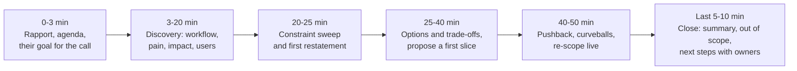

# Customer Simulation Round: Role-Play Scenarios & How They Are Scored

!!! abstract "Key takeaways"
    - **The format:** the interviewer plays a customer stakeholder with a vague request and at least one constraint they won't volunteer. You run a live discovery call, scope a solution and handle pushback, usually in 45–60 minutes. Details come from candidate reports and prep sites, so confirm the format with your recruiter.
    - **What's scored:** questions before solutions, listening and restating, finding the hidden constraint, structure and time management, sound and appropriately small technical judgement, scoping and saying no with alternatives, business framing, composure, and a clean close.
    - **The most common failure is solving too early.** Prep sites list "jumping straight to a solution" as the top rejection reason in decomposition and simulation rounds. Spend the first third asking, but don't interrogate. Every few questions, play back what you heard.
    - **Ask directly for the constraint:** "What would make this a non-starter for security, legal or IT?" and, at the end, "What haven't I asked that I should have?"
    - **Close like a professional:** restate the problem, the proposed first step, what's out of scope, the open questions and the next steps with owners.

## Why it matters

The customer simulation is the round most specific to FDE loops and the one engineers prepare for least. Practical coding and system design have well-worn prep material. Running a convincing customer call doesn't, and many strong engineers fail it by doing what made them good engineers: hearing a problem and immediately designing a solution.

What candidates and prep sites report (none of this is official company material):

| Company | Reported format | Source |
|---|---|---|
| **Palantir** | The decomposition round: a vague, large enterprise problem with missing information; the interviewer plays a client stakeholder who doesn't give everything up front, sometimes moving the goalposts while you defend a scope decision. About 60 minutes, sometimes in a live pairing tool | [techinterview.org](https://www.techinterview.org/post/3233477236/forward-deployed-engineer-interview/), [Exponent: Palantir FDE](https://www.tryexponent.com/guides/palantir-forward-deployed-engineer-interview), [Exponent: decomposition guide](https://www.tryexponent.com/blog/how-to-answer-decomposition-interview-questions-the-definitive-guide-2026) |
| **Cognition** | A timed case-study customer call: prepare, then run a simulated call with a fictional customer; separate executive pitch round | [Exponent: Cognition FDE](https://www.tryexponent.com/guides/cognition-forward-deployed-engineer-interview) |
| **ElevenLabs** | Case study: a hypothetical customer presents a problem and you mock up a solution (another prep site doesn't list this round, so the format may have changed) | [Exponent: ElevenLabs FDE](https://www.tryexponent.com/guides/elevenlabs-forward-deployed-engineer-interview) |
| **Databricks** | Clarifying questions are a scored criterion: define goal, scope and constraints before designing | [Exponent: Databricks FDE](https://www.tryexponent.com/guides/databricks-forward-deployed-engineer-interview) |
| **Generic FDE loops** | A ~60-minute simulation where the interviewer plays an operations lead with a vague request and a hard constraint not yet mentioned; tests whether you can say no "without the room getting cold" | [Valletta FDE JD template](https://vallettasoftware.com/blog/post/forward-deployed-engineer-job-description), [Medium: the FDE interview has six rounds](https://medium.com/@shivanathd/the-forward-deployed-engineer-interview-has-six-rounds-365df0544e2c) |

The skills it tests are the ones in pages 1–5 of this topic: [discovery](01-discovery-interviews-workflow-mapping-hidden-constraints-res.md), [scoping](02-writing-the-scope-brief-success-criteria-assumptions-out-of.md), [pilot design](03-pilot-to-proof-of-concept-to-production-time-boxing-exit-cri.md), [saying no](04-saying-no-and-managing-scope-creep-without-losing-trust.md) and [changing altitude](05-talking-to-executives-vs-engineers-demos-executive-pitch-sta.md), compressed into one hour with someone watching.

## Core concepts

### What interviewers score

No company publishes its rubric. The table below combines what prep sites and candidate reports say is assessed. Use it to practise and to score yourself.

| Dimension | Strong signal | Weak signal |
|---|---|---|
| **Discovery** | Past-tense, open questions about the workflow, users, volumes, current tools | Asks about features; yes/no questions; or no questions |
| **Listening and restating** | Plays back what they heard every few minutes; uses the stakeholder's words | Moves on without confirming; misremembers details |
| **Hidden constraint** | Sweeps categories (data, security, deployment, budget, timeline, people); asks directly; adapts when it appears | Constraint never surfaces, or appears and is ignored or argued with |
| **Structure and time** | Sets an agenda, signposts, checks time, reserves the last 10 minutes | Wanders; runs out of time before proposing anything |
| **Technical judgement** | Proposes a simple, feasible first step with trade-offs; knows what's hard (data, integration, evals) | Over-engineers (a multi-agent platform for a CSV problem) or hand-waves feasibility |
| **Scoping and saying no** | Narrows to a first slice; declines or defers with alternatives; frames trade-offs | Says yes to everything, or refuses coldly |
| **Business framing** | Ties the solution to the stakeholder's metric and cost; suggests how to measure success | Talks only about technology |
| **Composure and empathy** | Calm under pushback or frustration; acknowledges feelings; doesn't get defensive | Argues, over-apologises or freezes |
| **Close** | Summarises problem, proposal, out of scope, open questions, next steps | Ends abruptly, or with "any questions?" |

!!! question "Interview angle"
    Prep sites also warn about the opposite failure: asking so many questions that you seem to need excessive guidance, or never committing to a proposal. The scored behaviour is **disciplined curiosity followed by a decision**.

### A minute-by-minute plan (45–60 minutes)


*Notice that you propose something by around the midpoint. Discovery that never reaches a proposal fails the "technical judgement" and "scoping" rows, so keep an eye on the clock. Scale the timings to the actual length.*

**Opening (example):** "Thanks for making time. My aim today is to understand how things work today and where it hurts, and then sketch a first step we could take together. Is there anything you need from this call? Do we have the full hour?"

**Signposting:** "I'd like to ask a few questions about how this works today before I suggest anything. Is that OK?" Then, later: "I think I understand enough to suggest an approach. Can I play back what I've heard first?"

**Thinking aloud:** state your reasoning as you go ("Since the data can't leave your network, a hosted API is out, so I'm thinking about..."). Silence while you think is a reported failure mode across FDE rounds.

### Personas and curveballs

Interviewers usually play one of a handful of personas, and introduce one or two curveballs:

| Persona | Behaviour | What works |
|---|---|---|
| **Impatient executive** | "Just tell me what you'll build and when." | Answer first in one sentence, then ask the two questions you really need |
| **Burned customer** | "The last vendor wasted six months." | Acknowledge it, ask what went wrong, design the plan to avoid it (short time-box, early proof) |
| **Sceptical IT or security lead** | "Nothing leaves our network." | Treat it as a requirement, ask for boundaries, adapt the design |
| **Vague visionary** | "We want to be AI-first." | Anchor on one workflow and one metric |
| **Goalpost mover** | Adds or changes requirements mid-call | Restate, size, trade off; defend scope with reasons and alternatives |
| **Solution-prescriber** | "We need a chatbot in two weeks." | Explore the need behind it; propose the smallest thing that tests it |

Common curveballs: the hidden constraint finally emerges (data residency, on-prem, no budget until next fiscal year, a union agreement, an auditor, a regulatory deadline); the stakeholder rejects your first proposal; they demand a price or a date on the spot; they reveal that a competing internal team is building the same thing; or they go quiet to see whether you fill the silence with pitching.

### Handling the hidden constraint when it appears

1. **Acknowledge and label it:** "So on-prem is a hard requirement. Thank you, that changes things."
2. **Explore its edges:** all data or some? Which services are approved? Who owns exceptions? Why does it exist?
3. **Re-scope openly:** "Given that, here's how I'd change the proposal..." Don't defend the old plan.
4. **Check for more:** "Are there other rules like that I should know about?"

Arguing with the constraint, or trying to negotiate an exception, is a reported anti-pattern. In real engagements the constraint holder usually has good reasons and the power to block go-live.

### Proposing: options, trade-offs, a first slice

Propose two or three options with trade-offs and a recommendation, sized to the stakeholder's appetite:

- **Option A, smallest useful step:** a 2-week proof on a sample of their data that tests the riskiest assumption.
- **Option B, the pilot:** one team, the real workflow, 6–8 weeks, measured against a baseline.
- **Option C, the vision:** what it could become, explicitly not now.

Then recommend: "I'd start with A, because it tells us within two weeks whether your documents are clean enough, which is the biggest risk." Include how success is measured. That alone separates strong candidates.

### Closing

A strong close covers six things in under two minutes: the problem in their words, the agreed first step, what's out of scope, the open questions with owners, the next meeting or deliverable, and "What did I miss?". It is the [scope brief](02-writing-the-scope-brief-success-criteria-assumptions-out-of.md), spoken.

## In practice: code & configuration

### Full role-play: same scenario, two candidates

**Scenario (as the interviewer briefs it):** You're meeting the Head of Operations at a regional logistics company. She says: "Our dispatchers are drowning in email. We want an AI agent to handle it." **Hidden constraint:** the company's driver union agreement requires that any change to how loads are assigned is reviewed with the union first, so automated assignment can't go live this year. Also, emails contain customer pricing that legal won't send to external AI providers.

=== "❌ Weak candidate"
    ```text
    Ops head: Our dispatchers are drowning in email. We want an AI agent.
    Cand:     Great use case. I'd build an agent with an LLM that reads each
              email, classifies it, extracts the load details, and assigns
              the load to a driver automatically via your TMS API. We can use
              a vector DB for past emails and tool calls for the TMS.
    Ops head: How long would that take?
    Cand:     Maybe six weeks for an MVP.
    Ops head: Our legal team is pretty strict, you know.
    Cand:     We use enterprise APIs with zero data retention, so it's fine.
    Ops head: And the union will have opinions about auto-assignment.
    Cand:     We can keep a human in the loop if needed. Shall we start?
    -- Scored: no discovery, solution in minute one, ignored two constraint
       hints (legal, union), argued with legal, no metric, no close.
    ```

=== "✅ Strong candidate"
    ```text
    Ops head: Our dispatchers are drowning in email. We want an AI agent.
    Cand:     Happy to help. Could you walk me through yesterday morning for a
              dispatcher? What lands in the inbox and what do they do with it?
    Ops head: About 300 emails a day each: load requests, ETA questions,
              changes. They retype load details into the TMS and pick a driver.
    Cand:     Which of those takes the most time? And what goes wrong?
    Ops head: Retyping load requests. Typos cause wrong pickups, maybe 2% of
              loads, and each one costs us a few hundred dollars.
    Cand:     So the cost is time plus errors at entry. If the details were
              already in the TMS, what would dispatchers do with the time?
    Ops head: Actually plan routes instead of firefighting.
    Cand:     Before I suggest anything: is there anything about these emails
              or about changing how loads are assigned that legal, IT or
              anyone else would have a view on?
    Ops head: Legal won't let customer pricing go to outside AI companies.
              And assignment changes have to go through the union.
    Cand:     That's really helpful, thank you. So two hard lines: pricing data
              stays in-house, and assignment stays with dispatchers for now.
              Is the union review about any automation, or specifically
              who gets which load?
    Ops head: Who gets which load.
    Cand:     Then let me play back: the biggest cost is retyping load requests,
              about 2% error rate, each costly. Success would be less entry
              time and fewer wrong pickups. Pricing can't leave your
              environment, and dispatchers keep choosing drivers. Right?
    Ops head: Right.
    Cand:     Three options. A: a two-week test where a model hosted in your
              cloud extracts load details from 500 past emails, and we measure
              accuracy against what dispatchers typed. B: if that works, an
              8-week pilot with one dispatch team where extracted loads appear
              as drafts in the TMS; dispatchers confirm and assign as today.
              We measure entry time and wrong pickups against another team.
              C: later, suggested assignments, only after a union review.
              I'd start with A because it tests the riskiest thing, extraction
              quality on your real emails, in two weeks.
    Ops head: My boss wants auto-assignment by Q1.
    Cand:     Understood. Given the union process, the fastest honest path to
              that is to prove the drafts work and start the union
              conversation in parallel, with real data on errors. I can help
              prepare that. Would that work for your boss?
    Ops head: Probably.
    Cand:     To close: first step is option A, out of scope for now is
              automated assignment, open questions are which cloud models IT
              approves and who owns the TMS API. Could you introduce me to IT
              this week? What haven't I asked that I should have?
    ```

### Self-scoring sheet (use after every practice run)

```text
| Dimension              | 1 (weak)                   | 3 (solid)                       | 5 (strong)                               | Score |
|------------------------|----------------------------|---------------------------------|------------------------------------------|-------|
| Discovery              | Solution in first 3 min    | Some workflow questions         | Past-tense walkthrough, volumes, impact  |       |
| Restating              | Never                      | Once at the end                 | Every few minutes, in their words        |       |
| Hidden constraint      | Missed                     | Found when hinted               | Asked directly; explored edges; adapted  |       |
| Structure and time     | No agenda, ran out of time | Agenda, late proposal           | Signposted; proposed by midpoint         |       |
| Technical judgement    | Over/under-engineered      | Feasible                        | Smallest step that tests the riskiest bit|       |
| Scoping and no         | Yes to all / cold no       | Some trade-offs                 | Options, recommendation, deferred items  |       |
| Business framing       | None                       | Mentions value                  | Metric, baseline, cost, how measured     |       |
| Composure              | Defensive                  | Calm                            | Calm, empathetic, used pushback to learn |       |
| Close                  | None                       | Summary                         | Summary, out of scope, owners, "missed?" |       |
```

### Practice scenario bank

Have a friend play the stakeholder from these briefs. They reveal the hidden constraint only if you ask about its category.

```text
1. Hospital COO: "We want AI to write discharge summaries."
   Hidden: clinicians must sign every summary; EHR vendor charges per API call
   and has a 6-month integration queue.
2. Bank head of collections: "Use AI to call customers who are behind."
   Hidden: regulations on contact hours and frequency; recordings must be
   kept 5 years; no outbound calls without consent captured.
3. Insurer claims VP: "Automate first notice of loss."
   Hidden: claims system is a mainframe with a nightly batch; IT change
   freeze for 3 months during migration.
4. Retail CTO: "Build us a shopping assistant chatbot by Black Friday."
   Hidden: product catalogue data is inconsistent across 3 systems; the
   real goal is reducing returns, not chat.
5. Manufacturer plant manager: "Predict machine failures with AI."
   Hidden: sensors only log locally; plant network has no internet egress;
   maintenance team distrusts the last analytics project.
6. Public-sector director: "Summarise citizen complaints for ministers."
   Hidden: data must stay in-country; procurement rules cap pilot spend;
   outputs are subject to freedom-of-information requests.
```

## Real-world usage

- **The round mirrors the job.** Palantir's Deployment Strategists are described as "uncovering dots and, without knowing the shape they form, figuring out how to connect them" ([Palantir Deployment Strategist posting](https://jobs.lever.co/palantir/7fe8d9e5-9c33-4548-8efd-9f0a6c863ec6)). The simulated first meeting is a compressed version of week one of an engagement.
- **Cognition's** loop pairs a customer call with an executive pitch, reflecting a role that leads pre-sales demos and pilots ([Exponent](https://www.tryexponent.com/guides/cognition-forward-deployed-engineer-interview), [Cognition posting](https://jobs.generalcatalyst.com/companies/cognition-technologies/jobs/86735488-deployed-engineer)).
- **Prep advice from candidates:** practise with a friend playing a non-technical stakeholder, spend the first 15–20 minutes of a long session only asking and scoping, and practise being asked something you can't answer ([techinterview.org](https://www.techinterview.org/post/3233477236/forward-deployed-engineer-interview/), [Exponent candidate experience](https://www.tryexponent.com/experiences/cognition-ai-forward-deployed-engineer-interview-0f2ca2)).
- **Domains:** interviewers often pick regulated settings (healthcare, finance, government, logistics with unions) precisely because they contain natural hidden constraints. Prepare a constraint checklist for each.

## Trade-offs & production gotchas

| Tension | Too little | Too much | Balance |
|---|---|---|---|
| Questions vs proposal | Solve in minute one | Never propose; seem to need guidance | Propose by the midpoint |
| Depth vs breadth | One deep thread, miss constraints | Checklist interrogation | Deep on workflow, sweep constraints |
| Agreeing vs pushing back | Yes to everything | Argue with the customer | Options, recommendation, their choice |
| Technical detail | Hand-wave feasibility | Architecture lecture | One sentence of "how", more if they ask |
| Confidence | Over-hedging | Bluffing | "Here's what I'd do; here's what I'd need to verify" |

!!! warning "Gotchas"
    - **Breaking character.** Stay in the role-play. Ask the stakeholder, not the interviewer, even when it feels artificial.
    - **Pitching your favourite tech.** "Multi-agent" or "fine-tuning" is rarely the first step. The smallest proof usually is.
    - **Missing the human side.** The burned customer needs acknowledgement before a plan.
    - **No notes.** Write the stakeholder's numbers and words down. Restating them accurately is scored.
    - **Ending without next steps.** "Any questions?" is not a close.

## How this connects to my experience

- **Where I used it:** not a role-play directly; position as transferable experience. Consulting delivery at Publicis Sapient and Deloitte put me in front of client stakeholders, and on OptumRx Meteor I coordinated with 5 upstream system teams and multiple downstream consumers, which is discovery of other teams' constraints in practice.
- **Talking points:**
    - "In healthcare, the hidden constraint is usually data: PHI, which systems hold it, and who can approve access. I'd ask about it in the first five minutes." (Grounded in OptumRx and Deloitte ConvergeHealth work.)
    - "Owning an integration layer taught me to ask each upstream about volumes, failure behaviour and change processes before designing anything." *[confirm example]*
    - Honest gap: "I haven't run formal sales discovery calls; I've done *[confirm: requirement workshops, client demos, sprint reviews]*. I've practised the simulation format specifically."
- **Likely follow-up chain:** after the simulation, interviewers often ask "What would you do differently?" → "What was the constraint and when did you find it?" → "How would you continue this engagement next week?" Answer: name one honest improvement (an earlier constraint question, an earlier proposal) → when and how it surfaced and how you adapted → the scope brief, the people to meet (IT, users), the data sample, and the two-week proof.

## Interview questions

### Fundamentals

??? question "Q1. What is the customer simulation round and what does it test?"
    **Answer:** A role-play where the interviewer plays a customer stakeholder with a vague request and usually a hidden constraint. It tests discovery, listening and restating, surfacing constraints, structured time use, appropriate technical judgement, scoping and saying no, business framing, composure, and closing with next steps. Formats vary; details come from candidate reports, so confirm with the recruiter.

    **Interviewer listens for:** you understand it's about the conversation, not the architecture.

    **Common wrong answer:** "It's a system design interview with a customer story."

??? question "Q2. What's the most common reason candidates fail it?"
    **Answer:** Solving before clarifying: proposing an architecture in the first minutes, missing the real problem and the hidden constraint. The opposite failure, endless questions with no proposal, is the second most common.

    **Interviewer listens for:** both failure modes.

    **Common wrong answer:** "Not knowing enough about AI."

??? question "Q3. How do you open the call?"
    **Answer:** Brief rapport, a stated purpose ("understand how it works today, then sketch a first step together"), a check on time and their goals for the call, and permission to ask questions before proposing. Then a past-tense workflow question.

    **Interviewer listens for:** agenda, permission, workflow question.

    **Common wrong answer:** "Let me tell you about our product."

??? question "Q4. How do you find a hidden constraint?"
    **Answer:** Sweep the usual categories (data access and sensitivity, security and deployment, integration ownership, budget and decision process, deadline, people and policy), ask one direct question ("What would make this a non-starter for legal, security or IT?"), listen for hints and explore them, and finish with "What haven't I asked?". When it appears, acknowledge, explore its edges and re-scope.

    **Interviewer listens for:** a deliberate sweep and a direct question.

    **Common wrong answer:** "I'd wait for them to mention it."

### Intermediate

??? question "Q5. When should you stop asking questions and propose something?"
    **Answer:** Around the midpoint, once you can restate the problem, impact and key constraints and the stakeholder confirms. Propose options with trade-offs and a recommended first step, and keep asking questions as part of refining it.

    **Interviewer listens for:** a time-based discipline and confirmed restatement.

    **Common wrong answer:** "When I've got all the requirements."

??? question "Q6. The stakeholder rejects your first proposal. What do you do?"
    **Answer:** Get curious: "What about it doesn't work for you?". The rejection usually reveals a constraint or a priority you missed. Restate the new information, adjust the options, and propose again. Don't defend the original or cave without understanding.

    **Interviewer listens for:** using rejection as discovery.

    **Common wrong answer:** arguing for the original design.

??? question "Q7. The interviewer demands a price and a date on the spot. How do you respond?"
    **Answer:** Give a bounded, honest answer tied to a first step: "I can commit to a two-week proof starting as soon as we have data access. After that I'll give you a firm plan for the pilot, which is typically 6–8 weeks." Explain what drives the range. Don't invent a precise date for the whole thing.

    **Interviewer listens for:** commitment to a small step, honest ranges.

    **Common wrong answer:** "Three months, $200K" with no basis, or "I can't say".

??? question "Q8. How do you show technical depth without lecturing?"
    **Answer:** One or two sentences on how, tied to the constraint ("Because data can't leave your network, I'd use a model hosted in your cloud"), naming the real risks (data quality, integration, evals), and offering more detail if they want it. Depth shows in judgement, not vocabulary.

    **Interviewer listens for:** judgement tied to constraints.

    **Common wrong answer:** a five-minute architecture monologue.

### Senior

??? question "Q9. The stakeholder keeps changing requirements during the call. How do you handle it?"
    **Answer:** Restate each change and its effect ("So now claims are in scope too. That doubles the data sources"). Ask which matters more if you can only do one first. Keep a visible list of in scope and parked. Propose a first slice and defer the rest explicitly. Stay calm and treat it as information, not obstruction.

    **Interviewer listens for:** restating, prioritising, a visible parking lot.

    **Common wrong answer:** trying to absorb everything into one plan.

??? question "Q10. How do you handle a stakeholder who's frustrated after a failed previous vendor?"
    **Answer:** Acknowledge it first and ask what went wrong. Use their answer to shape the plan: short time-box, early proof on their data, clear success criteria, frequent visible progress, and a stop rule. Don't criticise the previous vendor.

    **Interviewer listens for:** empathy, then a plan that directly addresses the past failure.

    **Common wrong answer:** "We're much better than them."

??? question "Q11. What should be in your close?"
    **Answer:** The problem in their words, the agreed first step and how success is measured, what's out of scope, open questions with owners, the next meeting or deliverable, and "What did I miss?".

    **Interviewer listens for:** all six, under two minutes.

    **Common wrong answer:** "Thanks, any questions?"

??? question "Q12. How would you prepare for a timed case-study customer call like Cognition's?"
    **Answer:** Read the brief and list hypotheses about the workflow, the pain and likely constraints; write a question plan in SPIN order plus a constraint sweep; sketch two or three options but hold them back; prepare a metric and a two-week first step; and plan the close. Know the product well enough to say what it can and can't do.

    **Interviewer listens for:** hypotheses, not a script; product fluency.

    **Common wrong answer:** "Prepare a full solution deck."

### Scenario-based

??? question "Q13. 'We want a chatbot for our customers by Black Friday,' says a retail CTO. Run the first five minutes."
    **Answer:** Acknowledge the deadline. Ask what's driving it and what customers are struggling with now (walk through recent contacts). Ask what success looks like on Black Friday in numbers. Ask about the data the bot would need (catalogue, orders, returns) and where it lives. Then restate and check whether the real goal is chat or something like reducing returns or contact volume.

    **Interviewer listens for:** the need behind the deadline, data questions early.

    **Common wrong answer:** choosing a model and a vector store.

??? question "Q14. Midway through, the stakeholder reveals that data can't leave their country. You'd assumed a US-hosted model API. What do you say?"
    **Answer:** "Thanks, that's important. So all processing has to stay in-country. Is that for all of the data or only personal data? Do you have an approved cloud region or on-prem platform?" Then re-scope: an in-region hosted model, a self-hosted open-weights model, or a narrower use case on non-personal data, with the trade-offs. Add the constraint to the restatement.

    **Interviewer listens for:** acknowledging without defensiveness, exploring edges, re-scoping.

    **Common wrong answer:** "We have zero data retention, so it should be fine."

??? question "Q15. After the role-play, the interviewer asks: 'What would you do differently?' What makes a good answer?"
    **Answer:** One or two specific, honest improvements (asked about security too late, proposed before confirming the metric) and what you'd do next in the engagement (meet IT, get a data sample, write the brief, run the two-week proof). It shows self-awareness and that you'd keep going in the real job.

    **Interviewer listens for:** self-awareness and continuation.

    **Common wrong answer:** "Nothing, I think it went well."

## Cheat sheet

| Phase | Remember |
|---|---|
| Open | Rapport, agenda, time, permission to ask first |
| Discover | Last real case, volumes, pain, impact, users (Mom Test, SPIN) |
| Constraint | Category sweep + "non-starter for legal, security, IT?" |
| Restate | Every few minutes, their words, "Did I get that right?" |
| Propose | By the midpoint. Options A/B/C, recommend the smallest step that tests the riskiest bit, plus the metric |
| Pushback | Curious, restate, re-scope. Never argue with a constraint |
| Close | Problem, first step, out of scope, open questions, owners, "What did I miss?" |
| Practice | Friend as stakeholder, scenario bank, self-score sheet |

## Sources
1. [techinterview.org: What the FDE interview really tests](https://www.techinterview.org/post/3233477236/forward-deployed-engineer-interview/): stakeholder role-play with withheld information; solving before clarifying as a failure mode (prep site).
2. [Exponent: Palantir FDE interview guide](https://www.tryexponent.com/guides/palantir-forward-deployed-engineer-interview) and [decomposition guide](https://www.tryexponent.com/blog/how-to-answer-decomposition-interview-questions-the-definitive-guide-2026): decomposition round format (prep site, candidate reports).
3. [Exponent: Cognition FDE interview guide](https://www.tryexponent.com/guides/cognition-forward-deployed-engineer-interview) and [candidate experience](https://www.tryexponent.com/experiences/cognition-ai-forward-deployed-engineer-interview-0f2ca2): case-study customer call, executive pitch, unknown questions.
4. [Exponent: ElevenLabs FDE interview guide](https://www.tryexponent.com/guides/elevenlabs-forward-deployed-engineer-interview): hypothetical customer case study.
5. [Exponent: Databricks FDE interview guide](https://www.tryexponent.com/guides/databricks-forward-deployed-engineer-interview): clarifying questions as a scored criterion.
6. [Valletta: FDE job description template](https://vallettasoftware.com/blog/post/forward-deployed-engineer-job-description): 60-minute simulation with a hidden constraint (single source).
7. [Medium: The FDE interview has six rounds](https://medium.com/@shivanathd/the-forward-deployed-engineer-interview-has-six-rounds-365df0544e2c): round overview (practitioner blog).
8. [FDE Academy: Common reasons candidates fail FDE interviews](https://fde.academy/blog/common-reasons-candidates-fail-forward-deployed-engineer-interviews): solving before clarifying, over-engineering.
9. Rob Fitzpatrick, *The Mom Test*; Neil Rackham, *SPIN Selling*; Chris Voss, *Never Split the Difference*: questioning and labelling techniques used in the transcripts.
10. Resume: `Vishal_Hulawale_Resume_10012026.pdf` (consulting delivery, OptumRx upstream coordination, healthcare data).
