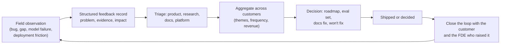
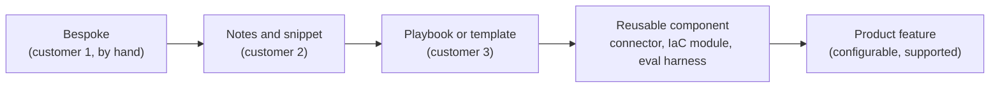

# Field Feedback to Product & Research; Codifying Repeatable Deployment Patterns

!!! abstract "Key takeaways"
    - **The FDE is the company's best sensor.** OpenAI's FDE postings ask for "eval-driven feedback that changes product and model roadmaps", and PostHog says every engagement should "compound" into reusable artifacts and product improvements. Feedback is part of the job, not a side activity.
    - **Good feedback is evidence, not anecdote:** the problem (not the requested feature), who hit it, how often, across how many customers, the business impact, the workaround, and a concrete example. "Customer X wants feature Y" gets ignored.
    - **Feedback to research is eval cases:** model failures captured as labelled, permission-cleared examples grouped by failure type. Customer data rules apply. Never share it outside what the contract allows.
    - **Codify by the rule of three:** do it by hand once, note it the second time, template it the third. The ladder runs bespoke → snippet → playbook/template → reusable component → product feature.
    - **Avoid per-customer forks.** Every custom fork is maintenance debt and a feature the product team never hears about. Upstream the change, configure it, or document a supported extension point.

## Why it matters

FDE teams are expensive. What justifies them, compared with ordinary professional services, is that they make the **product** better and each next deployment **faster**.

- **Palantir** is the usual reference: field teams feed what they learn back to core product teams, and repeated field work became platform capability. The Echo and Delta roles both straddle product and engineering ([Palantir blog](https://blog.palantir.com/a-day-in-the-life-of-a-palantir-deployment-strategist-951cb59a5a96)).
- **OpenAI** FDE postings measure success partly through "eval-driven feedback that changes product and model roadmaps", list collaboration with Product and Research, and ask FDEs to contribute to internal knowledge bases, "codifying best practices and sharing insights" to scale the function ([OpenAI careers](https://openai.com/careers/forward-deployed-software-engineer-sf/)). Reposted listings add "codify working patterns into tools, playbooks, or building blocks".
- **PostHog** describes its FDE team as different from standard professional services because "every engagement compounds. The patterns we see across customers become reusable artifacts, skills, and product improvements" ([PostHog handbook](https://posthog.com/handbook/forward-deployed-engineering/overview)).
- **Cognition**'s 2026 AI Engineer talk on FDE covers connecting deployment feedback to product development ([AI Engineer](https://ai.engineer/talks/how-forward-deployed-engineering-is-done-at-cognition)).

Industry commentary notes the failure mode: at many companies field knowledge "evaporates" because there's no channel wide enough to carry it back ([Tandem](https://usetandem.ai/blog/fde-product-engineering-feedback-loop)). Interviewers ask about it directly. Exponent's FDE behavioral course has a lesson titled "customer feedback to core product improvement" ([Exponent](https://www.tryexponent.com/courses/fde-behavioral/customer-feedback-to-core-product-improvement)).

## Core concepts

### The feedback loop


*Notice the last step. Feedback that disappears into a backlog teaches FDEs to stop sending it. Telling the customer and the FDE what happened, including "won't fix, and here's why", keeps the loop alive.*

### Types of field feedback and where they go

| Type | Example | Destination |
|---|---|---|
| **Bug** | SSO group sync fails for nested groups | Engineering, with repro |
| **Product gap** | No way to keep data in an EU region | Product, with evidence and deal impact |
| **UX friction** | Users can't find where to approve suggestions | Product design, with session notes |
| **Model failure** | Extraction misreads handwritten dates on faxes | Research or applied ML, as labelled eval cases |
| **Docs gap** | Nobody can configure the private endpoint from the docs | Docs / developer relations |
| **Deployment friction** | Every bank asks the same 200 security questions | Platform / security team: pre-filled questionnaire, trust portal |
| **Packaging or pricing** | Per-seat pricing blocks a 2,000-user roll-out | Product marketing, sales leadership |

### Writing feedback product teams act on

Product managers get far more requests than they can build. Feedback competes on evidence. A good record has:

1. **Problem statement:** what the user is trying to do and what stops them, not the feature they asked for. ([The Mom Test](https://www.momtestbook.com/) applies to internal feedback too: dig for the motivation behind a feature request.)
2. **Evidence:** a concrete example, a screenshot or trace, a user quote.
3. **Frequency and breadth:** how often, how many users, how many customers. Link duplicates.
4. **Impact:** blocked go-live, deal at risk, hours lost, compliance risk, in numbers where possible.
5. **Workaround:** what you did instead, and what it costs to maintain.
6. **Severity and urgency:** is there a date (a renewal, a go-live)?

Teresa Torres's **opportunity solution tree** (*Continuous Discovery Habits*) is a useful way to organise it: a desired outcome at the top, opportunities (customer needs and pains) below, then candidate solutions and experiments. Field feedback belongs at the **opportunity** level. Let the product team own the solution.

### Feeding research: failures as evals

For AI products, the most valuable feedback to research and model teams is **structured failure data**:

- **A failure taxonomy:** for example, misread scanned input, wrong tool chosen, ignored instruction, hallucinated citation, refused a valid request, too slow.
- **Labelled examples per category**, with the input, the output, the expected output and why.
- **Frequency and impact** per category from the deployment.
- **A reproducible eval set** that research can run on new model versions, ideally the same one the deployment uses for regression testing (see [Applied LLM engineering](../fde-applied-llm/index.md)).

!!! warning "Customer data rules come first"
    Customer data can only be shared internally as far as the contract, data processing agreement and customer consent allow. Often that means synthetic or de-identified reproductions, aggregate statistics, or examples the customer explicitly approves. In healthcare (PHI) and finance, assume nothing leaves the customer environment unless you have written permission.

### Codifying repeatable patterns

Martin Fowler's *Refactoring* quotes Don Roberts's **rule of three**: the first time you do something, just do it; the second time, wince at the duplication but do it anyway; the third time, refactor. Applied to deployments:


*Notice that not everything should climb to the top. A playbook is enough for work that varies a lot between customers. A product feature is right only when demand is broad and the shape has stabilised.*

**What FDE teams typically codify:**

| Artifact | Saves | Example |
|---|---|---|
| Discovery question bank and scope-brief template | Week 1 of every engagement | [Page 1](01-discovery-interviews-workflow-mapping-hidden-constraints-res.md), [page 2](02-writing-the-scope-brief-success-criteria-assumptions-out-of.md) |
| Reference architectures per environment | Design time, security review time | "Azure tenant with private endpoint", "AWS VPC with Bedrock" |
| Infrastructure-as-code modules | Days of environment setup | Terraform module for the standard deployment |
| Connectors | Integration effort | Salesforce, ServiceNow, SharePoint, EHR (FHIR) connectors |
| Eval harness and starter eval sets | Quality setup per use case | Extraction, RAG Q&A, classification templates |
| Prompt, skill and tool libraries / MCP servers | Agent build time | A reviewed tool for "search the case system" |
| Pre-filled security questionnaire and trust documentation | Weeks of security review | Standard answers, architecture diagrams, pen-test summary |
| Runbooks and hand-over packs | Support transition | Monitoring, common failures, escalation |

### Forks vs upstream changes

When a customer needs something the product doesn't do, an FDE has four choices:

1. **Configure:** an existing setting or extension point covers it.
2. **Extend through a supported mechanism:** a plugin, a webhook, a custom tool, kept outside the core.
3. **Upstream:** contribute the change (or the evidence for it) to the product team so every customer gets it.
4. **Fork:** a customer-specific branch of the product.

Forks feel fastest and cost the most: every product upgrade has to be merged into them, they break silently, and the product team never learns the need existed. Treat a fork as a last resort with an owner and an expiry date.

### Measuring whether codification works

- **Time to first value** per deployment (from kickoff to first real users) trending down.
- **Reuse rate:** share of each deployment built from standard components.
- **Repeat issues:** the same problem raised by several deployments that isn't yet addressed.
- **Feedback outcomes:** items raised vs decided vs shipped, and median time to decision.
- **Engagement length and FDE hours per deployment** trending down for comparable scope.

## In practice: code & configuration

### Field feedback record

```yaml
# feedback/2026-10-07-eu-data-residency.yaml
id: FB-0142
type: product_gap               # bug | product_gap | ux | model_failure | docs | deployment | pricing
title: "No EU-only processing option for document extraction"
problem: >
  EU insurers must keep claim documents and model processing inside the EU.
  Today extraction calls a US-region endpoint, so legal blocks go-live.
evidence:
  - customer: "Insurer A (pilot)"
    quote: "Legal won't sign until processing stays in the EU."
    artifact: "security-review-notes-2026-10-02.md"
breadth:
  customers_affected: 3         # A (pilot), B (prospect), C (renewal Q1)
  linked: [FB-0098, FB-0131]
impact:
  blocked_go_live: true
  revenue_at_risk: "~$1.2M ARR across 3 accounts [estimate from account team]"
workaround: "Self-hosted model in customer tenant; +3 weeks per deployment, unsupported"
urgency: "Insurer C renewal decision 2027-01-15"
requested_solution: "EU-region endpoint"   # recorded, but the problem above is what matters
raised_by: "fde@company"
status: triaged                 # new | triaged | decided | shipped | wont_fix
decision: null
closed_loop_with_customer: false
```

### Aggregating feedback across deployments

```python
"""Rank open feedback themes by breadth and impact so product reviews start from data."""
from collections import defaultdict
from pathlib import Path
import yaml  # PyYAML

def load_records(folder: str) -> list[dict]:
    return [yaml.safe_load(p.read_text()) for p in Path(folder).glob("*.yaml")]

def rank_themes(records: list[dict]) -> list[tuple[str, dict]]:
    themes: dict[str, dict] = defaultdict(lambda: {"customers": set(), "blocked": 0, "ids": []})
    for r in records:
        if r.get("status") in {"shipped", "wont_fix"}:
            continue                                   # only open items
        key = r.get("theme") or r["title"]             # theme set during triage
        t = themes[key]
        t["customers"].update(e["customer"] for e in r.get("evidence", []))
        t["blocked"] += int(r.get("impact", {}).get("blocked_go_live", False))
        t["ids"].append(r["id"])
    # Blocked go-lives first, then breadth (distinct customers), not loudest voice.
    return sorted(themes.items(),
                  key=lambda kv: (kv[1]["blocked"], len(kv[1]["customers"])),
                  reverse=True)

for theme, t in rank_themes(load_records("feedback"))[:10]:
    print(f"{theme}: {len(t['customers'])} customers, {t['blocked']} blocked go-lives, {t['ids']}")
```

### Feedback that gets ignored vs feedback that gets acted on

=== "❌ Common mistake"
    ```text
    #product-feedback (Slack)
    "Insurer A really needs EU hosting ASAP!! They're super frustrated.
     Can we prioritise this?"
    -- No problem statement, no evidence, no breadth, no impact number,
       no workaround, no date. It reads as one loud customer and scrolls
       away in a day.
    ```

=== "✅ Correct approach"
    ```text
    FB-0142 (linked to FB-0098, FB-0131) - product gap, triaged
    Problem: EU insurers must keep documents and model processing in the EU;
             extraction uses a US endpoint, so legal blocks go-live.
    Breadth: 3 accounts (1 pilot, 1 prospect, 1 Q1 renewal).
    Impact:  go-live blocked at Insurer A; ~$1.2M ARR at risk (account team est.).
    Workaround: self-hosted model in customer tenant, +3 weeks, unsupported.
    Date:    Insurer C renewal decision Jan 15.
    Ask:     a decision (build / partner / won't do) by the Nov product review.
    ```

### Deployment playbook skeleton

```text
playbooks/document-extraction/
  README.md              # when to use, typical timeline, known pitfalls
  01-discovery.md        # question bank + constraint checklist for this use case
  02-scope-brief.md      # template with standard success criteria and guardrails
  03-architecture/       # reference diagrams: azure-private, aws-vpc, on-prem
  04-infra/              # IaC modules (Terraform) + parameters per environment
  05-evals/              # starter eval set schema, labelling guide, CI job
  06-security/           # pre-filled questionnaire, data-flow diagram, DPA notes
  07-rollout.md          # shadow -> assist -> automate checklist, exit criteria
  08-handover.md         # runbook, monitoring, support model
  CHANGELOG.md           # what each deployment taught us (rule of three)
```

## Real-world usage

- **Palantir:** field-originated work becoming platform capability is the classic example of the FDE model compounding ([Palantir blog](https://blog.palantir.com/a-day-in-the-life-of-a-palantir-deployment-strategist-951cb59a5a96)).
- **OpenAI:** FDE success is measured partly by feedback that changes product and model roadmaps, and FDEs are asked to codify practices into knowledge bases and building blocks ([OpenAI careers](https://openai.com/careers/forward-deployed-software-engineer-sf/)).
- **PostHog:** the FDE team sits between the customer, sales and customer success, and product engineering, so patterns become "reusable artifacts, skills, and product improvements" ([PostHog handbook](https://posthog.com/handbook/forward-deployed-engineering/overview)).
- **Cognition:** the FDE talk frames deployment feedback as an input to product development, alongside customer outcome metrics ([AI Engineer](https://ai.engineer/talks/how-forward-deployed-engineering-is-done-at-cognition)).
- **Regulated domains:** in healthcare and banking, security questionnaires and compliance evidence are the most repeated work. Pre-filled questionnaires and reference architectures can cut weeks from each deployment.
- **Failure modes:** feedback by Slack shouting (loudest customer wins), "one more fork" until the product can't be upgraded, playbooks nobody updates, and research receiving anecdotes instead of eval cases.

## Trade-offs & production gotchas

| Choice | Pros | Cons | Use when |
|---|---|---|---|
| Build custom for this customer | Fast, unblocks the deal | Maintenance, no reuse, product never learns | Truly unique need; time-boxed, owned, documented |
| Wait for the product | No debt | Customer blocked; may lose the deal | Gap already on the roadmap with a near date |
| Supported extension (plugin, tool, webhook) | Unblocks without forking | Needs an extension point to exist | Most customer-specific logic |
| Generalise now | Reuse sooner | Premature abstraction, wrong shape | After the third similar case |
| Playbook only | Cheap, flexible | Still manual | Work that varies per customer |

!!! warning "Gotchas"
    - **Feedback as advocacy.** You represent the customer to product, but you also represent the evidence. Don't inflate impact.
    - **Requested solution as the problem.** "Add an EU endpoint" may be right, but record the problem so product can pick the best solution.
    - **Customer data in feedback.** Strip or synthesise it unless sharing is explicitly allowed.
    - **Premature generalisation.** Building a framework after one deployment usually produces the wrong abstraction. Wait for three.
    - **Not closing the loop.** Tell customers and FDEs what happened, or both stop giving feedback.

## How this connects to my experience

- **Where I used it:** not FDE field feedback directly; position as transferable experience in codifying standards and reusable patterns.
    - "Established engineering standards around testing, CI/CD, code quality, and deployment practices" (OptumRx): codifying how a team works so it repeats.
    - "Built the ReactJS application from the ground up and established a micro-frontend architecture": a reusable structure other teams build on.
    - "Automated infrastructure provisioning and deployment processes using Terraform" (Deloitte): the IaC-module rung of the codification ladder.
    - Owning the GraphQL Consumer Service between 5 upstreams and multiple consumers: I'd see the same consumer needs repeatedly and could turn them into shared schema patterns. *[confirm example]*
- **Talking points:**
    - "When I saw the same integration problem across upstreams, I *[confirm: wrote a shared library / pattern / standard]* rather than fixing it each time." *[confirm]*
    - "I'd treat feedback like an incident report: problem, evidence, impact, workaround. That's how I wrote up *[confirm: production issues / postmortems]*."
    - Mentoring 5+ engineers through code and design reviews is a form of codifying practice into people.
- **Likely follow-up chain:** "Tell me about a time customer feedback changed the product." → "How did you convince the product team?" → "What did you do for the customer meanwhile?" → "What would you codify first as an FDE?" Answer: a real story *[confirm]*, or an honest bridge to internal-consumer feedback on the GraphQL layer → evidence, breadth and impact, not volume → a supported workaround and a date → discovery, scope-brief and security templates first, because they repeat in every engagement.

## Interview questions

### Fundamentals

??? question "Q1. Why is feeding field feedback back to product part of the FDE role?"
    **Answer:** Because it's what distinguishes FDE work from professional services. FDEs see real workflows, failures and gaps first. Turning that into product, model and platform improvements makes every future deployment faster and the product better. OpenAI and PostHog explicitly count it as part of FDE success.

    **Interviewer listens for:** compounding value, not just "be helpful".

    **Common wrong answer:** "So the customer gets their feature."

??? question "Q2. What makes field feedback actionable?"
    **Answer:** A problem statement rather than a feature request, concrete evidence, frequency and breadth across customers, business impact in numbers, the current workaround and its cost, and any deadline. Linked to duplicates so it aggregates.

    **Interviewer listens for:** evidence and breadth.

    **Common wrong answer:** "Tell the PM the customer is unhappy."

??? question "Q3. What's the rule of three and how does it apply to deployments?"
    **Answer:** Do it by hand the first time, note the duplication the second time, and generalise the third time. Generalising after one case usually produces the wrong abstraction. Applied to deployments: bespoke, then notes or snippets, then a playbook or template, then a reusable component, and only then a product feature.

    **Interviewer listens for:** avoiding premature abstraction.

    **Common wrong answer:** "Build reusable components from day one."

??? question "Q4. What would you codify first on a new FDE team?"
    **Answer:** The things every engagement repeats: discovery question bank and scope-brief template, reference architectures for common environments, pre-filled security questionnaire, IaC modules, an eval harness with starter sets, and hand-over runbooks. These save weeks per deployment regardless of use case.

    **Interviewer listens for:** cross-cutting artifacts, security review time.

    **Common wrong answer:** "A generic AI agent framework."

### Intermediate

??? question "Q5. How do you give useful feedback to a research or model team?"
    **Answer:** Structured failure data: a taxonomy of failure types, labelled examples per type (input, output, expected, why), frequency and impact from the deployment, and a reproducible eval set that can be run on new model versions. All within what the customer's contract allows, often de-identified or synthetic.

    **Interviewer listens for:** eval sets, taxonomy, data permissions.

    **Common wrong answer:** "Send them the bad outputs."

??? question "Q6. A customer needs a feature the product doesn't have. What are your options?"
    **Answer:** Configure an existing capability; extend through a supported mechanism (plugin, tool, webhook) outside the core; raise it upstream with evidence; or, as a last resort, fork with an owner and an expiry date. Meanwhile be honest with the customer about timelines.

    **Interviewer listens for:** fork as last resort.

    **Common wrong answer:** "Build it in their deployment."

??? question "Q7. Why are per-customer forks dangerous?"
    **Answer:** Every product upgrade must be merged into them, they break silently, they multiply support costs, they hide the need from the product team, and they tie the customer to whoever wrote them. Over time they make upgrades impossible.

    **Interviewer listens for:** upgrade cost and lost product signal.

    **Common wrong answer:** "They're fine if documented."

??? question "Q8. How do you prioritise feedback from many customers?"
    **Answer:** Aggregate by theme (problem, not requested solution), then weigh breadth (distinct customers), impact (blocked go-lives, revenue, compliance), urgency (dates) and strategic fit. Present it as data at regular product reviews. Avoid "loudest customer wins".

    **Interviewer listens for:** aggregation and weighting.

    **Common wrong answer:** "Whichever customer is biggest."

### Senior

??? question "Q9. How do you convince a product team to prioritise something from the field?"
    **Answer:** Frame it in their terms: the opportunity it unlocks across customers, evidence and breadth, revenue or risk, the cost of the current workaround, and alignment with their strategy. Offer help: customer interviews, a prototype, eval data. Accept a "no" with reasons and report it back to the customer honestly.

    **Interviewer listens for:** product partnership, evidence, accepting no.

    **Common wrong answer:** "Escalate to leadership."

??? question "Q10. How do you know your codification effort is working?"
    **Answer:** Time to first value per deployment falling, reuse rate rising, FDE hours per comparable deployment falling, repeat issues declining, and feedback items getting decided faster. If deployments aren't getting faster, the playbooks aren't being used or aren't the right ones.

    **Interviewer listens for:** outcome metrics for the FDE function.

    **Common wrong answer:** "Number of playbooks written."

??? question "Q11. What are the risks of sharing customer data with internal teams for feedback?"
    **Answer:** Breaching the contract, DPA or regulations (HIPAA, GDPR, banking secrecy), exposing one customer's data to people who shouldn't see it, and losing the customer's trust. Mitigate with de-identification, synthetic reproductions, aggregates, explicit customer approval, and access controls on feedback stores.

    **Interviewer listens for:** contract first, practical mitigations.

    **Common wrong answer:** "It's internal, so it's fine."

??? question "Q12. How do you close the feedback loop?"
    **Answer:** Track every record to a decision. Tell the customer what was decided and when it ships (or why not), tell the FDE who raised it, and update the playbook or workaround. Celebrate shipped items publicly so FDEs keep raising them.

    **Interviewer listens for:** decisions communicated, including "won't fix".

    **Common wrong answer:** "Product will email them."

### Scenario-based

??? question "Q13. Three customers in a quarter ask for the same SharePoint connector, and each FDE built their own. What do you do?"
    **Answer:** Compare the three implementations and the customers' needs, pick or merge the best into a shared, tested connector with configuration for the differences, migrate the three deployments onto it, and document it in the playbook. Raise it with product as a candidate first-class connector with the evidence (three customers, effort spent). Then fix the process: a place where FDEs check for existing components before building.

    **Interviewer listens for:** consolidation, migration, process fix.

    **Common wrong answer:** "Keep all three; they work."

??? question "Q14. Your model keeps misreading scanned handwritten forms at a healthcare customer. How do you feed this back?"
    **Answer:** Quantify it (frequency, impact on the workflow), categorise the failures, build a reproducible example set within the customer's permissions (de-identified or synthetic forms that reproduce the issue), and share it with research as an eval set, along with the workaround (human review for low-confidence fields). Add it to the deployment's regression evals so model upgrades are checked against it.

    **Interviewer listens for:** an eval set, PHI handling, a workaround.

    **Common wrong answer:** "Send the scanned forms to research."

??? question "Q15. Tell me about a time you turned repeated work into something reusable."
    **Answer structure (STAR):** Situation: the repeated pain (for example, environment setup or standards drifting across teams) *[confirm: Terraform automation at Deloitte or engineering standards at OptumRx]*. Task: why you took it on. Action: what you built (module, template, standard), how you got adoption. Result: time saved or defects avoided *[confirm numbers]*. Lesson: wait for repetition before generalising, and make adoption easy.

    **Interviewer listens for:** a real artifact, adoption, a measurable result.

    **Common wrong answer:** a framework nobody else used.

## Cheat sheet

| Concept | Remember |
|---|---|
| Why | FDEs make the product better and each deployment faster |
| Good feedback | Problem, evidence, breadth, impact, workaround, date |
| Destinations | Engineering, product, research (evals), docs, platform, pricing |
| Research feedback | Failure taxonomy + labelled, permission-cleared eval sets |
| Rule of three | Once by hand, twice note, third time generalise |
| Ladder | Bespoke → snippet → playbook → component → product feature |
| Forks | Last resort: owner + expiry. Prefer configure, extend, upstream |
| Metrics | Time to first value, reuse rate, FDE hours, repeat issues |
| Close the loop | Decision back to customer and FDE, including "won't fix" |

## Sources
1. [OpenAI: Forward Deployed Software Engineer](https://openai.com/careers/forward-deployed-software-engineer-sf/): eval-driven feedback to product and model roadmaps; codifying best practices.
2. [PostHog FDE handbook: overview](https://posthog.com/handbook/forward-deployed-engineering/overview): engagements compound into reusable artifacts, skills and product improvements.
3. [Palantir: A Day in the Life of a Deployment Strategist](https://blog.palantir.com/a-day-in-the-life-of-a-palantir-deployment-strategist-951cb59a5a96): field roles that straddle product and engineering.
4. [AI Engineer: How forward deployed engineering is done at Cognition](https://ai.engineer/talks/how-forward-deployed-engineering-is-done-at-cognition): deployment feedback into product development.
5. [Tandem: the FDE–product engineering feedback loop](https://usetandem.ai/blog/fde-product-engineering-feedback-loop): field knowledge evaporating without a channel (industry commentary).
6. [Exponent FDE behavioral: customer feedback to core product improvement](https://www.tryexponent.com/courses/fde-behavioral/customer-feedback-to-core-product-improvement): interview angle (prep site).
7. Teresa Torres, *Continuous Discovery Habits*: opportunity solution trees.
8. Martin Fowler, *Refactoring* (2nd ed.): the rule of three, attributed to Don Roberts.
9. Rob Fitzpatrick, *The Mom Test* ([momtestbook.com](https://www.momtestbook.com/)): digging beneath feature requests.
10. Resume: `Vishal_Hulawale_Resume_10012026.pdf` (engineering standards, micro-frontend architecture, Terraform automation, GraphQL Consumer Service).
