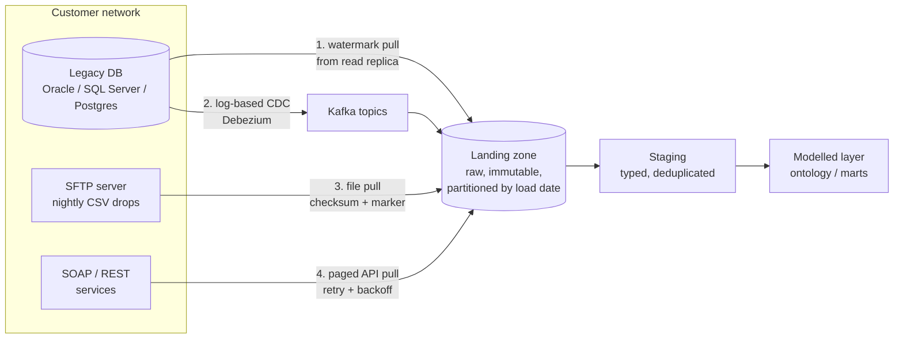
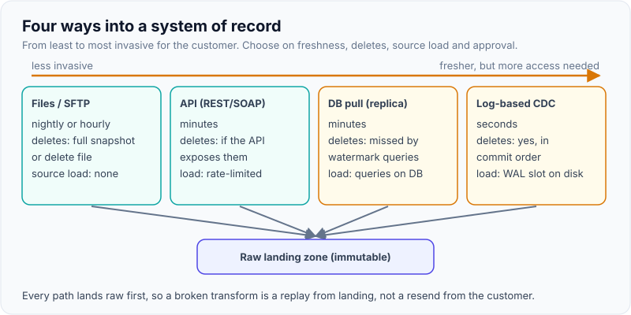
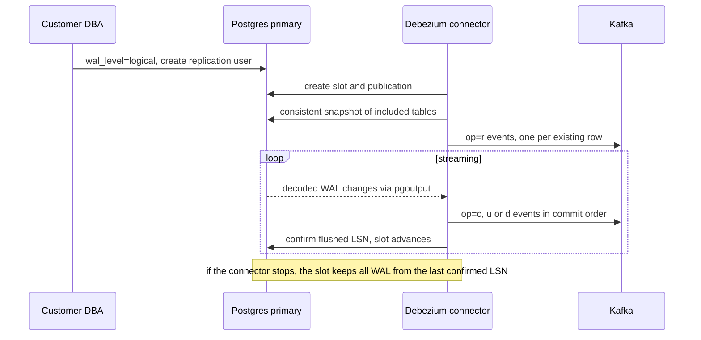

# Integrating with Legacy Systems of Record: Databases, Files/SFTP, SOAP/REST, CDC

!!! abstract "Key takeaways"
    - A **system of record** is the system that owns the truth for an entity (claims, members, orders). Your job is to **read from it without hurting it**, land the data unchanged, and model it later.
    - Four ways in, from least to most invasive for the customer: **files/SFTP**, **APIs (REST/SOAP)**, **database pulls** (read replica, watermark queries) and **log-based CDC** (Debezium reading the WAL/binlog). Choose by freshness, deletes, load on the source and what the customer's security team will approve.
    - Incremental pulls need a **watermark plus a tie-breaker** (`(updated_at, id) > (?, ?)`) and a **lookback window**; downstream loads must be **idempotent** so the overlap is harmless.
    - Timestamp polling misses **hard deletes** and in-flight transactions. Log-based CDC sees inserts, updates and deletes in commit order, but a stalled **replication slot keeps WAL on the customer's disk**.
    - Land raw first (**immutable landing zone**), then transform. When something breaks you can replay from landing instead of asking the customer to resend.

## Why it matters

Most FDE engagements start the same way: the customer has the data, but it sits in five systems that don't talk to each other. A claims platform on Oracle or SQL Server, a CRM with a REST API, a pharmacy vendor that drops CSVs on SFTP every night, a 2008-era SOAP service for eligibility, and spreadsheets. The demo you are building (a dashboard, an agent, an ontology) is only as good as the pipe that feeds it.

Interviewers probe this in the decomposition and system-design rounds: *"The customer's data lives in a mainframe export and a Postgres database. How do you get it in?"* They are listening for three things: that you protect the customer's production system, that you think about **incremental** loads, **deletes** and **late data**, and that you know when a simple nightly file is the right answer.

## Core concepts

### Who owns the truth

Before any code, ask for each entity: *which system is the system of record, who owns it, and how does it change?* Write it in a source inventory.

| Question | Why you ask |
|---|---|
| Which system owns this entity? | Two systems disagree; you need a rule for who wins |
| How do changes happen (UI, batch job, upstream feed)? | Batch jobs rewrite thousands of rows at 2 a.m. and break naive watermarks |
| Are rows ever hard-deleted? | Timestamp polling cannot see deletes |
| Is there a reliable `updated_at`? Who sets it, the app or a trigger? | App-set timestamps get skipped by bulk SQL fixes |
| What access will security approve? | Often decides the pattern before you do |
| What volume and freshness do users need? | Nightly is fine for a weekly report; not for an operational queue |

See [discovery interviews](../fde-customer-discovery/01-discovery-interviews-workflow-mapping-hidden-constraints-res.md) for how to get these answers from people who don't know them yet.

### The four integration patterns


*Notice every path ends in the same raw landing zone. Patterns differ in how they read; everything after landing is shared and replayable.*

{ loading=lazy }
*Further right means fresher data and more access to negotiate.*

| Pattern | Freshness | Sees deletes? | Load on source | Typical blocker | Use when |
|---|---|---|---|---|---|
| Files / SFTP | Hours to daily | Only via full snapshots or delete files | None | Partial files, re-sent files, format changes | Vendor or mainframe exports; customer won't open DB access |
| REST / SOAP API | Minutes to hours | Only if API exposes them | Rate-limited by design | Rate limits, pagination bugs, auth (mTLS, OAuth) | SaaS systems; business logic lives behind the API |
| Watermark DB pull | Minutes to hours | No (unless soft deletes) | Query load; use a read replica | DBA approval, no reliable `updated_at` | You have read access and moderate volume |
| Log-based CDC | Seconds | Yes, in commit order | Low (reads the log) but holds WAL | Needs replication privileges and DBA buy-in | Operational use cases, deletes matter, high change volume |

!!! tip "Default answer in an interview"
    "Start with the least invasive pattern that meets the freshness need. Land everything raw. Move to CDC when users need near-real-time data or deletes matter, and only after the DBA agrees to the replication slot."

### Database pulls: watermarks done right

The naive incremental query is `WHERE updated_at > :last_run_time`. It fails in three ways:

1. **Ties and paging.** Thousands of rows share one `updated_at` after a batch job. Paging by timestamp alone skips or repeats them.
2. **Late commits.** A transaction that started at 10:00 and committed at 10:07 writes `updated_at = 10:00`. If your 10:05 run already set the watermark to 10:05, that row is never read.
3. **Clock source.** Using the extractor's clock (`now()`) instead of the max value you actually read creates gaps.

The fix is a **keyset watermark** `(updated_at, id)`, a **lookback window** to re-read a few minutes, and an **idempotent upsert** downstream so re-reading is harmless (see [page 4](04-data-quality-schema-drift-idempotent-loads-and-backfills.md)).

### Files and SFTP

Files are the most common integration in healthcare, banking and logistics because they need nothing from the customer's DBAs. The failure modes are predictable:

- **Partial files:** you read while the vendor is still writing. Ask for a `.done` marker written last, or wait until the file stops changing.
- **Re-sent files:** the vendor sends Monday's file again on Tuesday. Use a content hash, not the file name, to decide "already loaded".
- **Format drift:** a new column, a renamed header, a date format change. Validate against a contract before loading (page 4).
- **Encoding and layout:** Latin-1 vs UTF-8, fixed-width mainframe layouts, EBCDIC. Ask for a sample file and a layout spec in week one.

### APIs: SOAP and REST

**REST** pulls are about pagination (prefer cursor over offset, since offsets shift when data changes), rate limits (`429` plus `Retry-After`), timeouts and retrying only safe operations. See [pagination](../api-design/03-pagination-filtering-and-sorting.md) and [safe retries](../api-design/05-idempotency-keys-and-safe-retries.md).

**SOAP** still runs much of healthcare and finance. The WSDL describes operations and types; in Python, `zeep` generates a client from it. Common surprises: mutual TLS, WS-Security headers, huge XML responses and vendors that don't follow their own WSDL.

### Log-based change data capture

CDC reads the database's own change log: the PostgreSQL write-ahead log (WAL) via logical decoding, the MySQL binlog, the SQL Server CDC tables or Oracle redo logs. **Debezium** is the common open-source choice; it runs on Kafka Connect and emits one event per row change with `before`, `after`, `op` (`c`, `u`, `d`, `r` for snapshot reads) and source metadata.


*Notice the last step: the slot only advances when Debezium confirms. A connector that is down for a weekend can fill the customer's disk. That is the operational risk you must raise with the DBA.*

{ loading=lazy }
*Agree the slot-lag alert and the WAL cap with the DBA before go-live.*

Key facts to know for PostgreSQL:

- Needs `wal_level = logical`, a user with replication rights, and a **replication slot** plus a **publication**. `pgoutput` is the built-in logical decoding plugin (PostgreSQL 10+), so no server extension is needed.
- Slots retain WAL until consumed. PostgreSQL 13+ offers `max_slot_wal_keep_size` to cap this (default `-1`, unlimited); past the cap the slot is invalidated and you must re-snapshot. Monitor `pg_replication_slots.wal_status` and lag.
- Low-traffic databases on a busy server can pin WAL; Debezium's `heartbeat.interval.ms` (optionally with `heartbeat.action.query`) keeps the slot moving.
- For full `before` images on updates and deletes, the table needs `REPLICA IDENTITY FULL`; by default only the primary key is in the `before` of a delete.
- `snapshot.mode=initial` (the default) snapshots once and then streams. Incremental snapshots, triggered through a signalling table, let you re-snapshot one table without stopping the stream.

The [Kafka Connect page](../kafka/11-kafka-streams-and-kafka-connect.md) covers Connect workers and the outbox pattern; [schema management](../kafka/10-schema-management-avro-protobuf-schema-registry-compatibilit.md) covers Avro and compatibility for CDC topics.

## In practice: code & configuration

### Incremental database pull

=== "❌ Common mistake"
    ```python
    # Watermark = wall clock, timestamp-only paging, written before the data is safe
    last_run = state.get("last_run")                     # e.g. 10:05 from the previous run
    rows = cur.execute(
        "SELECT * FROM member WHERE updated_at > %s ORDER BY updated_at LIMIT 5000", (last_run,)
    ).fetchall()
    state["last_run"] = datetime.now()                   # 1. extractor clock, not data clock
    load(rows)                                           # 2. crash here = rows lost forever
    # 3. 12,000 rows share updated_at=02:00 after a batch job: LIMIT cuts the tie, rest skipped
    # 4. a transaction that committed late with an older updated_at is never seen
    ```

=== "✅ Correct approach"
    ```python
    """Incremental pull from a legacy Postgres system of record using a high-watermark + keyset."""
    import json
    from datetime import timedelta
    from pathlib import Path

    import psycopg2

    STATE = Path("state/member_watermark.json")
    LOOKBACK = timedelta(minutes=10)    # re-read a window to catch late-committing transactions
    PAGE = 5000

    def load_state():
        if STATE.exists():
            s = json.loads(STATE.read_text())
            return s["updated_at"], s["ingest_id"]
        return "1970-01-01T00:00:00+00:00", 0

    def save_state(updated_at, ingest_id):
        STATE.parent.mkdir(exist_ok=True)
        tmp = STATE.with_suffix(".tmp")
        tmp.write_text(json.dumps({"updated_at": updated_at, "ingest_id": ingest_id}))
        tmp.replace(STATE)              # atomic rename: never a half-written watermark

    def extract(conn):
        wm_ts, _ = load_state()
        with conn.cursor() as cur:
            # start a little before the watermark; the downstream MERGE makes the overlap harmless
            cur.execute("SELECT %s::timestamptz - %s", (wm_ts, LOOKBACK))
            cursor_ts, cursor_id = cur.fetchone()[0], 0
            while True:
                cur.execute(
                    """SELECT ingest_id, member_id, email, updated_at
                         FROM th.raw_member
                        WHERE (updated_at, ingest_id) > (%s, %s)   -- keyset: stable under ties
                        ORDER BY updated_at, ingest_id
                        LIMIT %s""",
                    (cursor_ts, cursor_id, PAGE),
                )
                rows = cur.fetchall()
                if not rows:
                    break
                yield rows                                        # caller lands + upserts the page
                cursor_ts, cursor_id = rows[-1][3], rows[-1][0]
                save_state(cursor_ts.isoformat(), cursor_id)      # advance only after hand-off

    if __name__ == "__main__":
        conn = psycopg2.connect(host="replica.internal", dbname="claims", user="fde_reader")
        conn.set_session(readonly=True)  # never write to the customer's system of record
        print("rows pulled:", sum(len(page) for page in extract(conn)))
    ```
    Tested against PostgreSQL 16 with the sample data from [page 3](03-sql-for-take-homes-multi-table-joins-window-functions-null-h.md): the first run pulled 7 rows, the second re-read only the 1 row inside the lookback window. The row-value comparison `(a, b) > (x, y)` is standard SQL and can use a composite index on `(updated_at, ingest_id)`.

### SFTP file pickup

=== "❌ Common mistake"
    ```python
    for name in sftp.listdir("/out"):
        sftp.get(f"/out/{name}", f"landing/{name}")   # may copy a file the vendor is still writing
        load_csv(f"landing/{name}")                   # re-sent file with same name = double load
        sftp.remove(f"/out/{name}")                   # deleting the customer's only copy
    ```

=== "✅ Correct approach"
    ```python
    """Pull the vendor's nightly files from SFTP safely: only complete files, each exactly once."""
    import hashlib
    import time
    from pathlib import Path

    import paramiko

    LANDING = Path("landing/pharmacy")
    SETTLE_SECONDS = 300            # a file not modified for 5 min is assumed complete

    def connect(host: str, user: str, key_path: str, known_hosts: str) -> paramiko.SFTPClient:
        ssh = paramiko.SSHClient()
        ssh.load_host_keys(known_hosts)                     # pin the host key
        ssh.set_missing_host_key_policy(paramiko.RejectPolicy())   # never AutoAddPolicy in prod
        ssh.connect(host, username=user, key_filename=key_path, timeout=30)
        return ssh.open_sftp()

    def ready_files(sftp, remote_dir: str, now: float) -> list[str]:
        names = {a.filename: a for a in sftp.listdir_attr(remote_dir)}
        out = []
        for name, attr in sorted(names.items()):
            if not name.endswith(".csv"):
                continue
            has_marker = f"{name}.done" in names               # best: vendor writes a .done marker last
            settled = now - attr.st_mtime > SETTLE_SECONDS     # fallback: file stopped changing
            if has_marker or settled:
                out.append(name)
        return out

    def pull(sftp, remote_dir: str, seen: set[str]) -> list[Path]:
        landed = []
        for name in ready_files(sftp, remote_dir, time.time()):
            tmp = LANDING / f".{name}.part"
            LANDING.mkdir(parents=True, exist_ok=True)
            sftp.get(f"{remote_dir}/{name}", str(tmp))
            digest = hashlib.sha256(tmp.read_bytes()).hexdigest()
            if digest in seen:                                 # vendor re-sent the same content
                tmp.unlink()
                continue
            final = LANDING / f"{digest[:12]}_{name}"          # content-addressed: reruns are no-ops
            tmp.replace(final)                                 # atomic: readers never see half a file
            seen.add(digest)                                   # persist this set in a real job
            landed.append(final)
        return landed
    ```
    The selection and dedup logic was tested with a fake SFTP client: a settled file was landed, a file still being written was skipped, a re-sent file with a new name but identical bytes was skipped, and a rerun landed nothing.

### SOAP and REST pulls

```python
import requests
from requests.adapters import HTTPAdapter
from urllib3.util.retry import Retry
from zeep import Client, Settings
from zeep.helpers import serialize_object
from zeep.transports import Transport

def soap_member(member_id: str) -> dict:
    session = requests.Session()
    session.cert = ("/secrets/client.crt", "/secrets/client.key")  # mutual TLS is common on legacy SOAP
    transport = Transport(session=session, timeout=30, operation_timeout=60)
    client = Client(
        "https://legacy.example.internal/MemberService?wsdl",      # keep a copy of the WSDL in the repo
        transport=transport,
        settings=Settings(strict=False, xml_huge_tree=True),       # tolerate the vendor's sloppy XML
    )
    resp = client.service.GetMemberById(memberId=member_id)
    return serialize_object(resp, dict)                            # zeep objects -> plain dicts

def rest_session() -> requests.Session:
    retry = Retry(
        total=5, backoff_factor=1,                                 # exponential backoff between attempts
        status_forcelist=[429, 500, 502, 503, 504],
        allowed_methods=["GET"],                                   # only retry what is safe to repeat
        respect_retry_after_header=True,
    )
    s = requests.Session()
    s.mount("https://", HTTPAdapter(max_retries=retry))
    return s

def pull_all(base_url: str, token: str, since: str):
    s = rest_session()
    url, params = f"{base_url}/v2/members", {"updated_since": since, "limit": 500}
    while url:
        r = s.get(url, params=params, headers={"Authorization": f"Bearer {token}"}, timeout=(5, 60))
        r.raise_for_status()
        body = r.json()
        yield from body["data"]
        url, params = body.get("next"), None                       # cursor URL already carries params
```

### Debezium PostgreSQL connector

=== "❌ Common mistake"
    ```json
    {
      "name": "claims-cdc",
      "config": {
        "connector.class": "io.debezium.connector.postgresql.PostgresConnector",
        "database.hostname": "prod-primary.internal",
        "database.user": "postgres",
        "database.password": "Sup3rSecret!",
        "database.dbname": "claims",
        "topic.prefix": "claims"
      }
    }
    ```
    Superuser credentials in plain text, every table captured (PII included), auto-generated slot and publication names nobody will find later, no heartbeat, and nobody told the DBA about WAL retention.

=== "✅ Correct approach"
    ```json
    {
      "name": "claims-cdc",
      "config": {
        "connector.class": "io.debezium.connector.postgresql.PostgresConnector",
        "database.hostname": "prod-primary.internal",
        "database.port": "5432",
        "database.user": "debezium_cdc",
        "database.password": "${file:/opt/kafka/secrets/claims.properties:password}",
        "database.dbname": "claims",
        "topic.prefix": "claims",
        "plugin.name": "pgoutput",
        "slot.name": "debezium_claims",
        "publication.name": "dbz_claims",
        "publication.autocreate.mode": "filtered",
        "table.include.list": "public.member,public.prescription,public.fill",
        "column.exclude.list": "public.member.ssn",
        "snapshot.mode": "initial",
        "signal.data.collection": "public.debezium_signal",
        "heartbeat.interval.ms": "60000",
        "decimal.handling.mode": "string",
        "transforms": "unwrap",
        "transforms.unwrap.type": "io.debezium.transforms.ExtractNewRecordState",
        "transforms.unwrap.delete.tombstone.handling.mode": "rewrite",
        "transforms.unwrap.add.fields": "op,source.ts_ms,source.lsn"
      }
    }
    ```
    A dedicated replication user, the secret read through a Kafka Connect config provider (enable `config.providers=file` on the worker), only the needed tables, PII columns excluded at the source, named slot and publication, a signalling table for later incremental snapshots, and a flattening transform that keeps `op`, the source timestamp and LSN so downstream loads can order and deduplicate. With `rewrite`, deletes arrive as rows with `__deleted=true`. Debezium 3.2 removed the older `delete.handling.mode` option, so use `delete.tombstone.handling.mode`.

Ask the DBA to run, and keep watching, this query:

```sql
-- How much WAL is each slot holding back? Alert well before the disk fills.
SELECT slot_name, active, wal_status,
       pg_size_pretty(pg_wal_lsn_diff(pg_current_wal_lsn(), restart_lsn)) AS retained_wal
FROM pg_replication_slots;
```

## Real-world usage

- **Healthcare:** HL7 v2 messages over MLLP, nightly eligibility and claims files (often X12 EDI) over SFTP, and FHIR REST APIs on newer systems. An FDE on a hospital deployment usually handles all three in the first month.
- **Banking:** core banking on mainframes exports fixed-width files at end of day; near-real-time fraud use cases push teams toward CDC from the operational databases.
- **Palantir Foundry** formalises the same split: Data Connection **sources** (one connection plus credentials), **syncs** (JDBC, file-based, streaming) and an **agent** that runs on a customer-controlled host inside the private network when the source is not reachable from the cloud.
- **Databricks** recommends landing raw files in Unity Catalog volumes, ingesting with Auto Loader and making ingestion idempotent so retries are safe (see [page 6](06-spark-pyspark-and-lakehouse-basics.md)).
- **Known failure:** forgotten replication slots filling the primary's disk are a recurring CDC incident; PostgreSQL added `max_slot_wal_keep_size` in version 13 to cap the damage.

## Trade-offs & production gotchas

| Decision | Option A | Option B | Rule of thumb |
|---|---|---|---|
| Read from | Primary | Read replica / snapshot export | Replica for pulls; CDC needs the primary (or a replica on PG 16+ with logical decoding on standbys) |
| Full vs incremental | Full snapshot every night | Watermark / CDC | Full is simpler and catches deletes; switch when it no longer fits the window |
| Deletes | Ignore | Soft-delete flag, delete files, CDC, or full-snapshot diff | Ask "do deleted records matter to the decision?" in discovery |
| Landing format | Parse on the way in | Land raw bytes, parse later | Land raw; you can always re-parse |
| Ownership | FDE runs the pipe | Customer IT runs it | Plan the handover from day one |

!!! warning "Gotchas"
    - **Never write to a system of record** unless that is the explicit job (and then through its API, not its tables).
    - **Credentials and PII:** get a service account, store secrets in a vault, exclude columns you don't need at the source. Security review is easier when you can say "we never see SSNs".
    - **Time zones:** legacy systems store local time without offsets. Ask, then convert once in staging.
    - **"Updated_at" set by the app** misses bulk SQL fixes. Ask the DBA whether a trigger maintains it.
    - **A CDC connector is a pager.** Somebody must own slot lag alerts after you leave.

!!! question "Interview angle"
    When asked "how do you get the data in?", answer in this order: who owns it, freshness needed, deletes, access allowed, then the pattern. Naming Debezium before asking those questions sounds like a tool-first answer.

## How this connects to my experience

- **Where I used it:** OptumRx Meteor (Publicis Sapient): *"Owned the GraphQL Consumer Service end-to-end, acting as the integration layer between 5 upstream systems and multiple downstream consumers"* and *"Collaborated with senior architects to design scalable service architecture, API strategies, and data integration patterns."* Also *"Designed Kafka-based event-driven workflows with retry and DLQ handling."* At Deloitte (ConvergeHealth): *"Developed event-driven healthcare analytics workflows"* on AWS (S3, SQS, SNS, Lambda, RDS).
- **Talking points:**
    - The 5 upstream systems had different protocols, latencies and failure modes; the integration layer had to normalise them behind one schema. *[confirm: which upstreams were REST vs SOAP vs Kafka, and whether any were batch/file based]*
    - Retry and DLQ handling in Kafka workflows maps directly to the "partial failure, replay from landing" story above.
    - Healthcare data sensitivity (PHI) shaped access: least-privilege service accounts, OAuth2/PingFederate, secrets in AWS Secrets Manager.
    - CDC with Debezium is not a resume claim; position it as "I know the trade-offs and the operational risk" rather than "I ran it". *[confirm: any CDC or Liquibase-driven change-feed work at Deloitte]*
- **Likely follow-up chain:** "How did your integration layer handle an upstream being slow or down?" (timeouts, circuit breaker, cached reference data in Redis, degrade gracefully) → "What if the upstream had no API, only a nightly file?" (SFTP pickup, marker/settle, hash dedup, landing zone) → "How would you get near-real-time changes from their Postgres?" (Debezium, slot risk, heartbeat, DBA agreement, idempotent consumers).

## Interview questions

### Fundamentals

??? question "Q1. What is a system of record, and why does an FDE care?"
    **Answer:** The system that owns the authoritative value for an entity, for example the claims platform for claim status. An FDE cares because integrations must read from it without impacting it, and because when two systems disagree you need a documented rule for which one wins. The source inventory (owner, change mechanism, deletes, access) is the first artefact of most deployments.

    **Interviewer listens for:** ownership, conflict resolution, protecting the source.

    **Common wrong answer:** "Whatever database the app uses."

??? question "Q2. Compare file drops, APIs, database pulls and CDC."
    **Answer:** Files: zero load on the source and easy to approve, but daily freshness and no deletes unless the file is a full snapshot. APIs: respect business logic and permissions, but rate limits and pagination quirks. Database pulls: flexible and fast to build, but query load and missed deletes. CDC: seconds of latency, sees deletes in commit order, low read load, but needs replication privileges and holds WAL if the consumer stalls.

    **Interviewer listens for:** freshness, deletes, source load and security as the axes.

    **Common wrong answer:** "CDC is always best."

??? question "Q3. Why does `WHERE updated_at > :last_run` lose data?"
    **Answer:** Ties at the page boundary get skipped, transactions that commit after the run but carry an earlier timestamp are never read, and using the extractor's clock for the watermark leaves gaps. Fix with a `(updated_at, id)` keyset, a lookback window and an idempotent upsert downstream.

    **Interviewer listens for:** late commits, tie-breaker, idempotent overlap.

    **Common wrong answer:** "Use `>=` instead of `>`" (that duplicates without fixing late commits).

### Intermediate

??? question "Q4. How do you detect hard deletes without CDC?"
    **Answer:** Options: ask for a soft-delete flag or a delete/tombstone file from the vendor; periodically pull the full list of primary keys and anti-join against your copy; or take periodic full snapshots and diff. Choose by volume: key-only full pulls are cheap even for millions of rows.

    **Interviewer listens for:** anti-join on keys, asking the source owner.

    **Common wrong answer:** "Timestamps will show it."

??? question "Q5. How do you ingest SFTP files safely?"
    **Answer:** Only pick up complete files (a marker file written last, or a settle time); copy to a temp name and atomically rename; deduplicate by content hash, not file name; never delete the vendor's copy unless agreed; validate against a schema contract before loading; land raw and keep it for replay.

    **Interviewer listens for:** partial files, re-sends, atomic rename, replay.

    **Common wrong answer:** "Loop over the folder and load each CSV."

??? question "Q6. What does Debezium need from a PostgreSQL database?"
    **Answer:** `wal_level=logical`, a user with replication privileges and SELECT on captured tables, a replication slot and a publication (`pgoutput` plugin, built in from PG 10). It snapshots first (`snapshot.mode=initial`), then streams from the slot. For full before-images of updates and deletes, `REPLICA IDENTITY FULL` on the table.

    **Interviewer listens for:** slot, publication, pgoutput, snapshot then stream.

    **Common wrong answer:** "It polls the tables."

### Senior

??? question "Q7. What is the biggest operational risk of log-based CDC on Postgres, and how do you mitigate it?"
    **Answer:** A replication slot retains WAL until the consumer confirms it. If Debezium stops, WAL grows on the primary until the disk fills and the database stops. Mitigate with monitoring of `pg_replication_slots` (retained WAL, `wal_status`), `max_slot_wal_keep_size` as a cap (accepting that a breached slot needs a re-snapshot), heartbeats for quiet databases, and a named owner for the alert. Agree all of this with the DBA up front.

    **Interviewer listens for:** WAL retention, monitoring, cap trade-off, ownership.

    **Common wrong answer:** "Kafka buffers it, so it's fine."

??? question "Q8. Why land raw data before transforming it?"
    **Answer:** Replay: when a parser bug or business-rule change appears, you rebuild from landing instead of asking the customer to resend. Audit: you can show exactly what the source sent. Decoupling: extraction can run on the source's schedule while transformations change freely. The cost is storage and retention rules for sensitive data.

    **Interviewer listens for:** replay, audit, decoupling, retention.

    **Common wrong answer:** "It's just a best practice."

### Scenario-based

??? question "Q9. The customer's DBA refuses any direct database access. What now?"
    **Answer:** Ask what they already produce: nightly exports, an existing reporting replica, an API, or an ETL job feeding another team. Propose a scheduled export to SFTP or object storage with a fixed schema and a marker file. Explain what you lose (freshness, deletes) and offer a path to CDC later with clear safeguards. Treat the DBA as a stakeholder whose risk you are reducing, not an obstacle.

    **Interviewer listens for:** working with constraints, offering options with trade-offs.

    **Common wrong answer:** "Escalate to their VP."

??? question "Q10. Users say yesterday's numbers changed overnight. Where do you look?"
    **Answer:** Check the landing zone for a re-sent or corrected file, look for late-arriving or reversed records in the source (claims reversals are normal), check whether the incremental window reprocessed a day, and compare row counts and sums by load date. Then decide with users whether restated history is correct (it often is) and make it visible, for example with an `as_of` date or a change log.

    **Interviewer listens for:** late data is normal, reconciliation by load date, communicating restatements.

    **Common wrong answer:** "Lock historical data so it never changes."

## Cheat sheet

| Concept | Remember |
|---|---|
| Pattern choice | Freshness, deletes, source load, approved access |
| Watermark | `(updated_at, id)` keyset + lookback + idempotent upsert |
| Files | Marker or settle time, temp + atomic rename, hash dedup, keep raw |
| REST | Cursor pagination, retry 429/5xx on GET only, honour `Retry-After` |
| SOAP | `zeep` from WSDL, mTLS, `serialize_object` to dicts |
| CDC (Postgres) | `wal_level=logical`, slot + publication, `pgoutput`, snapshot then stream |
| CDC risk | Slot holds WAL; monitor `pg_replication_slots`, cap with `max_slot_wal_keep_size` |
| Debezium deletes | `delete.tombstone.handling.mode=rewrite` adds `__deleted` |

## Sources
1. [Debezium PostgreSQL connector documentation](https://debezium.io/documentation/reference/connectors/postgresql): snapshot modes, slots, publications, heartbeats, `pgoutput`.
2. [Debezium New Record State Extraction (event flattening)](https://debezium.io/documentation/reference/transformations/event-flattening.html) and [DBZ-7419](https://issues.redhat.com/browse/DBZ-7419): `delete.tombstone.handling.mode` values.
3. [Debezium 3.2.0.Final release notes](https://debezium.io/blog/2025/07/09/debezium-3-2-final-released/): removal of deprecated `delete.handling.mode`.
4. [PostgreSQL docs: pg_replication_slots view](https://www.postgresql.org/docs/17/view-pg-replication-slots.html) and [max_slot_wal_keep_size](https://postgresqlco.nf/doc/en/param/max_slot_wal_keep_size/): `wal_status`, `safe_wal_size`, WAL cap and its default.
5. [Red Hat build of Debezium: PostgreSQL connector](https://access.redhat.com/documentation/en-us/red_hat_integration/2020-q2/html/debezium_user_guide/debezium-connector-for-postgresql): WAL retention during outages and heartbeats.
6. [Palantir Foundry Data Connection core concepts](https://www.palantir.com/docs/foundry/data-connection/core-concepts/) and [agent architecture](https://palantir.com/docs/foundry/data-connection/architecture): sources, syncs, agents in customer networks.
7. [Databricks: Delta Lake deployment guide](https://docs.databricks.com/aws/en/lakehouse-architecture/deployment-guide/delta-lake): landing in volumes, Auto Loader, idempotent ingestion.
8. [zeep documentation](https://docs.python-zeep.org/) and [Paramiko documentation](https://docs.paramiko.org/): SOAP client from WSDL; SFTP client and host-key policies.
9. [urllib3 Retry reference](https://urllib3.readthedocs.io/en/stable/reference/urllib3.util.html): `status_forcelist`, `allowed_methods`, `respect_retry_after_header`.
