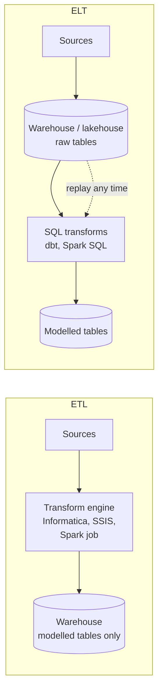
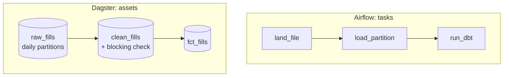

# ETL vs ELT, Batch vs Streaming, Orchestration (Airflow, Dagster) & dbt

!!! abstract "Key takeaways"
    - **ETL** transforms before loading (in a separate engine); **ELT** loads raw data into the warehouse or lakehouse first and transforms there with SQL. ELT is the default today because warehouse compute is elastic and raw data stays replayable. ETL still wins when data must be **masked or filtered before it lands**.
    - **Batch vs streaming is a latency requirement, not a preference.** Streaming costs more to build, test and operate. Ask "what decision changes if the data is 5 minutes old instead of 24 hours?"
    - An **orchestrator** schedules work, runs it in dependency order, retries, backfills and shows what failed. **Airflow** is task-centric (DAGs of tasks); **Dagster** is asset-centric (the tables you want to exist, with partitions and checks).
    - **dbt** compiles `SELECT` statements into tables and views, builds the dependency graph from `ref()` and `source()`, and runs **data tests** and (since 1.8) **unit tests**. Incremental models need a `unique_key` and a reprocessing window to be correct and idempotent.
    - Airflow 3 gotchas interviewers like: `catchup=False` and `schedule=None` are the new defaults, authoring imports come from `airflow.sdk`, and cron schedules now default to `CronTriggerTimetable`, so the **logical date is the run time**, not the start of a data interval.

## Why it matters

Once data lands ([page 1](01-integrating-with-legacy-systems-of-record-databases-files-sf.md)), someone has to turn it into tables people trust, every day, without babysitting. On an FDE deployment that someone is you for the first few months, and then the customer's team. Interviewers at Databricks- and Palantir-style companies ask pipeline-design questions such as *"design the daily pipeline for this customer's claims data"* and expect you to talk about layers, scheduling, retries, backfills and tests, not only the SQL.

## Core concepts

### ETL vs ELT


*Notice the dashed arrow: in ELT the raw copy lives next to the models, so a logic fix is a rerun, not a re-extract.*

| Aspect | ETL | ELT |
|---|---|---|
| Where transforms run | Separate engine before the target | Inside the warehouse / lakehouse |
| Raw data kept? | Usually not | Yes, in a raw or bronze layer |
| Fixing a logic bug | Re-extract from sources | Rerun SQL over raw |
| Who can change logic | Pipeline engineers | Anyone who writes SQL (analytics engineers) |
| Strength | Sensitive data never lands raw; small targets | Fast iteration, lineage, replay |
| Typical tools | Informatica, SSIS, custom Spark/Java | Fivetran/Airbyte + dbt, Databricks, Snowflake |

In practice most stacks are **EtLT**: a light "t" during extraction (drop columns you must never hold, hash identifiers, fix encodings), then ELT for business logic.

### Layers

Whatever the vendor calls them, pipelines converge on three layers:

| Layer | Also called | Contents | Rules |
|---|---|---|---|
| Raw | bronze, landing, source | Data as received plus load metadata | Append-only, never edited |
| Cleaned | silver, staging, intermediate | Typed, deduplicated, one row per business key | Idempotent rebuilds |
| Business | gold, marts, ontology | Facts, dimensions, objects, metrics | Tested, documented, owned |

### Batch, micro-batch and streaming

| Mode | Latency | Examples | Cost and complexity |
|---|---|---|---|
| Batch | Hours to daily | Nightly dbt run, daily file load | Lowest; easy to rerun |
| Micro-batch | Seconds to minutes | Spark Structured Streaming, Auto Loader with `availableNow` on a schedule | Medium |
| Streaming | Milliseconds to seconds | Kafka Streams, Flink, Debezium to Kafka | Highest: state, ordering, late events, exactly-once |

Streaming makes sense when someone acts on the data within minutes: fraud holds, bed management, inventory. For a weekly executive dashboard it adds risk for no value. A common FDE compromise: stream changes into the raw layer with CDC (cheap to keep running) and transform in frequent batches. See [exactly-once in practice](../distributed-systems/07-exactly-once-processing-in-practice.md) and [Kafka Streams](../kafka/11-kafka-streams-and-kafka-connect.md) for the streaming side.

### What an orchestrator does

An orchestrator is not where data is transformed. It decides **when** things run and **in what order**, and it remembers what happened:

- Scheduling (cron, data-aware triggers when an upstream asset updates)
- Dependencies and fan-out/fan-in
- Retries with delay, timeouts, alerting
- **Backfills**: rerunning a date range after a fix
- Run history, logs and lineage

### Airflow vs Dagster


*Notice what the boxes are. In Airflow they are steps you run; in Dagster they are tables you want to exist, so "which partitions of clean_fills are missing or stale?" is a built-in question.*

| | Airflow 3.x | Dagster |
|---|---|---|
| Core abstraction | DAG of tasks | Graph of software-defined assets |
| Data awareness | Assets (renamed from Datasets) trigger DAGs | Assets, partitions, freshness, lineage are the model |
| Backfill | `airflow backfill create --dag-id ... --from-date ... --to-date ...`, also in the UI | Select partitions in the UI; one run per partition or a single ranged run |
| Data quality | Via operators (dbt, Great Expectations) | Asset checks, optionally blocking downstream |
| Ecosystem | Largest; managed on AWS (MWAA), GCP (Composer), Astronomer | Smaller but strong dbt integration |
| Pick when | The customer already runs it, or heterogeneous jobs | Greenfield, asset- and dbt-heavy stacks |

On Databricks, Lakeflow Jobs (formerly Workflows) and Lakeflow Declarative Pipelines (formerly Delta Live Tables) cover similar ground inside the platform; Foundry has its own schedules and build system. **Use what the customer already runs** unless it truly cannot do the job; you will leave, they stay.

### dbt in one screen

- A **model** is a `.sql` file with one `SELECT`. dbt wraps it in `CREATE TABLE/VIEW AS`.
- `{{ source('claims','fill') }}` points at raw tables; `{{ ref('stg_members') }}` points at other models. Those calls build the **DAG**, so dbt runs models in the right order.
- **Materializations:** `view`, `table`, `incremental`, `ephemeral`, `materialized_view`.
- **Data tests** (`unique`, `not_null`, `accepted_values`, `relationships`, custom SQL) run after a model builds. dbt 1.8 renamed the YAML key from `tests:` to `data_tests:` because it added **unit tests**, which check model logic against mocked input rows.
- **Model contracts** (`contract: {enforced: true}`) make dbt check column names and types at build time and apply constraints the platform supports.
- **Snapshots** record type-2 history of mutable source rows; **source freshness** checks warn when raw data stops arriving.
- `dbt build` runs models, tests, snapshots and seeds in DAG order and skips children of a failed test.

## In practice: code & configuration

### A dbt incremental model

=== "❌ Common mistake"
    ```sql
    -- models/marts/fct_fills.sql
    {{ config(materialized='incremental') }}       -- no unique_key: every run appends
    select f.fill_id, p.member_id, f.filled_on, f.amount, f.status
    from {{ source('claims', 'fill') }} f
    join {{ source('claims', 'prescription') }} p using (rx_id)
    
      where f.filled_on > (select max(filled_on) from {{ this }})   -- strict ">" and no lookback
    
    ```
    Rerunning the same day appends duplicates. A reversal posted two days later for an old fill is never picked up, because its `filled_on` is older than `max(filled_on)`. Yesterday's revenue silently stays wrong.

=== "✅ Correct approach"
    ```sql
    -- models/marts/fct_fills.sql
    {{
      config(
        materialized = 'incremental',
        unique_key = 'fill_id',                   -- grain: rerun = update, not duplicate
        incremental_strategy = 'merge',
        on_schema_change = 'append_new_columns'   -- new source column: add it, don't fail
      )
    }}
    select
        f.fill_id,
        p.member_id,
        p.drug_code,
        f.filled_on,
        f.days_supply,
        f.amount,
        f.status
    from {{ source('claims', 'fill') }} f
    join {{ source('claims', 'prescription') }} p using (rx_id)
    
      -- reprocess a 3-day window so late corrections (reversals) are picked up
      where f.filled_on >= (select max(filled_on) - 3 from {{ this }})
    
    ```
    Built against PostgreSQL 16 with dbt-core 1.12 and dbt-postgres 1.11: the first run inserted 8 rows; the second ran a `MERGE` over the window and changed nothing else. `on_schema_change` accepts `ignore` (default), `fail`, `append_new_columns` and `sync_all_columns`; none of them backfill the new column for old rows, which needs `--full-refresh`.

The YAML that makes it trustworthy:

```yaml
# models/marts/_marts.yml
version: 2
models:
  - name: stg_members
    columns:
      - name: member_id
        data_tests: [unique, not_null]
  - name: fct_fills
    config:
      contract: {enforced: true}          # build fails if columns or types drift
    columns:
      - name: fill_id
        data_type: int
        constraints: [{type: not_null}, {type: primary_key}]
        data_tests: [unique, not_null]
      - name: member_id
        data_type: text
        data_tests:
          - not_null
          - relationships:                # every fill belongs to a known member
              arguments:
                to: ref('stg_members')
                field: member_id
      - name: drug_code
        data_type: text
      - name: filled_on
        data_type: date
      - name: days_supply
        data_type: int
      - name: amount
        data_type: numeric(10,2)
        data_tests:
          - not_null:
              config:
                where: "status = 'PAID'"  # pending fills may not be priced yet
      - name: status
        data_type: text
        data_tests:
          - accepted_values:
              arguments:
                values: ['PAID', 'PENDING', 'REVERSED']
unit_tests:
  - name: stg_members_keeps_latest_and_normalises_email
    model: stg_members
    given:
      - input: source('claims', 'raw_member')
        rows:
          - {ingest_id: 1, source: claims, member_id: M1, full_name: "Asha", email: " A@X.COM ", plan_code: gold, updated_at: "2026-09-01 00:00:00+00"}
          - {ingest_id: 2, source: claims, member_id: M1, full_name: "Asha", email: "a@x.com",  plan_code: plat, updated_at: "2026-09-15 00:00:00+00"}
    expect:
      rows:
        - {member_id: M1, full_name: "Asha", email: "a@x.com", plan_code: PLAT}
```

```yaml
# models/staging/_sources.yml: alert when the vendor stops sending
version: 2
sources:
  - name: claims
    schema: raw
    loaded_at_field: updated_at
    freshness:
      warn_after: {count: 12, period: hour}
      error_after: {count: 24, period: hour}
    tables:
      - name: raw_member
      - name: fill
        freshness: null
      - name: prescription
        freshness: null
```

`dbt build` on this project: 1 unit test, 8 data tests, 2 models, all passing, with no deprecation warnings on dbt 1.12. The newer `arguments:` nesting for generic test parameters is the current syntax; older projects pass them directly under the test name.

### An Airflow 3 DAG

```python
from datetime import datetime, timedelta

from airflow.sdk import Asset, dag, task

fills_loaded = Asset("postgres://warehouse/analytics/fct_fills")   # other DAGs can schedule on this

def business_day(logical_date) -> str:
    # Airflow 3 cron schedules default to CronTriggerTimetable: logical_date is the run time
    # (2026-09-15 03:00), not the start of a data interval. The vendor file is for the day before.
    return (logical_date - timedelta(days=1)).strftime("%Y-%m-%d")

@dag(
    schedule="0 3 * * *",                 # 03:00 UTC, after the vendor's nightly SFTP drop
    start_date=datetime(2026, 9, 1),
    catchup=False,                        # Airflow 3 default; backfill explicitly instead
    max_active_runs=1,                    # partitions load one at a time
    default_args={"retries": 3, "retry_delay": timedelta(minutes=10)},
    tags=["fde", "pharmacy"],
)
def pharmacy_daily():

    @task
    def land_file(logical_date=None) -> dict:
        day = business_day(logical_date)
        path = f"s3://landing/pharmacy/fills/dt={day}/fills.csv"
        # SFTP -> S3 copy goes here; same key on every retry, so a rerun overwrites (idempotent)
        return {"day": day, "path": path}

    @task(outlets=[fills_loaded])
    def load_partition(landed: dict) -> None:
        # one transaction: DELETE WHERE fill_date = day; INSERT ... SELECT from the landed file
        print(f"loading {landed['path']} into partition {landed['day']}")

    @task
    def run_dbt(landed: dict) -> None:
        # real life: BashOperator or Astronomer Cosmos running
        # dbt build --select fct_fills+ --vars '{"run_date": "<day>"}'
        print(f"dbt build for {landed['day']}")

    landed = land_file()
    load_partition(landed) >> run_dbt(landed)

pharmacy_daily()
```

Tested with `airflow dags test pharmacy_daily 2026-09-15T03:00:00+00:00` on Airflow 3.3.2: all three tasks succeeded and loaded partition `2026-09-14`. Every task derives its work from the **logical date**, never from `datetime.now()`, which is what makes reruns and backfills safe. A backfill after a bug fix:

```bash
airflow backfill create --dag-id pharmacy_daily \
  --from-date 2026-09-01 --to-date 2026-09-14 \
  --reprocess-behavior completed --max-active-runs 2
```

### The same pipeline as Dagster assets

```python
import dagster as dg
import pandas as pd

daily = dg.DailyPartitionsDefinition(start_date="2026-09-01")

@dg.asset(partitions_def=daily, group_name="pharmacy")
def raw_fills(context: dg.AssetExecutionContext) -> pd.DataFrame:
    day = context.partition_key                        # "2026-09-14": the slice this run owns
    # real life: pull from SFTP/API/DB for exactly this day, land it unchanged
    df = pd.DataFrame({"fill_id": [1, 2], "filled_on": [day, day], "amount": [12.0, None]})
    context.add_output_metadata({"rows": len(df)})
    return df

@dg.asset(
    partitions_def=daily,
    group_name="pharmacy",
    check_specs=[dg.AssetCheckSpec("fill_ids_unique", asset="clean_fills", blocking=True)],
)
def clean_fills(raw_fills: pd.DataFrame):
    df = raw_fills.drop_duplicates("fill_id")
    dupes = int(raw_fills["fill_id"].duplicated().sum())
    yield dg.Output(df)
    # blocking check: if it fails, downstream assets in the same run are not materialized
    yield dg.AssetCheckResult(check_name="fill_ids_unique", passed=len(df) > 0 and df["fill_id"].is_unique,
                              metadata={"dropped_duplicates": dupes})

defs = dg.Definitions(assets=[raw_fills, clean_fills])

if __name__ == "__main__":
    result = dg.materialize([raw_fills, clean_fills], partition_key="2026-09-14")
    print("success:", result.success)                  # success: True
```

Tested on Dagster 1.13: the partition materialised and the check passed. With `dagster-dbt`, each dbt model becomes an asset in the same graph, so dbt tests and Python checks share one lineage view.

## Real-world usage

- **Airflow** came out of Airbnb (2014) and is an Apache top-level project; Airflow 3.0 (April 2025) added the Task SDK (`airflow.sdk`), a new React UI, DAG versioning and first-class backfills.
- **dbt** popularised analytics engineering: SQL in version control, tests in CI, docs and lineage generated from the project.
- **Databricks** pipelines typically use Auto Loader into bronze, then Lakeflow Declarative Pipelines or dbt for silver and gold, orchestrated by Lakeflow Jobs.
- **Palantir Foundry** uses transforms (Python, SQL, Java) and Pipeline Builder over versioned datasets, with schedules and health checks, then maps the outputs into the Ontology ([page 5](05-semantic-layer-and-ontology-modelling-the-customer-s-domain.md)).
- **Common incident:** a DAG that uses `now()` instead of its logical date. Retries after midnight load the wrong day; backfills load "today" fourteen times.

## Trade-offs & production gotchas

| Choice | Pros | Cons | Use when |
|---|---|---|---|
| Full refresh table | Simple, always correct | Cost and time grow with history | Small or medium tables |
| Incremental merge | Cheap daily runs | Needs `unique_key`, lookback, occasional full refresh | Large facts with late updates |
| Insert-overwrite by partition | Idempotent per day, fast | Needs partitioned target | Daily facts in lakehouses |
| Streaming | Fresh | State, ordering, ops burden | Decisions in minutes |
| Customer's orchestrator | They can own it after you leave | May be dated | Almost always |

!!! warning "Gotchas"
    - **Logical date, not wall clock.** Every task must compute its slice from the run's logical date or partition key.
    - **Airflow 3 logical date changed for cron schedules.** Under the default `CronTriggerTimetable`, a 03:00 daily run's logical date is that day at 03:00. DAGs migrated from Airflow 2 that read `ds` as "yesterday" will load the wrong day. Compute the business day explicitly or opt into `CronDataIntervalTimetable`.
    - **Catchup storms.** A DAG with an old `start_date` and `catchup=True` launches hundreds of runs on deploy.
    - **Incremental drift.** Incremental models slowly diverge from a full rebuild (missed corrections, logic changes). Schedule a periodic `--full-refresh` or reconciliation.
    - **Tests that only warn** get ignored. Decide which failures block the pipeline.

!!! question "Interview angle"
    For "design the daily pipeline", walk through: sources and landing → layers → idempotent load per partition → tests that block → orchestration and alerting → backfill story → who owns it after handover. That order covers everything a pipeline-design rubric scores.

## How this connects to my experience

- **Where it applies:** not a direct resume claim. Closest bullets: *"Developed event-driven healthcare analytics workflows"* (Deloitte ConvergeHealth) and *"Designed Kafka-based event-driven workflows with retry and DLQ handling"* (OptumRx Meteor). *"Established engineering standards around testing, CI/CD, code quality, and deployment practices"* transfers to dbt tests in CI.
- **Talking points:**
    - Event-driven workflows on AWS are the streaming half of this page; I can explain when I'd choose batch instead. *[confirm: what the ConvergeHealth analytics workflows produced and how often]*
    - Retry and DLQ design maps to orchestrator retries plus quarantine tables for bad rows.
    - Position Airflow/Dagster/dbt as transferable knowledge: "I haven't run dbt in production, but I've built and tested it end to end for interview prep and understand incremental and test semantics." *[confirm: any Airflow, Step Functions or dbt exposure]*
- **Likely follow-up chain:** "Batch or streaming for this use case?" (decision latency, cost) → "How do you rerun last week after a bug?" (logical dates, idempotent partitions, backfill CLI) → "How do you stop bad data reaching the dashboard?" (blocking tests, contracts, quarantine).

## Interview questions

### Fundamentals

??? question "Q1. What is the difference between ETL and ELT, and why did ELT win?"
    **Answer:** ETL transforms in a separate engine before loading only the result; ELT loads raw data into the warehouse or lakehouse and transforms there. ELT won because cloud warehouses made compute elastic and cheap enough, raw data stays available for replay, and SQL-based tools like dbt let more people own logic. ETL is still right when data must be filtered or masked before it lands.

    **Interviewer listens for:** replay, elastic compute, masking exception.

    **Common wrong answer:** "Same thing, different order."

??? question "Q2. What does an orchestrator do that cron doesn't?"
    **Answer:** Dependency ordering across tasks, retries with backoff, run history and logs, backfills over date ranges, data-aware triggers, alerting, concurrency limits and a UI showing what failed and why. Cron only starts processes at times.

    **Interviewer listens for:** dependencies, backfill, observability.

    **Common wrong answer:** "It runs the transformations."

??? question "Q3. What does `ref()` do in dbt?"
    **Answer:** It resolves to the relation of another model in the current environment (so dev and prod point to different schemas) and registers a dependency edge, which is how dbt builds the DAG and runs models in order. `source()` does the same for raw tables and enables freshness checks.

    **Interviewer listens for:** environment-aware naming and DAG building.

    **Common wrong answer:** "It's a macro that inserts the table name."

### Intermediate

??? question "Q4. How do you make a dbt incremental model correct?"
    **Answer:** Set `unique_key` to the grain so reruns merge instead of appending; filter with a lookback window (`>= max(date) - N`) so late updates are reprocessed; choose a strategy the adapter supports (`merge`, `delete+insert`, `insert_overwrite`); set `on_schema_change`; and schedule periodic full refreshes or reconciliations to catch drift.

    **Interviewer listens for:** unique_key, lookback, drift.

    **Common wrong answer:** "`where date > max(date)` is enough."

??? question "Q5. When would you choose streaming over batch?"
    **Answer:** When a user or system acts on the data within minutes and stale data costs money or safety: fraud holds, operational queues, alerts. Otherwise batch or micro-batch. Streaming adds state management, ordering, late-event handling and on-call load. A common middle ground is CDC into raw plus frequent micro-batches.

    **Interviewer listens for:** decision latency drives the choice; cost of streaming.

    **Common wrong answer:** "Streaming is more modern."

??? question "Q6. Airflow or Dagster for a new customer pipeline?"
    **Answer:** First use whatever the customer already operates. Greenfield: Dagster if the work is mostly building tables (dbt-heavy, partitions, asset checks, lineage); Airflow if jobs are heterogeneous (APIs, file moves, ML training), the team knows it, or a managed service (MWAA, Composer) is mandated.

    **Interviewer listens for:** customer ownership, task vs asset model.

    **Common wrong answer:** a tool preference with no context.

### Senior

??? question "Q7. What changed in Airflow 3 that can break migrated DAGs?"
    **Answer:** Authoring imports move to `airflow.sdk`; `schedule` defaults to `None` and `catchup` to `False`; cron schedules default to `CronTriggerTimetable`, so the logical date equals the run time instead of the start of the data interval, which shifts `ds` by a day for daily DAGs; tasks talk to the API server through the Task SDK instead of the metadata database directly; Datasets are renamed Assets. Backfills are created by the scheduler with `airflow backfill create`.

    **Interviewer listens for:** logical date shift, direct DB access removed.

    **Common wrong answer:** "Just a new UI."

??? question "Q8. How do you design pipelines so backfills are safe?"
    **Answer:** Partition work by logical date; each run reads and writes only its partition; loads are idempotent (overwrite partition or merge on key); no `now()` in logic; reference data is versioned or as-of; limit concurrency so backfills don't starve daily runs; validate counts per partition after the backfill.

    **Interviewer listens for:** partition ownership, idempotency, no wall clock.

    **Common wrong answer:** "Delete the table and rerun everything."

### Scenario-based

??? question "Q9. A dbt test fails at 4 a.m. and the executive dashboard is due at 8. What happens?"
    **Answer:** With `dbt build`, models downstream of the failing test are skipped, so the dashboard shows yesterday's data rather than wrong data. Alert the owner with the failing test and sample rows; check whether the source changed (schema drift, duplicates from a re-sent file); fix or quarantine the bad rows; rerun the affected partition; tell stakeholders the data is a day old before they notice. Afterwards, decide whether that test should block or warn.

    **Interviewer listens for:** stale beats wrong, communication, root cause.

    **Common wrong answer:** "Disable the test to get the run through."

??? question "Q10. The customer wants 'real-time' dashboards. How do you respond?"
    **Answer:** Ask what decision the dashboard drives and how quickly someone acts on it. Often "real-time" means "updated during the working day", which hourly micro-batches meet at a fraction of the cost. If minutes matter, propose CDC into raw plus a streaming or frequent micro-batch path for the few metrics that need it, and keep the rest batch.

    **Interviewer listens for:** clarifying the requirement, tiered latency.

    **Common wrong answer:** "Sure, we'll use Kafka and Flink for everything."

## Cheat sheet

| Concept | Remember |
|---|---|
| ELT default | Raw lands, SQL transforms, replay by rerun |
| ETL still | Mask or drop sensitive data before landing |
| Layers | raw/bronze → cleaned/silver → business/gold |
| Batch vs stream | Decided by how fast someone acts on the data |
| Airflow 3 | `airflow.sdk`, `catchup=False`, Assets, `airflow backfill create`, logical date = run time for cron |
| Dagster | Assets, partitions, asset checks (can block) |
| dbt | `ref`/`source` → DAG; `data_tests` + unit tests (1.8+); contracts; snapshots; freshness |
| Incremental | `unique_key` + lookback + periodic full refresh |

## Sources
1. [dbt docs: Incremental models](https://next.docs.getdbt.com/docs/build/incremental-models): `unique_key`, `is_incremental()`, `on_schema_change` options.
2. [dbt docs: Upgrading to v1.8](https://docs.getdbt.com/docs/dbt-versions/core-upgrade/upgrading-to-v1.8): `data_tests` rename and unit tests.
3. [dbt docs: Snapshots](https://docs.getdbt.com/docs/build/snapshots) and [hard_deletes](https://docs.getdbt.com/reference/resource-configs/hard-deletes): YAML snapshots, strategies, delete handling.
4. [Apache Airflow 3.0.0 release notes](https://airflow.apache.org/docs/apache-airflow/3.0.0/release_notes.html): `airflow.sdk`, new defaults, backfill in the UI.
5. [Apache Airflow: Backfill](https://airflow.apache.org/docs/apache-airflow/stable/core-concepts/backfill.html): `airflow backfill create` flags and reprocess behaviour.
6. [Apache Airflow: Timetables](https://airflow.apache.org/docs/apache-airflow/3.2.2/authoring-and-scheduling/timetable.html) and the `create_cron_data_intervals` config entry (default `False` in Airflow 3.3.2): trigger vs data-interval timetables.
7. [Airflow Task SDK API reference](https://airflow.apache.org/docs/task-sdk/1.1.0/api.html): `dag`, `task`, `Asset`, `catchup` default.
8. [Dagster docs: Backfills](https://docs.dagster.io/overview/partitions-backfill/backfill) and [partitioned assets tutorial](https://docs.dagster.io/etl-pipeline-tutorial/partition-asset): partitions, ranged backfills.
9. [Databricks: Delta Lake deployment guide](https://docs.databricks.com/aws/en/lakehouse-architecture/deployment-guide/delta-lake): Auto Loader, Lakeflow Connect and Declarative Pipelines in the ingestion path.
