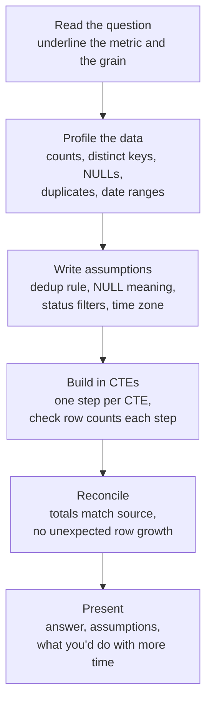
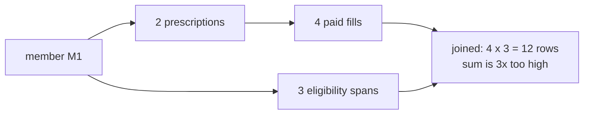

# SQL for Take-Homes: Multi-Table Joins, Window Functions, NULL Handling, Deduplication

!!! abstract "Key takeaways"
    - **State the grain first.** "One row per member per month" before writing any SQL. Most wrong answers in take-homes are grain errors: a join that multiplies rows, or a count of the wrong thing.
    - **Fan-out:** joining a parent to two independent child tables multiplies rows. **Aggregate each child to the parent's grain first**, then join.
    - **NULL is "unknown", not a value:** `NULL = NULL` is NULL, aggregates skip NULLs, `NOT IN` with a NULL returns nothing, `LEFT JOIN ... WHERE right.col = x` silently becomes an inner join. Use `IS DISTINCT FROM`, `COALESCE` deliberately, `NOT EXISTS`, and filters in `ON`.
    - **Deduplicate deterministically:** `ROW_NUMBER() OVER (PARTITION BY key ORDER BY updated_at DESC, ingest_id DESC)`. Without a tie-breaker the "latest" row changes between runs. PostgreSQL's `DISTINCT ON` is the short form.
    - **Window frames matter:** the default frame with `ORDER BY` ends at the current row (so `LAST_VALUE` looks broken); `RANGE` with an interval gives time-based rolling windows; `generate_series` fills missing periods.

## Why it matters

Data-flavoured FDE loops (Databricks, Palantir, data-platform startups) often include a SQL take-home or a live SQL exercise on messy data: two source systems, duplicates, missing values, and a business question such as *"monthly spend per plan, including months with no activity"*. The bar is not clever syntax. Reviewers check that the numbers are **right**, that you **stated assumptions** about duplicates and NULLs, that the SQL is **readable** (CTEs with names), and that you **checked your own output** (row counts, reconciliation).

This page assumes the basics in [SQL essentials](../postgresql-sql/01-sql-essentials-joins-group-by-window-functions-ctes.md) and the classic puzzles in [common SQL interview queries](../postgresql-sql/08-common-sql-interview-queries.md) (Nth highest, top-N, NOT IN trap, gaps and islands). Here the focus is the integration flavour: several sources, dirty keys, and grain.

## Core concepts

### A take-home workflow that scores well


*Notice that two of the six steps happen before any answer query. Profiling and written assumptions are what separate a senior submission from a correct-looking one.*

Profiling queries worth having ready:

```sql
SELECT count(*), count(DISTINCT member_id), count(*) - count(email) AS null_emails,
       min(updated_at), max(updated_at)
FROM th.raw_member;

SELECT member_id, count(*) FROM th.raw_member GROUP BY member_id HAVING count(*) > 1;  -- duplicates?
```

### Grain and join fan-out

Every table has a grain: `prescription` is one row per prescription, `fill` is one row per dispensing event, `eligibility` is one row per coverage span. Join a member's prescriptions to their fills **and** their eligibility spans in one query and each fill is repeated once per span. Sums inflate; counts lie.


*Notice the two child tables are independent of each other. Any time a query touches two one-to-many paths from the same parent, aggregate each path first.*

### NULL semantics you will be tested on

| Expression | Result | Why it bites |
|---|---|---|
| `NULL = NULL` | NULL | Joins on nullable columns never match NULLs |
| `NULL IS DISTINCT FROM NULL` | false | The NULL-safe comparison for change detection |
| `count(*)` vs `count(col)` | All rows vs non-NULL rows | "Count of members" vs "members with an email" |
| `avg(amount)` | Ignores NULLs | Average of priced fills, not of all fills |
| `'a' \|\| NULL` vs `concat('a', NULL)` | NULL vs `'a'` | Building keys from nullable parts |
| `x NOT IN (subquery with a NULL)` | Never true | Use `NOT EXISTS` |
| `ORDER BY email` (ascending) | NULLs last in PostgreSQL | Use `NULLS FIRST/LAST` explicitly |
| `LEFT JOIN b ... WHERE b.status = 'PAID'` | Drops unmatched rows | Put the filter in `ON` |

### Window functions: the parts that trip people

- `ROW_NUMBER` (unique), `RANK` (gaps after ties), `DENSE_RANK` (no gaps). Choose by how ties should behave and **say it**.
- `LAG`/`LEAD` compare a row with its neighbour: days between fills, change since last month.
- **Frames:** with `ORDER BY` and no frame, the default is `RANGE BETWEEN UNBOUNDED PRECEDING AND CURRENT ROW`. That is why `LAST_VALUE` returns the current row. Use `ROWS BETWEEN UNBOUNDED PRECEDING AND UNBOUNDED FOLLOWING`.
- `ROWS` counts physical rows; `RANGE` with `INTERVAL '30 days' PRECEDING` uses values, so it is a true time window even with missing days.
- `WINDOW w AS (...)` names a window you reuse.

## In practice: code & configuration

The two most common take-home bugs, shown on the practice dataset below.

=== "❌ Common mistake: fan-out"
    ```sql
    -- "Paid spend per member" with eligibility joined in for a later filter
    SELECT p.member_id, sum(f.amount) AS paid_spend
    FROM th.prescription p
    JOIN th.fill f        ON f.rx_id = p.rx_id AND f.status = 'PAID'
    JOIN th.eligibility e ON e.member_id = p.member_id
    GROUP BY p.member_id ORDER BY 1;
    --  M1 | 16308.00   <- true value is 5436.00 (three eligibility spans)
    --  M2 |     9.00
    --  M3 |    24.00   <- true value is 12.00 (two spans)
    ```

=== "✅ Correct approach: aggregate each path first"
    ```sql
    WITH rx AS (
      SELECT member_id, count(*) AS rx_count
      FROM th.prescription GROUP BY member_id
    ), spend AS (
      SELECT p.member_id, sum(f.amount) FILTER (WHERE f.status = 'PAID') AS paid_spend
      FROM th.fill f JOIN th.prescription p USING (rx_id)
      GROUP BY p.member_id
    )
    SELECT rx.member_id, rx.rx_count, COALESCE(spend.paid_spend, 0) AS paid_spend
    FROM rx LEFT JOIN spend USING (member_id)
    ORDER BY rx.member_id;
    --  M1 | 2 | 5436.00
    --  M2 | 2 |    9.00
    --  M3 | 1 |   12.00
    ```

The second bug turns an outer join back into an inner join:

=== "❌ Common mistake: filter kills the outer join"
    ```sql
    SELECT m.member_id, count(f.fill_id)
    FROM members m
    LEFT JOIN th.prescription p ON p.member_id = m.member_id
    LEFT JOIN th.fill f ON f.rx_id = p.rx_id
    WHERE f.status = 'PAID'                       -- members with no paid fills vanish
    GROUP BY m.member_id;
    ```

=== "✅ Correct approach: filter in ON"
    ```sql
    -- see Exercise 3: the status and date filters go in the ON clause of the outer join
    ```

## Practice set: a take-home on messy pharmacy data

The scenario: a pharmacy benefits customer has a **claims** system and a **CRM**. Members appear in both with different IDs; the claims feed re-sends records; some fills are reversed or not yet priced; eligibility spans overlap. All solutions below were run on PostgreSQL 16.15 and the outputs are real.

??? example "Schema and sample data (run this first)"
    ```sql
    DROP SCHEMA IF EXISTS th CASCADE;
    CREATE SCHEMA th;
    SET search_path = th;

    -- Raw member feed from two source systems (duplicates, casing, NULLs on purpose)
    CREATE TABLE raw_member (
      ingest_id   bigint GENERATED ALWAYS AS IDENTITY,
      source      text        NOT NULL,          -- 'claims' or 'crm'
      member_id   text        NOT NULL,          -- natural key from source
      full_name   text,
      email       text,
      plan_code   text,
      updated_at  timestamptz NOT NULL
    );
    INSERT INTO raw_member (source, member_id, full_name, email, plan_code, updated_at) VALUES
     ('claims','M1','Asha Rao',   'Asha@Example.com ', 'GOLD',  '2026-09-01 10:00+00'),
     ('claims','M1','Asha Rao',   'asha@example.com',  'PLAT',  '2026-09-15 10:00+00'),
     ('claims','M1','Asha R.',    'asha@example.com',  'PLAT',  '2026-09-15 10:00+00'),  -- exact tie
     ('claims','M2','Dev Shah',   NULL,                'SILVER','2026-09-02 09:00+00'),
     ('claims','M3','Chen Li',    'chen@example.com',  NULL,    '2026-09-03 08:00+00'),
     ('crm',   'C9','Asha Rao',   'asha@example.com',  NULL,    '2026-09-20 12:00+00'),
     ('crm',   'C7','Farid Khan', 'farid@example.com', NULL,    '2026-09-05 12:00+00');

    CREATE TABLE drug (drug_code text PRIMARY KEY, drug_name text NOT NULL, is_specialty boolean NOT NULL);
    INSERT INTO drug VALUES ('D1','Atorvastatin',false),('D2','Metformin',false),
                            ('D3','Adalimumab',true),('D4','Insulin glargine',false);

    CREATE TABLE prescription (rx_id int PRIMARY KEY, member_id text NOT NULL,
                               drug_code text REFERENCES drug, written_at date NOT NULL);
    INSERT INTO prescription VALUES (101,'M1','D1','2026-06-01'),(102,'M1','D3','2026-07-01'),
      (103,'M2','D2','2026-06-15'),(104,'M3','D1','2026-08-01'),(105,'M2',NULL,'2026-08-10');

    CREATE TABLE fill (fill_id int PRIMARY KEY, rx_id int NOT NULL REFERENCES prescription,
                       filled_on date NOT NULL, days_supply int NOT NULL,
                       amount numeric(10,2), status text NOT NULL);
    INSERT INTO fill VALUES
     (1,101,'2026-06-02',30,  12.00,'PAID'),
     (2,101,'2026-07-01',30,  12.00,'PAID'),
     (3,101,'2026-08-20',30,  12.00,'PAID'),      -- 50 days after previous: late refill
     (4,102,'2026-07-03',28,5400.00,'PAID'),
     (5,102,'2026-07-31',28,5400.00,'REVERSED'),
     (6,103,'2026-06-16',90,   9.00,'PAID'),
     (7,103,'2026-09-14',90,   NULL,'PENDING'),   -- amount unknown yet
     (8,104,'2026-08-02',30,  12.00,'PAID');

    -- Eligibility spans (overlapping and adjacent on purpose)
    CREATE TABLE eligibility (member_id text, start_date date, end_date date);
    INSERT INTO eligibility VALUES
     ('M1','2026-01-01','2026-03-31'),('M1','2026-03-15','2026-06-30'),('M1','2026-08-01','2026-12-31'),
     ('M2','2026-01-01','2026-12-31'),('M3','2026-05-01','2026-05-31'),('M3','2026-06-01','2026-06-30');
    ```

### Exercise 1: latest record per member, per source

Return one row per `(source, member_id)` with the most recent values and a normalised email. Note M1 has two rows with the same `updated_at`.

??? success "Solution"
    ```sql
    WITH ranked AS (
      SELECT r.*,
             ROW_NUMBER() OVER (PARTITION BY source, member_id
                                ORDER BY updated_at DESC, ingest_id DESC) AS rn  -- tie-breaker!
      FROM th.raw_member r
    )
    SELECT source, member_id, full_name, lower(btrim(email)) AS email, plan_code, updated_at
    FROM ranked WHERE rn = 1 ORDER BY source, member_id;

    -- PostgreSQL short form
    SELECT DISTINCT ON (source, member_id) source, member_id, full_name
    FROM th.raw_member ORDER BY source, member_id, updated_at DESC, ingest_id DESC;
    ```
    ```text
     source | member_id | full_name  |       email       | plan_code
    --------+-----------+------------+-------------------+-----------
     claims | M1        | Asha R.    | asha@example.com  | PLAT
     claims | M2        | Dev Shah   |                   | SILVER
     claims | M3        | Chen Li    | chen@example.com  |
     crm    | C7        | Farid Khan | farid@example.com |
     crm    | C9        | Asha Rao   | asha@example.com  |
    ```
    State the assumption: "on equal `updated_at`, the later-ingested row wins." Without `ingest_id DESC`, PostgreSQL may return either M1 row and the result can change between runs.

### Exercise 2: prescriptions and paid spend per member

Count prescriptions and sum **paid** spend per member in one result. This is the fan-out trap shown above: aggregate fills and prescriptions separately, then join. `sum(...) FILTER (WHERE ...)` keeps the status rule next to the aggregate.

### Exercise 3: paid fills in August for every claims member, including zero

??? success "Solution"
    ```sql
    WITH members AS (SELECT DISTINCT member_id FROM th.raw_member WHERE source = 'claims')
    SELECT m.member_id, count(f.fill_id) AS aug_paid_fills       -- count(col), not count(*)
    FROM members m
    LEFT JOIN th.prescription p ON p.member_id = m.member_id
    LEFT JOIN th.fill f ON f.rx_id = p.rx_id
                       AND f.status = 'PAID'
                       AND f.filled_on >= DATE '2026-08-01'      -- half-open date range
                       AND f.filled_on <  DATE '2026-09-01'
    GROUP BY m.member_id ORDER BY m.member_id;
    ```
    ```text
     M1 | 1
     M2 | 0
     M3 | 1
    ```
    Use half-open ranges (`>= start AND < next_start`); `BETWEEN '2026-08-01' AND '2026-08-31'` breaks as soon as the column is a timestamp.

### Exercise 4: NULL traps

(a) Average fill amount, excluding reversals. (b) Drugs never prescribed.

??? success "Solution"
    ```sql
    SELECT count(*) AS all_fills, count(amount) AS priced_fills,
           avg(amount) AS avg_ignoring_nulls, avg(COALESCE(amount, 0)) AS avg_nulls_as_zero
    FROM th.fill WHERE status <> 'REVERSED';
    --  7 | 6 | 909.50 | 779.57     <- which one is "right" is a business question: ask or state it

    SELECT d.drug_code FROM th.drug d
    WHERE d.drug_code NOT IN (SELECT drug_code FROM th.prescription);   -- 0 rows: rx 105 has NULL drug_code

    SELECT d.drug_code FROM th.drug d
    WHERE NOT EXISTS (SELECT 1 FROM th.prescription p WHERE p.drug_code = d.drug_code);  -- D4
    ```
    A pending fill's amount is unknown, not zero. Averaging it as zero understates cost. Say which you chose and why.

### Exercise 5: late refills

For each paid fill, show the previous fill of the same prescription and how many days late it was (expected = previous fill date + days supply).

??? success "Solution"
    ```sql
    SELECT p.member_id, f.rx_id, f.filled_on,
           LAG(f.filled_on)   OVER w AS prev_fill,
           LAG(f.days_supply) OVER w AS prev_supply,
           f.filled_on - (LAG(f.filled_on) OVER w + LAG(f.days_supply) OVER w) AS days_late
    FROM th.fill f JOIN th.prescription p USING (rx_id)
    WHERE f.status = 'PAID'
    WINDOW w AS (PARTITION BY f.rx_id ORDER BY f.filled_on)
    ORDER BY f.rx_id, f.filled_on;
    ```
    ```text
     member_id | rx_id | filled_on  | prev_fill  | prev_supply | days_late
    -----------+-------+------------+------------+-------------+-----------
     M1        |   101 | 2026-06-02 |            |             |
     M1        |   101 | 2026-07-01 | 2026-06-02 |          30 |        -1
     M1        |   101 | 2026-08-20 | 2026-07-01 |          30 |        20
     M1        |   102 | 2026-07-03 |            |             |
     M2        |   103 | 2026-06-16 |            |             |
     M3        |   104 | 2026-08-02 |            |             |
    ```
    The `WHERE` runs before window functions, so reversed fills are excluded from the sequence. If you need them in the sequence but not in the output, filter in an outer query instead.

### Exercise 6: monthly paid spend, including empty months, with change vs previous month

??? success "Solution"
    ```sql
    WITH months AS (
      SELECT generate_series(DATE '2026-06-01', DATE '2026-09-01', INTERVAL '1 month')::date AS month
    ), spend AS (
      SELECT date_trunc('month', filled_on)::date AS month, sum(amount) AS paid
      FROM th.fill WHERE status = 'PAID' GROUP BY 1
    )
    SELECT m.month, COALESCE(s.paid, 0) AS paid,
           COALESCE(s.paid, 0) - LAG(COALESCE(s.paid, 0)) OVER (ORDER BY m.month) AS change_vs_prev
    FROM months m LEFT JOIN spend s USING (month)
    ORDER BY m.month;
    ```
    ```text
       month    |  paid   | change_vs_prev
    ------------+---------+----------------
     2026-06-01 |   21.00 |
     2026-07-01 | 5412.00 |        5391.00
     2026-08-01 |   24.00 |       -5388.00
     2026-09-01 |       0 |         -24.00
    ```
    Without the `months` spine, September disappears and the "change" for October would compare with August.

### Exercise 7: merge overlapping and adjacent eligibility spans

Return continuous coverage periods per member. M1 has an overlap (Jan to Mar and mid-Mar to Jun); M3 has two adjacent months.

??? success "Solution"
    ```sql
    WITH ordered AS (
      SELECT member_id, start_date, end_date,
             MAX(end_date) OVER (PARTITION BY member_id ORDER BY start_date, end_date
                                 ROWS BETWEEN UNBOUNDED PRECEDING AND 1 PRECEDING) AS prev_max_end
      FROM th.eligibility
    ), flagged AS (
      SELECT *, CASE WHEN prev_max_end IS NULL OR start_date > prev_max_end + 1
                     THEN 1 ELSE 0 END AS new_island     -- +1: adjacent days count as continuous
      FROM ordered
    ), grouped AS (
      SELECT *, SUM(new_island) OVER (PARTITION BY member_id ORDER BY start_date, end_date) AS island
      FROM flagged
    )
    SELECT member_id, MIN(start_date) AS start_date, MAX(end_date) AS end_date
    FROM grouped GROUP BY member_id, island ORDER BY member_id, start_date;
    ```
    ```text
     M1 | 2026-01-01 | 2026-06-30
     M1 | 2026-08-01 | 2026-12-31
     M2 | 2026-01-01 | 2026-12-31
     M3 | 2026-05-01 | 2026-06-30
    ```
    Use the running **max** of previous end dates, not `LAG(end_date)`: a long span can contain several shorter ones that follow it. PostgreSQL 14+ also has multiranges (`range_agg(daterange(start_date, end_date, '[]'))`), which do this in one line if the reviewer allows PostgreSQL-specific features.

### Exercise 8: top 2 drugs by paid spend within specialty and non-specialty, ties kept

??? success "Solution"
    ```sql
    WITH s AS (
      SELECT d.drug_name, d.is_specialty, sum(f.amount) AS paid
      FROM th.fill f JOIN th.prescription p USING (rx_id) JOIN th.drug d USING (drug_code)
      WHERE f.status = 'PAID'
      GROUP BY d.drug_name, d.is_specialty
    )
    SELECT * FROM (
      SELECT s.*, DENSE_RANK() OVER (PARTITION BY is_specialty ORDER BY paid DESC) AS rnk FROM s
    ) t
    WHERE rnk <= 2 ORDER BY is_specialty, rnk, drug_name;
    ```
    ```text
      drug_name   | is_specialty |  paid   | rnk
    --------------+--------------+---------+-----
     Atorvastatin | f            |   48.00 |   1
     Metformin    | f            |    9.00 |   2
     Adalimumab   | t            | 5400.00 |   1
    ```
    `DENSE_RANK` returns every drug tied at a rank; `ROW_NUMBER` would pick one arbitrarily. Say which one the business wants.

### Exercise 9: match members across claims and CRM

Match the latest claims record to the latest CRM record on normalised email. Report matched, claims-only and CRM-only.

??? success "Solution"
    ```sql
    WITH latest AS (
      SELECT DISTINCT ON (source, member_id) source, member_id, lower(btrim(email)) AS email
      FROM th.raw_member ORDER BY source, member_id, updated_at DESC, ingest_id DESC
    )
    SELECT c.member_id AS claims_id, r.member_id AS crm_id, COALESCE(c.email, r.email) AS email,
           CASE WHEN c.member_id IS NULL THEN 'crm_only'
                WHEN r.member_id IS NULL THEN 'claims_only' ELSE 'matched' END AS match_status
    FROM (SELECT * FROM latest WHERE source = 'claims') c
    FULL OUTER JOIN (SELECT * FROM latest WHERE source = 'crm') r
      ON c.email = r.email            -- NULL emails never match, which is what we want here
    ORDER BY match_status, email NULLS LAST;
    ```
    ```text
     claims_id | crm_id |       email       | match_status
    -----------+--------+-------------------+--------------
     M3        |        | chen@example.com  | claims_only
     M2        |        |                   | claims_only
               | C7     | farid@example.com | crm_only
     M1        | C9     | asha@example.com  | matched
    ```
    In the write-up, flag that email is a weak identity key (shared family emails, typos) and that a real deployment needs a crosswalk table with match confidence and human review ([page 5](05-semantic-layer-and-ontology-modelling-the-customer-s-domain.md)).

### Exercise 10: running total and 30-day rolling spend per member

??? success "Solution"
    ```sql
    SELECT p.member_id, f.filled_on, f.amount,
           SUM(f.amount) OVER (PARTITION BY p.member_id ORDER BY f.filled_on
                               ROWS BETWEEN UNBOUNDED PRECEDING AND CURRENT ROW) AS running_paid,
           SUM(f.amount) OVER (PARTITION BY p.member_id ORDER BY f.filled_on
                               RANGE BETWEEN INTERVAL '30 days' PRECEDING AND CURRENT ROW) AS paid_last_30d
    FROM th.fill f JOIN th.prescription p USING (rx_id)
    WHERE f.status = 'PAID'
    ORDER BY p.member_id, f.filled_on;
    ```
    ```text
     member_id | filled_on  | amount  | running_paid | paid_last_30d
    -----------+------------+---------+--------------+---------------
     M1        | 2026-06-02 |   12.00 |        12.00 |         12.00
     M1        | 2026-07-01 |   12.00 |        24.00 |         24.00
     M1        | 2026-07-03 | 5400.00 |      5424.00 |       5412.00
     M1        | 2026-08-20 |   12.00 |      5436.00 |         12.00
    ```
    `RANGE ... INTERVAL '30 days' PRECEDING` is value-based: on 2026-07-03 it includes 07-01 but not 06-02. A `ROWS BETWEEN 29 PRECEDING` frame would be "last 30 fills", a different question.

## Real-world usage

- **Take-home formats:** a CSV or SQLite/DuckDB file with 3 to 6 tables and 5 to 8 questions, 2 to 4 hours, followed by a walkthrough. Some companies use live SQL in a shared editor instead. Expect follow-ups like "what if this table had 2 billion rows?" (indexes, partition pruning, pre-aggregation: see [indexes and EXPLAIN](../postgresql-sql/02-indexes-and-explain-analyze.md)).
- **Real deployments** use these exact patterns daily: latest-record deduplication in staging models, interval merging for coverage and contracts, gap-filled time series for dashboards, and FULL OUTER JOIN reconciliations between source and target.
- **Healthcare and banking** data is full of reversals, adjustments and effective-dated records, so "which status counts?" and "as of when?" are always questions to ask.

## Trade-offs & production gotchas

| Pattern | Pros | Cons | Use when |
|---|---|---|---|
| `ROW_NUMBER` + filter | Portable, flexible (keep top N) | Verbose | Any engine, any N |
| `DISTINCT ON` | Short, fast in PostgreSQL | PostgreSQL only | Top-1 per group in Postgres |
| `QUALIFY` | Filter windows without a subquery | Not in PostgreSQL (Snowflake, Databricks, DuckDB, BigQuery) | Engines that support it |
| Correlated subquery | Easy to read | Can be slow | Small data, clarity first |
| `LATERAL ... LIMIT n` | Uses an index per group | PostgreSQL-specific syntax | Top-N per group on large tables |

!!! warning "Gotchas"
    - **`BETWEEN` on timestamps** misses everything after midnight of the end date. Use half-open ranges.
    - **`COUNT(DISTINCT col)`** ignores NULLs; report missing values separately.
    - **Integer division:** `1/2 = 0` in PostgreSQL. Cast to `numeric` for rates.
    - **Time zones:** `date_trunc('month', timestamptz)` uses the session time zone. Set it or convert first.
    - **Joins on text keys** fail on case and whitespace. Normalise keys in one CTE and reuse it.

!!! question "Interview angle"
    End every take-home answer with a reconciliation line: "Total paid in my monthly table is 5,457.00, which matches `sum(amount) WHERE status='PAID'` on the raw fills." It proves you checked for fan-out without being asked.

## How this connects to my experience

- **Where it applies:** PostgreSQL and MySQL are on my skills list, and I've worked with relational stores on AWS (RDS at Deloitte ConvergeHealth). Most of my recent query work is MongoDB at OptumRx Meteor. *[confirm: any SQL reporting or analytics queries written at Deloitte or Publicis Sapient]*
- **Talking points:**
    - Fan-out and deduplication problems also show up in API aggregation: the GraphQL Consumer Service joined data from 5 upstream systems, where the same "grain first" thinking avoids duplicated items.
    - Latest-record-wins with a tie-breaker is the same rule as an idempotent Kafka consumer keeping the newest version of an entity.
    - Position the rest honestly: "I practise SQL take-homes on realistic messy data; here is how I structure, assume and reconcile."
- **Likely follow-up chain:** "Why did you use ROW_NUMBER and not RANK?" (ties, determinism) → "How would this run on a billion rows?" (index on `(member_id, updated_at DESC)`, partitioning by date, pre-aggregated tables) → "How would you test this query?" (small fixture with known answers, as in dbt unit tests on [page 2](02-etl-vs-elt-batch-vs-streaming-orchestration-and-dbt.md)).

## Interview questions

### Fundamentals

??? question "Q1. What does 'grain' mean, and why state it first?"
    **Answer:** The grain is what one row represents: one row per fill, per member per month, per coverage span. Stating it first tells you which joins are safe (joining to a table at the same or coarser grain) and which multiply rows, and it makes the result checkable ("I expect one row per member per month, so 3 members x 4 months = 12 rows").

    **Interviewer listens for:** grain drives joins and checks.

    **Common wrong answer:** "It's the level of detail" with no use for it.

??? question "Q2. Why does `NOT IN` return no rows when the subquery contains a NULL?"
    **Answer:** `x NOT IN (a, b, NULL)` expands to `x <> a AND x <> b AND x <> NULL`; the last term is unknown, so the whole predicate is never true. Use `NOT EXISTS`, which PostgreSQL also plans as an anti-join.

    **Interviewer listens for:** three-valued logic, NOT EXISTS.

    **Common wrong answer:** "NOT IN is slow."

??? question "Q3. ROW_NUMBER, RANK or DENSE_RANK for 'top 3 per group'?"
    **Answer:** ROW_NUMBER gives exactly 3 rows and breaks ties arbitrarily unless you add a tie-breaker; RANK keeps all ties and may skip ranks (1, 1, 3); DENSE_RANK keeps ties without gaps (1, 1, 2) and can return more than 3 rows. Pick based on the business meaning of ties and say so.

    **Interviewer listens for:** tie semantics, determinism.

    **Common wrong answer:** "They're the same."

### Intermediate

??? question "Q4. How do you deduplicate records deterministically?"
    **Answer:** `ROW_NUMBER() OVER (PARTITION BY business_key ORDER BY updated_at DESC, ingest_id DESC)` and keep `rn = 1`. The tie-breaker guarantees the same row wins on every run. In PostgreSQL, `DISTINCT ON (key) ... ORDER BY key, updated_at DESC, ingest_id DESC` is equivalent. For permanent cleanup, `DELETE ... USING` with the same rule.

    **Interviewer listens for:** tie-breaker, reproducibility.

    **Common wrong answer:** `SELECT DISTINCT *` (only removes exact duplicates).

??? question "Q5. A LEFT JOIN query lost the rows with no match. Why?"
    **Answer:** A filter on the right table's columns was placed in `WHERE`. For unmatched rows those columns are NULL, so the predicate is not true and the row is dropped, turning the outer join into an inner join. Move the filter into `ON`, and count a right-side column, not `*`.

    **Interviewer listens for:** ON vs WHERE semantics.

    **Common wrong answer:** "Use a RIGHT JOIN."

??? question "Q6. Why does `LAST_VALUE` return the current row?"
    **Answer:** With `ORDER BY` in the window and no explicit frame, the frame is `RANGE BETWEEN UNBOUNDED PRECEDING AND CURRENT ROW`, so the last row of the frame is the current row (or its last peer). Specify `ROWS BETWEEN UNBOUNDED PRECEDING AND UNBOUNDED FOLLOWING`, or use `FIRST_VALUE` with the order reversed.

    **Interviewer listens for:** default frame knowledge.

    **Common wrong answer:** "It's a PostgreSQL bug."

### Senior

??? question "Q7. How would you merge overlapping date ranges in SQL?"
    **Answer:** Order spans per key, compute the running max of previous end dates, mark a new island when the start is after that max (plus one day if adjacency counts as continuous), take a running sum of the marks as an island ID, then group by key and island with MIN(start) and MAX(end). In PostgreSQL 14+, `range_agg` over `daterange` values does it directly.

    **Interviewer listens for:** running max (not LAG), adjacency rule.

    **Common wrong answer:** using only `LAG(end_date)`, which fails when one span contains later ones.

??? question "Q8. Your monthly totals are higher than the source total. How do you debug it?"
    **Answer:** Suspect fan-out. Count rows after each join in the CTE chain and compare with the expected grain; look for a join to a one-to-many table that isn't needed for the metric; check duplicates in the source keys; aggregate each child to the parent grain before joining. Then add a reconciliation check to the deliverable.

    **Interviewer listens for:** systematic row-count checks, pre-aggregation.

    **Common wrong answer:** adding `DISTINCT` to the sum (hides the bug and drops legitimate equal amounts).

### Scenario-based

??? question "Q9. The take-home question is ambiguous about reversed and pending claims. What do you do?"
    **Answer:** Pick the most defensible interpretation (for spend: paid minus reversals, pending excluded because the amount is unknown), state it in an assumptions section at the top, show the sensitivity if it matters ("including pending as zero lowers the average from 909.50 to 779.57"), and write the query so the rule lives in one place and is easy to change. If there is a way to ask, ask.

    **Interviewer listens for:** explicit assumptions, sensitivity, ease of change.

    **Common wrong answer:** silently picking one.

## Cheat sheet

| Concept | Remember |
|---|---|
| Grain | Say it before the SQL; check row counts against it |
| Fan-out | Two one-to-many paths: aggregate each first |
| Outer join filter | In `ON`; count a right-side column |
| Anti-join | `NOT EXISTS`, never `NOT IN` on nullable columns |
| Dedup | `ROW_NUMBER` with a tie-breaker; `DISTINCT ON` in Postgres |
| Frames | Default ends at current row; `RANGE INTERVAL` for time windows |
| Gap fill | `generate_series` spine + LEFT JOIN + `COALESCE` |
| Intervals | Running max end → island flag → running sum → group |
| Dates | Half-open ranges, explicit time zone |

## Sources
1. [PostgreSQL 16: Window functions tutorial](https://www.postgresql.org/docs/16/tutorial-window.html) and [window function calls and frames](https://www.postgresql.org/docs/16/sql-expressions.html#SYNTAX-WINDOW-FUNCTIONS): default frame, ROWS vs RANGE with offsets.
2. [PostgreSQL 16: Comparison functions and operators](https://www.postgresql.org/docs/16/functions-comparison.html): `IS DISTINCT FROM`, NULL comparisons.
3. [PostgreSQL 16: Subquery expressions](https://www.postgresql.org/docs/16/functions-subquery.html): `NOT IN` with NULLs, `EXISTS`.
4. [PostgreSQL 16: SELECT (DISTINCT ON)](https://www.postgresql.org/docs/16/sql-select.html#SQL-DISTINCT): semantics and ordering requirement.
5. [PostgreSQL 16: Set returning functions (generate_series)](https://www.postgresql.org/docs/16/functions-srf.html) and [range functions (range_agg)](https://www.postgresql.org/docs/16/functions-range.html): gap filling and multiranges.
6. [PostgreSQL 16: Aggregate functions and FILTER](https://www.postgresql.org/docs/16/sql-expressions.html#SYNTAX-AGGREGATES): `FILTER (WHERE ...)`, NULL handling in aggregates.
7. *SQL Performance Explained* (Markus Winand) and [Modern SQL: window functions](https://modern-sql.com/feature/over): frames and portability notes (QUALIFY support varies by engine).
