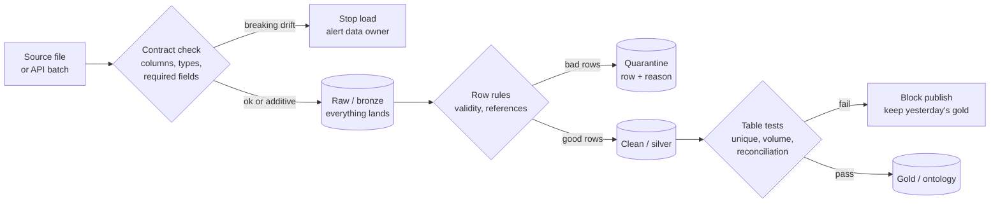
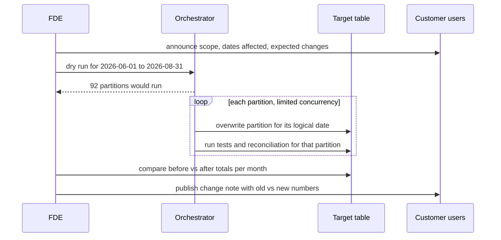

# Data Quality, Schema Drift, Idempotent Loads & Backfills

!!! abstract "Key takeaways"
    - **Data quality is checked at three points**: on arrival (does the file or payload match the contract?), after transformation (are keys unique, references valid, values in range?) and at the output (does the total reconcile with the source?). Decide up front which failures **block** and which **warn**, and send bad rows to a **quarantine** table rather than dropping them.
    - **Schema drift** comes in two kinds. **Additive** (new column) is usually safe: land it, don't model it yet. **Breaking** (removed or renamed column, type change, meaning change) must stop the load and start a conversation with the data owner.
    - **Idempotent load** = running the same load twice leaves the target exactly as running it once. The patterns: **MERGE/upsert on a business key** with a version guard, **delete-and-insert a partition in one transaction**, or **overwrite a partition** atomically. Plain `INSERT` append is not idempotent.
    - **Backfill** = reprocessing a historical range after a bug fix, new column or late data. It is only safe if every run reads and writes **only its own partition**, keyed by logical date, never `now()`.
    - The trust test for a pipeline: *"Can I rerun last Tuesday right now without asking anyone?"* If yes, quality issues become fixable in hours.

## Why it matters

The fastest way to lose a customer's trust is a dashboard number that is wrong and nobody noticed. The second fastest is a fix that double-counts last month. On FDE deployments you integrate data you don't control, from teams who change it without telling you. Quality checks, drift handling, idempotency and backfills are what let a small team run many integrations without firefighting.

Interviewers test this in pipeline design and scenario questions: *"The vendor added a column and renamed another. What happens to your pipeline?"* or *"You found a bug that affected three months of data. Walk me through the fix."*

## Core concepts

### Data quality dimensions

| Dimension | Question | Example check |
|---|---|---|
| Completeness | Is everything there? | `not_null` on required columns; row count vs yesterday |
| Uniqueness | One row per key? | `unique` on `fill_id`; no duplicate `(member_id, month)` |
| Validity | Values allowed? | `status IN (...)`, `days_supply BETWEEN 1 AND 365`, date parses |
| Referential integrity | Do references resolve? | Every fill's `rx_id` exists in prescriptions |
| Timeliness | Is it fresh? | Max `updated_at` within 24 hours (dbt source freshness) |
| Consistency / accuracy | Does it agree with the source? | Target sum = source sum per day |
| Volume / distribution | Is it normal? | Rows today within ±30% of the 7-day average; NULL rate stable |

### Where checks run and what happens on failure


*Notice that nothing is silently dropped. Breaking drift stops early; bad rows are kept with a reason; table-level failures hold back publishing so users see stale-but-right data instead of fresh-but-wrong.*

**Block or warn?** Block when the error would produce a wrong decision (duplicate keys inflating revenue, missing a whole day). Warn when the impact is limited and visible (a few rows quarantined, a new optional column). Write the rule down with the customer.

### Data contracts

A **data contract** is an agreement with the producer: columns, types, meaning, keys, freshness and how changes will be announced. It can be a YAML file, a schema-registry subject, a dbt model contract or a shared spreadsheet; what matters is that it exists, it is checked automatically, and someone on the producer side owns it. In Kafka pipelines, the schema registry with a compatibility mode enforces it at write time ([schema management](../kafka/10-schema-management-avro-protobuf-schema-registry-compatibilit.md)).

### Schema drift

| Change | Kind | Default handling |
|---|---|---|
| New column | Additive | Land in raw; ignore or append in silver (`on_schema_change='append_new_columns'`, Delta `mergeSchema`) |
| Column removed (optional) | Usually non-breaking | Warn; fill NULL; tell the owner |
| Column removed (required) or renamed | Breaking | Stop; map the rename explicitly after confirming |
| Type change (`fill_id` int → `"F-001"`) | Breaking | Stop; decide the new type and migrate |
| Same name, new meaning (amount now includes tax) | Silent and breaking | Only caught by distribution checks and talking to people |
| New enum value (`status = 'VOID'`) | Semantic | Quarantine or map; update accepted values |

The safest structural defence is **schema-on-read in the raw layer**: land the payload as it came (file, JSON column, or a lakehouse table with a "rescued data" column for unexpected fields) and apply the schema in staging, where a change is a code change you review.

### Idempotency

Retries, reruns and backfills all repeat work. An idempotent load makes repetition harmless. The general principle is covered in [idempotency and idempotency keys](../distributed-systems/04-idempotency-and-idempotency-keys.md); for loads the options are:

| Pattern | How | Good for | Watch out |
|---|---|---|---|
| MERGE / upsert on business key | Insert new keys, update changed ones, skip unchanged | Dimensions, mutable entities | Need a version guard so old data can't overwrite new |
| Delete + insert partition | In one transaction, delete the day, insert the day | Daily facts in Postgres or warehouses | Must be one transaction; lock duration |
| Insert-overwrite partition | Atomically replace a partition's files | Lakehouse tables (Delta `replaceWhere`, dbt `insert_overwrite`) | Partition column must match the logical date |
| Staging table swap | Build new table, rename in one step | Small full-refresh tables | Grants and dependent views |
| Append with dedup key | Append, then dedup on read or via unique constraint | Event logs | Unique constraint must cover the real key |

### Backfills

A backfill reprocesses history: after a logic fix, when adding a column, when a source re-sends corrected data, or when onboarding a new source with years of history.


*Notice the bookends. The engineering is the loop in the middle; the trust comes from announcing before and showing a before/after comparison after.*

Rules that make backfills boring:

1. Every run computes its slice from the **logical date or partition key**.
2. Loads are **idempotent per partition**.
3. **Limit concurrency** so backfills don't starve daily runs or the source.
4. Reference data is **as-of** (type-2 history or snapshots), so June is processed with June's plan codes, not today's.
5. **Downstream propagation:** rebuild dependent tables for the same range (`dbt build --select model+`).
6. **Compare before and after**, and explain differences.

## In practice: code & configuration

### Contract check on arrival (pandas)

```python
"""Detect schema drift in an incoming file before loading it."""
import io

import pandas as pd
from pandas.api import types as t

CONTRACT = {                       # agreed with the customer's data owner
    "fill_id": t.is_integer_dtype,
    "member_id": t.is_string_dtype,
    "filled_on": t.is_datetime64_any_dtype,
    "amount": t.is_float_dtype,
    "status": t.is_string_dtype,
}
REQUIRED = {"fill_id", "member_id", "filled_on", "status"}

def check_drift(df: pd.DataFrame) -> dict:
    cols = set(df.columns)
    report = {
        "missing_required": sorted(REQUIRED - cols),                  # breaking: stop the load
        "removed_optional": sorted(set(CONTRACT) - cols - REQUIRED),  # tell the owner, keep loading
        "added": sorted(cols - set(CONTRACT)),                        # land in raw, don't model yet
        "type_changed": sorted(c for c in cols & set(CONTRACT) if not CONTRACT[c](df[c])),
    }
    report["breaking"] = bool(report["missing_required"] or report["type_changed"])
    return report

good = io.StringIO("fill_id,member_id,filled_on,amount,status\n1,M1,2026-09-14,12.0,PAID\n")
print(check_drift(pd.read_csv(good, parse_dates=["filled_on"])))
# {'missing_required': [], 'removed_optional': [], 'added': [], 'type_changed': [], 'breaking': False}

# Vendor renamed amount -> paid_amt, added channel, and now sends fill_id as "F-001"
bad = io.StringIO("fill_id,member_id,filled_on,paid_amt,status,channel\nF-001,M1,2026-09-14,12.0,PAID,retail\n")
print(check_drift(pd.read_csv(bad, parse_dates=["filled_on"])))
# {'missing_required': [], 'removed_optional': ['amount'], 'added': ['channel', 'paid_amt'],
#  'type_changed': ['fill_id'], 'breaking': True}
```

Run on pandas 3.0. The check uses dtype **predicates** rather than comparing dtype strings: pandas 3 reads text as the new `str` dtype and dates as `datetime64[us]`, so a contract written as `{"member_id": "object"}` would have flagged every column as drifted after the upgrade. Note the rename shows up as one removed and one added column; a human confirms it is a rename before mapping it.

### Quarantine bad rows with a reason

```sql
CREATE TABLE IF NOT EXISTS fill_quarantine (LIKE fill, reason text NOT NULL,
                                            quarantined_at timestamptz DEFAULT now());
WITH checked AS (
  SELECT f.*,
         CASE                                                  -- first failing rule wins
           WHEN f.status NOT IN ('PAID','PENDING','REVERSED') THEN 'bad status'
           WHEN f.status = 'PAID' AND f.amount IS NULL         THEN 'paid without amount'
           WHEN f.days_supply NOT BETWEEN 1 AND 365            THEN 'days_supply out of range'
           WHEN NOT EXISTS (SELECT 1 FROM prescription p WHERE p.rx_id = f.rx_id) THEN 'orphan rx'
         END AS reason
  FROM stg_fill f
)
INSERT INTO fill_quarantine
SELECT fill_id, rx_id, filled_on, days_supply, amount, status, reason
FROM checked WHERE reason IS NOT NULL;
-- the clean model selects WHERE reason IS NULL from the same CTE logic
```

Tested on PostgreSQL 16: a `PAID` fill with no amount and a `VOID` status were tagged `paid without amount` and `bad status`. The quarantine table becomes a work queue for the data owner and a metric (quarantine rate per day) for you.

### Idempotent loads

=== "❌ Common mistake"
    ```sql
    -- Daily job: append yesterday's fills
    INSERT INTO fct_fill SELECT filled_on, rx_id, amount FROM fill
    WHERE filled_on = DATE '2026-07-01';
    -- Retry after a timeout, or a backfill of July: the same rows go in again.
    -- After two runs: 2 rows where there should be 1. Revenue doubles for that day.

    -- Dimension "upsert" that lets stale data win
    INSERT INTO dim_member AS d SELECT member_id, full_name, email, plan_code, updated_at FROM stg_member
    ON CONFLICT (member_id) DO UPDATE SET full_name = EXCLUDED.full_name, plan_code = EXCLUDED.plan_code;
    -- A re-sent old file overwrites newer values; every run rewrites every row even if unchanged.
    ```

=== "✅ Correct approach"
    ```sql
    -- Facts: replace the partition in one transaction (rerun = same result)
    BEGIN;
    DELETE FROM fct_fill_daily WHERE fill_date = DATE '2026-07-01';
    INSERT INTO fct_fill_daily (fill_date, rx_id, amount)
    SELECT filled_on, rx_id, sum(amount) FROM fill
    WHERE filled_on = DATE '2026-07-01' AND status = 'PAID'
    GROUP BY filled_on, rx_id;
    COMMIT;

    -- Dimensions: MERGE with a version guard and change detection (PostgreSQL 15+)
    MERGE INTO dim_member d
    USING stg_member s ON d.member_id = s.member_id
    WHEN MATCHED AND s.updated_at >= d.source_updated_at                      -- old data never wins
         AND (d.full_name, d.email, d.plan_code)
             IS DISTINCT FROM (s.full_name, s.email, s.plan_code) THEN       -- NULL-safe "changed?"
      UPDATE SET full_name = s.full_name, email = s.email, plan_code = s.plan_code,
                 source_updated_at = s.updated_at, loaded_at = now()
    WHEN NOT MATCHED THEN
      INSERT (member_id, full_name, email, plan_code, source_updated_at)
      VALUES (s.member_id, s.full_name, s.email, s.plan_code, s.updated_at);
    ```
    Tested on PostgreSQL 16: the first `MERGE` reported `MERGE 3`, the rerun `MERGE 0` (nothing changed, nothing rewritten). The partition load left exactly 1 row after two runs; the naive append left 2. `IS DISTINCT FROM` matters because `plan_code` is NULL for one member: with `<>`, a NULL-to-value change would never be detected.

Two more tools worth knowing:

```sql
-- PostgreSQL 15+: treat NULLs as equal in a unique constraint, so (crm, C9, NULL) can't be inserted twice
CREATE TABLE xref (system text, external_id text, region text,
                   UNIQUE NULLS NOT DISTINCT (system, external_id, region));

-- Reconciliation after every load or backfill partition
SELECT 'source' AS side, count(*) AS rows, sum(amount) AS total
FROM fill WHERE status = 'PAID' AND filled_on = DATE '2026-07-01'
UNION ALL
SELECT 'target', count(*), sum(amount) FROM fct_fill_daily WHERE fill_date = DATE '2026-07-01';
```

### Drift and quality in dbt

```yaml
models:
  - name: fct_fills
    config:
      materialized: incremental
      unique_key: fill_id
      on_schema_change: append_new_columns   # additive drift absorbed; a removed column still surfaces
      contract: {enforced: true}             # declared columns/types must match the model's output
    data_tests:
      - dbt_utils.recency:                   # package test: data newer than 1 day
          arguments: {datepart: day, field: filled_on, interval: 1}
          config: {severity: warn}
```

`dbt_utils` is a package (`packages.yml`); the core generic tests and the contract were run on [page 2](02-etl-vs-elt-batch-vs-streaming-orchestration-and-dbt.md). For type-2 history of a mutable source table (needed for as-of backfills), dbt **snapshots** with `strategy: timestamp` and `hard_deletes: invalidate` (dbt 1.9+) record when each version was valid.

### Backfill commands

```bash
# Airflow 3: rerun completed and failed runs for a range, two at a time
airflow backfill create --dag-id pharmacy_daily --from-date 2026-06-01 --to-date 2026-08-31 \
  --reprocess-behavior completed --max-active-runs 2 --dry-run

# dbt: rebuild a model and everything downstream for a date range passed as vars
dbt build --select fct_fills+ --vars '{"start_date": "2026-06-01", "end_date": "2026-08-31"}'
```

## Real-world usage

- **Healthcare claims** are restated constantly (reversals, adjudication changes), so "the numbers for June changed" is normal. Good pipelines reprocess a rolling window and publish an as-of date.
- **Banking** reconciliations (ledger vs source system, end-of-day balances) are formal controls; a pipeline that can't reconcile can't go live.
- **Databricks** recommends idempotent ingestion so retries are safe, and Auto Loader can capture unexpected fields in a rescued-data column instead of failing. **Delta Lake** enforces the table schema on write by default; schema evolution must be enabled explicitly (`mergeSchema`).
- **Palantir Foundry** has **data expectations**, checks defined in code on a transform's inputs (pre-conditions) and outputs (post-conditions). A failing expectation aborts the build by default (`on_error` can be set to warn), so bad data doesn't reach downstream datasets: the same "keep yesterday's gold" idea. Data Health checks run after builds and can only alert.
- **Common incident:** a vendor silently changes a column's meaning (amount now gross instead of net). Only distribution checks (mean shifted 18%) or a reconciliation against an independent total catch it.

## Trade-offs & production gotchas

| Choice | Pros | Cons | Use when |
|---|---|---|---|
| Fail the whole load on any bad row | Simple, nothing wrong gets through | One bad row stops everything | Small, critical feeds |
| Quarantine bad rows, load the rest | Keeps flowing, visible | Totals temporarily incomplete | Most feeds; publish quarantine rate |
| Strict schema in raw | Drift caught immediately | Raw load fails, data not kept | Never in raw; use in staging |
| Schema-on-read raw | Nothing lost, replayable | Parsing moves downstream | Default for external sources |
| MERGE everything | Handles updates | Slower than partition overwrite for facts | Dimensions, mutable entities |
| Partition overwrite | Fast, simple idempotency | Needs date-partitioned target | Daily facts, backfills |

!!! warning "Gotchas"
    - **`now()` in transformation logic** makes reruns produce different results. Use the logical date.
    - **Upserts without a version guard** let a re-sent old file overwrite newer data.
    - **Deduplicating with `DISTINCT`** hides upstream duplication instead of surfacing it. Count duplicates and alert.
    - **Backfills that hammer the source** can take down the customer's system of record. Throttle and agree a window.
    - **Silent semantic drift** passes every structural test. Add distribution checks on key measures and talk to the producer.
    - **Tests nobody looks at**: route failures to a channel with an owner, and review warnings weekly.

!!! question "Interview angle"
    When asked about idempotency, give a concrete mechanism ("delete and insert the partition in one transaction" or "MERGE on fill_id with an updated_at guard"), not just the word. Then say how you would prove it: run it twice and compare.

## How this connects to my experience

- **Where I used it:** OptumRx Meteor: *"Designed Kafka-based event-driven workflows with retry and DLQ handling"* and *"Established engineering standards around testing, CI/CD, code quality, and deployment practices."* Deloitte ConvergeHealth: *"Implemented Elasticsearch-powered search capabilities and Liquibase migration strategies."*
- **Talking points:**
    - Retries are only safe when the consumer is idempotent; the DLQ is the event-stream version of a quarantine table (bad message kept with the error, replayable after a fix). *[confirm: how consumers deduplicated, e.g. by event ID or business key, and how DLQ messages were replayed]*
    - Liquibase migrations are schema change management on the producer side: versioned, reviewed, backwards-compatible changes. That is what I'd ask of a customer's data producers through a contract. *[confirm: whether migrations followed expand-and-contract for zero downtime]*
    - The GraphQL Consumer Service had to cope when one of 5 upstream systems changed its response shape; schema checks and contract tests are the API equivalent of drift detection. *[confirm: any contract testing or schema validation used for upstreams]*
- **Likely follow-up chain:** "How did you make your Kafka consumers safe to retry?" (idempotency key, upsert, dedup table) → "How would you apply that to a nightly batch load?" (partition overwrite, MERGE with guard) → "A bug affected three months. Walk me through the backfill." (dry run, throttled partitions, tests per partition, before/after comparison, stakeholder note).

## Interview questions

### Fundamentals

??? question "Q1. What does it mean for a data load to be idempotent? Give two ways to achieve it."
    **Answer:** Running it more than once leaves the target in the same state as running it once. Ways: replace the target partition for the logical date in one transaction (delete + insert or insert-overwrite); MERGE on the business key, updating only when the source version is newer and values actually changed.

    **Interviewer listens for:** a concrete mechanism and its scope (partition or key).

    **Common wrong answer:** "Use exactly-once delivery."

??? question "Q2. What data-quality checks would you put on a new feed?"
    **Answer:** On arrival: schema contract (columns, types, required fields) and non-empty. In staging: unique key, not-null on required fields, accepted values, referential integrity, ranges. On output: row count and sum reconciliation against the source, freshness, volume anomaly vs recent days, NULL-rate drift on key columns.

    **Interviewer listens for:** checks at several stages, reconciliation.

    **Common wrong answer:** only "not null".

??? question "Q3. What is schema drift, and which kinds are dangerous?"
    **Answer:** Unannounced changes in the structure or meaning of incoming data. Additive columns are usually safe. Removed required columns, renames, type changes and enum additions break loads or logic. The most dangerous is a change of meaning with the same name and type, because structural checks pass.

    **Interviewer listens for:** additive vs breaking, semantic drift.

    **Common wrong answer:** "Any schema change breaks the pipeline."

### Intermediate

??? question "Q4. Why use `IS DISTINCT FROM` in a MERGE's change detection?"
    **Answer:** `a <> b` is NULL when either side is NULL, so a change from NULL to a value (or back) would be treated as "not changed" and never applied. `IS DISTINCT FROM` treats NULLs as comparable values. Row-wise `(a, b, c) IS DISTINCT FROM (x, y, z)` checks several columns at once.

    **Interviewer listens for:** three-valued logic in updates.

    **Common wrong answer:** "It's the same as `<>`."

??? question "Q5. Quarantine or fail the whole load?"
    **Answer:** Depends on impact. If a few bad rows don't change decisions and are visible (quarantine count on the dashboard, owner alerted), quarantine and keep flowing. If bad data would produce a wrong decision, or the failure rate spikes (a whole file malformed), fail and hold the previous good output. Often both: quarantine individual rows, fail the batch if more than N% are quarantined.

    **Interviewer listens for:** impact-based rule, threshold.

    **Common wrong answer:** "Drop bad rows and continue."

??? question "Q6. How do you handle a new column appearing in a source?"
    **Answer:** Raw layer keeps it automatically (schema-on-read or schema evolution). Staging continues unchanged or appends it (`append_new_columns`). Log it, tell the data owner, and model it only when someone needs it. Historical rows won't have it; backfill only if required.

    **Interviewer listens for:** absorb, notify, model on demand.

    **Common wrong answer:** "Fail the pipeline until we update the schema."

### Senior

??? question "Q7. Walk me through backfilling three months after a logic bug."
    **Answer:** Fix and test the logic on one partition. Announce scope and expected changes to users. Dry-run the backfill to list partitions. Run with limited concurrency so daily runs and the source aren't affected. Each partition is overwritten idempotently, then tested and reconciled. Rebuild downstream models for the same range. Compare before vs after per month, explain differences, and publish a change note. Make sure reference data was applied as-of each date.

    **Interviewer listens for:** partition idempotency, throttling, as-of data, communication.

    **Common wrong answer:** "Truncate and reload everything."

??? question "Q8. How do you make incremental pipelines self-correcting for late data?"
    **Answer:** Reprocess a rolling lookback window on each run (for example the last 3 to 7 days) with idempotent merges, choose the window from observed lateness, run a periodic full rebuild or reconciliation to catch anything older, and track late-arrival metrics so the window can be tuned.

    **Interviewer listens for:** lookback window plus periodic reconciliation.

    **Common wrong answer:** "Late data is rare, ignore it."

### Scenario-based

??? question "Q9. Monday's dashboard shows revenue 2x normal for Friday. What do you do?"
    **Answer:** Mark the number as under investigation with users. Check whether Friday's file was loaded twice (non-idempotent append, re-sent file with a new name), whether a join fanned out, or whether the source really changed. Compare source vs target counts for Friday. Fix by rerunning the Friday partition idempotently, then add the missing control: content-hash dedup on files, a uniqueness test, and a volume anomaly check that would have blocked publishing.

    **Interviewer listens for:** communicate first, reconcile, fix root cause and add a control.

    **Common wrong answer:** "Delete the duplicates manually."

??? question "Q10. The vendor says 'we didn't change anything', but your contract check fails. How do you handle it?"
    **Answer:** Share the evidence: the contract, the failing file, and a diff of columns and types against the last good file. Stay neutral; often an upstream system changed without the vendor's integration team knowing. Agree a short-term mapping or rollback and a change-notification process for the future. Meanwhile keep the raw file and the previous good output so nothing is lost and users aren't shown broken data.

    **Interviewer listens for:** evidence, no blame, process improvement.

    **Common wrong answer:** "Loosen the check so it passes."

## Cheat sheet

| Concept | Remember |
|---|---|
| Check points | Arrival (contract) → staging (rules) → output (reconcile) |
| Failure handling | Breaking drift stops; bad rows quarantined with reason; table failures block publish |
| Drift | Additive: absorb; breaking: stop; semantic: distribution checks + people |
| Idempotent facts | Delete + insert partition in one transaction, or overwrite partition |
| Idempotent dims | MERGE on key, `updated_at` guard, `IS DISTINCT FROM` |
| NULL-safe unique | `UNIQUE NULLS NOT DISTINCT` (PostgreSQL 15+) |
| Backfill | Logical dates, partition idempotency, throttle, as-of reference data, before/after |
| Proof | Run it twice; compare |

## Sources
1. [PostgreSQL 16: MERGE](https://www.postgresql.org/docs/16/sql-merge.html): conditional `WHEN MATCHED AND ...`, insert and update actions.
2. [PostgreSQL 16: CREATE TABLE (UNIQUE NULLS NOT DISTINCT)](https://www.postgresql.org/docs/16/sql-createtable.html) and [comparison operators](https://www.postgresql.org/docs/16/functions-comparison.html): NULL handling in constraints and comparisons.
3. [dbt docs: Incremental models](https://next.docs.getdbt.com/docs/build/incremental-models): `on_schema_change` behaviour and full refresh.
4. [dbt docs: Snapshots](https://docs.getdbt.com/docs/build/snapshots) and [hard_deletes](https://docs.getdbt.com/reference/resource-configs/hard-deletes): type-2 history and delete handling.
5. [Apache Airflow: Backfill](https://airflow.apache.org/docs/apache-airflow/stable/core-concepts/backfill.html): dry run, reprocess behaviour, concurrency.
6. [Databricks: Delta Lake deployment guide](https://docs.databricks.com/aws/en/lakehouse-architecture/deployment-guide/delta-lake): idempotent ingestion and Auto Loader.
7. [pandas API: dtype introspection (pandas.api.types)](https://pandas.pydata.org/docs/reference/arrays.html#data-type-introspection): `is_integer_dtype`, `is_string_dtype`, `is_datetime64_any_dtype`.
8. [Palantir Foundry: Define data expectations](https://palantir.com/docs/foundry/maintaining-pipelines/define-data-expectations/): pre- and post-conditions that abort builds; relation to Data Health.
9. *Fundamentals of Data Engineering* (Joe Reis and Matt Housley): data quality dimensions, idempotent pipelines and backfills.
