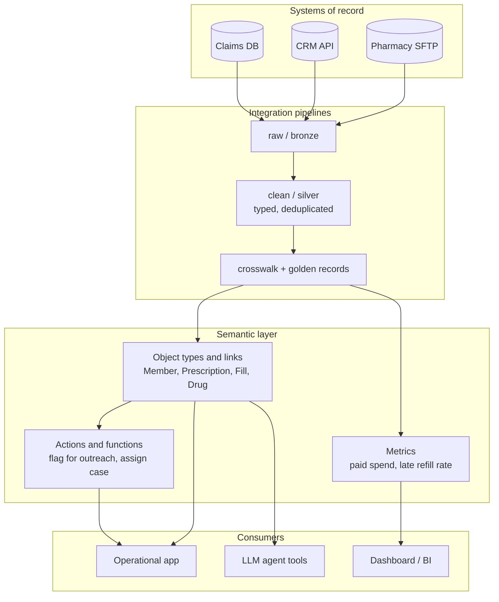
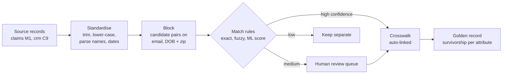
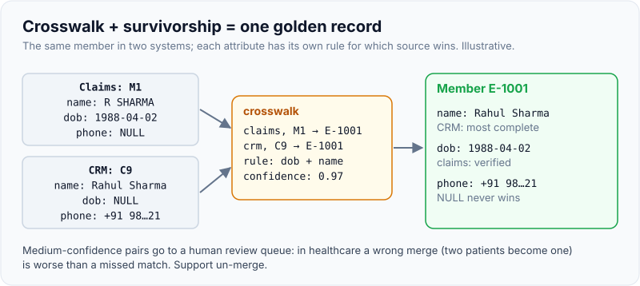
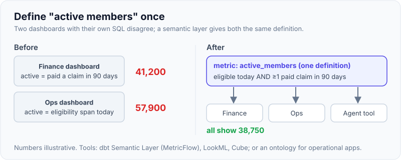
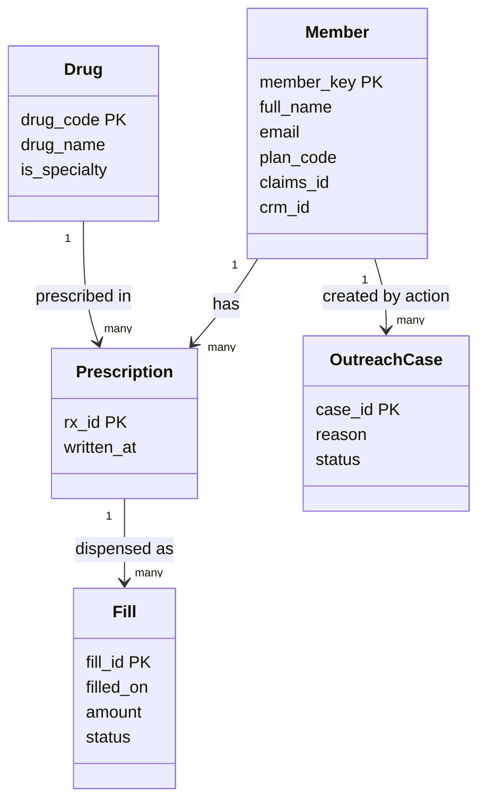

# Semantic Layer & Ontology: Modelling the Customer's Domain (Foundry-Style)

!!! abstract "Key takeaways"
    - A **semantic layer** sits between integrated tables and the people, apps and agents that use them. It names things in the **business's language** and defines them **once**: what a "member" is, which systems contribute to it, how "paid spend" is calculated.
    - Two flavours: a **metrics semantic layer** (dbt Semantic Layer / MetricFlow, LookML, Cube) defines measures and dimensions for analytics; an **operational ontology** (Palantir Foundry) defines **object types, properties, link types and action types** that applications read and write.
    - The hard part of integration is **identity**: the same member is `M1` in claims and `C9` in the CRM. Build a **crosswalk** (system + source ID → enterprise key, with match rule and confidence) and a **golden record** with explicit **survivorship rules** per attribute.
    - In Foundry, each object type is backed by a datasource and needs a **unique, non-null primary key**; links behave like foreign keys (many-to-many needs a join dataset); actions are governed edits that merge with the source data in the Ontology's storage layer.
    - Model **from the decision, in the user's words**, not from the source schemas. One `Member` object fed by two systems beats `ClaimsMember` and `CrmContact`.

## Why it matters

After the pipes ([page 1](01-integrating-with-legacy-systems-of-record-databases-files-sf.md)) and the pipelines ([page 2](02-etl-vs-elt-batch-vs-streaming-orchestration-and-dbt.md)), the customer has clean tables. They still can't answer "show me members on specialty drugs whose refills are late" without knowing which of five tables to join and how. A semantic layer turns tables into concepts that every dashboard, application and LLM agent shares, so "paid spend" means the same thing in all of them.

This is Palantir's core pitch: the Ontology maps an organisation's data to its real-world objects and actions, so operational apps and AI (AIP) work with "patients", "aircraft" or "shipments" instead of tables. Other platforms reach the same place with metrics layers and knowledge graphs. In FDE interviews this shows up in decomposition and design rounds: *"Five systems describe the same customers differently. How would you build one model of the business?"*

The [object-modelling page](../fde-decomposition-scoping/02-from-vague-business-goal-to-data-and-object-model.md) covers how to derive objects, links, actions and events from a vague prompt in a live round. This page goes deeper on the **integration** side: mapping many source datasets to one model, resolving identity, defining metrics once, and keeping the model correct as sources change.

## Core concepts

### Where the semantic layer sits


*Notice that consumers never touch source tables. When the CRM is replaced next year, only the pipeline into the crosswalk changes; apps, dashboards and agent tools keep working.*

### Metrics layer vs ontology vs dimensional model

| | Dimensional model (star schema) | Metrics semantic layer | Operational ontology |
|---|---|---|---|
| Unit | Facts and conformed dimensions | Semantic models: entities, dimensions, measures → metrics | Object types, properties, links, actions |
| Main consumer | BI tools, analysts writing SQL | BI tools and APIs asking for "metric by dimension" | Operational apps, workflows, AI agents |
| Writes? | No | No | Yes, through governed actions |
| Example tech | Kimball marts in dbt | dbt Semantic Layer (MetricFlow), LookML, Cube | Palantir Foundry Ontology, knowledge graphs |
| Strength | Fast, well understood | One definition of each metric | Decisions and actions on live objects |

They stack rather than compete: dimensional marts often back both the metrics layer and the ontology's objects.

### Identity: crosswalks and golden records

The same real-world entity has different IDs, spellings and values in each system. Integration needs two artefacts:

1. **Crosswalk (cross-reference) table:** one row per `(system, source_id)` mapped to a stable **enterprise key** (`MBR-0001`), with the **match rule** and **confidence** that produced the link. Never reuse enterprise keys; merges and splits are recorded, not overwritten.
2. **Golden record:** one row per enterprise key, with each attribute chosen by a **survivorship rule**: source priority per attribute (CRM wins for contact details, claims wins for plan), most recent non-null, or most frequent.


*Notice the review queue. In healthcare and banking a wrong merge (two patients become one) is worse than a missed match, so medium-confidence pairs go to a person.*

{ loading=lazy }
*One rule per attribute, and NULL never wins.*

Matching approaches, from simple to sophisticated: deterministic rules on strong identifiers (national ID, MRN plus DOB); normalised exact matches (email, phone); fuzzy matching (Jaro-Winkler on names, address normalisation); probabilistic or ML scoring (Fellegi-Sunter, libraries such as Splink). Start deterministic, measure precision with the business, add fuzziness only where it pays.

### The Foundry Ontology, in integration terms

Palantir's documentation describes the Ontology's **semantic** elements (objects, properties, links) and **kinetic** elements (actions, functions, dynamic security):

| Ontology concept | Integration meaning | Rule of thumb |
|---|---|---|
| **Object type** | A business entity or event, backed by one or more datasources (datasets, restricted views, streams) | Like a dataset; each object is like a row |
| **Primary key** | Unique, non-null identifier; Foundry validates both when saving | Use the enterprise key from the crosswalk, not a source ID |
| **Property** | A column of the backing data, typed | Analogous to a column; shared properties reuse one definition across types |
| **Link type** | Relationship between two object types | Foreign key for one-to-many; a join dataset for many-to-many |
| **Action type** | A governed change users can make (edit objects, properties, links) with rules and side effects | Writes land in Ontology storage and merge with source data |
| **Function** | Code that computes over objects or backs complex actions | Derived values and business logic |
| **Interface** | A shared shape (properties, links, actions) several object types implement | "Inspectable" across vehicles, equipment and facilities |

**Object Storage V2** is the current backend; its Object Data Funnel orchestrates writes from datasources and from action edits. A practical consequence: user edits and pipeline data must agree on the primary key, and you must decide what happens when a pipeline update conflicts with a user's edit.

Foundry's **Ontology SDK (OSDK)** generates typed clients (TypeScript first) from the ontology, so external apps and agents query objects and call actions instead of writing SQL.

### Metrics defined once: dbt MetricFlow

MetricFlow builds a semantic graph from YAML: **semantic models** (one per dbt model) declare **entities** (join keys: primary, foreign, unique, natural), **dimensions** (categorical or time) and **measures** (aggregations); **metrics** (simple, ratio, cumulative, derived) build on them. MetricFlow then generates the SQL, including joins via entities, for any requested metric and dimension combination.

{ loading=lazy }
*Define it once, reference it everywhere.*

## In practice: code & configuration

### Model the business, not the sources

=== "❌ Common mistake"
    ```text
    Object types copied from source tables:
      ClaimsMember   (pk: member_id "M1")        -- claims system's ID
      CrmContact     (pk: contact_id "C9")       -- CRM's ID, same person
      FillRecordV2   (pk: fill_id, has member_id "M1", amount, status)

    Metric defined in each dashboard:
      Dashboard A: SUM(amount)                         -- includes reversals
      Dashboard B: SUM(amount) WHERE status = 'PAID'   -- different answer, same name
    ```
    Users must know that `M1` and `C9` are the same person; two dashboards disagree on "spend"; replacing the CRM breaks every app that used `CrmContact`.

=== "✅ Correct approach"
    ```text
    Object types in the business's words, keyed by the enterprise key:
      Member        (pk: member_key "MBR-0001", golden-record properties, source IDs as properties)
      Prescription  (pk: rx_id)            Member 1 --- * Prescription
      Fill          (pk: fill_id)          Prescription 1 --- * Fill
      Drug          (pk: drug_code)        Drug 1 --- * Prescription

    One metric definition, in the semantic layer:
      paid_spend = SUM(amount) over fills with status = 'PAID'
    Actions: flag_member_for_outreach, assign_case (with rules and audit)
    ```


*Notice `OutreachCase` has no source system: it is created by a user action. Ontologies hold decisions as well as integrated data, which is what makes them operational rather than analytical.*

### Crosswalk and golden record (PostgreSQL)

```sql
-- Crosswalk: one row per (system, source id) -> enterprise member key
CREATE TABLE member_xref (
  member_key   text NOT NULL,              -- our stable ID, never reused
  system       text NOT NULL,
  source_id    text NOT NULL,
  match_rule   text NOT NULL,              -- how we decided: 'email_exact', 'manual', 'self'
  confidence   numeric(3,2) NOT NULL,
  PRIMARY KEY (system, source_id)          -- a source record maps to exactly one member
);
INSERT INTO member_xref VALUES
 ('MBR-0001','claims','M1','self',1.00), ('MBR-0001','crm','C9','email_exact',0.90),
 ('MBR-0002','claims','M2','self',1.00), ('MBR-0003','claims','M3','self',1.00),
 ('MBR-0004','crm','C7','self',1.00);

-- Survivorship: which system wins for each attribute
CREATE TABLE source_priority (attribute text, system text, priority int, PRIMARY KEY (attribute, system));
INSERT INTO source_priority VALUES
 ('full_name','crm',1),('full_name','claims',2),
 ('email','crm',1),('email','claims',2),
 ('plan_code','claims',1),('plan_code','crm',2);

WITH latest AS (
  SELECT DISTINCT ON (source, member_id) source AS system, member_id AS source_id,
         full_name, lower(btrim(email)) AS email, plan_code, updated_at
  FROM raw_member ORDER BY source, member_id, updated_at DESC, ingest_id DESC
), attrs AS (           -- unpivot to (member_key, attribute, value, system)
  SELECT x.member_key, a.attribute, a.value, l.system, l.updated_at
  FROM latest l
  JOIN member_xref x ON x.system = l.system AND x.source_id = l.source_id
  CROSS JOIN LATERAL (VALUES ('full_name', l.full_name), ('email', l.email),
                             ('plan_code', l.plan_code)) AS a(attribute, value)
  WHERE a.value IS NOT NULL                          -- a NULL never beats a real value
), ranked AS (
  SELECT a.*, ROW_NUMBER() OVER (PARTITION BY member_key, attribute
                                 ORDER BY p.priority, a.updated_at DESC) AS rn
  FROM attrs a JOIN source_priority p USING (attribute, system)
)
SELECT member_key,
       max(value) FILTER (WHERE attribute = 'full_name') AS full_name,
       max(value) FILTER (WHERE attribute = 'email')     AS email,
       max(value) FILTER (WHERE attribute = 'plan_code') AS plan_code,
       string_agg(DISTINCT system, ',')                  AS contributing_systems
FROM ranked WHERE rn = 1
GROUP BY member_key ORDER BY member_key;
```
```text
 member_key | full_name  |       email       | plan_code | contributing_systems
------------+------------+-------------------+-----------+----------------------
 MBR-0001   | Asha Rao   | asha@example.com  | PLAT      | claims,crm
 MBR-0002   | Dev Shah   |                   | SILVER    | claims
 MBR-0003   | Chen Li    | chen@example.com  |           | claims
 MBR-0004   | Farid Khan | farid@example.com |           | crm
```
Run on PostgreSQL 16 against the [take-home dataset](03-sql-for-take-homes-multi-table-joins-window-functions-null-h.md). Asha's name comes from the CRM ("Asha Rao", not the claims typo "Asha R.") and her plan from claims, because the rules say so, in a table the business can read and change. `contributing_systems` gives lineage per golden record.

### Metrics once, in MetricFlow YAML

```yaml
semantic_models:
  - name: fills
    description: One row per dispensing event.
    model: ref('fct_fills')
    defaults:
      agg_time_dimension: filled_on
    entities:
      - name: fill
        type: primary
        expr: fill_id
      - name: member              # join path to the members semantic model
        type: foreign
        expr: member_id
    dimensions:
      - name: filled_on
        type: time
        type_params:
          time_granularity: day
      - name: status
        type: categorical
    measures:
      - name: paid_amount
        agg: sum
        expr: "case when status = 'PAID' then amount else 0 end"   # the business rule lives here, once
      - name: fill_count
        agg: count
        expr: fill_id
  - name: members
    model: ref('stg_members')
    entities:
      - name: member
        type: primary
        expr: member_id
    dimensions:
      - name: plan_code
        type: categorical
metrics:
  - name: paid_spend
    label: Paid spend
    description: Sum of amounts on PAID fills. Reversed and pending fills excluded.
    type: simple
    type_params:
      measure: paid_amount
  - name: fill_count_metric
    label: Fills
    type: simple
    type_params:
      measure: fill_count
  - name: avg_paid_per_fill
    label: Average paid per fill
    type: ratio
    type_params:
      numerator: paid_spend
      denominator: fill_count_metric
```

Validated with `dbt parse` on dbt-core 1.12 (with the required `metricflow_time_spine` model); a deliberately misspelled measure produced a parsing error, so the semantic graph is checked at parse time. A query for `paid_spend` by `member__plan_code` is resolved by joining `fills` to `members` through the `member` entity. Newer dbt docs also describe a simplified metric syntax for 1.12+; check the version the customer runs.

### Ontology as code: validate before publishing

```python
"""A tiny ontology-as-code: object types backed by datasets, links checked like foreign keys."""
from dataclasses import dataclass

import pandas as pd

@dataclass(frozen=True)
class ObjectType:
    api_name: str
    backing: pd.DataFrame          # in Foundry: the backing datasource; here a DataFrame
    primary_key: str
    title_property: str

    def validate(self) -> list[str]:
        pk = self.backing[self.primary_key]
        problems = []
        if pk.isna().any():
            problems.append(f"{self.api_name}: null primary key")
        if pk.duplicated().any():
            problems.append(f"{self.api_name}: duplicate primary key {sorted(pk[pk.duplicated()].unique())}")
        return problems

@dataclass(frozen=True)
class LinkType:
    api_name: str
    source: ObjectType             # the "many" side holds the foreign key
    target: ObjectType
    foreign_key: str

    def validate(self) -> list[str]:
        fk = self.source.backing[self.foreign_key].dropna()
        orphans = sorted(set(fk) - set(self.target.backing[self.target.primary_key]))
        return [f"{self.api_name}: {len(orphans)} orphan(s) {orphans}"] if orphans else []

    def traverse(self, target_pk) -> pd.DataFrame:
        return self.source.backing[self.source.backing[self.foreign_key] == target_pk]

members = pd.DataFrame({"member_key": ["MBR-0001", "MBR-0002", "MBR-0003", "MBR-0004"],
                        "full_name": ["Asha Rao", "Dev Shah", "Chen Li", "Farid Khan"],
                        "plan_code": ["PLAT", "SILVER", None, None]})
fills = pd.DataFrame({"fill_id": [1, 2, 3, 4, 8, 9],
                      "member_key": ["MBR-0001"] * 4 + ["MBR-0003", "MBR-9999"],
                      "status": ["PAID"] * 6,
                      "amount": [12.0, 12.0, 12.0, 5400.0, 12.0, 1.0]})

Member = ObjectType("Member", members, "member_key", "full_name")
Fill = ObjectType("Fill", fills, "fill_id", "fill_id")
member_fills = LinkType("memberFills", source=Fill, target=Member, foreign_key="member_key")

print(Member.validate() + Fill.validate() + member_fills.validate())
# ["memberFills: 1 orphan(s) ['MBR-9999']"]   <- a fill whose member isn't in the crosswalk yet
print(member_fills.traverse("MBR-0001")["amount"].sum())   # 5436.0: "Asha's fills" is a link traversal
```

The orphan is the integration signal you want: a fill arrived for a member the crosswalk hasn't resolved. Decide whether to hold it, create a provisional member, or route it to the review queue, and make that a visible metric.

## Real-world usage

- **Palantir Foundry** deployments (defence, healthcare, manufacturing, energy) centre on building the Ontology over integrated datasets; AIP agents then use object types and actions as their tools, which keeps LLM actions inside governed, audited operations.
- **dbt Semantic Layer** and **LookML** serve consistent metrics to BI tools, notebooks and LLM interfaces; "one definition of revenue" is the usual business case.
- **Healthcare:** master patient indexes (MPI) do exactly the crosswalk-and-survivorship job; FHIR resources (Patient, Encounter, MedicationDispense) are a ready-made vocabulary to borrow for object names.
- **Banking:** customer master data and KYC rely on entity resolution across products; wrong merges create compliance incidents, so review queues and audit trails are mandatory.
- **Known failure mode:** modelling one object type per source table. It ships fast and fails at the first source replacement or the first cross-system question.

## Trade-offs & production gotchas

| Choice | Pros | Cons | Use when |
|---|---|---|---|
| Deterministic matching | Explainable, precise | Misses typos and variants | Start here; regulated domains |
| Probabilistic / ML matching | Higher recall | Needs tuning, review, explanation | Large, messy person or company data |
| Source priority survivorship | Simple, business-readable | Ignores freshness | Clear system ownership per attribute |
| Most-recent-wins | Fresh | A bad recent update wins | Attributes with no clear owner |
| Metrics layer only | Consistent BI numbers | No writes, no workflows | Analytics-first engagements |
| Full operational ontology | Apps, actions, agents on one model | More design and governance | Operational decisions are the goal |

!!! warning "Gotchas"
    - **Source IDs as primary keys** tie the model to one system. Use the enterprise key; keep source IDs as properties.
    - **Silent merges** of two people are very hard to undo. Record match rule, confidence and who approved; support un-merge.
    - **Metric definitions in dashboards** drift apart. Put them in the semantic layer and have dashboards reference them.
    - **Edits vs pipeline updates:** decide whether a user's action edit or the next pipeline run wins for each property, and document it.
    - **Over-modelling:** an ontology of the whole enterprise in month one never ships. Model the objects the first decision needs ([decomposition](../fde-decomposition-scoping/02-from-vague-business-goal-to-data-and-object-model.md)).

!!! question "Interview angle"
    If asked "how would you integrate five systems that describe customers differently?", say the three artefacts out loud: a crosswalk with match rules and confidence, a golden record with survivorship rules the business owns, and a semantic layer (objects and metrics) that consumers use instead of source tables.

## How this connects to my experience

- **Where it applies:** not a resume claim as "ontology" or "semantic layer". Closest: OptumRx Meteor, *"Owned the GraphQL Consumer Service end-to-end, acting as the integration layer between 5 upstream systems and multiple downstream consumers."* A GraphQL schema is a semantic layer for APIs: typed objects, fields, relationships and mutations (actions) over several systems of record. Deloitte's *"secure data discovery platforms"* (ConvergeHealth Data Asset Explorer) relates to making datasets findable as business concepts.
- **Talking points:**
    - Designing the consumer-facing schema meant naming entities in the business's language and hiding which upstream owned which field: the same goal as an ontology. *[confirm: an entity whose fields came from more than one upstream, and the rule for which upstream won]*
    - Identity across upstreams (member IDs in different formats) is the crosswalk problem. *[confirm: whether Meteor had to map member or prescription IDs between systems]*
    - GraphQL resolvers that compute derived fields are the equivalent of ontology functions; mutations with validation are action types.
- **Likely follow-up chain:** "How did your GraphQL schema handle data owned by two upstreams?" (field-level ownership, survivorship) → "How would you build that as a Foundry ontology?" (object types keyed by enterprise key, links, actions for edits) → "How do you stop two dashboards disagreeing on a metric?" (metrics semantic layer, one definition, referenced everywhere).

## Interview questions

### Fundamentals

??? question "Q1. What is a semantic layer, and what problem does it solve?"
    **Answer:** A layer between integrated data and its consumers that defines business concepts (entities, relationships, metrics) once, in business language. It stops every dashboard, app and agent from re-implementing joins and metric logic differently, and it isolates consumers from source-system changes.

    **Interviewer listens for:** single definition, business language, decoupling.

    **Common wrong answer:** "A set of database views."

??? question "Q2. What are the building blocks of the Palantir Foundry Ontology?"
    **Answer:** Object types (entities or events, backed by datasources, each with a unique non-null primary key), properties, link types (relationships, many-to-many via a join dataset), action types (governed edits with rules and side effects) and functions (code over objects). Palantir groups objects, properties and links as semantic elements and actions, functions and security as kinetic elements; interfaces describe shared shapes across object types.

    **Interviewer listens for:** semantic vs kinetic, primary key rules, actions as governed writes.

    **Common wrong answer:** "It's a graph database."

??? question "Q3. What is a crosswalk table?"
    **Answer:** A mapping from each source system's identifier to a stable enterprise key, one row per `(system, source_id)`, with the rule and confidence that created the link and an audit of changes. It is how all downstream models join records about the same entity across systems.

    **Interviewer listens for:** stable enterprise key, rule and confidence, audit.

    **Common wrong answer:** "Just join on email."

### Intermediate

??? question "Q4. What are survivorship rules?"
    **Answer:** Per-attribute rules that choose the value for the golden record when sources disagree: source priority (CRM owns contact details), most recent non-null, most frequent, or most trusted. They should live in a table or config the business can review, and NULLs should never override real values.

    **Interviewer listens for:** per attribute, business-owned, NULL handling.

    **Common wrong answer:** "Take the latest record."

??? question "Q5. Metrics layer or ontology: when do you need which?"
    **Answer:** A metrics layer is enough when the goal is consistent analytics: dashboards and reports asking for measures by dimensions. An operational ontology is needed when users or agents act on individual objects (assign, approve, flag) and those actions must be governed, audited and written back. Many deployments use both over the same marts.

    **Interviewer listens for:** analytics vs operations, writes.

    **Common wrong answer:** "Ontology is just a fancier metrics layer."

??? question "Q6. How do you model a many-to-many relationship in an ontology?"
    **Answer:** With a join dataset (one row per pair) backing the link, or by promoting the relationship to its own object type when it has properties (for example `CareTeamAssignment` between Clinician and Patient with role and dates). Same idea as a join table in relational modelling.

    **Interviewer listens for:** join dataset, promote to object when it has attributes.

    **Common wrong answer:** "Store a list of IDs in a property."

### Senior

??? question "Q7. How would you design entity resolution for patients across three hospital systems?"
    **Answer:** Standardise fields (names, DOB, addresses, phone), block candidate pairs on cheap keys, apply deterministic rules on strong identifiers first, then probabilistic scoring for the rest. Auto-link above a high threshold, send a middle band to human review, keep low scores separate. Store links in a crosswalk with rule, score, reviewer and timestamps; support un-merge; measure precision and recall with clinical staff. Bias toward precision, because a wrong merge is a patient-safety issue.

    **Interviewer listens for:** blocking, thresholds, review, un-merge, precision bias.

    **Common wrong answer:** "Use an ML model and merge everything above 0.5."

??? question "Q8. A user edits a property through an action, then tonight's pipeline brings a different value. Which wins?"
    **Answer:** It must be a deliberate per-property decision. Options: user edits win until the source changes again; source always wins (edits are temporary overrides); or the edit is written back to the source system so both agree. Document the rule, show users when an edit was overridden, and keep an audit of both values. In Foundry this is configured as part of how action edits and datasource updates are merged.

    **Interviewer listens for:** explicit conflict policy, audit, write-back option.

    **Common wrong answer:** "Last write wins" without saying whose.

### Scenario-based

??? question "Q9. Two executives see different 'active members' numbers. How do you fix it for good?"
    **Answer:** Find both definitions (often different status filters or date logic), agree one definition (or two clearly named metrics) with the owners, encode it once in the semantic layer, point both dashboards at it, and add a test that reconciles the metric with an independent count. Communicate the change and the old vs new numbers.

    **Interviewer listens for:** one definition, ownership, communication.

    **Common wrong answer:** "Pick the bigger number."

??? question "Q10. The customer is replacing their CRM in six months. How does your model survive?"
    **Answer:** Consumers depend on the `Member` object and metrics, not CRM tables. Add the new CRM as another source in the crosswalk (map its IDs to existing enterprise keys, often via the old CRM's IDs during migration), update survivorship priorities, run both in parallel, reconcile, then retire the old source. Apps and agents don't change.

    **Interviewer listens for:** enterprise keys, parallel run, consumers untouched.

    **Common wrong answer:** "Rebuild the object types for the new CRM."

## Cheat sheet

| Concept | Remember |
|---|---|
| Semantic layer | Business concepts and metrics defined once, consumers isolated from sources |
| Metrics layer | Entities, dimensions, measures → metrics (MetricFlow: simple, ratio, cumulative, derived) |
| Ontology | Object types, properties, links, actions, functions; semantic vs kinetic |
| Primary key | Unique, non-null; use the enterprise key |
| Crosswalk | `(system, source_id)` → enterprise key + rule + confidence |
| Golden record | Survivorship per attribute; NULL never wins |
| Matching | Deterministic first; review queue for the middle band; support un-merge |
| Conflicts | Decide edit-vs-pipeline precedence per property |

## Sources
1. [Palantir Foundry: Ontology overview](https://palantir.com/docs/foundry/ontology/overview/) and [core concepts](https://www.palantir.com/docs/foundry/ontology/core-concepts): object, link and action types; semantic and kinetic elements.
2. [Palantir Foundry: Ontology architecture (Object Storage V2)](https://palantir.com/docs/foundry/object-backend/overview/): Object Data Funnel, datasource and action-edit writes.
3. [Palantir Foundry: Properties overview](https://palantir.com/docs/foundry/object-link-types/properties-overview), [shared properties](https://palantir.com/docs/foundry/object-link-types/shared-property-metadata/) and [interfaces](https://www.palantir.com/docs/foundry/interfaces/interface-overview): property/column analogy, shared properties, interface shapes and OSDK support.
4. [Palantir Learn: saving Ontology changes](https://palantir.com/docs/foundry/learning-application-appdev-02/06): primary key uniqueness and non-null validation.
5. [dbt docs: About MetricFlow](https://docs.getdbt.com/docs/build/about-metricflow) and [Semantic models](https://docs.getdbt.com/docs/build/semantic-models): entities, dimensions, measures, metric types.
6. [Palantir Foundry: Ontology design structural guidance](https://www.palantir.com/docs/foundry/ontology/ontology-structural-guidance): modelling guidance for object types and interfaces.
7. [Splink documentation](https://moj-analytical-services.github.io/splink/): probabilistic record linkage (Fellegi-Sunter) used for entity resolution at scale.
8. [HL7 FHIR R5 resource list](https://hl7.org/fhir/R5/resourcelist.html): Patient, MedicationRequest, MedicationDispense as a domain vocabulary.
